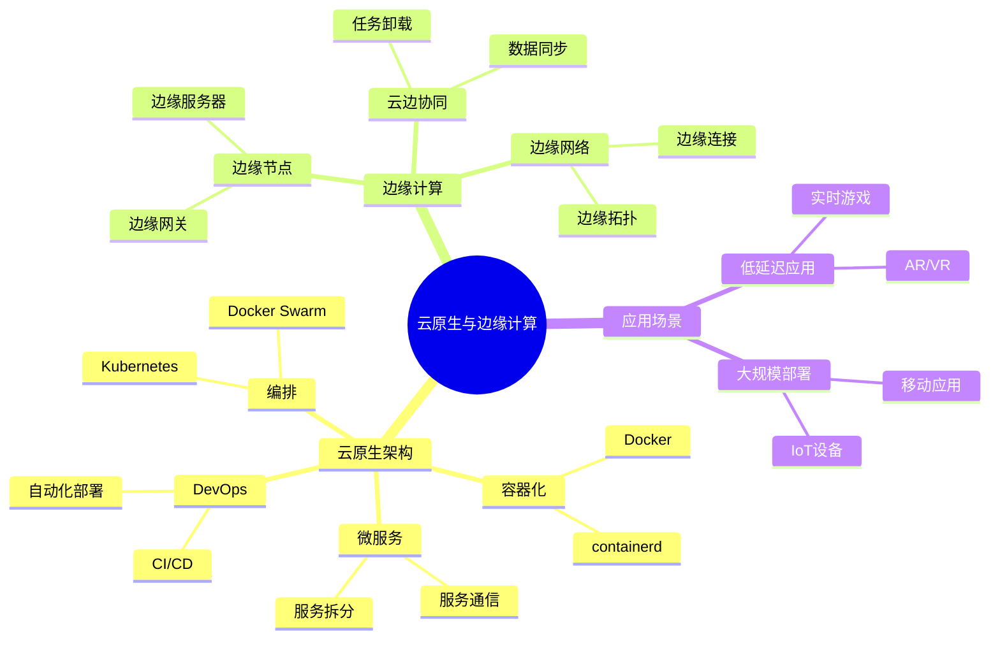
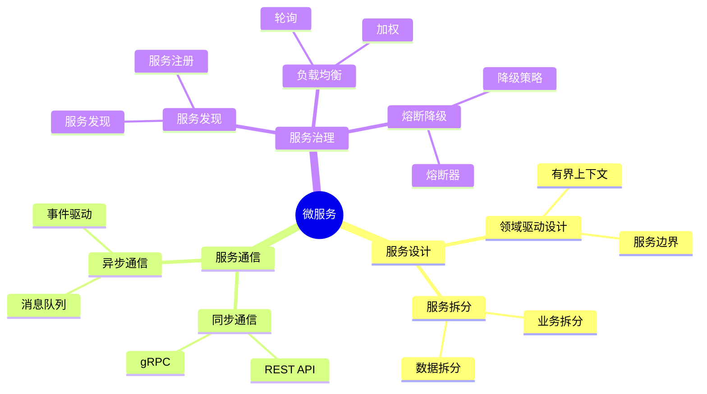
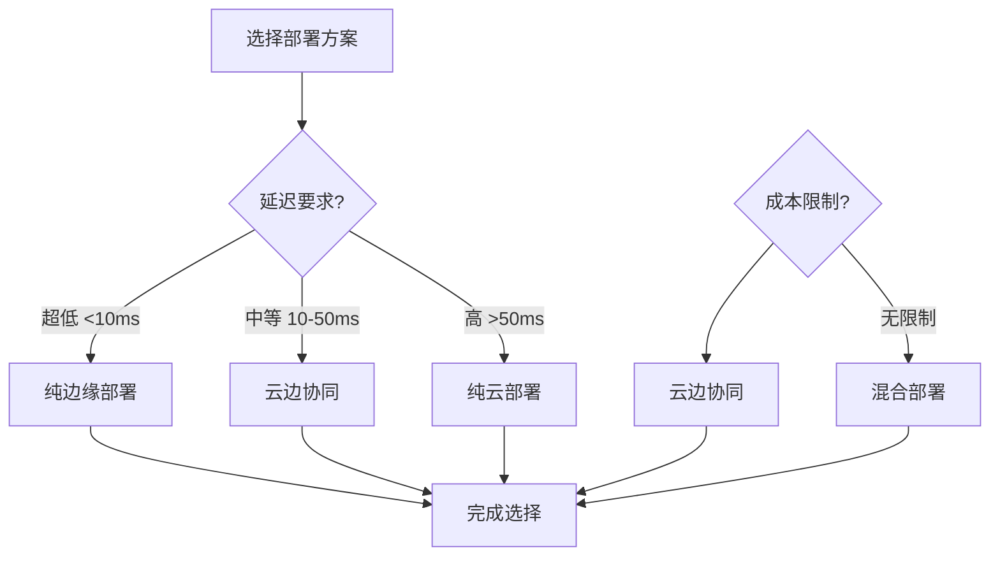
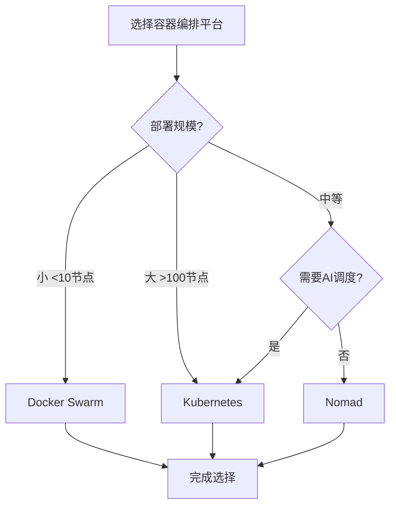
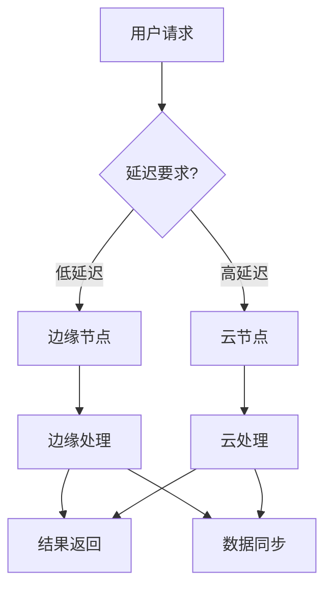
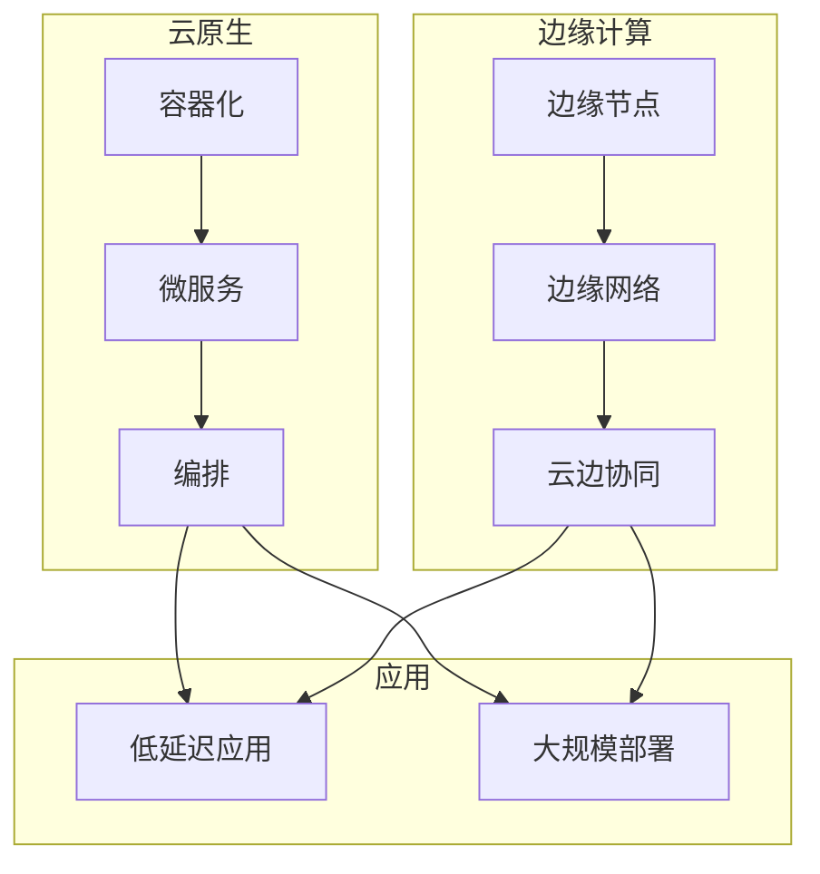

# 云原生与边缘计算专题思维表征工具 / Cloud Native and Edge Computing Special Topic Mental Representation Tools 2024-2025

## 📚 **概述 / Overview**

本文档为云原生与边缘计算专题提供完整的思维表征工具集合，包括思维导图、对比矩阵、决策树、数据流图等多种表征方式。

**创建时间**: 2025年1月
**状态**: ✅ 完成
**专题**: 云原生与边缘计算（2024-2025最新研究）
**相关文档**: [云原生与边缘计算专题-2024-2025.md](云原生与边缘计算专题-2024-2025.md)

---

## 🗺️ **一、思维导图 / Mind Maps**

### 1.1 云原生与边缘计算完整思维导图

### 1.2 微服务架构思维导图

---

## 📊 **二、对比矩阵 / Comparison Matrices**

### 2.1 容器编排平台对比矩阵

| 平台 | 复杂度 | 功能 | 社区支持 | 适用场景 | 2024-2025创新 |
|------|--------|------|---------|---------|--------------|
| **Kubernetes** | 高 | 丰富 | 强 | 大规模生产 | AI驱动调度 |
| **Docker Swarm** | 低 | 基础 | 中等 | 小规模部署 | 简化管理 |
| **Nomad** | 中等 | 中等 | 中等 | 混合工作负载 | 多平台支持 |

### 2.2 部署方案对比矩阵

| 部署方案 | 延迟 | 成本 | 可扩展性 | 适用场景 |
|---------|------|------|---------|---------|
| **纯云部署** | 高 | 低 | 高 | 非实时应用 |
| **纯边缘部署** | 低 | 高 | 低 | 超低延迟应用 |
| **云边协同** | 中等 | 中等 | 高 | 平衡场景 |
| **混合部署** | 可变 | 中等 | 高 | 复杂场景 |

### 2.3 微服务通信方式对比矩阵

| 通信方式 | 延迟 | 可靠性 | 复杂度 | 适用场景 |
|---------|------|--------|--------|---------|
| **REST API** | 中等 | 中等 | 低 | 同步调用 |
| **gRPC** | 低 | 高 | 中等 | 高性能调用 |
| **消息队列** | 高 | 高 | 高 | 异步处理 |
| **事件驱动** | 中等 | 中等 | 高 | 解耦场景 |

---

## 🌳 **三、决策树 / Decision Trees**

### 3.1 部署方案选择决策树

### 3.2 容器编排平台选择决策树

---

## 🔄 **四、数据流图 / Data Flow Diagrams**

### 4.1 Kubernetes部署流程数据流

### 4.2 云边协同数据流

---

## 🗺️ **五、概念地图 / Concept Maps**

### 5.1 云原生与边缘计算核心概念关系

---

## 📈 **六、学习路径 / Learning Paths**

### 6.1 云原生与边缘计算学习逻辑路径

---

**文档版本**: v1.0
**创建时间**: 2025年1月
**最后更新**: 2025年1月
**维护者**: GraphNetWorkCommunicate项目组
**状态**: ✅ 完成
