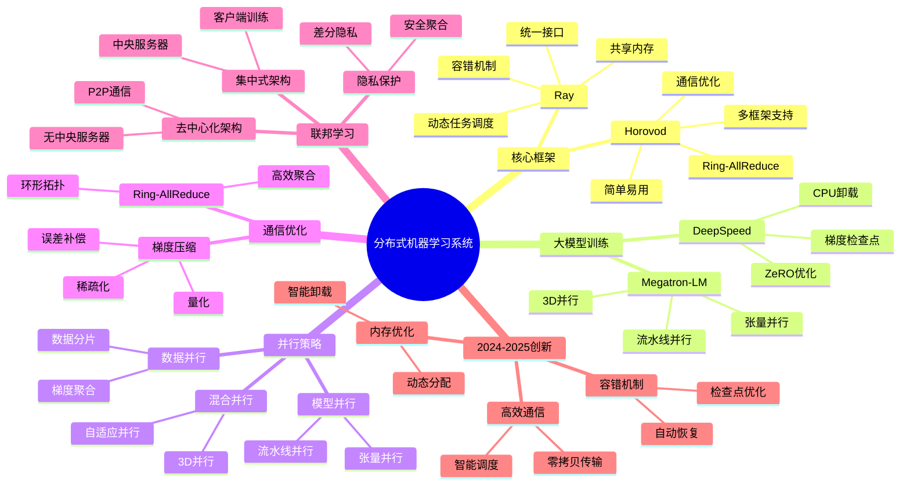
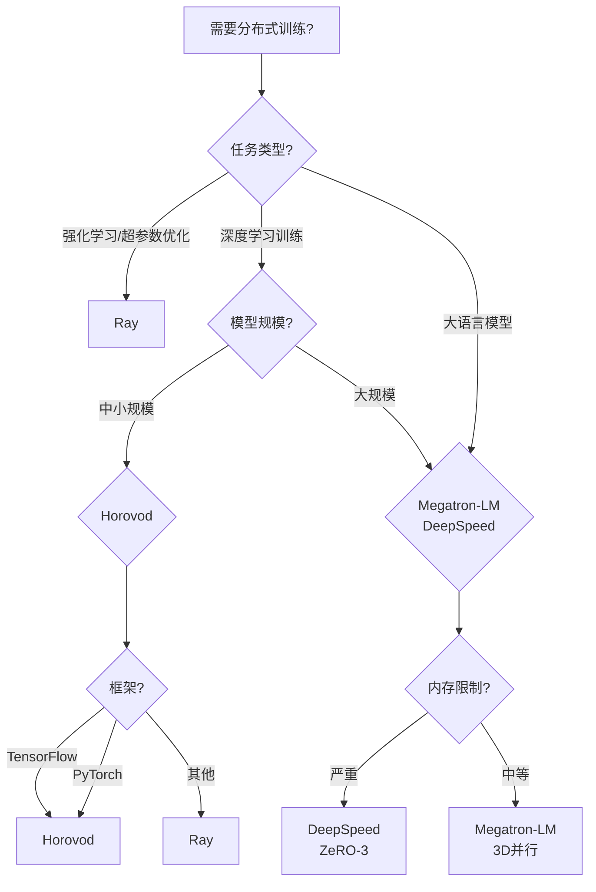
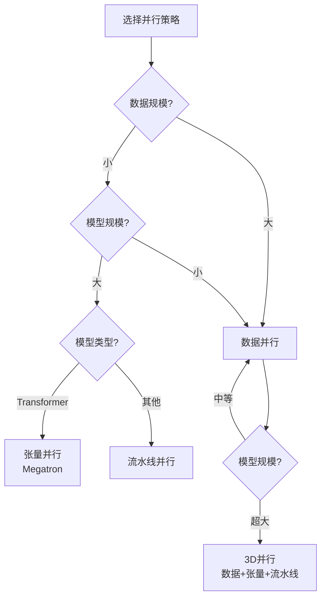
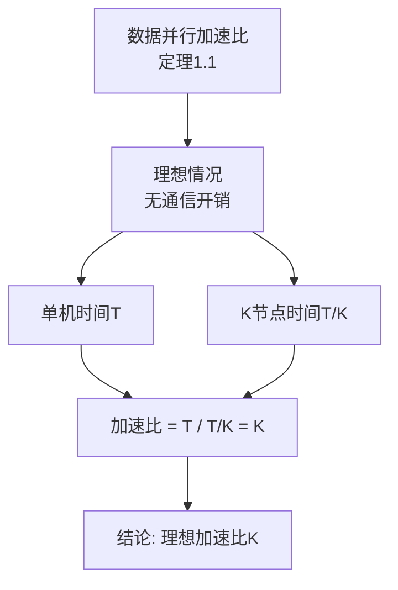
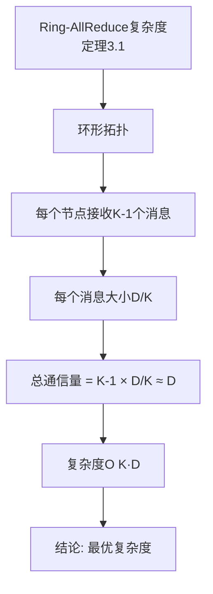
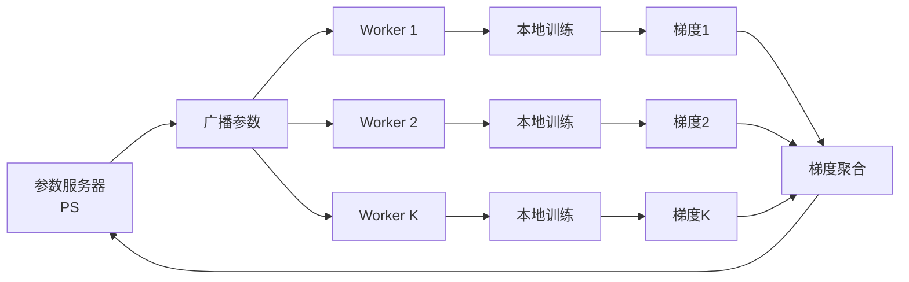
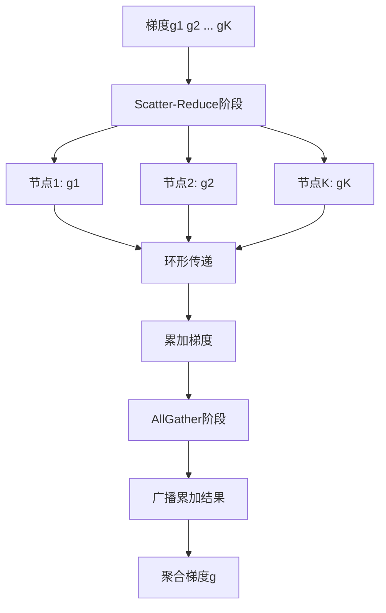
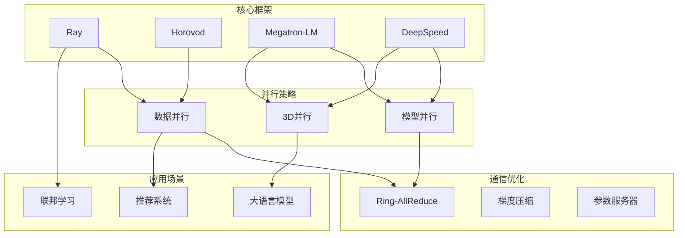
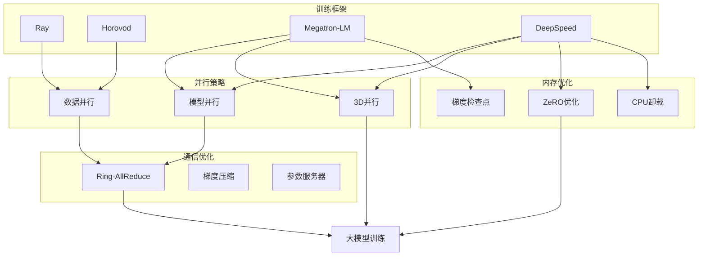
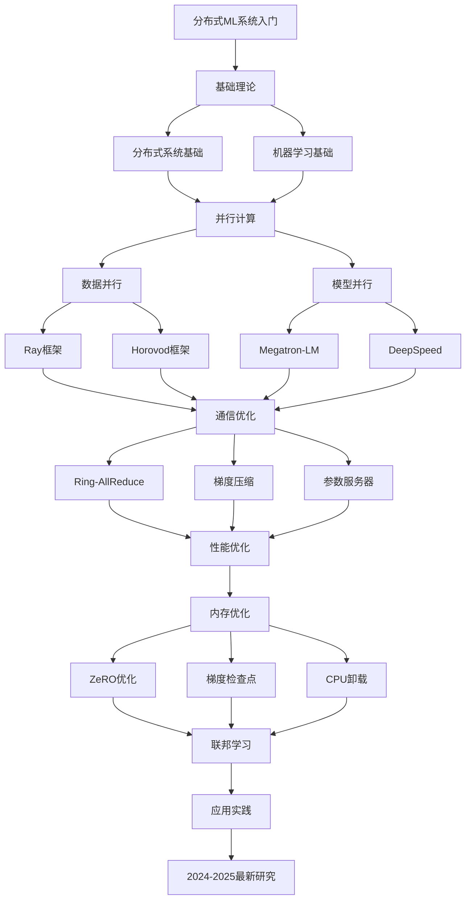

# 分布式机器学习系统专题思维表征工具 / Distributed Machine Learning Systems Special Topic Mental Representation Tools 2024-2025

## 📚 **概述 / Overview**

本文档为分布式机器学习系统专题提供完整的思维表征工具集合，包括思维导图、对比矩阵、决策树、证明树、数据流图、概念地图等多种表征方式。

**创建时间**: 2025年1月
**状态**: ✅ 完成
**专题**: 分布式机器学习系统（2024-2025最新研究）
**相关文档**: [分布式机器学习系统专题-2024-2025.md](分布式机器学习系统专题-2024-2025.md)

---

## 🗺️ **一、思维导图 / Mind Maps**

### 1.1 分布式机器学习系统完整思维导图

---

## 📊 **二、对比矩阵 / Comparison Matrices**

### 2.1 分布式训练框架对比矩阵

| 框架 | 核心特性 | 优势 | 劣势 | 适用场景 | 2024-2025创新 |
|------|---------|------|------|---------|--------------|
| **Ray** | 通用分布式计算 | 灵活、易用、容错 | 学习曲线陡 | 强化学习、超参数优化 | 高效通信、智能调度 |
| **Horovod** | 深度学习专用 | 简单、高效、多框架 | 主要支持数据并行 | 深度学习训练 | 自适应通信、混合精度优化 |
| **Megatron-LM** | 大模型训练 | 3D并行、高效 | 主要支持Transformer | 大语言模型训练 | 3D并行优化 |
| **DeepSpeed** | 内存优化 | ZeRO优化、内存节省 | 配置复杂 | 超大模型训练 | ZeRO-3、CPU卸载优化 |

### 2.2 并行策略对比矩阵

| 并行策略 | 数据分片 | 模型分片 | 通信开销 | 内存占用 | 适用场景 | 2024-2025改进 |
|---------|---------|---------|---------|---------|---------|--------------|
| **数据并行** | 是 | 否 | 中 | 高 | 数据量大 | 梯度压缩、异步更新 |
| **模型并行（张量）** | 否 | 是（层内） | 高 | 低 | 模型大 | 高效张量并行 |
| **模型并行（流水线）** | 否 | 是（层间） | 中 | 低 | 模型深 | 流水线优化 |
| **3D并行** | 是 | 是 | 很高 | 很低 | 超大模型 | 3D并行优化 |

### 2.3 通信算法对比矩阵

| 通信算法 | 通信复杂度 | 带宽需求 | 延迟 | 适用场景 | 2024-2025改进 |
|---------|-----------|---------|------|---------|--------------|
| **AllReduce** | O(K·D) | 高 | 中 | 小规模 | Ring优化 |
| **Ring-AllReduce** | O(K·D) | 中 | 中 | 中等规模 | 自适应拓扑 |
| **Parameter Server** | O(K·D) | 低 | 高 | 大规模 | 异步优化 |
| **Gossip** | O(K²·D) | 中 | 低 | 去中心化 | 高效Gossip |

---

## 🌳 **三、决策树 / Decision Trees**

### 3.1 分布式训练框架选择决策树

### 3.2 并行策略选择决策树

---

## 🔬 **四、证明树 / Proof Trees**

### 4.1 数据并行加速比证明树

### 4.2 Ring-AllReduce复杂度证明树

---

## 🔄 **五、数据流图 / Data Flow Diagrams**

### 5.1 Ray分布式训练数据流

### 5.2 Horovod Ring-AllReduce数据流

---

## 🗺️ **六、概念地图 / Concept Maps**

### 6.1 分布式机器学习系统核心概念关系地图

### 6.2 分布式训练系统架构概念地图

---

## 📈 **七、学习路径图 / Learning Path Diagrams**

### 7.1 分布式机器学习系统学习路径

---

## 📝 **八、总结 / Summary**

### 8.1 思维表征工具使用指南

1. **思维导图**: 快速理解分布式机器学习系统的知识结构
2. **对比矩阵**: 比较不同框架、并行策略、通信算法的优缺点
3. **决策树**: 选择合适框架、并行策略
4. **证明树**: 理解理论证明过程（加速比、复杂度）
5. **数据流图**: 理解分布式训练的执行流程
6. **概念地图**: 理解概念间的关系和系统架构
7. **学习路径图**: 规划学习路径

### 8.2 工具更新说明

本文档将随着分布式机器学习系统领域的发展持续更新，确保包含最新的研究进展和方法。

---

**文档版本**: v1.0
**创建时间**: 2025年1月
**最后更新**: 2025年1月
**维护者**: GraphNetWorkCommunicate项目组
**状态**: ✅ 完成
