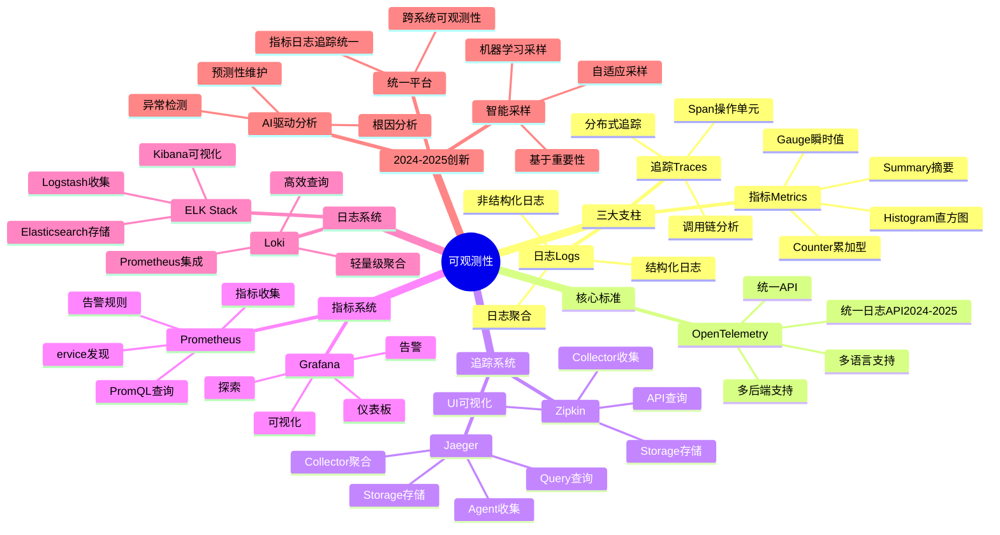
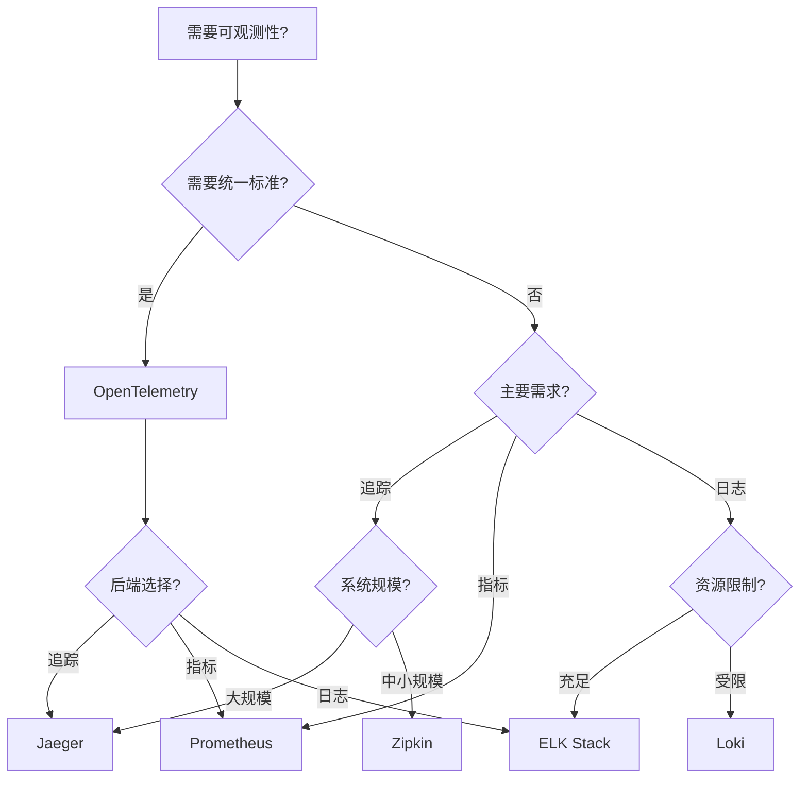
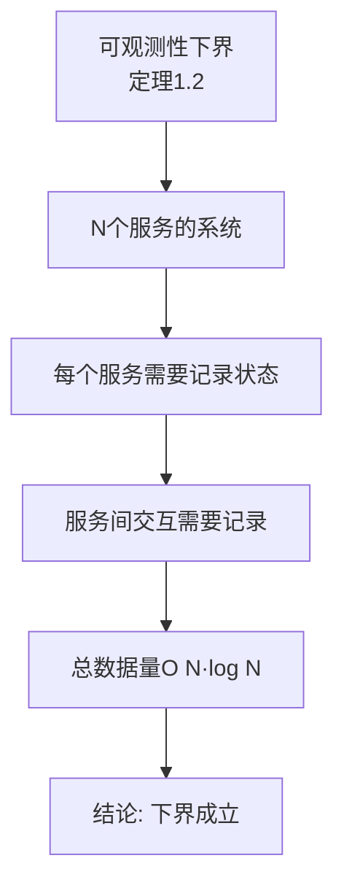
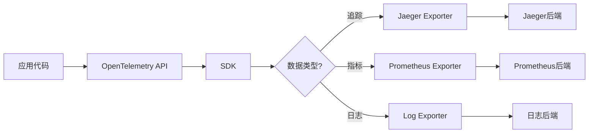
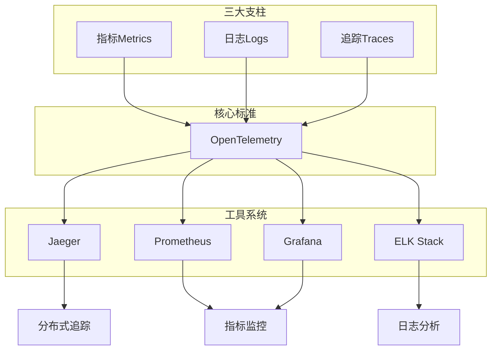
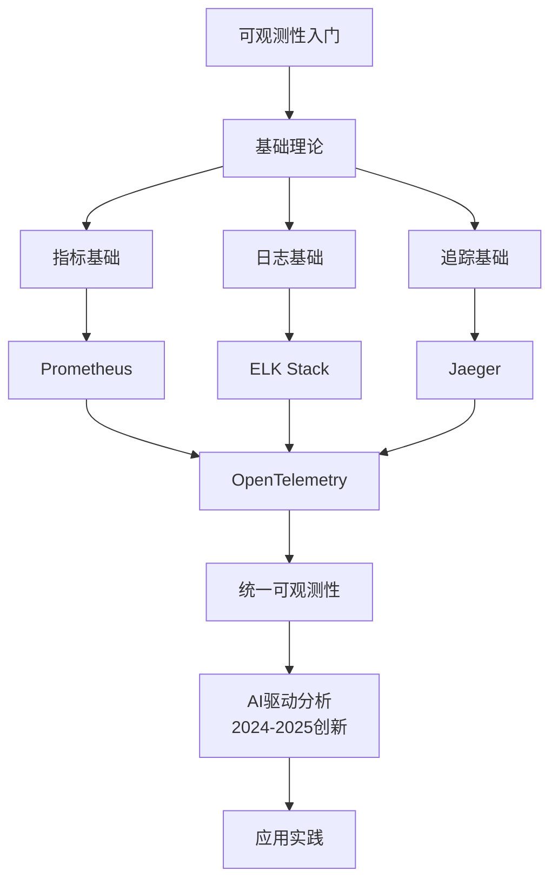

# 分布式系统可观测性专题思维表征工具 / Distributed Systems Observability Special Topic Mental Representation Tools 2024-2025

## 📚 **概述 / Overview**

本文档为分布式系统可观测性专题提供完整的思维表征工具集合，包括思维导图、对比矩阵、决策树、证明树、数据流图、概念地图等多种表征方式。

**创建时间**: 2025年1月
**状态**: ✅ 完成
**专题**: 分布式系统可观测性（2024-2025最新研究）
**相关文档**: [分布式系统可观测性专题-2024-2025.md](分布式系统可观测性专题-2024-2025.md)

---

## 🗺️ **一、思维导图 / Mind Maps**

### 1.1 分布式系统可观测性完整思维导图

---

## 📊 **二、对比矩阵 / Comparison Matrices**

### 2.1 可观测性工具对比矩阵

| 工具 | 类型 | 优势 | 劣势 | 适用场景 | 2024-2025创新 |
|------|------|------|------|---------|--------------|
| **OpenTelemetry** | 标准/框架 | 统一标准、多语言 | 配置复杂 | 统一可观测性 | 统一日志API、智能采样 |
| **Jaeger** | 追踪系统 | 功能完整、性能好 | 存储成本高 | 分布式追踪 | 智能采样、实时分析 |
| **Zipkin** | 追踪系统 | 简单易用、轻量 | 功能较少 | 小规模追踪 | 性能优化 |
| **Prometheus** | 指标系统 | 强大查询、告警 | 存储限制 | 指标监控 | 长期存储优化 |
| **Grafana** | 可视化 | 强大可视化、灵活 | 学习曲线 | 数据可视化 | AI驱动分析 |
| **ELK Stack** | 日志系统 | 功能强大、搜索强 | 资源消耗大 | 日志分析 | 性能优化 |
| **Loki** | 日志系统 | 轻量、高效 | 功能较少 | 轻量日志 | Prometheus集成优化 |

### 2.2 追踪系统对比矩阵

| 系统 | 架构 | 存储 | 查询性能 | 适用规模 | 2024-2025改进 |
|------|------|------|---------|---------|--------------|
| **Jaeger** | 分布式 | 多种后端 | 高 | 大规模 | 智能采样、实时分析 |
| **Zipkin** | 集中式 | 内存/数据库 | 中 | 中小规模 | 性能优化 |
| **OpenTelemetry** | 标准 | 多后端 | 取决于后端 | 任意规模 | 统一标准 |

---

## 🌳 **三、决策树 / Decision Trees**

### 3.1 可观测性工具选择决策树

---

## 🔬 **四、证明树 / Proof Trees**

### 4.1 可观测性下界证明树

---

## 🔄 **五、数据流图 / Data Flow Diagrams**

### 5.1 OpenTelemetry数据流

---

## 🗺️ **六、概念地图 / Concept Maps**

### 6.1 分布式系统可观测性核心概念关系地图

---

## 📈 **七、学习路径图 / Learning Path Diagrams**

### 7.1 分布式系统可观测性学习路径

---

## 📝 **八、总结 / Summary**

### 8.1 思维表征工具使用指南

1. **思维导图**: 快速理解分布式系统可观测性的知识结构
2. **对比矩阵**: 比较不同工具、系统的优缺点
3. **决策树**: 选择合适工具、系统
4. **证明树**: 理解理论证明过程（下界）
5. **数据流图**: 理解可观测性数据的处理流程
6. **概念地图**: 理解概念间的关系
7. **学习路径图**: 规划学习路径

### 8.2 工具更新说明

本文档将随着分布式系统可观测性领域的发展持续更新，确保包含最新的研究进展和方法。

---

**文档版本**: v1.0
**创建时间**: 2025年1月
**最后更新**: 2025年1月
**维护者**: GraphNetWorkCommunicate项目组
**状态**: ✅ 完成
