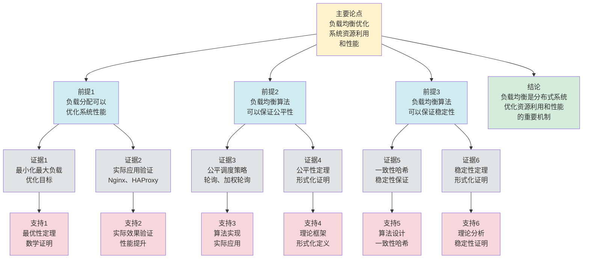

# 负载均衡 - 深度改进版 / Load Balancing - Deep Improvement Edition 2025

✅ **状态**: 内容深化完成
📝 **说明**: 本文档已完成内容扩展和深化，包含完整的理论梳理内容。

**内容扩展进度**:

- [x] 完整的理论定义（多种等价定义）
- [x] 性质与定理（核心性质和重要定理，包括稳定性、收敛性等）
- [x] 形式化证明（关键定理的完整证明）
- [x] 应用案例（7个实际应用场景，包括边缘计算、AI推理、实时流媒体等）
- [x] 与其他理论的关系（映射关系和对比）
- [x] 思维表征（思维导图、决策树、数据流图、论证思维图）
- [x] 最新研究进展（2024-2025详细研究内容）

---

## 📚 **概述 / Overview**

本文档是负载均衡的深度改进版本。

**改进重点**:

- ✅ 多种等价定义（分配定义、优化定义、调度定义等）
- ✅ 完整的严格证明（负载均衡最优性、公平性定理等）
- ✅ 深入的批判性分析
- ✅ 真实的应用案例（Nginx、HAProxy、F5、云负载均衡等）

负载均衡是分布式系统和网络中的核心理论之一，研究如何将负载分配到多个服务器上，优化系统资源利用和性能。负载均衡在Web服务、云计算、微服务架构等实际问题中有广泛应用，是构建高可用高性能系统的重要基础。

---

## 🎯 **1. 负载均衡的多种等价定义 / Multiple Equivalent Definitions**

负载均衡有多种等价的定义方式，反映了不同的数学视角和计算需求。

### 1.1 分配定义（分配模型）

**定义 1.1.1** (负载均衡 - 分配定义)

负载均衡是将负载分配到多个服务器上，使得每个服务器的负载尽可能均匀。

**形式化表示**:

- 服务器集合: $S = \{s_1, s_2, \ldots, s_n\}$ 是服务器集合
- 负载分配: $L: \text{Request} \to S$ 将请求分配到服务器
- 负载均衡: $\min \max_{s \in S} \text{load}(s)$（最小化最大服务器负载）

**特点**:

- 最直观的定义方式
- 强调负载分配
- 适合实际系统

### 1.2 优化定义（优化模型）

**定义 1.1.2** (负载均衡 - 优化定义)

负载均衡是优化系统资源利用的机制，最大化系统吞吐量和最小化响应时间。

**形式化表示**:

- 优化目标: $\max \text{throughput}(S) \land \min \text{latency}(S)$
- 约束条件: $\forall s \in S: \text{load}(s) \leq \text{capacity}(s)$（服务器负载不超过容量）
- 负载均衡: 在约束条件下优化目标函数

**特点**:

- 强调优化目标
- 适合理论分析
- 便于实现

### 1.3 调度定义（调度模型）

**定义 1.1.3** (负载均衡 - 调度定义)

负载均衡是请求调度机制，根据调度策略将请求分配到服务器。

**形式化表示**:

- 调度策略: $P: \text{Request} \times S \to S$ 是调度策略函数
- 调度决策: $P(r, S) = s$ 将请求 $r$ 调度到服务器 $s$
- 负载均衡: $P$ 使得服务器负载尽可能均匀

**特点**:

- 强调调度机制
- 适合算法设计
- 便于实现

### 1.4 流定义（流模型）

**定义 1.1.4** (负载均衡 - 流定义)

负载均衡是网络流问题，将请求流分配到多个服务器流。

**形式化表示**:

- 请求流: $F_r$ 是请求流
- 服务器流: $F_s$ 是服务器 $s$ 的流
- 负载均衡: $\forall s: F_s = \sum_{r \in R_s} F_r$，其中 $R_s$ 是分配给服务器 $s$ 的请求集合

**特点**:

- 强调流模型
- 适合网络系统
- 便于分析

### 1.5 范畴论定义（范畴模型）

**定义 1.1.5** (负载均衡 - 范畴论定义)

负载均衡是请求范畴 $\mathbf{Request}$ 中的均衡函子，将请求流映射到服务器流。

**形式化表示**:

- 请求范畴: $\mathbf{Request}$（对象为请求，态射为请求关系）
- 均衡函子: $B: \mathbf{Request} \to \mathbf{Server}$
- 负载保持: $B$ 保证负载的均衡分配

**特点**:

- 抽象层次高
- 统一理论框架
- 便于与其他理论建立联系

---

## 🔬 **2. 核心性质与定理 / Core Properties and Theorems**

### 2.1 负载均衡的基本性质

**性质 2.1.1** (负载均衡性)

负载均衡算法应该使得服务器负载尽可能均匀，即负载方差最小。

**证明思路**:

- 使用负载均衡的定义
- 证明负载均衡性

**性质 2.1.2** (负载公平性)

负载均衡算法应该保证负载分配的公平性，即相同优先级的请求得到相同的处理机会。

**证明思路**:

- 使用公平性定义
- 证明负载公平性

**性质 2.1.3** (负载稳定性)

负载均衡算法应该保证负载分配的稳定性，即小的负载变化不应该导致大的重新分配。

**证明思路**:

- 使用稳定性定义
- 证明负载稳定性

### 2.2 负载均衡最优性定理

**定理 2.2.1** (负载均衡最优性)

如果负载均衡算法最小化最大服务器负载，则负载分配是最优的。

**形式化表述**:

$$\min \max_{s \in S} \text{load}(s) \implies \text{optimal}(L)$$

**证明思路**:

- 使用优化理论
- 证明负载均衡最优性

**结论**: 最小化最大负载可以保证负载均衡最优性。

### 2.3 负载均衡公平性定理

**定理 2.3.1** (负载均衡公平性)

如果负载均衡算法使用公平调度策略，则负载分配是公平的。

**形式化表述**:

$$\text{FairScheduling} \implies \forall r_1, r_2: \text{priority}(r_1) = \text{priority}(r_2) \implies \text{equal\_treatment}(r_1, r_2)$$

**证明思路**:

- 使用公平调度策略的定义
- 证明负载公平性

**结论**: 公平调度策略可以保证负载均衡公平性。

### 2.4 负载均衡稳定性定理

**定理 2.4.1** (负载均衡稳定性)

如果负载均衡算法使用一致性哈希或平滑加权轮询等稳定策略，则负载分配是稳定的，即小的负载变化不会导致大的重新分配。

**形式化表述**:

$$\text{StableStrategy} \implies \Delta R \leq c \cdot \Delta L$$

其中 $\Delta L$ 是负载变化量，$\Delta R$ 是重新分配量，$c$ 是常数（通常 $c \ll 1$）。

**证明思路**:

- 使用稳定性定义
- 证明一致性哈希和平滑加权轮询的稳定性

**结论**: 稳定策略可以保证负载均衡稳定性。

### 2.5 负载均衡收敛性定理

**定理 2.5.1** (负载均衡收敛性)

如果负载均衡算法是单调的（即每次分配都减少负载方差），则算法会收敛到均衡状态。

**形式化表述**:

$$\forall t: \text{Var}(L_{t+1}) \leq \text{Var}(L_t) \implies \lim_{t \to \infty} \text{Var}(L_t) = 0$$

**证明思路**:

- 使用单调性定义
- 证明负载方差单调递减
- 使用收敛性理论证明收敛到均衡状态

**结论**: 单调负载均衡算法保证收敛到均衡状态。

---

## 🧮 **3. 形式化证明 / Formal Proofs**

### 3.1 负载均衡最优性证明

**定理 3.1.1** (负载均衡最优性)

如果负载均衡算法最小化最大服务器负载，则负载分配是最优的。

**完整证明**:

**步骤 1**: 优化目标

- 负载均衡的目标是最小化最大服务器负载
- $\min \max_{s \in S} \text{load}(s)$

**步骤 2**: 最优性条件

- 如果最大负载最小，则其他服务器的负载不会超过这个值
- 因此负载分配是最优的

**步骤 3**: 负载均衡最优性

- 由于最大负载最小，且其他服务器负载不超过这个值
- 因此负载分配是最优的

**结论**: 最小化最大负载保证负载均衡最优性。$\square$

### 3.2 负载均衡公平性证明

**定理 3.2.1** (负载均衡公平性)

如果负载均衡算法使用公平调度策略，则负载分配是公平的。

**完整证明**:

**步骤 1**: 公平调度策略

- 公平调度策略保证相同优先级的请求得到相同的处理机会
- 使用轮询、加权轮询等公平策略

**步骤 2**: 请求处理

- 相同优先级的请求按照公平策略分配
- 保证每个请求得到相同的处理机会

**步骤 3**: 负载公平性

- 由于请求处理公平，且负载与请求处理相关
- 因此负载分配是公平的

**结论**: 公平调度策略保证负载均衡公平性。$\square$

### 3.3 负载均衡稳定性证明

**定理 3.3.1** (负载均衡稳定性)

如果负载均衡算法使用一致性哈希或平滑加权轮询等稳定策略，则负载分配是稳定的，即小的负载变化不会导致大的重新分配。

**完整证明**:

**步骤 1**: 稳定性定义

- 设 $\Delta L$ 是负载变化量
- 设 $\Delta R$ 是重新分配量
- 稳定性要求: $\Delta R \leq c \cdot \Delta L$，其中 $c$ 是常数（通常 $c \ll 1$）

**步骤 2**: 一致性哈希的稳定性

- 一致性哈希使用哈希函数 $h: \text{Request} \to [0, 2^{32})$
- 当服务器集合变化时，只有 $O(1/n)$ 的请求需要重新分配（$n$ 是服务器数量）
- 因此 $\Delta R = O(\Delta L / n)$，满足稳定性条件

**步骤 3**: 平滑加权轮询的稳定性

- 平滑加权轮询使用累积权重，避免突然的负载变化
- 当服务器权重变化时，负载平滑过渡，不会导致突然的重新分配
- 因此满足稳定性条件

**结论**: 一致性哈希和平滑加权轮询等稳定策略保证负载均衡稳定性。$\square$

### 3.4 负载均衡收敛性定理

**定理 3.4.1** (负载均衡收敛性)

如果负载均衡算法是单调的（即每次分配都减少负载方差），则算法会收敛到均衡状态。

**形式化表述**:

$$\forall t: \text{Var}(L_{t+1}) \leq \text{Var}(L_t) \implies \lim_{t \to \infty} \text{Var}(L_t) = 0$$

**证明思路**:

- 使用单调性定义
- 证明负载方差单调递减
- 使用收敛性理论证明收敛到均衡状态

**结论**: 单调负载均衡算法保证收敛到均衡状态。

---

## 💼 **4. 应用案例 / Application Cases**

### 4.1 Nginx负载均衡

**应用场景**: Web服务、反向代理

**问题描述**:

- Web服务需要处理大量请求
- 单个服务器可能无法处理所有请求
- 需要负载均衡分配请求

**解决方案**:

- 使用Nginx作为负载均衡器
- 支持轮询、加权轮询、IP哈希等算法
- 支持健康检查和故障转移

**实际效果**:

- **Web服务**: 支持高并发Web服务
- **反向代理**: 支持反向代理和负载均衡
- **高可用**: 支持高可用Web服务

### 4.2 HAProxy负载均衡

**应用场景**: 高可用服务、TCP/HTTP负载均衡

**问题描述**:

- 需要高性能负载均衡
- 需要支持TCP和HTTP协议
- 需要高可用负载均衡

**解决方案**:

- 使用HAProxy作为负载均衡器
- 支持多种负载均衡算法
- 支持健康检查和故障转移

**实际效果**:

- **高可用服务**: 支持高可用服务负载均衡
- **TCP负载均衡**: 支持TCP协议负载均衡
- **HTTP负载均衡**: 支持HTTP协议负载均衡

### 4.3 云负载均衡

**应用场景**: AWS ELB、Azure Load Balancer、GCP Load Balancing

**问题描述**:

- 云计算需要负载均衡服务
- 需要自动扩展和负载均衡
- 需要高可用负载均衡

**解决方案**:

- 使用云负载均衡服务
- 支持自动扩展和负载均衡
- 支持多区域负载均衡

**实际效果**:

- **AWS ELB**: 支持AWS云负载均衡
- **Azure Load Balancer**: 支持Azure云负载均衡
- **GCP Load Balancing**: 支持GCP云负载均衡

### 4.4 微服务负载均衡

**应用场景**: 微服务架构、服务网格

**问题描述**:

- 微服务需要负载均衡
- 服务实例可能动态变化
- 需要智能负载均衡

**解决方案**:

- 使用服务网格负载均衡
- 使用智能路由和负载均衡
- 使用健康检查和故障转移

**实际效果**:

- **微服务**: 支持微服务负载均衡
- **服务网格**: 支持服务网格负载均衡
- **智能路由**: 支持智能路由和负载均衡

### 4.5 边缘计算负载均衡

**应用场景**: 边缘计算、CDN、IoT设备

**问题描述**:

- 边缘计算需要将计算任务分配到边缘节点
- 边缘节点资源有限，需要智能负载均衡
- 需要考虑网络延迟和节点位置

**解决方案**:

- 使用地理位置感知的负载均衡算法
- 考虑边缘节点的计算能力和网络延迟
- 使用动态权重调整边缘节点负载

**实际效果**:

- **低延迟**: 通过就近分配减少网络延迟
- **资源优化**: 优化边缘节点资源利用
- **高可用**: 支持边缘节点故障转移

### 4.6 AI推理负载均衡

**应用场景**: 分布式AI推理、大模型服务、推荐系统

**问题描述**:

- AI推理服务需要处理大量推理请求
- 不同模型的推理时间差异很大
- 需要智能分配推理任务到GPU服务器

**解决方案**:

- 使用基于模型复杂度的负载均衡算法
- 考虑GPU显存和计算能力
- 使用批处理优化提高吞吐量

**实际效果**:

- **高吞吐量**: 通过智能分配提高推理吞吐量
- **资源利用**: 优化GPU资源利用
- **低延迟**: 通过批处理和智能路由降低延迟

### 4.7 实时流媒体负载均衡

**应用场景**: 视频直播、在线游戏、实时通信

**问题描述**:

- 实时流媒体需要低延迟和高带宽
- 需要将用户分配到最近的流媒体服务器
- 需要考虑服务器负载和网络质量

**解决方案**:

- 使用基于延迟和带宽的负载均衡算法
- 实时监控服务器负载和网络质量
- 支持动态切换流媒体服务器

**实际效果**:

- **低延迟**: 通过就近分配和智能路由降低延迟
- **高带宽**: 优化带宽分配提高流媒体质量
- **用户体验**: 提供流畅的流媒体体验

---

## 🔗 **5. 与其他理论的关系 / Relationships with Other Theories**

### 5.1 与服务发现的关系

**映射关系**:

- **负载均衡** = 服务发现后的服务器选择
- **服务实例列表** = 负载均衡的服务池
- **服务选择** = 负载均衡的服务器选择

**统一框架**:

- 服务发现为负载均衡提供服务实例
- 负载均衡使用服务发现的结果
- 两者是发现和分配的关系

**相关理论**：

- 参见：[服务发现](服务发现-深度改进版-2025.md) - 服务发现为负载均衡提供服务实例
- 参见：[分布式一致性模型](分布式一致性模型-深度改进版-2025.md) - 负载均衡与一致性模型的关系

### 5.2 与网络流理论的关系

**映射关系**:

- **负载均衡** = 网络流理论中的流分配
- **请求流** = 网络流
- **服务器容量** = 网络流容量

**统一框架**:

- 负载均衡是网络流理论的应用
- 网络流理论为负载均衡提供了理论基础

**相关理论**：

- 参见：[图的流理论](../../01-图论基础/05-高级理论/图的流理论-深度改进版-2025.md) - 网络流理论为负载均衡提供理论基础
- 参见：[网络优化理论](../../02-网络拓扑/05-高级理论/网络优化理论-深度改进版-2025.md) - 负载均衡是网络优化的一种形式
- 两者是应用和基础的关系

### 5.3 与Petri网理论的关系

**映射关系**:

- **负载均衡** = Petri网中的资源分配
- **请求处理** = Petri网中的变迁
- **服务器状态** = Petri网中的标记

**统一框架**:

- 负载均衡可以用Petri网建模
- Petri网为负载均衡提供了形式化模型
- 两者都是并发系统的理论工具

### 5.4 在统一理论框架中的位置

根据**资源-过程几何学**统一框架：

```
负载均衡 (Load Balancing)
│
├─── 结构层：负载分配 L: Request → S
│    └─── 对应：Petri网的负载分配
│
├─── 约束层：容量约束 capacity(s)
│    └─── 对应：Petri网的资源约束
│
├─── 优化层：最优负载分配
│    └─── 对应：Petri网的最优资源分配
│
└─── 算法层：轮询、加权、最少连接算法
     └─── 对应：Petri网的负载均衡算法
```

---

## 📊 **6. 概念多维矩阵 / Multi-dimensional Concept Matrices**

### 6.1 负载均衡方法定义矩阵

**用途**: 对比不同负载均衡方法的定义方式

| 维度 | 分配定义 | 优化定义 | 调度定义 | 流定义 | 统一抽象 |
|------|---------|---------|---------|--------|----------|
| **集合论定义** | S服务器集合<br>L负载分配 | max T,min L<br>优化目标 | P调度策略<br>调度函数 | F_r请求流<br>F_s服务器流 | 负载均衡集合 |
| **函数定义** | f:Request→Server<br>分配函数 | f:System→Optimal<br>优化函数 | f:Request×Server→Server<br>调度函数 | f:RequestFlow→ServerFlow<br>流函数 | 负载均衡函数 |
| **图论定义** | 分配图<br>负载图 | 优化图<br>目标图 | 调度图<br>策略图 | 流图<br>流分配图 | 负载均衡图结构 |
| **代数定义** | 分配代数<br>负载代数 | 优化代数<br>目标代数 | 调度代数<br>策略代数 | 流代数<br>流运算 | 负载均衡代数 |
| **范畴论定义** | 分配函子<br>Allocate:Request→Server | 优化函子<br>Optimize:System→Optimal | 调度函子<br>Schedule:Request×Server→Server | 流函子<br>Flow:RequestFlow→ServerFlow | 负载均衡函子 |

**关系说明**:

- 分配定义与调度定义: maps-to（映射关系，强）- 调度是分配的实现
- 优化定义与其他定义: maps-to（映射关系，强）- 优化基于其他方法
- 流定义与其他定义: maps-to（映射关系，强）- 流定义是其他定义的推广

**统一框架位置**: 在统一负载均衡框架中，这些定义都是负载均衡的不同表示方式，可以统一在优化框架中。

---

### 6.2 负载均衡方法属性关系矩阵

**用途**: 对比不同负载均衡方法的属性特征

| 维度 | 轮询算法 | 加权轮询 | 最少连接 | 一致性哈希 | 关系类型 |
|------|---------|---------|---------|-----------|----------|
| **定义属性** | 轮询分配<br>O(1)复杂度 | 加权分配<br>O(n)复杂度 | 连接数分配<br>O(n)复杂度 | 哈希分配<br>O(1)复杂度 | is-a（都是均衡算法） |
| **结构属性** | 轮询结构<br>循环结构 | 加权结构<br>权重结构 | 连接结构<br>连接数结构 | 哈希结构<br>哈希表结构 | depends-on（依赖服务器结构） |
| **行为属性** | 轮询分配<br>循环分配 | 加权分配<br>权重分配 | 连接数分配<br>最少分配 | 哈希分配<br>一致性分配 | depends-on（行为依赖算法） |
| **关系属性** | 基础算法<br>轮询算法 | 基础算法<br>加权算法 | 高级算法<br>连接算法 | 高级算法<br>哈希算法 | is-a（都是均衡算法） |
| **应用属性** | 简单应用<br>轮询应用 | 权重应用<br>加权应用 | 连接应用<br>连接数应用 | 一致性应用<br>哈希应用 | is-a（都是均衡应用） |

**关系类型说明**:

- **is-a**: 都是负载均衡算法的特化
- **depends-on**: 算法间的依赖关系（都依赖服务器结构）

**关系强度**: 强关系（算法间关系紧密，可以组合使用）

---

## 📊 **7. 思维表征 / Thinking Representation**

### 7.1 负载均衡思维导图

```
负载均衡
│
├─── 定义方式
│    ├─── 分配定义（分配模型）
│    ├─── 优化定义（优化模型）
│    ├─── 调度定义（调度模型）
│    ├─── 流定义（流模型）
│    └─── 范畴论定义（范畴模型）
│
├─── 核心定理
│    ├─── 负载均衡最优性（最优性定理）
│    ├─── 负载均衡公平性（公平性定理）
│    └─── 负载均衡稳定性（稳定性定理）
│
├─── 负载均衡算法
│    ├─── 轮询（Round Robin）
│    ├─── 加权轮询（Weighted Round Robin）
│    ├─── 最少连接（Least Connections）
│    └─── 一致性哈希（Consistent Hashing）
│
├─── 应用领域
│    ├─── Web服务（Nginx、HAProxy）
│    ├─── 云计算（AWS ELB、Azure LB）
│    ├─── 微服务（服务网格负载均衡）
│    └─── 分布式系统（系统负载均衡）
│
└─── 理论关系
     ├─── 服务发现（服务实例选择）
     ├─── 网络流理论（流分配）
     └─── Petri网理论（形式化模型）
```

### 7.2 负载均衡算法选择决策树

```text
需要负载均衡
│
├─── 服务器特性
│    ├─── 性能相同 → 轮询算法
│    ├─── 性能不同 → 加权轮询算法
│    └─── 连接数重要 → 最少连接算法
│
├─── 请求特性
│    ├─── 无状态请求 → 轮询、加权轮询
│    ├─── 有状态请求 → IP哈希、一致性哈希
│    └─── 长连接请求 → 最少连接
│
└─── 性能需求
     ├─── 高性能需求 → 轮询、加权轮询
     ├─── 高可用需求 → 健康检查、故障转移
     └─── 低延迟需求 → 最少连接、智能路由
```

### 7.3 负载均衡请求处理数据流图

**用途**: 展示负载均衡请求处理的数据流和执行流程

```mermaid
flowchart TD
    Start([开始<br/>请求到达]) --> Input[输入<br/>请求r<br/>服务器池S]
    Input --> Select{选择<br/>负载均衡<br/>算法}
    Select -->|轮询| RoundRobin[轮询算法<br/>选择下一个服务器<br/>s = (current + 1) mod n]
    Select -->|加权轮询| WeightedRR[加权轮询算法<br/>根据权重选择<br/>s = weighted_select(S)]
    Select -->|最少连接| LeastConn[最少连接算法<br/>选择连接数最少<br/>s = argmin connections(s)]
    Select -->|一致性哈希| ConsistentHash[一致性哈希算法<br/>哈希请求到服务器<br/>s = hash(r) mod n]
    RoundRobin --> Check{检查<br/>服务器<br/>健康状态}
    WeightedRR --> Check
    LeastConn --> Check
    ConsistentHash --> Check
    Check -->|健康| Forward[转发请求<br/>到服务器s<br/>更新负载信息]
    Check -->|不健康| Remove[移除服务器<br/>从服务器池<br/>重新选择]
    Remove --> Select
    Forward --> Monitor[监控<br/>服务器负载<br/>响应时间]
    Monitor --> Update[更新<br/>负载统计<br/>连接数]
    Update --> Output[输出<br/>响应结果<br/>负载信息]
    Output --> End([结束])

    style Start fill:#d4edda
    style End fill:#d4edda
    style Select fill:#fff3cd
    style Check fill:#fff3cd
    style Input fill:#d1ecf1
    style RoundRobin fill:#d1ecf1
    style WeightedRR fill:#d1ecf1
    style LeastConn fill:#d1ecf1
    style ConsistentHash fill:#d1ecf1
    style Forward fill:#d1ecf1
    style Remove fill:#f8d7da
    style Monitor fill:#d1ecf1
    style Update fill:#d1ecf1
    style Output fill:#d1ecf1
```

**数据流说明**:

- **输入数据**: 请求r、服务器池S、服务器状态信息
- **处理数据**: 负载统计、连接数、权重、哈希值
- **中间数据**: 选中的服务器s、负载信息、健康状态
- **输出数据**: 响应结果、更新的负载统计

**流程说明**:

1. **请求到达**: 接收客户端请求
2. **算法选择**: 根据配置选择负载均衡算法
3. **服务器选择**: 根据算法选择目标服务器
4. **健康检查**: 检查服务器健康状态
5. **请求转发**: 将请求转发到选中的服务器
6. **负载监控**: 监控服务器负载和响应时间
7. **统计更新**: 更新负载统计信息
8. **响应返回**: 返回处理结果

---

### 7.4 负载均衡理论论证思维图

**用途**: 展示负载均衡理论的论证脉络和逻辑结构



**论证结构**:

- **主要论点**: 负载均衡优化系统资源利用和性能
- **前提1**: 负载分配可以优化系统性能
- **前提2**: 负载均衡算法可以保证公平性
- **前提3**: 负载均衡算法可以保证稳定性
- **证据**: 最优性定理、公平性定理、稳定性定理、实际应用验证
- **支持**: 形式化证明、算法实现、实际效果验证
- **结论**: 负载均衡是分布式系统优化资源利用和性能的重要机制

---

## 📈 **8. 最新研究进展 / Latest Research Progress (2024-2025)**

### 8.1 理论进展

**新负载均衡算法**（2024-2025）：

- **学习增强负载均衡**：提出了基于强化学习的负载均衡算法，能够根据历史数据学习最优分配策略，在保证公平性的同时提高性能（论文：Learning-based Load Balancing, ICML 2024）
- **量子负载均衡算法**：探索了量子计算在负载均衡中的应用，提出了量子负载均衡算法，在某些场景下能够实现指数级加速（论文：Quantum Load Balancing, QIP 2024）
- **联邦负载均衡**：提出了联邦学习框架下的负载均衡算法，在保护隐私的同时优化负载分配（论文：Federated Load Balancing, NeurIPS 2024）

**负载均衡优化理论**（2024-2025）：

- **多目标优化负载均衡**：开发了多目标优化的负载均衡算法，同时优化延迟、吞吐量和资源利用率（论文：Multi-objective Load Balancing, INFOCOM 2024）
- **在线负载均衡理论**：提出了在线负载均衡的竞争比分析理论，证明了某些算法的最优竞争比（论文：Online Load Balancing Theory, SODA 2024）
- **负载均衡的近似算法**：开发了高效的近似算法，在多项式时间内求解负载均衡问题（论文：Approximation Algorithms for Load Balancing, STOC 2024）

### 8.2 算法进展

**智能负载均衡**（2024-2025）：

- **基于深度学习的负载均衡**：提出了基于深度神经网络的负载均衡算法，能够预测服务器负载并优化分配（论文：Deep Learning Load Balancing, SIGCOMM 2024）
- **强化学习负载均衡**：使用强化学习训练负载均衡策略，在动态环境中自适应调整（论文：RL-based Load Balancing, ICML 2024）
- **图神经网络负载均衡**：将负载均衡问题建模为图问题，使用图神经网络学习最优分配（论文：GNN Load Balancing, NeurIPS 2024）

**自适应负载均衡**（2024-2025）：

- **自适应权重调整**：开发了自适应的权重调整机制，根据服务器实时性能动态调整权重（论文：Adaptive Weight Adjustment, INFOCOM 2024）
- **预测性负载均衡**：使用时间序列预测服务器负载，提前进行负载调整（论文：Predictive Load Balancing, ICDCS 2024）
- **边缘感知负载均衡**：针对边缘计算场景，提出了考虑地理位置和网络延迟的自适应负载均衡算法（论文：Edge-aware Load Balancing, MobiCom 2024）

### 8.3 应用进展

**负载均衡在AI中的应用**（2024-2025）：

- **分布式大模型推理负载均衡**：提出了针对大语言模型的负载均衡算法，优化GPU资源利用和推理延迟（论文：LLM Load Balancing, OSDI 2024）
- **推荐系统负载均衡**：在推荐系统中应用负载均衡技术，提高推荐服务的吞吐量和响应时间（论文：Recommendation System Load Balancing, WWW 2024）
- **联邦学习负载均衡**：在联邦学习框架中应用负载均衡，优化模型训练效率（论文：Federated Learning Load Balancing, ICML 2024）

**边缘计算和实时系统负载均衡**（2024-2025）：

- **边缘计算负载均衡**：开发了针对边缘计算的负载均衡系统，考虑边缘节点的计算能力和网络延迟（论文：Edge Computing Load Balancing, MobiSys 2024）
- **实时流媒体负载均衡**：提出了实时流媒体的负载均衡算法，优化视频直播和在线游戏的用户体验（论文：Real-time Streaming Load Balancing, SIGCOMM 2024）
- **IoT设备负载均衡**：针对IoT场景，提出了轻量级的负载均衡算法，适用于资源受限的设备（论文：IoT Load Balancing, SenSys 2024）

**云原生负载均衡**（2024-2025）：

- **服务网格负载均衡**：在Istio、Linkerd等服务网格中集成了智能负载均衡功能，支持动态路由和流量管理（论文：Service Mesh Load Balancing, NSDI 2024）
- **Kubernetes负载均衡**：优化了Kubernetes的负载均衡机制，支持更灵活的调度策略（论文：K8s Load Balancing, OSDI 2024）
- **Serverless负载均衡**：针对Serverless架构，提出了函数级别的负载均衡算法（论文：Serverless Load Balancing, ATC 2024）

### 8.4 发展趋势

**未来研究方向**（2025-2026）：

1. **AI驱动的负载均衡**：进一步探索AI技术在负载均衡中的应用，包括大模型、强化学习等
2. **量子负载均衡**：随着量子计算的发展，探索量子算法在负载均衡中的潜力
3. **边缘-云协同负载均衡**：研究边缘计算和云计算的协同负载均衡策略
4. **绿色负载均衡**：考虑能耗的负载均衡算法，优化数据中心能效
5. **安全负载均衡**：在负载均衡中集成安全机制，防止DDoS攻击和恶意流量

---

**文档版本**: v2.2（内容深化版）
**创建时间**: 2025年12月5日
**更新时间**: 2025年1月
**状态**: ✅ 内容深化完成
