# 分布式系统：理论-应用全链路与工程案例 / Distributed Systems: Theory-Application Pipeline and Engineering Cases

## 📚 **概述 / Overview**

本文档介绍分布式系统的理论应用全链路与工程案例，包括理论基础与形式化证明、算法实现与工程案例、跨领域应用与迁移、批判性分析与改进建议、形式化验证与测试。

## 📑 **目录 / Table of Contents**

- [分布式系统：理论-应用全链路与工程案例 / Distributed Systems: Theory-Application Pipeline and Engineering Cases](#分布式系统理论-应用全链路与工程案例--distributed-systems-theory-application-pipeline-and-engineering-cases)
  - [📚 **概述 / Overview**](#-概述--overview)
  - [📑 **目录 / Table of Contents**](#-目录--table-of-contents)
  - [1. 理论基础与形式化证明](#1-理论基础与形式化证明)
    - [1.1 核心定理与证明](#11-核心定理与证明)
      - [CAP定理的形式化证明](#cap定理的形式化证明)
      - [FLP不可能性定理](#flp不可能性定理)
    - [1.2 分布式状态机理论](#12-分布式状态机理论)
      - [线性化一致性](#线性化一致性)
      - [因果一致性](#因果一致性)
  - [2. 算法实现与工程案例](#2-算法实现与工程案例)
    - [2.1 共识算法实现](#21-共识算法实现)
      - [Raft算法详细实现](#raft算法详细实现)
      - [分布式事务实现](#分布式事务实现)
    - [2.2 工程案例：分布式数据库](#22-工程案例分布式数据库)
      - [案例1：Apache Cassandra](#案例1apache-cassandra)
      - [案例2：区块链共识网络](#案例2区块链共识网络)
  - [3. 跨领域应用与迁移](#3-跨领域应用与迁移)
    - [3.1 量子分布式系统](#31-量子分布式系统)
    - [3.2 生物分布式系统](#32-生物分布式系统)
  - [4. 批判性分析与改进建议](#4-批判性分析与改进建议)
    - [4.1 现有系统的局限性](#41-现有系统的局限性)
      - [性能瓶颈分析](#性能瓶颈分析)
      - [安全性挑战](#安全性挑战)
    - [4.2 改进方向](#42-改进方向)
      - [技术创新](#技术创新)
      - [工程优化](#工程优化)
  - [5. 形式化验证与测试](#5-形式化验证与测试)
    - [5.1 模型检测](#51-模型检测)
    - [5.2 定理证明](#52-定理证明)
  - [6. 总结与展望](#6-总结与展望)
    - [未来发展方向](#未来发展方向)
  - [多模态表达与可视化](#多模态表达与可视化)
    - [分布式系统架构图](#分布式系统架构图)
    - [共识算法状态机](#共识算法状态机)
    - [自动化脚本建议](#自动化脚本建议)

---

## 1. 理论基础与形式化证明

### 1.1 核心定理与证明

#### CAP定理的形式化证明

**定理**：在异步网络模型中，任何分布式系统最多只能同时满足一致性(Consistency)、可用性(Availability)、分区容错性(Partition tolerance)中的两个。

**形式化证明**：

```math
\forall S \in \text{DistributedSystems}: \\
\text{Consistency}(S) \land \text{Availability}(S) \land \text{PartitionTolerance}(S) \implies \bot
```

**证明思路**：

1. 假设存在满足CAP三个属性的系统S
2. 构造网络分区场景，节点A、B被隔离
3. 客户端向A写入数据，向B读取数据
4. 根据可用性，B必须响应；根据一致性，B必须返回最新值
5. 但网络分区使得B无法获得A的更新，矛盾

#### FLP不可能性定理

**定理**：在异步网络中，即使只有一个进程可能崩溃，也不存在确定性算法能够解决共识问题。

**形式化表述**：

```math
\forall A \in \text{DeterministicAlgorithms}: \\
\text{AsyncNetwork} \land \text{SingleFailure} \implies \neg\text{Solvable}(A)
```

### 1.2 分布式状态机理论

#### 线性化一致性

**定义**：操作历史H是线性化的，当且仅当存在H的线性化L，使得：

```math
\forall op_1, op_2 \in H: op_1 \prec_H op_2 \implies op_1 \prec_L op_2
```

#### 因果一致性

**定义**：操作历史H满足因果一致性，当且仅当：

```math
\forall op_1, op_2 \in H: op_1 \rightarrow op_2 \implies op_1 \prec op_2
```

## 2. 算法实现与工程案例

### 2.1 共识算法实现

#### Raft算法详细实现

```python
class RaftNode:
    def __init__(self, node_id, nodes):
        self.node_id = node_id
        self.nodes = nodes
        self.current_term = 0
        self.voted_for = None
        self.log = []
        self.commit_index = 0
        self.last_applied = 0
        self.state = 'follower'
        self.leader_id = None
        self.election_timeout = random.randint(150, 300)
        self.heartbeat_interval = 50

    def start_election(self):
        self.current_term += 1
        self.state = 'candidate'
        self.voted_for = self.node_id
        votes_received = 1

        # 发送RequestVote RPC
        for node in self.nodes:
            if node != self.node_id:
                response = self.send_request_vote(node)
                if response.vote_granted:
                    votes_received += 1

        if votes_received > len(self.nodes) // 2:
            self.become_leader()

    def become_leader(self):
        self.state = 'leader'
        self.leader_id = self.node_id
        # 初始化leader状态
        for node in self.nodes:
            self.next_index[node] = len(self.log)
            self.match_index[node] = 0
```

#### 分布式事务实现

```python
class TwoPhaseCommit:
    def __init__(self, coordinator, participants):
        self.coordinator = coordinator
        self.participants = participants
        self.state = 'initial'

    def execute_transaction(self, transaction):
        # Phase 1: Prepare
        prepare_responses = []
        for participant in self.participants:
            response = participant.prepare(transaction)
            prepare_responses.append(response)

        # Phase 2: Commit/Abort
        if all(response == 'prepared' for response in prepare_responses):
            for participant in self.participants:
                participant.commit(transaction)
            self.state = 'committed'
        else:
            for participant in self.participants:
                participant.abort(transaction)
            self.state = 'aborted'
```

### 2.2 工程案例：分布式数据库

#### 案例1：Apache Cassandra

**架构特点**：

- 去中心化架构，无单点故障
- 最终一致性模型
- 基于Dynamo的分布式哈希表

**一致性实现**：

```python
class CassandraConsistency:
    def __init__(self, replication_factor=3):
        self.replication_factor = replication_factor

    def write_consistency(self, data, consistency_level):
        if consistency_level == 'ONE':
            return self.write_to_one_replica(data)
        elif consistency_level == 'QUORUM':
            return self.write_to_quorum_replicas(data)
        elif consistency_level == 'ALL':
            return self.write_to_all_replicas(data)

    def read_consistency(self, key, consistency_level):
        if consistency_level == 'ONE':
            return self.read_from_one_replica(key)
        elif consistency_level == 'QUORUM':
            return self.read_from_quorum_replicas(key)
```

#### 案例2：区块链共识网络

**PoW共识实现**：

```python
class ProofOfWork:
    def __init__(self, difficulty):
        self.difficulty = difficulty
        self.target = 2 ** (256 - difficulty)

    def mine_block(self, block_data):
        nonce = 0
        while True:
            block_hash = self.calculate_hash(block_data, nonce)
            if int(block_hash, 16) < self.target:
                return nonce, block_hash
            nonce += 1

    def validate_block(self, block_data, nonce):
        block_hash = self.calculate_hash(block_data, nonce)
        return int(block_hash, 16) < self.target
```

## 3. 跨领域应用与迁移

### 3.1 量子分布式系统

**量子共识协议**：

```python
class QuantumConsensus:
    def __init__(self):
        self.quantum_state = None

    def quantum_consensus(self, qubits):
        # 使用量子纠缠实现共识
        entangled_state = self.create_entanglement(qubits)
        measurement_results = self.measure_entangled_state(entangled_state)
        return self.interpret_consensus(measurement_results)
```

### 3.2 生物分布式系统

**神经网络分布式训练**：

```python
class DistributedNeuralNetwork:
    def __init__(self, nodes):
        self.nodes = nodes
        self.model_shards = self.partition_model()

    def distributed_training(self, data):
        # 数据并行训练
        gradients = []
        for node in self.nodes:
            gradient = node.compute_gradient(data)
            gradients.append(gradient)

        # 梯度聚合
        aggregated_gradient = self.aggregate_gradients(gradients)
        self.update_model(aggregated_gradient)
```

## 4. 批判性分析与改进建议

### 4.1 现有系统的局限性

#### 性能瓶颈分析

1. **网络延迟影响**：跨地域部署的分布式系统受网络延迟严重影响
2. **一致性开销**：强一致性协议带来显著的性能开销
3. **扩展性限制**：传统共识算法难以扩展到大规模节点

#### 安全性挑战

1. **拜占庭容错**：现有系统对恶意节点的容错能力有限
2. **隐私保护**：分布式系统中的数据隐私保护机制不完善
3. **量子威胁**：量子计算对现有加密算法的威胁

### 4.2 改进方向

#### 技术创新

1. **分层共识**：设计分层共识机制，提高大规模系统的性能
2. **混合一致性**：根据应用场景动态调整一致性级别
3. **量子增强**：集成量子通信技术，提升安全性和性能

#### 工程优化

1. **智能路由**：基于网络拓扑的智能路由算法
2. **自适应容错**：根据故障模式自适应调整容错策略
3. **边缘计算**：将分布式计算扩展到边缘节点

## 5. 形式化验证与测试

### 5.1 模型检测

```python
class DistributedSystemModel:
    def __init__(self):
        self.states = set()
        self.transitions = []

    def add_transition(self, from_state, to_state, condition):
        self.transitions.append((from_state, to_state, condition))

    def verify_safety(self, property):
        # 使用模型检测验证安全属性
        return self.check_property(property)

    def verify_liveness(self, property):
        # 验证活性属性
        return self.check_liveness(property)
```

### 5.2 定理证明

```coq
(* 证明Raft算法的安全性 *)
Theorem Raft_Safety : forall (s : State) (t : Term),
  Leader(s, t) ->
  forall (log : Log) (index : nat),
    Committed(log, index) ->
    exists (leader_log : Log),
      LeaderLog(leader_log) /\
      LeaderLogAtIndex(leader_log, index, log).
Proof.
  (* 形式化证明过程 *)
  intros s t H_leader log index H_committed.
  (* 证明步骤... *)
Qed.
```

## 6. 总结与展望

本章系统梳理了分布式系统从理论到应用的全链路，涵盖：

1. **理论基础**：CAP定理、FLP不可能性、分布式状态机理论的形式化证明
2. **算法实现**：Raft共识、分布式事务、一致性协议的详细实现
3. **工程案例**：Cassandra、区块链等实际系统的架构与实现
4. **跨领域应用**：量子分布式系统、生物分布式系统的创新应用
5. **批判性分析**：现有系统的局限性分析与改进建议
6. **形式化验证**：模型检测、定理证明等验证方法

### 未来发展方向

1. **量子分布式系统**：集成量子通信技术，提升安全性和性能
2. **AI驱动的分布式系统**：使用机器学习优化分布式算法
3. **边缘计算与物联网**：扩展到边缘节点的分布式计算
4. **绿色分布式系统**：降低能耗的分布式系统设计

## 多模态表达与可视化

### 分布式系统架构图

```mermaid
graph TB
    Client[客户端] --> LB[负载均衡器]
    LB --> Node1[节点1]
    LB --> Node2[节点2]
    LB --> Node3[节点3]
    Node1 --> DB1[(数据库1)]
    Node2 --> DB2[(数据库2)]
    Node3 --> DB3[(数据库3)]
    DB1 -.-> DB2
    DB2 -.-> DB3
    DB3 -.-> DB1
```



### 共识算法状态机

```mermaid
stateDiagram-v2
    [*] --> Follower
    Follower --> Candidate : 超时
    Candidate --> Leader : 获得多数票
    Candidate --> Follower : 发现更高任期
    Leader --> Follower : 发现更高任期
    Follower --> Follower : 收到心跳
```



### 自动化脚本建议

- `scripts/distributed_event_graph.py`：生成分布式事件图
- `scripts/consensus_visualizer.py`：可视化共识过程
- `scripts/consistency_checker.py`：一致性检查工具
