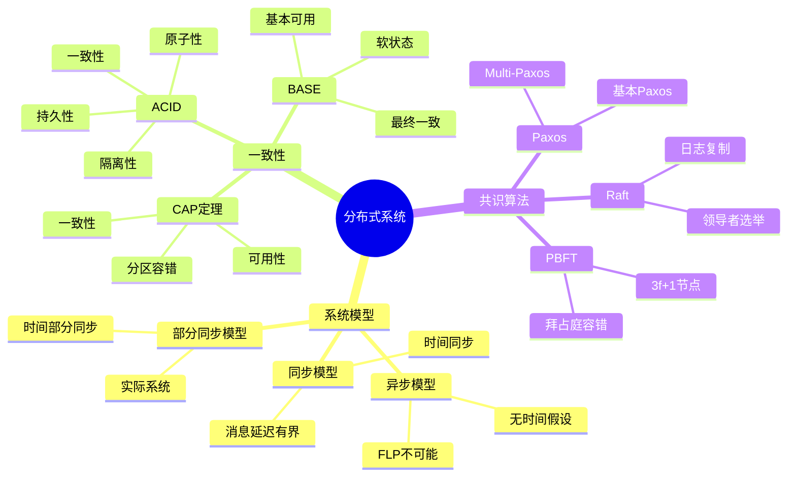
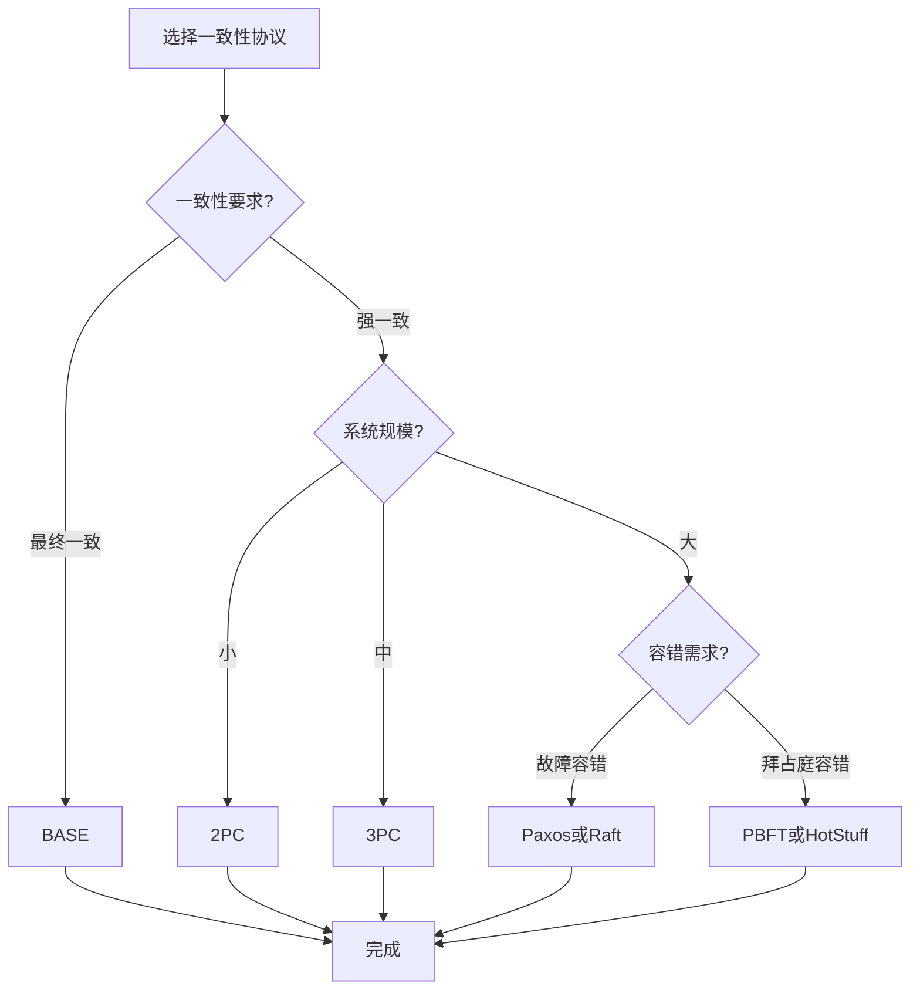

# 分布式系统思维表征工具 / Distributed Systems Mental Representation Tools

## 📚 **概述 / Overview**

本文档提供分布式系统模块的多种思维表征工具，包括思维导图、对比矩阵、决策树、逻辑路径和概念地图，帮助更好地理解和应用分布式系统知识。

**创建时间**: 2025年1月
**模块**: 分布式系统
**状态**: 🚀 持续更新中

---

## 🗺️ **一、思维导图 / Mind Maps**

### 1.1 分布式系统核心概念思维导图

---

## 📊 **二、对比矩阵 / Comparison Matrices**

### 2.1 一致性协议对比矩阵

| 协议 | 类型 | 一致性 | 可用性 | 分区容错 | 复杂度 | 适用场景 |
|------|------|--------|--------|---------|--------|---------|
| **2PC** | 两阶段提交 | 强一致 | 低 | 低 | 低 | 小规模、强一致需求 |
| **3PC** | 三阶段提交 | 强一致 | 中 | 中 | 中 | 中等规模 |
| **Paxos** | 共识算法 | 强一致 | 高 | 高 | 高 | 大规模、高可用 |
| **Raft** | 共识算法 | 强一致 | 高 | 高 | 中 | 易理解、高可用 |
| **PBFT** | 拜占庭容错 | 强一致 | 高 | 高 | 很高 | 恶意节点环境 |

**选择指南**：
- **小规模强一致**：2PC
- **中等规模**：3PC
- **大规模高可用**：Paxos或Raft
- **易理解**：Raft
- **恶意节点**：PBFT

### 2.2 共识算法对比矩阵

| 算法 | 节点数要求 | 容错能力 | 消息复杂度 | 延迟 | 适用场景 |
|------|-----------|---------|-----------|------|---------|
| **Paxos** | 2f+1 | f个故障 | O(n²) | 低 | 通用共识 |
| **Raft** | 2f+1 | f个故障 | O(n) | 低 | 易理解、日志复制 |
| **PBFT** | 3f+1 | f个拜占庭 | O(n²) | 中 | 拜占庭容错 |
| **HotStuff** | 3f+1 | f个拜占庭 | O(n) | 低 | 异步拜占庭容错 |

**选择指南**：
- **通用共识**：Paxos
- **易理解**：Raft
- **拜占庭容错**：PBFT或HotStuff
- **异步环境**：HotStuff

---

## 🌳 **三、决策树 / Decision Trees**

### 3.1 一致性协议选择决策树

---

**文档版本**: v1.0
**创建时间**: 2025年1月
**最后更新**: 2025年1月
**维护者**: GraphNetWorkCommunicate项目组
