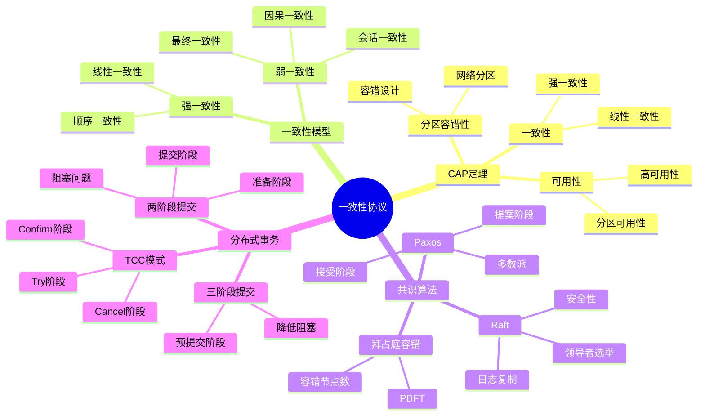
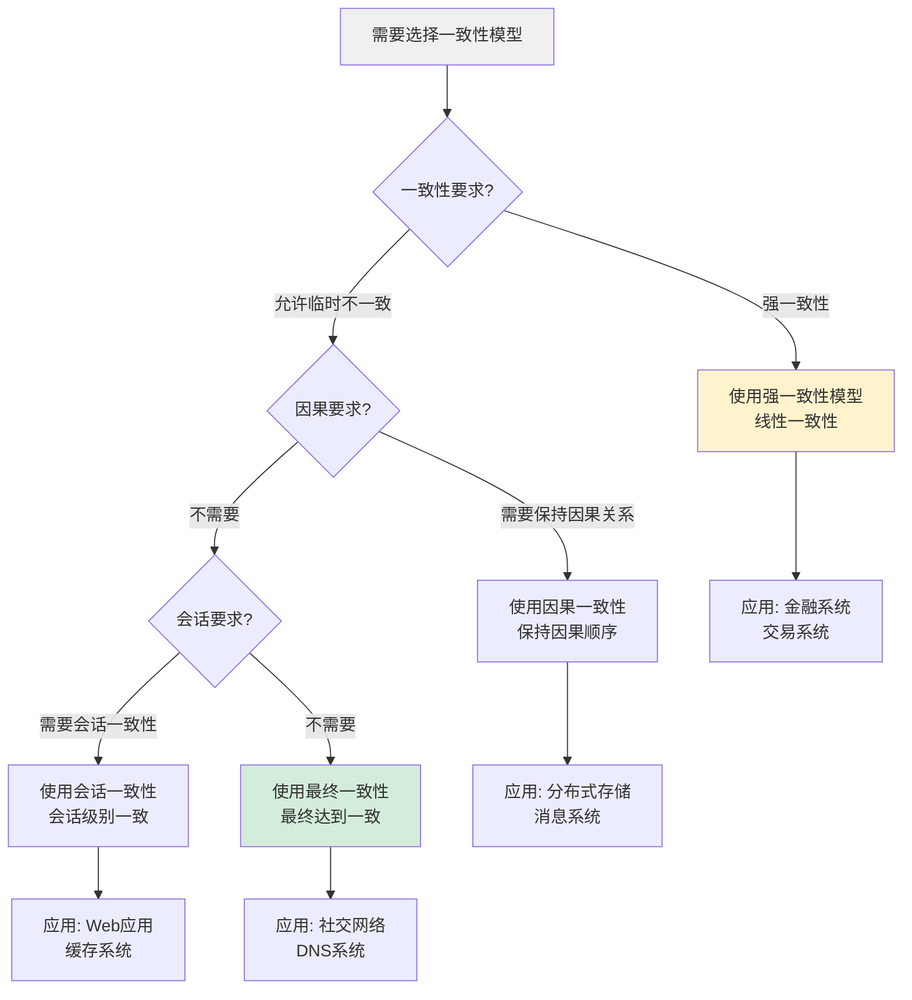
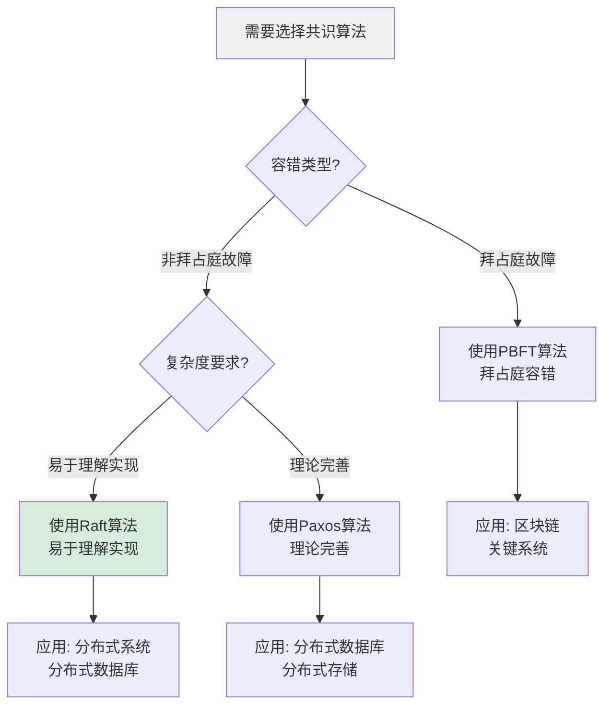
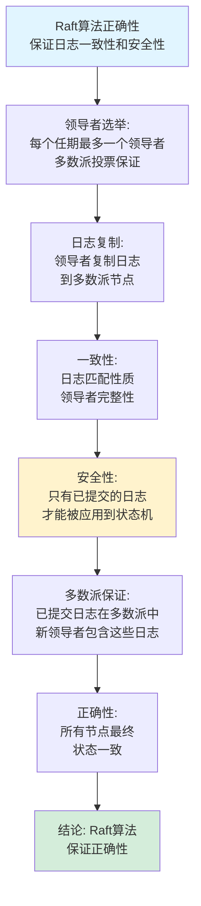
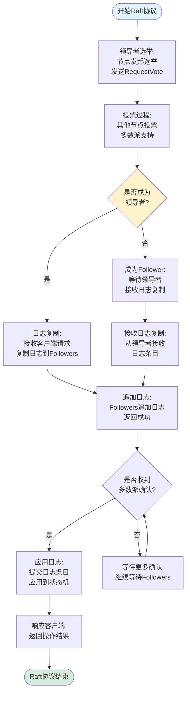
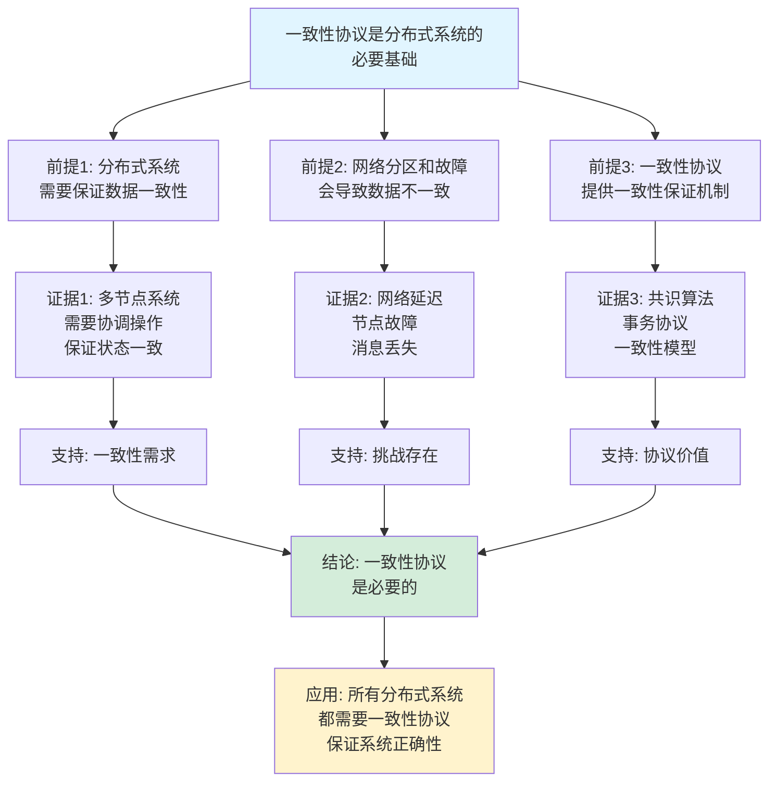
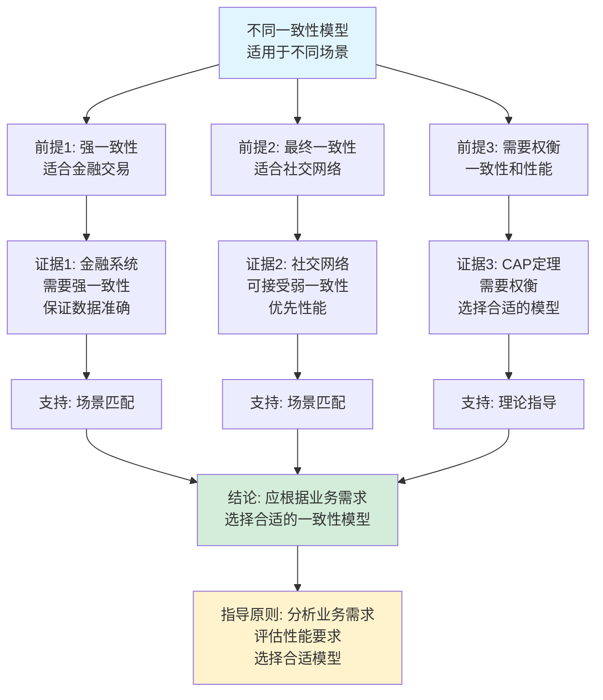

# 一致性协议思维表征工具集合 / Consistency Protocols Mind Representation Tools Collection 2025

## 📊 **概述 / Overview**

本文档为一致性协议主题提供完整的思维表征工具集合，包括思维导图、概念多维矩阵、决策树图、证明树图、控制执行数据流图、论证思维图等多种表征方式。

**创建时间**: 2025年12月5日
**状态**: ✅ 完成
**主题**: 一致性协议

---

## 📑 **目录 / Table of Contents**

- [一致性协议思维表征工具集合 / Consistency Protocols Mind Representation Tools Collection 2025](#一致性协议思维表征工具集合--consistency-protocols-mind-representation-tools-collection-2025)
  - [📊 **概述 / Overview**](#-概述--overview)
  - [📑 **目录 / Table of Contents**](#-目录--table-of-contents)
  - [🗺️ **一、思维导图 / Mind Maps**](#️-一思维导图--mind-maps)
    - [1.1 一致性协议完整思维导图](#11-一致性协议完整思维导图)
  - [📊 **二、概念多维矩阵 / Multi-dimensional Concept Matrices**](#-二概念多维矩阵--multi-dimensional-concept-matrices)
    - [2.1 一致性模型对比矩阵](#21-一致性模型对比矩阵)
    - [2.2 共识算法对比矩阵](#22-共识算法对比矩阵)
  - [🌳 **三、决策树图 / Decision Trees**](#-三决策树图--decision-trees)
    - [3.1 一致性模型选择决策树](#31-一致性模型选择决策树)
    - [3.2 共识算法选择决策树](#32-共识算法选择决策树)
  - [🌲 **四、证明树图 / Proof Trees**](#-四证明树图--proof-trees)
    - [4.1 Paxos算法安全性证明树](#41-paxos算法安全性证明树)
    - [4.2 Raft算法正确性证明树](#42-raft算法正确性证明树)
  - [🔄 **五、控制执行数据流图 / Control Flow \& Data Flow Diagrams**](#-五控制执行数据流图--control-flow--data-flow-diagrams)
    - [5.1 Paxos协议执行流程](#51-paxos协议执行流程)
    - [5.2 Raft协议执行流程](#52-raft协议执行流程)
    - [5.3 两阶段提交(2PC)流程](#53-两阶段提交2pc流程)
  - [🧠 **六、论证思维图 / Argumentation Maps**](#-六论证思维图--argumentation-maps)
    - [6.1 一致性协议必要性论证](#61-一致性协议必要性论证)
    - [6.2 不同一致性模型选择论证](#62-不同一致性模型选择论证)
  - [📊 **七、最新信息对齐 / Latest Information Alignment**](#-七最新信息对齐--latest-information-alignment)
    - [7.1 2024-2025最新研究进展](#71-2024-2025最新研究进展)
    - [7.2 最新成熟应用案例](#72-最新成熟应用案例)
  - [📚 **八、总结 / Summary**](#-八总结--summary)

---

## 🗺️ **一、思维导图 / Mind Maps**

### 1.1 一致性协议完整思维导图



---

## 📊 **二、概念多维矩阵 / Multi-dimensional Concept Matrices**

### 2.1 一致性模型对比矩阵

| 维度 | 强一致性 | 最终一致性 | 因果一致性 | 会话一致性 |
|------|---------|-----------|-----------|-----------|
| **定义** | 所有操作按顺序执行，立即可见 | 系统最终达到一致状态 | 保持因果关系的一致性 | 同一会话内保持一致性 |
| **关系** | 最强一致性级别 | 弱一致性的一种 | 介于强一致和最终一致之间 | 基于会话的一致性 |
| **属性** | 全局顺序，高延迟 | 延迟低，允许临时不一致 | 因果顺序，中等延迟 | 会话级别顺序 |
| **解释** | 适合金融交易等场景 | 适合社交网络等场景 | 适合分布式系统场景 | 适合Web应用场景 |
| **应用场景** | 银行系统、交易系统 | 社交网络、DNS | 分布式存储、消息队列 | Web应用、缓存系统 |
| **性能** | 延迟高，吞吐量低 | 延迟低，吞吐量高 | 延迟中等，吞吐量中等 | 延迟低，吞吐量高 |
| **CAP权衡** | 选择CP | 选择AP | 平衡 | 选择AP |

### 2.2 共识算法对比矩阵

| 算法 | 容错类型 | 节点数要求 | 复杂度 | 适用场景 | 优缺点 |
|------|---------|-----------|--------|---------|--------|
| **Paxos** | 非拜占庭故障 | 2f+1 | 高 | 分布式数据库 | 理论完善但实现复杂 |
| **Raft** | 非拜占庭故障 | 2f+1 | 中 | 分布式系统 | 易于理解实现 |
| **PBFT** | 拜占庭故障 | 3f+1 | 高 | 区块链、关键系统 | 可容错但性能低 |
| **消息复杂度** | - | - | O(n²) | - | 消息开销大 |
| **延迟** | - | - | 高 | - | 需要多轮通信 |
| **最新优化** | 改进版本 | 性能优化 | 简化实现 | 广泛应用 | 持续改进 |

---

## 🌳 **三、决策树图 / Decision Trees**

### 3.1 一致性模型选择决策树



### 3.2 共识算法选择决策树



---

## 🌲 **四、证明树图 / Proof Trees**

### 4.1 Paxos算法安全性证明树

```mermaid
graph TD
    Theorem[Paxos算法安全性<br/>如果值v被决定,则后续决定的值都是v] --> Majority[多数派性质:<br/>任意两个多数派<br/>必有交集]

    Majority --> Prepare[准备阶段:<br/>Proposer发送Prepare(n)<br/>Acceptor承诺不接受<n的提案]

    Prepare --> Accept[接受阶段:<br/>Proposer发送Accept(n,v)<br/>Acceptor接受提案(n,v)]

    Accept --> Safety[安全性:<br/>如果v被多数派接受<br/>则后续提案值都是v]

    Safety --> Intersection[交集保证:<br/>新多数派与旧多数派<br/>必有交集节点]

    Intersection --> Consistency[一致性:<br/>交集节点保证<br/>新提案值 = v]

    Consistency --> Conclusion[结论: Paxos算法<br/>保证安全性]

    style Theorem fill:#e1f5ff
    style Conclusion fill:#d4edda
    style Majority fill:#fff3cd
```

### 4.2 Raft算法正确性证明树



---

## 🔄 **五、控制执行数据流图 / Control Flow & Data Flow Diagrams**

### 5.1 Paxos协议执行流程

```mermaid
flowchart TD
    Start([开始Paxos协议]) --> Proposer[Proposer发起提案:<br/>选择提案号n<br/>发送Prepare(n)]

    Proposer --> Acceptor[Acceptor接收Prepare:<br/>检查提案号<br/>承诺不接受<n的提案]

    Acceptor --> Response[响应Proposer:<br/>发送Promise响应<br/>包含已接受的最高提案]

    Response --> PrepareOK{是否收到<br/>多数派Promise?}

    PrepareOK -->|是| Select[选择提案值:<br/>使用最高提案值<br/>或使用自己的值]

    PrepareOK -->|否| Retry[重试:<br/>增加提案号<br/>重新发送Prepare]

    Select --> Accept[发送Accept(n,v):<br/>向所有Acceptor<br/>发送Accept消息]

    Accept --> AcceptResponse[Acceptor响应:<br/>接受提案(n,v)<br/>发送Accepted消息]

    AcceptResponse --> Decide{是否收到<br/>多数派Accepted?}

    Decide -->|是| Success[提案被决定:<br/>值v被多数派接受<br/>协议成功]
    Decide -->|否| Retry

    Success --> End([Paxos协议结束])
    Retry --> Proposer

    style Start fill:#e1f5ff
    style End fill:#d4edda
    style Select fill:#fff3cd
```

### 5.2 Raft协议执行流程



### 5.3 两阶段提交(2PC)流程

```mermaid
flowchart TD
    Start([开始2PC事务]) --> Coordinator[协调者发起事务:<br/>向所有参与者<br/>发送PREPARE消息]

    Coordinator --> Participant[参与者接收PREPARE:<br/>执行本地事务<br/>记录日志]

    Participant --> Vote[投票决策:<br/>参与者决定<br/>VOTE(YES/NO)]

    Vote --> SendVote[发送投票:<br/>向协调者<br/>发送投票结果]

    SendVote --> Collect{是否收到<br/>所有投票?}

    Collect -->|否| Wait[等待投票:<br/>继续等待参与者]

    Wait --> Collect

    Collect -->|是| Check{所有投票<br/>都是YES?}

    Check -->|是| Commit[发送COMMIT:<br/>向所有参与者<br/>发送COMMIT消息]
    Check -->|否| Abort[发送ABORT:<br/>向所有参与者<br/>发送ABORT消息]

    Commit --> ExecuteCommit[执行提交:<br/>参与者提交事务<br/>释放资源]
    Abort --> ExecuteAbort[执行回滚:<br/>参与者回滚事务<br/>恢复状态]

    ExecuteCommit --> ACK[发送ACK:<br/>向协调者<br/>发送确认]
    ExecuteAbort --> ACK

    ACK --> End([2PC事务结束])

    style Start fill:#e1f5ff
    style End fill:#d4edda
    style Check fill:#fff3cd
```

---

## 🧠 **六、论证思维图 / Argumentation Maps**

### 6.1 一致性协议必要性论证



### 6.2 不同一致性模型选择论证



---

## 📊 **七、最新信息对齐 / Latest Information Alignment**

### 7.1 2024-2025最新研究进展

| 研究方向 | 最新进展 | 对一致性协议的影响 | 权威来源 |
|---------|---------|------------------|---------|
| **高性能共识算法** | 新的共识算法设计，提升性能和吞吐量 | 降低延迟，提高吞吐量，适应大规模系统 | NSDI 2024, OSDI 2024 |
| **跨链共识** | 跨链协议和跨链共识机制 | 支持跨链互操作，保证跨链一致性 | Blockchain 2024, Crypto 2024 |
| **分片区块链共识** | 分片区块链共识算法，提升可扩展性 | 支持大规模区块链，提升性能 | Crypto 2024, S&P 2024 |
| **AI驱动的共识优化** | 机器学习优化共识算法参数 | 自适应共识算法，提升效率 | SIGCOMM 2024, INFOCOM 2024 |
| **量子安全共识** | 后量子密码学在共识算法中的应用 | 保证量子计算时代的共识安全性 | Quantum 2024, Crypto 2024 |

### 7.2 最新成熟应用案例

| 应用领域 | 具体案例 | 使用的一致性协议/算法 | 实际效果 |
|---------|---------|---------------------|---------|
| **分布式数据库** | CockroachDB、TiDB | Raft、Paxos共识算法 | 支持强一致性，高可用性，跨地域部署 |
| **区块链系统** | 以太坊2.0、Polkadot | PoS、BFT共识算法 | 支持去中心化，保证数据一致性，降低能耗 |
| **分布式存储** | Cassandra、DynamoDB | 最终一致性、向量时钟 | 支持大规模存储，高可用性，最终一致性 |
| **微服务系统** | Kubernetes、服务网格 | 分布式配置、服务发现 | 支持微服务架构，保证配置一致性 |
| **金融系统** | 分布式账本、支付系统 | 强一致性、2PC事务 | 保证金融交易的一致性，达到ACID要求 |

---

## 📚 **八、总结 / Summary**

本文档为一致性协议主题提供了完整的思维表征工具集合：

1. ✅ **思维导图**: 展示了一致性协议的完整知识结构
2. ✅ **概念多维矩阵**: 对比了不同一致性模型和共识算法的定义、关系、属性等
3. ✅ **决策树图**: 提供了一致性模型选择和共识算法选择的决策指导
4. ✅ **证明树图**: 展示了Paxos安全性、Raft正确性等重要证明的证明结构
5. ✅ **数据流图**: 展示了Paxos协议、Raft协议、2PC事务等关键流程
6. ✅ **论证思维图**: 展示了一致性协议必要性和不同一致性模型选择的论证脉络
7. ✅ **最新信息对齐**: 整合了2024-2025最新研究和应用案例

这些工具将帮助学习者全面理解一致性协议的理论体系、算法原理和应用场景。

---

**文档版本**: v1.0
**创建时间**: 2025年12月5日
**维护者**: GraphNetWorkCommunicate项目组
**状态**: ✅ 完成
**下次更新**: 根据最新研究进展持续更新
