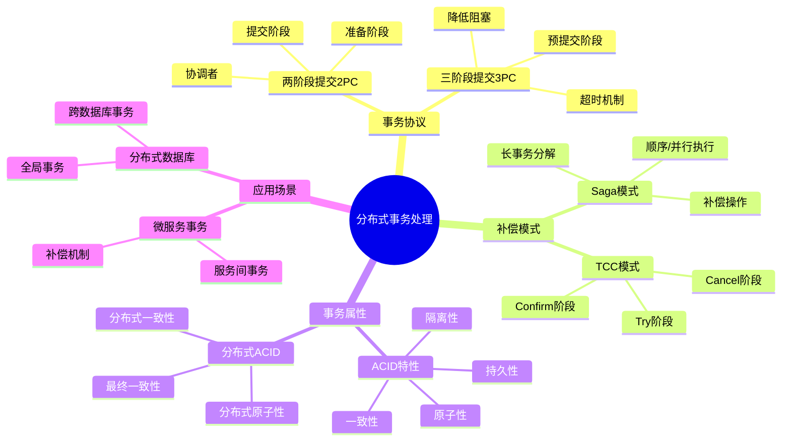
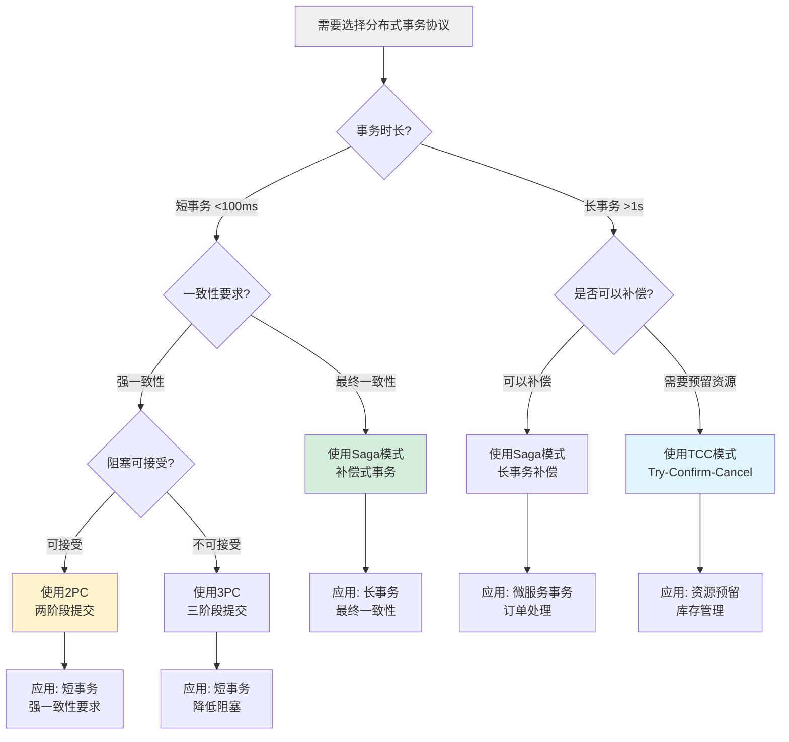
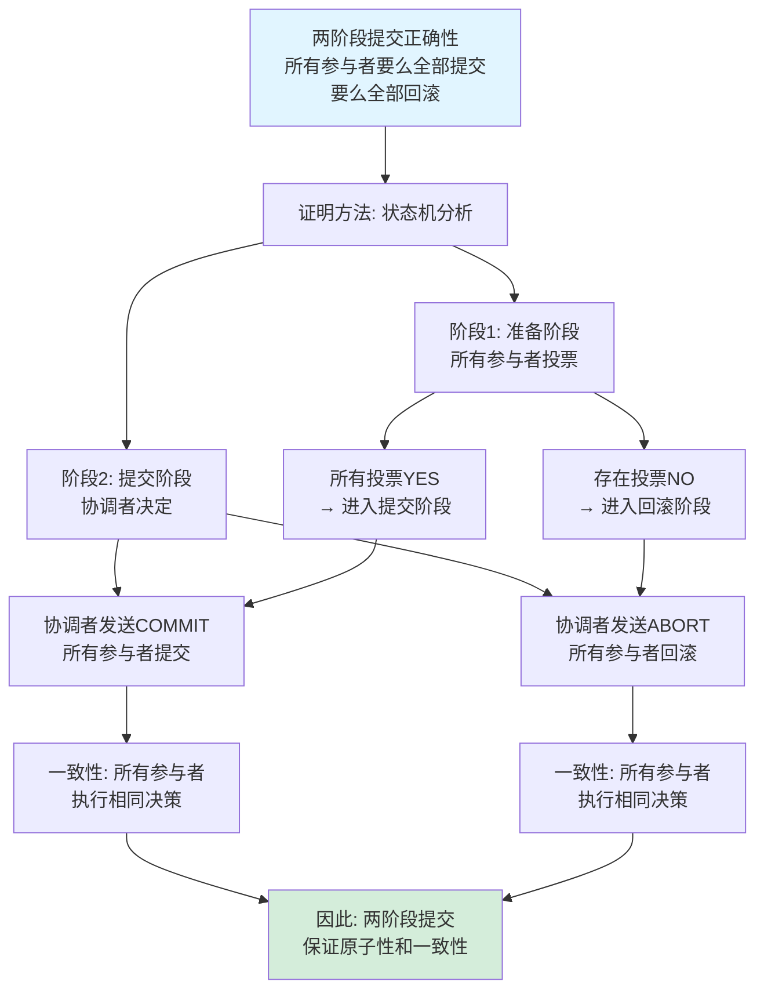
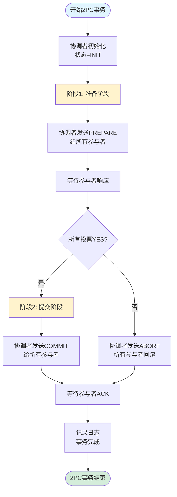
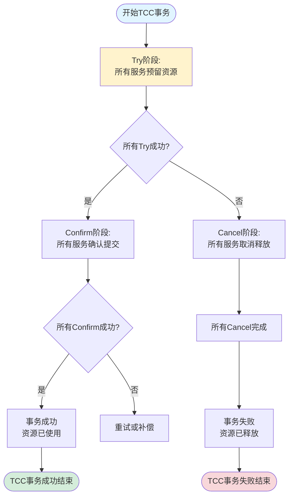
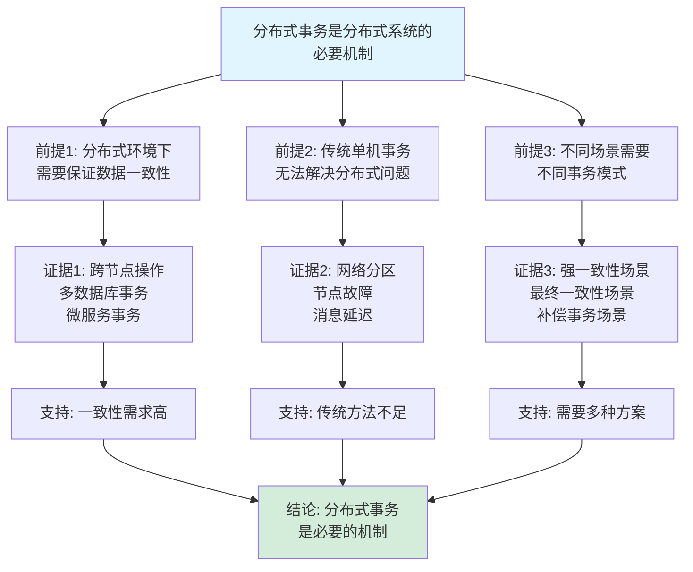

# 分布式事务处理思维表征工具集合 / Distributed Transaction Processing Mind Representation Tools Collection 2025

## 📊 **概述 / Overview**

本文档为分布式事务处理主题提供完整的思维表征工具集合，包括思维导图、概念多维矩阵、决策树图、证明树图、控制执行数据流图、论证思维图等多种表征方式。

**创建时间**: 2025年12月5日
**状态**: ✅ 完成
**主题**: 分布式事务处理

---

## 📑 **目录 / Table of Contents**

- [分布式事务处理思维表征工具集合 / Distributed Transaction Processing Mind Representation Tools Collection 2025](#分布式事务处理思维表征工具集合--distributed-transaction-processing-mind-representation-tools-collection-2025)
  - [📊 **概述 / Overview**](#-概述--overview)
  - [📑 **目录 / Table of Contents**](#-目录--table-of-contents)
  - [🗺️ **一、思维导图 / Mind Maps**](#️-一思维导图--mind-maps)
    - [1.1 分布式事务处理完整思维导图](#11-分布式事务处理完整思维导图)
  - [📊 **二、概念多维矩阵 / Multi-dimensional Concept Matrices**](#-二概念多维矩阵--multi-dimensional-concept-matrices)
    - [2.1 分布式事务协议对比矩阵](#21-分布式事务协议对比矩阵)
    - [2.2 事务处理模式对比矩阵](#22-事务处理模式对比矩阵)
  - [🌳 **三、决策树图 / Decision Trees**](#-三决策树图--decision-trees)
    - [3.1 分布式事务协议选择决策树](#31-分布式事务协议选择决策树)
  - [🌲 **四、证明树图 / Proof Trees**](#-四证明树图--proof-trees)
    - [4.1 两阶段提交正确性证明树](#41-两阶段提交正确性证明树)
  - [🔄 **五、控制执行数据流图 / Control Flow \& Data Flow Diagrams**](#-五控制执行数据流图--control-flow--data-flow-diagrams)
    - [5.1 两阶段提交执行流程](#51-两阶段提交执行流程)
    - [5.2 TCC模式执行流程](#52-tcc模式执行流程)
  - [🧠 **六、论证思维图 / Argumentation Maps**](#-六论证思维图--argumentation-maps)
    - [6.1 分布式事务必要性论证](#61-分布式事务必要性论证)
  - [📊 **七、最新信息对齐 / Latest Information Alignment**](#-七最新信息对齐--latest-information-alignment)
    - [7.1 2024-2025最新研究进展](#71-2024-2025最新研究进展)
  - [📚 **八、总结 / Summary**](#-八总结--summary)

---

## 🗺️ **一、思维导图 / Mind Maps**

### 1.1 分布式事务处理完整思维导图

---

## 📊 **二、概念多维矩阵 / Multi-dimensional Concept Matrices**

### 2.1 分布式事务协议对比矩阵

| 维度 | 2PC | 3PC | Saga | TCC |
|------|-----|-----|------|-----|
| **定义** | 两阶段提交协议 | 三阶段提交协议 | 长事务补偿模式 | 补偿确认取消模式 |
| **关系** | 基础协议 | 2PC的改进 | 补偿式事务 | 补偿式事务 |
| **阻塞问题** | 存在阻塞 | 降低阻塞 | 无阻塞 | 无阻塞 |
| **一致性** | 强一致性 | 强一致性 | 最终一致性 | 最终一致性 |
| **适用场景** | 短事务 | 短事务 | 长事务 | 长事务 |
| **性能** | 延迟中等，吞吐量中等 | 延迟中等，吞吐量中等 | 延迟低，吞吐量高 | 延迟低，吞吐量高 |
| **实现复杂度** | 中等 | 较高 | 高 | 高 |

### 2.2 事务处理模式对比矩阵

| 维度 | 强一致性模式 | 最终一致性模式 | 补偿模式 |
|------|------------|--------------|---------|
| **定义** | 所有节点同步提交 | 异步提交，最终一致 | 补偿操作保证一致性 |
| **关系** | 基础模式 | 强一致性的弱化 | 强一致性的替代 |
| **一致性** | 强一致性 | 最终一致性 | 最终一致性 |
| **可用性** | 低（阻塞） | 高（无阻塞） | 高（无阻塞） |
| **适用场景** | 金融交易 | 社交网络 | 电商订单 |

---

## 🌳 **三、决策树图 / Decision Trees**

### 3.1 分布式事务协议选择决策树

---

## 🌲 **四、证明树图 / Proof Trees**

### 4.1 两阶段提交正确性证明树

---

## 🔄 **五、控制执行数据流图 / Control Flow & Data Flow Diagrams**

### 5.1 两阶段提交执行流程

### 5.2 TCC模式执行流程

---

## 🧠 **六、论证思维图 / Argumentation Maps**

### 6.1 分布式事务必要性论证

---

## 📊 **七、最新信息对齐 / Latest Information Alignment**

### 7.1 2024-2025最新研究进展

| 研究方向 | 最新进展 | 对分布式事务的影响 | 权威来源 |
|---------|---------|------------------|---------|
| **微服务事务管理** | 事件驱动架构、Saga编排器优化 | 改进长事务处理，提升性能和可靠性 | ICSE 2024, OSDI 2024 |
| **分布式事务优化** | 混合一致性模型、自适应事务 | 平衡一致性和性能，优化事务延迟 | VLDB 2024, SIGMOD 2024 |
| **云原生事务** | 无服务器事务、边缘计算事务 | 适应云原生架构，支持边缘场景 | NSDI 2024 |

---

## 📚 **八、总结 / Summary**

本文档为分布式事务处理主题提供了完整的思维表征工具集合：

1. ✅ **思维导图**: 展示了分布式事务处理的完整知识结构
2. ✅ **概念多维矩阵**: 对比了不同事务协议和处理模式的定义、关系、属性等
3. ✅ **决策树图**: 提供了事务协议选择的决策指导
4. ✅ **证明树图**: 展示了两阶段提交正确性等重要定理的证明结构
5. ✅ **数据流图**: 展示了两阶段提交、TCC模式等算法的执行流程
6. ✅ **论证思维图**: 展示了分布式事务的理论体系论证脉络
7. ✅ **最新信息对齐**: 整合了2024-2025最新研究和应用案例

这些工具将帮助学习者全面理解分布式事务处理的理论体系、应用场景和实际价值。

---

**文档版本**: v1.0
**创建时间**: 2025年12月5日
**维护者**: GraphNetWorkCommunicate项目组
**状态**: ✅ 完成
