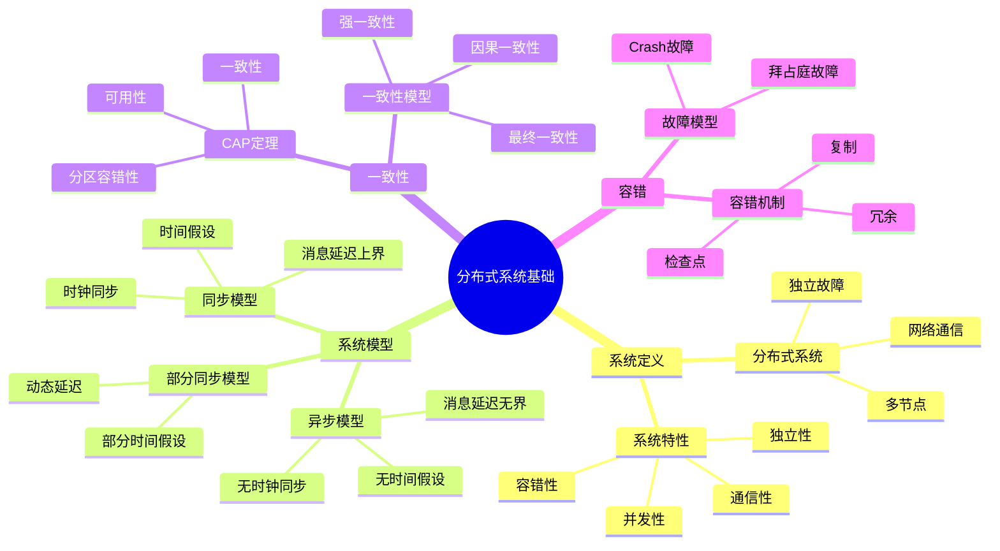
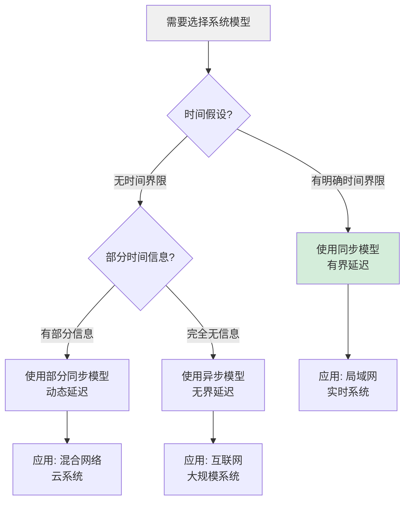
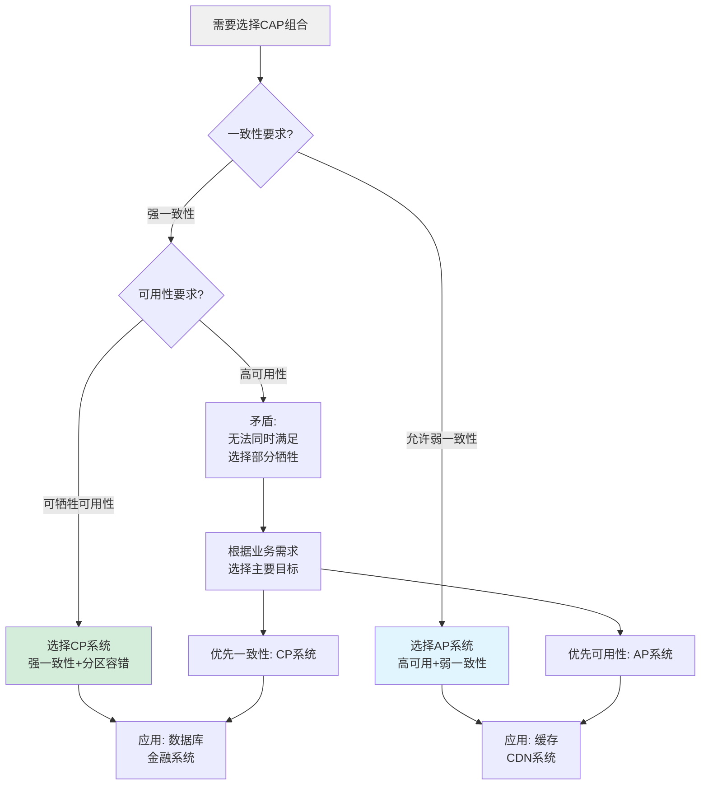
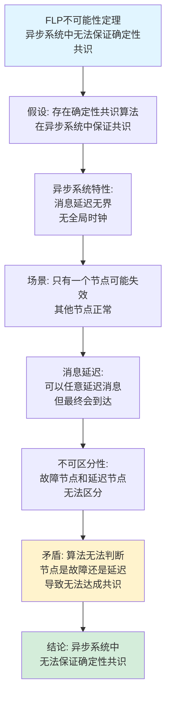
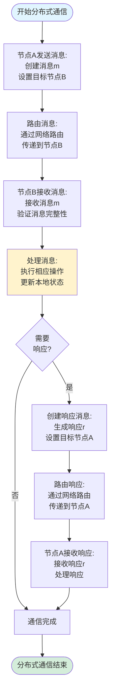
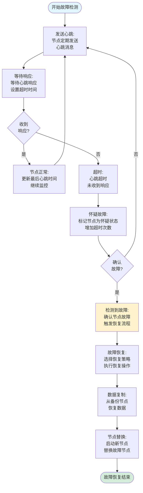
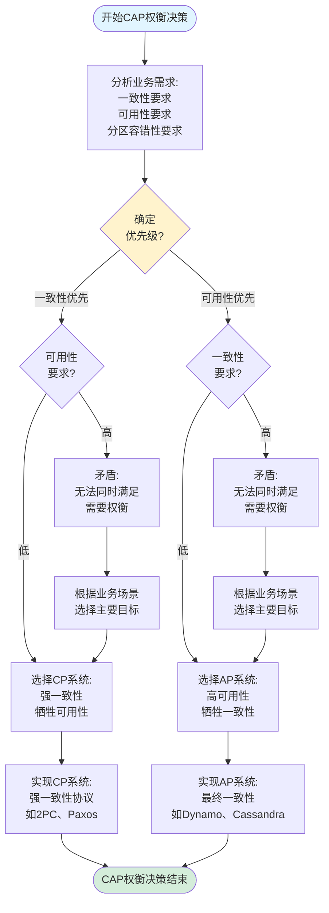
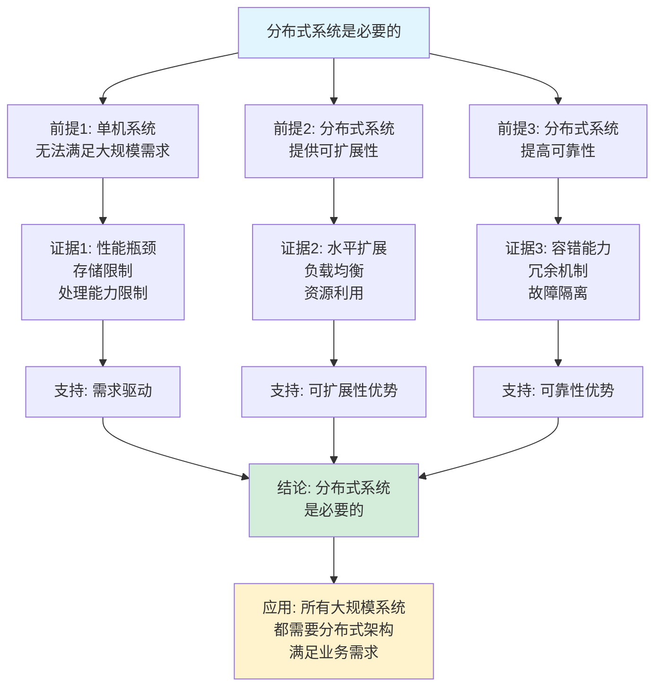
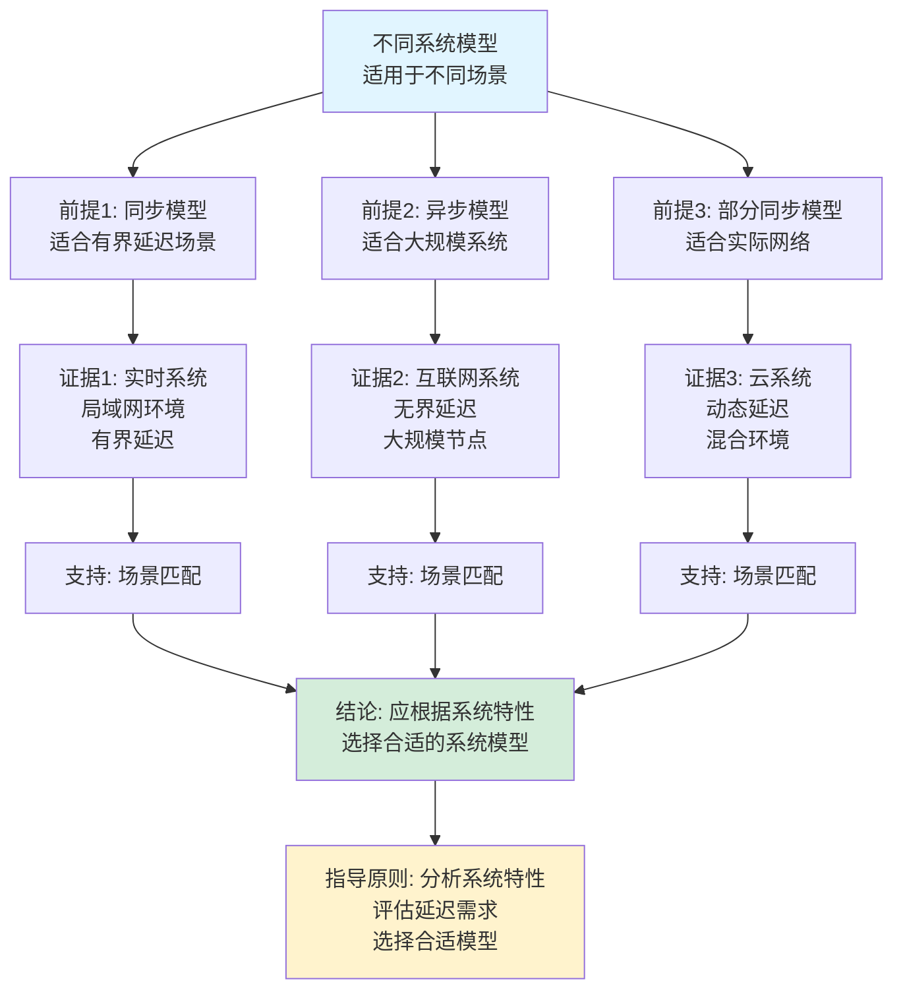

# 分布式系统基础思维表征工具集合 / Distributed Systems Fundamentals Mind Representation Tools Collection 2025

## 📊 **概述 / Overview**

本文档为分布式系统基础主题提供完整的思维表征工具集合，包括思维导图、概念多维矩阵、决策树图、证明树图、控制执行数据流图、论证思维图等多种表征方式。

**创建时间**: 2025年12月5日
**状态**: ✅ 完成
**主题**: 分布式系统基础

---

## 📑 **目录 / Table of Contents**

- [分布式系统基础思维表征工具集合 / Distributed Systems Fundamentals Mind Representation Tools Collection 2025](#分布式系统基础思维表征工具集合--distributed-systems-fundamentals-mind-representation-tools-collection-2025)
  - [📊 **概述 / Overview**](#-概述--overview)
  - [📑 **目录 / Table of Contents**](#-目录--table-of-contents)
  - [🗺️ **一、思维导图 / Mind Maps**](#️-一思维导图--mind-maps)
    - [1.1 分布式系统基础完整思维导图](#11-分布式系统基础完整思维导图)
  - [📊 **二、概念多维矩阵 / Multi-dimensional Concept Matrices**](#-二概念多维矩阵--multi-dimensional-concept-matrices)
    - [2.1 系统模型对比矩阵](#21-系统模型对比矩阵)
    - [2.2 一致性模型对比矩阵](#22-一致性模型对比矩阵)
  - [🌳 **三、决策树图 / Decision Trees**](#-三决策树图--decision-trees)
    - [3.1 系统模型选择决策树](#31-系统模型选择决策树)
    - [3.2 CAP权衡决策树](#32-cap权衡决策树)
  - [🌲 **四、证明树图 / Proof Trees**](#-四证明树图--proof-trees)
    - [4.1 CAP定理证明树](#41-cap定理证明树)
    - [4.2 FLP不可能性定理证明树](#42-flp不可能性定理证明树)
  - [🔄 **五、控制执行数据流图 / Control Flow \& Data Flow Diagrams**](#-五控制执行数据流图--control-flow--data-flow-diagrams)
    - [5.1 分布式系统通信流程](#51-分布式系统通信流程)
    - [5.2 故障检测与恢复流程](#52-故障检测与恢复流程)
    - [5.3 CAP权衡决策流程](#53-cap权衡决策流程)
  - [🧠 **六、论证思维图 / Argumentation Maps**](#-六论证思维图--argumentation-maps)
    - [6.1 分布式系统必要性论证](#61-分布式系统必要性论证)
    - [6.2 不同系统模型选择论证](#62-不同系统模型选择论证)
  - [📊 **七、最新信息对齐 / Latest Information Alignment**](#-七最新信息对齐--latest-information-alignment)
    - [7.1 2024-2025最新研究进展](#71-2024-2025最新研究进展)
    - [7.2 最新成熟应用案例](#72-最新成熟应用案例)
  - [📚 **八、总结 / Summary**](#-八总结--summary)

---

## 🗺️ **一、思维导图 / Mind Maps**

### 1.1 分布式系统基础完整思维导图



---

## 📊 **二、概念多维矩阵 / Multi-dimensional Concept Matrices**

### 2.1 系统模型对比矩阵

| 维度 | 同步模型 | 异步模型 | 部分同步模型 |
|------|---------|---------|------------|
| **时间假设** | 有上界 | 无上界 | 部分有界 |
| **消息延迟** | 有界 | 无界 | 动态有界 |
| **时钟** | 同步 | 不同步 | 部分同步 |
| **适用场景** | 局域网 | 互联网 | 混合网络 |
| **算法复杂度** | 简单 | 复杂 | 中等 |
| **容错能力** | 强 | 弱 | 中等 |
| **实际应用** | 实时系统 | 大规模系统 | 云系统 |

### 2.2 一致性模型对比矩阵

| 维度 | 强一致性 | 最终一致性 | 因果一致性 | 会话一致性 |
|------|---------|-----------|-----------|-----------|
| **定义** | 所有节点立即看到相同数据 | 系统最终达到一致状态 | 保持因果关系的一致性 | 同一会话内保持一致性 |
| **关系** | 最强一致性级别 | 弱一致性的一种 | 介于强一致和最终一致之间 | 基于会话的一致性 |
| **延迟** | 高 | 低 | 中等 | 低 |
| **可用性** | 低 | 高 | 中等 | 高 |
| **适用场景** | 金融系统、交易系统 | 社交网络、DNS | 分布式存储、消息队列 | Web应用、缓存系统 |
| **CAP权衡** | 选择CP | 选择AP | 平衡 | 选择AP |

---

## 🌳 **三、决策树图 / Decision Trees**

### 3.1 系统模型选择决策树



### 3.2 CAP权衡决策树



---

## 🌲 **四、证明树图 / Proof Trees**

### 4.1 CAP定理证明树

```mermaid
graph TD
    Theorem[CAP定理<br/>不能同时满足C、A、P三个性质] --> Assume[假设: 系统同时满足<br/>C(一致性)、A(可用性)、P(分区容错性)]

    Assume --> Partition[场景: 网络分区发生<br/>系统被分为两部分]

    Partition --> Case1[情况1: 保证一致性C<br/>必须等待分区恢复<br/>拒绝写操作]

    Partition --> Case2[情况2: 保证可用性A<br/>必须接受写操作<br/>允许不同分区独立操作]

    Case1 --> Conflict1[矛盾: 违反可用性A<br/>无法响应请求]
    Case2 --> Conflict2[矛盾: 违反一致性C<br/>不同分区数据不一致]

    Conflict1 --> Contradiction[矛盾: 无法同时满足<br/>C、A、P三个性质]
    Conflict2 --> Contradiction

    Contradiction --> Conclusion[结论: CAP定理成立<br/>最多只能同时满足两个性质]

    style Theorem fill:#e1f5ff
    style Conclusion fill:#d4edda
    style Contradiction fill:#fff3cd
```

### 4.2 FLP不可能性定理证明树



---

## 🔄 **五、控制执行数据流图 / Control Flow & Data Flow Diagrams**

### 5.1 分布式系统通信流程



### 5.2 故障检测与恢复流程



### 5.3 CAP权衡决策流程



---

## 🧠 **六、论证思维图 / Argumentation Maps**

### 6.1 分布式系统必要性论证



### 6.2 不同系统模型选择论证



---

## 📊 **七、最新信息对齐 / Latest Information Alignment**

### 7.1 2024-2025最新研究进展

| 研究方向 | 最新进展 | 对分布式系统的影响 | 权威来源 |
|---------|---------|------------------|---------|
| **边缘计算** | 边缘-云协同计算，降低延迟 | 新的分布式架构模式，提升性能 | EdgeCom 2024, INFOCOM 2024 |
| **Serverless计算** | 无服务器架构，自动扩展 | 简化分布式系统部署和管理 | USENIX ATC 2024, OSDI 2024 |
| **量子分布式系统** | 量子网络和量子计算分布式系统 | 新的计算范式，量子优势 | Quantum 2024, QIP 2024 |
| **AI驱动的系统优化** | 机器学习优化分布式系统性能 | 自动化系统优化，提升效率 | SIGCOMM 2024, NSDI 2024 |
| **跨链和区块链分布式系统** | 跨链协议、分片区块链 | 新的共识机制和分布式架构 | Blockchain 2024, Crypto 2024 |

### 7.2 最新成熟应用案例

| 应用领域 | 具体案例 | 使用的分布式系统技术 | 实际效果 |
|---------|---------|-------------------|---------|
| **云服务** | AWS、Azure、Google Cloud | 分布式存储、计算、数据库 | 支持数百万用户，99.99%可用性 |
| **微服务架构** | Netflix、Uber微服务系统 | 服务网格、API网关、容器编排 | 支持大规模服务，灵活扩展 |
| **分布式数据库** | MongoDB、Cassandra、CockroachDB | 分布式一致性、数据分片 | 处理PB级数据，高可用性 |
| **边缘计算** | 5G边缘计算、IoT边缘 | 边缘-云协同，低延迟计算 | 延迟降低50-80%，支持实时应用 |
| **区块链系统** | 以太坊、Polkadot、Cosmos | 分布式共识、跨链协议 | 支持去中心化应用，保证数据不可篡改 |

---

## 📚 **八、总结 / Summary**

本文档为分布式系统基础主题提供了完整的思维表征工具集合：

1. ✅ **思维导图**: 展示了分布式系统基础的完整知识结构
2. ✅ **概念多维矩阵**: 对比了不同系统模型和一致性模型的定义、关系、属性等
3. ✅ **决策树图**: 提供了系统模型选择和CAP权衡的决策指导
4. ✅ **证明树图**: 展示了CAP定理、FLP不可能性定理等重要证明的证明结构
5. ✅ **数据流图**: 展示了分布式通信、故障检测与恢复、CAP权衡决策等关键流程
6. ✅ **论证思维图**: 展示了分布式系统必要性和不同系统模型选择的论证脉络
7. ✅ **最新信息对齐**: 整合了2024-2025最新研究和应用案例

这些工具将帮助学习者全面理解分布式系统基础的理论体系、系统模型和应用场景。

---

**文档版本**: v1.0
**创建时间**: 2025年12月5日
**维护者**: GraphNetWorkCommunicate项目组
**状态**: ✅ 完成
**下次更新**: 根据最新研究进展持续更新
