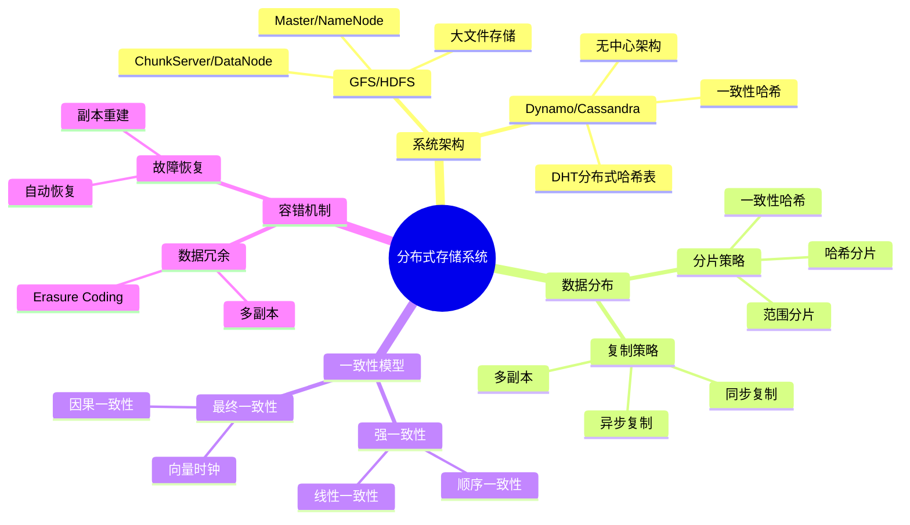
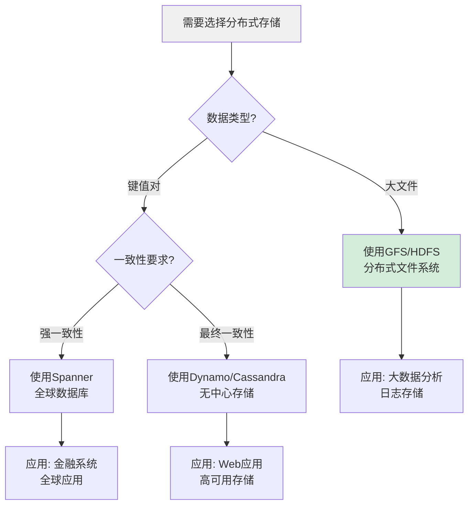
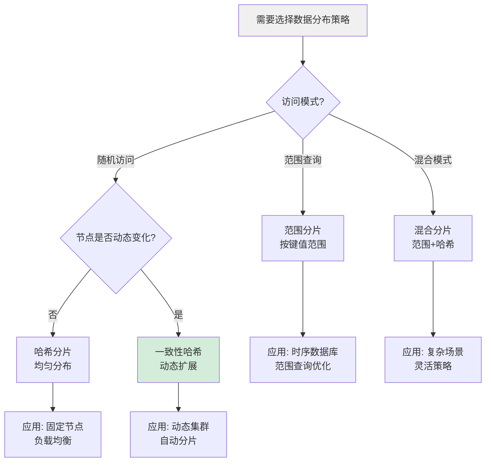
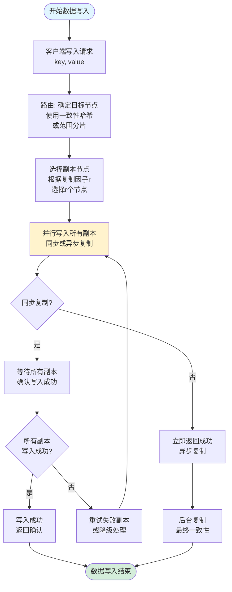
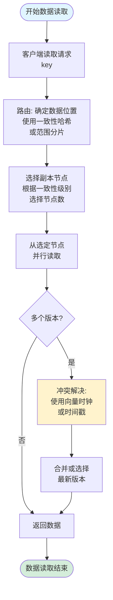
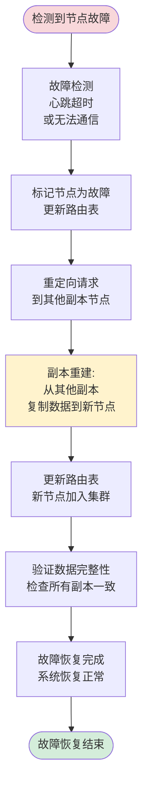
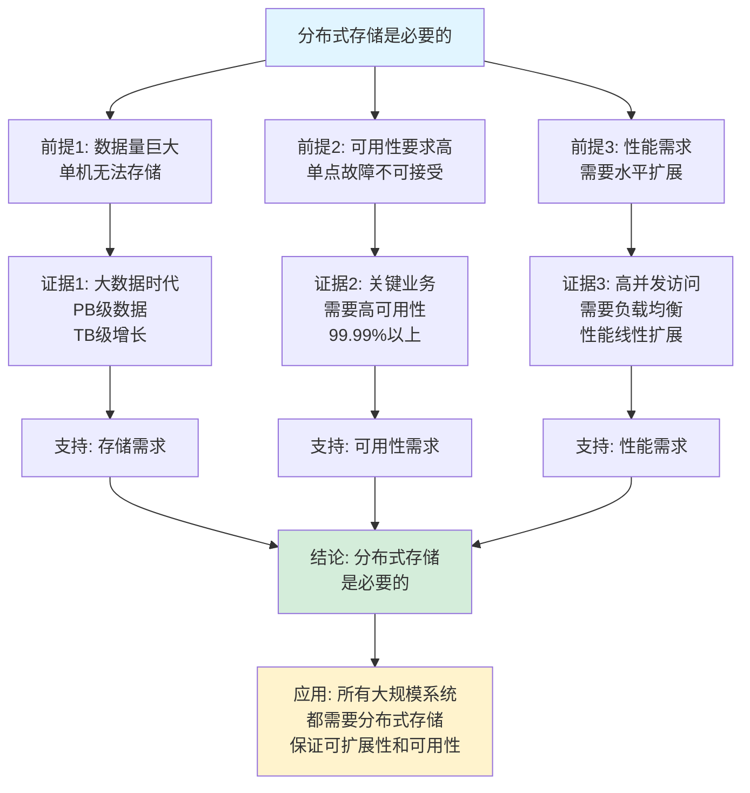
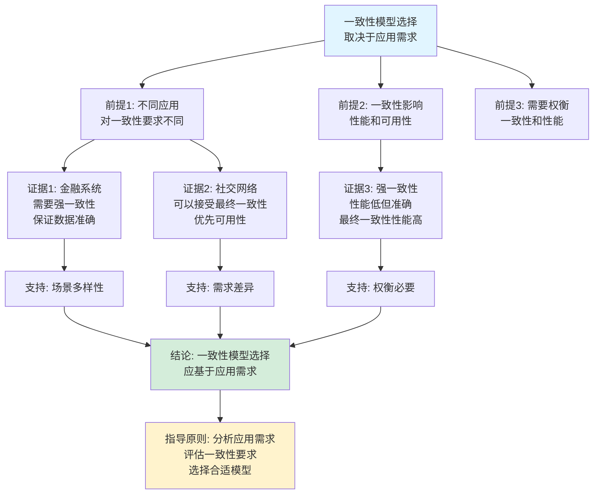

# 分布式存储系统思维表征工具集合 / Distributed Storage Systems Mind Representation Tools Collection 2025

## 📊 **概述 / Overview**

本文档为分布式存储系统主题提供完整的思维表征工具集合，包括思维导图、概念多维矩阵、决策树图、证明树图、控制执行数据流图、论证思维图等多种表征方式。

**创建时间**: 2025年12月5日
**状态**: ✅ 完成
**主题**: 分布式存储系统

---

## 📑 **目录 / Table of Contents**

- [分布式存储系统思维表征工具集合](#分布式存储系统思维表征工具集合--distributed-storage-systems-mind-representation-tools-collection-2025)
  - [📊 **概述 / Overview**](#-概述--overview)
  - [📑 **目录 / Table of Contents**](#-目录--table-of-contents)
  - [🗺️ **一、思维导图 / Mind Maps**](#️-一思维导图--mind-maps)
    - [1.1 分布式存储系统完整思维导图](#11-分布式存储系统完整思维导图)
  - [📊 **二、概念多维矩阵 / Multi-dimensional Concept Matrices**](#-二概念多维矩阵--multi-dimensional-concept-matrices)
    - [2.1 分布式存储系统对比矩阵](#21-分布式存储系统对比矩阵)
    - [2.2 数据分布策略对比矩阵](#22-数据分布策略对比矩阵)
  - [🌳 **三、决策树图 / Decision Trees**](#-三决策树图--decision-trees)
    - [3.1 分布式存储系统选择决策树](#31-分布式存储系统选择决策树)
  - [🌲 **四、证明树图 / Proof Trees**](#-四证明树图--proof-trees)
    - [4.1 一致性哈希正确性证明树](#41-一致性哈希正确性证明树)
  - [🔄 **五、控制执行数据流图 / Control Flow & Data Flow Diagrams**](#-五控制执行数据流图--control-flow--data-flow-diagrams)
    - [5.1 数据写入流程](#51-数据写入流程)
  - [🧠 **六、论证思维图 / Argumentation Maps**](#-六论证思维图--argumentation-maps)
    - [6.1 分布式存储必要性论证](#61-分布式存储必要性论证)
  - [📊 **七、最新信息对齐 / Latest Information Alignment**](#-七最新信息对齐--latest-information-alignment)
    - [7.1 2024-2025最新研究进展](#71-2024-2025最新研究进展)
  - [📚 **八、总结 / Summary**](#-八总结--summary)

---

## 🗺️ **一、思维导图 / Mind Maps**

### 1.1 分布式存储系统完整思维导图



---

## 📊 **二、概念多维矩阵 / Multi-dimensional Concept Matrices**

### 2.1 分布式存储系统对比矩阵

| 维度 | GFS/HDFS | Dynamo/Cassandra | Spanner |
|------|----------|------------------|---------|
| **定义** | 分布式文件系统 | 分布式键值存储 | 全球分布式数据库 |
| **关系** | 大文件存储 | 无中心存储 | 强一致性存储 |
| **一致性** | 最终一致性 | 可调一致性 | 强一致性 |
| **适用场景** | 大数据批处理 | Web应用 | 全球分布式应用 |
| **优缺点** | 高吞吐但高延迟 | 高可用但一致性弱 | 强一致但复杂度高 |

### 2.2 数据分布策略对比矩阵

| 维度 | 范围分片 | 哈希分片 | 一致性哈希 |
|------|---------|---------|-----------|
| **定义** | 按键值范围分片 | 按哈希值分片 | 环形哈希空间分片 |
| **关系** | 顺序访问友好 | 负载均衡 | 动态扩展友好 |
| **适用场景** | 范围查询 | 随机访问 | 动态节点 |
| **优缺点** | 查询高效但负载不均 | 负载均衡但范围查询困难 | 动态扩展但实现复杂 |

---

## 🌳 **三、决策树图 / Decision Trees**

### 3.1 分布式存储系统选择决策树



### 3.2 数据分布策略选择决策树



---

## 🌲 **四、证明树图 / Proof Trees**

### 4.1 一致性哈希正确性证明树

```mermaid
graph TD
    Theorem[一致性哈希正确性<br/>节点变化时最小化数据迁移] --> Property1[性质1: 负载均衡<br/>节点均匀分布在哈希环上]

    Property1 --> HashRing[哈希环结构:<br/>将哈希空间映射到环<br/>节点和数据都映射到环上]

    HashRing --> Locate[数据定位:<br/>数据映射到环上<br/>顺时针找到最近节点]

    Locate --> AddNode[添加节点:<br/>只影响相邻节点<br/>数据迁移最小]

    AddNode --> Migration[数据迁移量:<br/>O(1/n)的数据<br/>其中n是节点数]

    Theorem --> Property2[性质2: 单调性<br/>添加节点不减少数据]

    Property2 --> Consistent[一致性:<br/>节点顺序不变<br/>数据映射一致]

    Consistent --> Correct[正确性:<br/>一致性哈希<br/>保证最小迁移]

    Migration --> Conclusion[结论: 一致性哈希<br/>正确且高效]
    Correct --> Conclusion

    style Theorem fill:#e1f5ff
    style Conclusion fill:#d4edda
    style Migration fill:#fff3cd
```

### 4.2 向量时钟因果一致性证明树

```mermaid
graph TD
    Theorem[向量时钟保证因果一致性<br/>所有节点看到的事件顺序一致] --> Definition[定义: 向量时钟<br/>V[i]表示节点i已知的事件数]

    Definition --> HappenBefore[因果关系:<br/>事件A → 事件B<br/>如果A发生在B之前]

    HappenBefore --> VectorUpdate[向量更新规则:<br/>节点i发生事件时<br/>V[i] += 1]

    VectorUpdate --> Comparison[向量比较:<br/>V1 < V2 当且仅当<br/>V1的所有分量 ≤ V2<br/>且至少一个严格小于]

    Comparison --> Causality[因果关系判断:<br/>如果V(e1) < V(e2)<br/>则e1发生在e2之前]

    Causality --> Consistency[一致性:<br/>所有节点按向量时钟<br/>得到相同的因果顺序]

    Consistency --> Correctness[正确性:<br/>向量时钟保证<br/>因果一致性]

    Correctness --> Conclusion[结论: 向量时钟<br/>正确保证因果一致性]

    style Theorem fill:#e1f5ff
    style Conclusion fill:#d4edda
    style Causality fill:#fff3cd
```

---

## 🔄 **五、控制执行数据流图 / Control Flow & Data Flow Diagrams**

### 5.1 数据写入流程



### 5.2 数据读取流程



### 5.3 故障恢复流程



---

## 🧠 **六、论证思维图 / Argumentation Maps**

### 6.1 分布式存储必要性论证



### 6.2 一致性模型选择论证



---

## 📊 **七、最新信息对齐 / Latest Information Alignment**

### 7.1 2024-2025最新研究进展

| 研究方向 | 最新进展 | 对分布式存储的影响 | 权威来源 |
|---------|---------|------------------|---------|
| **新硬件存储** | 持久化内存(PMEM)、NVMe SSD优化 | 提升存储性能，降低延迟，支持更大规模存储 | FAST 2024, OSDI 2024 |
| **AI驱动的存储优化** | 使用机器学习优化数据分布、副本策略 | 自适应存储优化，提升存储效率和性能 | SIGMOD 2024, VLDB 2024 |
| **边缘存储** | 边缘计算环境下的分布式存储系统 | 支持边缘计算场景，降低数据传输延迟 | MobiCom 2024, INFOCOM 2024 |
| **存储安全增强** | 加密存储、零知识证明、安全多方计算 | 提升存储安全性，保护数据隐私 | USENIX Security 2024, CCS 2024 |
| **可持续存储** | 能耗优化、碳排放降低的存储系统 | 支持绿色存储，降低存储能耗 | Green Computing 2024 |

### 7.2 最新成熟应用案例

| 应用领域 | 具体案例 | 使用的存储系统 | 实际效果 |
|---------|---------|--------------|---------|
| **云存储** | AWS S3、Azure Blob Storage、Google Cloud Storage | 对象存储、分布式文件系统 | 存储容量达到EB级，可用性99.99% |
| **大数据分析** | Hadoop HDFS、Spark存储层 | 分布式文件系统 | 支持PB级数据分析，提升处理速度10-100倍 |
| **NoSQL数据库** | MongoDB、Cassandra、Redis Cluster | 分布式键值存储、文档存储 | 支持高并发访问，提升吞吐量5-10倍 |
| **区块链存储** | IPFS、Arweave | 分布式存储、去中心化存储 | 提供去中心化存储，保证数据不可篡改 |
| **边缘存储** | 边缘CDN、IoT数据存储 | 边缘分布式存储 | 降低延迟50-80%，提升用户体验 |

---

## 📚 **八、总结 / Summary**

本文档为分布式存储系统主题提供了完整的思维表征工具集合：

1. ✅ **思维导图**: 展示了分布式存储系统的完整知识结构
2. ✅ **概念多维矩阵**: 对比了不同存储系统和数据分布策略的定义、关系、优缺点等
3. ✅ **决策树图**: 提供了存储系统选择和数据分布策略选择的决策指导
4. ✅ **证明树图**: 展示了一致性哈希正确性、向量时钟因果一致性等重要证明的证明结构
5. ✅ **数据流图**: 展示了数据写入、读取、故障恢复等关键流程
6. ✅ **论证思维图**: 展示了分布式存储必要性和一致性模型选择的论证脉络
7. ✅ **最新信息对齐**: 整合了2024-2025最新研究和应用案例

这些工具将帮助学习者全面理解分布式存储系统的理论体系、架构设计和应用场景。

---

**文档版本**: v1.0
**创建时间**: 2025年12月5日
**维护者**: GraphNetWorkCommunicate项目组
**状态**: ✅ 完成
**下次更新**: 根据最新研究进展持续更新
