# 分布式系统定义树与定理树集合 / Distributed System Definition Tree and Theorem Tree Collection 2025

## 📚 **概述 / Overview**

本文档提供分布式系统模块的核心概念定义树和重要定理依赖树，清晰展示概念的定义层次结构和定理之间的依赖关系。

**创建时间**: 2025年1月
**模块**: 分布式系统
**状态**: ✅ 已完成
**版本**: v1.0

---

## 🌳 **一、定义树 / Definition Trees**

### 1.1 分布式系统定义树

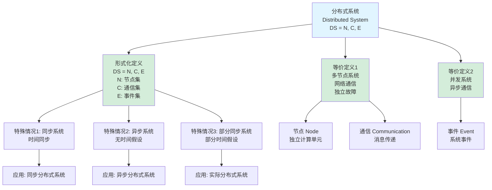

### 1.2 CAP定理定义树

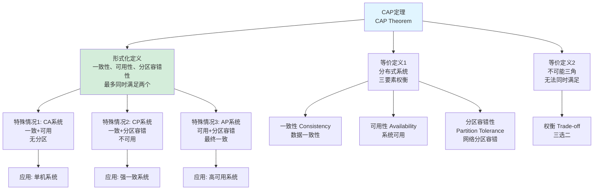

### 1.3 分布式一致性定义树

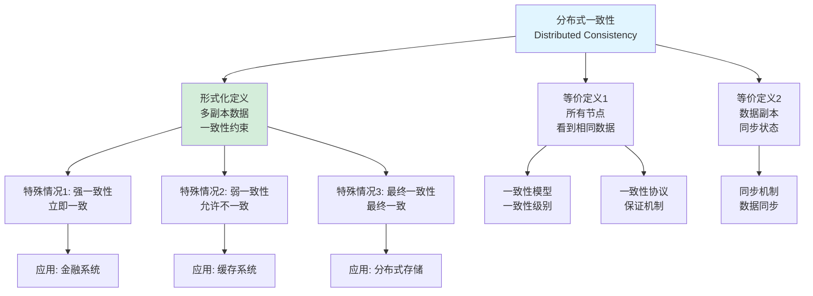

### 1.4 分布式共识定义树

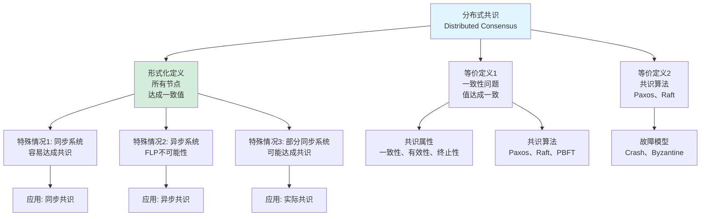

---

## 🌳 **二、定理树 / Theorem Trees**

### 2.1 CAP定理定理树

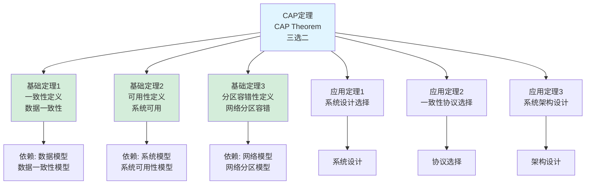

### 2.2 FLP不可能性定理树

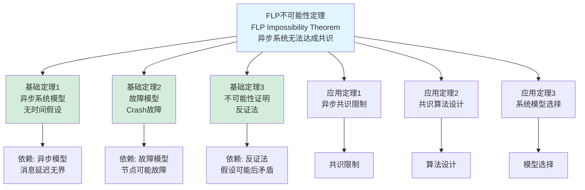

### 2.3 Paxos算法正确性定理树

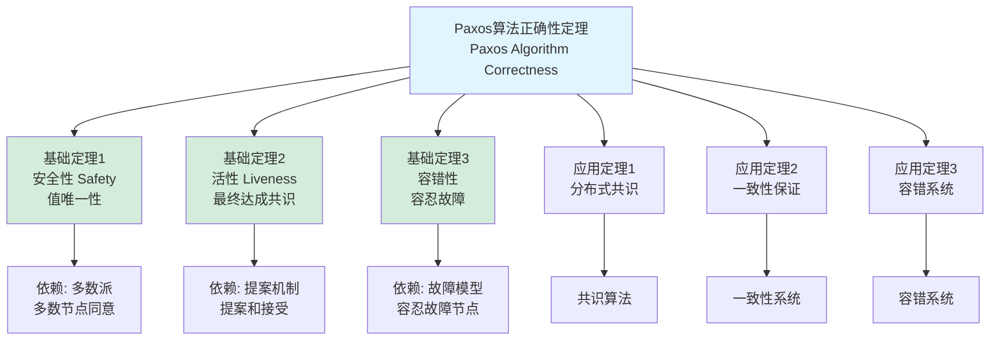

### 2.4 Raft算法正确性定理树

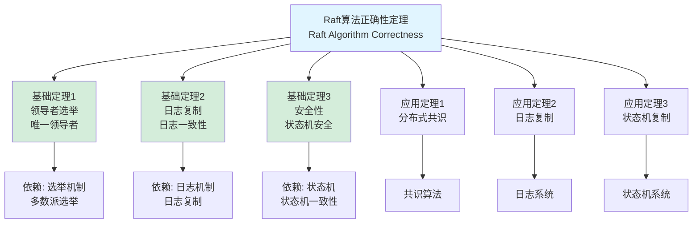

---

## 🌳 **三、推理关系树 / Inference Relation Trees**

### 3.1 CAP权衡推理链

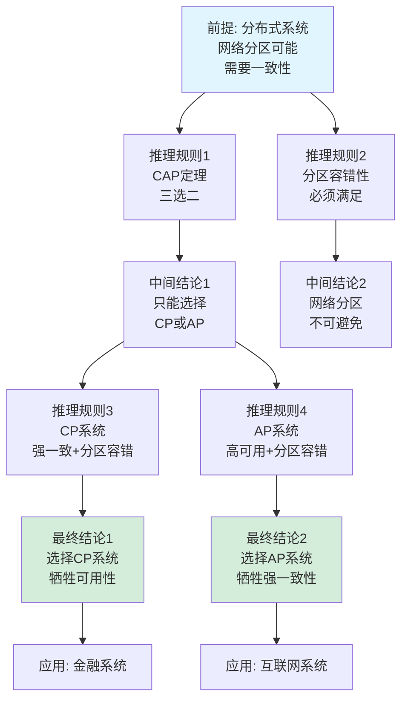

### 3.2 分布式共识算法选择推理链

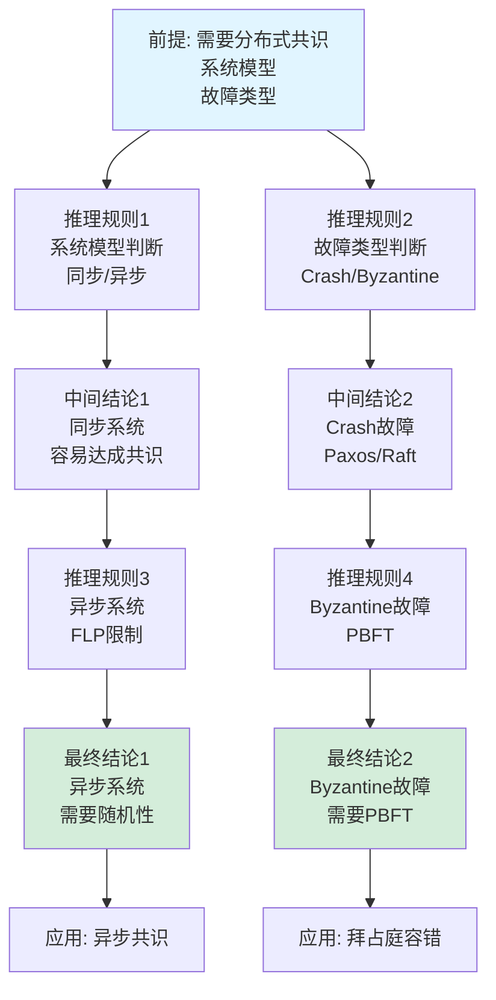

### 3.3 分布式系统设计推理链

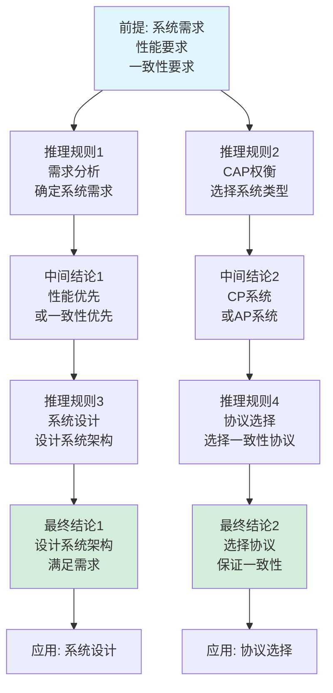

---

## 📊 **四、使用指南 / Usage Guide**

### 4.1 定义树使用指南

- **概念理解**: 通过定义树理解概念的层次结构
- **等价定义**: 理解同一概念的不同定义方式
- **特殊情况**: 识别概念的特殊情况和应用场景
- **知识整合**: 整合相关概念的知识

### 4.2 定理树使用指南

- **依赖关系**: 理解定理之间的依赖关系
- **证明路径**: 理解证明的逻辑路径
- **应用路径**: 理解定理的应用路径
- **知识体系**: 构建完整的知识体系

### 4.3 推理关系树使用指南

- **逻辑推理**: 理解逻辑推理的过程
- **因果关系**: 理解因果关系链
- **证明结构**: 理解证明的结构
- **知识连接**: 连接相关知识点

---

## 📚 **五、总结 / Summary**

本文档提供了分布式系统模块的三种重要思维表征工具：

1. ✅ **定义树**: 展示核心概念的定义层次结构（4个定义树）
2. ✅ **定理树**: 展示重要定理的依赖关系（4个定理树）
3. ✅ **推理关系树**: 展示逻辑推理链（3个推理关系树）

这些工具将帮助学习者：

- 理解概念的定义层次
- 理解定理的依赖关系
- 理解逻辑推理过程
- 构建完整的知识体系

---

**文档版本**: v1.0
**创建时间**: 2025年1月
**最后更新**: 2025年1月
**维护者**: GraphNetWorkCommunicate项目组
**状态**: ✅ **已完成**
