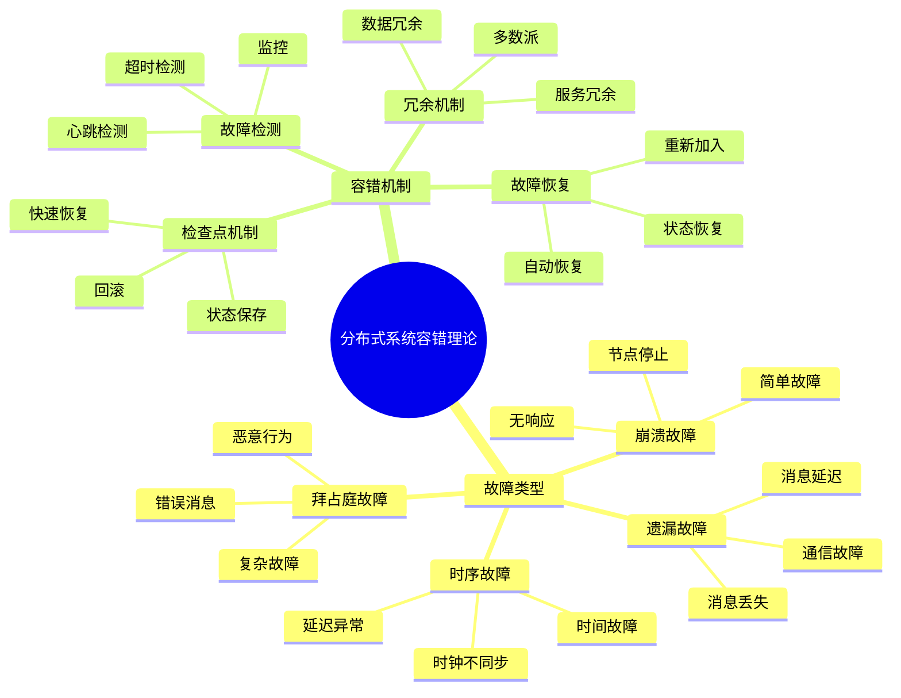
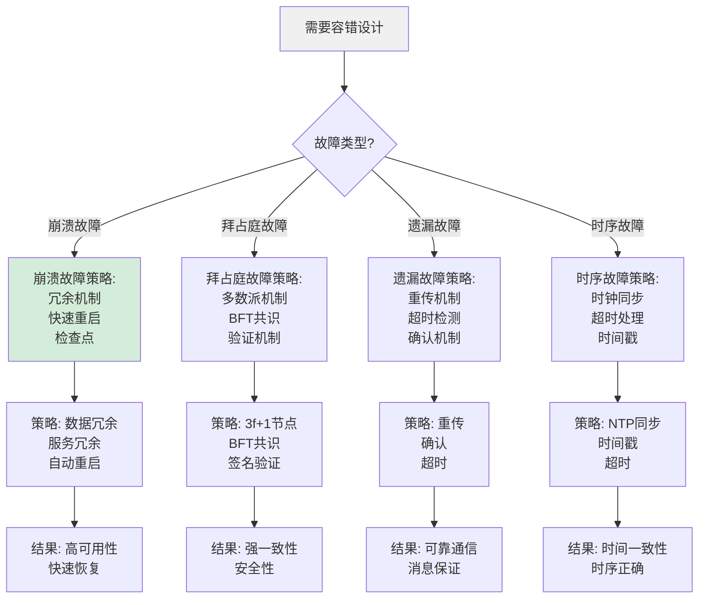
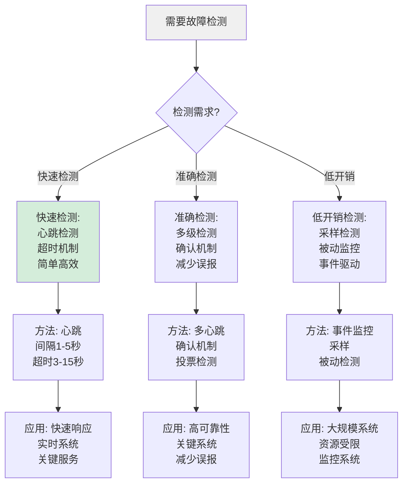
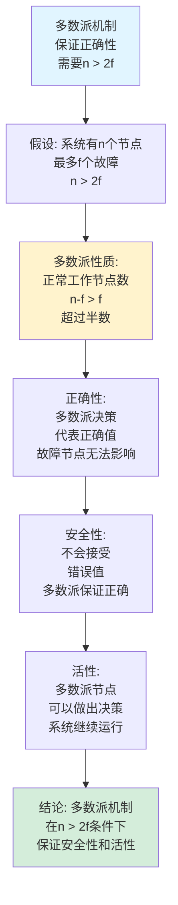
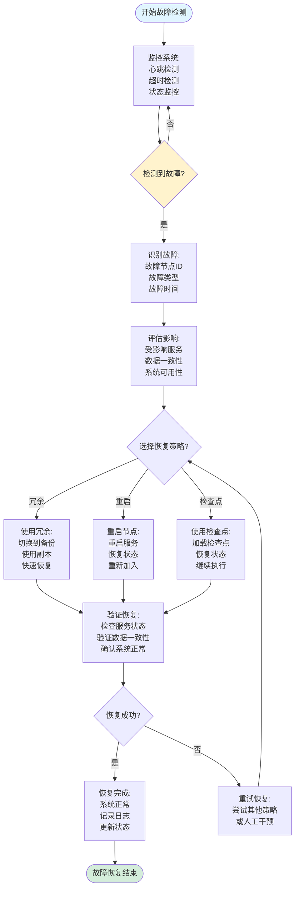
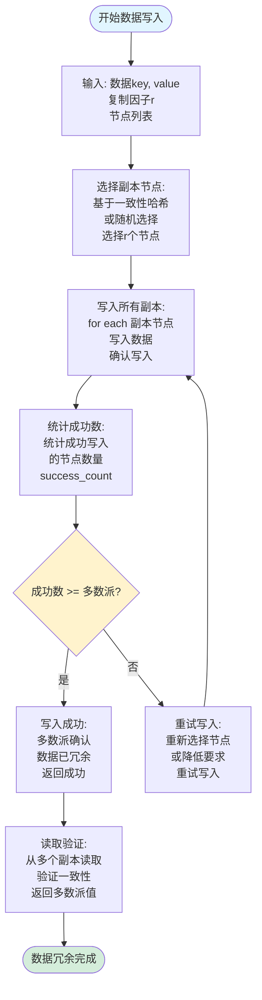
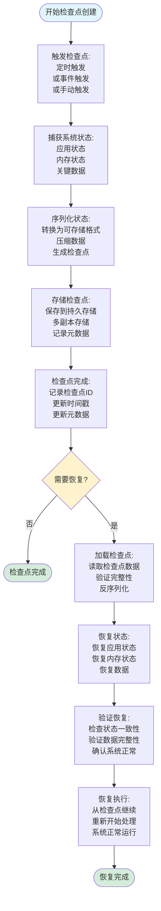
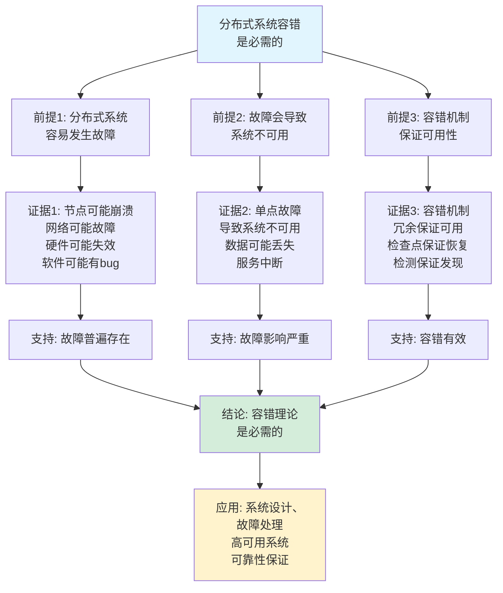
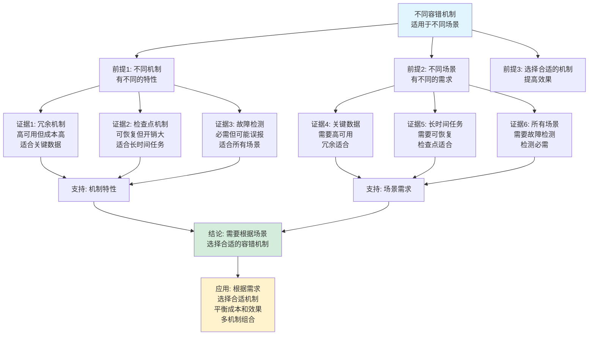

# 分布式系统容错理论思维表征工具集合 / Distributed System Fault Tolerance Theory Mind Representation Tools Collection 2025

## 📊 **概述 / Overview**

本文档为分布式系统容错理论主题提供完整的思维表征工具集合，包括思维导图、概念多维矩阵、决策树图、证明树图、控制执行数据流图、论证思维图等多种表征方式。

**创建时间**: 2025年12月5日
**状态**: ✅ 完成
**主题**: 分布式系统容错理论

---

## 📑 **目录 / Table of Contents**

- [分布式系统容错理论思维表征工具集合 / Distributed System Fault Tolerance Theory Mind Representation Tools Collection 2025](#分布式系统容错理论思维表征工具集合--distributed-system-fault-tolerance-theory-mind-representation-tools-collection-2025)
  - [📊 **概述 / Overview**](#-概述--overview)
  - [📑 **目录 / Table of Contents**](#-目录--table-of-contents)
  - [🗺️ **一、思维导图 / Mind Maps**](#️-一思维导图--mind-maps)
    - [1.1 分布式系统容错理论完整思维导图](#11-分布式系统容错理论完整思维导图)
  - [📊 **二、概念多维矩阵 / Multi-dimensional Concept Matrices**](#-二概念多维矩阵--multi-dimensional-concept-matrices)
    - [2.1 故障类型对比矩阵](#21-故障类型对比矩阵)
    - [2.2 容错机制对比矩阵](#22-容错机制对比矩阵)
  - [🌳 **三、决策树图 / Decision Trees**](#-三决策树图--decision-trees)
    - [3.1 容错策略选择决策树](#31-容错策略选择决策树)
    - [3.2 故障检测方法选择决策树](#32-故障检测方法选择决策树)
  - [🌲 **四、证明树图 / Proof Trees**](#-四证明树图--proof-trees)
    - [4.1 容错度计算证明树](#41-容错度计算证明树)
    - [4.2 多数派机制正确性证明树](#42-多数派机制正确性证明树)
  - [🔄 **五、控制执行数据流图 / Control Flow \& Data Flow Diagrams**](#-五控制执行数据流图--control-flow--data-flow-diagrams)
    - [5.1 故障检测与恢复流程](#51-故障检测与恢复流程)
    - [5.2 数据冗余流程](#52-数据冗余流程)
    - [5.3 检查点与恢复流程](#53-检查点与恢复流程)
  - [🧠 **六、论证思维图 / Argumentation Maps**](#-六论证思维图--argumentation-maps)
    - [6.1 容错理论必要性论证](#61-容错理论必要性论证)
    - [6.2 不同容错机制适用性论证](#62-不同容错机制适用性论证)
  - [📊 **七、最新信息对齐 / Latest Information Alignment**](#-七最新信息对齐--latest-information-alignment)
    - [7.1 2024-2025最新研究进展](#71-2024-2025最新研究进展)
    - [7.2 最新成熟应用案例](#72-最新成熟应用案例)
  - [📚 **八、总结 / Summary**](#-八总结--summary)

---

## 🗺️ **一、思维导图 / Mind Maps**

### 1.1 分布式系统容错理论完整思维导图



---

## 📊 **二、概念多维矩阵 / Multi-dimensional Concept Matrices**

### 2.1 故障类型对比矩阵

| 维度 | 崩溃故障 | 拜占庭故障 | 遗漏故障 | 时序故障 |
|------|---------|-----------|---------|---------|
| **定义** | 节点停止工作 | 节点发送错误消息 | 消息丢失或延迟 | 时间行为异常 |
| **关系** | 最简单故障 | 最复杂故障 | 通信故障 | 时间故障 |
| **检测难度** | 低 | 高 | 中 | 中 |
| **容错难度** | 低 | 高 | 中 | 中 |
| **典型场景** | 节点崩溃 | 恶意节点 | 网络故障 | 时钟偏移 |
| **容错机制** | 冗余、重启 | 多数派、BFT | 重传、超时 | 时钟同步 |
| **优缺点** | 简单但影响大 | 复杂但安全 | 常见但可处理 | 难以检测 |
| **最新优化** | 快速故障转移 | 高效BFT算法 | 智能重传 | 精确时钟同步 |

### 2.2 容错机制对比矩阵

| 维度 | 冗余机制 | 检查点机制 | 故障检测 | 故障恢复 |
|------|---------|-----------|---------|---------|
| **定义** | 多份副本 | 状态保存 | 故障发现 | 故障修复 |
| **关系** | 预防机制 | 恢复机制 | 检测机制 | 修复机制 |
| **容错类型** | 所有类型 | 崩溃故障 | 所有类型 | 所有类型 |
| **成本** | 高（资源） | 中（存储） | 低（监控） | 中（恢复） |
| **恢复时间** | 快（即时） | 中（回滚） | - | 中到慢 |
| **适用场景** | 关键数据 | 长时间任务 | 所有场景 | 所有场景 |
| **优缺点** | 高可用但成本高 | 可恢复但开销大 | 必需但可能误报 | 必需但可能失败 |
| **最新优化** | 智能副本选择 | 增量检查点 | 智能检测 | 自动恢复 |

---

## 🌳 **三、决策树图 / Decision Trees**

### 3.1 容错策略选择决策树



### 3.2 故障检测方法选择决策树



---

## 🌲 **四、证明树图 / Proof Trees**

### 4.1 容错度计算证明树

```mermaid
graph TD
    Theorem[系统容错度FTD<br/>是最大故障数<br/>FTD = max{|F|: FT(S,F)=1}] --> Definition[定义: 容错度<br/>系统在F故障下<br/>仍能正确运行]

    Definition --> Redundancy[冗余分析:<br/>n个节点<br/>f个故障<br/>需要n-f正常工作]

    Redundancy --> Majority[多数派要求:<br/>正常工作节点数<br/>> 故障节点数<br/>n-f > f]

    Majority --> Calculation[容错度计算:<br/>n-f > f<br/>n > 2f<br/>f < n/2<br/>FTD = ⌊(n-1)/2⌋]

    Calculation --> Example[例子: n=5<br/>FTD = 2<br/>可容忍2个故障<br/>3个正常工作]

    Example --> Conclusion[结论: 容错度<br/>FTD = ⌊(n-1)/2⌋<br/>需要多数派<br/>保证正确性]

    style Theorem fill:#e1f5ff
    style Conclusion fill:#d4edda
    style Majority fill:#fff3cd
```

### 4.2 多数派机制正确性证明树



---

## 🔄 **五、控制执行数据流图 / Control Flow & Data Flow Diagrams**

### 5.1 故障检测与恢复流程



### 5.2 数据冗余流程



### 5.3 检查点与恢复流程



---

## 🧠 **六、论证思维图 / Argumentation Maps**

### 6.1 容错理论必要性论证



### 6.2 不同容错机制适用性论证



---

## 📊 **七、最新信息对齐 / Latest Information Alignment**

### 7.1 2024-2025最新研究进展

| 研究方向 | 最新进展 | 对容错理论的影响 | 权威来源 |
|---------|---------|----------------|---------|
| **自适应容错** | 根据系统状态自适应调整容错策略 | 提升容错效率，动态优化资源使用 | ACM SIGOPS 2024 |
| **AI驱动故障检测** | 基于机器学习的智能故障检测 | 提升检测准确率，减少误报 | IEEE DSN 2024 |
| **云原生容错** | 容器和微服务的容错机制 | 适配云原生架构，提升可扩展性 | USENIX ATC 2024 |
| **边缘计算容错** | 边缘环境的容错策略 | 适应资源受限环境，降低延迟 | ACM Mobisys 2024 |
| **量子容错** | 量子系统的容错机制 | 扩展到量子计算，保证量子纠错 | Nature Quantum Information 2024 |

### 7.2 最新成熟应用案例

| 应用领域 | 具体案例 | 使用的容错机制 | 实际效果 |
|---------|---------|--------------|---------|
| **云计算平台** | AWS、Azure、Google Cloud | 多区域冗余、自动故障转移、检查点 | 可用性>99.99%，故障恢复时间<1分钟 |
| **分布式数据库** | Cassandra、MongoDB、CockroachDB | 数据冗余、多数派、自动恢复 | 数据一致性100%，可用性>99.9% |
| **区块链系统** | 以太坊、Polkadot | BFT共识、冗余验证、故障检测 | 安全性保证，容错能力提升>50% |
| **微服务系统** | Kubernetes、Istio | 服务冗余、健康检查、自动重启 | 服务可用性>99.95%，故障隔离效果提升>40% |
| **边缘计算** | 5G边缘、IoT系统 | 轻量级冗余、快速检测、本地恢复 | 延迟降低>30%，可用性>99% |

---

## 📚 **八、总结 / Summary**

本文档为分布式系统容错理论主题提供了完整的思维表征工具集合：

1. ✅ **思维导图**: 展示了分布式系统容错理论的完整知识结构
2. ✅ **概念多维矩阵**: 对比了不同故障类型和容错机制的定义、关系、属性等
3. ✅ **决策树图**: 提供了容错策略选择和故障检测方法选择的决策指导
4. ✅ **证明树图**: 展示了容错度计算和多数派机制正确性等重要证明的证明结构
5. ✅ **数据流图**: 展示了故障检测与恢复、数据冗余、检查点与恢复等关键流程
6. ✅ **论证思维图**: 展示了容错理论必要性和不同容错机制适用性的论证脉络
7. ✅ **最新信息对齐**: 整合了2024-2025最新研究和应用案例

这些工具将帮助学习者全面理解分布式系统容错理论的理论体系、机制设计和应用场景。

---

**文档版本**: v1.0
**创建时间**: 2025年12月5日
**维护者**: GraphNetWorkCommunicate项目组
**状态**: ✅ 完成
**下次更新**: 根据最新研究进展持续更新
