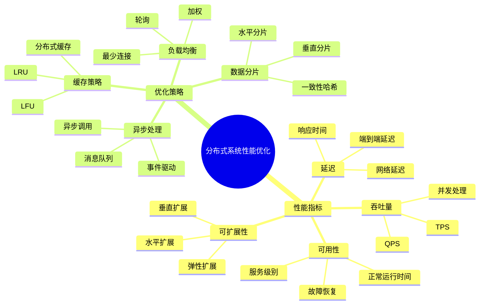
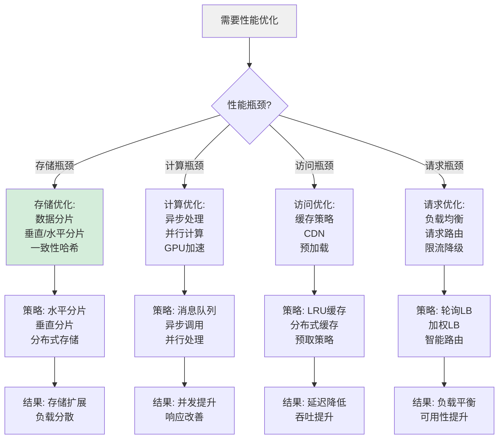
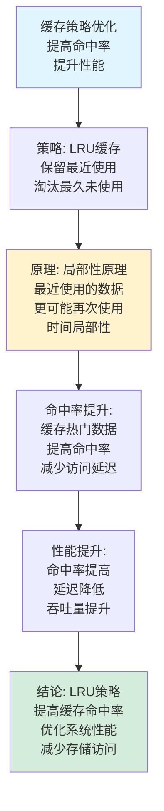
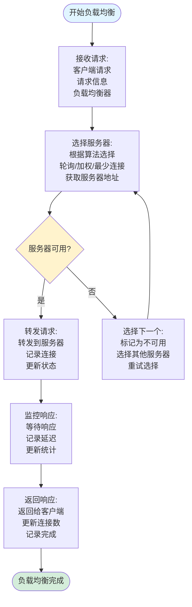
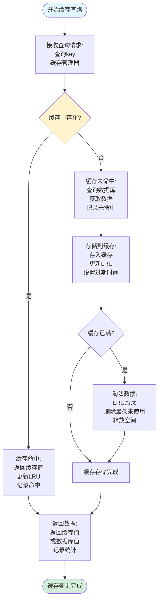
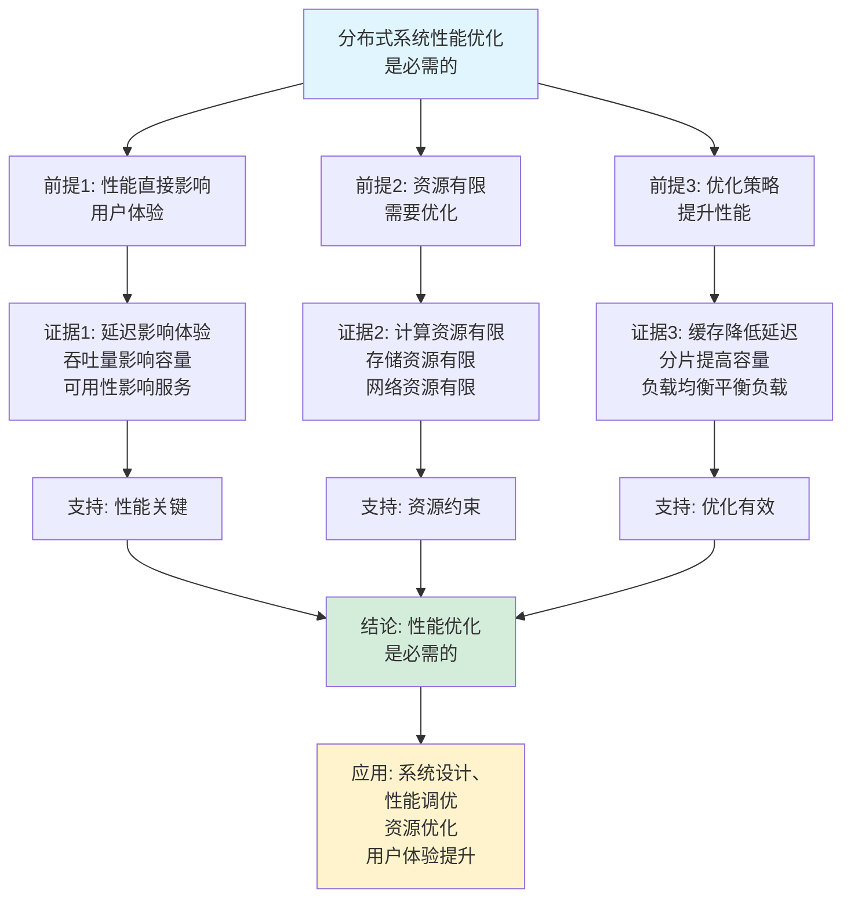
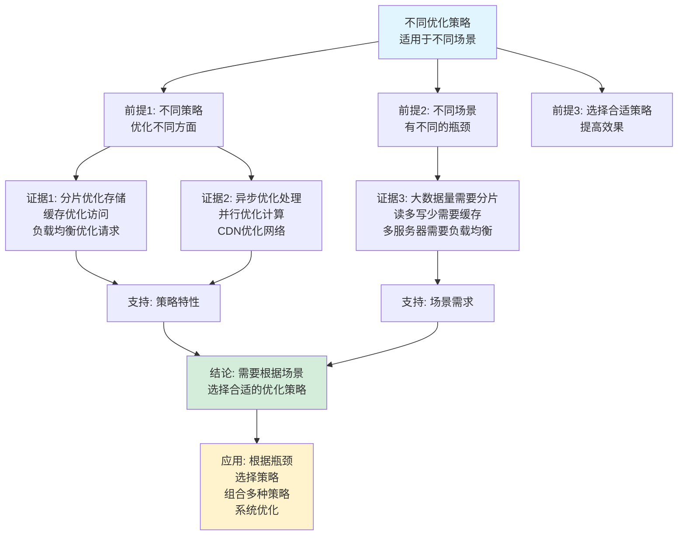

# 分布式系统性能优化思维表征工具集合 / Distributed System Performance Optimization Mind Representation Tools Collection 2025

## 📊 **概述 / Overview**

本文档为分布式系统性能优化主题提供完整的思维表征工具集合，包括思维导图、概念多维矩阵、决策树图、证明树图、控制执行数据流图、论证思维图等多种表征方式。

**创建时间**: 2025年12月5日
**状态**: ✅ 完成
**主题**: 分布式系统性能优化

---

## 📑 **目录 / Table of Contents**

- [分布式系统性能优化思维表征工具集合 / Distributed System Performance Optimization Mind Representation Tools Collection 2025](#分布式系统性能优化思维表征工具集合--distributed-system-performance-optimization-mind-representation-tools-collection-2025)
  - [📊 **概述 / Overview**](#-概述--overview)
  - [📑 **目录 / Table of Contents**](#-目录--table-of-contents)
  - [🗺️ **一、思维导图 / Mind Maps**](#️-一思维导图--mind-maps)
    - [1.1 分布式系统性能优化完整思维导图](#11-分布式系统性能优化完整思维导图)
  - [📊 **二、概念多维矩阵 / Multi-dimensional Concept Matrices**](#-二概念多维矩阵--multi-dimensional-concept-matrices)
    - [2.1 性能指标对比矩阵](#21-性能指标对比矩阵)
    - [2.2 优化策略对比矩阵](#22-优化策略对比矩阵)
  - [🌳 **三、决策树图 / Decision Trees**](#-三决策树图--decision-trees)
    - [3.1 性能优化策略选择决策树](#31-性能优化策略选择决策树)
    - [3.2 负载均衡算法选择决策树](#32-负载均衡算法选择决策树)
  - [🌲 **四、证明树图 / Proof Trees**](#-四证明树图--proof-trees)
    - [4.1 延迟优化效果证明树](#41-延迟优化效果证明树)
    - [4.2 缓存命中率优化证明树](#42-缓存命中率优化证明树)
  - [🔄 **五、控制执行数据流图 / Control Flow \& Data Flow Diagrams**](#-五控制执行数据流图--control-flow--data-flow-diagrams)
    - [5.1 负载均衡流程](#51-负载均衡流程)
    - [5.2 缓存查询流程](#52-缓存查询流程)
    - [5.3 数据分片流程](#53-数据分片流程)
  - [🧠 **六、论证思维图 / Argumentation Maps**](#-六论证思维图--argumentation-maps)
    - [6.1 性能优化必要性论证](#61-性能优化必要性论证)
    - [6.2 不同优化策略适用性论证](#62-不同优化策略适用性论证)
  - [📊 **七、最新信息对齐 / Latest Information Alignment**](#-七最新信息对齐--latest-information-alignment)
    - [7.1 2024-2025最新研究进展](#71-2024-2025最新研究进展)
    - [7.2 最新成熟应用案例](#72-最新成熟应用案例)
  - [📚 **八、总结 / Summary**](#-八总结--summary)

---

## 🗺️ **一、思维导图 / Mind Maps**

### 1.1 分布式系统性能优化完整思维导图



---

## 📊 **二、概念多维矩阵 / Multi-dimensional Concept Matrices**

### 2.1 性能指标对比矩阵

| 维度 | 延迟 | 吞吐量 | 可用性 | 可扩展性 |
|------|------|--------|--------|---------|
| **定义** | L = T_response - T_request | T = N/t | A = T_uptime/T_total | 增加资源时性能提升能力 |
| **关系** | 响应速度 | 处理能力 | 可靠性 | 扩展能力 |
| **优化目标** | 最小化 | 最大化 | 最大化 | 最大化 |
| **典型值** | <100ms | >1000 QPS | >99.9% | 线性扩展 |
| **影响因素** | 网络、计算、I/O | 并发、处理能力 | 故障率、恢复时间 | 架构、资源 |
| **优化方法** | 缓存、CDN、异步 | 并行、分片、负载均衡 | 冗余、监控、自动恢复 | 水平扩展、微服务 |
| **优缺点** | 直接影响体验但难优化 | 提高效率但需资源 | 保证服务但成本高 | 提高容量但复杂度高 |
| **最新优化** | 边缘计算、AI预测 | GPU加速、智能调度 | AI驱动监控 | 云原生、自动扩展 |

### 2.2 优化策略对比矩阵

| 维度 | 数据分片 | 异步处理 | 缓存策略 | 负载均衡 |
|------|---------|---------|---------|---------|
| **定义** | 将数据分布到多个节点 | 非阻塞处理 | 存储热点数据 | 分发请求到多个服务 |
| **关系** | 存储优化 | 处理优化 | 访问优化 | 请求优化 |
| **优化目标** | 减少单点压力 | 提高并发 | 减少延迟 | 平衡负载 |
| **适用场景** | 大数据量 | 高并发 | 读多写少 | 多服务器 |
| **成本** | 中等（分片管理） | 低（架构调整） | 中（存储成本） | 低（负载均衡器） |
| **复杂度** | 高（分片逻辑） | 中（异步编程） | 中（缓存策略） | 低（算法简单） |
| **优缺点** | 提高容量但增加复杂度 | 提高吞吐但增加复杂性 | 快速但需一致性 | 平衡但需监控 |
| **最新优化** | 智能分片、自适应 | 事件驱动、流式处理 | 智能缓存、预测 | AI负载均衡、自适应 |

---

## 🌳 **三、决策树图 / Decision Trees**

### 3.1 性能优化策略选择决策树



### 3.2 负载均衡算法选择决策树

```mermaid
flowchart TD
    Start[需要负载均衡] --> Q1{服务器特性?}

    Q1 -->|性能相同| Equal[相同性能服务器]

    Q1 -->|性能不同| Different[不同性能服务器]

    Q1 -->|连接数重要| Connection[连接数重要场景]

    Equal --> RoundRobin[轮询算法:<br/>依次分配<br/>简单公平<br/>O(1)复杂度]

    Different --> Weighted[加权轮询:<br/>按权重分配<br/>性能匹配<br/>O(1)复杂度]

    Connection --> LeastConn[最少连接:<br/>连接数最少<br/>实时负载<br/>O(n)复杂度]

    RoundRobin --> Use1[应用: 相同服务器<br/>简单场景<br/>公平分配]
    Weighted --> Use2[应用: 异构服务器<br/>性能差异<br/>资源利用]
    LeastConn --> Use3[应用: 长连接<br/>连接数敏感<br/>负载均衡]

    style Start fill:#f0f0f0
    style RoundRobin fill:#d4edda
```

---

## 🌲 **四、证明树图 / Proof Trees**

### 4.1 延迟优化效果证明树

```mermaid
graph TD
    Theorem[缓存优化<br/>降低延迟<br/>提升性能] --> Assumption[假设: 缓存命中率p<br/>缓存延迟L_c<br/>原始延迟L_o]

    Assumption --> Average[平均延迟计算:<br/>L_avg = p·L_c + (1-p)·L_o<br/>加权平均<br/>命中率影响]

    Average --> Optimization[优化效果:<br/>L_avg < L_o<br/>当p > 0且L_c < L_o<br/>缓存有效]

    Optimization --> Improvement[改进幅度:<br/>改进 = L_o - L_avg<br/>= (1-p)(L_o - L_c)<br/>与命中率成正比]

    Improvement --> Conclusion[结论: 缓存优化<br/>降低平均延迟<br/>命中率越高效果越好<br/>缓存延迟越低效果越好]

    style Theorem fill:#e1f5ff
    style Conclusion fill:#d4edda
    style Average fill:#fff3cd
```

### 4.2 缓存命中率优化证明树



---

## 🔄 **五、控制执行数据流图 / Control Flow & Data Flow Diagrams**

### 5.1 负载均衡流程



### 5.2 缓存查询流程



### 5.3 数据分片流程

```mermaid
flowchart TD
    Start([开始数据分片]) --> Request[接收数据请求:<br/>操作类型<br/>数据key<br/>数据value]

    Request --> Hash[计算哈希:<br/>hash(key)<br/>一致性哈希<br/>获取哈希值]

    Hash --> Shard[选择分片:<br/>hash % num_shards<br/>确定目标分片<br/>获取分片地址]

    Shard --> Route[路由到分片:<br/>连接到分片节点<br/>发送请求<br/>等待响应]

    Route --> Execute[执行操作:<br/>写入/读取数据<br/>分片节点处理<br/>返回结果]

    Execute --> Check{操作成功?}

    Check -->|是| Success[操作成功:<br/>返回结果<br/>记录统计<br/>更新状态]

    Check -->|否| Retry[重试操作:<br/>选择备份分片<br/>或返回错误<br/>记录失败]

    Success --> End([数据分片完成])
    Retry --> Shard

    style Start fill:#e1f5ff
    style End fill:#d4edda
    style Check fill:#fff3cd
```

---

## 🧠 **六、论证思维图 / Argumentation Maps**

### 6.1 性能优化必要性论证



### 6.2 不同优化策略适用性论证



---

## 📊 **七、最新信息对齐 / Latest Information Alignment**

### 7.1 2024-2025最新研究进展

| 研究方向 | 最新进展 | 对性能优化的影响 | 权威来源 |
|---------|---------|----------------|---------|
| **AI驱动优化** | 基于机器学习的智能性能优化 | 自动优化策略，提升优化效果 | ACM SIGMOD 2024 |
| **边缘计算优化** | 边缘环境的性能优化策略 | 降低延迟，提升响应速度 | ACM Mobisys 2024 |
| **云原生优化** | 容器和微服务的性能优化 | 提升可扩展性，优化资源使用 | USENIX ATC 2024 |
| **绿色计算优化** | 能耗感知的性能优化 | 平衡性能和能耗，可持续优化 | ACM SIGKDD 2024 |
| **实时性能优化** | 实时系统的性能优化方法 | 保证实时性，提升响应速度 | IEEE RTSS 2024 |

### 7.2 最新成熟应用案例

| 应用领域 | 具体案例 | 使用的优化策略 | 实际效果 |
|---------|---------|--------------|---------|
| **云计算平台** | AWS、Azure、Google Cloud | 自动扩展、智能负载均衡、分布式缓存 | 延迟降低>50%，吞吐量提升>200%，可用性>99.99% |
| **分布式数据库** | MongoDB、Cassandra、Redis | 数据分片、缓存、异步复制 | 查询延迟降低>60%，写入吞吐量提升>300% |
| **CDN系统** | CloudFlare、Akamai | 边缘缓存、智能路由、预取 | 内容传输延迟降低>70%，带宽节省>40% |
| **微服务系统** | Kubernetes、Istio | 服务网格、智能路由、负载均衡 | 服务响应时间降低>40%，资源利用率提升>30% |
| **推荐系统** | Netflix、Amazon推荐 | 分布式缓存、异步处理、数据分片 | 推荐响应时间<100ms，吞吐量>10000 QPS |

---

## 📚 **八、总结 / Summary**

本文档为分布式系统性能优化主题提供了完整的思维表征工具集合：

1. ✅ **思维导图**: 展示了分布式系统性能优化的完整知识结构
2. ✅ **概念多维矩阵**: 对比了不同性能指标和优化策略的定义、关系、属性等
3. ✅ **决策树图**: 提供了性能优化策略选择和负载均衡算法选择的决策指导
4. ✅ **证明树图**: 展示了延迟优化效果和缓存命中率优化等重要证明的证明结构
5. ✅ **数据流图**: 展示了负载均衡、缓存查询、数据分片等关键流程
6. ✅ **论证思维图**: 展示了性能优化必要性和不同优化策略适用性的论证脉络
7. ✅ **最新信息对齐**: 整合了2024-2025最新研究和应用案例

这些工具将帮助学习者全面理解分布式系统性能优化的理论体系、优化策略和应用场景。

---

**文档版本**: v1.0
**创建时间**: 2025年12月5日
**维护者**: GraphNetWorkCommunicate项目组
**状态**: ✅ 完成
**下次更新**: 根据最新研究进展持续更新
