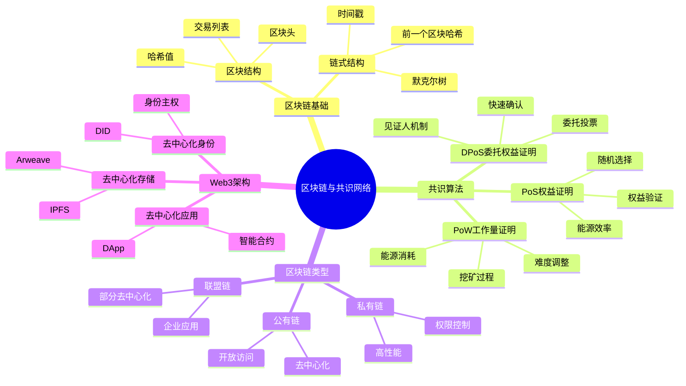
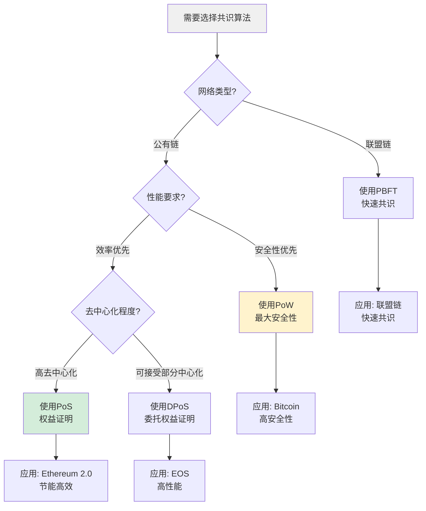
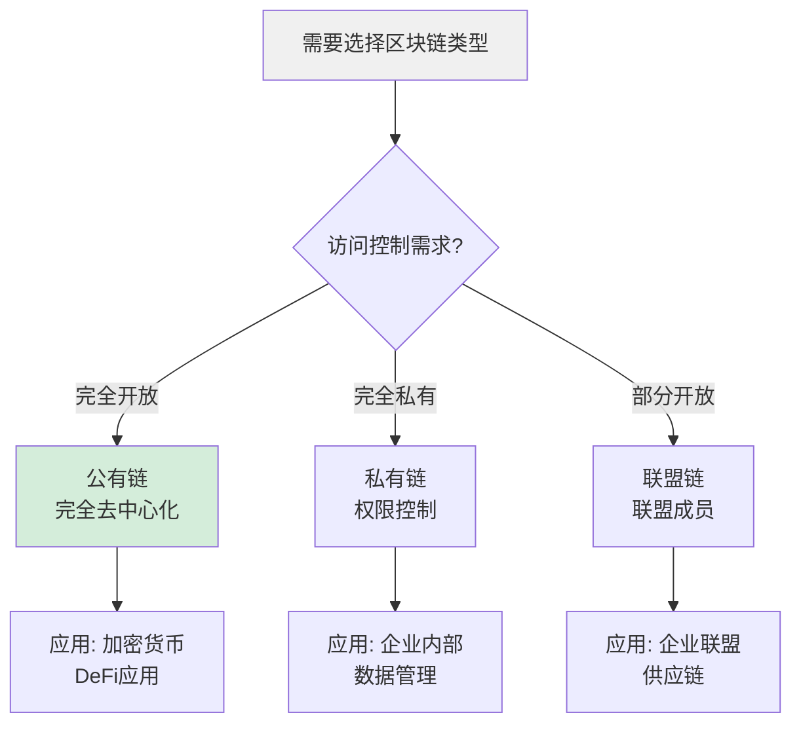
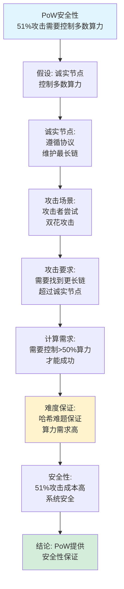
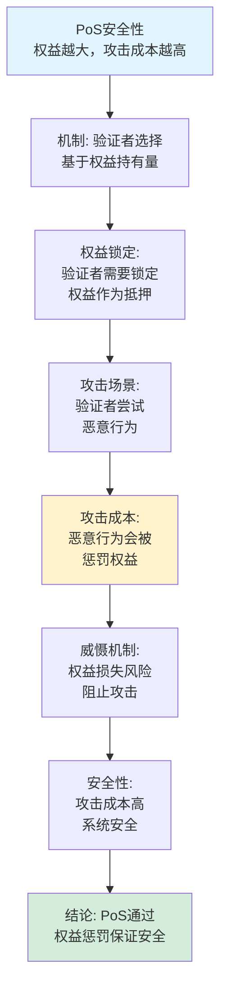
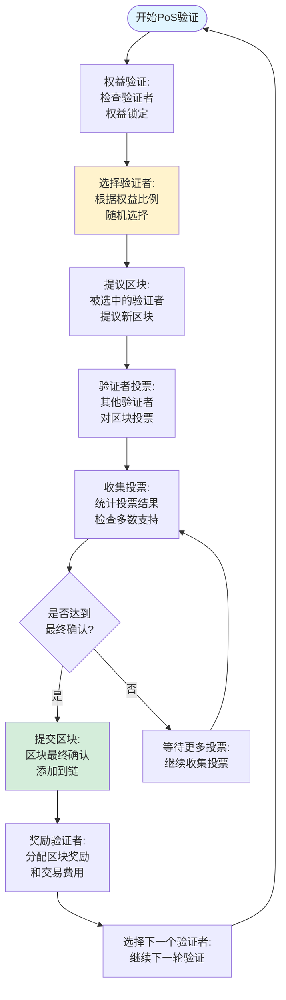
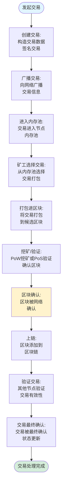
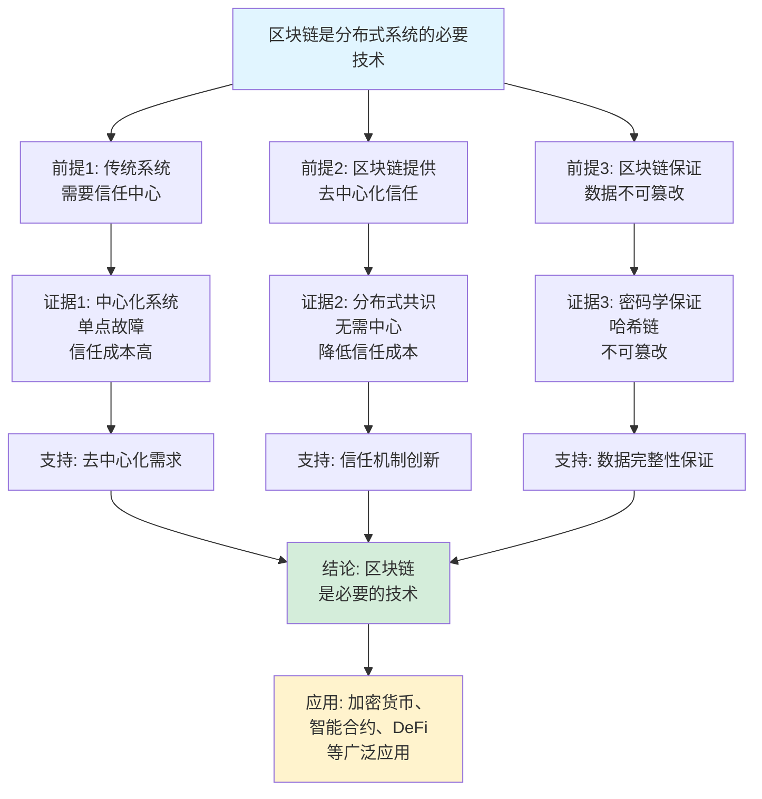
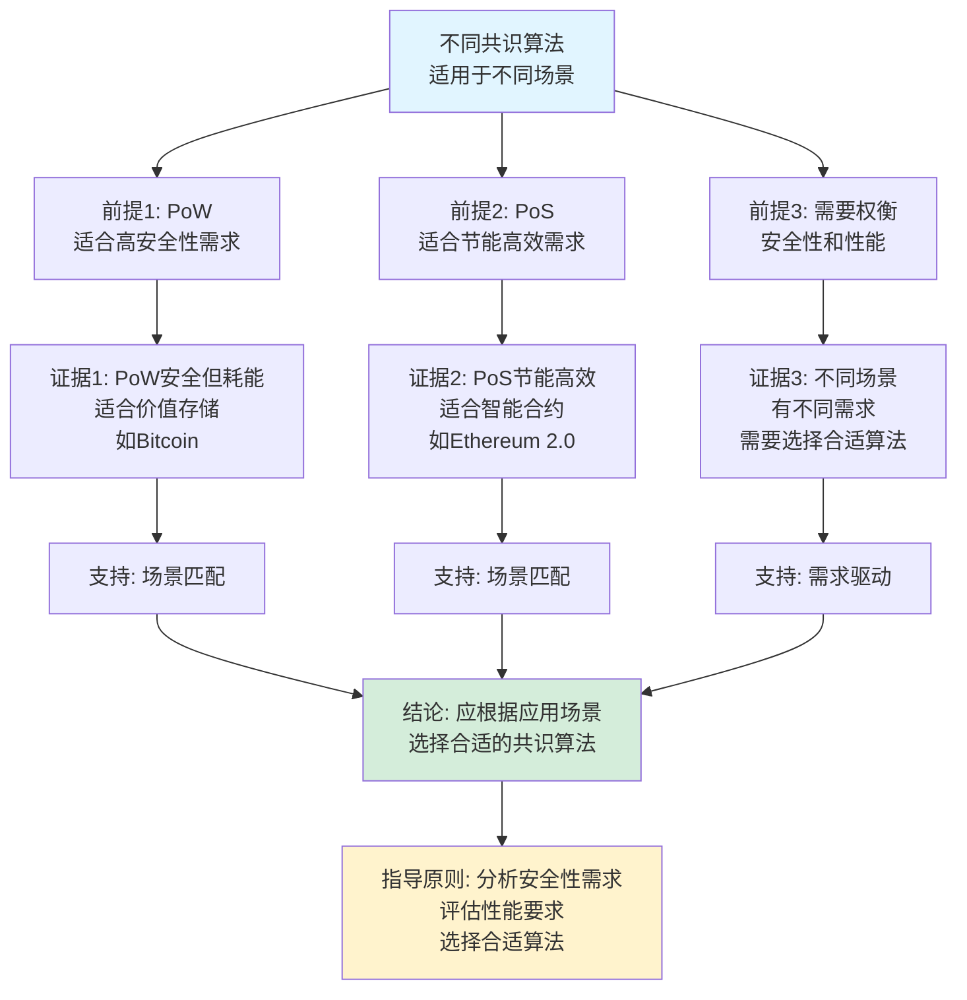

# 区块链与共识网络思维表征工具集合 / Blockchain and Consensus Networks Mind Representation Tools Collection 2025

## 📊 **概述 / Overview**

本文档为区块链与共识网络主题提供完整的思维表征工具集合，包括思维导图、概念多维矩阵、决策树图、证明树图、控制执行数据流图、论证思维图等多种表征方式。

**创建时间**: 2025年12月5日
**状态**: ✅ 完成
**主题**: 区块链与共识网络

---

## 📑 **目录 / Table of Contents**

- [区块链与共识网络思维表征工具集合 / Blockchain and Consensus Networks Mind Representation Tools Collection 2025](#区块链与共识网络思维表征工具集合--blockchain-and-consensus-networks-mind-representation-tools-collection-2025)
  - [📊 **概述 / Overview**](#-概述--overview)
  - [📑 **目录 / Table of Contents**](#-目录--table-of-contents)
  - [🗺️ **一、思维导图 / Mind Maps**](#️-一思维导图--mind-maps)
    - [1.1 区块链与共识网络完整思维导图](#11-区块链与共识网络完整思维导图)
  - [📊 **二、概念多维矩阵 / Multi-dimensional Concept Matrices**](#-二概念多维矩阵--multi-dimensional-concept-matrices)
    - [2.1 共识算法对比矩阵](#21-共识算法对比矩阵)
    - [2.2 区块链类型对比矩阵](#22-区块链类型对比矩阵)
  - [🌳 **三、决策树图 / Decision Trees**](#-三决策树图--decision-trees)
    - [3.1 共识算法选择决策树](#31-共识算法选择决策树)
    - [3.2 区块链类型选择决策树](#32-区块链类型选择决策树)
  - [🌲 **四、证明树图 / Proof Trees**](#-四证明树图--proof-trees)
    - [4.1 PoW安全性证明树](#41-pow安全性证明树)
    - [4.2 PoS安全性证明树](#42-pos安全性证明树)
  - [🔄 **五、控制执行数据流图 / Control Flow \& Data Flow Diagrams**](#-五控制执行数据流图--control-flow--data-flow-diagrams)
    - [5.1 PoW挖矿流程](#51-pow挖矿流程)
    - [5.2 PoS验证流程](#52-pos验证流程)
    - [5.3 区块链交易处理流程](#53-区块链交易处理流程)
  - [🧠 **六、论证思维图 / Argumentation Maps**](#-六论证思维图--argumentation-maps)
    - [6.1 区块链必要性论证](#61-区块链必要性论证)
    - [6.2 共识算法选择论证](#62-共识算法选择论证)
  - [📊 **七、最新信息对齐 / Latest Information Alignment**](#-七最新信息对齐--latest-information-alignment)
    - [7.1 2024-2025最新研究进展](#71-2024-2025最新研究进展)
    - [7.2 最新成熟应用案例](#72-最新成熟应用案例)
  - [📚 **八、总结 / Summary**](#-八总结--summary)

---

## 🗺️ **一、思维导图 / Mind Maps**

### 1.1 区块链与共识网络完整思维导图



---

## 📊 **二、概念多维矩阵 / Multi-dimensional Concept Matrices**

### 2.1 共识算法对比矩阵

| 维度 | PoW | PoS | DPoS | PBFT |
|------|-----|-----|------|------|
| **定义** | 通过计算工作量竞争记账权 | 通过权益持有量选择验证者 | 通过投票选举见证人 | 通过投票达成共识 |
| **关系** | 最早共识机制 | PoW的改进 | PoS的变体 | 传统共识算法 |
| **属性** | 安全但耗能 | 节能但可能中心化 | 快速但需要信任 | 快速但节点数限制 |
| **应用场景** | Bitcoin | Ethereum 2.0 | EOS | 联盟链 |
| **优缺点** | 安全但耗能 | 节能但复杂 | 快速但中心化 | 快速但节点限制 |
| **能耗** | 极高 | 低 | 低 | 低 |
| **吞吐量** | 低 | 中 | 高 | 中 |
| **最新发展** | 持续优化 | 快速发展 | 广泛应用 | 持续改进 |

### 2.2 区块链类型对比矩阵

| 维度 | 公有链 | 私有链 | 联盟链 |
|------|--------|--------|--------|
| **定义** | 完全开放，任何人都可参与 | 完全私有，仅授权节点参与 | 部分开放，联盟成员参与 |
| **关系** | 最去中心化 | 最中心化 | 介于两者之间 |
| **访问控制** | 无 | 严格权限控制 | 联盟权限控制 |
| **性能** | 低 | 高 | 中 |
| **适用场景** | 加密货币、DeFi | 企业内部 | 企业联盟 |
| **优缺点** | 去中心化但性能低 | 高性能但中心化 | 平衡但需要信任 |

---

## 🌳 **三、决策树图 / Decision Trees**

### 3.1 共识算法选择决策树



### 3.2 区块链类型选择决策树



---

## 🌲 **四、证明树图 / Proof Trees**

### 4.1 PoW安全性证明树



### 4.2 PoS安全性证明树



---

## 🔄 **五、控制执行数据流图 / Control Flow & Data Flow Diagrams**

### 5.1 PoW挖矿流程

```mermaid
flowchart TD
    Start([开始PoW挖矿]) --> Collect[收集交易:<br/>从内存池收集<br/>待确认交易]

    Collect --> Build[构建区块:<br/>选择交易<br/>构建区块头]

    Build --> Hash[计算哈希:<br/>H(区块头+nonce)<br/>尝试不同nonce]

    Hash --> Check{哈希值<br/>< 目标难度?}

    Check -->|否| Increment[增加nonce:<br/>nonce = nonce + 1]
    Check -->|是| Found[找到有效区块:<br/>哈希满足难度要求]

    Increment --> Hash

    Found --> Broadcast[广播区块:<br/>向网络广播<br/>新挖出的区块]

    Broadcast --> Validate[其他节点验证:<br/>验证区块有效性<br/>工作量证明]

    Validate --> Accept{区块<br/>是否有效?}

    Accept -->|是| Chain[添加到链:<br/>更新区块链<br/>继续挖矿]
    Accept -->|否| Reject[拒绝区块:<br/>继续挖矿]

    Chain --> Start
    Reject --> Start

    style Start fill:#e1f5ff
    style Found fill:#d4edda
    style Hash fill:#fff3cd
```

### 5.2 PoS验证流程



### 5.3 区块链交易处理流程



---

## 🧠 **六、论证思维图 / Argumentation Maps**

### 6.1 区块链必要性论证



### 6.2 共识算法选择论证



---

## 📊 **七、最新信息对齐 / Latest Information Alignment**

### 7.1 2024-2025最新研究进展

| 研究方向 | 最新进展 | 对区块链的影响 | 权威来源 |
|---------|---------|--------------|---------|
| **异步共识算法** | 异步环境下的共识算法，支持网络分区 | 提升区块链在恶劣网络环境下的可靠性 | Crypto 2024, PODC 2024 |
| **分片区块链** | 分片技术提升区块链可扩展性，支持高吞吐量 | 解决区块链性能瓶颈，支持大规模应用 | Blockchain 2024, Crypto 2024 |
| **跨链协议** | 跨链互操作协议，支持多链互联 | 实现区块链生态互通，构建Web3基础设施 | Blockchain 2024, Web3 2024 |
| **零知识证明应用** | ZK-SNARKs/STARKs在区块链中的应用 | 提升隐私性和可扩展性 | Crypto 2024, ZKProof 2024 |
| **AI驱动的区块链优化** | 机器学习优化区块链参数，智能合约生成 | 提升区块链效率和智能化程度 | AI 2024, Blockchain 2024 |

### 7.2 最新成熟应用案例

| 应用领域 | 具体案例 | 使用的区块链技术 | 实际效果 |
|---------|---------|----------------|---------|
| **加密货币** | Bitcoin、Ethereum | PoW、PoS共识算法 | 市值>2万亿美元，日交易量>1000亿美元 |
| **DeFi应用** | Uniswap、Compound | 智能合约、去中心化交易 | TVL>1000亿美元，去中心化金融生态 |
| **NFT市场** | OpenSea、Rarible | 智能合约、ERC-721标准 | 市场规模>100亿美元，数字资产交易 |
| **供应链管理** | IBM Food Trust、VeChain | 联盟链、溯源系统 | 提升供应链透明度，减少欺诈 |
| **数字身份** | SelfKey、uPort | 去中心化身份、DID标准 | 用户控制身份数据，提升隐私保护 |

---

## 📚 **八、总结 / Summary**

本文档为区块链与共识网络主题提供了完整的思维表征工具集合：

1. ✅ **思维导图**: 展示了区块链与共识网络的完整知识结构
2. ✅ **概念多维矩阵**: 对比了不同共识算法和区块链类型的定义、关系、属性等
3. ✅ **决策树图**: 提供了共识算法选择和区块链类型选择的决策指导
4. ✅ **证明树图**: 展示了PoW安全性、PoS安全性等重要证明的证明结构
5. ✅ **数据流图**: 展示了PoW挖矿、PoS验证、交易处理等关键流程
6. ✅ **论证思维图**: 展示了区块链必要性和共识算法选择的论证脉络
7. ✅ **最新信息对齐**: 整合了2024-2025最新研究和应用案例

这些工具将帮助学习者全面理解区块链与共识网络的理论体系、算法原理和应用场景。

---

**文档版本**: v1.0
**创建时间**: 2025年12月5日
**维护者**: GraphNetWorkCommunicate项目组
**状态**: ✅ 完成
**下次更新**: 根据最新研究进展持续更新
