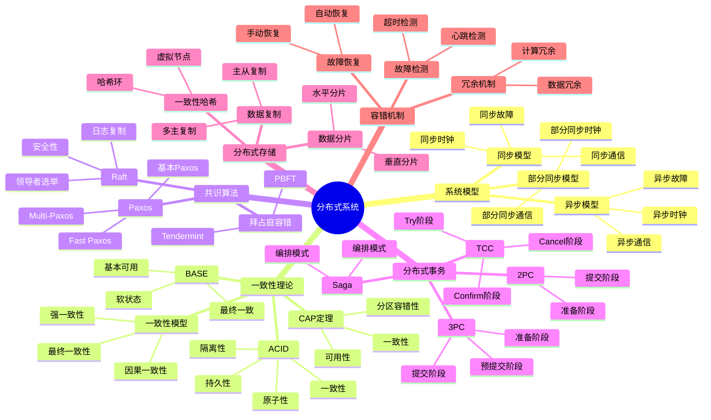
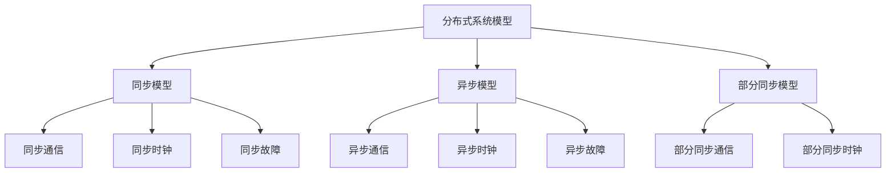
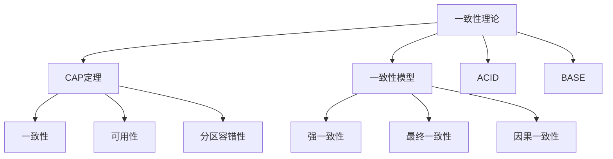
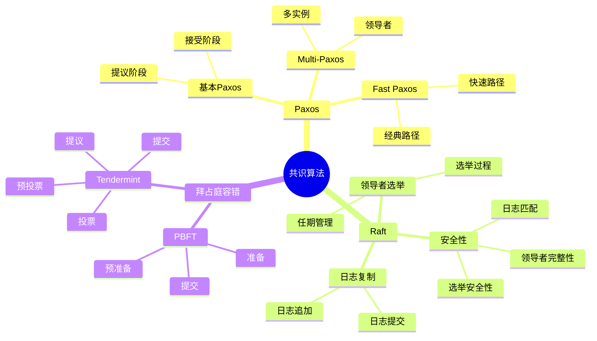
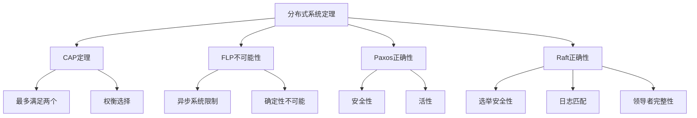
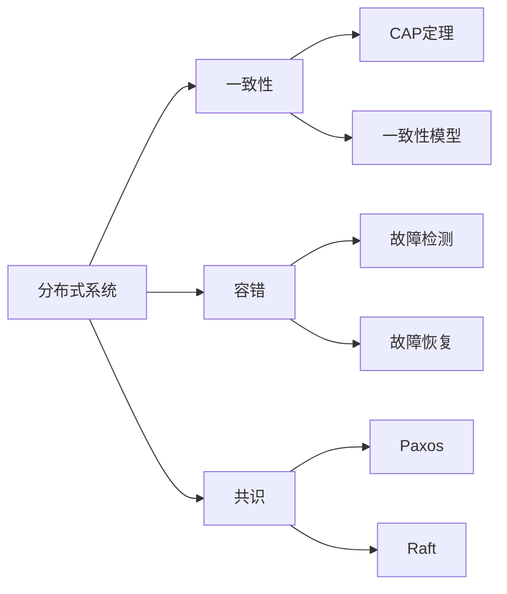
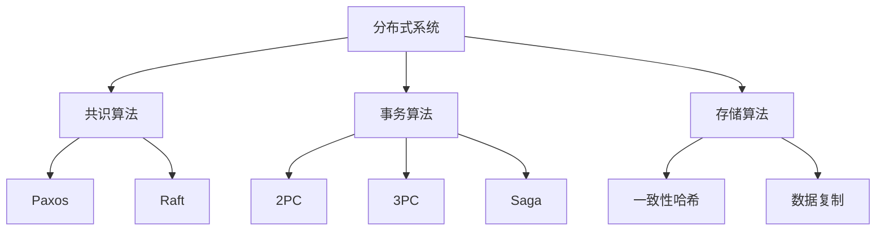
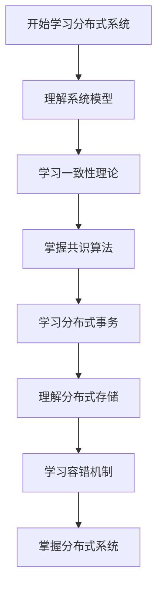
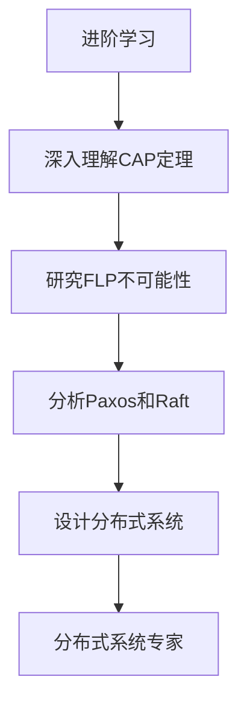

# 分布式系统模块知识结构思维导图 / Distributed Systems Module Knowledge Structure Mind Map

## 📚 **概述 / Overview**

本文档提供分布式系统模块的完整知识结构思维导图，帮助理解分布式系统知识的层次结构和相互关系。

**创建时间**: 2025年1月
**模块**: 分布式系统
**状态**: 🚀 持续更新中

---

## 🗺️ **一、整体知识结构 / Overall Knowledge Structure**

---

## 📊 **二、核心概念层次结构 / Core Concept Hierarchy**

### 2.1 系统模型层次

### 2.2 一致性理论层次

---

## 🔬 **三、算法分类结构 / Algorithm Classification Structure**

### 3.1 共识算法分类

### 3.2 分布式事务算法分类

| 算法类型 | 算法 | 特点 | 适用场景 |
|---------|------|------|---------|
| **两阶段提交** | 2PC | 强一致性、阻塞 | 强一致性需求 |
| **三阶段提交** | 3PC | 非阻塞、复杂 | 高可用性需求 |
| **补偿事务** | Saga | 最终一致性、长事务 | 微服务架构 |
| **确认取消** | TCC | 最终一致性、灵活 | 分布式事务 |

---

## 📐 **四、重要定理结构 / Important Theorems Structure**

### 4.1 定理分类

### 4.2 定理应用领域

| 定理 | 应用领域 | 具体应用 |
|------|---------|---------|
| **CAP定理** | 系统设计 | 一致性-可用性权衡 |
| **FLP不可能性** | 共识算法 | 异步系统限制 |
| **Paxos正确性** | 分布式共识 | 一致性保证 |
| **Raft正确性** | 分布式共识 | 易于理解的共识 |

---

## 🔗 **五、知识关联网络 / Knowledge Association Network**

### 5.1 概念关联图

### 5.2 算法关联图

---

## 📚 **六、学习路径 / Learning Path**

### 6.1 基础学习路径

### 6.2 进阶学习路径

---

## 🎯 **七、应用领域映射 / Application Domain Mapping**

### 7.1 应用领域

| 分布式系统概念 | 应用领域 | 具体应用 |
|--------------|---------|---------|
| **共识算法** | 分布式数据库 | 主从复制、多主复制 |
| **分布式事务** | 微服务架构 | 服务间事务协调 |
| **分布式存储** | 云存储 | 数据分片、数据复制 |
| **容错机制** | 高可用系统 | 故障检测、故障恢复 |

---

## 📋 **八、知识检查清单 / Knowledge Checklist**

### 8.1 基础概念

- [ ] 理解分布式系统模型（同步、异步、部分同步）
- [ ] 掌握CAP定理和一致性模型
- [ ] 理解ACID和BASE理论
- [ ] 掌握故障模型和容错机制

### 8.2 共识算法

- [ ] 理解Paxos算法原理
- [ ] 掌握Raft算法实现
- [ ] 了解拜占庭容错算法
- [ ] 理解共识算法的正确性证明

### 8.3 分布式事务

- [ ] 理解2PC和3PC协议
- [ ] 掌握Saga模式
- [ ] 了解TCC模式
- [ ] 理解分布式事务的挑战

### 8.4 分布式存储

- [ ] 理解数据分片方法
- [ ] 掌握数据复制策略
- [ ] 了解一致性哈希
- [ ] 理解分布式存储的一致性

---

## 🔗 **相关链接 / Related Links**

- [分布式系统README](README.md)
- [分布式基础](01-分布式基础.md)
- [一致性协议](02-一致性协议.md)
- [区块链与共识网络](03-区块链与共识网络.md)
- [思维表征工具](思维表征工具-分布式系统.md)

---

**文档版本**: v1.0
**创建时间**: 2025年1月
**最后更新**: 2025年1月
**维护者**: GraphNetWorkCommunicate项目组
