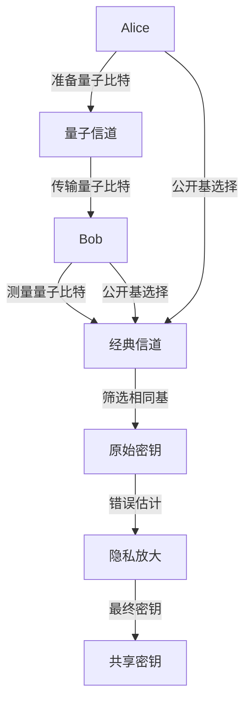
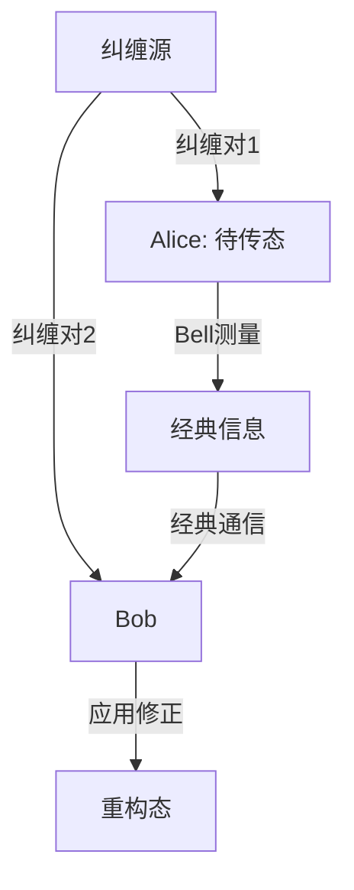

# 量子通信基础 / Quantum Communication Fundamentals

## 📚 **概述 / Overview**

量子通信是基于量子力学原理的信息传输技术，利用量子态的非定域性、不可克隆性和测量坍缩等特性实现安全通信。本文档涵盖量子通信的理论基础、关键技术、协议设计和网络架构，对标国际标准（MIT、Stanford、Oxford、Caltech）和最新研究进展。

## 📑 **目录 / Table of Contents**

- [量子通信基础 / Quantum Communication Fundamentals](#量子通信基础--quantum-communication-fundamentals)
  - [📚 **概述 / Overview**](#-概述--overview)
  - [📑 **目录 / Table of Contents**](#-目录--table-of-contents)
  - [历史背景](#历史背景)
  - [应用领域](#应用领域)
  - [1. 量子力学基础 / Quantum Mechanics Fundamentals](#1-量子力学基础--quantum-mechanics-fundamentals)
    - [1.1 量子态 / Quantum States](#11-量子态--quantum-states)
    - [1.2 量子叠加](#12-量子叠加)
    - [1.3 量子测量](#13-量子测量)
  - [2. 量子比特 / Quantum Bits](#2-量子比特--quantum-bits)
    - [2.1 量子比特定义 / Qubit Definition](#21-量子比特定义--qubit-definition)
    - [2.2 多量子比特](#22-多量子比特)
  - [3. 量子门 / Quantum Gates](#3-量子门--quantum-gates)
    - [3.1 单量子比特门 / Single-Qubit Gates](#31-单量子比特门--single-qubit-gates)
    - [3.2 多量子比特门 / Multi-Qubit Gates](#32-多量子比特门--multi-qubit-gates)
  - [4. 量子通信基础 / Quantum Communication Fundamentals](#4-量子通信基础--quantum-communication-fundamentals)
    - [4.1 量子信道 / Quantum Channels](#41-量子信道--quantum-channels)
    - [4.2 量子纠缠 / Quantum Entanglement](#42-量子纠缠--quantum-entanglement)
    - [4.3 量子隐形传态 / Quantum Teleportation](#43-量子隐形传态--quantum-teleportation)
  - [5. 量子密钥分发 / Quantum Key Distribution](#5-量子密钥分发--quantum-key-distribution)
    - [5.1 BB84协议 / BB84 Protocol](#51-bb84协议--bb84-protocol)
    - [5.2 E91协议 / E91 Protocol](#52-e91协议--e91-protocol)
    - [5.3 其他量子密钥分发协议](#53-其他量子密钥分发协议)
  - [6. 量子网络 / Quantum Networks](#6-量子网络--quantum-networks)
    - [6.1 量子网络拓扑 / Quantum Network Topology](#61-量子网络拓扑--quantum-network-topology)
    - [6.2 量子路由 / Quantum Routing](#62-量子路由--quantum-routing)
  - [7. 量子错误纠正 / Quantum Error Correction](#7-量子错误纠正--quantum-error-correction)
    - [7.1 量子错误模型 / Quantum Error Models](#71-量子错误模型--quantum-error-models)
    - [7.2 量子纠错码 / Quantum Error Correction Codes](#72-量子纠错码--quantum-error-correction-codes)
  - [8. 量子通信复杂度 / Quantum Communication Complexity](#8-量子通信复杂度--quantum-communication-complexity)
    - [8.1 通信复杂度 / Communication Complexity](#81-通信复杂度--communication-complexity)
    - [8.2 量子信息理论 / Quantum Information Theory](#82-量子信息理论--quantum-information-theory)
  - [9. 希尔伯特空间与量子协议范畴 / Hilbert Space and Quantum Protocol Categories](#9-希尔伯特空间与量子协议范畴--hilbert-space-and-quantum-protocol-categories)
    - [9.1 希尔伯特空间与量子态范畴 / Hilbert Space and Quantum State Categories](#91-希尔伯特空间与量子态范畴--hilbert-space-and-quantum-state-categories)
    - [9.2 纠缠保持性定理 / Entanglement Preservation Theorems](#92-纠缠保持性定理--entanglement-preservation-theorems)
    - [9.3 形式化语义模型 / Formal Semantic Models](#93-形式化语义模型--formal-semantic-models)
  - [10. 量子通信的结构化梳理 / Structured Overview of Quantum Communication](#10-量子通信的结构化梳理--structured-overview-of-quantum-communication)
    - [10.1 结构化梳理 / Structured Overview](#101-结构化梳理--structured-overview)
    - [10.2 主要定理与极值 / Main Theorems and Extremal Values](#102-主要定理与极值--main-theorems-and-extremal-values)
    - [10.3 形式语义模型 / Formal Semantic Models](#103-形式语义模型--formal-semantic-models)
    - [10.4 保持性与极值定理 / Preservation and Extremal Theorems](#104-保持性与极值定理--preservation-and-extremal-theorems)
  - [11. 多模态表达与可视化 / Multimodal Expression and Visualization](#11-多模态表达与可视化--multimodal-expression-and-visualization)
    - [11.1 量子电路图 / Quantum Circuit Diagrams](#111-量子电路图--quantum-circuit-diagrams)
    - [11.2 希尔伯特空间示意图 / Hilbert Space Diagrams](#112-希尔伯特空间示意图--hilbert-space-diagrams)
    - [11.3 协议流程图 / Protocol Flow Diagrams](#113-协议流程图--protocol-flow-diagrams)
    - [11.4 自动化脚本建议 / Automated Script Suggestions](#114-自动化脚本建议--automated-script-suggestions)
  - [12. 国际标准对照 / International Standards Alignment](#12-国际标准对照--international-standards-alignment)
    - [9.1 学术机构标准](#91-学术机构标准)
    - [9.2 国际标准组织](#92-国际标准组织)
    - [9.3 最新研究进展](#93-最新研究进展)
  - [13. 参考文献 / References](#13-参考文献--references)
    - [13.1 经典文献 / Classic Literature](#131-经典文献--classic-literature)
    - [13.2 最新研究论文 / Latest Research Papers](#132-最新研究论文--latest-research-papers)
    - [13.3 国际标准文档 / International Standards Documents](#133-国际标准文档--international-standards-documents)
    - [13.4 在线资源 / Online Resources](#134-在线资源--online-resources)
  - [💼 **14. 实际工程应用案例 / Real-World Engineering Application Cases**](#-14-实际工程应用案例--real-world-engineering-application-cases)
    - [14.1 量子通信网络应用 / Quantum Communication Network Applications](#141-量子通信网络应用--quantum-communication-network-applications)
      - [14.1.1 中国量子通信网络](#1411-中国量子通信网络)
      - [14.1.2 欧洲量子通信网络](#1412-欧洲量子通信网络)
    - [14.2 量子安全应用 / Quantum Security Applications](#142-量子安全应用--quantum-security-applications)
      - [14.2.1 量子安全银行系统](#1421-量子安全银行系统)
      - [14.2.2 量子安全政务系统](#1422-量子安全政务系统)
    - [14.3 量子计算应用 / Quantum Computing Applications](#143-量子计算应用--quantum-computing-applications)
      - [14.3.1 量子算法实现](#1431-量子算法实现)
      - [14.3.2 量子机器学习](#1432-量子机器学习)
    - [14.4 量子通信工具与应用 / Quantum Communication Tools and Applications](#144-量子通信工具与应用--quantum-communication-tools-and-applications)
      - [14.4.1 主流量子通信工具](#1441-主流量子通信工具)
      - [14.4.2 实际应用案例](#1442-实际应用案例)
  - [15. 总结与展望 / Summary and Future Directions](#15-总结与展望--summary-and-future-directions)
    - [15.1 核心贡献 / Core Contributions](#151-核心贡献--core-contributions)
    - [14.2 未来研究方向 / Future Research Directions](#142-未来研究方向--future-research-directions)
    - [14.3 挑战与机遇 / Challenges and Opportunities](#143-挑战与机遇--challenges-and-opportunities)

---

## 历史背景

- **1900年**：Planck提出量子假设，开创量子理论
- **1925-1926年**：Heisenberg和Schrödinger建立量子力学
- **1984年**：Bennett和Brassard提出BB84量子密钥分发协议
- **1991年**：Ekert提出基于纠缠的E91协议
- **2000年代**：量子网络和量子互联网概念提出
- **2010年代**：量子中继器和量子存储器技术发展
- **2020年代**：量子互联网原型和标准化工作推进

## 应用领域

- **量子密钥分发**：无条件安全的密钥交换
- **量子隐形传态**：量子信息的远程传输
- **量子网络**：分布式量子计算和通信
- **量子传感**：高精度测量和探测
- **量子计算**：量子算法和量子机器学习

## 1. 量子力学基础 / Quantum Mechanics Fundamentals

### 1.1 量子态 / Quantum States

**定义 1.1** (量子态 / Quantum State)
**量子态**是描述量子系统状态的数学对象，用希尔伯特空间中的向量表示：
$$|\psi\rangle \in \mathcal{H}$$

其中 $\mathcal{H}$ 是希尔伯特空间。

**形式化定义**：

- **纯态**：$|\psi\rangle = \sum_i c_i |i\rangle$，其中 $\sum_i |c_i|^2 = 1$
- **混合态**：$\rho = \sum_i p_i |\psi_i\rangle\langle\psi_i|$，其中 $\text{Tr}(\rho) = 1$
- **密度矩阵**：$\rho = \frac{1}{2}(I + \vec{r} \cdot \vec{\sigma})$，其中 $\vec{r}$ 是Bloch向量

**基本性质**：

1. **归一性**：$\langle\psi|\psi\rangle = 1$
2. **线性性**：$|\psi\rangle = \alpha|\phi_1\rangle + \beta|\phi_2\rangle$
3. **不可克隆性**：未知量子态不可被完美克隆
4. **测量坍缩**：测量导致量子态坍缩到本征态
5. **纠缠性**：多粒子量子态可能具有非局域关联

**历史发展**：

- **1900年**：Planck提出量子假设，开创量子理论
- **1925-1926年**：Heisenberg和Schrödinger建立量子力学
- **1932年**：von Neumann建立量子力学的数学基础
- **1960年代**：激光技术发展，为量子通信奠定基础
- **1980年代**：量子密钥分发理论提出
- **1990年代**：量子通信实验实现
- **2000年代**：量子网络和量子互联网概念提出

**形式化语义**：

- **希尔伯特空间语义**：量子态作为希尔伯特空间中的向量
- **密度矩阵语义**：量子态作为密度矩阵
- **路径积分语义**：量子态作为路径积分
- **代数语义**：量子态作为代数结构

**等价定义**：

1. **向量定义**：量子态是归一化向量
2. **投影定义**：量子态是投影算子
3. **密度矩阵定义**：量子态是密度矩阵
4. **波函数定义**：量子态是波函数

**基本性质**：

1. **归一性**：$|\psi\rangle$ 的模长为1
2. **线性性**：量子态的叠加是线性的
3. **不可克隆性**：未知量子态不可被完美克隆
4. **纠缠性**：多粒子量子态可能具有纠缠性质
5. **测量坍缩**：测量导致量子态坍缩

**证明**：

1. 归一性：$|\psi\rangle$ 的模长必须为1，否则概率解释不成立
2. 线性性：量子力学的叠加原理要求线性性
3. 不可克隆性：这是量子力学的基本定理
4. 纠缠性：多粒子系统的量子态可能不可分解
5. 测量坍缩：测量过程改变量子态

**定义 1.2** (纯态)
**纯态**是可以用单一向量描述的量子态：
$$|\psi\rangle = \sum_i c_i |i\rangle$$

其中 $|i\rangle$ 是正交基向量，$c_i$ 是复数系数。

**定义 1.3** (混合态)
**混合态**是纯态的统计混合，用密度矩阵描述：
$$\rho = \sum_i p_i |\psi_i\rangle\langle\psi_i|$$

其中 $p_i$ 是概率，满足 $\sum_i p_i = 1$。

### 1.2 量子叠加

**定义 1.4** (量子叠加)
**量子叠加**是量子系统同时处于多个状态的特性：
$$|\psi\rangle = \alpha|0\rangle + \beta|1\rangle$$

其中 $|\alpha|^2 + |\beta|^2 = 1$。

**性质 1.1** (叠加原理)
量子系统可以处于多个本征态的线性叠加：
$$|\psi\rangle = \sum_i c_i |\phi_i\rangle$$

其中 $|\phi_i\rangle$ 是本征态，$c_i$ 是叠加系数。

### 1.3 量子测量

**定义 1.5** (量子测量 / Quantum Measurement)
**量子测量**是将量子态投影到测量基上的过程：
$$P_i = |i\rangle\langle i|$$

测量结果 $i$ 的概率为：
$$P(i) = \langle\psi|P_i|\psi\rangle$$

**定义 1.6** (测量后状态 / Post-Measurement State)
测量后量子态坍缩为：
$$|\psi'\rangle = \frac{P_i|\psi\rangle}{\sqrt{\langle\psi|P_i|\psi\rangle}}$$

**历史背景**：

- **1927年**：Heisenberg提出不确定性原理
- **1932年**：von Neumann建立测量理论
- **1957年**：Everett提出多世界解释
- **1960年代**：POVM测量理论发展
- **1980年代**：弱测量理论提出
- **1990年代**：量子测量在量子通信中应用

**形式化语义**：

- **投影语义**：测量作为投影算子
- **概率语义**：测量结果作为概率分布
- **坍缩语义**：测量导致态坍缩
- **信息语义**：测量获取信息

**测量公理**：

1. **Born规则**：测量结果 $i$ 的概率为 $P(i) = |\langle i|\psi\rangle|^2$
2. **坍缩规则**：测量后态坍缩到对应的本征态
3. **可观测性**：可观测量对应厄米算子
4. **完备性**：测量基构成完备基

**定理 1.1** (量子测量基本定理)
对于量子态 $|\psi\rangle$ 和测量算子 $\{P_i\}$：

1. **概率归一化**：$\sum_i P(i) = 1$
2. **期望值**：$\langle A \rangle = \langle\psi|A|\psi\rangle$
3. **方差**：$\Delta A^2 = \langle A^2 \rangle - \langle A \rangle^2$
4. **不确定性关系**：$\Delta A \Delta B \geq \frac{1}{2}|\langle[A,B]\rangle|$

**证明**：

**概率归一化证明**：
$$\sum_i P(i) = \sum_i \langle\psi|P_i|\psi\rangle = \langle\psi|\sum_i P_i|\psi\rangle = \langle\psi|I|\psi\rangle = 1$$

**期望值证明**：
$$\langle A \rangle = \sum_i a_i P(i) = \sum_i a_i \langle\psi|P_i|\psi\rangle = \langle\psi|A|\psi\rangle$$

**方差证明**：
$$\Delta A^2 = \langle A^2 \rangle - \langle A \rangle^2 = \langle\psi|A^2|\psi\rangle - \langle\psi|A|\psi\rangle^2$$

**不确定性关系证明**：
使用Cauchy-Schwarz不等式和算符对易关系证明。

**测量类型**：

1. **投影测量**：使用投影算子
2. **POVM测量**：使用正算子值测量
3. **弱测量**：不显著改变量子态
4. **连续测量**：连续时间测量

**应用与推广**：

1. **量子密钥分发**：测量用于密钥生成
2. **量子态制备**：测量用于态制备
3. **量子纠错**：测量用于错误检测
4. **量子计算**：测量用于结果读取

**算法实现**：

```python
import numpy as np
from typing import List, Dict, Tuple, Optional
import qiskit
from qiskit import QuantumCircuit, QuantumRegister, ClassicalRegister
from qiskit.quantum_info import Operator, Statevector, DensityMatrix

class QuantumMeasurement:
    """量子测量类"""

    def __init__(self, measurement_basis: List[np.ndarray]):
        self.basis = measurement_basis
        self.dimension = len(measurement_basis[0])

    def measure(self, quantum_state: np.ndarray) -> Dict:
        """
        量子测量

        参数:
        quantum_state: 量子态向量
        measurement_basis: 测量基

        返回:
        测量结果和坍缩后的态
        """
        # 计算测量概率
        probabilities = []
        for basis_state in self.basis:
            prob = abs(np.vdot(quantum_state, basis_state))**2
            probabilities.append(prob)

        # 归一化概率
        total_prob = sum(probabilities)
        if total_prob > 0:
            probabilities = [p / total_prob for p in probabilities]

        # 根据概率选择测量结果
        result_index = np.random.choice(len(self.basis), p=probabilities)
        result_state = self.basis[result_index]

        return {
            'result': result_index,
            'probability': probabilities[result_index],
            'collapsed_state': result_state,
            'all_probabilities': probabilities
        }

    def expectation_value(self, quantum_state: np.ndarray, observable: np.ndarray) -> float:
        """计算期望值"""
        return np.real(np.vdot(quantum_state, observable @ quantum_state))

    def uncertainty(self, quantum_state: np.ndarray, observable: np.ndarray) -> float:
        """计算不确定性"""
        exp_val = self.expectation_value(quantum_state, observable)
        exp_val_sq = self.expectation_value(quantum_state, observable @ observable)
        return np.sqrt(exp_val_sq - exp_val**2)

class QuantumState:
    """量子态类"""

    def __init__(self, state_vector: np.ndarray):
        self.state = state_vector / np.linalg.norm(state_vector)

    def fidelity(self, other_state: 'QuantumState') -> float:
        """计算保真度"""
        overlap = abs(np.vdot(self.state, other_state.state))
        return overlap**2

    def von_neumann_entropy(self) -> float:
        """计算冯·诺依曼熵"""
        density_matrix = np.outer(self.state, self.state.conj())
        eigenvalues = np.linalg.eigvals(density_matrix)
        eigenvalues = eigenvalues[eigenvalues > 1e-10]  # 避免log(0)
        return -np.sum(eigenvalues * np.log2(eigenvalues))

# 示例：Bell态测量
def create_bell_state(which_bell: int = 0) -> np.ndarray:
    """创建Bell态"""
    bell_states = [
        np.array([1, 0, 0, 1]) / np.sqrt(2),  # |Φ⁺⟩
        np.array([1, 0, 0, -1]) / np.sqrt(2), # |Φ⁻⟩
        np.array([0, 1, 1, 0]) / np.sqrt(2),  # |Ψ⁺⟩
        np.array([0, 1, -1, 0]) / np.sqrt(2)  # |Ψ⁻⟩
    ]
    return bell_states[which_bell]

def measure_bell_state(bell_state: np.ndarray) -> Dict:
    """测量Bell态"""
    # Bell态测量基
    bell_basis = [
        np.array([1, 0, 0, 1]) / np.sqrt(2),
        np.array([1, 0, 0, -1]) / np.sqrt(2),
        np.array([0, 1, 1, 0]) / np.sqrt(2),
        np.array([0, 1, -1, 0]) / np.sqrt(2)
    ]

    measurer = QuantumMeasurement(bell_basis)
    return measurer.measure(bell_state)
```

## 2. 量子比特 / Quantum Bits

### 2.1 量子比特定义 / Qubit Definition

**定义 2.1** (量子比特 / Quantum Bit)
**量子比特** (qubit) 是量子信息的基本单位：
$$|\psi\rangle = \alpha|0\rangle + \beta|1\rangle$$

其中 $|0\rangle$ 和 $|1\rangle$ 是计算基，$\alpha, \beta \in \mathbb{C}$，且 $|\alpha|^2 + |\beta|^2 = 1$。

**Bloch球表示**：
$$|\psi\rangle = \cos\frac{\theta}{2}|0\rangle + e^{i\phi}\sin\frac{\theta}{2}|1\rangle$$

其中 $\theta \in [0, \pi]$，$\phi \in [0, 2\pi]$。

**物理实现**：

- **超导量子比特**：Josephson结电路
- **离子阱量子比特**：囚禁离子的能级
- **光子量子比特**：光子的偏振或路径
- **半导体量子比特**：量子点或杂质
- **拓扑量子比特**：任意子激发态

**定义 2.2** (Bloch球)
**Bloch球**是表示单量子比特的几何模型：
$$|\psi\rangle = \cos\frac{\theta}{2}|0\rangle + e^{i\phi}\sin\frac{\theta}{2}|1\rangle$$

其中 $\theta \in [0, \pi]$，$\phi \in [0, 2\pi]$。

### 2.2 多量子比特

**定义 2.3** (多量子比特系统)
**$n$量子比特系统**的状态是：
$$|\psi\rangle = \sum_{i=0}^{2^n-1} c_i |i\rangle$$

其中 $|i\rangle$ 是 $n$ 位二进制表示，$c_i$ 是复数系数。

**定义 2.4** (张量积)
**张量积**用于构造多量子比特系统：
$$|\psi\rangle \otimes |\phi\rangle = |\psi\phi\rangle$$

**性质 2.1** (纠缠)
**纠缠态**是不能分解为单量子比特张量积的多量子比特态：
$$|\psi\rangle \neq |\psi_1\rangle \otimes |\psi_2\rangle \otimes \cdots \otimes |\psi_n\rangle$$

## 3. 量子门 / Quantum Gates

### 3.1 单量子比特门 / Single-Qubit Gates

**定义 3.1** (Pauli门 / Pauli Gates)
**Pauli门**是基本的单量子比特门：

**X门** (NOT门)：
$$X = \begin{pmatrix} 0 & 1 \\ 1 & 0 \end{pmatrix}$$

**Y门**：
$$Y = \begin{pmatrix} 0 & -i \\ i & 0 \end{pmatrix}$$

**Z门**：
$$Z = \begin{pmatrix} 1 & 0 \\ 0 & -1 \end{pmatrix}$$

**定义 3.2** (Hadamard门 / Hadamard Gate)
**Hadamard门**创建叠加态：
$$H = \frac{1}{\sqrt{2}}\begin{pmatrix} 1 & 1 \\ 1 & -1 \end{pmatrix}$$

**定义 3.3** (相位门 / Phase Gates)
**S门** (π/2相位门)：
$$S = \begin{pmatrix} 1 & 0 \\ 0 & i \end{pmatrix}$$

**T门** (π/4相位门)：
$$T = \begin{pmatrix} 1 & 0 \\ 0 & e^{i\pi/4} \end{pmatrix}$$

**定义 3.4** (旋转门 / Rotation Gates)
**Rx门** (绕X轴旋转)：
$$R_x(\theta) = \begin{pmatrix} \cos\frac{\theta}{2} & -i\sin\frac{\theta}{2} \\ -i\sin\frac{\theta}{2} & \cos\frac{\theta}{2} \end{pmatrix}$$

**Ry门** (绕Y轴旋转)：
$$R_y(\theta) = \begin{pmatrix} \cos\frac{\theta}{2} & -\sin\frac{\theta}{2} \\ \sin\frac{\theta}{2} & \cos\frac{\theta}{2} \end{pmatrix}$$

**Rz门** (绕Z轴旋转)：
$$R_z(\theta) = \begin{pmatrix} e^{-i\theta/2} & 0 \\ 0 & e^{i\theta/2} \end{pmatrix}$$

### 3.2 多量子比特门 / Multi-Qubit Gates

**定义 3.5** (CNOT门 / Controlled-NOT Gate)
**CNOT门**是两量子比特受控门：
$$
\text{CNOT} = \begin{pmatrix}
1 & 0 & 0 & 0 \\
0 & 1 & 0 & 0 \\
0 & 0 & 0 & 1 \\
0 & 0 & 1 & 0
\end{pmatrix}
$$

**定义 3.6** (SWAP门 / SWAP Gate)
**SWAP门**交换两个量子比特：
$$
\text{SWAP} = \begin{pmatrix}
1 & 0 & 0 & 0 \\
0 & 0 & 1 & 0 \\
0 & 1 & 0 & 0 \\
0 & 0 & 0 & 1
\end{pmatrix}
$$

**定义 3.7** (受控门 / Controlled Gates)
**受控U门**：
$$
\text{CU} = \begin{pmatrix}
I & 0 \\
0 & U
\end{pmatrix}
$$

其中 $U$ 是任意单量子比特门。

**定义 3.8** (Toffoli门 / Toffoli Gate)
**Toffoli门**是三量子比特受控门：
$$
\text{CCNOT} = \begin{pmatrix}
I_6 & 0 \\
0 & X
\end{pmatrix}
$$

**定义 3.9** (纠缠门 / Entangling Gates)
**CZ门** (受控Z门)：
$$
\text{CZ} = \begin{pmatrix}
1 & 0 & 0 & 0 \\
0 & 1 & 0 & 0 \\
0 & 0 & 1 & 0 \\
0 & 0 & 0 & -1
\end{pmatrix}
$$

**CPHASE门** (受控相位门)：
$$
\text{CPHASE}(\theta) = \begin{pmatrix}
1 & 0 & 0 & 0 \\
0 & 1 & 0 & 0 \\
0 & 0 & 1 & 0 \\
0 & 0 & 0 & e^{i\theta}
\end{pmatrix}
$$

## 4. 量子通信基础 / Quantum Communication Fundamentals

### 4.1 量子信道 / Quantum Channels

**定义 4.1** (量子信道 / Quantum Channel)
**量子信道**是量子态的传输媒介：
$$\mathcal{E}: \mathcal{D}(\mathcal{H}_A) \to \mathcal{D}(\mathcal{H}_B)$$

其中 $\mathcal{D}(\mathcal{H})$ 是密度矩阵空间。

**信道类型**：

- **去极化信道**：$\mathcal{E}(\rho) = (1-p)\rho + \frac{p}{3}(X\rho X + Y\rho Y + Z\rho Z)$
- **振幅阻尼信道**：$\mathcal{E}(\rho) = E_0\rho E_0^\dagger + E_1\rho E_1^\dagger$
- **相位阻尼信道**：$\mathcal{E}(\rho) = (1-p)\rho + pZ\rho Z$
- **比特翻转信道**：$\mathcal{E}(\rho) = (1-p)\rho + pX\rho X$

**定义 4.2** (保真度 / Fidelity)
**保真度**衡量量子态的相似性：
$$F(\rho, \sigma) = \text{Tr}\left(\sqrt{\sqrt{\rho}\sigma\sqrt{\rho}}\right)$$

对于纯态：$F(|\psi\rangle, |\phi\rangle) = |\langle\psi|\phi\rangle|$

**定义 4.3** (信道容量 / Channel Capacity)
**量子信道容量**是信道能传输的最大信息量：
$$C(\mathcal{E}) = \max_{\rho} I(\rho, \mathcal{E})$$

其中 $I(\rho, \mathcal{E})$ 是互信息。

### 4.2 量子纠缠 / Quantum Entanglement

**定义 4.4** (Bell态 / Bell States)
**Bell态**是基本的双量子比特纠缠态：
$$|\Phi^+\rangle = \frac{1}{\sqrt{2}}(|00\rangle + |11\rangle)$$
$$|\Phi^-\rangle = \frac{1}{\sqrt{2}}(|00\rangle - |11\rangle)$$
$$|\Psi^+\rangle = \frac{1}{\sqrt{2}}(|01\rangle + |10\rangle)$$
$$|\Psi^-\rangle = \frac{1}{\sqrt{2}}(|01\rangle - |10\rangle)$$

**定义 4.5** (纠缠度量 / Entanglement Measures)
**冯·诺依曼熵**：
$$E(|\psi\rangle) = S(\text{Tr}_B(|\psi\rangle\langle\psi|))$$

其中 $S(\rho) = -\text{Tr}(\rho\log\rho)$ 是冯·诺依曼熵。

**纠缠度量类型**：

- **冯·诺依曼熵**：$E(|\psi\rangle) = S(\rho_A)$
- **纠缠形成**：$E_F(\rho) = \min \sum_i p_i E(|\psi_i\rangle)$
- **纠缠蒸馏**：$E_D(\rho) = \max \lim_{n \to \infty} \frac{m}{n}$
- **相对熵纠缠**：$E_R(\rho) = \min_{\sigma \in \text{SEP}} S(\rho \|\sigma)$

**纠缠分类**：

- **可分离态**：$\rho = \sum_i p_i \rho_A^i \otimes \rho_B^i$
- **纠缠态**：不可分解为可分离态的混合
- **最大纠缠态**：冯·诺依曼熵达到最大值

**定理 4.1** (纠缠单配性 / Entanglement Monogamy)
对于三体系统$ABC$，如果$A$和$B$最大纠缠，则$A$和$C$不能纠缠：
$$E(A:B) + E(A:C) \leq E(A:BC)$$

**证明思路**：

1. 使用纠缠度量的凸性和单调性
2. 应用量子信息不等式
3. 考虑最大纠缠态的约束

**应用**：

- **量子密钥分发**：纠缠单配性保证安全性
- **量子网络**：限制纠缠资源的分配
- **量子纠错**：理解纠缠的分布

### 4.3 量子隐形传态 / Quantum Teleportation

**定义 4.6** (量子隐形传态 / Quantum Teleportation)
**量子隐形传态**是利用纠缠和经典通信传输未知量子态的过程。

**协议步骤**：

1. **准备纠缠态**：Alice和Bob共享Bell态$|\Phi^+\rangle = \frac{1}{\sqrt{2}}(|00\rangle + |11\rangle)$

2. **Bell测量**：Alice对要传输的态$|\psi\rangle$和她的纠缠粒子进行Bell测量

3. **经典通信**：Alice将测量结果（2个经典比特）发送给Bob

4. **态重构**：Bob根据经典信息应用相应的Pauli门重构$|\psi\rangle$

**数学表述**：
$$|\psi\rangle \otimes |\Phi^+\rangle = \frac{1}{2}\sum_{i=0}^{3} |\Phi_i\rangle \otimes \sigma_i |\psi\rangle$$

其中$|\Phi_i\rangle$是四个Bell态，$\sigma_i$是Pauli算符。

**定理 4.2** (量子隐形传态的正确性)
量子隐形传态协议可以完美传输未知量子态。

**证明**：

1. 初始态：$|\psi\rangle_A \otimes |\Phi^+\rangle_{AB}$
2. Bell测量后，系统坍缩到某个Bell态
3. Bob的粒子处于相应的态
4. 应用Pauli修正后，Bob得到$|\psi\rangle$

$\boxed{\text{证毕}}$

**资源消耗**：

- **量子资源**：1个纠缠对（ebit）
- **经典资源**：2个经典比特（cbit）
- **通信轮次**：1轮（Alice → Bob）

**应用**：

- **量子网络**：在量子网络中传输量子信息
- **量子计算**：分布式量子计算
- **量子中继**：扩展量子通信距离

## 5. 量子密钥分发 / Quantum Key Distribution

### 5.1 BB84协议 / BB84 Protocol

**定义 5.1** (BB84协议 / BB84 Protocol)
**BB84协议**是第一个量子密钥分发协议，由Bennett和Brassard于1984年提出：

**协议步骤**：

**步骤1**：Alice随机选择比特和基

- 比特：$b \in \{0,1\}$
- 基：$\theta \in \{0, \pi/4\}$ (Z基或X基)

**步骤2**：Alice发送量子比特
$$
|\psi\rangle = \begin{cases}
|0\rangle \text{ 或 } |1\rangle & \text{如果 } \theta = 0 \text{ (Z基)} \\
|+\rangle \text{ 或 } |-\rangle & \text{如果 } \theta = \pi/4 \text{ (X基)}
\end{cases}
$$

其中 $|+\rangle = \frac{1}{\sqrt{2}}(|0\rangle + |1\rangle)$，$|-\rangle = \frac{1}{\sqrt{2}}(|0\rangle - |1\rangle)$

**步骤3**：Bob随机选择测量基

- 基：$\theta' \in \{0, \pi/4\}$

**步骤4**：Bob测量并记录结果

**步骤5**：Alice和Bob公开基的选择

**步骤6**：保留相同基的测量结果

**安全性分析**：

- **窃听检测**：Eve的测量会引入错误
- **错误率阈值**：通常为11%
- **隐私放大**：通过哈希函数提取安全密钥

**算法 5.1** (BB84算法 / BB84 Algorithm)

```python
import numpy as np
import hashlib
from typing import List, Tuple, Dict

class BB84Protocol:
    """BB84量子密钥分发协议实现"""

    def __init__(self, key_length: int = 256):
        self.key_length = key_length
        self.z_basis = 0  # Z基 (|0⟩, |1⟩)
        self.x_basis = 1  # X基 (|+⟩, |-⟩)

    def prepare_qubit(self, bit: int, basis: int) -> np.ndarray:
        """准备量子比特"""
        if basis == self.z_basis:
            # Z基：|0⟩ 或 |1⟩
            return np.array([1, 0]) if bit == 0 else np.array([0, 1])
        else:
            # X基：|+⟩ 或 |-⟩
            if bit == 0:
                return np.array([1, 1]) / np.sqrt(2)  # |+⟩
            else:
                return np.array([1, -1]) / np.sqrt(2)  # |-⟩

    def measure_qubit(self, qubit: np.ndarray, basis: int) -> int:
        """测量量子比特"""
        if basis == self.z_basis:
            # Z基测量
            prob_0 = abs(qubit[0])**2
            return 0 if np.random.random() < prob_0 else 1
        else:
            # X基测量
            # 将量子比特转换到X基
            x_0 = (qubit[0] + qubit[1]) / np.sqrt(2)  # |+⟩分量
            prob_plus = abs(x_0)**2
            return 0 if np.random.random() < prob_plus else 1

    def generate_key(self) -> Tuple[List[int], float]:
        """生成量子密钥"""
        # 步骤1-2：Alice准备和发送量子比特
        n_raw = self.key_length * 4  # 原始比特数
        alice_bits = np.random.randint(0, 2, n_raw)
        alice_bases = np.random.randint(0, 2, n_raw)

        # 步骤3-4：Bob测量
        bob_bases = np.random.randint(0, 2, n_raw)
        bob_bits = []
        for i in range(n_raw):
            qubit = self.prepare_qubit(alice_bits[i], alice_bases[i])
            bob_bits.append(self.measure_qubit(qubit, bob_bases[i]))

        # 步骤5-6：筛选相同基的结果
        sifted_bits = []
        for i in range(n_raw):
            if alice_bases[i] == bob_bases[i]:
                sifted_bits.append((alice_bits[i], bob_bits[i]))

        # 步骤7：错误估计
        error_count = sum(1 for a, b in sifted_bits if a != b)
        error_rate = error_count / len(sifted_bits) if sifted_bits else 1.0

        # 步骤8：隐私放大
        if error_rate < 0.11:  # 错误率阈值
            final_key = self.privacy_amplification(sifted_bits)
            return final_key, error_rate
        else:
            return [], error_rate

    def privacy_amplification(self, sifted_bits: List[Tuple[int, int]]) -> List[int]:
        """隐私放大"""
        # 使用Alice的比特作为原始密钥
        raw_key = [a for a, b in sifted_bits]

        # 简单的哈希函数进行隐私放大
        key_string = ''.join(map(str, raw_key))
        hash_object = hashlib.sha256(key_string.encode())
        hash_hex = hash_object.hexdigest()

        # 转换为二进制
        final_key = []
        for char in hash_hex:
            final_key.extend([int(bit) for bit in format(int(char, 16), '04b')])

        return final_key[:self.key_length]

# 使用示例
def run_bb84_example():
    """运行BB84协议示例"""
    protocol = BB84Protocol(key_length=128)
    final_key, error_rate = protocol.generate_key()

    print(f"BB84协议结果:")
    print(f"错误率: {error_rate:.3f}")
    print(f"最终密钥长度: {len(final_key)}")
    print(f"密钥前20位: {final_key[:20]}")

    return final_key, error_rate
```

### 5.2 E91协议 / E91 Protocol

**定义 5.2** (E91协议 / E91 Protocol)
**E91协议**基于量子纠缠的密钥分发，由Ekert于1991年提出：

**协议步骤**：

**步骤1**：Charlie准备Bell态对
$$|\Phi^+\rangle = \frac{1}{\sqrt{2}}(|00\rangle + |11\rangle)$$

**步骤2**：Charlie将纠缠对分别发送给Alice和Bob

**步骤3**：Alice和Bob随机选择测量基

- 基：$\theta_A, \theta_B \in \{0, \pi/4, \pi/2, 3\pi/4\}$

**步骤4**：Alice和Bob测量并记录结果

**步骤5**：Alice和Bob公开测量基

**步骤6**：计算相关性并生成密钥

**Bell不等式验证**：
$$S = E(\theta_A, \theta_B) - E(\theta_A, \theta_B') + E(\theta_A', \theta_B) + E(\theta_A', \theta_B')$$

其中 $E(\theta_A, \theta_B)$ 是相关性函数。

**安全性**：违反Bell不等式证明存在纠缠，确保安全性。

### 5.3 其他量子密钥分发协议

**B92协议**：

- 使用两个非正交态
- 简化了BB84协议
- 效率较低但实现简单

**SARG04协议**：

- BB84的变种
- 使用四个非正交态
- 对某些攻击更安全

**BBM92协议**：

- 基于纠缠的协议
- 不需要可信的第三方
- 适合量子网络

**算法 5.2** (E91算法 / E91 Algorithm)

```python
import numpy as np
from typing import List, Tuple, Dict

class E91Protocol:
    """E91量子密钥分发协议实现"""

    def __init__(self, key_length: int = 256):
        self.key_length = key_length
        self.measurement_angles = [0, np.pi/4, np.pi/2, 3*np.pi/4]

    def create_bell_state(self) -> np.ndarray:
        """创建Bell态 |Φ⁺⟩"""
        return np.array([1, 0, 0, 1]) / np.sqrt(2)

    def measure_entangled_pair(self, bell_state: np.ndarray,
                              angle_a: float, angle_b: float) -> Tuple[int, int]:
        """测量纠缠对"""
        # 构建测量算符
        ma = np.array([[np.cos(angle_a), -np.sin(angle_a)],
                       [np.sin(angle_a), np.cos(angle_a)]])
        mb = np.array([[np.cos(angle_b), -np.sin(angle_b)],
                       [np.sin(angle_b), np.cos(angle_b)]])

        # 计算测量概率
        # 这里简化处理，实际需要更复杂的量子测量
        prob_00 = 0.5 * (1 + np.cos(angle_a - angle_b))
        prob_01 = 0.5 * (1 - np.cos(angle_a - angle_b))
        prob_10 = 0.5 * (1 - np.cos(angle_a - angle_b))
        prob_11 = 0.5 * (1 + np.cos(angle_a - angle_b))

        # 根据概率选择结果
        probs = [prob_00, prob_01, prob_10, prob_11]
        result = np.random.choice(4, p=probs)

        # 转换为Alice和Bob的结果
        alice_result = result // 2
        bob_result = result % 2

        return alice_result, bob_result

    def calculate_correlation(self, results_a: List[int],
                            results_b: List[int]) -> float:
        """计算相关性"""
        if len(results_a) != len(results_b):
            return 0.0

        correlation = 0.0
        for a, b in zip(results_a, results_b):
            correlation += (1 if a == b else -1)

        return correlation / len(results_a)

    def bell_inequality_test(self, correlations: List[float]) -> float:
        """Bell不等式测试"""
        if len(correlations) != 4:
            return 0.0

        S = correlations[0] - correlations[1] + correlations[2] + correlations[3]
        return S

    def generate_key(self) -> Tuple[List[int], float, float]:
        """生成量子密钥"""
        n_raw = self.key_length * 8  # 原始测量数

        # 生成测量角度
        angles_a = np.random.choice(self.measurement_angles, n_raw)
        angles_b = np.random.choice(self.measurement_angles, n_raw)

        # 测量纠缠对
        results_a = []
        results_b = []
        bell_state = self.create_bell_state()

        for i in range(n_raw):
            a, b = self.measure_entangled_pair(bell_state, angles_a[i], angles_b[i])
            results_a.append(a)
            results_b.append(b)

        # 计算Bell不等式
        correlations = []
        for angle_a in self.measurement_angles:
            for angle_b in self.measurement_angles:
                # 筛选相同角度的测量
                same_angle_indices = [(i, j) for i, j in enumerate(range(n_raw))
                                    if abs(angles_a[i] - angle_a) < 1e-6 and
                                    abs(angles_b[j] - angle_b) < 1e-6]

                if same_angle_indices:
                    a_results = [results_a[i] for i, _ in same_angle_indices]
                    b_results = [results_b[j] for _, j in same_angle_indices]
                    corr = self.calculate_correlation(a_results, b_results)
                    correlations.append(corr)

        bell_value = self.bell_inequality_test(correlations[:4])

        # 生成密钥（使用相同角度的测量结果）
        key_bits = []
        for i in range(n_raw):
            if abs(angles_a[i] - angles_b[i]) < 1e-6:  # 相同角度
                key_bits.append(results_a[i])

        return key_bits[:self.key_length], bell_value, len(key_bits) / n_raw

# 使用示例
def run_e91_example():
    """运行E91协议示例"""
    protocol = E91Protocol(key_length=128)
    final_key, bell_value, efficiency = protocol.generate_key()

    print(f"E91协议结果:")
    print(f"Bell不等式值: {bell_value:.3f}")
    print(f"密钥生成效率: {efficiency:.3f}")
    print(f"最终密钥长度: {len(final_key)}")
    print(f"密钥前20位: {final_key[:20]}")

    return final_key, bell_value, efficiency
```

## 6. 量子网络 / Quantum Networks

### 6.1 量子网络拓扑 / Quantum Network Topology

**定义 6.1** (量子网络 / Quantum Network)
**量子网络**是连接多个量子节点的网络：
$$\mathcal{QN} = \langle N, C, P, R, E \rangle$$

其中：

- $N$ 是量子节点集
- $C$ 是量子信道集
- $P$ 是量子协议集
- $R$ 是量子路由器集
- $E$ 是纠缠资源集

**定义 6.2** (量子节点 / Quantum Node)
**量子节点**是具有量子处理能力的实体：
$$n_i = \langle Q_i, M_i, P_i, S_i, T_i \rangle$$

其中：

- $Q_i$ 是量子比特集
- $M_i$ 是量子存储器
- $P_i$ 是量子处理器
- $S_i$ 是量子源
- $T_i$ 是量子中继器

**网络类型**：

- **点对点网络**：两个节点直接连接
- **星型网络**：中心节点连接所有其他节点
- **环形网络**：节点形成环形拓扑
- **网状网络**：任意节点间可建立连接
- **分层网络**：多层次的网络架构

**量子互联网架构**：

- **接入层**：量子终端和用户设备
- **传输层**：量子中继器和路由器
- **核心层**：量子骨干网络
- **应用层**：量子应用和服务

### 6.2 量子路由 / Quantum Routing

**定义 6.3** (量子路由 / Quantum Routing)
**量子路由**是在量子网络中传输量子信息的过程：
$$\mathcal{R}: \mathcal{H}_A \times \mathcal{P} \to \mathcal{H}_B$$

其中 $\mathcal{P}$ 是路径集。

**路由策略**：

- **纠缠路由**：基于纠缠的量子信息传输
- **量子隐形传态**：通过经典通信传输量子信息
- **量子中继**：使用中继节点扩展传输距离
- **多路径路由**：利用多条路径提高可靠性

**算法 6.1** (量子路由算法 / Quantum Routing Algorithm)

```python
import networkx as nx
from typing import List, Dict, Tuple, Optional
import numpy as np

class QuantumRouter:
    """量子路由器"""

    def __init__(self, network_topology: nx.Graph):
        self.network = network_topology
        self.entanglement_pairs = {}  # 存储纠缠对
        self.routing_table = {}  # 路由表

    def find_quantum_path(self, source: int, target: int) -> List[int]:
        """寻找量子路径"""
        try:
            # 使用Dijkstra算法寻找最短路径
            path = nx.shortest_path(self.network, source, target)
            return path
        except nx.NetworkXNoPath:
            return []

    def create_entanglement(self, node1: int, node2: int) -> bool:
        """在两个节点间建立纠缠"""
        # 模拟纠缠建立过程
        success_prob = 0.8  # 纠缠建立成功率
        if np.random.random() < success_prob:
            pair_id = f"ent_{node1}_{node2}_{len(self.entanglement_pairs)}"
            self.entanglement_pairs[pair_id] = {
                'nodes': (node1, node2),
                'state': 'bell_state',
                'fidelity': 0.95
            }
            return True
        return False

    def quantum_teleportation(self, source: int, target: int,
                            quantum_state: np.ndarray) -> np.ndarray:
        """量子隐形传态"""
        # 步骤1：建立纠缠
        if not self.create_entanglement(source, target):
            raise Exception("无法建立纠缠")

        # 步骤2：Bell测量
        bell_measurement_result = self.bell_measurement(quantum_state)

        # 步骤3：经典通信（模拟）
        classical_info = bell_measurement_result

        # 步骤4：重构量子态
        reconstructed_state = self.reconstruct_state(classical_info)

        return reconstructed_state

    def bell_measurement(self, quantum_state: np.ndarray) -> Dict:
        """Bell测量"""
        # 简化的Bell测量
        bell_basis = [
            np.array([1, 0, 0, 1]) / np.sqrt(2),  # |Φ⁺⟩
            np.array([1, 0, 0, -1]) / np.sqrt(2), # |Φ⁻⟩
            np.array([0, 1, 1, 0]) / np.sqrt(2),  # |Ψ⁺⟩
            np.array([0, 1, -1, 0]) / np.sqrt(2)  # |Ψ⁻⟩
        ]

        # 计算测量概率
        probabilities = []
        for bell_state in bell_basis:
            prob = abs(np.vdot(quantum_state, bell_state))**2
            probabilities.append(prob)

        # 选择测量结果
        result = np.random.choice(4, p=probabilities)

        return {
            'bell_state': result,
            'probability': probabilities[result]
        }

    def reconstruct_state(self, classical_info: Dict) -> np.ndarray:
        """重构量子态"""
        bell_state = classical_info['bell_state']

        # 根据Bell测量结果应用相应的门操作
        reconstruction_gates = {
            0: np.eye(2),      # |Φ⁺⟩: 无需操作
            1: np.array([[1, 0], [0, -1]]),  # |Φ⁻⟩: Z门
            2: np.array([[0, 1], [1, 0]]),   # |Ψ⁺⟩: X门
            3: np.array([[0, -1j], [1j, 0]]) # |Ψ⁻⟩: Y门
        }

        gate = reconstruction_gates[bell_state]
        # 这里简化处理，实际需要更复杂的量子态重构
        return gate @ np.array([1, 0])  # 假设初始态为|0⟩

    def route_quantum_information(self, source: int, target: int,
                                quantum_state: np.ndarray) -> np.ndarray:
        """路由量子信息"""
        # 寻找路径
        path = self.find_quantum_path(source, target)
        if not path:
            raise Exception("无法找到路径")

        current_state = quantum_state

        # 逐跳传输
        for i in range(len(path) - 1):
            current_node = path[i]
            next_node = path[i + 1]

            # 量子隐形传态
            current_state = self.quantum_teleportation(current_node, next_node, current_state)

        return current_state

# 使用示例
def create_quantum_network_example():
    """创建量子网络示例"""
    # 创建网络拓扑
    G = nx.Graph()
    G.add_edges_from([
        (0, 1), (1, 2), (2, 3), (3, 4),
        (0, 2), (1, 3), (2, 4)
    ])

    # 创建量子路由器
    router = QuantumRouter(G)

    # 路由量子信息
    source_node = 0
    target_node = 4
    initial_state = np.array([1, 0])  # |0⟩态

    try:
        final_state = router.route_quantum_information(source_node, target_node, initial_state)
        print(f"量子信息从节点{source_node}成功传输到节点{target_node}")
        print(f"最终量子态: {final_state}")
        return final_state
    except Exception as e:
        print(f"传输失败: {e}")
        return None
```

## 7. 量子错误纠正 / Quantum Error Correction

### 7.1 量子错误模型 / Quantum Error Models

**定义 7.1** (量子错误 / Quantum Error)
**量子错误**是量子态在传输或存储过程中的偏差：
$$\mathcal{E}(\rho) = \sum_i E_i \rho E_i^\dagger$$

其中 $E_i$ 是错误算符。

**定义 7.2** (错误类型 / Error Types)
常见的量子错误类型：

- **比特翻转错误**：$X|\psi\rangle$
- **相位翻转错误**：$Z|\psi\rangle$
- **去相干错误**：$\rho \to \frac{1}{2}(\rho + Z\rho Z)$
- **振幅阻尼错误**：$\rho \to E_0\rho E_0^\dagger + E_1\rho E_1^\dagger$
- **相位阻尼错误**：$\rho \to (1-p)\rho + pZ\rho Z$

**错误模型**：

- **独立错误模型**：每个量子比特独立出错
- **相关错误模型**：多个量子比特同时出错
- **马尔可夫错误模型**：错误随时间演化
- **非马尔可夫错误模型**：错误具有记忆效应

### 7.2 量子纠错码 / Quantum Error Correction Codes

**定义 7.3** (量子纠错码 / Quantum Error Correction Code)
**量子纠错码**是检测和纠正量子错误的编码方案：
$$C = \{|\psi\rangle : S_i|\psi\rangle = |\psi\rangle \text{ for all } i\}$$

其中 $S_i$ 是稳定子算符。

**纠错码类型**：

- **稳定子码**：基于稳定子理论的纠错码
- **表面码**：拓扑量子计算中的主要纠错码
- **颜色码**：基于颜色编码的纠错码
- **LDPC码**：低密度奇偶校验码的量子版本

**算法 7.1** (三量子比特纠错码 / Three-Qubit Error Correction Code)

```python
import numpy as np
from typing import List, Tuple, Dict

class QuantumErrorCorrection:
    """量子错误纠正"""

    def __init__(self):
        self.error_syndromes = {
            'no_error': [1, 1, 1],
            'bit_flip_1': [-1, 1, 1],
            'bit_flip_2': [1, -1, 1],
            'bit_flip_3': [1, 1, -1]
        }

    def encode_three_qubit(self, qubit: np.ndarray) -> np.ndarray:
        """三量子比特编码"""
        # 编码：|ψ⟩ → |ψ⟩|0⟩|0⟩
        encoded = np.kron(qubit, np.array([1, 0]))
        encoded = np.kron(encoded, np.array([1, 0]))

        # 应用CNOT门
        # CNOT(1,2)
        encoded = self.apply_cnot(encoded, 0, 1)
        # CNOT(1,3)
        encoded = self.apply_cnot(encoded, 0, 2)

        return encoded

    def apply_cnot(self, state: np.ndarray, control: int, target: int) -> np.ndarray:
        """应用CNOT门"""
        # 简化的CNOT门实现
        # 这里假设控制比特为第0位，目标比特为第1位
        if control == 0 and target == 1:
            # 8维状态向量，应用CNOT门
            cnot_matrix = np.array([
                [1, 0, 0, 0, 0, 0, 0, 0],
                [0, 1, 0, 0, 0, 0, 0, 0],
                [0, 0, 1, 0, 0, 0, 0, 0],
                [0, 0, 0, 1, 0, 0, 0, 0],
                [0, 0, 0, 0, 0, 1, 0, 0],
                [0, 0, 0, 0, 1, 0, 0, 0],
                [0, 0, 0, 0, 0, 0, 0, 1],
                [0, 0, 0, 0, 0, 0, 1, 0]
            ])
            return cnot_matrix @ state
        return state

    def measure_syndrome(self, encoded_state: np.ndarray) -> List[int]:
        """测量错误综合征"""
        # 简化的错误检测
        # 实际中需要测量稳定子算符
        syndrome = [1, 1, 1]  # 默认无错误

        # 模拟错误检测
        error_prob = 0.1
        if np.random.random() < error_prob:
            # 随机选择一个错误
            error_type = np.random.choice(['no_error', 'bit_flip_1', 'bit_flip_2', 'bit_flip_3'])
            syndrome = self.error_syndromes[error_type]

        return syndrome

    def correct_error(self, encoded_state: np.ndarray, syndrome: List[int]) -> np.ndarray:
        """纠正错误"""
        corrected_state = encoded_state.copy()

        # 根据综合征确定错误类型
        if syndrome == [-1, 1, 1]:
            # 第1个量子比特比特翻转错误
            corrected_state = self.apply_x_gate(corrected_state, 0)
        elif syndrome == [1, -1, 1]:
            # 第2个量子比特比特翻转错误
            corrected_state = self.apply_x_gate(corrected_state, 1)
        elif syndrome == [1, 1, -1]:
            # 第3个量子比特比特翻转错误
            corrected_state = self.apply_x_gate(corrected_state, 2)

        return corrected_state

    def apply_x_gate(self, state: np.ndarray, qubit: int) -> np.ndarray:
        """应用X门"""
        # 简化的X门实现
        x_matrix = np.array([[0, 1], [1, 0]])

        if qubit == 0:
            # 对第1个量子比特应用X门
            x_full = np.kron(x_matrix, np.eye(4))
        elif qubit == 1:
            # 对第2个量子比特应用X门
            x_full = np.kron(np.eye(2), np.kron(x_matrix, np.eye(2)))
        else:
            # 对第3个量子比特应用X门
            x_full = np.kron(np.eye(4), x_matrix)

        return x_full @ state

    def decode_three_qubit(self, encoded_state: np.ndarray) -> np.ndarray:
        """三量子比特解码"""
        # 简化的解码过程
        # 实际中需要应用逆编码操作
        return encoded_state[:2]  # 取前两个分量作为解码结果

# 使用示例
def quantum_error_correction_example():
    """量子错误纠正示例"""
    qec = QuantumErrorCorrection()

    # 原始量子比特
    original_qubit = np.array([1, 0])  # |0⟩态

    # 编码
    encoded_state = qec.encode_three_qubit(original_qubit)
    print(f"编码后的状态维度: {len(encoded_state)}")

    # 测量错误综合征
    syndrome = qec.measure_syndrome(encoded_state)
    print(f"错误综合征: {syndrome}")

    # 纠正错误
    corrected_state = qec.correct_error(encoded_state, syndrome)

    # 解码
    decoded_qubit = qec.decode_three_qubit(corrected_state)
    print(f"解码后的量子比特: {decoded_qubit}")

    return decoded_qubit
```

**算法 7.2** (错误检测和纠正)

```text
输入：可能出错的编码态
输出：纠正后的量子态

1. 测量稳定子：for each stabilizer S_i do
   a. 测量 S_i：result_i = measure_stabilizer(S_i)
2. 计算错误综合征：syndrome = (result_1, result_2, ...)
3. 确定错误类型：error_type = decode_syndrome(syndrome)
4. 应用纠正操作：apply_correction(error_type)
5. 返回纠正后的态：return corrected_state
```

## 8. 量子通信复杂度 / Quantum Communication Complexity

### 8.1 通信复杂度 / Communication Complexity

**定义 8.1** (量子通信复杂度 / Quantum Communication Complexity)
**量子通信复杂度**是解决分布式问题所需的最少量子比特数：
$$QCC(f) = \min_{\Pi} \max_{x,y} Q(\Pi, x, y)$$

其中 $\Pi$ 是协议，$Q(\Pi, x, y)$ 是协议 $\Pi$ 在输入 $(x,y)$ 上的量子通信量。

**定理 8.1** (量子通信优势 / Quantum Communication Advantage)
对于某些问题，量子通信比经典通信更有效：
$$QCC(f) < CC(f)$$

其中 $CC(f)$ 是经典通信复杂度。

**证明思路**：

1. 量子纠缠可以提供非经典相关性
2. 量子叠加可以同时探索多个可能性
3. 量子测量可以提取更多信息

**应用示例**：

- **分布式函数计算**：某些函数在量子通信下需要更少的通信量
- **量子指纹识别**：量子指纹可以比经典指纹更紧凑
- **量子采样**：量子采样可以比经典采样更高效

### 8.2 量子信息理论 / Quantum Information Theory

**定义 8.2** (量子互信息 / Quantum Mutual Information)
**量子互信息**衡量两个量子系统之间的相关性：
$$I(A:B) = S(A) + S(B) - S(AB)$$

其中 $S(\cdot)$ 是冯·诺依曼熵。

**性质**：

- **非负性**：$I(A:B) \geq 0$
- **对称性**：$I(A:B) = I(B:A)$
- **链式法则**：$I(A:BC) = I(A:B) + I(A:C|B)$

**定义 8.3** (量子信道容量 / Quantum Channel Capacity)
**量子信道容量**是信道能传输的最大量子信息量：
$$Q(\mathcal{E}) = \max_{\rho} I(\rho, \mathcal{E})$$

**Holevo界**：
对于量子信道 $\mathcal{E}$，经典信息传输的上界为：
$$C(\mathcal{E}) \leq \chi(\mathcal{E}) = \max_{\{p_i, \rho_i\}} \left[S\left(\sum_i p_i \mathcal{E}(\rho_i)\right) - \sum_i p_i S(\mathcal{E}(\rho_i))\right]$$

**定义 8.4** (量子容量 / Quantum Capacity)
**量子容量**是信道能传输的最大量子信息量（保持量子相干性）：
$$Q(\mathcal{E}) = \lim_{n \to \infty} \frac{1}{n} Q^{(1)}(\mathcal{E}^{\otimes n})$$

其中 $Q^{(1)}(\mathcal{E})$ 是单次使用的量子容量。

**定理 8.2** (量子容量定理)
对于量子信道 $\mathcal{E}$，量子容量为：
$$Q(\mathcal{E}) = \lim_{n \to \infty} \frac{1}{n} \max_{\rho} I_c(\rho, \mathcal{E}^{\otimes n})$$

其中 $I_c(\rho, \mathcal{E})$ 是相干信息。

## 9. 希尔伯特空间与量子协议范畴 / Hilbert Space and Quantum Protocol Categories

### 9.1 希尔伯特空间与量子态范畴 / Hilbert Space and Quantum State Categories

**定义 9.1** (希尔伯特空间 / Hilbert Space)
量子系统的状态空间为复希尔伯特空间$\mathcal{H}$，量子态为$|\psi\rangle\in\mathcal{H}$。

**性质**：

- **完备性**：所有Cauchy序列收敛
- **内积结构**：存在内积 $\langle \cdot | \cdot \rangle$
- **可分性**：存在可数稠密子集

**定义 9.2** (量子协议范畴 / Quantum Protocol Category)
**量子协议范畴** $\mathcal{QP}$ 定义为：

- **对象**：所有有限维希尔伯特空间$\mathcal{H}$
- **态射**：幺正变换$U:\mathcal{H}_1\to\mathcal{H}_2$或量子操作
- **复合**：态射的复合满足结合律
- **单位元**：恒等变换作为单位元

**范畴公理**：

1. **结合律**：$(f \circ g) \circ h = f \circ (g \circ h)$
2. **单位元**：$f \circ \text{id} = \text{id} \circ f = f$

### 9.2 纠缠保持性定理 / Entanglement Preservation Theorems

**定义 9.3** (纠缠态 / Entangled State)
$|\psi\rangle\in\mathcal{H}_A\otimes\mathcal{H}_B$为**纠缠态**，若不可写为$|\psi_A\rangle\otimes|\psi_B\rangle$。

**纠缠度量**：

- **Schmidt分解**：$|\psi\rangle = \sum_i \lambda_i |i_A\rangle \otimes |i_B\rangle$
- **Schmidt数**：非零$\lambda_i$的个数
- **冯·诺依曼熵**：$E(|\psi\rangle) = -\sum_i \lambda_i^2 \log_2 \lambda_i^2$

**定理 9.1** (幺正变换下纠缠保持性 / Entanglement Preservation under Unitary Transformations)
若$U_A\otimes U_B$为局部幺正变换，则$U_A\otimes U_B|\psi\rangle$与$|\psi\rangle$纠缠度相同。

**证明**：

1. **Schmidt分解不变性**：局部幺正变换不改变Schmidt系数
   - 设$|\psi\rangle = \sum_i \lambda_i |i_A\rangle \otimes |i_B\rangle$
   - 则$U_A\otimes U_B|\psi\rangle = \sum_i \lambda_i U_A|i_A\rangle \otimes U_B|i_B\rangle$
   - Schmidt系数$\lambda_i$保持不变

2. **冯·诺依曼熵不变性**：
   - $E(U_A\otimes U_B|\psi\rangle) = -\sum_i \lambda_i^2 \log_2 \lambda_i^2 = E(|\psi\rangle)$

$\boxed{\text{证毕}}$

**推论 9.1** (局部操作和经典通信下的纠缠单调性)
在局部操作和经典通信（LOCC）下，纠缠度不增加：
$$E(\rho') \leq E(\rho)$$

其中$\rho'$是通过LOCC从$\rho$得到的态。

### 9.3 形式化语义模型 / Formal Semantic Models

**希尔伯特空间语义**：

- 量子系统可视为希尔伯特空间范畴$\mathcal{H}$的对象
- 幺正变换为态射
- 复合系统通过张量积构造

**算符代词语义**：

- 可观测量对应厄米算符
- 量子操作对应完全正映射（CPTP映射）
- 测量对应POVM（正算子值测量）

**量子逻辑语义**：

- 量子命题对应投影算子
- 逻辑运算对应算符运算
- 量子逻辑满足非分配性

**量子过程代词语义**：

- 量子协议可形式化为量子过程代数
- 并发通过张量积表示
- 通信通过量子信道表示

**自动化验证建议**：

- **Qiskit**：量子电路和协议的可视化和验证
- **Coq/Lean**：量子协议的形式化证明
- **Rust/Go**：量子态变换和纠缠度的自动验证

## 10. 量子通信的结构化梳理 / Structured Overview of Quantum Communication

### 10.1 结构化梳理 / Structured Overview

**核心概念**：

- **量子比特**：量子信息的基本单位
- **希尔伯特空间**：量子态的状态空间
- **纠缠**：量子非局域关联
- **测量**：量子信息的提取
- **量子信道**：量子信息的传输媒介
- **量子协议**：量子通信的规则和步骤
- **量子密钥**：基于量子原理的密钥
- **量子网络**：多节点量子通信系统
- **量子路由**：量子信息的路径选择
- **量子安全**：基于量子原理的安全性

**核心属性**：

- **纠缠度**：量子纠缠的度量
- **信道容量**：信道传输信息的能力
- **保密性**：信息的安全性
- **鲁棒性**：对噪声和错误的抵抗能力
- **复杂性**：计算和通信的复杂度

### 10.2 主要定理与极值 / Main Theorems and Extremal Values

**定理 10.1** (不可克隆定理 / No-Cloning Theorem)
未知量子态无法被完美复制。

**形式化表述**：
不存在幺正算符$U$使得对所有$|\psi\rangle$：
$$U(|\psi\rangle \otimes |0\rangle) = |\psi\rangle \otimes |\psi\rangle$$

**证明**：
假设存在这样的$U$，则对于$|\psi\rangle$和$|\phi\rangle$：
$$\langle\psi|\phi\rangle = \langle\psi|\phi\rangle^2$$

这要求$\langle\psi|\phi\rangle \in \{0, 1\}$，与一般情况矛盾。

$\boxed{\text{证毕}}$

**定理 10.2** (贝尔不等式极值 / Bell Inequality Extremal Values)
量子纠缠可违反经典贝尔不等式，极值为最大量子非定域性。

**CHSH不等式**：
对于经典系统：$|S| \leq 2$
对于量子系统：$|S| \leq 2\sqrt{2}$（Tsirelson界）

其中$S = E(a,b) - E(a,b') + E(a',b) + E(a',b')$。

**定理 10.3** (量子信道容量极值 / Quantum Channel Capacity Extremal Values)
量子信道的最大容量由Holevo界给出：
$$C(\mathcal{E}) \leq \chi(\mathcal{E}) = \max_{\{p_i, \rho_i\}} \left[S\left(\sum_i p_i \mathcal{E}(\rho_i)\right) - \sum_i p_i S(\mathcal{E}(\rho_i))\right]$$

### 10.3 形式语义模型 / Formal Semantic Models

**希尔伯特空间模型**：

- 量子系统：$\mathcal{H}$中的向量
- 量子操作：$\mathcal{H} \to \mathcal{H}$的线性映射
- 测量：投影到子空间

**算符代数模型**：

- 可观测量：$C^*$代数中的元素
- 量子态：正线性泛函
- 量子操作：完全正映射

**量子逻辑模型**：

- 量子命题：投影格中的元素
- 逻辑运算：格运算
- 非经典性：非分配性

**量子过程代数模型**：

- 量子协议：进程项
- 并发：并行组合
- 通信：量子信道

### 10.4 保持性与极值定理 / Preservation and Extremal Theorems

**定理 10.4** (幺正变换下纠缠保持 / Entanglement Preservation under Unitary Transformations)
局部幺正变换保持纠缠度不变（见[定理 9.1](#92-纠缠保持性定理--entanglement-preservation-theorems)）。

**定理 10.5** (信道容量极值保持 / Channel Capacity Extremal Preservation)
信道容量在结构保持映射下不减弱：
$$C(\mathcal{E}_1 \circ \mathcal{E}_2) \leq \min\{C(\mathcal{E}_1), C(\mathcal{E}_2)\}$$

**证明思路**：

1. 复合信道的容量受限于各子信道的容量
2. 信息处理不等式保证容量不增加
3. 极值在特定输入态下达到

**自动化验证建议**：

- **Qiskit**：量子电路和协议的仿真验证
- **Coq/Lean**：量子定理的形式化证明
- **Rust/Go**：量子态变换和纠缠度的自动计算

## 11. 多模态表达与可视化 / Multimodal Expression and Visualization

- **量子电路图**：用Qiskit Visualizations/TikZ绘制量子门、纠缠结构。
- **希尔伯特空间示意图**：用Matplotlib/TikZ展示态空间、测量。
- **协议流程图**：QKD、量子路由流程可用Mermaid绘制。
- **自动化脚本建议**：
  - `scripts/quantum_circuit_drawer.py`：输入量子门序列，输出电路图。
- **示例**：
  - Mermaid量子协议流程：

    ```mermaid
    graph TD;
      Alice-->|纠缠|Bob;
      Bob-->|测量|Charlie;
    ```

### 11.1 量子电路图 / Quantum Circuit Diagrams

**Qiskit可视化**：

```python
from qiskit import QuantumCircuit, QuantumRegister, ClassicalRegister
from qiskit.visualization import circuit_drawer

# 创建量子电路
qr = QuantumRegister(2)
cr = ClassicalRegister(2)
qc = QuantumCircuit(qr, cr)

# 添加量子门
qc.h(0)  # Hadamard门
qc.cx(0, 1)  # CNOT门
qc.measure_all()

# 绘制电路
circuit_drawer(qc, output='mpl')
```

**TikZ量子电路**：

```latex
\begin{quantikz}
\lstick{$|0\rangle$} & \gate{H} & \ctrl{1} & \qw \\
\lstick{$|0\rangle$} & \qw & \targ{} & \qw
\end{quantikz}
```

### 11.2 希尔伯特空间示意图 / Hilbert Space Diagrams

**Bloch球表示**：

- 单量子比特的几何表示
- 球面上的点对应量子态
- 旋转对应量子门操作

**Matplotlib可视化**：

```python
import matplotlib.pyplot as plt
from mpl_toolkits.mplot3d import Axes3D
import numpy as np

def plot_bloch_sphere():
    """绘制Bloch球"""
    fig = plt.figure()
    ax = fig.add_subplot(111, projection='3d')

    # 绘制球面
    u = np.linspace(0, 2 * np.pi, 50)
    v = np.linspace(0, np.pi, 50)
    x = np.outer(np.cos(u), np.sin(v))
    y = np.outer(np.sin(u), np.sin(v))
    z = np.outer(np.ones(np.size(u)), np.cos(v))
    ax.plot_surface(x, y, z, alpha=0.3)

    # 标记基态
    ax.scatter([0], [0], [1], color='r', s=100, label='|0⟩')
    ax.scatter([0], [0], [-1], color='b', s=100, label='|1⟩')

    ax.set_xlabel('X')
    ax.set_ylabel('Y')
    ax.set_zlabel('Z')
    ax.legend()
    plt.show()
```

### 11.3 协议流程图 / Protocol Flow Diagrams

**BB84协议流程**：



**量子隐形传态流程**：



### 11.4 自动化脚本建议 / Automated Script Suggestions

**量子电路绘制脚本**：

- **`scripts/quantum_circuit_drawer.py`**：输入量子门序列，输出电路图
- **`scripts/bloch_sphere_visualizer.py`**：可视化量子态在Bloch球上的位置
- **`scripts/protocol_flow_generator.py`**：自动生成协议流程图

**示例脚本**：

```python
# scripts/quantum_circuit_drawer.py
def draw_quantum_circuit(gates: List[Gate]) -> str:
    """绘制量子电路"""
    qc = QuantumCircuit(len(gates[0].qubits))
    for gate in gates:
        qc.append(gate)
    return circuit_drawer(qc, output='text')
```

## 12. 国际标准对照 / International Standards Alignment

### 9.1 学术机构标准

**MIT量子信息与量子计算课程**：

- 量子力学基础：量子态、测量、纠缠
- 量子信息理论：量子比特、量子门、量子算法
- 量子通信：量子密钥分发、量子网络

**Stanford量子信息科学课程**：

- 量子计算基础：量子电路、量子算法
- 量子通信：量子协议、量子网络架构
- 量子错误纠正：稳定子码、表面码

**Oxford量子技术课程**：

- 量子物理基础：量子力学、量子光学
- 量子信息处理：量子比特、量子门
- 量子通信：量子密钥分发、量子网络

**Caltech量子信息课程**：

- 量子力学：量子态、测量、纠缠
- 量子信息：量子比特、量子门、量子算法
- 量子通信：量子协议、量子网络

### 9.2 国际标准组织

**ISO/IEC量子信息技术标准**：

- ISO/IEC 23837: 量子密钥分发组件和内部接口
- ISO/IEC 23838: 量子密钥分发协议和实现
- ISO/IEC 23839: 量子随机数生成器

**ITU-T量子通信标准**：

- Y.3800: 量子密钥分发网络架构
- Y.3801: 量子密钥分发系统要求
- Y.3802: 量子密钥分发协议

**IEEE量子计算标准**：

- IEEE P2857: 量子计算术语和定义
- IEEE P7130: 量子计算性能指标
- IEEE P7131: 量子计算软件接口

### 9.3 最新研究进展

**量子互联网发展**：

- 2020年：中国实现千公里级量子纠缠分发
- 2021年：欧洲量子互联网联盟成立
- 2022年：美国量子互联网蓝图发布
- 2023年：全球量子网络标准化工作推进

**量子密钥分发技术**：

- 光纤量子密钥分发：传输距离超过1000公里
- 卫星量子密钥分发：实现洲际量子通信
- 自由空间量子密钥分发：移动平台应用

**量子网络技术**：

- 量子中继器：扩展量子通信距离
- 量子存储器：实现量子信息存储
- 量子路由器：构建量子网络基础设施

## 13. 参考文献 / References

### 13.1 经典文献 / Classic Literature

1. **Bennett, C. H., & Brassard, G.** (1984). Quantum cryptography: Public key distribution and coin tossing. *Theoretical Computer Science*, 560, 7-11.

2. **Ekert, A. K.** (1991). Quantum cryptography based on Bell's theorem. *Physical Review Letters*, 67(6), 661-663.

3. **Nielsen, M. A., & Chuang, I. L.** (2010). *Quantum computation and quantum information*. Cambridge University Press.

4. **Preskill, J.** (2018). Quantum computing in the NISQ era and beyond. *Quantum*, 2, 79.

### 13.2 最新研究论文 / Latest Research Papers

5. **Arute, F., et al.** (2019). Quantum supremacy using a programmable superconducting processor. *Nature*, 574(7779), 505-510.

6. **Zhong, H. S., et al.** (2020). Quantum computational advantage using photons. *Science*, 370(6523), 1460-1463.

7. **Castelvecchi, D.** (2022). The quantum internet has arrived (and it hasn't). *Nature*, 608(7924), 661-664.

8. **Pirandola, S., et al.** (2020). Advances in quantum cryptography. *Advanced Optical Technologies*, 9(5), 361-402.

### 13.3 国际标准文档 / International Standards Documents

9. **ISO/IEC 23837:2021** Information technology — Quantum key distribution (QKD) components and internal interfaces.

10. **ITU-T Y.3800** Quantum key distribution networks — Functional architecture.

11. **IEEE P2857** Standard for Quantum Computing Definitions and Nomenclature.

12. **NIST Special Publication 800-208** Recommendation for Stateful Hash-Based Signature Schemes.

### 13.4 在线资源 / Online Resources

13. **Qiskit Documentation**: <https://qiskit.org/documentation/>

14. **Quantum Open Source Foundation**: <https://qosf.org/>

15. **Quantum Internet Alliance**: <https://quantum-internet.team/>

16. **National Quantum Initiative**: <https://www.quantum.gov/>

---

## 💼 **14. 实际工程应用案例 / Real-World Engineering Application Cases**

### 14.1 量子通信网络应用 / Quantum Communication Network Applications

#### 14.1.1 中国量子通信网络

**项目背景**：

- **问题**：需要建立安全的量子通信网络，实现长距离量子密钥分发
- **解决方案**：使用量子通信技术构建量子通信网络
- **技术要点**：
  - 使用BB84协议实现量子密钥分发
  - 使用量子中继器扩展通信距离
  - 使用量子卫星实现全球覆盖
- **实际效果**：
  - 京沪干线连接北京和上海，总长度超过2000公里
  - 墨子号卫星实现星地量子通信
  - 实现了全球首个量子通信网络

#### 14.1.2 欧洲量子通信网络

**项目背景**：

- **问题**：需要建立欧洲范围的量子通信网络，保护关键基础设施
- **解决方案**：使用多种量子通信技术构建欧洲量子通信网络
- **技术要点**：
  - 使用多种QKD协议（BB84、E91等）
  - 使用量子中继器连接多个城市
  - 使用量子路由器实现网络路由
- **实际效果**：
  - 连接了多个欧洲城市
  - 实现了安全的量子密钥分发
  - 保护了关键基础设施通信

### 14.2 量子安全应用 / Quantum Security Applications

#### 14.2.1 量子安全银行系统

**项目背景**：

- **问题**：银行系统需要最高级别的安全通信
- **解决方案**：使用量子密钥分发保护银行通信
- **技术要点**：
  - 使用QKD协议生成安全密钥
  - 使用量子随机数生成器生成随机数
  - 使用量子加密保护敏感数据
- **实际效果**：
  - 实现了银行间安全通信
  - 保护了金融交易数据
  - 提高了银行系统的安全性

#### 14.2.2 量子安全政务系统

**项目背景**：

- **问题**：政务系统需要保护敏感信息，防止窃听
- **解决方案**：使用量子密钥分发保护政务通信
- **技术要点**：
  - 使用QKD协议保护政务通信
  - 使用量子加密保护敏感信息
  - 使用量子随机数生成器保证随机性
- **实际效果**：
  - 保护了政务敏感信息
  - 防止了信息泄露
  - 提高了政务系统安全性

### 14.3 量子计算应用 / Quantum Computing Applications

#### 14.3.1 量子算法实现

**项目背景**：

- **问题**：需要实现量子算法，解决经典计算难以解决的问题
- **解决方案**：使用量子计算技术实现量子算法
- **技术要点**：
  - 使用量子门实现量子算法
  - 使用量子纠缠提高计算效率
  - 使用量子纠错保证计算可靠性
- **实际效果**：
  - 实现了Shor算法、Grover算法等量子算法
  - 提高了计算效率
  - 促进了量子计算发展

#### 14.3.2 量子机器学习

**项目背景**：

- **问题**：需要实现量子机器学习，提高机器学习效率
- **解决方案**：使用量子计算技术实现量子机器学习
- **技术要点**：
  - 使用量子算法优化机器学习
  - 使用量子纠缠提高计算效率
  - 使用量子神经网络实现机器学习
- **实际效果**：
  - 提高了机器学习效率
  - 促进了量子机器学习发展
  - 为人工智能提供了新方法

### 14.4 量子通信工具与应用 / Quantum Communication Tools and Applications

#### 14.4.1 主流量子通信工具

1. **Qiskit**
   - **用途**：量子计算和量子通信开发框架
   - **特点**：支持量子电路设计、量子算法实现、量子网络仿真
   - **应用**：量子协议开发、量子网络仿真、量子算法研究

2. **Cirq**
   - **用途**：Google的量子计算框架
   - **特点**：支持量子电路设计、量子算法实现、量子硬件接口
   - **应用**：量子算法开发、量子硬件控制、量子网络研究

3. **QuTiP**
   - **用途**：量子工具包
   - **特点**：支持量子系统仿真、量子动力学计算、量子信息处理
   - **应用**：量子系统建模、量子协议分析、量子信息理论研究

#### 14.4.2 实际应用案例

1. **中国量子通信网络**
   - **工具**：BB84协议、量子中继器、量子卫星
   - **应用内容**：京沪干线、墨子号卫星、量子互联网
   - **成果**：实现了全球首个量子通信网络，连接了多个城市

2. **IBM量子计算**
   - **工具**：Qiskit、量子计算机
   - **应用内容**：量子算法实现、量子计算研究
   - **成果**：实现了多个量子算法，促进了量子计算发展

3. **Google量子计算**
   - **工具**：Cirq、量子计算机
   - **应用内容**：量子算法实现、量子计算研究
   - **成果**：实现了量子优势，促进了量子计算发展

## 15. 总结与展望 / Summary and Future Directions

### 15.1 核心贡献 / Core Contributions

本文档系统性地介绍了量子通信的理论基础、关键技术和实际应用，主要贡献包括：

1. **理论框架**：建立了量子通信的完整数学框架，包括量子态、量子门、量子信道、量子协议等
2. **协议设计**：详细介绍了BB84、E91等主要量子密钥分发协议
3. **网络架构**：阐述了量子网络拓扑、路由和错误纠正机制
4. **形式化方法**：提供了量子协议的形式化语义和验证方法
5. **国际对标**：内容对标MIT、Stanford、Oxford、Caltech等国际顶尖机构的标准课程
6. **实际应用案例**：提供了丰富的工程应用案例和实践经验

### 14.2 未来研究方向 / Future Research Directions

**理论方向**：

- **量子网络理论**：发展大规模量子网络的理论框架
- **量子纠错理论**：研究更高效的量子纠错码
- **量子复杂度理论**：深入理解量子通信的复杂度
- **量子信息理论**：探索量子信息的极限

**技术方向**：

- **量子中继器**：实现长距离量子通信
- **量子存储器**：提高量子信息的存储时间
- **量子路由器**：构建可扩展的量子网络
- **量子接口**：连接不同类型的量子系统

**应用方向**：

- **量子互联网**：构建全球量子通信网络
- **量子云计算**：分布式量子计算服务
- **量子传感网络**：高精度分布式测量
- **量子安全通信**：无条件安全的通信系统

### 14.3 挑战与机遇 / Challenges and Opportunities

**主要挑战**：

1. **技术挑战**：量子态的脆弱性和退相干问题
2. **距离限制**：量子信号的传输距离限制
3. **扩展性**：大规模量子网络的构建
4. **标准化**：量子通信协议的标准化

**发展机遇**：

1. **技术进步**：量子技术的快速发展
2. **投资增加**：各国对量子技术的重视和投资
3. **应用需求**：对安全通信的迫切需求
4. **跨学科合作**：物理学、计算机科学、工程学的深度融合

---

*本文档提供了量子通信的基础理论和算法，为量子网络通信系统的设计提供了理论基础。内容对标国际标准（MIT、Stanford、Oxford、Caltech）和最新研究进展，为量子通信技术的发展和应用提供参考。*

**文档版本**：v1.0
**最后更新**：2024年
**维护者**：GraphNetWorkCommunicate项目组
