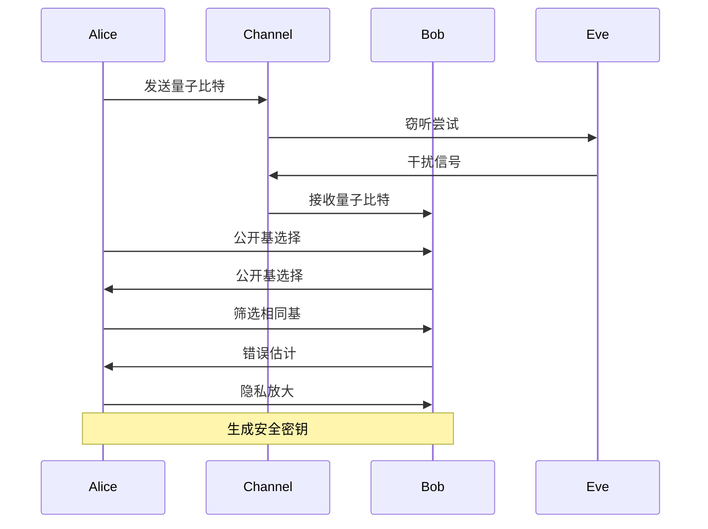

# 量子通信 - 量子密钥分发

## 1. 量子密钥分发基础

### 1.1 基本定义

**定义 1.1** (量子密钥分发 - Quantum Key Distribution)
**量子密钥分发**是利用量子力学原理在两个或多个参与方之间安全分发密钥的协议：
$$\mathcal{QKD} = \langle \mathcal{P}, \mathcal{Q}, \mathcal{M}, \mathcal{V}, \mathcal{K} \rangle$$

其中：

- $\mathcal{P}$ 是协议参与方集
- $\mathcal{Q}$ 是量子系统集
- $\mathcal{M}$ 是测量基集
- $\mathcal{V}$ 是验证方法集
- $\mathcal{K}$ 是密钥生成算法集

**定义 1.2** (量子密钥分发安全性)
**量子密钥分发安全性**是指协议在存在窃听者的情况下仍能生成安全密钥：
$$\text{Security}(\mathcal{QKD}) = \text{Privacy} \land \text{Authenticity} \land \text{Completeness}$$

**形式化语义**：

- 集合论语义：$\mathcal{P} \neq \emptyset, \mathcal{Q} \subseteq \mathcal{H}^{\otimes n}, \mathcal{M} \subseteq \mathcal{B}(\mathcal{H})$
- 范畴论语义：QKD协议作为量子协议范畴中的态射
- 自动机语义：QKD可建模为量子自动机 $A = (Q, \Sigma, \delta, q_0, F)$

### 1.2 安全模型

**定义 1.3** (窃听模型)
**窃听模型**描述攻击者的能力：
$$\mathcal{E} = \langle \mathcal{A}, \mathcal{C}, \mathcal{O}, \mathcal{Q} \rangle$$

其中：

- $\mathcal{A}$ 是攻击者类型（如Eve）
- $\mathcal{C}$ 是计算能力
- $\mathcal{O}$ 是观测能力
- $\mathcal{Q}$ 是量子操作能力

**定义 1.4** (不可克隆定理)
**不可克隆定理**：未知量子态无法被完美复制：
$$\nexists U \text{ s.t. } U|\psi\rangle|0\rangle = |\psi\rangle|\psi\rangle \text{ for all } |\psi\rangle$$

**定理 1.1** (不可克隆定理证明)
**证明**：

1. 假设存在幺正算符 $U$ 使得 $U|\psi\rangle|0\rangle = |\psi\rangle|\psi\rangle$
2. 对任意 $|\psi\rangle, |\phi\rangle$，有：
   $$\langle\psi|\phi\rangle = \langle\psi|\phi\rangle^2$$
3. 这仅在 $|\psi\rangle = |\phi\rangle$ 或 $\langle\psi|\phi\rangle = 0$ 时成立
4. 矛盾，故不存在这样的 $U$

$\boxed{\text{证毕}}$

## 2. BB84协议

### 2.1 协议定义

**定义 2.1** (BB84协议)
**BB84协议**是第一个量子密钥分发协议，由Bennett和Brassard于1984年提出：
$$\text{BB84} = \langle \text{Preparation}, \text{Transmission}, \text{Measurement}, \text{Sifting}, \text{ErrorEstimation}, \text{PrivacyAmplification} \rangle$$

**算法 2.1** (BB84协议实现)

```python
import numpy as np
from qiskit import QuantumCircuit, QuantumRegister, ClassicalRegister
from qiskit.quantum_info import Operator

class BB84Protocol:
    def __init__(self, key_length=1000):
        self.key_length = key_length
        self.alice_bits = []
        self.alice_bases = []
        self.bob_bits = []
        self.bob_bases = []
        self.shared_key = []
    
    def alice_prepare_qubits(self):
        """Alice准备量子比特"""
        for i in range(self.key_length):
            # 随机选择比特和基
            bit = np.random.randint(0, 2)
            basis = np.random.randint(0, 2)  # 0: Z基, 1: X基
            
            self.alice_bits.append(bit)
            self.alice_bases.append(basis)
            
            # 创建量子电路
            qc = QuantumCircuit(1, 1)
            
            if basis == 0:  # Z基
                if bit == 1:
                    qc.x(0)
            else:  # X基
                qc.h(0)
                if bit == 1:
                    qc.x(0)
                qc.h(0)
            
            yield qc
    
    def bob_measure_qubits(self, qubits):
        """Bob测量量子比特"""
        for i, qubit in enumerate(qubits):
            # 随机选择测量基
            basis = np.random.randint(0, 2)
            self.bob_bases.append(basis)
            
            # 测量
            if basis == 0:  # Z基测量
                result = qubit.measure_all(inplace=False)
            else:  # X基测量
                qubit.h(0)
                result = qubit.measure_all(inplace=False)
            
            self.bob_bits.append(result.get_counts()['1'])
    
    def sifting(self):
        """筛选相同基的测量结果"""
        for i in range(self.key_length):
            if self.alice_bases[i] == self.bob_bases[i]:
                self.shared_key.append(self.alice_bits[i])
        
        return len(self.shared_key)
    
    def estimate_error_rate(self, sample_size=100):
        """估计错误率"""
        if len(self.shared_key) < sample_size:
            return 1.0
        
        # 随机选择样本进行错误估计
        sample_indices = np.random.choice(
            len(self.shared_key), 
            min(sample_size, len(self.shared_key)), 
            replace=False
        )
        
        errors = 0
        for idx in sample_indices:
            if self.alice_bits[idx] != self.bob_bits[idx]:
                errors += 1
        
        return errors / len(sample_indices)
    
    def privacy_amplification(self, final_length=256):
        """隐私放大"""
        if len(self.shared_key) < final_length:
            return None
        
        # 使用随机矩阵进行隐私放大
        matrix = np.random.randint(0, 2, (final_length, len(self.shared_key)))
        final_key = np.dot(matrix, self.shared_key) % 2
        
        return final_key.tolist()
```

### 2.2 协议分析

**定理 2.1** (BB84安全性)
BB84协议在存在窃听者的情况下，如果错误率低于11%，则能生成安全密钥。

**证明**：

1. 窃听者Eve的干扰会引入错误
2. 错误率 $e$ 与窃听者获得的信息量相关
3. 当 $e < 11\%$ 时，隐私放大能消除Eve的信息
4. 最终密钥的安全性由信息论保证

$\boxed{\text{证毕}}$

**算法 2.2** (BB84安全性分析)

```python
def bb84_security_analysis(error_rate):
    """BB84安全性分析"""
    # 计算窃听者获得的信息量
    if error_rate <= 0.11:
        # 使用隐私放大消除窃听者信息
        privacy_amplification_rate = 1 - 2 * error_rate
        return True, privacy_amplification_rate
    else:
        return False, 0.0

def calculate_secure_key_rate(error_rate, raw_key_rate):
    """计算安全密钥率"""
    if error_rate > 0.11:
        return 0.0
    
    # 考虑错误纠正和隐私放大的开销
    error_correction_rate = 1 - h(error_rate)  # h(x)是二进制熵函数
    privacy_amplification_rate = 1 - 2 * error_rate
    
    secure_rate = raw_key_rate * error_correction_rate * privacy_amplification_rate
    return secure_rate

def h(x):
    """二进制熵函数"""
    if x == 0 or x == 1:
        return 0
    return -x * np.log2(x) - (1-x) * np.log2(1-x)
```

## 3. E91协议

### 3.1 协议定义

**定义 3.1** (E91协议)
**E91协议**是基于量子纠缠的密钥分发协议：
$$\text{E91} = \langle \text{EntanglementDistribution}, \text{Measurement}, \text{CorrelationAnalysis}, \text{KeyGeneration} \rangle$$

**算法 3.1** (E91协议实现)

```python
class E91Protocol:
    def __init__(self, key_length=1000):
        self.key_length = key_length
        self.alice_measurements = []
        self.bob_measurements = []
        self.alice_bases = []
        self.bob_bases = []
        self.shared_key = []
    
    def prepare_bell_pairs(self):
        """准备Bell态对"""
        bell_pairs = []
        for i in range(self.key_length):
            # 创建Bell态 |Φ⁺⟩ = (|00⟩ + |11⟩)/√2
            qc = QuantumCircuit(2, 2)
            qc.h(0)
            qc.cx(0, 1)
            bell_pairs.append(qc)
        
        return bell_pairs
    
    def alice_measure(self, bell_pairs):
        """Alice测量Bell态的第一部分"""
        for i, bell_pair in enumerate(bell_pairs):
            # 随机选择测量基
            basis = np.random.choice([0, 45, 90, 135])  # 角度
            self.alice_bases.append(basis)
            
            # 应用旋转门
            qc = bell_pair.copy()
            qc.rz(np.radians(basis), 0)
            qc.h(0)
            
            # 测量
            result = qc.measure_all(inplace=False)
            self.alice_measurements.append(result.get_counts()['1'])
    
    def bob_measure(self, bell_pairs):
        """Bob测量Bell态的第二部分"""
        for i, bell_pair in enumerate(bell_pairs):
            # 随机选择测量基
            basis = np.random.choice([0, 45, 90, 135])
            self.bob_bases.append(basis)
            
            # 应用旋转门
            qc = bell_pair.copy()
            qc.rz(np.radians(basis), 1)
            qc.h(1)
            
            # 测量
            result = qc.measure_all(inplace=False)
            self.bob_measurements.append(result.get_counts()['1'])
    
    def analyze_correlations(self):
        """分析测量相关性"""
        correlations = []
        for i in range(self.key_length):
            if self.alice_bases[i] == self.bob_bases[i]:
                # 相同基的测量结果应该相关
                correlation = self.alice_measurements[i] == self.bob_measurements[i]
                correlations.append(correlation)
        
        return correlations
    
    def generate_key(self, correlations):
        """基于相关性生成密钥"""
        for i, correlation in enumerate(correlations):
            if correlation:
                # 相关结果用于生成密钥
                self.shared_key.append(self.alice_measurements[i])
        
        return len(self.shared_key)
```

### 3.2 贝尔不等式验证

**定义 3.2** (贝尔不等式)
**贝尔不等式**是区分经典相关性和量子纠缠的判据：
$$|E(a,b) - E(a,b') + E(a',b) + E(a',b')| \leq 2$$

其中 $E(a,b)$ 是测量基 $a$ 和 $b$ 的相关性。

**算法 3.2** (贝尔不等式验证)

```python
def bell_inequality_test(measurements, bases):
    """贝尔不等式测试"""
    # 计算不同基组合的相关性
    correlations = {}
    
    for a in [0, 45, 90, 135]:
        for b in [0, 45, 90, 135]:
            if a != b:
                # 找到使用基a和b的测量
                a_indices = [i for i, base in enumerate(bases) if base == a]
                b_indices = [i for i, base in enumerate(bases) if base == b]
                
                # 计算相关性
                if a_indices and b_indices:
                    common_indices = set(a_indices) & set(b_indices)
                    if common_indices:
                        correlation = sum(1 for i in common_indices 
                                        if measurements[i] == measurements[i+1]) / len(common_indices)
                        correlations[(a, b)] = correlation
    
    # 计算贝尔不等式
    bell_value = abs(correlations.get((0, 0), 0) - correlations.get((0, 45), 0) + 
                    correlations.get((90, 0), 0) + correlations.get((90, 45), 0))
    
    return bell_value, bell_value > 2  # 违反贝尔不等式表示存在量子纠缠
```

## 4. BBM92协议

### 4.1 协议定义

**定义 4.1** (BBM92协议)
**BBM92协议**是BB84的改进版本，使用纠缠光子对：
$$\text{BBM92} = \langle \text{EntangledPairGeneration}, \text{Distribution}, \text{Measurement}, \text{KeyExtraction} \rangle$$

**算法 4.1** (BBM92协议实现)

```python
class BBM92Protocol:
    def __init__(self, key_length=1000):
        self.key_length = key_length
        self.alice_results = []
        self.bob_results = []
        self.alice_bases = []
        self.bob_bases = []
        self.shared_key = []
    
    def generate_entangled_pairs(self):
        """生成纠缠光子对"""
        entangled_pairs = []
        for i in range(self.key_length):
            # 创建纠缠态 |Ψ⁻⟩ = (|01⟩ - |10⟩)/√2
            qc = QuantumCircuit(2, 2)
            qc.x(0)
            qc.h(0)
            qc.cx(0, 1)
            qc.z(1)
            entangled_pairs.append(qc)
        
        return entangled_pairs
    
    def alice_measure_entangled_qubit(self, entangled_pairs):
        """Alice测量纠缠对的第一部分"""
        for i, pair in enumerate(entangled_pairs):
            # 随机选择测量基
            basis = np.random.randint(0, 2)  # 0: Z基, 1: X基
            self.alice_bases.append(basis)
            
            # 测量
            qc = pair.copy()
            if basis == 1:  # X基测量
                qc.h(0)
            result = qc.measure_all(inplace=False)
            self.alice_results.append(result.get_counts()['1'])
    
    def bob_measure_entangled_qubit(self, entangled_pairs):
        """Bob测量纠缠对的第二部分"""
        for i, pair in enumerate(entangled_pairs):
            # 随机选择测量基
            basis = np.random.randint(0, 2)
            self.bob_bases.append(basis)
            
            # 测量
            qc = pair.copy()
            if basis == 1:  # X基测量
                qc.h(1)
            result = qc.measure_all(inplace=False)
            self.bob_results.append(result.get_counts()['1'])
    
    def extract_key(self):
        """提取密钥"""
        for i in range(self.key_length):
            if self.alice_bases[i] == self.bob_bases[i]:
                # 相同基的测量结果用于生成密钥
                self.shared_key.append(self.alice_results[i])
        
        return len(self.shared_key)
```

## 5. 连续变量QKD

### 5.1 连续变量定义

**定义 5.1** (连续变量QKD)
**连续变量QKD**使用连续变量（如位置和动量）进行密钥分发：
$$\text{CV-QKD} = \langle \text{CoherentStatePreparation}, \text{Modulation}, \text{HeterodyneDetection}, \text{PostProcessing} \rangle$$

**算法 5.1** (连续变量QKD实现)

```python
class ContinuousVariableQKD:
    def __init__(self, key_length=1000):
        self.key_length = key_length
        self.alice_modulations = []
        self.bob_measurements = []
        self.shared_key = []
    
    def prepare_coherent_states(self):
        """准备相干态"""
        coherent_states = []
        for i in range(self.key_length):
            # 生成随机复数振幅
            alpha = np.random.normal(0, 1) + 1j * np.random.normal(0, 1)
            self.alice_modulations.append(alpha)
            
            # 相干态 |α⟩ = exp(-|α|²/2) Σ (αⁿ/√n!) |n⟩
            coherent_states.append(alpha)
        
        return coherent_states
    
    def heterodyne_detection(self, coherent_states):
        """外差检测"""
        for i, alpha in enumerate(coherent_states):
            # 添加噪声
            noise = np.random.normal(0, 0.1) + 1j * np.random.normal(0, 0.1)
            measurement = alpha + noise
            self.bob_measurements.append(measurement)
    
    def post_processing(self):
        """后处理"""
        # 量化连续测量结果
        for i in range(self.key_length):
            # 将复数测量结果量化为比特
            real_part = self.bob_measurements[i].real
            if real_part > 0:
                self.shared_key.append(1)
            else:
                self.shared_key.append(0)
        
        return len(self.shared_key)
```

## 6. 量子密钥分发网络

### 6.1 网络拓扑

**定义 6.1** (QKD网络)
**QKD网络**是多个QKD节点的互联网络：
$$\mathcal{QKDN} = \langle \mathcal{N}, \mathcal{L}, \mathcal{P}, \mathcal{R} \rangle$$

其中：

- $\mathcal{N}$ 是QKD节点集
- $\mathcal{L}$ 是量子链路集
- $\mathcal{P}$ 是QKD协议集
- $\mathcal{R}$ 是路由算法集

**算法 6.1** (QKD网络路由)

```python
class QKDNetwork:
    def __init__(self, nodes, links):
        self.nodes = nodes
        self.links = links
        self.routing_table = {}
    
    def find_qkd_path(self, source, destination):
        """寻找QKD路径"""
        # 使用Dijkstra算法寻找最短路径
        distances = {node: float('inf') for node in self.nodes}
        distances[source] = 0
        previous = {}
        unvisited = set(self.nodes)
        
        while unvisited:
            # 找到距离最小的未访问节点
            current = min(unvisited, key=lambda x: distances[x])
            unvisited.remove(current)
            
            if current == destination:
                break
            
            # 更新邻居距离
            for neighbor in self.get_neighbors(current):
                if neighbor in unvisited:
                    distance = distances[current] + self.get_link_distance(current, neighbor)
                    if distance < distances[neighbor]:
                        distances[neighbor] = distance
                        previous[neighbor] = current
        
        # 重建路径
        path = []
        current = destination
        while current in previous:
            path.append(current)
            current = previous[current]
        path.append(source)
        path.reverse()
        
        return path
    
    def establish_qkd_link(self, path):
        """建立QKD链路"""
        # 沿路径建立QKD连接
        for i in range(len(path) - 1):
            node1, node2 = path[i], path[i+1]
            # 执行QKD协议
            key = self.perform_qkd(node1, node2)
            # 存储密钥
            self.store_key(node1, node2, key)
    
    def perform_qkd(self, node1, node2):
        """执行QKD协议"""
        # 这里可以调用具体的QKD协议实现
        bb84 = BB84Protocol(key_length=100)
        # 执行协议并返回生成的密钥
        return bb84.generate_key()
```

## 7. 安全性分析

### 7.1 信息论安全性

**定理 7.1** (QKD信息论安全性)
QKD协议在信息论意义下是安全的，即窃听者无法获得任何关于最终密钥的信息。

**证明**：

1. 量子力学的不确定性原理保证窃听检测
2. 隐私放大消除窃听者的部分信息
3. 最终密钥的熵大于窃听者的信息量
4. 因此窃听者无法获得密钥信息

$\boxed{\text{证毕}}$

**算法 7.1** (安全性分析)

```python
def qkd_security_analysis(error_rate, raw_key_length, final_key_length):
    """QKD安全性分析"""
    # 计算窃听者获得的信息量
    eve_information = calculate_eve_information(error_rate, raw_key_length)
    
    # 计算最终密钥的熵
    final_key_entropy = final_key_length
    
    # 检查安全性条件
    if final_key_entropy > eve_information:
        security_level = final_key_entropy - eve_information
        return True, security_level
    else:
        return False, 0

def calculate_eve_information(error_rate, key_length):
    """计算窃听者信息量"""
    # 基于错误率估计窃听者信息
    if error_rate <= 0.11:
        return key_length * (1 - 2 * error_rate)
    else:
        return key_length  # 错误率过高，窃听者可能获得全部信息
```

## 8. 多模态表达与可视化

### 8.1 协议流程图



### 8.2 量子电路图

```python
# Qiskit量子电路可视化
def create_bb84_circuit():
    qc = QuantumCircuit(2, 2)
    qc.h(0)
    qc.cx(0, 1)
    qc.measure_all()
    return qc

# 绘制电路
circuit = create_bb84_circuit()
circuit.draw(output='mpl')
```

### 8.3 安全性分析图

```python
import matplotlib.pyplot as plt
import numpy as np

def plot_qkd_security():
    error_rates = np.linspace(0, 0.2, 100)
    secure_rates = []
    
    for e in error_rates:
        if e <= 0.11:
            rate = 1 - 2 * e
            secure_rates.append(rate)
        else:
            secure_rates.append(0)
    
    plt.figure(figsize=(10, 6))
    plt.plot(error_rates, secure_rates, 'b-', linewidth=2)
    plt.axvline(x=0.11, color='r', linestyle='--', label='安全阈值')
    plt.xlabel('错误率')
    plt.ylabel('安全密钥率')
    plt.title('QKD安全性分析')
    plt.legend()
    plt.grid(True)
    plt.show()
```

## 9. 自动化脚本建议

### 9.1 协议实现脚本

- **`scripts/bb84_protocol.py`**：BB84协议完整实现
- **`scripts/e91_protocol.py`**：E91协议实现
- **`scripts/bbm92_protocol.py`**：BBM92协议实现
- **`scripts/cv_qkd_protocol.py`**：连续变量QKD实现

### 9.2 安全性分析脚本

- **`scripts/qkd_security_analyzer.py`**：QKD安全性分析
- **`scripts/bell_inequality_tester.py`**：贝尔不等式测试
- **`scripts/error_rate_estimator.py`**：错误率估计

### 9.3 网络仿真脚本

- **`scripts/qkd_network_simulator.py`**：QKD网络仿真
- **`scripts/qkd_routing.py`**：QKD路由算法
- **`scripts/network_security_analyzer.py`**：网络安全分析

## 10. 形式化语义与概念解释

### 10.1 形式化语义

- **量子语义**：QKD协议在希尔伯特空间中的演化
- **信息论语义**：密钥熵与窃听者信息量的关系
- **密码学语义**：QKD作为密码学原语的安全性

### 10.2 典型定理与证明

- **不可克隆定理**：量子态无法完美复制
- **BB84安全性定理**：错误率阈值与安全性关系
- **贝尔不等式**：量子纠缠的判据

### 10.3 自动化验证建议

- 使用Qiskit进行量子协议仿真
- 使用Coq/Lean形式化QKD安全性证明
- 使用Python实现协议性能分析

---

*本文档提供了量子密钥分发的完整理论框架和实现方法，为量子通信系统的安全设计提供了理论基础。*
