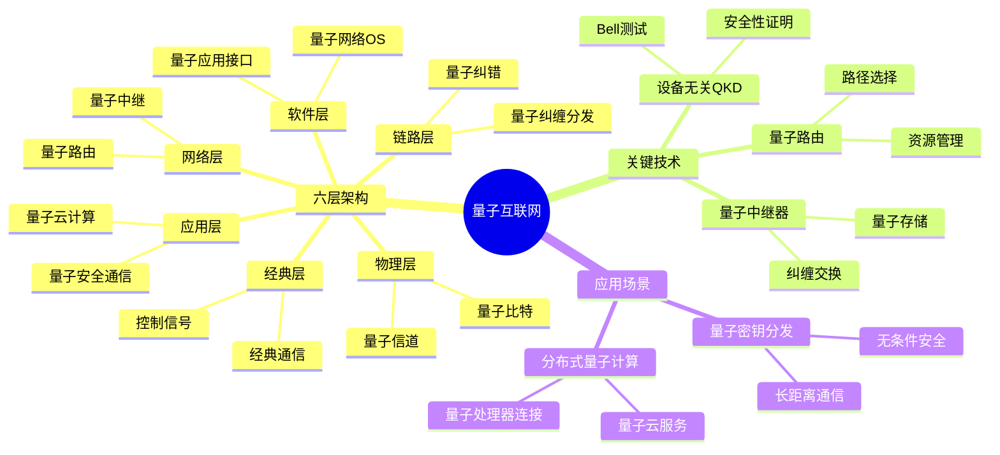
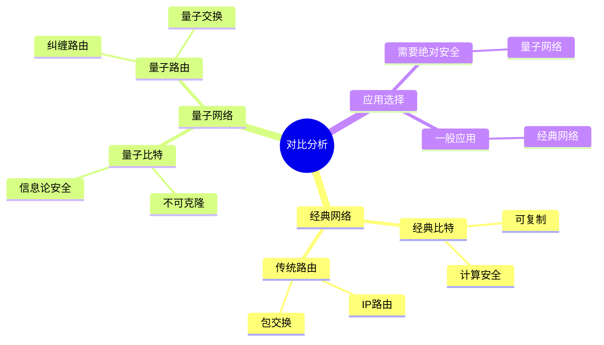
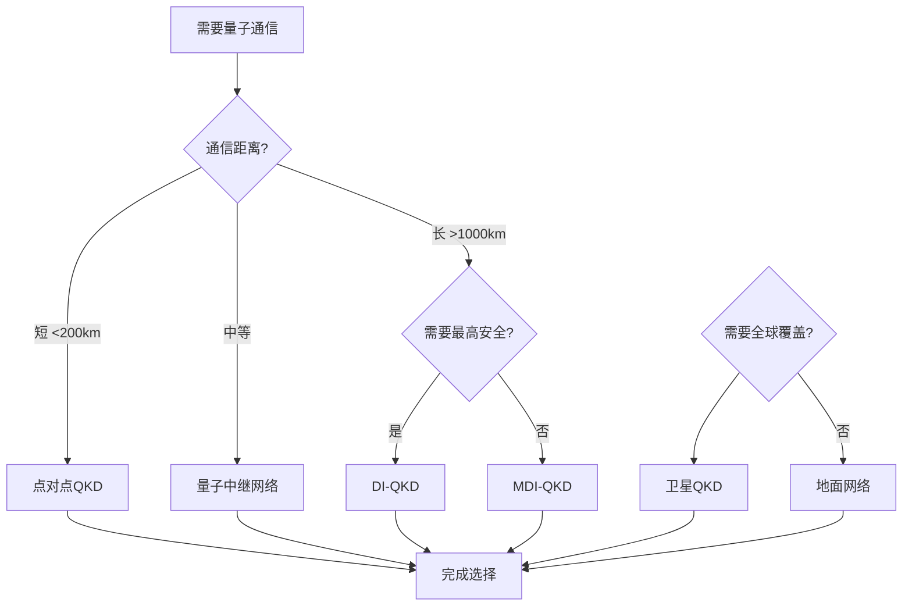
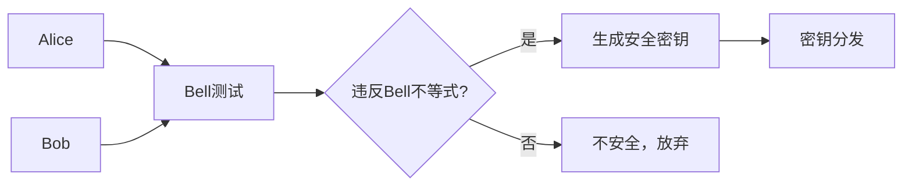
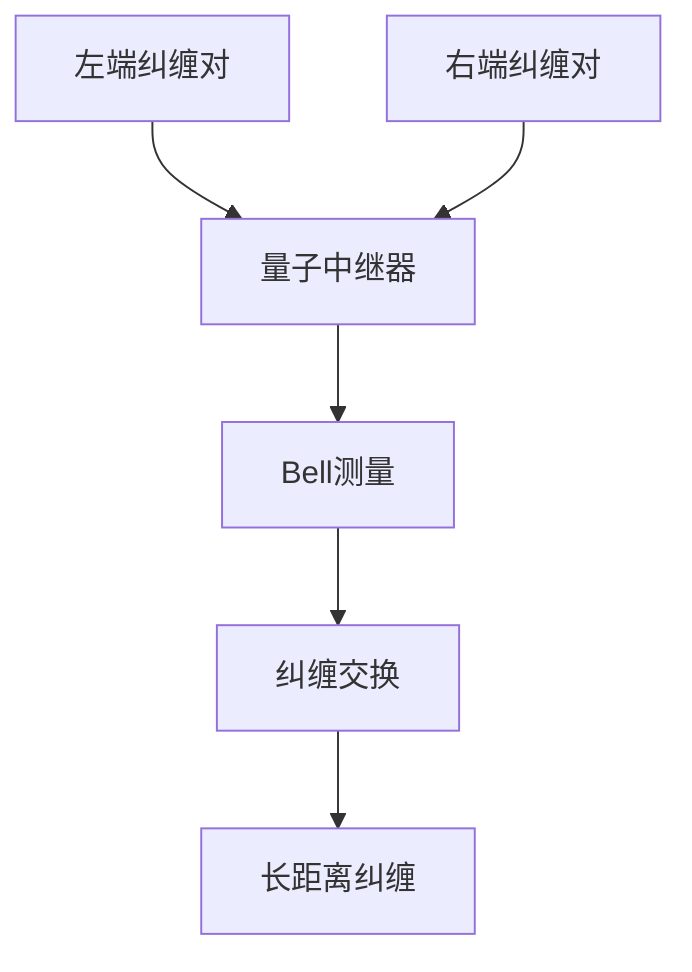
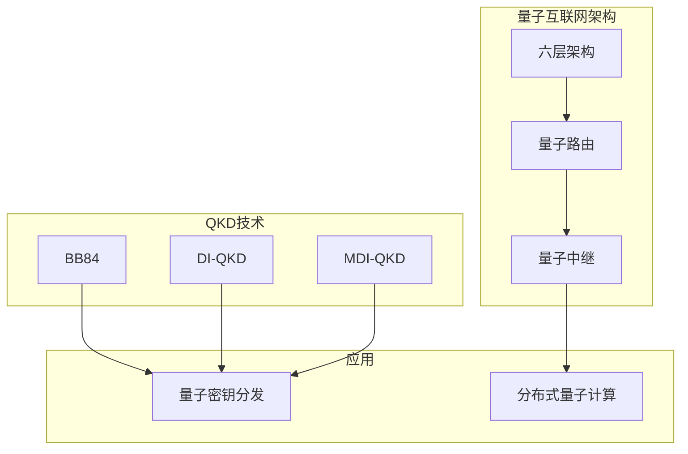
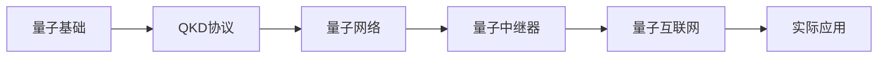

# 量子互联网专题思维表征工具 / Quantum Internet Special Topic Mental Representation Tools 2024-2025

## 📚 **概述 / Overview**

本文档为量子互联网与大规模网络专题提供完整的思维表征工具集合，包括思维导图、对比矩阵、决策树、数据流图等多种表征方式。

**创建时间**: 2025年1月
**状态**: ✅ 完成
**专题**: 量子互联网与大规模网络（2024-2025最新研究）
**相关文档**: [量子互联网与大规模网络专题-2024-2025.md](量子互联网与大规模网络专题-2024-2025.md)

---

## 🗺️ **一、思维导图 / Mind Maps**

### 1.1 量子互联网完整思维导图

### 1.2 量子网络 vs 经典网络思维导图

---

## 📊 **二、对比矩阵 / Comparison Matrices**

### 2.1 量子网络类型对比矩阵

| 网络类型 | 距离 | 密钥率 | 安全性 | 适用场景 |
|---------|------|--------|--------|---------|
| **点对点QKD** | <200km | 高 | 高 | 短距离通信 |
| **量子中继网络** | >1000km | 中等 | 高 | 长距离通信 |
| **卫星QKD** | 全球 | 低 | 高 | 洲际通信 |
| **量子互联网** | 全球 | 可变 | 最高 | 未来应用 |

### 2.2 QKD协议对比矩阵

| QKD协议 | 安全性 | 距离 | 密钥率 | 2024-2025创新 |
|---------|--------|------|--------|--------------|
| **BB84** | 高 | 中等 | 中等 | 经典协议 |
| **E91** | 高 | 中等 | 中等 | 基于纠缠 |
| **DI-QKD** | 最高 | 长 | 低 | 设备无关 |
| **MDI-QKD** | 高 | 长 | 中等 | 测量设备无关 |

### 2.3 量子中继器技术对比矩阵

| 技术 | 存储时间 | 纠缠成功率 | 复杂度 | 适用场景 |
|------|---------|-----------|--------|---------|
| **量子存储器** | 数小时 | 高 | 高 | 长距离中继 |
| **纠缠交换** | 瞬时 | 中等 | 中等 | 短距离中继 |
| **量子纠错** | N/A | 高 | 很高 | 错误纠正 |

---

## 🌳 **三、决策树 / Decision Trees**

### 3.1 量子网络方案选择决策树

---

## 🔄 **四、数据流图 / Data Flow Diagrams**

### 4.1 DI-QKD协议数据流

### 4.2 量子中继器数据流

---

## 🗺️ **五、概念地图 / Concept Maps**

### 5.1 量子互联网核心概念关系

---

## 📈 **六、学习路径 / Learning Paths**

### 6.1 量子互联网学习逻辑路径

---

**文档版本**: v1.0
**创建时间**: 2025年1月
**最后更新**: 2025年1月
**维护者**: GraphNetWorkCommunicate项目组
**状态**: ✅ 完成
