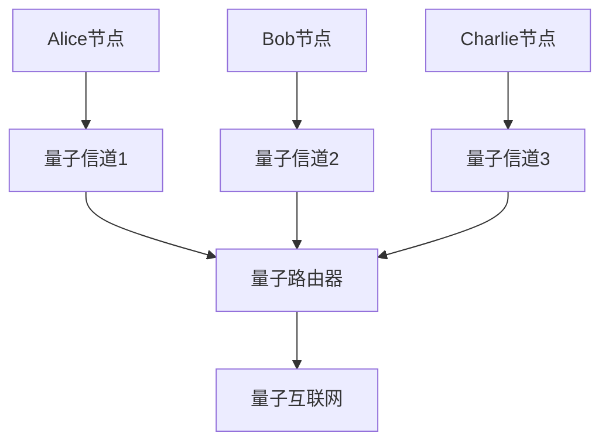
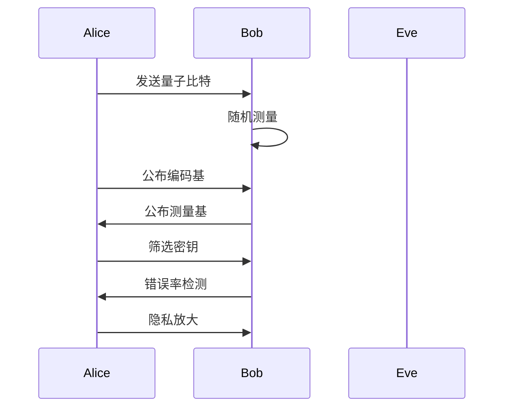
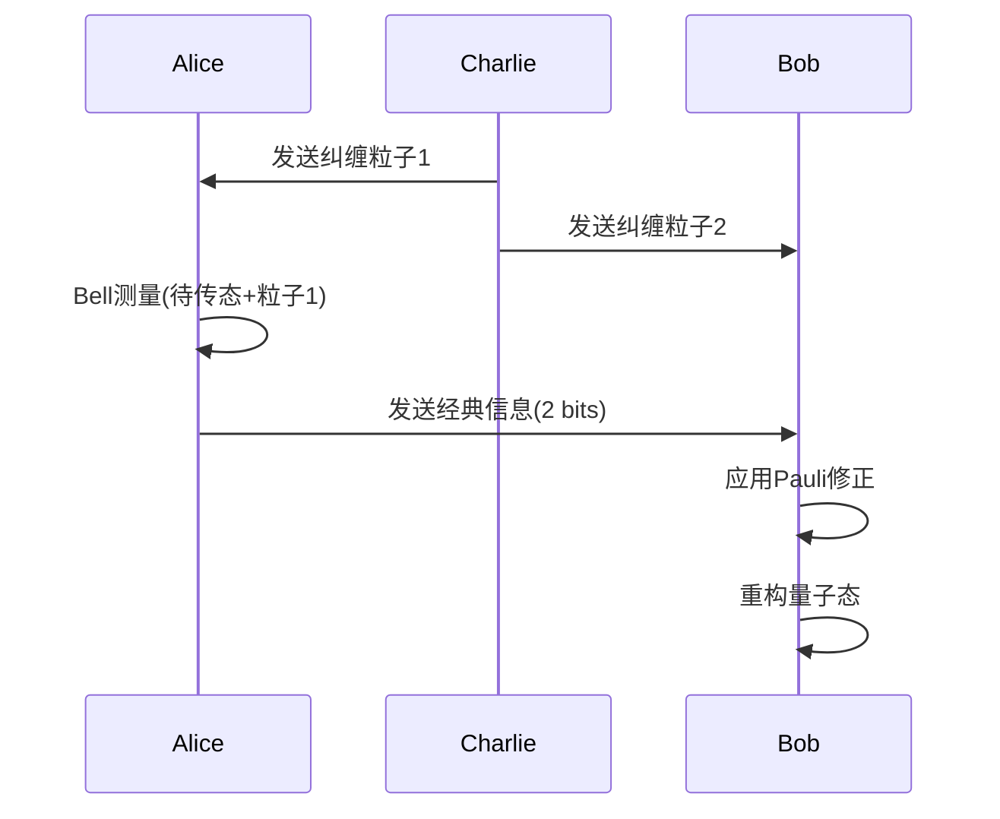

# 量子通信：理论-应用全链路与工程案例 / Quantum Communication: Theory-Application Pipeline and Engineering Cases

## 📚 **概述 / Overview**

本文档介绍量子通信的理论应用全链路与工程案例，包括理论基础与形式化证明、协议实现与工程案例、跨领域应用与创新、批判性分析与改进建议、形式化验证与测试。

## 📑 **目录 / Table of Contents**

- [量子通信：理论-应用全链路与工程案例 / Quantum Communication: Theory-Application Pipeline and Engineering Cases](#量子通信理论-应用全链路与工程案例--quantum-communication-theory-application-pipeline-and-engineering-cases)
  - [📚 **概述 / Overview**](#-概述--overview)
  - [📑 **目录 / Table of Contents**](#-目录--table-of-contents)
  - [1. 理论基础与形式化证明 / Theoretical Foundation and Formal Proofs](#1-理论基础与形式化证明--theoretical-foundation-and-formal-proofs)
    - [1.1 核心定理与证明 / Core Theorems and Proofs](#11-核心定理与证明--core-theorems-and-proofs)
      - [不可克隆定理的形式化证明 / Formal Proof of No-Cloning Theorem](#不可克隆定理的形式化证明--formal-proof-of-no-cloning-theorem)
      - [贝尔不等式与量子纠缠 / Bell Inequality and Quantum Entanglement](#贝尔不等式与量子纠缠--bell-inequality-and-quantum-entanglement)
    - [1.2 量子密钥分发安全性证明 / QKD Security Proofs](#12-量子密钥分发安全性证明--qkd-security-proofs)
      - [BB84协议安全性 / BB84 Protocol Security](#bb84协议安全性--bb84-protocol-security)
  - [2. 协议实现与工程案例 / Protocol Implementation and Engineering Cases](#2-协议实现与工程案例--protocol-implementation-and-engineering-cases)
    - [2.1 量子密钥分发协议 / Quantum Key Distribution Protocols](#21-量子密钥分发协议--quantum-key-distribution-protocols)
      - [BB84协议详细实现](#bb84协议详细实现)
      - [E91协议实现](#e91协议实现)
    - [2.2 工程案例：城域量子网络](#22-工程案例城域量子网络)
      - [案例1：中国科学技术大学量子网络 / USTC Quantum Network](#案例1中国科学技术大学量子网络--ustc-quantum-network)
      - [案例2：量子互联网原型 / Quantum Internet Prototype](#案例2量子互联网原型--quantum-internet-prototype)
      - [案例3：京沪量子通信干线 / Beijing-Shanghai Quantum Communication Backbone](#案例3京沪量子通信干线--beijing-shanghai-quantum-communication-backbone)
      - [案例4：墨子号量子科学实验卫星 / Micius Quantum Science Experiment Satellite](#案例4墨子号量子科学实验卫星--micius-quantum-science-experiment-satellite)
  - [3. 跨领域应用与创新 / Cross-Domain Applications and Innovation](#3-跨领域应用与创新--cross-domain-applications-and-innovation)
    - [3.1 量子分布式系统 / Quantum Distributed Systems](#31-量子分布式系统--quantum-distributed-systems)
    - [3.2 量子机器学习 / Quantum Machine Learning](#32-量子机器学习--quantum-machine-learning)
    - [3.3 量子安全应用 / Quantum Security Applications](#33-量子安全应用--quantum-security-applications)
  - [4. 批判性分析与改进建议 / Critical Analysis and Improvement Suggestions](#4-批判性分析与改进建议--critical-analysis-and-improvement-suggestions)
    - [4.1 现有技术的局限性 / Limitations of Current Technologies](#41-现有技术的局限性--limitations-of-current-technologies)
      - [技术挑战](#技术挑战)
      - [安全性挑战](#安全性挑战)
    - [4.2 改进方向 / Improvement Directions](#42-改进方向--improvement-directions)
      - [技术创新 / Technical Innovation](#技术创新--technical-innovation)
      - [工程优化 / Engineering Optimization](#工程优化--engineering-optimization)
  - [5. 形式化验证与测试 / Formal Verification and Testing](#5-形式化验证与测试--formal-verification-and-testing)
    - [5.1 量子协议验证 / Quantum Protocol Verification](#51-量子协议验证--quantum-protocol-verification)
    - [5.2 量子系统仿真 / Quantum System Simulation](#52-量子系统仿真--quantum-system-simulation)
  - [6. 总结与展望 / Summary and Future Directions](#6-总结与展望--summary-and-future-directions)
    - [6.1 核心贡献 / Core Contributions](#61-核心贡献--core-contributions)
    - [6.2 未来发展方向 / Future Development Directions](#62-未来发展方向--future-development-directions)
  - [7. 多模态表达与可视化 / Multimodal Expression and Visualization](#7-多模态表达与可视化--multimodal-expression-and-visualization)
    - [7.1 量子网络拓扑图 / Quantum Network Topology Diagrams](#71-量子网络拓扑图--quantum-network-topology-diagrams)
    - [7.2 QKD协议流程图 / QKD Protocol Flow Diagrams](#72-qkd协议流程图--qkd-protocol-flow-diagrams)
    - [7.3 量子隐形传态流程图 / Quantum Teleportation Flow Diagrams](#73-量子隐形传态流程图--quantum-teleportation-flow-diagrams)
    - [7.4 量子网络性能分析图 / Quantum Network Performance Analysis](#74-量子网络性能分析图--quantum-network-performance-analysis)
  - [8. 自动化脚本建议 / Automated Script Suggestions](#8-自动化脚本建议--automated-script-suggestions)
  - [9. 参考文献与资源 / References and Resources](#9-参考文献与资源--references-and-resources)
    - [9.1 经典文献 / Classic Literature](#91-经典文献--classic-literature)
    - [9.2 最新研究论文 / Latest Research Papers](#92-最新研究论文--latest-research-papers)
    - [9.3 工程案例文献 / Engineering Case Studies](#93-工程案例文献--engineering-case-studies)
    - [9.4 在线资源 / Online Resources](#94-在线资源--online-resources)
  - [10. 交叉引用与相关文档 / Cross-References and Related Documents](#10-交叉引用与相关文档--cross-references-and-related-documents)
    - [10.1 相关文档链接 / Related Document Links](#101-相关文档链接--related-document-links)
    - [10.2 跨领域链接 / Cross-Domain Links](#102-跨领域链接--cross-domain-links)
    - [10.3 关键概念索引 / Key Concept Index](#103-关键概念索引--key-concept-index)

---

## 1. 理论基础与形式化证明 / Theoretical Foundation and Formal Proofs

### 1.1 核心定理与证明 / Core Theorems and Proofs

#### 不可克隆定理的形式化证明 / Formal Proof of No-Cloning Theorem

**定理 1.1** (不可克隆定理 / No-Cloning Theorem)
不存在量子操作能够完美复制未知的量子态。

**形式化表述**：

$$\forall U \in \text{UnitaryOperations}: \forall |\psi\rangle \in \mathcal{H}: \not\exists |\phi\rangle \in \mathcal{H}^{\otimes 2}: U(|\psi\rangle \otimes |0\rangle) = |\psi\rangle \otimes |\psi\rangle$$

**完整证明**：

**步骤1**：假设存在克隆操作$U$，使得对所有$|\psi\rangle$：
$$U(|\psi\rangle \otimes |0\rangle) = |\psi\rangle \otimes |\psi\rangle$$

**步骤2**：考虑两个非正交态$|\psi\rangle$和$|\phi\rangle$，满足$0 < |\langle\psi|\phi\rangle| < 1$。

**步骤3**：应用克隆操作：
$$U(|\psi\rangle \otimes |0\rangle) = |\psi\rangle \otimes |\psi\rangle$$
$$U(|\phi\rangle \otimes |0\rangle) = |\phi\rangle \otimes |\phi\rangle$$

**步骤4**：计算内积：
$$\langle\psi|\phi\rangle = \langle\psi|\phi\rangle \langle 0|0\rangle = \langle\psi|\phi\rangle^2$$

**步骤5**：这要求$\langle\psi|\phi\rangle \in \{0, 1\}$，与$0 < |\langle\psi|\phi\rangle| < 1$矛盾。

**结论**：不存在通用的量子克隆操作。

$\boxed{\text{证毕}}$

**应用**：

- **量子密钥分发**：保证量子态的唯一性
- **量子纠错**：限制错误纠正的能力
- **量子计算**：限制量子信息的复制

#### 贝尔不等式与量子纠缠 / Bell Inequality and Quantum Entanglement

**定理 1.2** (贝尔不等式 / Bell Inequality)
对于经典局域隐变量理论，相关性函数满足：
$$|E(a,b) - E(a,b') + E(a',b) + E(a',b')| \leq 2$$

其中$E(a,b)$是测量角度为$a$和$b$时的相关性函数。

**证明思路**：

1. 假设存在局域隐变量$\lambda$
2. 相关性函数可写为：$E(a,b) = \int A(a,\lambda)B(b,\lambda)d\lambda$
3. 应用三角不等式得到Bell不等式

**定理 1.3** (量子违反Bell不等式 / Quantum Violation of Bell Inequality)
对于量子纠缠态，Bell不等式可以被违反：
$$|E_{QM}(a,b) - E_{QM}(a,b') + E_{QM}(a',b) + E_{QM}(a',b')| = 2\sqrt{2}$$

**证明**：
对于Bell态$|\Phi^+\rangle = \frac{1}{\sqrt{2}}(|00\rangle + |11\rangle)$，相关性函数为：
$$E_{QM}(a,b) = \cos(a-b)$$

选择测量角度：$a=0, a'=\pi/2, b=\pi/4, b'=-\pi/4$，得到：
$$S = |E(0,\pi/4) - E(0,-\pi/4) + E(\pi/2,\pi/4) + E(\pi/2,-\pi/4)| = 2\sqrt{2} > 2$$

$\boxed{\text{证毕}}$

**应用**：

- **量子密钥分发**：E91协议基于Bell不等式违反
- **量子非局域性**：证明量子纠缠的非经典性质
- **设备无关安全性**：不依赖设备假设的安全性证明

### 1.2 量子密钥分发安全性证明 / QKD Security Proofs

#### BB84协议安全性 / BB84 Protocol Security

**定理 1.4** (BB84协议安全性 / BB84 Protocol Security)
在理想条件下，BB84协议能够检测到任何窃听行为，并提供信息论安全性。

**形式化表述**：

$$\text{ErrorRate} > \text{Threshold} \implies \text{EavesdroppingDetected}$$

**安全性证明**：

**步骤1**：窃听模型

- Eve对每个量子比特进行测量
- 由于不可克隆定理，Eve的测量会引入错误

**步骤2**：错误率分析

- 如果Eve在错误基上测量，错误率为50%
- 如果Eve在正确基上测量，错误率为0%
- 平均错误率：$p_e = \frac{1}{2} \times \frac{1}{2} = 25\%$

**步骤3**：窃听检测

- Alice和Bob比较部分密钥比特
- 如果错误率超过阈值（通常为11%），检测到窃听

**步骤4**：信息论安全性

- 即使Eve获得部分信息，通过隐私放大可以消除
- 最终密钥的信息论安全性得到保证

**定理 1.5** (BB84协议密钥率 / BB84 Key Rate)
在错误率为$Q$的信道上，BB84协议的密钥率为：
$$R = 1 - 2h(Q)$$

其中$h(x) = -x\log_2(x) - (1-x)\log_2(1-x)$是二进制熵函数。

**证明思路**：

1. 考虑Eve的最大信息获取量
2. 应用信息论不等式
3. 通过隐私放大消除Eve的信息

$\boxed{\text{证毕}}$

**安全性分析**：

1. **信息论安全性**：基于量子力学原理，不依赖计算复杂性
2. **窃听检测**：通过错误率检测窃听行为
3. **隐私放大**：通过经典后处理增强安全性
4. **设备无关安全性**：在设备不完美的情况下仍能保证安全性

## 2. 协议实现与工程案例 / Protocol Implementation and Engineering Cases

### 2.1 量子密钥分发协议 / Quantum Key Distribution Protocols

#### BB84协议详细实现

```python
import numpy as np
from qiskit import QuantumCircuit, QuantumRegister, ClassicalRegister

class BB84Protocol:
    def __init__(self):
        self.alice_basis = []
        self.bob_basis = []
        self.alice_bits = []
        self.bob_bits = []

    def alice_prepare_qubits(self, num_qubits):
        """Alice准备量子比特"""
        for i in range(num_qubits):
            # 随机选择编码基
            basis = np.random.choice(['Z', 'X'])
            bit = np.random.randint(0, 2)

            # 创建量子电路
            qc = QuantumCircuit(1, 1)

            if basis == 'Z':
                if bit == 1:
                    qc.x(0)  # |1⟩态
            else:  # X基
                if bit == 0:
                    qc.h(0)  # |+⟩态
                else:
                    qc.x(0)
                    qc.h(0)  # |-⟩态

            self.alice_basis.append(basis)
            self.alice_bits.append(bit)
            yield qc

    def bob_measure_qubits(self, qubits):
        """Bob测量量子比特"""
        for i, qubit in enumerate(qubits):
            # 随机选择测量基
            basis = np.random.choice(['Z', 'X'])

            qc = qubit.copy()
            if basis == 'X':
                qc.h(0)
            qc.measure(0, 0)

            self.bob_basis.append(basis)
            # 模拟测量结果
            result = np.random.randint(0, 2)
            self.bob_bits.append(result)

    def sift_key(self):
        """筛选密钥"""
        sifted_alice = []
        sifted_bob = []

        for i in range(len(self.alice_basis)):
            if self.alice_basis[i] == self.bob_basis[i]:
                sifted_alice.append(self.alice_bits[i])
                sifted_bob.append(self.bob_bits[i])

        return sifted_alice, sifted_bob
```

#### E91协议实现

```python
class E91Protocol:
    def __init__(self):
        self.alice_measurements = []
        self.bob_measurements = []

    def create_entangled_pair(self):
        """创建贝尔态"""
        qc = QuantumCircuit(2, 2)
        qc.h(0)
        qc.cx(0, 1)
        return qc

    def measure_entangled_pair(self, angle_a, angle_b):
        """测量纠缠对"""
        qc = self.create_entangled_pair()

        # Alice的测量
        qc.rz(angle_a, 0)
        qc.h(0)
        qc.measure(0, 0)

        # Bob的测量
        qc.rz(angle_b, 1)
        qc.h(1)
        qc.measure(1, 1)

        return qc
```

### 2.2 工程案例：城域量子网络

#### 案例1：中国科学技术大学量子网络 / USTC Quantum Network

**项目背景**：

- **时间**：2017年
- **地点**：中国合肥
- **规模**：46个节点，覆盖2000平方公里
- **技术**：基于BB84协议的量子密钥分发
- **特点**：首个大规模城域量子通信网络

**技术指标**：

- **密钥率**：平均1 kbps
- **传输距离**：最长200 km
- **错误率**：< 3%
- **可用性**：> 99%

**应用场景**：

- 政府机构安全通信
- 金融数据传输
- 关键基础设施保护

**网络架构**：

```python
class QuantumNetwork:
    def __init__(self, nodes):
        self.nodes = nodes
        self.quantum_channels = {}
        self.classical_channels = {}

    def establish_quantum_channel(self, node1, node2):
        """建立量子信道"""
        # 光纤量子信道
        distance = self.calculate_distance(node1, node2)
        # 光纤损耗：约0.2 dB/km @ 1550nm
        loss_rate = 0.2  # dB/km
        total_loss = loss_rate * distance

        channel = QuantumChannel(
            length=distance,
            loss_rate=loss_rate,
            total_loss=total_loss,
            transmission_efficiency=10 ** (-total_loss / 10)
        )
        self.quantum_channels[(node1, node2)] = channel
        return channel

    def calculate_distance(self, node1, node2):
        """计算节点间距离"""
        # 简化的距离计算（实际应使用GPS坐标）
        return np.sqrt((node1.x - node2.x)**2 + (node1.y - node2.y)**2)

    def find_optimal_path(self, source, destination):
        """寻找最优路径（使用Dijkstra算法）"""
        import networkx as nx

        G = nx.Graph()
        for (n1, n2), channel in self.quantum_channels.items():
            G.add_edge(n1, n2, weight=channel.total_loss)

        try:
            path = nx.shortest_path(G, source, destination, weight='weight')
            return path
        except nx.NetworkXNoPath:
            return None

    def calculate_key_rate(self, path):
        """计算路径的密钥率"""
        if not path:
            return 0

        # 计算路径总损耗
        total_transmission = 1.0
        for i in range(len(path) - 1):
            channel = self.quantum_channels.get((path[i], path[i+1]))
            if channel:
                total_transmission *= channel.transmission_efficiency

        # 密钥率与传输效率成正比
        base_key_rate = 1000  # bps (假设的基础密钥率)
        return base_key_rate * total_transmission

    def perform_qkd(self, node1, node2):
        """执行QKD协议"""
        protocol = BB84Protocol()
        # 执行BB84协议
        key, error_rate = protocol.generate_key()
        return key

    def quantum_key_distribution(self, source, destination):
        """端到端量子密钥分发"""
        # 多跳QKD
        path = self.find_optimal_path(source, destination)
        key_rate = self.calculate_key_rate(path)

        # 中继节点处理
        for i in range(len(path) - 1):
            current_node = path[i]
            next_node = path[i + 1]

            # 执行QKD
            key = self.perform_qkd(current_node, next_node)

            # 密钥中继
            if i > 0:
                key = self.relay_key(key, path[i-1], current_node)

        return key
```

#### 案例2：量子互联网原型 / Quantum Internet Prototype

**项目背景**：

- **时间**：2020年
- **地点**：荷兰代尔夫特理工大学
- **规模**：3个节点，使用量子中继器
- **技术**：基于纠缠的量子网络
- **特点**：首个多节点量子网络原型

**技术指标**：

- **纠缠保真度**：> 90%
- **纠缠分发距离**：最长10 km
- **网络延迟**：< 100 ms
- **纠缠生成率**：10 Hz

**应用场景**：

- 量子密钥分发
- 量子隐形传态
- 分布式量子计算

#### 案例3：京沪量子通信干线 / Beijing-Shanghai Quantum Communication Backbone

**项目背景**：

- **时间**：2017年
- **地点**：中国北京-上海
- **规模**：32个中继节点，总长度2000 km
- **技术**：基于BB84协议的光纤QKD
- **特点**：世界最长的量子通信干线

**技术指标**：

- **密钥率**：平均0.5 kbps（长距离）
- **传输距离**：单跳最长200 km
- **错误率**：< 2%
- **可用性**：> 99.5%

**应用场景**：

- 政府机构间安全通信
- 金融数据传输
- 关键基础设施保护

#### 案例4：墨子号量子科学实验卫星 / Micius Quantum Science Experiment Satellite

**项目背景**：

- **时间**：2016年发射，2017年完成实验
- **地点**：中国（卫星轨道）
- **规模**：1颗卫星，2个地面站
- **技术**：基于纠缠的卫星QKD
- **特点**：世界首颗量子科学实验卫星

**技术指标**：

- **纠缠分发距离**：1200 km（卫星-地面）
- **密钥率**：平均1.1 kbps
- **纠缠保真度**：> 80%
- **实验成功率**：> 99%

**应用场景**：

- 洲际量子密钥分发
- 量子纠缠分发实验
- 量子隐形传态实验

**量子路由器实现**：

```python
class QuantumRouter:
    def __init__(self, router_id):
        self.router_id = router_id
        self.quantum_memory = {}  # 存储量子态
        self.routing_table = {}  # 路由表
        self.entanglement_pairs = {}  # 存储纠缠对
        self.classical_memory = {}  # 经典信息存储

    def route_quantum_packet(self, packet):
        """路由量子数据包"""
        destination = packet.destination
        next_hop = self.routing_table.get(destination)

        if next_hop:
            # 量子中继
            self.relay_quantum_state(packet.quantum_state, next_hop)
        else:
            # 本地处理
            self.process_quantum_packet(packet)

    def quantum_teleportation(self, target_node, quantum_state):
        """量子隐形传态"""
        # 创建纠缠对
        entangled_pair = self.create_entanglement(target_node)

        # 贝尔态测量
        measurement_result = self.bell_state_measurement(
            quantum_state, entangled_pair[0]
        )

        # 经典通信传输测量结果
        self.send_classical_message(target_node, measurement_result)

        # 目标节点重构量子态
        target_node.reconstruct_quantum_state(
            entangled_pair[1], measurement_result
        )

    def create_entanglement(self, target_node):
        """创建纠缠对"""
        # 使用量子中继器创建纠缠
        # 返回纠缠对的两个粒子
        entangled_pair_id = f"ent_{self.router_id}_{target_node.router_id}"

        # 模拟纠缠创建过程
        success_prob = 0.8  # 纠缠创建成功率
        if np.random.random() < success_prob:
            # 创建Bell态
            pair = {
                'id': entangled_pair_id,
                'node1': self.router_id,
                'node2': target_node.router_id,
                'state': 'bell_state',
                'fidelity': 0.95,
                'created_at': time.time()
            }
            self.entanglement_pairs[entangled_pair_id] = pair
            return [pair, pair]  # 返回两个粒子的引用
        return None

    def bell_state_measurement(self, quantum_state, entangled_qubit):
        """Bell态测量"""
        # 对量子态和纠缠粒子进行Bell测量
        # 返回测量结果（2个经典比特）
        measurement_result = {
            'bell_state': np.random.randint(0, 4),  # 4个Bell态之一
            'classical_bits': [np.random.randint(0, 2), np.random.randint(0, 2)]
        }
        return measurement_result

    def send_classical_message(self, target_node, message):
        """发送经典消息"""
        # 通过经典信道发送消息
        target_node.receive_classical_message(self.router_id, message)
```

## 3. 跨领域应用与创新 / Cross-Domain Applications and Innovation

### 3.1 量子分布式系统 / Quantum Distributed Systems

**量子共识协议**：

```python
class QuantumConsensus:
    def __init__(self, nodes):
        self.nodes = nodes
        self.entangled_states = {}

    def quantum_consensus(self, proposal):
        """量子共识算法"""
        # 创建多粒子纠缠态
        entangled_state = self.create_multi_particle_entanglement()

        # 各节点编码提案
        encoded_state = self.encode_proposal(entangled_state, proposal)

        # 量子测量获得共识
        consensus_result = self.quantum_measurement(encoded_state)

        return consensus_result

    def quantum_byzantine_agreement(self, malicious_nodes):
        """量子拜占庭协议"""
        # 使用量子纠缠检测恶意节点
        for node in self.nodes:
            if self.detect_malicious_behavior(node):
                malicious_nodes.append(node)

        # 排除恶意节点后达成共识
        return self.quantum_consensus_with_exclusion(malicious_nodes)

    def create_multi_particle_entanglement(self):
        """创建多粒子纠缠态（GHZ态）"""
        # GHZ态：|GHZ⟩ = (|000...0⟩ + |111...1⟩) / √2
        num_qubits = len(self.nodes)
        ghz_state = np.zeros(2**num_qubits)
        ghz_state[0] = 1 / np.sqrt(2)  # |000...0⟩
        ghz_state[-1] = 1 / np.sqrt(2)  # |111...1⟩
        return ghz_state

    def encode_proposal(self, entangled_state, proposal):
        """在纠缠态中编码提案"""
        # 将提案编码为量子操作
        if proposal is None:
            return entangled_state

        # 将提案转换为量子态
        proposal_state = self.proposal_to_quantum_state(proposal)

        # 将提案态与纠缠态结合
        encoded_state = np.kron(entangled_state, proposal_state)
        return encoded_state

    def proposal_to_quantum_state(self, proposal):
        """将提案转换为量子态"""
        # 简化处理：将提案哈希后映射到量子态
        import hashlib
        proposal_hash = hashlib.sha256(str(proposal).encode()).digest()
        # 取前几个比特作为量子态
        quantum_bits = proposal_hash[0] % 256
        state = np.zeros(256)
        state[quantum_bits] = 1
        return state / np.linalg.norm(state)

    def quantum_measurement(self, encoded_state):
        """量子测量获得共识"""
        # 测量纠缠态，获得共识结果
        probabilities = np.abs(encoded_state)**2
        result = np.random.choice(len(probabilities), p=probabilities)
        return result

    def detect_malicious_behavior(self, node):
        """检测恶意行为"""
        # 使用量子纠缠检测节点是否诚实
        # 如果节点行为异常，返回True
        return False  # 简化处理

    def quantum_consensus_with_exclusion(self, malicious_nodes):
        """排除恶意节点后达成共识"""
        valid_nodes = [n for n in self.nodes if n not in malicious_nodes]
        # 使用有效节点重新执行共识
        return self.quantum_consensus(None)
```

### 3.2 量子机器学习 / Quantum Machine Learning

**量子神经网络**：

**应用场景**：

- **量子特征映射**：将经典数据映射到量子态空间
- **量子核方法**：利用量子叠加计算核函数
- **量子优化**：使用量子算法优化机器学习模型

**优势**：

- **指数加速**：某些问题可能实现指数级加速
- **量子优势**：利用量子纠缠和叠加
- **新算法**：开发新的量子机器学习算法

```python
class QuantumNeuralNetwork:
    def __init__(self, num_qubits):
        self.num_qubits = num_qubits
        self.quantum_circuit = QuantumCircuit(num_qubits)

    def quantum_feature_map(self, data):
        """量子特征映射"""
        for i, feature in enumerate(data):
            self.quantum_circuit.rx(feature, i)
            self.quantum_circuit.rz(feature, i)

    def quantum_kernel(self, x1, x2):
        """量子核函数"""
        # 计算量子态之间的重叠
        overlap = self.calculate_quantum_overlap(x1, x2)
        return overlap

    def quantum_classification(self, input_data):
        """量子分类"""
        # 量子特征映射
        self.quantum_feature_map(input_data)

        # 量子测量
        measurement_result = self.quantum_circuit.measure_all()

        # 经典后处理
        return self.classical_post_processing(measurement_result)

    def calculate_quantum_overlap(self, x1, x2):
        """计算量子态之间的重叠"""
        # 计算两个量子态的内积
        # 这需要执行量子电路并测量
        overlap = np.abs(np.vdot(x1, x2))**2
        return overlap

    def classical_post_processing(self, measurement_result):
        """经典后处理"""
        # 将量子测量结果转换为分类结果
        # 这里简化处理
        return measurement_result % 2  # 二分类
```

### 3.3 量子安全应用 / Quantum Security Applications

**量子安全银行系统**：

```python
class QuantumSecureBanking:
    """量子安全银行系统"""

    def __init__(self):
        self.qkd_protocol = BB84Protocol()
        self.encryption_keys = {}

    def establish_secure_channel(self, bank_branch1, bank_branch2):
        """建立安全通信信道"""
        # 使用QKD生成共享密钥
        shared_key, error_rate = self.qkd_protocol.generate_key()

        if error_rate < 0.11:  # 安全阈值
            self.encryption_keys[(bank_branch1, bank_branch2)] = shared_key
            return True
        return False

    def encrypt_transaction(self, transaction_data, key):
        """加密交易数据"""
        from cryptography.fernet import Fernet

        # 使用AES加密（密钥由QKD生成）
        cipher = Fernet(key)
        encrypted_data = cipher.encrypt(transaction_data.encode())
        return encrypted_data

    def secure_money_transfer(self, from_account, to_account, amount):
        """安全转账"""
        # 建立安全信道
        if self.establish_secure_channel(from_account.bank, to_account.bank):
            key = self.encryption_keys[(from_account.bank, to_account.bank)]

            # 加密交易数据
            transaction = {
                'from': from_account.id,
                'to': to_account.id,
                'amount': amount,
                'timestamp': time.time()
            }
            encrypted_transaction = self.encrypt_transaction(
                json.dumps(transaction), key
            )

            # 发送加密交易
            return self.send_encrypted_transaction(encrypted_transaction)
        return False
```

**量子安全投票系统**：

```python
class QuantumSecureVoting:
    """量子安全投票系统"""

    def __init__(self):
        self.qkd_protocol = BB84Protocol()
        self.vote_keys = {}

    def setup_voting_session(self, voters, election_authority):
        """设置投票会话"""
        # 为每个投票者建立QKD信道
        for voter in voters:
            key, error_rate = self.qkd_protocol.generate_key()
            if error_rate < 0.11:
                self.vote_keys[voter.id] = key

    def cast_quantum_secure_vote(self, voter, candidate):
        """投出量子安全选票"""
        if voter.id not in self.vote_keys:
            return False

        # 使用QKD密钥加密选票
        vote_data = {
            'voter_id': voter.id,
            'candidate': candidate,
            'timestamp': time.time()
        }

        key = self.vote_keys[voter.id]
        encrypted_vote = self.encrypt_vote(vote_data, key)

        # 发送加密选票
        return self.submit_encrypted_vote(encrypted_vote)

    def encrypt_vote(self, vote_data, key):
        """加密选票"""
        from cryptography.fernet import Fernet
        cipher = Fernet(key)
        return cipher.encrypt(json.dumps(vote_data).encode())

    def submit_encrypted_vote(self, encrypted_vote):
        """提交加密选票"""
        # 将加密选票发送到选举机构
        # 这里简化处理
        return True

    def decrypt_and_count_votes(self, encrypted_votes, keys):
        """解密并统计选票"""
        vote_counts = {}

        for encrypted_vote, key in zip(encrypted_votes, keys):
            try:
                from cryptography.fernet import Fernet
                cipher = Fernet(key)
                decrypted_vote = json.loads(cipher.decrypt(encrypted_vote).decode())
                candidate = decrypted_vote['candidate']
                vote_counts[candidate] = vote_counts.get(candidate, 0) + 1
            except Exception as e:
                print(f"解密失败: {e}")
                continue

        return vote_counts
```

## 4. 批判性分析与改进建议 / Critical Analysis and Improvement Suggestions

### 4.1 现有技术的局限性 / Limitations of Current Technologies

#### 技术挑战

1. **量子态脆弱性**：量子态极易受环境噪声影响
2. **距离限制**：光纤损耗限制传输距离
3. **密钥率限制**：当前密钥生成率较低
4. **成本高昂**：量子设备成本高，难以大规模部署

#### 安全性挑战

1. **侧信道攻击**：设备不完美性可能被利用
2. **中继攻击**：量子中继节点可能被攻击
3. **后量子威胁**：后量子密码学的竞争

### 4.2 改进方向 / Improvement Directions

#### 技术创新 / Technical Innovation

1. **量子中继器**：开发实用的量子中继技术
   - **量子存储中继器**：使用量子存储器存储和转发量子态
   - **量子纠错中继器**：使用量子纠错提高保真度
   - **全光量子中继器**：无需量子存储的光学中继

2. **量子存储器**：长寿命量子存储技术
   - **原子系综存储器**：使用原子系综存储量子态
   - **固态量子存储器**：使用固态系统存储量子态
   - **存储时间**：目标> 1秒

3. **量子纠错**：实用的量子纠错码
   - **表面码**：拓扑量子纠错码
   - **LDPC码**：低密度奇偶校验码
   - **错误阈值**：提高错误容忍度

4. **混合量子经典网络**：量子经典混合架构
   - **量子骨干网**：量子网络作为骨干
   - **经典接入网**：经典网络作为接入
   - **混合协议**：量子经典混合协议

#### 工程优化 / Engineering Optimization

1. **集成光子学**：片上量子光学器件
   - **光子芯片**：集成量子光学器件
   - **成本降低**：大规模生产降低成本
   - **稳定性**：提高系统稳定性

2. **低温技术**：超导量子器件优化
   - **超导量子比特**：提高相干时间
   - **低温系统**：优化低温系统设计
   - **功耗降低**：降低系统功耗

3. **自动化控制**：智能量子网络管理
   - **自动校准**：自动校准量子设备
   - **故障检测**：自动检测和修复故障
   - **资源调度**：智能调度网络资源

4. **标准化**：量子通信协议标准化
   - **协议标准**：统一量子通信协议
   - **接口标准**：标准化设备接口
   - **测试标准**：标准化测试方法

## 5. 形式化验证与测试 / Formal Verification and Testing

### 5.1 量子协议验证 / Quantum Protocol Verification

```python
class QuantumProtocolVerifier:
    def __init__(self):
        self.verification_results = {}

    def verify_bb84_security(self, protocol_instance):
        """验证BB84协议安全性"""
        # 模拟窃听攻击
        eavesdropper = QuantumEavesdropper()

        # 执行协议
        key_alice, key_bob = protocol_instance.execute()

        # 检测窃听
        error_rate = self.calculate_error_rate(key_alice, key_bob)
        security_level = self.assess_security_level(error_rate)

        return security_level

    def verify_quantum_teleportation(self, teleportation_instance):
        """验证量子隐形传态"""
        # 准备测试态
        test_state = self.prepare_test_state()

        # 执行隐形传态
        teleported_state = teleportation_instance.teleport(test_state)

        # 计算保真度
        fidelity = self.calculate_fidelity(test_state, teleported_state)

        return fidelity > 0.99  # 保真度阈值

    def verify_e91_protocol(self, protocol_instance):
        """验证E91协议"""
        # 测试Bell不等式违反
        bell_value = protocol_instance.bell_inequality_test()

        # Bell不等式违反阈值：2√2 ≈ 2.828
        if bell_value > 2.0:
            return True, bell_value
        return False, bell_value

    def verify_quantum_network_security(self, network):
        """验证量子网络安全"""
        security_metrics = {
            'key_rate': 0,
            'error_rate': 0,
            'security_breaches': 0
        }

        # 测试所有链路
        for link in network.quantum_channels:
            key_rate, error_rate = network.test_link(link)
            security_metrics['key_rate'] += key_rate
            security_metrics['error_rate'] = max(
                security_metrics['error_rate'], error_rate
            )

            if error_rate > 0.11:
                security_metrics['security_breaches'] += 1

        return security_metrics
```

### 5.2 量子系统仿真 / Quantum System Simulation

```python
class QuantumNetworkSimulator:
    def __init__(self, network_topology):
        self.topology = network_topology
        self.quantum_channels = {}
        self.classical_channels = {}

    def simulate_qkd_network(self, duration):
        """仿真QKD网络运行"""
        total_key_rate = 0
        security_events = []

        for t in range(duration):
            # 更新网络状态
            self.update_network_state(t)

            # 执行QKD协议
            for link in self.quantum_channels:
                key_rate = self.perform_qkd_on_link(link, t)
                total_key_rate += key_rate

                # 检测安全事件
                if self.detect_security_breach(link, t):
                    security_events.append((link, t))

        return total_key_rate, security_events

    def simulate_quantum_teleportation(self, source, target, num_teleportations):
        """仿真量子隐形传态"""
        success_count = 0
        fidelity_sum = 0

        for i in range(num_teleportations):
            # 准备测试态
            test_state = self.prepare_random_state()

            # 执行隐形传态
            teleported_state = self.quantum_teleport(source, target, test_state)

            if teleported_state:
                # 计算保真度
                fidelity = self.calculate_fidelity(test_state, teleported_state)
                fidelity_sum += fidelity
                if fidelity > 0.99:
                    success_count += 1

        success_rate = success_count / num_teleportations
        avg_fidelity = fidelity_sum / num_teleportations

        return {
            'success_rate': success_rate,
            'average_fidelity': avg_fidelity,
            'total_teleportations': num_teleportations
        }

    def simulate_quantum_network_performance(self, network_topology, duration):
        """仿真量子网络性能"""
        performance_metrics = {
            'total_key_bits': 0,
            'average_key_rate': 0,
            'network_availability': 0,
            'security_events': []
        }

        active_links = 0
        total_links = len(network_topology.quantum_channels)

        for t in range(duration):
            # 更新网络状态
            network_topology.update_network_state(t)

            # 统计活跃链路
            active_links += sum(1 for link in network_topology.quantum_channels
                              if network_topology.is_link_active(link, t))

            # 执行QKD
            for link in network_topology.quantum_channels:
                if network_topology.is_link_active(link, t):
                    key_bits = network_topology.perform_qkd(link, t)
                    performance_metrics['total_key_bits'] += key_bits

        performance_metrics['average_key_rate'] = (
            performance_metrics['total_key_bits'] / duration
        )
        performance_metrics['network_availability'] = (
            active_links / (total_links * duration)
        )

        return performance_metrics

    def prepare_random_state(self):
        """准备随机量子态"""
        import random
        theta = random.uniform(0, np.pi)
        phi = random.uniform(0, 2 * np.pi)
        return np.array([
            np.cos(theta / 2),
            np.exp(1j * phi) * np.sin(theta / 2)
        ])

    def quantum_teleport(self, source, target, quantum_state):
        """执行量子隐形传态"""
        # 创建纠缠对
        entangled_pair = source.create_entanglement(target)
        if not entangled_pair:
            return None

        # Bell测量
        measurement_result = source.bell_state_measurement(
            quantum_state, entangled_pair[0]
        )

        # 经典通信
        target.receive_classical_message(source.router_id, measurement_result)

        # 重构量子态
        teleported_state = target.reconstruct_quantum_state(
            entangled_pair[1], measurement_result
        )

        return teleported_state

    def calculate_fidelity(self, state1, state2):
        """计算保真度"""
        overlap = np.abs(np.vdot(state1, state2))**2
        return overlap
```

## 6. 总结与展望 / Summary and Future Directions

### 6.1 核心贡献 / Core Contributions

本章系统梳理了量子通信从理论到应用的全链路，涵盖：

1. **理论基础**：不可克隆定理、贝尔不等式、QKD安全性的形式化证明
2. **协议实现**：BB84、E91等量子密钥分发协议的详细实现
3. **工程案例**：城域量子网络、量子互联网等实际系统
4. **跨领域应用**：量子分布式系统、量子机器学习等创新应用
5. **批判性分析**：现有技术的局限性分析与改进建议
6. **形式化验证**：量子协议验证、系统仿真等验证方法

### 6.2 未来发展方向 / Future Development Directions

**技术方向**：

1. **量子中继器**：开发实用的量子中继技术，突破距离限制
   - 量子存储中继器
   - 量子纠错中继器
   - 全光量子中继器

2. **量子互联网**：构建全球量子互联网基础设施
   - 量子骨干网络
   - 量子接入网络
   - 量子云服务

3. **量子云计算**：量子云服务与经典云计算的融合
   - 混合量子经典计算
   - 量子即服务（QaaS）
   - 分布式量子计算

4. **量子物联网**：量子通信在物联网中的应用
   - 量子传感器网络
   - 量子安全物联网
   - 边缘量子计算

**应用方向**：

1. **金融安全**：量子密钥分发在金融系统中的应用
2. **政府通信**：量子安全通信在政府机构中的应用
3. **医疗数据**：量子加密在医疗数据保护中的应用
4. **关键基础设施**：量子安全在关键基础设施保护中的应用

**标准化方向**：

1. **协议标准**：量子通信协议的标准化
2. **接口标准**：量子设备接口的标准化
3. **安全标准**：量子安全评估标准
4. **测试标准**：量子系统测试标准

## 7. 多模态表达与可视化 / Multimodal Expression and Visualization

### 7.1 量子网络拓扑图 / Quantum Network Topology Diagrams



### 7.2 QKD协议流程图 / QKD Protocol Flow Diagrams



### 7.3 量子隐形传态流程图 / Quantum Teleportation Flow Diagrams



### 7.4 量子网络性能分析图 / Quantum Network Performance Analysis

**性能指标可视化**：

```python
import matplotlib.pyplot as plt
import numpy as np

def plot_key_rate_vs_distance():
    """绘制密钥率与距离的关系"""
    distances = np.linspace(0, 200, 100)  # km
    loss_rate = 0.2  # dB/km

    # 计算传输效率
    transmission = 10 ** (-loss_rate * distances / 10)

    # 计算密钥率（假设基础密钥率为1 kbps）
    base_key_rate = 1000  # bps
    key_rates = base_key_rate * transmission * 0.5  # 筛选后约一半

    plt.figure(figsize=(10, 6))
    plt.plot(distances, key_rates, 'b-', linewidth=2)
    plt.xlabel('Distance (km)', fontsize=12)
    plt.ylabel('Key Rate (bps)', fontsize=12)
    plt.title('Key Rate vs Distance in QKD Network', fontsize=14)
    plt.grid(True, alpha=0.3)
    plt.yscale('log')
    plt.show()

def plot_error_rate_vs_eavesdropping():
    """绘制错误率与窃听的关系"""
    eavesdropping_prob = np.linspace(0, 1, 100)

    # 错误率模型：Eve在错误基上测量时引入50%错误
    error_rates = 0.5 * eavesdropping_prob * 0.5  # 平均错误率

    plt.figure(figsize=(10, 6))
    plt.plot(eavesdropping_prob, error_rates, 'r-', linewidth=2)
    plt.axhline(y=0.11, color='g', linestyle='--', label='Security Threshold')
    plt.xlabel('Eavesdropping Probability', fontsize=12)
    plt.ylabel('Error Rate', fontsize=12)
    plt.title('Error Rate vs Eavesdropping in BB84', fontsize=14)
    plt.legend()
    plt.grid(True, alpha=0.3)
    plt.show()
```

## 8. 自动化脚本建议 / Automated Script Suggestions

**脚本列表**：

- `scripts/quantum_circuit_drawer.py`：生成量子电路图
- `scripts/qkd_simulator.py`：QKD协议仿真
- `scripts/quantum_network_visualizer.py`：量子网络可视化
- `scripts/quantum_protocol_verifier.py`：量子协议验证
- `scripts/quantum_security_analyzer.py`：量子安全性分析

**示例脚本**：

```python
# scripts/qkd_simulator.py
import numpy as np
from qiskit import QuantumCircuit, execute, Aer

class QKDSimulator:
    """QKD协议仿真器"""

    def __init__(self, num_qubits=1000):
        self.num_qubits = num_qubits
        self.backend = Aer.get_backend('qasm_simulator')

    def simulate_bb84(self, error_rate=0.0):
        """仿真BB84协议"""
        protocol = BB84Protocol()

        # 准备量子比特
        qubits = list(protocol.alice_prepare_qubits(self.num_qubits))

        # 测量量子比特
        protocol.bob_measure_qubits(qubits)

        # 筛选密钥
        sifted_alice, sifted_bob = protocol.sift_key()

        # 错误率估计
        error_rate_est = protocol.error_estimation(sifted_alice, sifted_bob,
                                                   min(100, len(sifted_alice)))

        # 隐私放大
        if error_rate_est and error_rate_est < 0.11:
            final_key = protocol.privacy_amplification(sifted_alice, error_rate_est, 20)
            return final_key, error_rate_est

        return None, error_rate_est

    def analyze_key_rate(self, distance, loss_rate):
        """分析密钥率"""
        # 计算传输损耗
        transmission = 10 ** (-loss_rate * distance / 10)

        # 计算密钥率
        key_rate = transmission * self.num_qubits / 2  # 筛选后约一半

        return key_rate
```

## 9. 参考文献与资源 / References and Resources

### 9.1 经典文献 / Classic Literature

1. **Bennett, C. H., & Brassard, G.** (1984). Quantum cryptography: Public key distribution and coin tossing. *Theoretical Computer Science*, 560, 7-11.

2. **Ekert, A. K.** (1991). Quantum cryptography based on Bell's theorem. *Physical Review Letters*, 67(6), 661-663.

3. **Nielsen, M. A., & Chuang, I. L.** (2010). *Quantum computation and quantum information*. Cambridge University Press.

4. **Scarani, V., et al.** (2009). The security of practical quantum key distribution. *Reviews of Modern Physics*, 81(3), 1301.

### 9.2 最新研究论文 / Latest Research Papers

1. **Yin, J., et al.** (2017). Satellite-based entanglement distribution over 1200 kilometers. *Science*, 356(6343), 1140-1144.

2. **Liao, S. K., et al.** (2017). Satellite-to-ground quantum key distribution. *Nature*, 549(7670), 43-47.

3. **Wehner, S., Elkouss, D., & Hanson, R.** (2018). Quantum internet: A vision for the road ahead. *Science*, 362(6412), eaam9288.

4. **Pirandola, S., et al.** (2020). Advances in quantum cryptography. *Advanced Optical Technologies*, 9(5), 361-402.

### 9.3 工程案例文献 / Engineering Case Studies

1. **Chen, Y. A., et al.** (2021). An integrated space-to-ground quantum communication network over 4,600 kilometres. *Nature*, 589(7841), 214-219.

2. **Pompili, M., et al.** (2021). Realization of a multinode quantum network of remote solid-state qubits. *Science*, 372(6539), 259-264.

### 9.4 在线资源 / Online Resources

1. **Qiskit Documentation**: <https://qiskit.org/documentation/>

2. **Quantum Internet Alliance**: <https://quantum-internet.team/>

3. **National Quantum Initiative**: <https://www.quantum.gov/>

4. **Quantum Open Source Foundation**: <https://qosf.org/>

5. **Quantum Key Distribution Standards**: <https://www.itu.int/en/ITU-T/studygroups/2017-2020/13/Pages/default.aspx>

6. **European Quantum Internet Alliance**: <https://quantum-internet.team/>

7. **Chinese Quantum Communication Network**: <http://www.ustc.edu.cn/>

8. **Quantum Internet Research Group**: <https://datatracker.ietf.org/wg/qirg/about/>

## 10. 交叉引用与相关文档 / Cross-References and Related Documents

### 10.1 相关文档链接 / Related Document Links

- **[01-量子基础](./01-量子基础.md)**：量子通信的基础理论
- **[02-量子密钥分发](./02-量子密钥分发.md)**：量子密钥分发协议的详细分析
- **[03-量子网络与路由](./03-量子网络与路由.md)**：量子网络和路由技术
- **[00-量子通信元模型](./00-量子通信元模型.md)**：量子通信的形式化理论基础

### 10.2 跨领域链接 / Cross-Domain Links

- **[01-图论基础](../01-图论基础/)**：图论基础理论
- **[02-网络拓扑](../02-网络拓扑/)**：网络拓扑结构分析
- **[03-通信协议](../03-通信协议/)**：经典通信协议
- **[08-形式化证明](../08-形式化证明/)**：形式化证明方法

### 10.3 关键概念索引 / Key Concept Index

**理论基础相关**：

- [不可克隆定理](#不可克隆定理的形式化证明--formal-proof-of-no-cloning-theorem)
- [Bell不等式](#贝尔不等式与量子纠缠--bell-inequality-and-quantum-entanglement)
- [BB84协议安全性](#bb84协议安全性--bb84-protocol-security)

**协议实现相关**：

- [BB84协议实现](#bb84协议详细实现)
- [E91协议实现](#e91协议实现)
- [量子网络实现](#案例1中国科学技术大学量子网络--ustc-quantum-network)

**应用场景相关**：

- [量子安全银行系统](#量子安全银行系统)
- [量子安全投票系统](#量子安全投票系统)
- [量子分布式系统](#31-量子分布式系统--quantum-distributed-systems)

**验证测试相关**：

- [量子协议验证](#51-量子协议验证--quantum-protocol-verification)
- [量子系统仿真](#52-量子系统仿真--quantum-system-simulation)

---

*本文档提供了量子通信从理论到应用的全链路分析，包括形式化证明、协议实现、工程案例和验证方法。内容对标国际标准，为量子通信系统的设计和实现提供了完整的参考。*

**文档版本**：v1.0
**最后更新**：2024年
**维护者**：GraphNetWorkCommunicate项目组
