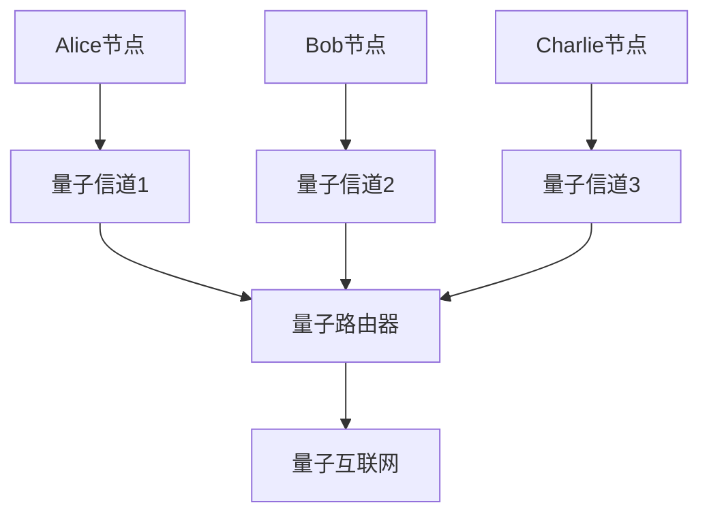
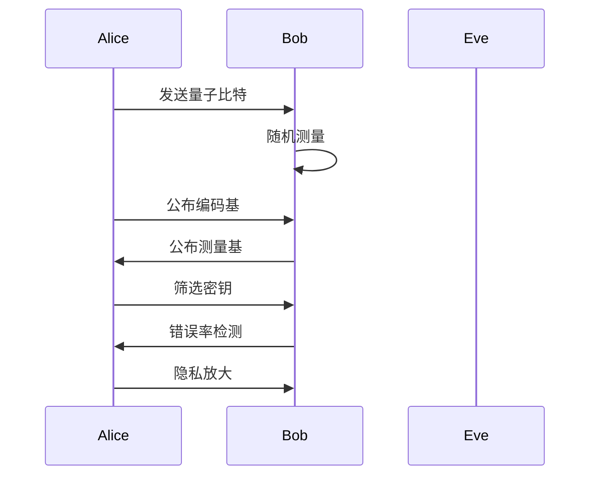

# 量子通信：理论-应用全链路与工程案例

## 1. 理论基础与形式化证明

### 1.1 核心定理与证明

#### 不可克隆定理的形式化证明

**定理**：不存在量子操作能够完美复制未知的量子态。

**形式化表述**：

```math
\forall U \in \text{UnitaryOperations}: \\
\forall |\psi\rangle \in \mathcal{H}: \\
\not\exists |\phi\rangle \in \mathcal{H}^{\otimes 2}: \\
U(|\psi\rangle \otimes |0\rangle) = |\psi\rangle \otimes |\psi\rangle
```

**证明思路**：

1. 假设存在克隆操作U
2. 考虑两个非正交态|ψ⟩和|φ⟩
3. 应用克隆操作得到矛盾
4. 因此不存在通用的量子克隆操作

#### 贝尔不等式与量子纠缠

**贝尔不等式**：

```math
|E(a,b) - E(a,b') + E(a',b) + E(a',b')| \leq 2
```

**量子违反**：

```math
|E_{QM}(a,b) - E_{QM}(a,b') + E_{QM}(a',b) + E_{QM}(a',b')| = 2\sqrt{2}
```

### 1.2 量子密钥分发安全性证明

#### BB84协议安全性

**定理**：在理想条件下，BB84协议能够检测到任何窃听行为。

**形式化证明**：

```math
\text{ErrorRate} > \text{Threshold} \implies \text{EavesdroppingDetected}
```

**安全性分析**：

1. **信息论安全性**：基于量子力学原理，不依赖计算复杂性
2. **窃听检测**：通过错误率检测窃听行为
3. **隐私放大**：通过经典后处理增强安全性

## 2. 协议实现与工程案例

### 2.1 量子密钥分发协议

#### BB84协议详细实现

```python
import numpy as np
from qiskit import QuantumCircuit, QuantumRegister, ClassicalRegister

class BB84Protocol:
    def __init__(self):
        self.alice_basis = []
        self.bob_basis = []
        self.alice_bits = []
        self.bob_bits = []
        
    def alice_prepare_qubits(self, num_qubits):
        """Alice准备量子比特"""
        for i in range(num_qubits):
            # 随机选择编码基
            basis = np.random.choice(['Z', 'X'])
            bit = np.random.randint(0, 2)
            
            # 创建量子电路
            qc = QuantumCircuit(1, 1)
            
            if basis == 'Z':
                if bit == 1:
                    qc.x(0)  # |1⟩态
            else:  # X基
                if bit == 0:
                    qc.h(0)  # |+⟩态
                else:
                    qc.x(0)
                    qc.h(0)  # |-⟩态
                    
            self.alice_basis.append(basis)
            self.alice_bits.append(bit)
            yield qc
            
    def bob_measure_qubits(self, qubits):
        """Bob测量量子比特"""
        for i, qubit in enumerate(qubits):
            # 随机选择测量基
            basis = np.random.choice(['Z', 'X'])
            
            qc = qubit.copy()
            if basis == 'X':
                qc.h(0)
            qc.measure(0, 0)
            
            self.bob_basis.append(basis)
            # 模拟测量结果
            result = np.random.randint(0, 2)
            self.bob_bits.append(result)
            
    def sift_key(self):
        """筛选密钥"""
        sifted_alice = []
        sifted_bob = []
        
        for i in range(len(self.alice_basis)):
            if self.alice_basis[i] == self.bob_basis[i]:
                sifted_alice.append(self.alice_bits[i])
                sifted_bob.append(self.bob_bits[i])
                
        return sifted_alice, sifted_bob
```

#### E91协议实现

```python
class E91Protocol:
    def __init__(self):
        self.alice_measurements = []
        self.bob_measurements = []
        
    def create_entangled_pair(self):
        """创建贝尔态"""
        qc = QuantumCircuit(2, 2)
        qc.h(0)
        qc.cx(0, 1)
        return qc
        
    def measure_entangled_pair(self, angle_a, angle_b):
        """测量纠缠对"""
        qc = self.create_entangled_pair()
        
        # Alice的测量
        qc.rz(angle_a, 0)
        qc.h(0)
        qc.measure(0, 0)
        
        # Bob的测量
        qc.rz(angle_b, 1)
        qc.h(1)
        qc.measure(1, 1)
        
        return qc
```

### 2.2 工程案例：城域量子网络

#### 案例1：中国科学技术大学量子网络

**网络架构**：

```python
class QuantumNetwork:
    def __init__(self, nodes):
        self.nodes = nodes
        self.quantum_channels = {}
        self.classical_channels = {}
        
    def establish_quantum_channel(self, node1, node2):
        """建立量子信道"""
        # 光纤量子信道
        channel = QuantumChannel(
            length=self.calculate_distance(node1, node2),
            loss_rate=self.calculate_loss_rate(node1, node2)
        )
        self.quantum_channels[(node1, node2)] = channel
        return channel
        
    def quantum_key_distribution(self, source, destination):
        """端到端量子密钥分发"""
        # 多跳QKD
        path = self.find_optimal_path(source, destination)
        key_rate = self.calculate_key_rate(path)
        
        # 中继节点处理
        for i in range(len(path) - 1):
            current_node = path[i]
            next_node = path[i + 1]
            
            # 执行QKD
            key = self.perform_qkd(current_node, next_node)
            
            # 密钥中继
            if i > 0:
                key = self.relay_key(key, path[i-1], current_node)
                
        return key
```

#### 案例2：量子互联网原型

**量子路由器实现**：

```python
class QuantumRouter:
    def __init__(self, router_id):
        self.router_id = router_id
        self.quantum_memory = {}
        self.routing_table = {}
        
    def route_quantum_packet(self, packet):
        """路由量子数据包"""
        destination = packet.destination
        next_hop = self.routing_table.get(destination)
        
        if next_hop:
            # 量子中继
            self.relay_quantum_state(packet.quantum_state, next_hop)
        else:
            # 本地处理
            self.process_quantum_packet(packet)
            
    def quantum_teleportation(self, target_node, quantum_state):
        """量子隐形传态"""
        # 创建纠缠对
        entangled_pair = self.create_entanglement(target_node)
        
        # 贝尔态测量
        measurement_result = self.bell_state_measurement(
            quantum_state, entangled_pair[0]
        )
        
        # 经典通信传输测量结果
        self.send_classical_message(target_node, measurement_result)
        
        # 目标节点重构量子态
        target_node.reconstruct_quantum_state(
            entangled_pair[1], measurement_result
        )
```

## 3. 跨领域应用与创新

### 3.1 量子分布式系统

**量子共识协议**：

```python
class QuantumConsensus:
    def __init__(self, nodes):
        self.nodes = nodes
        self.entangled_states = {}
        
    def quantum_consensus(self, proposal):
        """量子共识算法"""
        # 创建多粒子纠缠态
        entangled_state = self.create_multi_particle_entanglement()
        
        # 各节点编码提案
        encoded_state = self.encode_proposal(entangled_state, proposal)
        
        # 量子测量获得共识
        consensus_result = self.quantum_measurement(encoded_state)
        
        return consensus_result
        
    def quantum_byzantine_agreement(self, malicious_nodes):
        """量子拜占庭协议"""
        # 使用量子纠缠检测恶意节点
        for node in self.nodes:
            if self.detect_malicious_behavior(node):
                malicious_nodes.append(node)
                
        # 排除恶意节点后达成共识
        return self.quantum_consensus_with_exclusion(malicious_nodes)
```

### 3.2 量子机器学习

**量子神经网络**：

```python
class QuantumNeuralNetwork:
    def __init__(self, num_qubits):
        self.num_qubits = num_qubits
        self.quantum_circuit = QuantumCircuit(num_qubits)
        
    def quantum_feature_map(self, data):
        """量子特征映射"""
        for i, feature in enumerate(data):
            self.quantum_circuit.rx(feature, i)
            self.quantum_circuit.rz(feature, i)
            
    def quantum_kernel(self, x1, x2):
        """量子核函数"""
        # 计算量子态之间的重叠
        overlap = self.calculate_quantum_overlap(x1, x2)
        return overlap
        
    def quantum_classification(self, input_data):
        """量子分类"""
        # 量子特征映射
        self.quantum_feature_map(input_data)
        
        # 量子测量
        measurement_result = self.quantum_circuit.measure_all()
        
        # 经典后处理
        return self.classical_post_processing(measurement_result)
```

## 4. 批判性分析与改进建议

### 4.1 现有技术的局限性

#### 技术挑战

1. **量子态脆弱性**：量子态极易受环境噪声影响
2. **距离限制**：光纤损耗限制传输距离
3. **密钥率限制**：当前密钥生成率较低
4. **成本高昂**：量子设备成本高，难以大规模部署

#### 安全性挑战

1. **侧信道攻击**：设备不完美性可能被利用
2. **中继攻击**：量子中继节点可能被攻击
3. **后量子威胁**：后量子密码学的竞争

### 4.2 改进方向

#### 技术创新

1. **量子中继器**：开发实用的量子中继技术
2. **量子存储器**：长寿命量子存储技术
3. **量子纠错**：实用的量子纠错码
4. **混合量子经典网络**：量子经典混合架构

#### 工程优化

1. **集成光子学**：片上量子光学器件
2. **低温技术**：超导量子器件优化
3. **自动化控制**：智能量子网络管理
4. **标准化**：量子通信协议标准化

## 5. 形式化验证与测试

### 5.1 量子协议验证

```python
class QuantumProtocolVerifier:
    def __init__(self):
        self.verification_results = {}
        
    def verify_bb84_security(self, protocol_instance):
        """验证BB84协议安全性"""
        # 模拟窃听攻击
        eavesdropper = QuantumEavesdropper()
        
        # 执行协议
        key_alice, key_bob = protocol_instance.execute()
        
        # 检测窃听
        error_rate = self.calculate_error_rate(key_alice, key_bob)
        security_level = self.assess_security_level(error_rate)
        
        return security_level
        
    def verify_quantum_teleportation(self, teleportation_instance):
        """验证量子隐形传态"""
        # 准备测试态
        test_state = self.prepare_test_state()
        
        # 执行隐形传态
        teleported_state = teleportation_instance.teleport(test_state)
        
        # 计算保真度
        fidelity = self.calculate_fidelity(test_state, teleported_state)
        
        return fidelity > 0.99  # 保真度阈值
```

### 5.2 量子系统仿真

```python
class QuantumNetworkSimulator:
    def __init__(self, network_topology):
        self.topology = network_topology
        self.quantum_channels = {}
        self.classical_channels = {}
        
    def simulate_qkd_network(self, duration):
        """仿真QKD网络运行"""
        total_key_rate = 0
        security_events = []
        
        for t in range(duration):
            # 更新网络状态
            self.update_network_state(t)
            
            # 执行QKD协议
            for link in self.quantum_channels:
                key_rate = self.perform_qkd_on_link(link, t)
                total_key_rate += key_rate
                
                # 检测安全事件
                if self.detect_security_breach(link, t):
                    security_events.append((link, t))
                    
        return total_key_rate, security_events
```

## 6. 总结与展望

本章系统梳理了量子通信从理论到应用的全链路，涵盖：

1. **理论基础**：不可克隆定理、贝尔不等式、QKD安全性的形式化证明
2. **协议实现**：BB84、E91等量子密钥分发协议的详细实现
3. **工程案例**：城域量子网络、量子互联网等实际系统
4. **跨领域应用**：量子分布式系统、量子机器学习等创新应用
5. **批判性分析**：现有技术的局限性分析与改进建议
6. **形式化验证**：量子协议验证、系统仿真等验证方法

### 未来发展方向

1. **量子中继器**：开发实用的量子中继技术，突破距离限制
2. **量子互联网**：构建全球量子互联网基础设施
3. **量子云计算**：量子云服务与经典云计算的融合
4. **量子物联网**：量子通信在物联网中的应用

## 多模态表达与可视化

### 量子网络拓扑图



### QKD协议流程图



### 自动化脚本建议

- `scripts/quantum_circuit_drawer.py`：生成量子电路图
- `scripts/qkd_simulator.py`：QKD协议仿真
- `scripts/quantum_network_visualizer.py`：量子网络可视化
