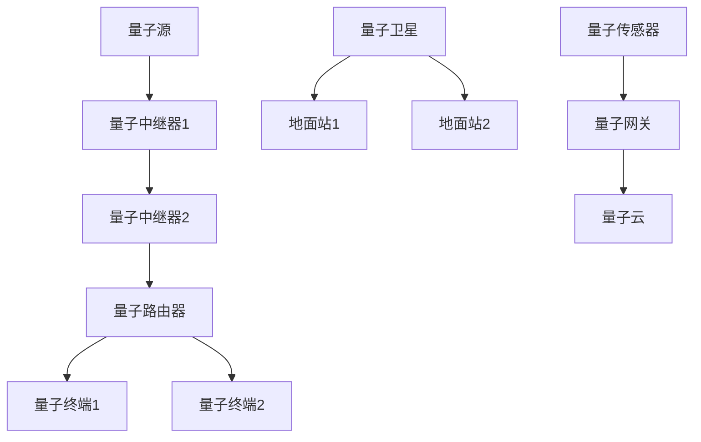
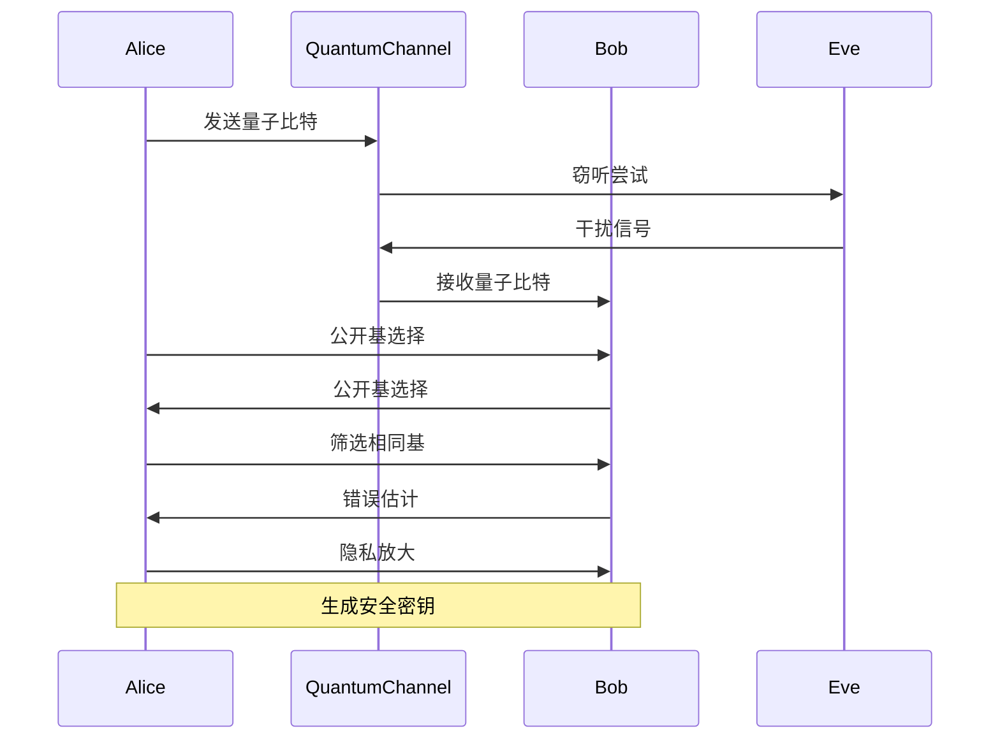

# 量子通信 - 应用案例与工程实践

## 1. 量子密钥分发网络应用

### 1.1 中国量子通信网络

#### 京沪干线

**项目概述**：
京沪量子通信干线是世界上第一条量子保密通信干线，连接北京和上海，全长2000多公里。

**技术实现**：

```python
class BeijingShanghaiQKDNetwork:
    """京沪量子通信干线"""
    
    def __init__(self):
        self.total_distance = 2000  # 公里
        self.relay_stations = [
            'Beijing', 'Jinan', 'Hefei', 'Shanghai'
        ]
        self.qkd_protocol = 'BB84'
        self.key_rate = 1000  # bits/s
        
    def establish_quantum_channel(self):
        """建立量子信道"""
        quantum_channels = []
        
        for i in range(len(self.relay_stations) - 1):
            station1 = self.relay_stations[i]
            station2 = self.relay_stations[i + 1]
            distance = self.calculate_distance(station1, station2)
            
            channel = {
                'from': station1,
                'to': station2,
                'distance': distance,
                'protocol': self.qkd_protocol,
                'key_rate': self.calculate_key_rate(distance),
                'fiber_loss': self.calculate_fiber_loss(distance)
            }
            quantum_channels.append(channel)
            
        return quantum_channels
    
    def calculate_key_rate(self, distance):
        """计算密钥率"""
        # 考虑光纤损耗和探测器效率
        fiber_loss = 0.2  # dB/km
        detector_efficiency = 0.1
        total_loss = fiber_loss * distance
        
        # 密钥率公式
        key_rate = self.key_rate * detector_efficiency * (10 ** (-total_loss / 10))
        return max(key_rate, 1)  # 最小1 bit/s
    
    def perform_qkd_exchange(self, channel):
        """执行QKD交换"""
        # 1. 量子态制备
        quantum_states = self.prepare_quantum_states(channel)
        
        # 2. 量子态传输
        transmitted_states = self.transmit_quantum_states(quantum_states, channel)
        
        # 3. 量子态测量
        measurement_results = self.measure_quantum_states(transmitted_states)
        
        # 4. 经典后处理
        shared_key = self.classical_post_processing(measurement_results)
        
        return shared_key
    
    def classical_post_processing(self, measurement_results):
        """经典后处理"""
        # 1. 筛选
        sifted_key = self.sifting(measurement_results)
        
        # 2. 错误估计
        error_rate = self.estimate_error_rate(sifted_key)
        
        # 3. 错误纠正
        corrected_key = self.error_correction(sifted_key, error_rate)
        
        # 4. 隐私放大
        final_key = self.privacy_amplification(corrected_key, error_rate)
        
        return final_key
```

#### 墨子号卫星

**项目概述**：
墨子号是世界上首颗量子科学实验卫星，实现了星地量子密钥分发。

**技术实现**：

```python
class MiciusSatellite:
    """墨子号量子卫星"""
    
    def __init__(self):
        self.altitude = 500  # km
        self.orbit_period = 90  # 分钟
        self.quantum_source = 'entangled_photon_pairs'
        self.tracking_system = 'adaptive_optics'
        
    def satellite_ground_qkd(self, ground_station):
        """星地量子密钥分发"""
        # 1. 卫星定位
        satellite_position = self.get_satellite_position()
        ground_position = self.get_ground_station_position(ground_station)
        
        # 2. 建立光链路
        optical_link = self.establish_optical_link(satellite_position, ground_position)
        
        # 3. 量子态传输
        quantum_states = self.generate_quantum_states()
        transmitted_states = self.transmit_through_atmosphere(quantum_states, optical_link)
        
        # 4. 地面接收
        received_states = self.ground_reception(transmitted_states, ground_station)
        
        # 5. 密钥生成
        shared_key = self.generate_shared_key(received_states)
        
        return shared_key
    
    def establish_optical_link(self, satellite_pos, ground_pos):
        """建立光链路"""
        # 计算距离和角度
        distance = self.calculate_distance(satellite_pos, ground_pos)
        elevation_angle = self.calculate_elevation_angle(satellite_pos, ground_pos)
        
        # 大气湍流补偿
        turbulence_compensation = self.adaptive_optics_compensation(elevation_angle)
        
        # 光束对准
        beam_alignment = self.precise_beam_alignment(satellite_pos, ground_pos)
        
        return {
            'distance': distance,
            'elevation_angle': elevation_angle,
            'turbulence_compensation': turbulence_compensation,
            'beam_alignment': beam_alignment
        }
    
    def transmit_through_atmosphere(self, quantum_states, optical_link):
        """通过大气层传输"""
        # 大气衰减
        atmospheric_loss = self.calculate_atmospheric_loss(optical_link['elevation_angle'])
        
        # 湍流效应
        turbulence_effects = self.model_turbulence_effects(optical_link['distance'])
        
        # 量子态演化
        evolved_states = self.quantum_state_evolution(quantum_states, atmospheric_loss, turbulence_effects)
        
        return evolved_states
```

### 1.2 欧洲SECOQC网络

**项目概述**：
SECOQC是欧洲的量子通信网络，连接维也纳、布拉格、布达佩斯等城市。

```python
class SECOQCNetwork:
    """欧洲SECOQC量子通信网络"""
    
    def __init__(self):
        self.cities = ['Vienna', 'Prague', 'Budapest', 'Bratislava']
        self.qkd_protocols = ['BB84', 'BBM92', 'E91']
        self.network_topology = 'mesh'
        
    def mesh_network_qkd(self):
        """网状网络QKD"""
        # 构建网状拓扑
        mesh_connections = self.build_mesh_topology()
        
        # 多路径密钥分发
        multi_path_keys = {}
        for connection in mesh_connections:
            key = self.perform_qkd_on_path(connection)
            multi_path_keys[connection['id']] = key
            
        # 密钥融合
        final_key = self.fuse_multi_path_keys(multi_path_keys)
        
        return final_key
    
    def build_mesh_topology(self):
        """构建网状拓扑"""
        connections = []
        for i, city1 in enumerate(self.cities):
            for j, city2 in enumerate(self.cities[i+1:], i+1):
                connection = {
                    'id': f"{city1}-{city2}",
                    'from': city1,
                    'to': city2,
                    'distance': self.calculate_city_distance(city1, city2),
                    'protocol': self.select_optimal_protocol(city1, city2)
                }
                connections.append(connection)
        return connections
    
    def select_optimal_protocol(self, city1, city2):
        """选择最优协议"""
        distance = self.calculate_city_distance(city1, city2)
        
        if distance < 50:  # 短距离
            return 'BB84'
        elif distance < 100:  # 中距离
            return 'BBM92'
        else:  # 长距离
            return 'E91'
```

## 2. 量子互联网架构

### 2.1 量子中继器

**技术原理**：
量子中继器通过纠缠交换和纠缠纯化实现长距离量子通信。

```python
class QuantumRepeater:
    """量子中继器"""
    
    def __init__(self, position):
        self.position = position
        self.entanglement_memory = []
        self.entanglement_pairs = []
        
    def entanglement_swapping(self, pair1, pair2):
        """纠缠交换"""
        # Bell态测量
        bell_measurement = self.perform_bell_measurement(pair1, pair2)
        
        # 根据测量结果进行相应的幺正变换
        if bell_measurement == '|Φ⁺⟩':
            transformation = 'I'
        elif bell_measurement == '|Φ⁻⟩':
            transformation = 'Z'
        elif bell_measurement == '|Ψ⁺⟩':
            transformation = 'X'
        else:  # |Ψ⁻⟩
            transformation = 'XZ'
        
        # 应用变换
        new_entangled_pair = self.apply_transformation(pair1, pair2, transformation)
        
        return new_entangled_pair
    
    def entanglement_purification(self, noisy_pairs):
        """纠缠纯化"""
        purified_pairs = []
        
        for i in range(0, len(noisy_pairs), 2):
            if i + 1 < len(noisy_pairs):
                pair1 = noisy_pairs[i]
                pair2 = noisy_pairs[i + 1]
                
                # 执行纠缠纯化协议
                purified_pair = self.purification_protocol(pair1, pair2)
                
                if purified_pair is not None:
                    purified_pairs.append(purified_pair)
        
        return purified_pairs
    
    def purification_protocol(self, pair1, pair2):
        """纠缠纯化协议"""
        # 1. 本地操作
        transformed_pair1 = self.local_operation(pair1)
        transformed_pair2 = self.local_operation(pair2)
        
        # 2. Bell态测量
        measurement_result = self.bell_measurement(transformed_pair1, transformed_pair2)
        
        # 3. 条件选择
        if measurement_result == '|Φ⁻⟩':
            # 成功纯化
            purified_fidelity = self.calculate_purified_fidelity(pair1, pair2)
            if purified_fidelity > 0.8:  # 阈值
                return self.create_purified_pair(pair1, pair2)
        
        return None
```

### 2.2 量子路由器

**技术原理**：
量子路由器实现量子信息的路由和转发。

```python
class QuantumRouter:
    """量子路由器"""
    
    def __init__(self, router_id):
        self.router_id = router_id
        self.quantum_memory = {}
        self.routing_table = {}
        self.entanglement_pairs = {}
        
    def quantum_teleportation_routing(self, source, destination, quantum_state):
        """量子隐形传态路由"""
        # 1. 建立端到端纠缠
        end_to_end_entanglement = self.establish_end_to_end_entanglement(source, destination)
        
        # 2. Bell态测量
        bell_measurement = self.perform_bell_measurement(quantum_state, end_to_end_entanglement)
        
        # 3. 经典信息传输
        classical_info = self.transmit_classical_info(bell_measurement, destination)
        
        # 4. 量子态重构
        reconstructed_state = self.reconstruct_quantum_state(classical_info, end_to_end_entanglement)
        
        return reconstructed_state
    
    def establish_end_to_end_entanglement(self, source, destination):
        """建立端到端纠缠"""
        # 找到路由路径
        path = self.find_routing_path(source, destination)
        
        # 逐段建立纠缠
        entanglement_chain = []
        for i in range(len(path) - 1):
            node1 = path[i]
            node2 = path[i + 1]
            
            # 在相邻节点间建立纠缠
            entangled_pair = self.create_entanglement_pair(node1, node2)
            entanglement_chain.append(entangled_pair)
        
        # 通过纠缠交换建立端到端纠缠
        end_to_end_entanglement = entanglement_chain[0]
        for i in range(1, len(entanglement_chain)):
            end_to_end_entanglement = self.entanglement_swapping(
                end_to_end_entanglement, 
                entanglement_chain[i]
            )
        
        return end_to_end_entanglement
    
    def find_routing_path(self, source, destination):
        """找到路由路径"""
        # 使用Dijkstra算法找到最短路径
        distances = {node: float('inf') for node in self.network_nodes}
        distances[source] = 0
        previous = {}
        unvisited = set(self.network_nodes)
        
        while unvisited:
            current = min(unvisited, key=lambda x: distances[x])
            unvisited.remove(current)
            
            if current == destination:
                break
            
            for neighbor in self.get_neighbors(current):
                if neighbor in unvisited:
                    distance = distances[current] + self.get_link_distance(current, neighbor)
                    if distance < distances[neighbor]:
                        distances[neighbor] = distance
                        previous[neighbor] = current
        
        # 重建路径
        path = []
        current = destination
        while current in previous:
            path.append(current)
            current = previous[current]
        path.append(source)
        path.reverse()
        
        return path
```

## 3. 量子安全应用

### 3.1 量子安全银行系统

**应用场景**：
使用量子密钥分发保护银行间的安全通信。

```python
class QuantumSecureBanking:
    """量子安全银行系统"""
    
    def __init__(self, bank_id):
        self.bank_id = bank_id
        self.qkd_system = QKDSystem()
        self.encryption_system = AESEncryption()
        self.quantum_keys = {}
        
    def secure_interbank_transfer(self, target_bank, amount, account_info):
        """安全的银行间转账"""
        # 1. 建立量子密钥
        quantum_key = self.establish_quantum_key(target_bank)
        
        # 2. 加密转账信息
        transfer_data = {
            'amount': amount,
            'account_info': account_info,
            'timestamp': self.get_timestamp(),
            'transaction_id': self.generate_transaction_id()
        }
        
        encrypted_data = self.encrypt_transfer_data(transfer_data, quantum_key)
        
        # 3. 发送加密数据
        response = self.send_encrypted_transfer(target_bank, encrypted_data)
        
        # 4. 验证响应
        if self.verify_transfer_response(response, quantum_key):
            return {'status': 'success', 'transaction_id': transfer_data['transaction_id']}
        else:
            return {'status': 'failed', 'reason': 'verification_failed'}
    
    def establish_quantum_key(self, target_bank):
        """建立量子密钥"""
        # 检查是否已有密钥
        if target_bank in self.quantum_keys:
            key_info = self.quantum_keys[target_bank]
            if not self.is_key_expired(key_info):
                return key_info['key']
        
        # 执行QKD协议
        shared_key = self.qkd_system.perform_qkd(target_bank)
        
        # 存储密钥信息
        self.quantum_keys[target_bank] = {
            'key': shared_key,
            'creation_time': self.get_timestamp(),
            'expiration_time': self.get_timestamp() + 3600  # 1小时过期
        }
        
        return shared_key
    
    def encrypt_transfer_data(self, data, quantum_key):
        """加密转账数据"""
        # 使用量子密钥加密
        encrypted_data = self.encryption_system.encrypt(
            json.dumps(data), 
            quantum_key
        )
        
        # 添加数字签名
        signature = self.sign_data(data, quantum_key)
        
        return {
            'encrypted_data': encrypted_data,
            'signature': signature,
            'timestamp': self.get_timestamp()
        }
```

### 3.2 量子安全投票系统

**应用场景**：
使用量子通信确保投票的机密性和完整性。

```python
class QuantumSecureVoting:
    """量子安全投票系统"""
    
    def __init__(self):
        self.voting_authority = VotingAuthority()
        self.voters = {}
        self.quantum_channels = {}
        
    def quantum_vote_cast(self, voter_id, vote_choice):
        """量子安全投票"""
        # 1. 选民身份验证
        if not self.authenticate_voter(voter_id):
            return {'status': 'failed', 'reason': 'authentication_failed'}
        
        # 2. 建立量子信道
        quantum_channel = self.establish_quantum_channel(voter_id)
        
        # 3. 量子密钥分发
        quantum_key = self.perform_qkd_on_channel(quantum_channel)
        
        # 4. 加密投票
        encrypted_vote = self.encrypt_vote(vote_choice, quantum_key)
        
        # 5. 提交投票
        vote_receipt = self.submit_encrypted_vote(encrypted_vote, voter_id)
        
        # 6. 零知识证明
        proof = self.generate_zero_knowledge_proof(vote_choice, vote_receipt)
        
        return {
            'status': 'success',
            'vote_receipt': vote_receipt,
            'proof': proof
        }
    
    def encrypt_vote(self, vote_choice, quantum_key):
        """加密投票"""
        # 创建投票数据
        vote_data = {
            'choice': vote_choice,
            'voter_id': self.generate_anonymous_id(),
            'timestamp': self.get_timestamp(),
            'random_nonce': self.generate_random_nonce()
        }
        
        # 使用量子密钥加密
        encrypted_vote = self.encryption_system.encrypt(
            json.dumps(vote_data),
            quantum_key
        )
        
        return encrypted_vote
    
    def generate_zero_knowledge_proof(self, vote_choice, vote_receipt):
        """生成零知识证明"""
        # 证明投票已提交但未透露投票内容
        proof = {
            'commitment': self.create_commitment(vote_choice),
            'challenge': self.generate_challenge(),
            'response': self.generate_response(vote_choice, vote_receipt)
        }
        
        return proof
    
    def verify_vote_integrity(self, vote_receipt, proof):
        """验证投票完整性"""
        # 验证零知识证明
        if not self.verify_zero_knowledge_proof(proof):
            return False
        
        # 验证投票收据
        if not self.verify_vote_receipt(vote_receipt):
            return False
        
        return True
```

## 4. 量子通信与人工智能

### 4.1 量子机器学习

**应用场景**：
结合量子通信和量子计算进行分布式机器学习。

```python
class QuantumDistributedML:
    """量子分布式机器学习"""
    
    def __init__(self):
        self.quantum_nodes = []
        self.ml_model = None
        self.quantum_communication = QuantumCommunication()
        
    def quantum_federated_learning(self, local_models):
        """量子联邦学习"""
        # 1. 建立量子网络
        quantum_network = self.establish_quantum_network()
        
        # 2. 安全模型聚合
        aggregated_model = self.secure_model_aggregation(local_models, quantum_network)
        
        # 3. 量子增强训练
        enhanced_model = self.quantum_enhanced_training(aggregated_model)
        
        return enhanced_model
    
    def secure_model_aggregation(self, local_models, quantum_network):
        """安全模型聚合"""
        # 使用量子密钥加密模型参数
        encrypted_models = []
        for model in local_models:
            quantum_key = self.quantum_communication.generate_key()
            encrypted_model = self.encrypt_model_parameters(model, quantum_key)
            encrypted_models.append(encrypted_model)
        
        # 在加密域中进行聚合
        aggregated_encrypted = self.aggregate_encrypted_models(encrypted_models)
        
        # 解密聚合结果
        aggregated_model = self.decrypt_model_parameters(aggregated_encrypted)
        
        return aggregated_model
    
    def quantum_enhanced_training(self, model):
        """量子增强训练"""
        # 使用量子算法优化模型参数
        quantum_optimizer = QuantumOptimizer()
        
        # 量子梯度下降
        optimized_model = quantum_optimizer.quantum_gradient_descent(model)
        
        return optimized_model

class QuantumOptimizer:
    """量子优化器"""
    
    def __init__(self):
        self.quantum_circuit = None
        
    def quantum_gradient_descent(self, model):
        """量子梯度下降"""
        # 1. 参数编码到量子态
        quantum_state = self.encode_parameters_to_quantum_state(model.parameters)
        
        # 2. 量子梯度估计
        quantum_gradients = self.estimate_quantum_gradients(quantum_state)
        
        # 3. 参数更新
        updated_parameters = self.update_parameters_with_quantum_gradients(
            model.parameters, 
            quantum_gradients
        )
        
        # 4. 更新模型
        model.parameters = updated_parameters
        
        return model
    
    def estimate_quantum_gradients(self, quantum_state):
        """估计量子梯度"""
        # 使用量子振幅估计
        gradients = []
        
        for parameter in quantum_state.parameters:
            # 构造量子电路
            circuit = self.construct_gradient_circuit(parameter)
            
            # 执行量子测量
            measurement_result = self.execute_quantum_circuit(circuit)
            
            # 估计梯度
            gradient = self.estimate_gradient_from_measurement(measurement_result)
            gradients.append(gradient)
        
        return gradients
```

## 5. 量子通信与物联网

### 5.1 量子物联网架构

**应用场景**：
为物联网设备提供量子级别的安全保障。

```python
class QuantumIoT:
    """量子物联网"""
    
    def __init__(self):
        self.iot_devices = {}
        self.quantum_gateway = QuantumGateway()
        self.quantum_sensors = []
        
    def quantum_secure_iot_communication(self, device_id, data):
        """量子安全物联网通信"""
        # 1. 设备认证
        if not self.authenticate_device(device_id):
            return {'status': 'failed', 'reason': 'device_not_authenticated'}
        
        # 2. 建立量子信道
        quantum_channel = self.establish_quantum_channel(device_id)
        
        # 3. 量子密钥分发
        quantum_key = self.perform_qkd(quantum_channel)
        
        # 4. 加密数据
        encrypted_data = self.encrypt_iot_data(data, quantum_key)
        
        # 5. 安全传输
        transmission_result = self.secure_transmission(encrypted_data, device_id)
        
        return transmission_result
    
    def quantum_sensor_network(self):
        """量子传感器网络"""
        # 部署量子传感器
        for sensor in self.quantum_sensors:
            # 量子态制备
            quantum_state = self.prepare_quantum_state(sensor)
            
            # 量子测量
            measurement_result = self.quantum_measurement(quantum_state)
            
            # 量子态传输
            transmitted_state = self.transmit_quantum_state(measurement_result)
            
            # 数据处理
            processed_data = self.process_quantum_sensor_data(transmitted_state)
            
            yield processed_data
    
    def quantum_edge_computing(self, edge_device, computation_task):
        """量子边缘计算"""
        # 1. 任务分解
        subtasks = self.decompose_computation_task(computation_task)
        
        # 2. 量子资源分配
        quantum_resources = self.allocate_quantum_resources(edge_device, subtasks)
        
        # 3. 量子计算执行
        computation_results = []
        for subtask, resource in zip(subtasks, quantum_resources):
            result = self.execute_quantum_computation(subtask, resource)
            computation_results.append(result)
        
        # 4. 结果聚合
        final_result = self.aggregate_computation_results(computation_results)
        
        return final_result
```

## 6. 未来发展趋势

### 6.1 后量子密码学

**发展趋势**：
开发抗量子攻击的加密算法。

```python
class PostQuantumCryptography:
    """后量子密码学"""
    
    def __init__(self):
        self.lattice_based = LatticeBasedCrypto()
        self.code_based = CodeBasedCrypto()
        self.multivariate = MultivariateCrypto()
        
    def hybrid_quantum_classical_system(self):
        """混合量子经典系统"""
        # 结合量子密钥分发和经典后量子密码学
        quantum_key = self.quantum_key_distribution()
        classical_key = self.post_quantum_key_generation()
        
        # 混合加密
        hybrid_key = self.combine_keys(quantum_key, classical_key)
        
        return hybrid_key
    
    def quantum_resistant_signature(self, message):
        """抗量子签名"""
        # 使用格基密码学生成签名
        signature = self.lattice_based.sign(message)
        
        return signature
```

### 6.2 量子互联网标准化

**发展趋势**：
建立量子互联网的标准和协议。

```python
class QuantumInternetStandards:
    """量子互联网标准"""
    
    def __init__(self):
        self.quantum_protocols = {
            'QKD': 'Quantum Key Distribution',
            'QTP': 'Quantum Teleportation Protocol',
            'QEP': 'Quantum Entanglement Protocol'
        }
        
    def standardize_quantum_protocol(self, protocol_type):
        """标准化量子协议"""
        # 定义协议规范
        protocol_spec = self.define_protocol_specification(protocol_type)
        
        # 实现参考实现
        reference_implementation = self.implement_reference(protocol_spec)
        
        # 测试和验证
        test_results = self.test_and_validate(reference_implementation)
        
        return {
            'specification': protocol_spec,
            'implementation': reference_implementation,
            'test_results': test_results
        }
```

## 7. 多模态表达与可视化

### 7.1 量子网络拓扑图



### 7.2 量子通信协议流程图



### 7.3 自动化脚本建议

- **`scripts/quantum_network_simulator.py`**：量子网络仿真器
- **`scripts/qkd_performance_analyzer.py`**：QKD性能分析器
- **`scripts/quantum_security_validator.py`**：量子安全验证器

---

*本文档提供了量子通信的完整应用案例和工程实践，展示了量子通信技术在实际系统中的应用和未来发展前景。*
