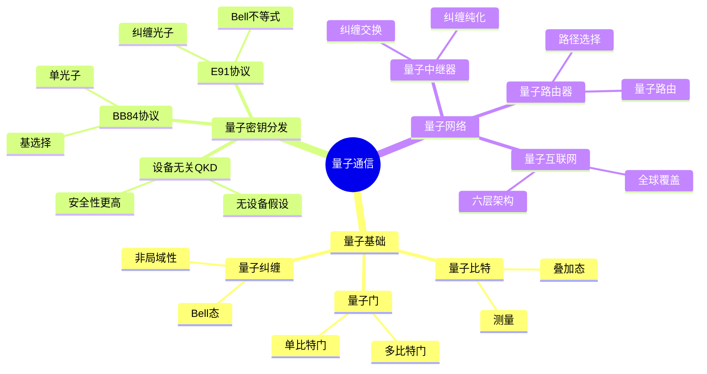
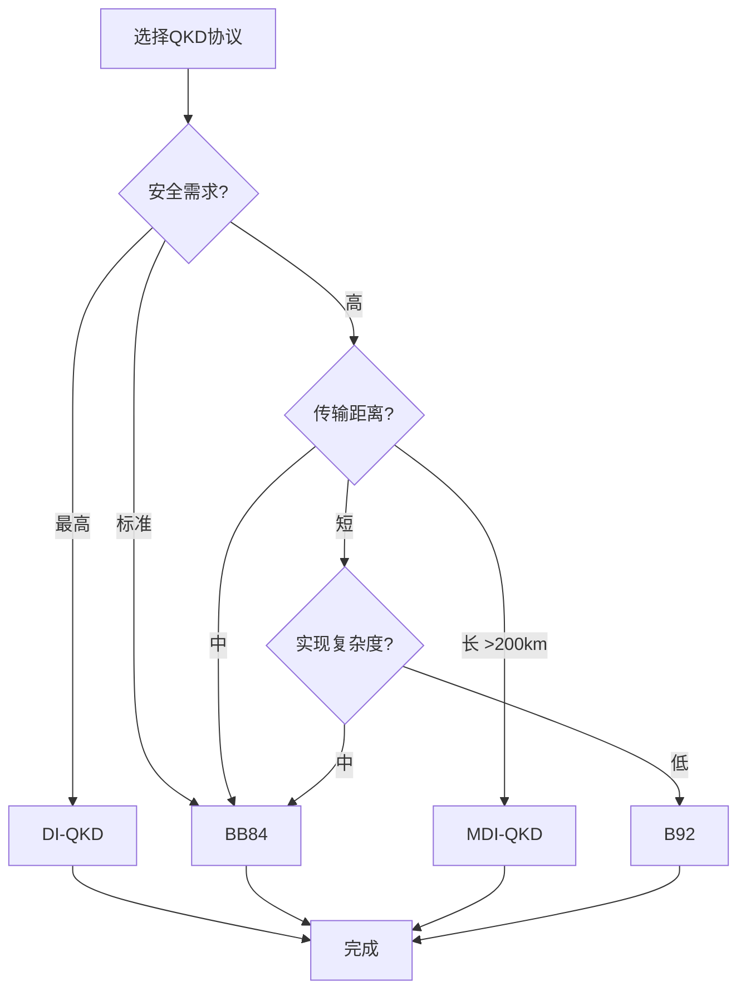

# 量子通信思维表征工具 / Quantum Communication Mental Representation Tools

## 📚 **概述 / Overview**

本文档提供量子通信模块的多种思维表征工具，包括思维导图、对比矩阵、决策树、逻辑路径和概念地图，帮助更好地理解和应用量子通信知识。

**创建时间**: 2025年1月
**模块**: 量子通信
**状态**: 🚀 持续更新中

---

## 🗺️ **一、思维导图 / Mind Maps**

### 1.1 量子通信核心概念思维导图

---

## 📊 **二、对比矩阵 / Comparison Matrices**

### 2.1 量子密钥分发协议对比矩阵

| 协议 | 量子态 | 安全性 | 实现难度 | 传输距离 | 密钥率 | 应用场景 |
|------|--------|--------|---------|---------|--------|---------|
| **BB84** | 单光子 | 信息论安全 | 中 | 中（~100km） | 中 | 光纤QKD |
| **E91** | 纠缠光子 | 信息论安全 | 高 | 中 | 中 | 纠缠QKD |
| **B92** | 单光子 | 信息论安全 | 低 | 中 | 低 | 简化BB84 |
| **DI-QKD** | 任意态 | 设备无关 | 很高 | 短 | 低 | 高安全需求 |
| **MDI-QKD** | 单光子 | 测量设备无关 | 高 | 长（>200km） | 高 | 长距离QKD |

**选择指南**：

- **标准应用**：BB84
- **高安全需求**：DI-QKD
- **长距离**：MDI-QKD
- **简化实现**：B92
- **纠缠应用**：E91

---

## 🌳 **三、决策树 / Decision Trees**

### 3.1 量子密钥分发协议选择决策树

---

**文档版本**: v1.0
**创建时间**: 2025年1月
**最后更新**: 2025年1月
**维护者**: GraphNetWorkCommunicate项目组
