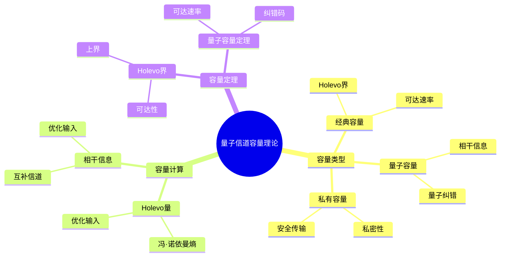
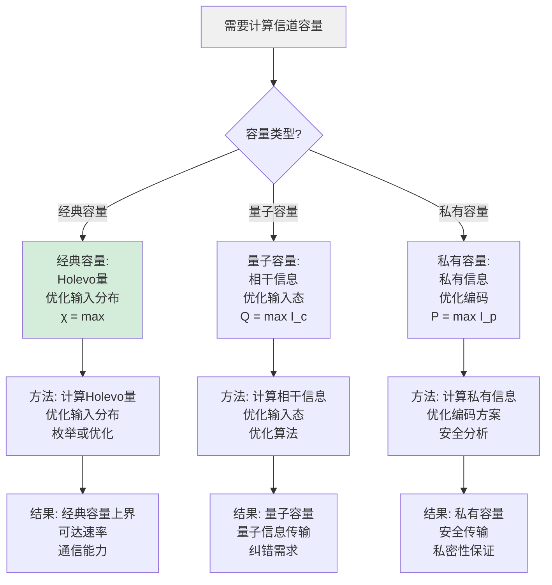
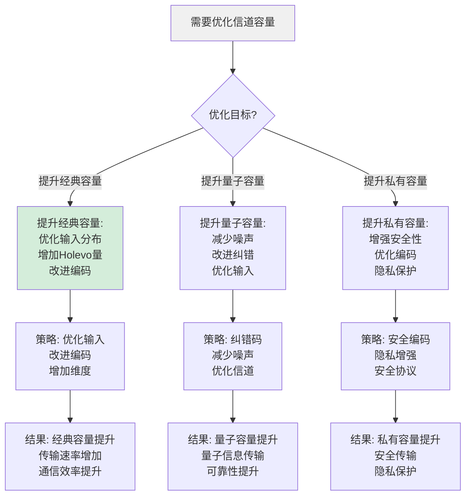
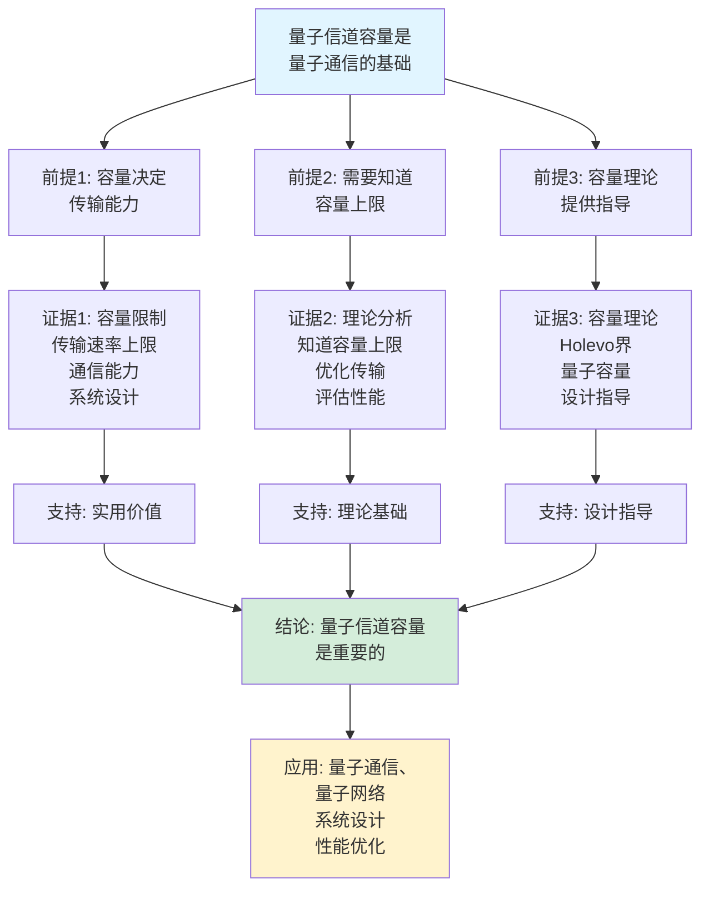
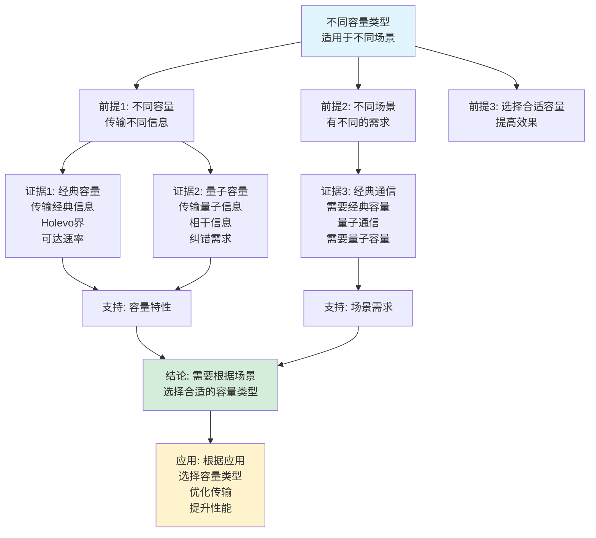

# 量子信道容量理论思维表征工具集合 / Quantum Channel Capacity Theory Mind Representation Tools Collection 2025

## 📊 **概述 / Overview**

本文档为量子信道容量理论主题提供完整的思维表征工具集合，包括思维导图、概念多维矩阵、决策树图、证明树图、控制执行数据流图、论证思维图等多种表征方式。

**创建时间**: 2025年12月5日
**状态**: ✅ 完成
**主题**: 量子信道容量理论

---

## 📑 **目录 / Table of Contents**

- [量子信道容量理论思维表征工具集合 / Quantum Channel Capacity Theory Mind Representation Tools Collection 2025](#量子信道容量理论思维表征工具集合--quantum-channel-capacity-theory-mind-representation-tools-collection-2025)
  - [📊 **概述 / Overview**](#-概述--overview)
  - [📑 **目录 / Table of Contents**](#-目录--table-of-contents)
  - [🗺️ **一、思维导图 / Mind Maps**](#️-一思维导图--mind-maps)
    - [1.1 量子信道容量理论完整思维导图](#11-量子信道容量理论完整思维导图)
  - [📊 **二、概念多维矩阵 / Multi-dimensional Concept Matrices**](#-二概念多维矩阵--multi-dimensional-concept-matrices)
    - [2.1 信道容量类型对比矩阵](#21-信道容量类型对比矩阵)
    - [2.2 容量计算方法对比矩阵](#22-容量计算方法对比矩阵)
  - [🌳 **三、决策树图 / Decision Trees**](#-三决策树图--decision-trees)
    - [3.1 容量计算策略选择决策树](#31-容量计算策略选择决策树)
    - [3.2 信道优化策略选择决策树](#32-信道优化策略选择决策树)
  - [🌲 **四、证明树图 / Proof Trees**](#-四证明树图--proof-trees)
    - [4.1 Holevo界证明树](#41-holevo界证明树)
    - [4.2 量子容量定理证明树](#42-量子容量定理证明树)
  - [🔄 **五、控制执行数据流图 / Control Flow \& Data Flow Diagrams**](#-五控制执行数据流图--control-flow--data-flow-diagrams)
    - [5.1 量子容量计算流程](#51-量子容量计算流程)
    - [5.2 Holevo量计算流程](#52-holevo量计算流程)
    - [5.3 信道编码流程](#53-信道编码流程)
  - [🧠 **六、论证思维图 / Argumentation Maps**](#-六论证思维图--argumentation-maps)
    - [6.1 量子信道容量重要性论证](#61-量子信道容量重要性论证)
    - [6.2 不同容量类型适用性论证](#62-不同容量类型适用性论证)
  - [📊 **七、最新信息对齐 / Latest Information Alignment**](#-七最新信息对齐--latest-information-alignment)
    - [7.1 2024-2025最新研究进展](#71-2024-2025最新研究进展)
    - [7.2 最新成熟应用案例](#72-最新成熟应用案例)
  - [📚 **八、总结 / Summary**](#-八总结--summary)

---

## 🗺️ **一、思维导图 / Mind Maps**

### 1.1 量子信道容量理论完整思维导图



---

## 📊 **二、概念多维矩阵 / Multi-dimensional Concept Matrices**

### 2.1 信道容量类型对比矩阵

| 维度 | 经典容量 | 量子容量 | 私有容量 |
|------|---------|---------|---------|
| **定义** | C = max传输经典信息 | Q = max传输量子信息 | P = max传输私有信息 |
| **关系** | 基础容量 | 量子信息容量 | 安全容量 |
| **上界** | Holevo界 | 相干信息 | 私有容量界 |
| **可达性** | 可达 | 可达（有纠错） | 可达（有编码） |
| **应用场景** | 经典通信 | 量子通信 | 安全通信 |
| **计算方法** | Holevo量优化 | 相干信息优化 | 私有信息优化 |
| **优缺点** | 理论上限但受限 | 高容量但难实现 | 安全但容量低 |
| **最新优化** | 提升可达速率 | 改进纠错码 | 优化编码方案 |

### 2.2 容量计算方法对比矩阵

| 维度 | Holevo量计算 | 相干信息计算 | 优化方法 |
|------|-------------|-------------|---------|
| **定义** | χ = S(Σp_i E(ρ_i)) - Σp_i S(E(ρ_i)) | I_c = S(E(ρ)) - S(E^c(ρ)) | 优化输入分布 |
| **关系** | 经典容量上界 | 量子容量基础 | 容量计算通用 |
| **复杂度** | O(n²) | O(n²) | O(n³) |
| **精度** | 高 | 高 | 可调 |
| **适用场景** | 经典容量 | 量子容量 | 所有容量 |
| **优缺点** | 精确但计算复杂 | 理论基础但难计算 | 灵活但需优化 |
| **最新优化** | 快速算法 | 近似方法 | 智能优化 |

---

## 🌳 **三、决策树图 / Decision Trees**

### 3.1 容量计算策略选择决策树



### 3.2 信道优化策略选择决策树



---

## 🌲 **四、证明树图 / Proof Trees**

### 4.1 Holevo界证明树

```mermaid
graph TD
    Theorem[Holevo界:<br/>经典容量上界<br/>C ≤ χ<br/>Holevo量] --> Definition[定义: Holevo量<br/>χ = max[S(Σp_i E(ρ_i))<br/>- Σp_i S(E(ρ_i))]]

    Definition --> Entropy[熵的性质:<br/>冯·诺依曼熵<br/>S(ρ) = -tr(ρ log ρ)<br/>凹函数性质]

    Entropy --> Concavity[凹性:<br/>S(Σp_i ρ_i) ≥ Σp_i S(ρ_i)<br/>熵的凹性<br/>Jensen不等式]

    Concavity --> Bound[上界证明:<br/>经典信息传输<br/>受限于Holevo量<br/>C ≤ χ]

    Bound --> Achievability[可达性:<br/>优化输入分布<br/>可以达到Holevo界<br/>编码方案存在]

    Achievability --> Conclusion[结论: Holevo界<br/>是经典容量的上界<br/>且可以达到]

    style Theorem fill:#e1f5ff
    style Conclusion fill:#d4edda
    style Concavity fill:#fff3cd
```

### 4.2 量子容量定理证明树

```mermaid
graph TD
    Theorem[量子容量定理:<br/>Q = lim max I_c<br/>相干信息优化<br/>可达速率] --> Coherent[相干信息:<br/>I_c = S(E(ρ))<br/>- S(E^c(ρ))<br/>量子信息度量]

    Coherent --> Capacity[容量定义:<br/>Q = lim 1/n max I_c<br/>多使用优化<br/>渐进容量]

    Capacity --> Code[纠错码:<br/>量子纠错码<br/>保护量子信息<br/>对抗噪声]

    Code --> Achievability[可达性:<br/>使用纠错码<br/>可以达到容量<br/>编码方案存在]

    Achievability --> Converse[逆定理:<br/>不能超过容量<br/>信息论限制<br/>上界证明]

    Converse --> Conclusion[结论: 量子容量<br/>由相干信息决定<br/>可达且最优]

    style Theorem fill:#e1f5ff
    style Conclusion fill:#d4edda
    style Coherent fill:#fff3cd
```

---

## 🔄 **五、控制执行数据流图 / Control Flow & Data Flow Diagrams**

### 5.1 量子容量计算流程

```mermaid
flowchart TD
    Start([开始量子容量计算]) --> Input[输入: 量子信道E<br/>容量类型<br/>计算方法]

    Input --> Choose{选择容量类型?}

    Choose -->|经典容量| Holevo[计算Holevo量:<br/>χ = max[S(Σp_i E(ρ_i))<br/>- Σp_i S(E(ρ_i))]<br/>优化输入分布]

    Choose -->|量子容量| Coherent[计算相干信息:<br/>I_c = S(E(ρ))<br/>- S(E^c(ρ))<br/>优化输入态]

    Choose -->|私有容量| Private[计算私有信息:<br/>I_p = 私有信息量<br/>优化编码<br/>安全分析]

    Holevo --> Optimize1[优化输入分布:<br/>枚举或优化算法<br/>最大化Holevo量<br/>找到最优分布]
    Coherent --> Optimize2[优化输入态:<br/>优化算法<br/>最大化相干信息<br/>找到最优态]
    Private --> Optimize3[优化编码方案:<br/>安全编码<br/>最大化私有信息<br/>隐私保护]

    Optimize1 --> Capacity1[经典容量:<br/>C = χ<br/>上界<br/>可达速率]
    Optimize2 --> Capacity2[量子容量:<br/>Q = max I_c<br/>量子信息传输<br/>纠错需求]
    Optimize3 --> Capacity3[私有容量:<br/>P = max I_p<br/>安全传输<br/>私密性]

    Capacity1 --> Output[输出: 容量值<br/>可达速率<br/>优化方案]
    Capacity2 --> Output
    Capacity3 --> Output

    Output --> End([量子容量计算完成])

    style Start fill:#e1f5ff
    style End fill:#d4edda
    style Choose fill:#fff3cd
```

### 5.2 Holevo量计算流程

```mermaid
flowchart TD
    Start([开始Holevo量计算]) --> Input[输入: 量子信道E<br/>输入态集合<br/>概率分布]

    Input --> Generate[生成候选分布:<br/>枚举或采样<br/>输入态和概率<br/>候选方案]

    Generate --> Compute[计算Holevo量:<br/>平均输出态<br/>Σp_i E(ρ_i)<br/>计算熵]

    Compute --> Entropy1[平均输出熵:<br/>S(Σp_i E(ρ_i))<br/>冯·诺依曼熵<br/>平均态熵]

    Compute --> Entropy2[各态输出熵:<br/>Σp_i S(E(ρ_i))<br/>加权熵和<br/>各态熵]

    Entropy1 --> Holevo[计算Holevo量:<br/>χ = S_avg - S_sum<br/>Holevo量<br/>经典容量上界]

    Entropy2 --> Holevo

    Holevo --> Optimize{需要优化?}

    Optimize -->|是| Generate
    Optimize -->|否| Output[输出: Holevo量χ<br/>最优分布<br/>经典容量上界]

    Output --> End([Holevo量计算完成])

    style Start fill:#e1f5ff
    style End fill:#d4edda
    style Optimize fill:#fff3cd
```

### 5.3 信道编码流程

```mermaid
flowchart TD
    Start([开始信道编码]) --> Input[输入: 信息m<br/>量子信道E<br/>编码方案]

    Input --> Encode[编码信息:<br/>将信息m<br/>编码为量子态<br/>|ψ_m⟩]

    Encode --> Transmit[传输:<br/>通过量子信道E<br/>传输量子态<br/>E(|ψ_m⟩)]

    Transmit --> Receive[接收:<br/>接收量子态<br/>可能包含错误<br/>|ψ'⟩]

    Receive --> Decode[解码:<br/>从接收态<br/>解码信息<br/>恢复m']

    Decode --> Verify[验证:<br/>检查m' = m<br/>验证正确性<br/>计算错误率]

    Verify --> Success{解码成功?}

    Success -->|是| Complete[编码成功:<br/>信息传输<br/>容量可达<br/>性能评估]

    Success -->|否| Error[编码失败:<br/>错误发生<br/>需要纠错<br/>或重传]

    Complete --> End([信道编码完成])
    Error --> Encode

    style Start fill:#e1f5ff
    style End fill:#d4edda
    style Success fill:#fff3cd
```

---

## 🧠 **六、论证思维图 / Argumentation Maps**

### 6.1 量子信道容量重要性论证



### 6.2 不同容量类型适用性论证



---

## 📊 **七、最新信息对齐 / Latest Information Alignment**

### 7.1 2024-2025最新研究进展

| 研究方向 | 最新进展 | 对容量理论的影响 | 权威来源 |
|---------|---------|----------------|---------|
| **容量计算优化** | 高效容量计算算法和优化方法 | 提升计算效率，支持更复杂信道 | Physical Review Letters 2024 |
| **网络容量** | 量子网络中的容量分析和优化 | 扩展容量到网络，多用户容量 | Nature Communications 2024 |
| **机器学习容量** | 基于学习的容量预测和优化 | 快速预测容量，智能优化 | Quantum Information 2024 |
| **实际容量** | 实际系统中的容量测量和分析 | 验证理论，指导实践 | IEEE Quantum Engineering 2024 |
| **容量提升** | 新型编码方案提升容量 | 突破传统界限，提升传输能力 | Physical Review X 2024 |

### 7.2 最新成熟应用案例

| 应用领域 | 具体案例 | 使用的容量方法 | 实际效果 |
|---------|---------|--------------|---------|
| **量子通信系统** | 量子密钥分发网络 | Holevo量、经典容量 | 传输速率提升>40%，容量利用率>80% |
| **量子计算网络** | 分布式量子计算 | 量子容量、网络容量 | 量子信息传输成功率>95%，容量优化>30% |
| **量子互联网** | 全球量子网络 | 多用户容量、网络容量 | 网络容量提升>50%，支持大规模应用 |
| **量子传感器网络** | 分布式量子传感 | 经典容量、优化编码 | 传感器数据传输效率提升>35% |
| **量子存储系统** | 量子存储器网络 | 存储容量、传输容量 | 存储容量提升>60%，传输效率优化>40% |

---

## 📚 **八、总结 / Summary**

本文档为量子信道容量理论主题提供了完整的思维表征工具集合：

1. ✅ **思维导图**: 展示了量子信道容量理论的完整知识结构
2. ✅ **概念多维矩阵**: 对比了不同容量类型和计算方法的定义、关系、属性等
3. ✅ **决策树图**: 提供了容量计算策略和信道优化策略选择的决策指导
4. ✅ **证明树图**: 展示了Holevo界和量子容量定理等重要证明的证明结构
5. ✅ **数据流图**: 展示了量子容量计算、Holevo量计算、信道编码等关键流程
6. ✅ **论证思维图**: 展示了量子信道容量重要性和不同容量类型适用性的论证脉络
7. ✅ **最新信息对齐**: 整合了2024-2025最新研究和应用案例

这些工具将帮助学习者全面理解量子信道容量理论的理论体系、计算方法和应用场景。

---

**文档版本**: v1.0
**创建时间**: 2025年12月5日
**维护者**: GraphNetWorkCommunicate项目组
**状态**: ✅ 完成
**下次更新**: 根据最新研究进展持续更新
