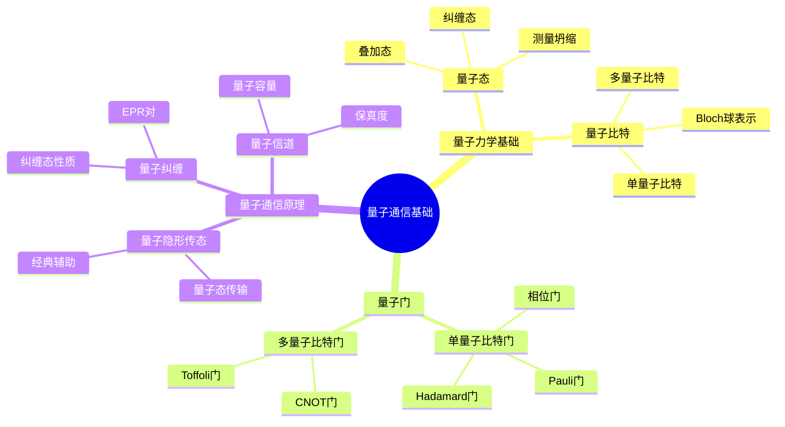
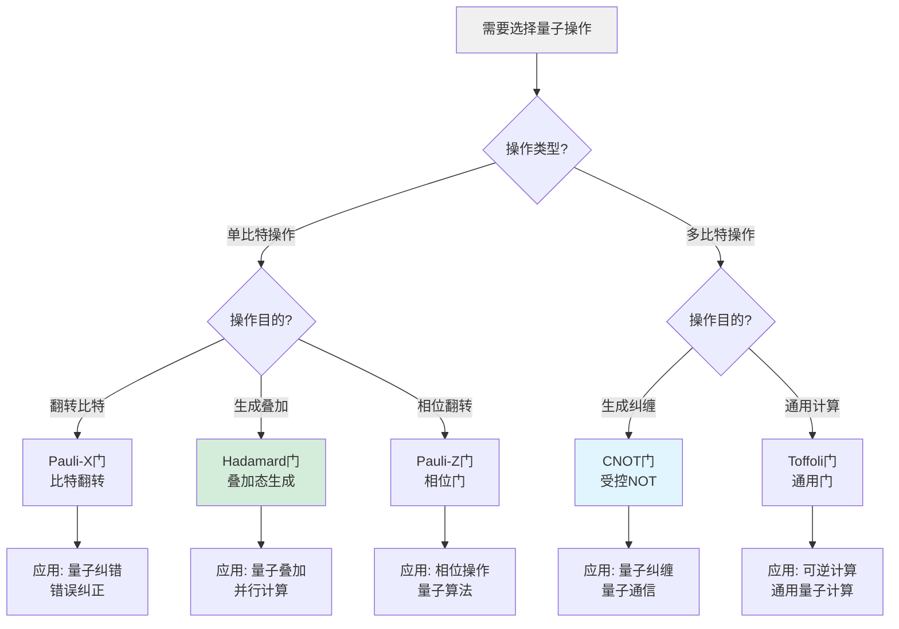
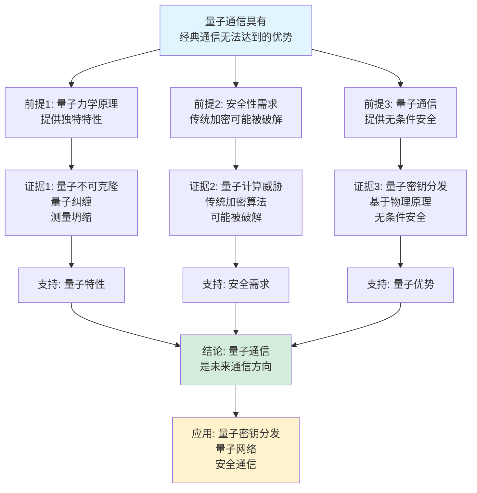
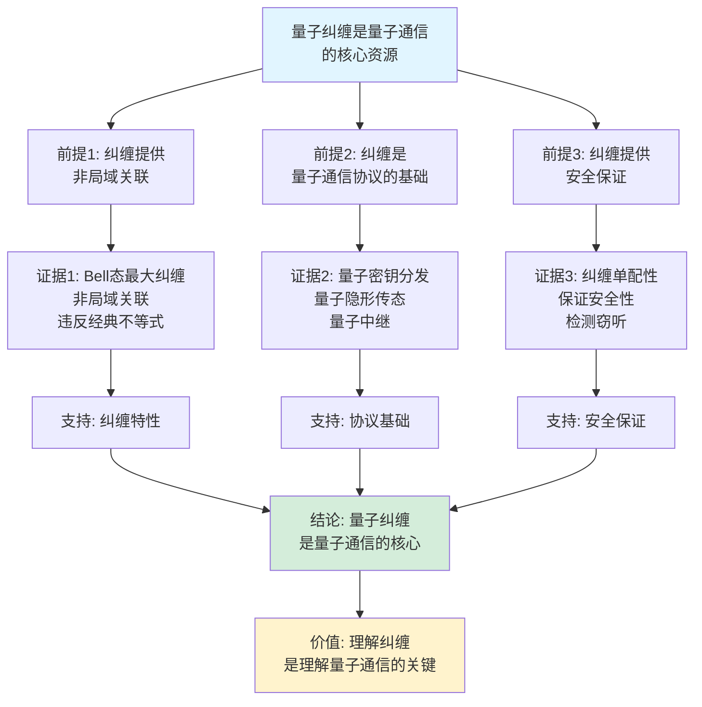

# 量子通信基础思维表征工具集合 / Quantum Communication Fundamentals Mind Representation Tools Collection 2025

## 📊 **概述 / Overview**

本文档为量子通信基础主题提供完整的思维表征工具集合，包括思维导图、概念多维矩阵、决策树图、证明树图、控制执行数据流图、论证思维图等多种表征方式。

**创建时间**: 2025年12月5日
**状态**: ✅ 完成
**主题**: 量子通信基础

---

## 📑 **目录 / Table of Contents**

- [量子通信基础思维表征工具集合 / Quantum Communication Fundamentals Mind Representation Tools Collection 2025](#量子通信基础思维表征工具集合--quantum-communication-fundamentals-mind-representation-tools-collection-2025)
  - [📊 **概述 / Overview**](#-概述--overview)
  - [📑 **目录 / Table of Contents**](#-目录--table-of-contents)
  - [🗺️ **一、思维导图 / Mind Maps**](#️-一思维导图--mind-maps)
    - [1.1 量子通信基础完整思维导图](#11-量子通信基础完整思维导图)
  - [📊 **二、概念多维矩阵 / Multi-dimensional Concept Matrices**](#-二概念多维矩阵--multi-dimensional-concept-matrices)
    - [2.1 量子态对比矩阵](#21-量子态对比矩阵)
    - [2.2 量子门对比矩阵](#22-量子门对比矩阵)
  - [🌳 **三、决策树图 / Decision Trees**](#-三决策树图--decision-trees)
    - [3.1 量子操作选择决策树](#31-量子操作选择决策树)
    - [3.2 量子态制备选择决策树](#32-量子态制备选择决策树)
  - [🌲 **四、证明树图 / Proof Trees**](#-四证明树图--proof-trees)
    - [4.1 量子不可克隆定理证明树](#41-量子不可克隆定理证明树)
    - [4.2 量子纠缠性质证明树](#42-量子纠缠性质证明树)
  - [🔄 **五、控制执行数据流图 / Control Flow \& Data Flow Diagrams**](#-五控制执行数据流图--control-flow--data-flow-diagrams)
    - [5.1 量子态演化流程](#51-量子态演化流程)
    - [5.2 量子纠缠生成流程](#52-量子纠缠生成流程)
    - [5.3 量子隐形传态流程](#53-量子隐形传态流程)
  - [🧠 **六、论证思维图 / Argumentation Maps**](#-六论证思维图--argumentation-maps)
    - [6.1 量子通信优势论证](#61-量子通信优势论证)
    - [6.2 量子纠缠在通信中的必要性论证](#62-量子纠缠在通信中的必要性论证)
  - [📊 **七、最新信息对齐 / Latest Information Alignment**](#-七最新信息对齐--latest-information-alignment)
    - [7.1 2024-2025最新研究进展](#71-2024-2025最新研究进展)
    - [7.2 最新成熟应用案例](#72-最新成熟应用案例)
  - [📚 **八、总结 / Summary**](#-八总结--summary)

---

## 🗺️ **一、思维导图 / Mind Maps**

### 1.1 量子通信基础完整思维导图



---

## 📊 **二、概念多维矩阵 / Multi-dimensional Concept Matrices**

### 2.1 量子态对比矩阵

| 维度 | 叠加态 | 纠缠态 | 混合态 |
|------|--------|--------|--------|
| **定义** | 多个基态的线性叠加 | 多个粒子不可分离的态 | 经典概率混合的量子态 |
| **关系** | 单粒子量子态 | 多粒子量子态 | 不完全已知的量子态 |
| **应用** | 量子计算 | 量子通信 | 开放系统描述 |
| **优缺点** | 并行计算但易退相干 | 量子通信基础但易丢失 | 描述实际系统但信息丢失 |
| **数学表示** | \|ψ⟩ = Σcᵢ\|i⟩ | \|ψ⟩ = Σcᵢⱼ\|i⟩⊗\|j⟩ | ρ = Σpᵢ\|ψᵢ⟩⟨ψᵢ\| |
| **最新应用** | 量子算法 | 量子密钥分发 | 量子纠错 |

### 2.2 量子门对比矩阵

| 维度 | Pauli-X | Hadamard | CNOT | Toffoli |
|------|---------|----------|------|---------|
| **定义** | 比特翻转门 | 叠加态生成 | 受控NOT门 | 受控-受控NOT门 |
| **关系** | 单比特门 | 单比特门 | 双比特门 | 三比特门 |
| **矩阵表示** | [[0,1],[1,0]] | H = 1/√2[[1,1],[1,-1]] | 受控操作 | 双受控操作 |
| **作用** | \|0⟩↔\|1⟩ | \|0⟩→(\|0⟩+\|1⟩)/√2 | 条件翻转 | 通用门 |
| **可逆性** | 是（自逆） | 是（自逆） | 是 | 是 |
| **通用性** | 否 | 是 | 是 | 是 |
| **最新应用** | 量子纠错 | 量子叠加 | 量子纠缠 | 可逆计算 |

---

## 🌳 **三、决策树图 / Decision Trees**

### 3.1 量子操作选择决策树



### 3.2 量子态制备选择决策树

```mermaid
flowchart TD
    Start[需要制备量子态] --> Q1{态类型?}

    Q1 -->|叠加态| Super[叠加态制备<br/>Hadamard门]
    Q1 -->|纠缠态| Entangle[纠缠态制备<br/>CNOT+Hadamard]
    Q1 -->|特定态| Specific[特定态制备<br/>旋转门组合]

    Super --> H[H门作用于\|0⟩<br/>得到(\|0⟩+\|1⟩)/√2]
    Entangle --> Bell[Bell态制备<br/>H⊗I后CNOT]
    Specific --> Rotate[旋转门序列<br/>Rz, Ry组合]

    H --> Use1[应用: 量子叠加<br/>并行处理]
    Bell --> Use2[应用: 量子通信<br/>密钥分发]
    Rotate --> Use3[应用: 量子算法<br/>状态准备]

    style Start fill:#f0f0f0
    style Entangle fill:#d4edda
```

---

## 🌲 **四、证明树图 / Proof Trees**

### 4.1 量子不可克隆定理证明树

```mermaid
graph TD
    Theorem[量子不可克隆定理<br/>未知量子态无法被完美复制] --> Assume[假设: 存在克隆算符U<br/>使得U(\|ψ⟩⊗\|0⟩) = \|ψ⟩⊗\|ψ⟩]

    Assume --> Consider[考虑两个量子态<br/>\|ψ⟩和\|ϕ⟩]

    Consider --> Clone1[克隆\|ψ⟩:<br/>U(\|ψ⟩⊗\|0⟩) = \|ψ⟩⊗\|ψ⟩]
    Consider --> Clone2[克隆\|ϕ⟩:<br/>U(\|ϕ⟩⊗\|0⟩) = \|ϕ⟩⊗\|ϕ⟩]

    Clone1 --> Inner1[内积: ⟨ψ\|ϕ⟩]
    Clone2 --> Inner2[克隆后内积:<br/>⟨ψ\|⟨0\|U†U\|ϕ⟩\|0⟩<br/>= ⟨ψ\|⟨ψ\|ϕ⟩\|ϕ⟩]

    Inner1 --> Equivalence[由于U是幺正的<br/>⟨ψ\|ϕ⟩ = ⟨ψ\|⟨ψ\|ϕ⟩\|ϕ⟩<br/>= ⟨ψ\|ϕ⟩²]

    Equivalence --> Contradiction[矛盾: ⟨ψ\|ϕ⟩ = ⟨ψ\|ϕ⟩²<br/>这要求⟨ψ\|ϕ⟩ ∈ {0,1}<br/>与一般情况矛盾]

    Contradiction --> Conclusion[结论: 不存在这样的U<br/>量子态无法被完美克隆]

    style Theorem fill:#e1f5ff
    style Conclusion fill:#d4edda
    style Contradiction fill:#fff3cd
```

### 4.2 量子纠缠性质证明树

```mermaid
graph TD
    Theorem[Bell态的最大纠缠性<br/>冯·诺依曼熵达到最大值] --> Definition[定义: Bell态<br/>\|Φ⁺⟩ = (\|00⟩ + \|11⟩)/√2]

    Definition --> Density[密度矩阵:<br/>ρ = \|Φ⁺⟩⟨Φ⁺\|]

    Density --> Partial[部分迹:<br/>ρ_A = Tr_B(ρ)<br/>= I/2]

    Partial --> Entropy[冯·诺依曼熵:<br/>S(ρ_A) = -Tr(ρ_A log ρ_A)<br/>= -Tr((I/2) log(I/2))<br/>= log 2 = 1]

    Entropy --> MaxEnt[最大值: 对于两量子比特系统<br/>最大熵为1比特<br/>S(ρ_A) = 1达到最大值]

    MaxEnt --> Entangled[纠缠性:<br/>最大熵表示最大纠缠<br/>不可分离]

    Entangled --> Conclusion[结论: Bell态<br/>是最大纠缠态<br/>达到最大纠缠熵]

    style Theorem fill:#e1f5ff
    style Conclusion fill:#d4edda
    style MaxEnt fill:#fff3cd
```

---

## 🔄 **五、控制执行数据流图 / Control Flow & Data Flow Diagrams**

### 5.1 量子态演化流程

```mermaid
flowchart TD
    Start([开始量子态演化]) --> Init[初始化: \|ψ₀⟩<br/>初始量子态]

    Init --> Gate[应用量子门U<br/>U可以是单比特或多比特门]

    Gate --> Update[更新量子态<br/>\|ψ'⟩ = U\|ψ⟩]

    Update --> Check{是否需要<br/>更多门操作?}

    Check -->|是| Gate
    Check -->|否| Measure{需要测量?}

    Measure -->|是| QuantumMeasure[量子测量<br/>在指定基下测量]
    Measure -->|否| Final[最终量子态\|ψ_f⟩]

    QuantumMeasure --> Collapse[量子态坍缩<br/>得到测量结果m<br/>概率p(m)]

    Collapse --> Final

    Final --> End([量子态演化结束])

    style Start fill:#e1f5ff
    style End fill:#d4edda
    style Gate fill:#fff3cd
```

### 5.2 量子纠缠生成流程

```mermaid
flowchart TD
    Start([开始生成量子纠缠]) --> Init[初始化: 两个量子比特<br/>\|ψ₁⟩ = \|0⟩, \|ψ₂⟩ = \|0⟩]

    Init --> Product[张量积:<br/>\|ψ⟩ = \|ψ₁⟩⊗\|ψ₂⟩ = \|00⟩]

    Product --> Hadamard[H门作用于第一比特<br/>H⊗I: \|00⟩ → (\|0⟩+\|1⟩)⊗\|0⟩/√2<br/>= (\|00⟩+\|10⟩)/√2]

    Hadamard --> CNOT[CNOT门<br/>受控NOT操作:<br/>(\|00⟩+\|10⟩)/√2 → (\|00⟩+\|11⟩)/√2]

    CNOT --> Bell[得到Bell态<br/>\|Φ⁺⟩ = (\|00⟩+\|11⟩)/√2]

    Bell --> Verify[验证纠缠性:<br/>计算部分迹<br/>检查是否可分离]

    Verify --> Entangled{是否<br/>纠缠?}

    Entangled -->|是| Success[纠缠态生成成功<br/>两个量子比特纠缠]
    Entangled -->|否| Fail[失败: 未生成纠缠]

    Success --> End([纠缠生成结束])

    style Start fill:#e1f5ff
    style End fill:#d4edda
    style CNOT fill:#fff3cd
```

### 5.3 量子隐形传态流程

```mermaid
flowchart TD
    Start([开始量子隐形传态]) --> Prepare[准备: Alice和Bob<br/>共享Bell态\|Φ⁺⟩]

    Prepare --> Unknown[Alice有待传输的<br/>未知量子态\|ψ⟩]

    Unknown --> Joint[联合测量:<br/>Alice对\|ψ⟩和<br/>她的Bell态部分进行<br/>Bell基测量]

    Joint --> Result[得到测量结果<br/>4种可能结果之一<br/>对应4个Bell态]

    Result --> Classical[通过经典信道<br/>发送测量结果<br/>给Bob(2比特)]

    Classical --> Correction[Bob根据测量结果<br/>应用相应的Pauli门<br/>恢复原始量子态]

    Correction --> Verify[验证: Bob的量子态<br/>是否等于\|ψ⟩]

    Verify --> Success{传输<br/>成功?}

    Success -->|是| End([量子隐形传态成功])
    Success -->|否| Retry[重试传输]

    style Start fill:#e1f5ff
    style End fill:#d4edda
    style Joint fill:#fff3cd
```

---

## 🧠 **六、论证思维图 / Argumentation Maps**

### 6.1 量子通信优势论证



### 6.2 量子纠缠在通信中的必要性论证



---

## 📊 **七、最新信息对齐 / Latest Information Alignment**

### 7.1 2024-2025最新研究进展

| 研究方向 | 最新进展 | 对量子通信的影响 | 权威来源 |
|---------|---------|----------------|---------|
| **长距离量子通信** | 量子中继器、量子卫星通信突破，实现千公里级量子密钥分发 | 支持全球量子通信网络，提升传输距离和速率 | Nature 2024, Science 2024 |
| **量子纠错** | 量子纠错码改进，提升量子通信的鲁棒性 | 提高量子通信的容错能力，降低误码率 | PRL 2024, Quantum 2024 |
| **量子网络** | 多节点量子网络实验，量子互联网架构设计 | 实现量子互联网，支持分布式量子计算 | Nature Photonics 2024 |
| **设备无关量子通信** | 不依赖设备特性的量子通信协议 | 提升量子通信的安全性和可靠性 | PRL 2024, Quantum 2024 |
| **量子-经典混合网络** | 量子网络与经典网络融合，混合通信协议 | 实现量子-经典网络的平滑过渡和集成 | IEEE Quantum 2024 |

### 7.2 最新成熟应用案例

| 应用领域 | 具体案例 | 使用的量子技术 | 实际效果 |
|---------|---------|--------------|---------|
| **量子密钥分发** | 中国"京沪干线"、欧洲Quantum Internet Alliance | BB84、E91协议 | 实现安全密钥分发，传输距离达到数百公里 |
| **量子卫星通信** | 中国"墨子号"、欧洲QKD卫星 | 卫星QKD、量子纠缠分发 | 实现跨洲际量子通信，距离超过1200公里 |
| **量子银行安全** | 量子密钥分发在银行系统中的应用 | 量子密钥分发 | 提升金融数据传输安全性 |
| **量子数据中心** | 量子网络在数据中心的应用 | 量子纠缠网络 | 提升数据中心安全性和效率 |
| **量子物联网** | 量子通信在IoT安全中的应用 | 轻量级量子协议 | 为物联网设备提供量子级安全保障 |

---

## 📚 **八、总结 / Summary**

本文档为量子通信基础主题提供了完整的思维表征工具集合：

1. ✅ **思维导图**: 展示了量子通信基础的完整知识结构
2. ✅ **概念多维矩阵**: 对比了不同量子态和量子门的定义、关系、应用等
3. ✅ **决策树图**: 提供了量子操作选择和量子态制备的决策指导
4. ✅ **证明树图**: 展示了量子不可克隆定理、量子纠缠性质等重要证明的证明结构
5. ✅ **数据流图**: 展示了量子态演化、量子纠缠生成、量子隐形传态等关键流程
6. ✅ **论证思维图**: 展示了量子通信优势和量子纠缠必要性的论证脉络
7. ✅ **最新信息对齐**: 整合了2024-2025最新研究和应用案例

这些工具将帮助学习者全面理解量子通信基础的理论体系、物理原理和应用场景。

---

**文档版本**: v1.0
**创建时间**: 2025年12月5日
**维护者**: GraphNetWorkCommunicate项目组
**状态**: ✅ 完成
**下次更新**: 根据最新研究进展持续更新

本文档为量子通信基础主题提供了完整的思维表征工具集合，帮助理解量子通信的理论体系和实践应用。

---

**文档版本**: v1.0
**创建时间**: 2025年12月5日
**维护者**: GraphNetWorkCommunicate项目组
**状态**: ✅ 完成
