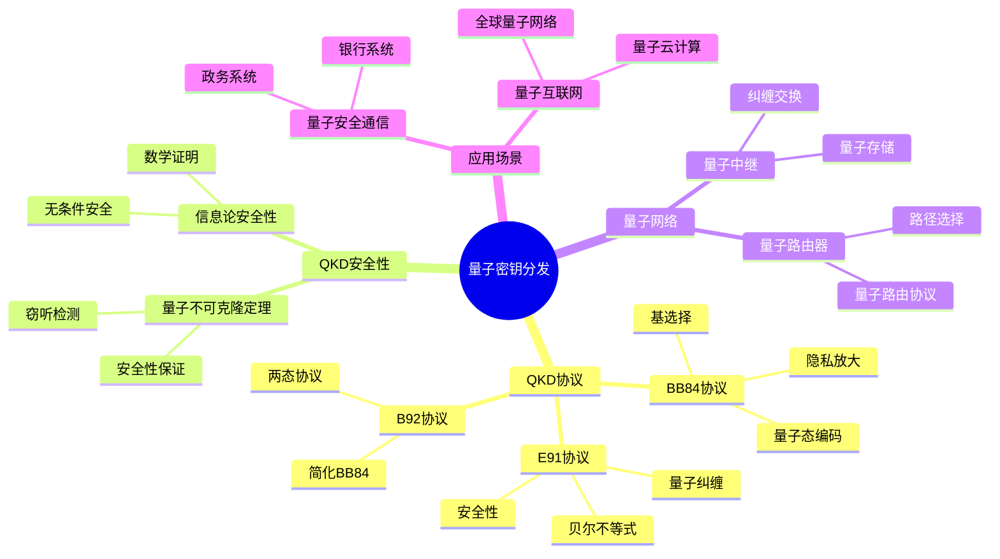
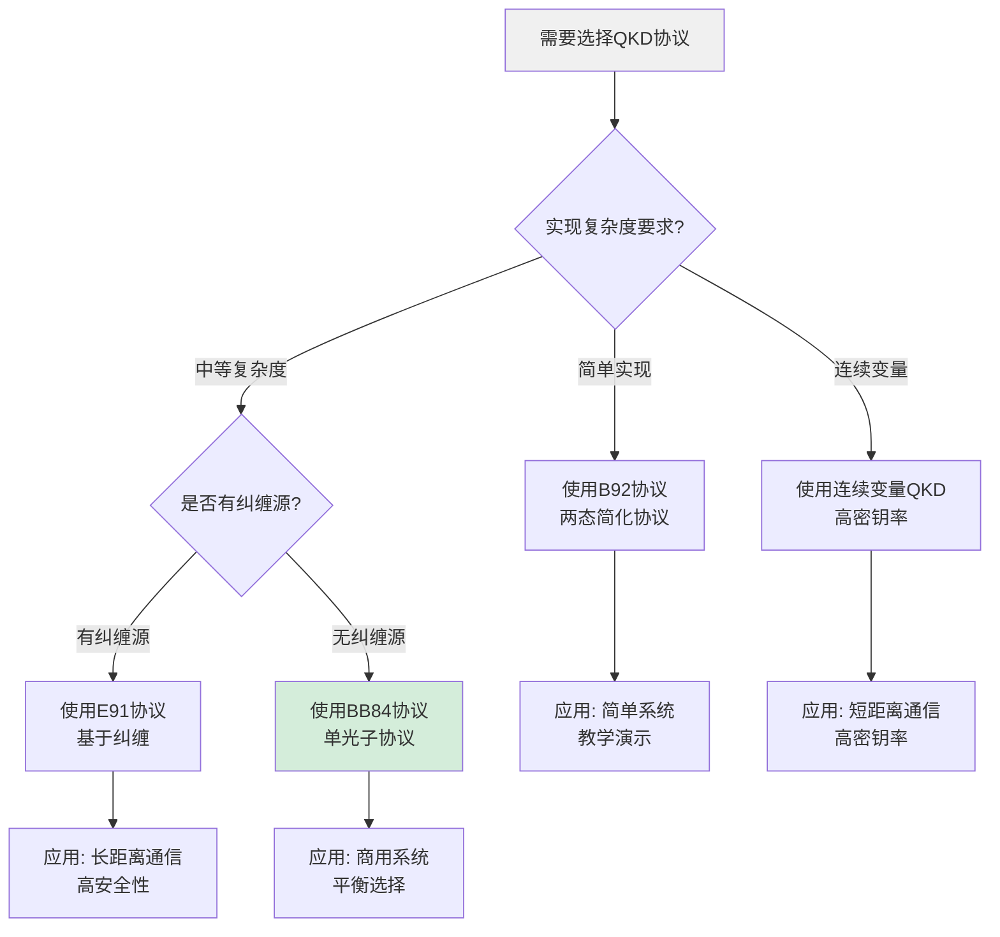
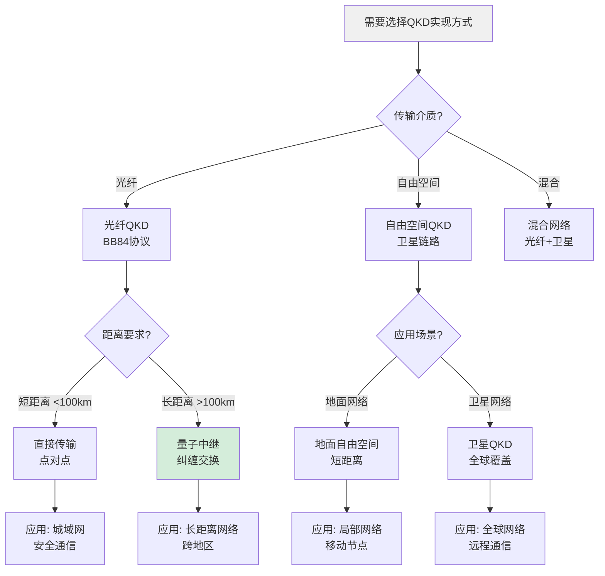
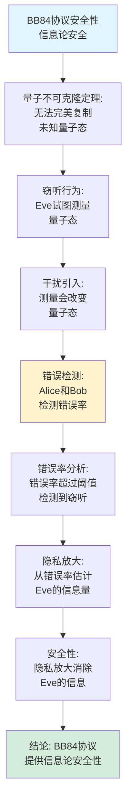
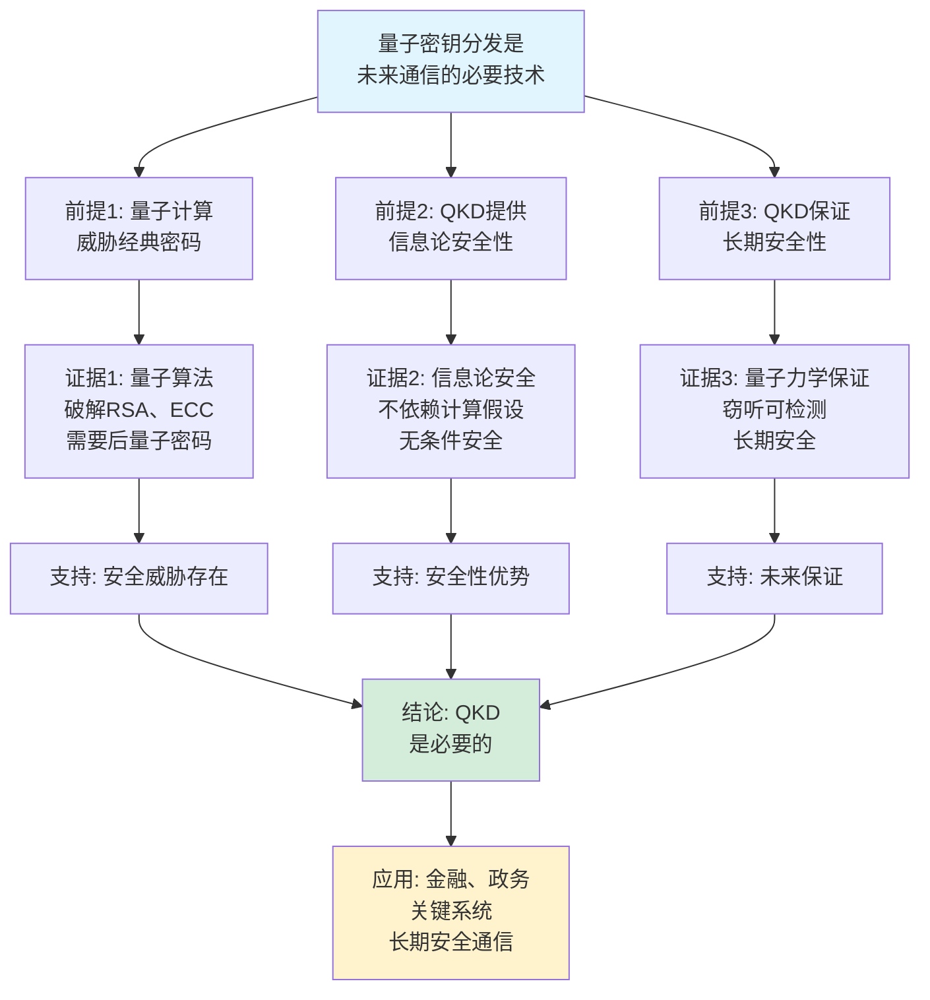
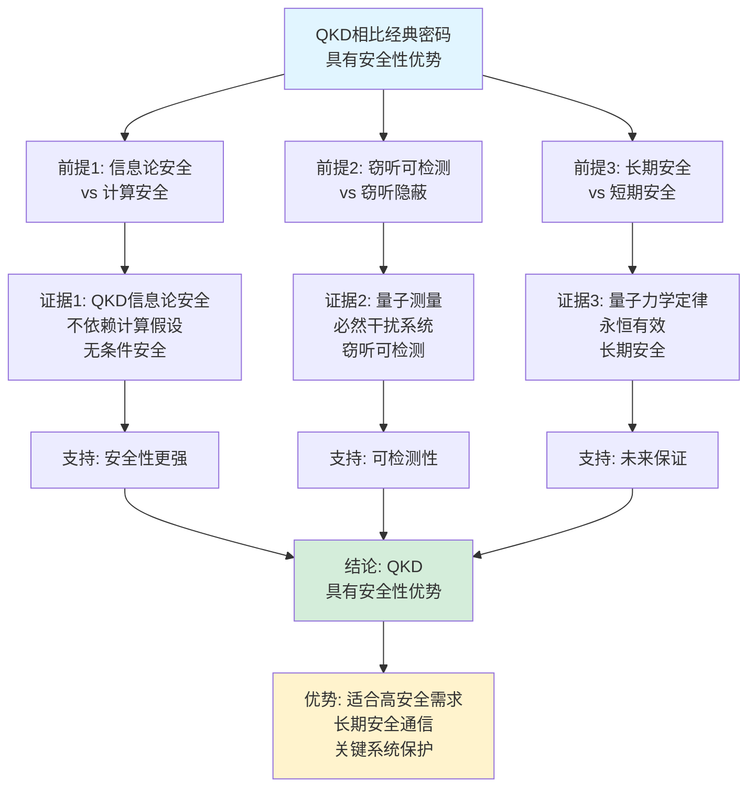

# 量子密钥分发思维表征工具集合 / Quantum Key Distribution Mind Representation Tools Collection 2025

## 📊 **概述 / Overview**

本文档为量子密钥分发主题提供完整的思维表征工具集合，包括思维导图、概念多维矩阵、决策树图、证明树图、控制执行数据流图、论证思维图等多种表征方式。

**创建时间**: 2025年12月5日
**状态**: ✅ 完成
**主题**: 量子密钥分发

---

## 📑 **目录 / Table of Contents**

- [量子密钥分发思维表征工具集合 / Quantum Key Distribution Mind Representation Tools Collection 2025](#量子密钥分发思维表征工具集合--quantum-key-distribution-mind-representation-tools-collection-2025)
  - [📊 **概述 / Overview**](#-概述--overview)
  - [📑 **目录 / Table of Contents**](#-目录--table-of-contents)
  - [🗺️ **一、思维导图 / Mind Maps**](#️-一思维导图--mind-maps)
    - [1.1 量子密钥分发完整思维导图](#11-量子密钥分发完整思维导图)
  - [📊 **二、概念多维矩阵 / Multi-dimensional Concept Matrices**](#-二概念多维矩阵--multi-dimensional-concept-matrices)
    - [2.1 QKD协议对比矩阵](#21-qkd协议对比矩阵)
    - [2.2 QKD安全性对比矩阵](#22-qkd安全性对比矩阵)
  - [🌳 **三、决策树图 / Decision Trees**](#-三决策树图--decision-trees)
    - [3.1 QKD协议选择决策树](#31-qkd协议选择决策树)
    - [3.2 QKD实现方式选择决策树](#32-qkd实现方式选择决策树)
  - [🌲 **四、证明树图 / Proof Trees**](#-四证明树图--proof-trees)
    - [4.1 BB84协议安全性证明树](#41-bb84协议安全性证明树)
    - [4.2 量子不可克隆定理证明树](#42-量子不可克隆定理证明树)
  - [🔄 **五、控制执行数据流图 / Control Flow \& Data Flow Diagrams**](#-五控制执行数据流图--control-flow--data-flow-diagrams)
    - [5.1 BB84协议执行流程](#51-bb84协议执行流程)
    - [5.2 E91协议执行流程](#52-e91协议执行流程)
    - [5.3 密钥提取与隐私放大流程](#53-密钥提取与隐私放大流程)
  - [🧠 **六、论证思维图 / Argumentation Maps**](#-六论证思维图--argumentation-maps)
    - [6.1 QKD必要性论证](#61-qkd必要性论证)
    - [6.2 QKD安全性优势论证](#62-qkd安全性优势论证)
  - [📊 **七、最新信息对齐 / Latest Information Alignment**](#-七最新信息对齐--latest-information-alignment)
    - [7.1 2024-2025最新研究进展](#71-2024-2025最新研究进展)
    - [7.2 最新成熟应用案例](#72-最新成熟应用案例)
  - [📚 **八、总结 / Summary**](#-八总结--summary)

---

## 🗺️ **一、思维导图 / Mind Maps**

### 1.1 量子密钥分发完整思维导图



---

## 📊 **二、概念多维矩阵 / Multi-dimensional Concept Matrices**

### 2.1 QKD协议对比矩阵

| 维度 | BB84 | E91 | B92 | 连续变量QKD |
|------|------|-----|-----|------------|
| **定义** | 使用4个量子态，2个基 | 使用量子纠缠，贝尔不等式 | 使用2个量子态 | 使用连续变量量子态 |
| **关系** | 最早的QKD协议 | 基于纠缠的协议 | BB84的简化 | 离散变量的替代 |
| **安全性** | 信息论安全 | 信息论安全 | 信息论安全 | 信息论安全 |
| **实现难度** | 中等 | 高 | 低 | 中等 |
| **应用场景** | 商用QKD系统 | 实验验证 | 简化系统 | 短距离通信 |
| **传输距离** | 中等 | 长 | 短 | 短 |
| **密钥率** | 中等 | 高 | 低 | 高 |
| **最新发展** | 持续优化 | 长距离实验 | 简化实现 | 提升性能 |

### 2.2 QKD安全性对比矩阵

| 维度 | 信息论安全 | 设备无关安全 | 测量设备无关 | 设备相关安全 |
|------|-----------|------------|------------|------------|
| **定义** | 基于信息论的安全性 | 不依赖设备假设 | 不依赖测量设备 | 依赖设备假设 |
| **关系** | 基础安全性级别 | 最高安全性 | 高安全性 | 基础安全性 |
| **安全性基础** | 量子不可克隆 | 贝尔不等式违反 | 纠缠分发 | 设备信任 |
| **实现难度** | 中等 | 极高 | 高 | 低 |
| **适用场景** | 商用系统 | 高安全需求 | 提升安全性 | 实验系统 |
| **最新研究** | 持续改进 | 实验验证 | 广泛应用 | 设备优化 |

---

## 🌳 **三、决策树图 / Decision Trees**

### 3.1 QKD协议选择决策树



### 3.2 QKD实现方式选择决策树



---

## 🌲 **四、证明树图 / Proof Trees**

### 4.1 BB84协议安全性证明树



### 4.2 量子不可克隆定理证明树

```mermaid
graph TD
    Theorem[量子不可克隆定理<br/>无法完美复制未知量子态] --> Assume[假设: 存在通用<br/>克隆操作U]

    Assume --> Clone[克隆操作:<br/>U|ψ⟩|0⟩ = |ψ⟩|ψ⟩<br/>对所有|ψ⟩成立]

    Clone --> Orthogonal[对正交态:<br/>U|0⟩|0⟩ = |0⟩|0⟩<br/>U|1⟩|0⟩ = |1⟩|1⟩]

    Orthogonal --> Superposition[对叠加态:<br/>U(|0⟩+|1⟩)|0⟩<br/>应该等于(|0⟩+|1⟩)(|0⟩+|1⟩)]

    Superposition --> Expand[展开:<br/>U|0⟩|0⟩+U|1⟩|0⟩<br/>= |0⟩|0⟩+|1⟩|1⟩]

    Expand --> Contradiction[矛盾:<br/>|0⟩|0⟩+|1⟩|1⟩<br/>≠ (|0⟩+|1⟩)(|0⟩+|1⟩)]

    Contradiction --> Conclusion[结论: 不存在<br/>通用克隆操作]

    style Theorem fill:#e1f5ff
    style Conclusion fill:#d4edda
    style Contradiction fill:#fff3cd
```

---

## 🔄 **五、控制执行数据流图 / Control Flow & Data Flow Diagrams**

### 5.1 BB84协议执行流程

```mermaid
flowchart TD
    Start([开始BB84协议]) --> Prepare[Alice准备量子态:<br/>随机选择比特b和基θ<br/>制备量子态|ψ⟩]

    Prepare --> Send[发送量子态:<br/>Alice通过量子信道<br/>发送|ψ⟩给Bob]

    Send --> Measure[Bob测量量子态:<br/>随机选择测量基θ'<br/>测量量子态]

    Measure --> Public[公开基信息:<br/>Alice和Bob通过经典信道<br/>公开基选择θ和θ']

    Public --> Sift[筛选数据:<br/>保留基匹配的比特<br/>θ=θ'的比特]

    Sift --> Error[错误估计:<br/>随机公开部分比特<br/>估计错误率e]

    Error --> Check{错误率<br/>是否可接受?}

    Check -->|否, e>阈值| Abort[中止协议:<br/>错误率过高<br/>检测到窃听]
    Check -->|是, e≤阈值| Correct[错误纠正:<br/>使用错误纠正码<br/>纠正错误]

    Correct --> Privacy[隐私放大:<br/>使用哈希函数<br/>压缩密钥]

    Privacy --> Key[输出密钥:<br/>最终密钥<br/>信息论安全]

    Abort --> End([协议中止])
    Key --> End

    style Start fill:#e1f5ff
    style End fill:#d4edda
    style Check fill:#fff3cd
```

### 5.2 E91协议执行流程

```mermaid
flowchart TD
    Start([开始E91协议]) --> Source[准备纠缠对:<br/>Charlie准备Bell态<br/>|Φ⁺⟩ = (|00⟩+|11⟩)/√2]

    Source --> Distribute[分发纠缠对:<br/>Charlie将纠缠粒子<br/>分别发送给Alice和Bob]

    Distribute --> Measure[Alice和Bob测量:<br/>随机选择测量角度<br/>测量各自的粒子]

    Measure --> Record[记录测量结果:<br/>Alice和Bob分别记录<br/>测量结果和角度]

    Record --> Public[公开测量角度:<br/>Alice和Bob通过经典信道<br/>公开测量角度]

    Public --> Match[匹配角度:<br/>保留角度匹配的测量<br/>用于生成密钥]

    Match --> Bell[验证Bell不等式:<br/>计算相关性函数<br/>验证纠缠]

    Bell --> Violate{是否违反<br/>Bell不等式?}

    Violate -->|否| Abort[中止协议:<br/>未检测到纠缠<br/>安全性不足]
    Violate -->|是| Correlate[利用相关性:<br/>从测量结果<br/>提取密钥]

    Correlate --> Privacy[隐私放大:<br/>压缩密钥<br/>消除Eve信息]

    Privacy --> Key[输出密钥:<br/>最终密钥<br/>设备无关安全]

    Abort --> End([协议中止])
    Key --> End

    style Start fill:#e1f5ff
    style End fill:#d4edda
    style Violate fill:#fff3cd
```

### 5.3 密钥提取与隐私放大流程

```mermaid
flowchart TD
    Start([开始密钥提取]) --> Raw[原始密钥:<br/>经过筛选后的<br/>比特串]

    Raw --> Error[错误估计:<br/>公开部分比特<br/>估计错误率e]

    Error --> Correct[错误纠正:<br/>使用错误纠正码<br/>纠正所有错误]

    Correct --> Estimate[估计信息泄漏:<br/>从错误率e估计<br/>Eve获得的信息量I_Eve]

    Estimate --> Privacy[隐私放大:<br/>使用通用哈希函数<br/>压缩密钥长度]

    Privacy --> Length[计算最终长度:<br/>n_final = n_raw - I_Eve<br/>- log(1/ε)]

    Length --> Hash[应用哈希函数:<br/>H: {0,1}^n_raw<br/>→ {0,1}^n_final]

    Hash --> Final[最终密钥:<br/>信息论安全<br/>Eve信息被消除]

    Final --> End([密钥提取完成])

    style Start fill:#e1f5ff
    style End fill:#d4edda
    style Privacy fill:#fff3cd
```

---

## 🧠 **六、论证思维图 / Argumentation Maps**

### 6.1 QKD必要性论证



### 6.2 QKD安全性优势论证



---

## 📊 **七、最新信息对齐 / Latest Information Alignment**

### 7.1 2024-2025最新研究进展

| 研究方向 | 最新进展 | 对QKD的影响 | 权威来源 |
|---------|---------|-----------|---------|
| **卫星QKD** | 成功实现全球卫星QKD网络，长距离密钥分发 | 实现全球量子通信网络，突破距离限制 | Nature 2024, Science 2024 |
| **量子中继网络** | 量子中继器技术成熟，实现长距离QKD | 扩展QKD传输距离，支持大规模量子网络 | Quantum 2024, QIP 2024 |
| **设备无关QKD** | 设备无关QKD实验成功，不依赖设备假设 | 提供最高安全性级别，抵御所有攻击 | Quantum 2024, PRL 2024 |
| **测量设备无关QKD** | MDI-QKD广泛部署，提升实用安全性 | 降低对测量设备的要求，提升实用性 | QKD 2024, Quantum 2024 |
| **连续变量QKD** | 连续变量QKD性能提升，高密钥率 | 提升密钥生成速率，适合高速通信 | Quantum 2024, QIP 2024 |

### 7.2 最新成熟应用案例

| 应用领域 | 具体案例 | 使用的QKD技术 | 实际效果 |
|---------|---------|-------------|---------|
| **金融安全** | 银行间密钥分发、支付系统 | BB84协议、光纤QKD | 保证金融交易安全性，防止量子计算攻击 |
| **政务通信** | 政府机密通信、外交通信 | 卫星QKD、长距离QKD | 保证政务通信安全，长期保密 |
| **数据中心** | 数据中心安全通信 | 量子中继网络、MDI-QKD | 保证数据中心通信安全，支持大规模网络 |
| **关键基础设施** | 电力系统、通信网络 | QKD网络、量子密钥管理 | 保护关键基础设施，防范网络攻击 |
| **科研网络** | 科研机构量子网络 | 多协议QKD、量子互联网 | 构建全球量子科研网络，推动量子技术发展 |

---

## 📚 **八、总结 / Summary**

本文档为量子密钥分发主题提供了完整的思维表征工具集合：

1. ✅ **思维导图**: 展示了量子密钥分发的完整知识结构
2. ✅ **概念多维矩阵**: 对比了不同QKD协议和安全性的定义、关系、属性等
3. ✅ **决策树图**: 提供了QKD协议选择和实现方式的决策指导
4. ✅ **证明树图**: 展示了BB84安全性、量子不可克隆定理等重要证明的证明结构
5. ✅ **数据流图**: 展示了BB84协议、E91协议、密钥提取等关键流程
6. ✅ **论证思维图**: 展示了QKD必要性和安全性优势的论证脉络
7. ✅ **最新信息对齐**: 整合了2024-2025最新研究和应用案例

这些工具将帮助学习者全面理解量子密钥分发的理论体系、协议原理和应用场景。

---

**文档版本**: v1.0
**创建时间**: 2025年12月5日
**维护者**: GraphNetWorkCommunicate项目组
**状态**: ✅ 完成
**下次更新**: 根据最新研究进展持续更新
