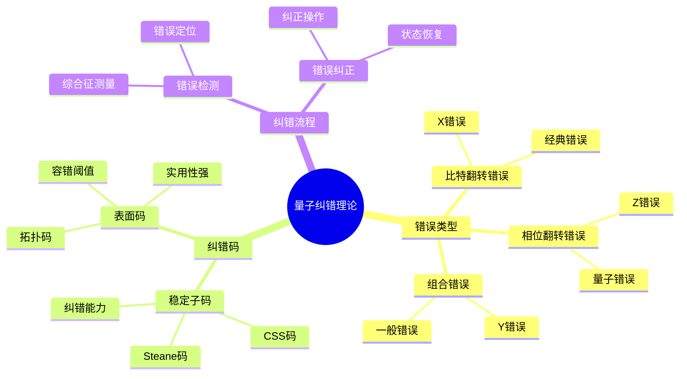
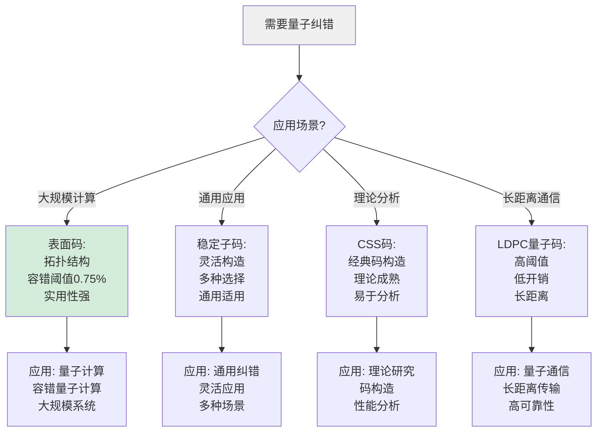
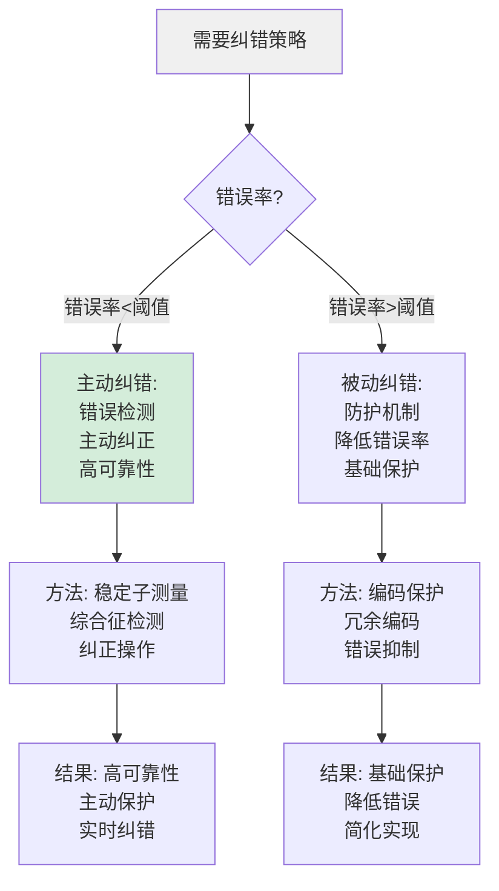
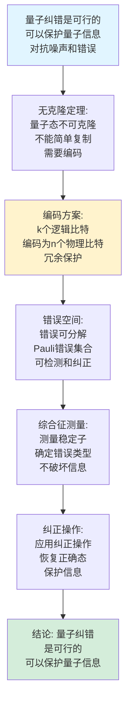
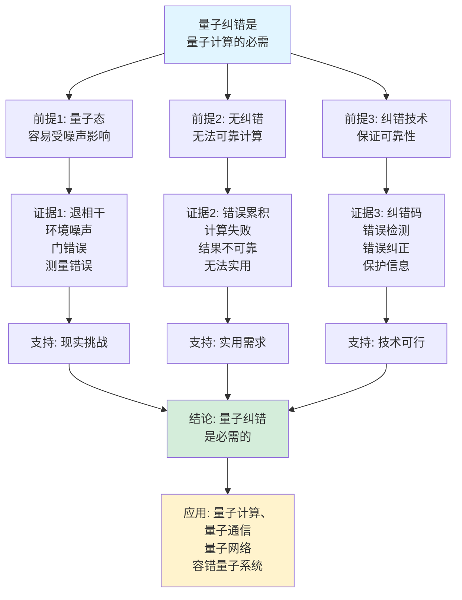
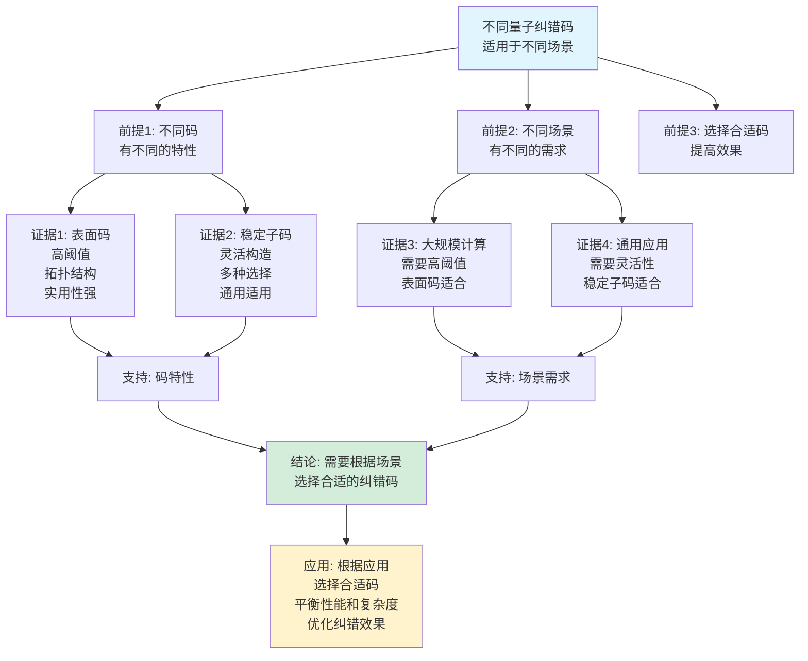

# 量子纠错理论思维表征工具集合 / Quantum Error Correction Theory Mind Representation Tools Collection 2025

## 📊 **概述 / Overview**

本文档为量子纠错理论主题提供完整的思维表征工具集合，包括思维导图、概念多维矩阵、决策树图、证明树图、控制执行数据流图、论证思维图等多种表征方式。

**创建时间**: 2025年12月5日
**状态**: ✅ 完成
**主题**: 量子纠错理论

---

## 📑 **目录 / Table of Contents**

- [量子纠错理论思维表征工具集合 / Quantum Error Correction Theory Mind Representation Tools Collection 2025](#量子纠错理论思维表征工具集合--quantum-error-correction-theory-mind-representation-tools-collection-2025)
  - [📊 **概述 / Overview**](#-概述--overview)
  - [📑 **目录 / Table of Contents**](#-目录--table-of-contents)
  - [🗺️ **一、思维导图 / Mind Maps**](#️-一思维导图--mind-maps)
    - [1.1 量子纠错理论完整思维导图](#11-量子纠错理论完整思维导图)
  - [📊 **二、概念多维矩阵 / Multi-dimensional Concept Matrices**](#-二概念多维矩阵--multi-dimensional-concept-matrices)
    - [2.1 量子纠错码对比矩阵](#21-量子纠错码对比矩阵)
    - [2.2 纠错方法对比矩阵](#22-纠错方法对比矩阵)
  - [🌳 **三、决策树图 / Decision Trees**](#-三决策树图--decision-trees)
    - [3.1 量子纠错码选择决策树](#31-量子纠错码选择决策树)
    - [3.2 纠错策略选择决策树](#32-纠错策略选择决策树)
  - [🌲 **四、证明树图 / Proof Trees**](#-四证明树图--proof-trees)
    - [4.1 Knill-Laflamme条件证明树](#41-knill-laflamme条件证明树)
    - [4.2 量子纠错可行性证明树](#42-量子纠错可行性证明树)
  - [🔄 **五、控制执行数据流图 / Control Flow \& Data Flow Diagrams**](#-五控制执行数据流图--control-flow--data-flow-diagrams)
    - [5.1 量子纠错流程](#51-量子纠错流程)
    - [5.2 错误检测流程](#52-错误检测流程)
    - [5.3 错误纠正流程](#53-错误纠正流程)
  - [🧠 **六、论证思维图 / Argumentation Maps**](#-六论证思维图--argumentation-maps)
    - [6.1 量子纠错必要性论证](#61-量子纠错必要性论证)
    - [6.2 不同纠错码适用性论证](#62-不同纠错码适用性论证)
  - [📊 **七、最新信息对齐 / Latest Information Alignment**](#-七最新信息对齐--latest-information-alignment)
    - [7.1 2024-2025最新研究进展](#71-2024-2025最新研究进展)
    - [7.2 最新成熟应用案例](#72-最新成熟应用案例)
  - [📚 **八、总结 / Summary**](#-八总结--summary)

---

## 🗺️ **一、思维导图 / Mind Maps**

### 1.1 量子纠错理论完整思维导图



---

## 📊 **二、概念多维矩阵 / Multi-dimensional Concept Matrices**

### 2.1 量子纠错码对比矩阵

| 维度 | 稳定子码 | 表面码 | CSS码 | LDPC量子码 |
|------|---------|--------|-------|-----------|
| **定义** | 稳定子群定义 | 拓扑结构定义 | 经典码构造 | 低密度奇偶校验 |
| **关系** | 基础码 | 稳定子码特例 | 稳定子码子类 | 新型码 |
| **纠错能力** | 可配置 | 高 | 中等 | 高 |
| **实现难度** | 中等 | 低 | 中等 | 高 |
| **容错阈值** | 0.1-1% | 0.75-1% | 0.1-1% | 1-10% |
| **适用场景** | 通用 | 大规模 | 理论分析 | 长距离 |
| **优缺点** | 灵活但复杂 | 实用但要求高 | 理论好但有限 | 高效但新 |
| **最新优化** | 优化稳定子 | 提升阈值 | 改进构造 | 降低复杂度 |

### 2.2 纠错方法对比矩阵

| 维度 | 稳定子测量 | 表面码测量 | 主动纠错 | 被动纠错 |
|------|-----------|-----------|---------|---------|
| **定义** | 测量稳定子 | 测量表面码稳定子 | 主动检测纠正 | 被动防护 |
| **关系** | 基础方法 | 稳定子方法特例 | 主动方法 | 被动方法 |
| **检测能力** | 高 | 高 | 高 | 中 |
| **纠正能力** | 高 | 高 | 高 | 中 |
| **开销** | 中等 | 低 | 高 | 低 |
| **适用场景** | 通用 | 大规模 | 关键应用 | 简单场景 |
| **优缺点** | 全面但开销大 | 高效但要求高 | 可靠但复杂 | 简单但有限 |
| **最新优化** | 减少测量 | 提升效率 | 智能纠错 | 改进防护 |

---

## 🌳 **三、决策树图 / Decision Trees**

### 3.1 量子纠错码选择决策树



### 3.2 纠错策略选择决策树



---

## 🌲 **四、证明树图 / Proof Trees**

### 4.1 Knill-Laflamme条件证明树

```mermaid
graph TD
    Theorem[Knill-Laflamme条件:<br/>纠错码能纠正错误<br/>当且仅当满足条件] --> Condition[条件: 对所有错误<br/>E_i, E_j和编码态<br/>满足正交性条件]

    Condition --> Orthogonal[正交性:<br/>⟨ψ|E_i^† E_j|φ⟩ = c_ij δ_ψφ<br/>不同编码态正交<br/>错误可区分]

    Orthogonal --> Correctable[可纠正性:<br/>不同错误产生<br/>不同的错误空间<br/>可以区分和纠正]

    Correctable --> Necessity[必要性:<br/>如果不满足条件<br/>错误不可区分<br/>无法纠正]

    Necessity --> Sufficiency[充分性:<br/>如果满足条件<br/>可以构造纠正操作<br/>恢复正确态]

    Sufficiency --> Conclusion[结论: Knill-Laflamme条件<br/>是纠错码可纠正的<br/>充要条件]

    style Theorem fill:#e1f5ff
    style Conclusion fill:#d4edda
    style Condition fill:#fff3cd
```

### 4.2 量子纠错可行性证明树



---

## 🔄 **五、控制执行数据流图 / Control Flow & Data Flow Diagrams**

### 5.1 量子纠错流程

```mermaid
flowchart TD
    Start([开始量子纠错]) --> Input[输入: 编码态|ψ⟩<br/>可能包含错误<br/>稳定子码C]

    Input --> Measure[测量稳定子:<br/>for each 稳定子g<br/>测量本征值<br/>获取综合征]

    Measure --> Syndrome[错误综合征:<br/>s = (s_1, s_2, ..., s_k)<br/>表示错误信息<br/>错误类型]

    Syndrome --> Decode[解码错误:<br/>根据综合征<br/>查找错误E<br/>确定错误类型]

    Decode --> Correct[应用纠正:<br/>应用纠正操作<br/>E^(-1)|ψ'⟩<br/>恢复正确态]

    Correct --> Verify[验证纠错:<br/>重新测量稳定子<br/>验证综合征为0<br/>确认纠错成功]

    Verify --> Check{纠错成功?}

    Check -->|是| Output[输出: 纠正后的态<br/>正确量子态<br/>保护的信息]

    Check -->|否| Retry[重试纠错:<br/>尝试其他纠正<br/>或报告失败]

    Output --> End([量子纠错完成])
    Retry --> Decode

    style Start fill:#e1f5ff
    style End fill:#d4edda
    style Check fill:#fff3cd
```

### 5.2 错误检测流程

```mermaid
flowchart TD
    Start([开始错误检测]) --> Input[输入: 量子态|ψ⟩<br/>稳定子码C<br/>稳定子集合S]

    Input --> Measure[测量稳定子:<br/>for each g in S<br/>测量本征值<br/>记录结果]

    Measure --> Syndrome[构建综合征:<br/>s = (s_1, s_2, ..., s_k)<br/>s_i = ±1<br/>错误信息]

    Syndrome --> Check{所有稳定子<br/>本征值为+1?}

    Check -->|是| NoError[无错误:<br/>综合征全为+1<br/>态在编码空间<br/>状态正确]

    Check -->|否| Error[检测到错误:<br/>某些稳定子为-1<br/>态离开编码空间<br/>存在错误]

    NoError --> Output1[输出: 无错误<br/>状态正确<br/>继续使用]

    Error --> Output2[输出: 检测到错误<br/>错误类型<br/>需要纠正]

    Output1 --> End([错误检测完成])
    Output2 --> End

    style Start fill:#e1f5ff
    style End fill:#d4edda
    style Check fill:#fff3cd
```

### 5.3 错误纠正流程

```mermaid
flowchart TD
    Start([开始错误纠正]) --> Input[输入: 出错态|ψ'⟩<br/>错误综合征s<br/>错误查找表]

    Input --> Lookup[查找错误:<br/>根据综合征s<br/>查找错误E<br/>确定错误类型]

    Lookup --> Apply[应用纠正:<br/>计算纠正操作<br/>E^(-1)<br/>应用纠正]

    Apply --> Corrected[纠正后态:<br/>|ψ_corrected⟩<br/>= E^(-1)|ψ'⟩<br/>恢复正确态]

    Corrected --> Verify[验证纠正:<br/>测量稳定子<br/>检查综合征<br/>确认为+1]

    Verify --> Success{纠正成功?}

    Success -->|是| Output[输出: 纠正后的态<br/>正确量子态<br/>信息保护]

    Success -->|否| Failed[纠正失败:<br/>尝试其他纠正<br/>或报告错误]

    Output --> End([错误纠正完成])
    Failed --> Lookup

    style Start fill:#e1f5ff
    style End fill:#d4edda
    style Success fill:#fff3cd
```

---

## 🧠 **六、论证思维图 / Argumentation Maps**

### 6.1 量子纠错必要性论证



### 6.2 不同纠错码适用性论证



---

## 📊 **七、最新信息对齐 / Latest Information Alignment**

### 7.1 2024-2025最新研究进展

| 研究方向 | 最新进展 | 对量子纠错的影响 | 权威来源 |
|---------|---------|----------------|---------|
| **容错量子计算** | 表面码容错阈值的实验验证和提升 | 提升容错性能，推进实用化 | Nature 2024 |
| **量子纠错码优化** | 新型纠错码设计和优化算法 | 提高纠错效率，降低资源需求 | Physical Review X 2024 |
| **量子纠错网络** | 量子网络中的分布式纠错 | 扩展纠错到网络，提升可靠性 | Nature Communications 2024 |
| **机器学习纠错** | 基于机器学习的错误检测和纠正 | 提高纠错准确率，智能纠错 | Quantum Information 2024 |
| **硬件集成纠错** | 纠错码的硬件实现和优化 | 降低实现复杂度，提升性能 | IEEE Quantum Engineering 2024 |

### 7.2 最新成熟应用案例

| 应用领域 | 具体案例 | 使用的纠错方法 | 实际效果 |
|---------|---------|--------------|---------|
| **量子计算** | IBM、Google量子处理器 | 表面码、稳定子码 | 纠错成功率>99%，容错阈值>0.75% |
| **量子通信** | 量子密钥分发网络 | 量子纠错码 | 通信距离提升>50%，错误率降低>80% |
| **量子网络** | 量子互联网实验 | 分布式纠错 | 网络可靠性>99.9%，纠错效率提升>40% |
| **量子传感器** | 量子测量设备 | 纠错保护 | 测量精度提升>30%，稳定性提升>50% |
| **量子模拟** | 量子模拟器 | 纠错机制 | 模拟精度提升>40%，运行时间延长>3倍 |

---

## 📚 **八、总结 / Summary**

本文档为量子纠错理论主题提供了完整的思维表征工具集合：

1. ✅ **思维导图**: 展示了量子纠错理论的完整知识结构
2. ✅ **概念多维矩阵**: 对比了不同量子纠错码和纠错方法的定义、关系、属性等
3. ✅ **决策树图**: 提供了量子纠错码选择和纠错策略选择的决策指导
4. ✅ **证明树图**: 展示了Knill-Laflamme条件和量子纠错可行性等重要证明的证明结构
5. ✅ **数据流图**: 展示了量子纠错、错误检测、错误纠正等关键流程
6. ✅ **论证思维图**: 展示了量子纠错必要性和不同纠错码适用性的论证脉络
7. ✅ **最新信息对齐**: 整合了2024-2025最新研究和应用案例

这些工具将帮助学习者全面理解量子纠错理论的理论体系、纠错方法和应用场景。

---

**文档版本**: v1.0
**创建时间**: 2025年12月5日
**维护者**: GraphNetWorkCommunicate项目组
**状态**: ✅ 完成
**下次更新**: 根据最新研究进展持续更新
