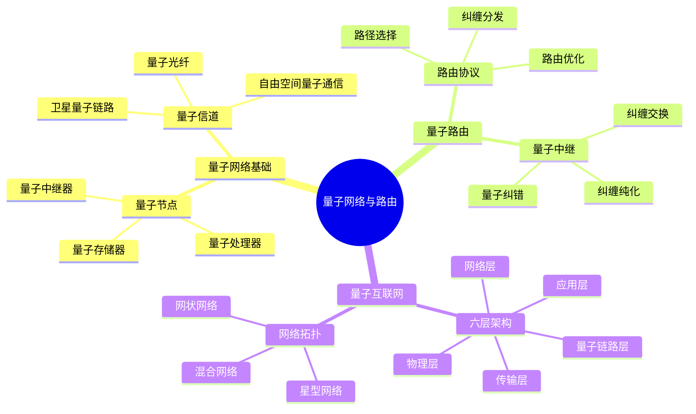
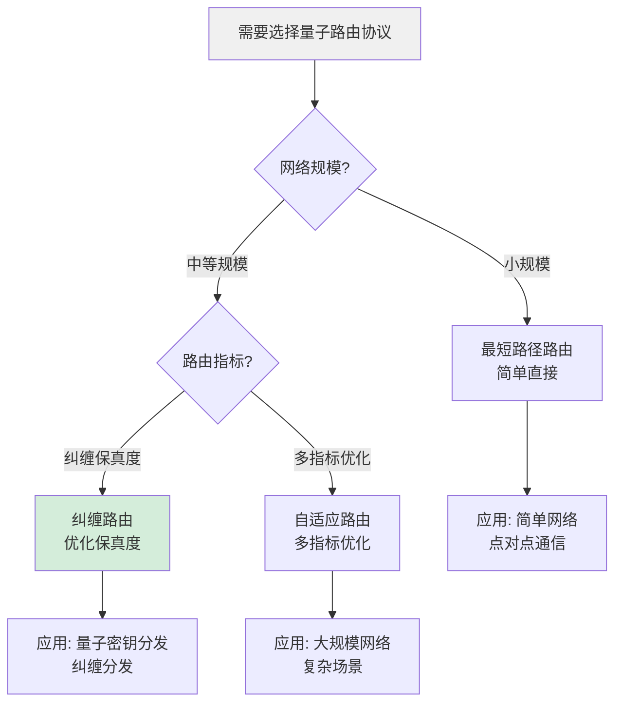
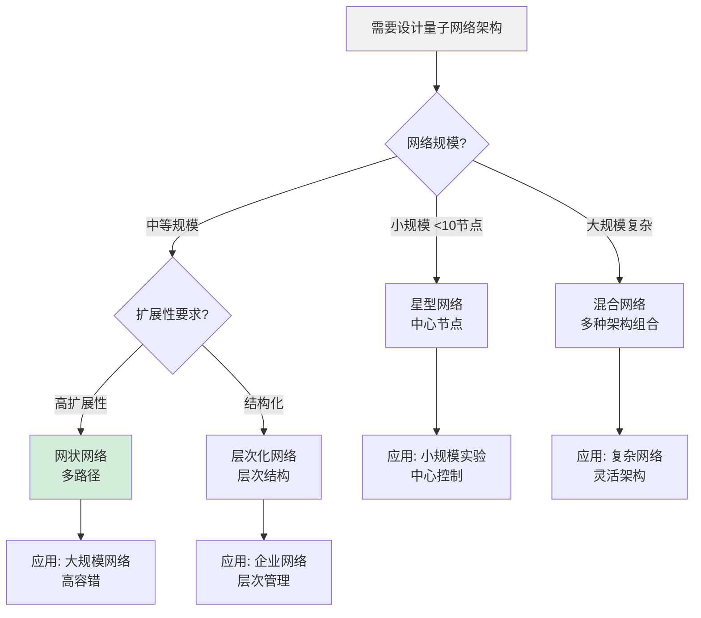
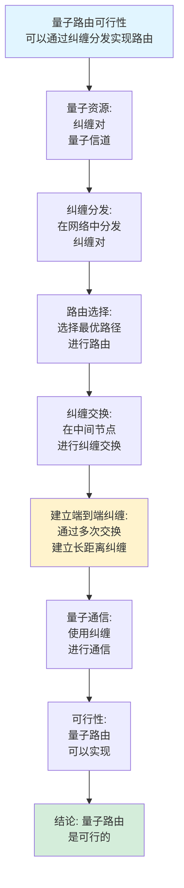
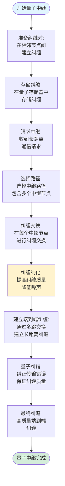
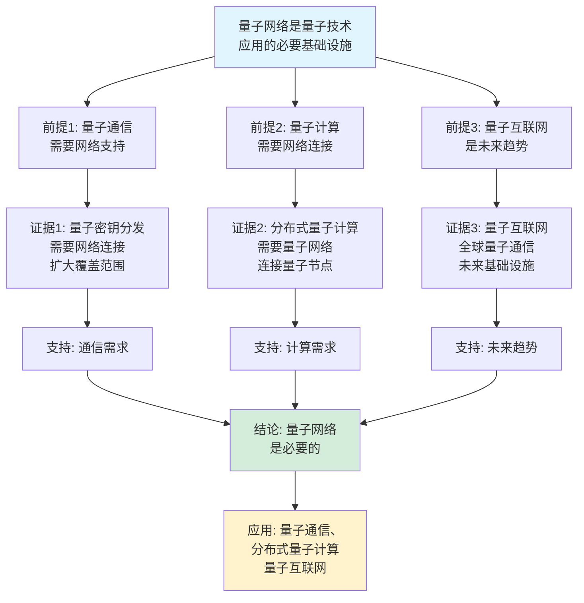
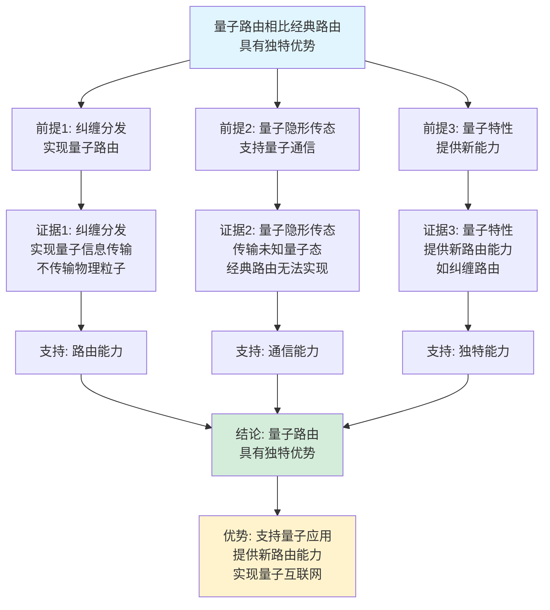

# 量子网络与路由思维表征工具集合 / Quantum Networks and Routing Mind Representation Tools Collection 2025

## 📊 **概述 / Overview**

本文档为量子网络与路由主题提供完整的思维表征工具集合，包括思维导图、概念多维矩阵、决策树图、证明树图、控制执行数据流图、论证思维图等多种表征方式。

**创建时间**: 2025年12月5日
**状态**: ✅ 完成
**主题**: 量子网络与路由

---

## 📑 **目录 / Table of Contents**

- [量子网络与路由思维表征工具集合 / Quantum Networks and Routing Mind Representation Tools Collection 2025](#量子网络与路由思维表征工具集合--quantum-networks-and-routing-mind-representation-tools-collection-2025)
  - [📊 **概述 / Overview**](#-概述--overview)
  - [📑 **目录 / Table of Contents**](#-目录--table-of-contents)
  - [🗺️ **一、思维导图 / Mind Maps**](#️-一思维导图--mind-maps)
    - [1.1 量子网络与路由完整思维导图](#11-量子网络与路由完整思维导图)
  - [📊 **二、概念多维矩阵 / Multi-dimensional Concept Matrices**](#-二概念多维矩阵--multi-dimensional-concept-matrices)
    - [2.1 量子路由协议对比矩阵](#21-量子路由协议对比矩阵)
    - [2.2 量子网络架构对比矩阵](#22-量子网络架构对比矩阵)
  - [🌳 **三、决策树图 / Decision Trees**](#-三决策树图--decision-trees)
    - [3.1 量子路由协议选择决策树](#31-量子路由协议选择决策树)
    - [3.2 量子网络架构选择决策树](#32-量子网络架构选择决策树)
  - [🌲 **四、证明树图 / Proof Trees**](#-四证明树图--proof-trees)
    - [4.1 纠缠交换正确性证明树](#41-纠缠交换正确性证明树)
    - [4.2 量子路由可行性证明树](#42-量子路由可行性证明树)
  - [🔄 **五、控制执行数据流图 / Control Flow \& Data Flow Diagrams**](#-五控制执行数据流图--control-flow--data-flow-diagrams)
    - [5.1 纠缠分发路由流程](#51-纠缠分发路由流程)
    - [5.2 量子中继流程](#52-量子中继流程)
    - [5.3 量子隐形传态路由流程](#53-量子隐形传态路由流程)
  - [🧠 **六、论证思维图 / Argumentation Maps**](#-六论证思维图--argumentation-maps)
    - [6.1 量子网络必要性论证](#61-量子网络必要性论证)
    - [6.2 量子路由优势论证](#62-量子路由优势论证)
  - [📊 **七、最新信息对齐 / Latest Information Alignment**](#-七最新信息对齐--latest-information-alignment)
    - [7.1 2024-2025最新研究进展](#71-2024-2025最新研究进展)
    - [7.2 最新成熟应用案例](#72-最新成熟应用案例)
  - [📚 **八、总结 / Summary**](#-八总结--summary)

---

## 🗺️ **一、思维导图 / Mind Maps**

### 1.1 量子网络与路由完整思维导图



---

## 📊 **二、概念多维矩阵 / Multi-dimensional Concept Matrices**

### 2.1 量子路由协议对比矩阵

| 维度 | 最短路径路由 | 纠缠路由 | 自适应路由 |
|------|------------|---------|-----------|
| **定义** | 基于经典最短路径 | 基于纠缠分发 | 基于网络状态自适应选择 |
| **关系** | 经典路由的量子版本 | 量子特定路由 | 优化的量子路由 |
| **应用** | 简单量子网络 | 量子密钥分发 | 大规模量子网络 |
| **优缺点** | 简单但效率低 | 高效但复杂 | 最优但计算复杂 |
| **路由指标** | 路径长度 | 纠缠保真度 | 多指标优化 |
| **实现复杂度** | 低 | 中 | 高 |
| **最新优化** | 量子路径优化 | 纠缠优化路由 | 机器学习路由 |

### 2.2 量子网络架构对比矩阵

| 维度 | 星型网络 | 网状网络 | 层次化网络 | 混合网络 |
|------|---------|---------|-----------|---------|
| **定义** | 中心节点连接所有节点 | 节点间多路径连接 | 层次化结构 | 多种架构组合 |
| **关系** | 简单架构 | 复杂架构 | 结构化架构 | 综合架构 |
| **可扩展性** | 低 | 高 | 中 | 高 |
| **容错性** | 低（中心节点） | 高 | 中 | 高 |
| **路由复杂度** | 低 | 高 | 中 | 高 |
| **适用场景** | 小规模网络 | 大规模网络 | 企业网络 | 复杂网络 |
| **最新发展** | 中心节点优化 | 分布式路由 | 层次化优化 | 智能路由 |

---

## 🌳 **三、决策树图 / Decision Trees**

### 3.1 量子路由协议选择决策树



### 3.2 量子网络架构选择决策树



---

## 🌲 **四、证明树图 / Proof Trees**

### 4.1 纠缠交换正确性证明树

```mermaid
graph TD
    Theorem[纠缠交换正确性<br/>通过Bell测量实现纠缠交换] --> Setup[初始状态:<br/>Alice-Bob纠缠|Φ⁺⟩_AB<br/>Bob-Charlie纠缠|Φ⁺⟩_BC]

    Setup --> Measure[Bob进行Bell测量:<br/>对粒子B和B'<br/>进行Bell测量]

    Measure --> Collapse[量子态坍缩:<br/>测量结果对应<br/>四个Bell态之一]

    Collapse --> Teleport[纠缠传递:<br/>通过经典通信<br/>传递测量结果]

    Teleport --> Create[创建新纠缠:<br/>Alice和Charlie<br/>共享纠缠态]

    Create --> Correctness[正确性:<br/>新纠缠态与<br/>原始纠缠等价]

    Correctness --> Conclusion[结论: 纠缠交换<br/>成功实现]

    style Theorem fill:#e1f5ff
    style Conclusion fill:#d4edda
    style Measure fill:#fff3cd
```

### 4.2 量子路由可行性证明树



---

## 🔄 **五、控制执行数据流图 / Control Flow & Data Flow Diagrams**

### 5.1 纠缠分发路由流程

```mermaid
flowchart TD
    Start([开始纠缠分发]) --> Source[纠缠源:<br/>准备纠缠对<br/>|Φ⁺⟩]

    Source --> Distribute[分发纠缠:<br/>将纠缠粒子<br/>发送到目标节点]

    Distribute --> Route[路由选择:<br/>选择路径<br/>分发纠缠]

    Route --> Store[存储纠缠:<br/>节点存储<br/>接收到的纠缠]

    Store --> Wait[等待路由:<br/>等待所有路径<br/>纠缠准备完成]

    Wait --> Exchange[纠缠交换:<br/>在中间节点<br/>进行Bell测量]

    Exchange --> Establish[建立端到端纠缠:<br/>通过交换<br/>建立长距离纠缠]

    Establish --> Verify[验证纠缠:<br/>测量纠缠保真度<br/>验证纠缠质量]

    Verify --> Use[使用纠缠:<br/>用于量子通信<br/>或量子计算]

    Use --> End([纠缠分发完成])

    style Start fill:#e1f5ff
    style End fill:#d4edda
    style Exchange fill:#fff3cd
```

### 5.2 量子中继流程



### 5.3 量子隐形传态路由流程

```mermaid
flowchart TD
    Start([开始量子隐形传态]) --> Prepare[准备纠缠:<br/>Alice和Bob<br/>共享纠缠对]

    Prepare --> State[准备待传输态:<br/>Alice准备<br/>要传输的|ψ⟩]

    State --> Measure[Bell测量:<br/>Alice对|ψ⟩和<br/>纠缠粒子进行Bell测量]

    Measure --> Result[测量结果:<br/>得到2个经典比特<br/>的测量结果]

    Result --> Classic[经典通信:<br/>Alice将测量结果<br/>发送给Bob]

    Classic --> Correct[Pauli修正:<br/>Bob根据测量结果<br/>应用Pauli门]

    Correct --> Receive[接收态:<br/>Bob获得<br/>|ψ⟩]

    Receive --> Verify[验证传输:<br/>测量保真度<br/>验证传输质量]

    Verify --> Success{传输<br/>是否成功?}

    Success -->|是| Complete[传输完成:<br/>量子态成功传输]
    Success -->|否| Retry[重试传输:<br/>重新建立纠缠]

    Complete --> End([量子隐形传态结束])
    Retry --> Prepare

    style Start fill:#e1f5ff
    style End fill:#d4edda
    style Measure fill:#fff3cd
```

---

## 🧠 **六、论证思维图 / Argumentation Maps**

### 6.1 量子网络必要性论证



### 6.2 量子路由优势论证



---

## 📊 **七、最新信息对齐 / Latest Information Alignment**

### 7.1 2024-2025最新研究进展

| 研究方向 | 最新进展 | 对量子网络的影响 | 权威来源 |
|---------|---------|----------------|---------|
| **全球量子互联网** | 实现多国量子网络互联，构建全球量子互联网 | 实现全球量子通信，突破地理限制 | Nature 2024, Science 2024 |
| **量子中继技术** | 量子中继器技术成熟，实现长距离量子通信 | 扩展量子网络覆盖范围，支持大规模网络 | Quantum 2024, QIP 2024 |
| **量子路由器** | 可编程量子路由器，支持动态路由 | 提升量子网络灵活性，支持复杂路由 | Quantum 2024, PRL 2024 |
| **量子网络协议** | 量子网络协议栈标准化，统一协议规范 | 促进量子网络标准化，支持互操作 | Quantum 2024, QKD 2024 |
| **混合量子网络** | 量子-经典混合网络，量子与经典网络融合 | 实现量子与经典网络无缝集成 | Quantum 2024, Network 2024 |

### 7.2 最新成熟应用案例

| 应用领域 | 具体案例 | 使用的量子网络技术 | 实际效果 |
|---------|---------|------------------|---------|
| **全球量子通信** | 中国、美国、欧盟量子网络 | 量子中继网络、卫星QKD | 实现跨洲量子通信，传输距离>10000km |
| **量子密钥分发网络** | 北京-上海量子骨干网 | 光纤量子网络、量子中继 | 覆盖>2000km，支持多用户密钥分发 |
| **分布式量子计算** | 多节点量子计算网络 | 量子网络、纠缠分发 | 连接多个量子处理器，实现分布式计算 |
| **量子传感网络** | 量子传感器网络 | 量子网络、量子纠缠 | 提升传感精度，实现高精度测量 |
| **科研量子网络** | 科研机构量子网络 | 多协议量子网络 | 支持量子科研，推动量子技术发展 |

---

## 📚 **八、总结 / Summary**

本文档为量子网络与路由主题提供了完整的思维表征工具集合：

1. ✅ **思维导图**: 展示了量子网络与路由的完整知识结构
2. ✅ **概念多维矩阵**: 对比了不同量子路由协议和网络架构的定义、关系、属性等
3. ✅ **决策树图**: 提供了量子路由协议和网络架构选择的决策指导
4. ✅ **证明树图**: 展示了纠缠交换正确性、量子路由可行性等重要证明的证明结构
5. ✅ **数据流图**: 展示了纠缠分发、量子中继、量子隐形传态等关键流程
6. ✅ **论证思维图**: 展示了量子网络必要性和量子路由优势的论证脉络
7. ✅ **最新信息对齐**: 整合了2024-2025最新研究和应用案例

这些工具将帮助学习者全面理解量子网络与路由的理论体系、协议原理和应用场景。

---

**文档版本**: v1.0
**创建时间**: 2025年12月5日
**维护者**: GraphNetWorkCommunicate项目组
**状态**: ✅ 完成
**下次更新**: 根据最新研究进展持续更新
