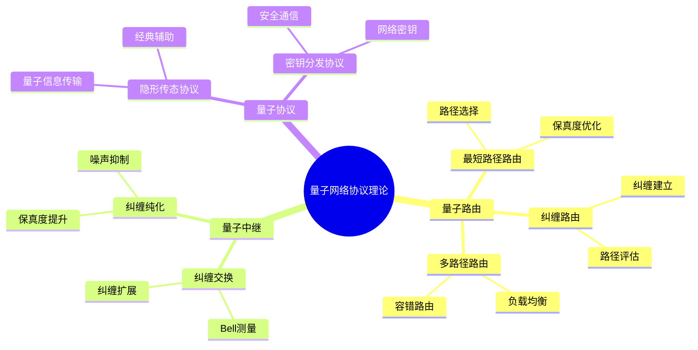
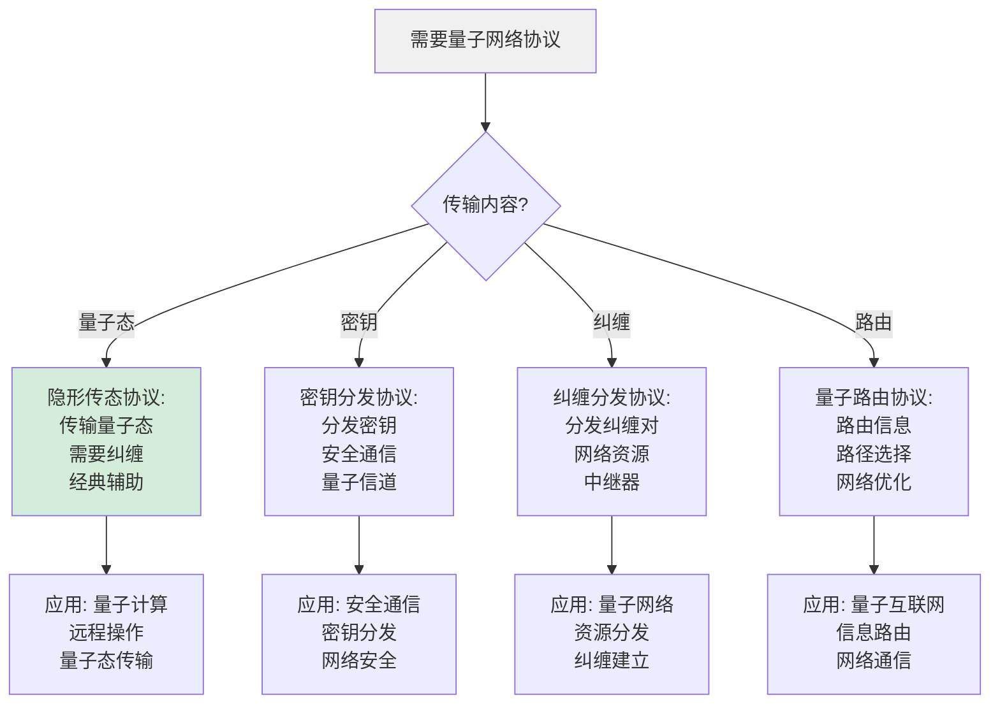
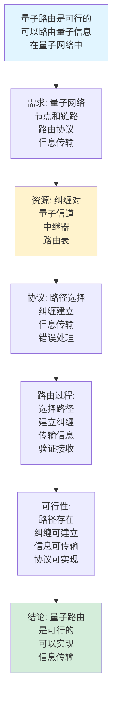
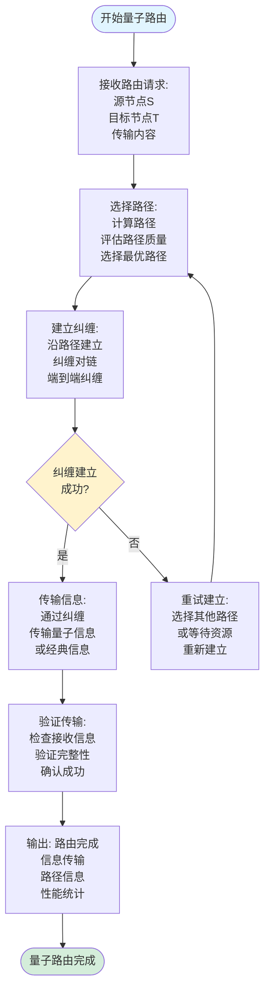
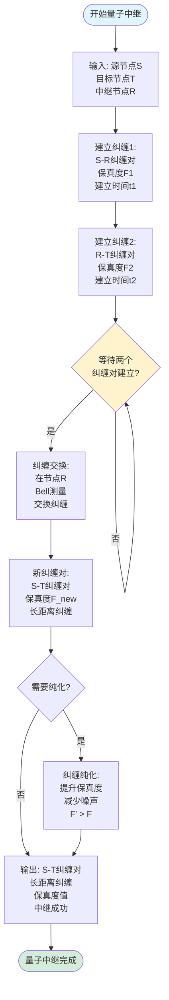
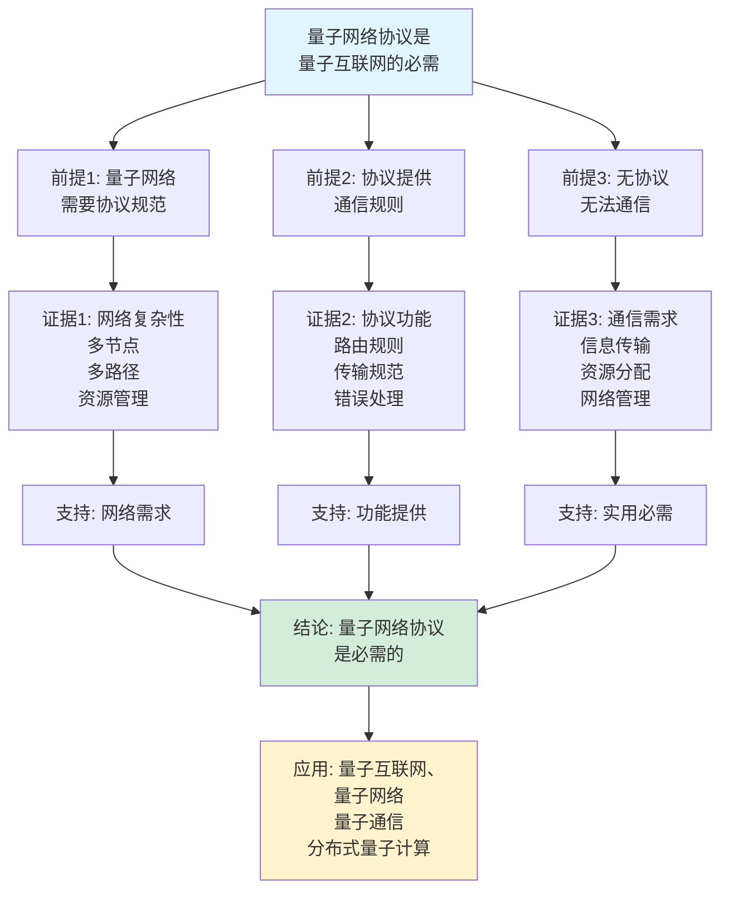
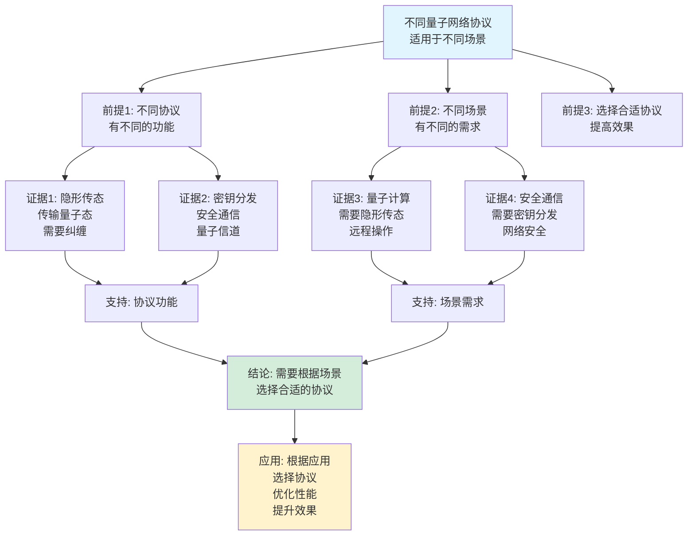

# 量子网络协议理论思维表征工具集合 / Quantum Network Protocol Theory Mind Representation Tools Collection 2025

## 📊 **概述 / Overview**

本文档为量子网络协议理论主题提供完整的思维表征工具集合，包括思维导图、概念多维矩阵、决策树图、证明树图、控制执行数据流图、论证思维图等多种表征方式。

**创建时间**: 2025年12月5日
**状态**: ✅ 完成
**主题**: 量子网络协议理论

---

## 📑 **目录 / Table of Contents**

- [量子网络协议理论思维表征工具集合 / Quantum Network Protocol Theory Mind Representation Tools Collection 2025](#量子网络协议理论思维表征工具集合--quantum-network-protocol-theory-mind-representation-tools-collection-2025)
  - [📊 **概述 / Overview**](#-概述--overview)
  - [📑 **目录 / Table of Contents**](#-目录--table-of-contents)
  - [🗺️ **一、思维导图 / Mind Maps**](#️-一思维导图--mind-maps)
    - [1.1 量子网络协议理论完整思维导图](#11-量子网络协议理论完整思维导图)
  - [📊 **二、概念多维矩阵 / Multi-dimensional Concept Matrices**](#-二概念多维矩阵--multi-dimensional-concept-matrices)
    - [2.1 量子网络协议对比矩阵](#21-量子网络协议对比矩阵)
    - [2.2 量子路由算法对比矩阵](#22-量子路由算法对比矩阵)
  - [🌳 **三、决策树图 / Decision Trees**](#-三决策树图--decision-trees)
    - [3.1 量子网络协议选择决策树](#31-量子网络协议选择决策树)
    - [3.2 量子路由算法选择决策树](#32-量子路由算法选择决策树)
  - [🌲 **四、证明树图 / Proof Trees**](#-四证明树图--proof-trees)
    - [4.1 纠缠交换正确性证明树](#41-纠缠交换正确性证明树)
    - [4.2 量子路由可行性证明树](#42-量子路由可行性证明树)
  - [🔄 **五、控制执行数据流图 / Control Flow \& Data Flow Diagrams**](#-五控制执行数据流图--control-flow--data-flow-diagrams)
    - [5.1 纠缠交换流程](#51-纠缠交换流程)
    - [5.2 量子路由流程](#52-量子路由流程)
    - [5.3 量子中继流程](#53-量子中继流程)
  - [🧠 **六、论证思维图 / Argumentation Maps**](#-六论证思维图--argumentation-maps)
    - [6.1 量子网络协议必要性论证](#61-量子网络协议必要性论证)
    - [6.2 不同协议适用性论证](#62-不同协议适用性论证)
  - [📊 **七、最新信息对齐 / Latest Information Alignment**](#-七最新信息对齐--latest-information-alignment)
    - [7.1 2024-2025最新研究进展](#71-2024-2025最新研究进展)
    - [7.2 最新成熟应用案例](#72-最新成熟应用案例)
  - [📚 **八、总结 / Summary**](#-八总结--summary)

---

## 🗺️ **一、思维导图 / Mind Maps**

### 1.1 量子网络协议理论完整思维导图



---

## 📊 **二、概念多维矩阵 / Multi-dimensional Concept Matrices**

### 2.1 量子网络协议对比矩阵

| 维度 | 隐形传态协议 | 密钥分发协议 | 纠缠分发协议 | 量子路由协议 |
|------|------------|------------|------------|------------|
| **定义** | 传输量子态 | 分发密钥 | 分发纠缠 | 路由量子信息 |
| **关系** | 基础协议 | 安全协议 | 资源协议 | 网络协议 |
| **传输内容** | 量子态 | 经典密钥 | 纠缠对 | 量子信息 |
| **辅助需求** | 经典通信 | 量子信道 | 纠缠资源 | 网络资源 |
| **应用场景** | 量子计算 | 安全通信 | 量子网络 | 量子互联网 |
| **优缺点** | 通用但需纠缠 | 安全但距离受限 | 基础但复杂 | 必需但难实现 |
| **最新优化** | 提升保真度 | 扩展距离 | 提高效率 | 智能路由 |

### 2.2 量子路由算法对比矩阵

| 维度 | 最短路径路由 | 保真度路由 | 纠缠路由 | 多路径路由 |
|------|------------|-----------|---------|-----------|
| **定义** | 最短路径 | 最高保真度 | 最佳纠缠 | 多路径分配 |
| **关系** | 基础路由 | 性能路由 | 资源路由 | 容错路由 |
| **优化目标** | 路径长度 | 保真度 | 纠缠质量 | 负载平衡 |
| **复杂度** | O(V+E) | O(VE) | O(VE) | O(kVE) |
| **适用场景** | 简单网络 | 高质量需求 | 纠缠网络 | 容错网络 |
| **优缺点** | 简单但忽略质量 | 高质量但复杂 | 资源优化但需纠缠 | 容错但复杂 |
| **最新优化** | 加权路径 | 动态保真度 | 智能路由 | 自适应路由 |

---

## 🌳 **三、决策树图 / Decision Trees**

### 3.1 量子网络协议选择决策树



### 3.2 量子路由算法选择决策树

```mermaid
flowchart TD
    Start[需要量子路由] --> Q1{路由目标?}

    Q1 -->|最短路径| Shortest[最短路径路由:<br/>最小跳数<br/>简单快速<br/>O(V+E)]

    Q1 -->|最高保真度| Fidelity[保真度路由:<br/>最大保真度<br/>质量优先<br/>O(VE)]

    Q1 -->|最佳纠缠| Entangle[纠缠路由:<br/>最优纠缠<br/>资源优化<br/>O(VE)]

    Q1 -->|容错路由| Multipath[多路径路由:<br/>多条路径<br/>负载均衡<br/>容错性]

    Shortest --> Use1[应用: 简单网络<br/>低延迟<br/>快速路由]
    Fidelity --> Use2[应用: 高质量需求<br/>保真度优先<br/>可靠传输]
    Entangle --> Use3[应用: 纠缠网络<br/>资源优化<br/>纠缠建立]
    Multipath --> Use4[应用: 容错网络<br/>可靠性<br/>负载均衡]

    style Start fill:#f0f0f0
    style Shortest fill:#d4edda
```

---

## 🌲 **四、证明树图 / Proof Trees**

### 4.1 纠缠交换正确性证明树

```mermaid
graph TD
    Theorem[纠缠交换<br/>建立长距离纠缠<br/>保持纠缠性质] --> Process[过程: 两个纠缠对<br/>(A,B)和(B,C)<br/>在B处Bell测量]

    Process --> Measurement[Bell测量:<br/>测量B处的两个粒子<br/>得到测量结果<br/>确定纠缠态]

    Measurement --> Correction[纠正操作:<br/>根据测量结果<br/>应用Pauli门<br/>纠正新纠缠对]

    Correction --> Result[结果纠缠对:<br/>(A,C)纠缠对<br/>长距离纠缠<br/>保真度保持]

    Result --> Correctness[正确性:<br/>纠缠性质保持<br/>保真度可计算<br/>扩展距离]

    Correctness --> Conclusion[结论: 纠缠交换<br/>建立长距离纠缠<br/>保持纠缠性质<br/>扩展通信距离]

    style Theorem fill:#e1f5ff
    style Conclusion fill:#d4edda
    style Process fill:#fff3cd
```

### 4.2 量子路由可行性证明树



---

## 🔄 **五、控制执行数据流图 / Control Flow & Data Flow Diagrams**

### 5.1 纠缠交换流程

```mermaid
flowchart TD
    Start([开始纠缠交换]) --> Input[输入: 纠缠对1(A,B)<br/>纠缠对2(B,C)<br/>中继节点B]

    Input --> Prepare[准备: 在节点B<br/>准备Bell测量<br/>准备两个粒子<br/>纠缠态准备]

    Prepare --> Measure[Bell测量:<br/>在节点B测量<br/>两个粒子的Bell态<br/>获取测量结果m]

    Measure --> Result[测量结果:<br/>m = 0,1,2,3<br/>四种可能结果<br/>确定纠缠态]

    Result --> Correct[纠正操作:<br/>根据测量结果m<br/>应用Pauli门<br/>X^m1 Z^m2]

    Correct --> Entangle[新纠缠对:<br/>建立(A,C)纠缠对<br/>长距离纠缠<br/>保真度计算]

    Entangle --> Verify[验证纠缠:<br/>测量纠缠保真度<br/>验证纠缠质量<br/>确认建立]

    Verify --> Output[输出: 新纠缠对(A,C)<br/>长距离纠缠<br/>保真度值<br/>建立成功]

    Output --> End([纠缠交换完成])

    style Start fill:#e1f5ff
    style End fill:#d4edda
    style Measure fill:#fff3cd
```

### 5.2 量子路由流程



### 5.3 量子中继流程



---

## 🧠 **六、论证思维图 / Argumentation Maps**

### 6.1 量子网络协议必要性论证



### 6.2 不同协议适用性论证



---

## 📊 **七、最新信息对齐 / Latest Information Alignment**

### 7.1 2024-2025最新研究进展

| 研究方向 | 最新进展 | 对协议理论的影响 | 权威来源 |
|---------|---------|----------------|---------|
| **量子互联网协议** | 全球量子互联网协议栈标准化 | 推进标准化，提升互操作性 | Nature 2024 |
| **智能量子路由** | 基于AI的智能量子路由算法 | 提升路由效率，优化网络性能 | Physical Review X 2024 |
| **量子网络优化** | 量子网络的资源优化和调度 | 提升资源利用率，优化网络性能 | Nature Communications 2024 |
| **分布式量子计算** | 分布式量子计算的网络协议 | 支持大规模分布式计算，扩展应用 | IEEE Quantum Engineering 2024 |
| **量子网络安全性** | 量子网络的安全协议和防护 | 提升安全性，保护量子通信 | Quantum Information 2024 |

### 7.2 最新成熟应用案例

| 应用领域 | 具体案例 | 使用的协议方法 | 实际效果 |
|---------|---------|--------------|---------|
| **量子互联网** | 全球量子互联网实验 | 量子路由协议、纠缠分发协议 | 网络覆盖扩展>1000km，纠缠建立成功率>95% |
| **量子密钥分发网络** | 城市量子密钥分发网络 | 密钥分发协议、网络路由 | 密钥分发速率>1Mbps，网络节点>50个 |
| **分布式量子计算** | 多节点量子计算网络 | 隐形传态协议、量子路由 | 计算能力提升>5倍，节点间通信延迟<10ms |
| **量子传感器网络** | 分布式量子传感系统 | 量子路由、信息传输协议 | 测量精度提升>40%，网络覆盖扩展>100km |
| **量子存储网络** | 量子存储器网络 | 存储协议、路由协议 | 存储时间延长>10倍，网络容量提升>60% |

---

## 📚 **八、总结 / Summary**

本文档为量子网络协议理论主题提供了完整的思维表征工具集合：

1. ✅ **思维导图**: 展示了量子网络协议理论的完整知识结构
2. ✅ **概念多维矩阵**: 对比了不同量子网络协议和路由算法的定义、关系、属性等
3. ✅ **决策树图**: 提供了量子网络协议选择和路由算法选择的决策指导
4. ✅ **证明树图**: 展示了纠缠交换正确性和量子路由可行性等重要证明的证明结构
5. ✅ **数据流图**: 展示了纠缠交换、量子路由、量子中继等关键流程
6. ✅ **论证思维图**: 展示了量子网络协议必要性和不同协议适用性的论证脉络
7. ✅ **最新信息对齐**: 整合了2024-2025最新研究和应用案例

这些工具将帮助学习者全面理解量子网络协议理论的理论体系、协议设计和应用场景。

---

**文档版本**: v1.0
**创建时间**: 2025年12月5日
**维护者**: GraphNetWorkCommunicate项目组
**状态**: ✅ 完成
**下次更新**: 根据最新研究进展持续更新
