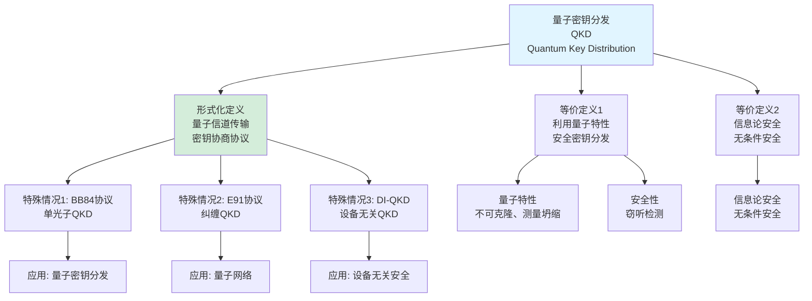
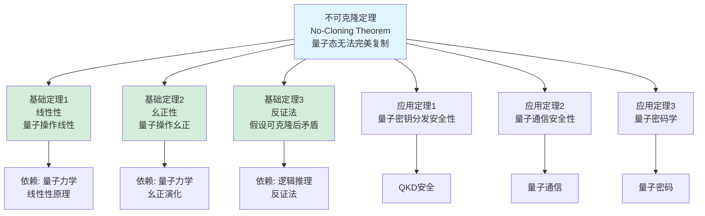
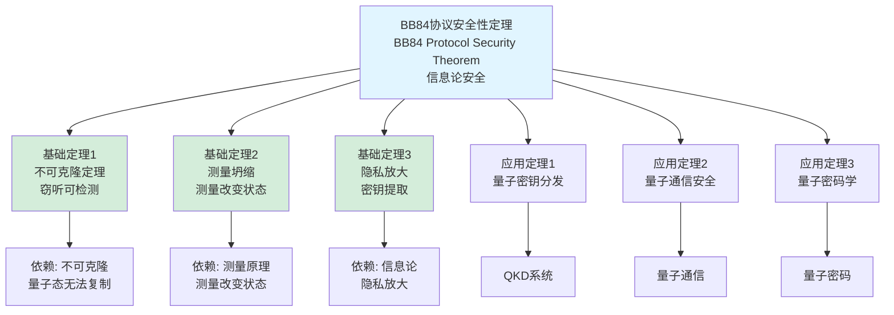
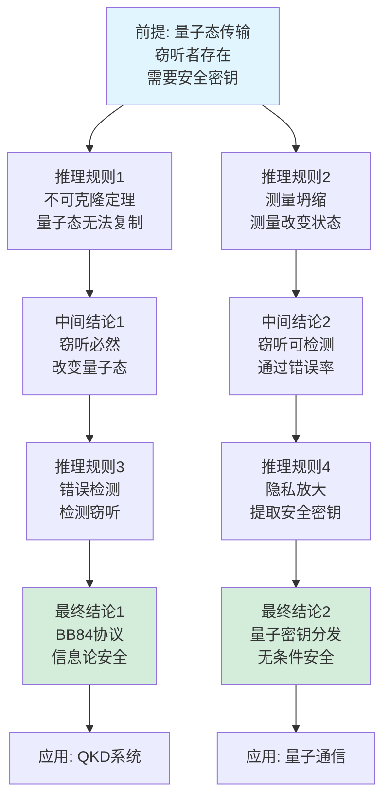
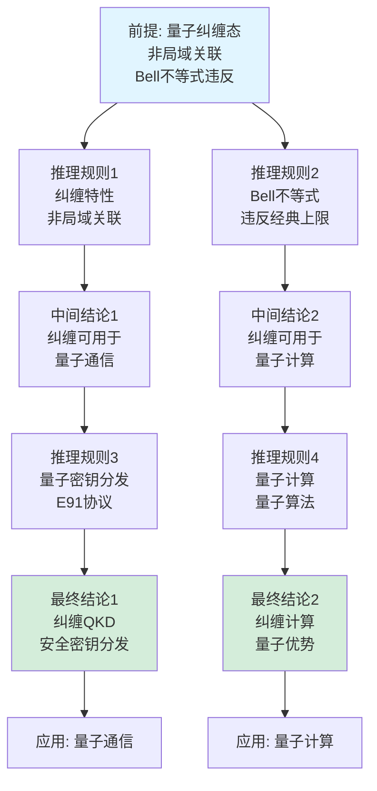

# 量子通信定义树与定理树集合 / Quantum Communication Definition Tree and Theorem Tree Collection 2025

## 📚 **概述 / Overview**

本文档提供量子通信模块的核心概念定义树和重要定理依赖树，清晰展示概念的定义层次结构和定理之间的依赖关系。

**创建时间**: 2025年1月
**模块**: 量子通信
**状态**: ✅ 已完成
**版本**: v1.0

---

## 🌳 **一、定义树 / Definition Trees**

### 1.1 量子态定义树

```mermaid
graph TD
    Root[量子态<br/>Quantum State<br/>|ψ⟩]

    Root --> D1[形式化定义<br/>|ψ⟩ = α|0⟩ + β|1⟩<br/>α, β ∈ ℂ<br/>|α|² + |β|² = 1]
    Root --> D2[等价定义1<br/>希尔伯特空间<br/>中的向量]
    Root --> D3[等价定义2<br/>量子叠加<br/>多个基态的线性组合]

    D1 --> S1[特殊情况1: 纯态<br/>|ψ⟩⟨ψ|]
    D1 --> S2[特殊情况2: 混合态<br/>密度矩阵ρ]
    D1 --> S3[特殊情况3: 纠缠态<br/>|ψ⟩ = |00⟩ + |11⟩]

    D2 --> A1[基态 Basis<br/>|0⟩, |1⟩]
    D2 --> A2[叠加系数<br/>α, β]

    D3 --> A3[测量坍缩<br/>测量后确定状态]

    S1 --> App1[应用: 量子计算]
    S2 --> App2[应用: 量子通信]
    S3 --> App3[应用: 量子纠缠]

    style Root fill:#e1f5ff
    style D1 fill:#d4edda
```

### 1.2 量子纠缠定义树

```mermaid
graph TD
    Root[量子纠缠<br/>Quantum Entanglement]

    Root --> D1[形式化定义<br/>|ψ⟩ = Σᵢ cᵢ|i⟩⊗|i⟩<br/>不可分解]
    Root --> D2[等价定义1<br/>非局域关联<br/>Bell不等式违反]
    Root --> D3[等价定义2<br/>不可分离态<br/>不能写成直积]

    D1 --> S1[特殊情况1: Bell态<br/>|Φ⁺⟩, |Φ⁻⟩, |Ψ⁺⟩, |Ψ⁻⟩]
    D1 --> S2[特殊情况2: GHZ态<br/>三粒子纠缠]
    D1 --> S3[特殊情况3: W态<br/>三粒子纠缠]

    D2 --> A1[Bell不等式<br/>经典关联上限]
    D2 --> A2[量子关联<br/>超越经典]

    D3 --> A3[纠缠度量<br/>纠缠熵]

    S1 --> App1[应用: 量子密钥分发]
    S2 --> App2[应用: 量子计算]
    S3 --> App3[应用: 量子通信]

    style Root fill:#e1f5ff
    style D1 fill:#d4edda
```

### 1.3 量子密钥分发定义树



---

## 🌳 **二、定理树 / Theorem Trees**

### 2.1 不可克隆定理定理树



### 2.2 Bell不等式定理树

```mermaid
graph TD
    Root[Bell不等式定理<br/>Bell's Inequality Theorem<br/>量子关联超越经典]

    Root --> T1[基础定理1<br/>经典关联上限<br/>|S| ≤ 2]
    Root --> T2[基础定理2<br/>量子关联<br/>|S| ≤ 2√2]
    Root --> T3[基础定理3<br/>实验验证<br/>违反Bell不等式]

    T1 --> D1[依赖: 局域实在性<br/>经典物理假设]
    T2 --> D2[依赖: 量子纠缠<br/>非局域关联]
    T3 --> D3[依赖: 实验验证<br/>Bell实验]

    Root --> App1[应用定理1<br/>量子纠缠验证]
    Root --> App2[应用定理2<br/>量子通信安全性]
    Root --> App3[应用定理3<br/>量子信息处理]

    App1 --> Use1[纠缠验证]
    App2 --> Use2[量子通信]
    App3 --> Use3[量子信息]

    style Root fill:#e1f5ff
    style T1 fill:#d4edda
    style T2 fill:#d4edda
    style T3 fill:#d4edda
```

### 2.3 BB84协议安全性定理树



---

## 🌳 **三、推理关系树 / Inference Relation Trees**

### 3.1 量子密钥分发安全性推理链



### 3.2 量子纠缠应用推理链



---

## 📊 **四、使用指南 / Usage Guide**

### 4.1 定义树使用指南

- **概念理解**: 通过定义树理解概念的层次结构
- **等价定义**: 理解同一概念的不同定义方式
- **特殊情况**: 识别概念的特殊情况和应用场景
- **知识整合**: 整合相关概念的知识

### 4.2 定理树使用指南

- **依赖关系**: 理解定理之间的依赖关系
- **证明路径**: 理解证明的逻辑路径
- **应用路径**: 理解定理的应用路径
- **知识体系**: 构建完整的知识体系

### 4.3 推理关系树使用指南

- **逻辑推理**: 理解逻辑推理的过程
- **因果关系**: 理解因果关系链
- **证明结构**: 理解证明的结构
- **知识连接**: 连接相关知识点

---

## 📚 **五、总结 / Summary**

本文档提供了量子通信模块的三种重要思维表征工具：

1. ✅ **定义树**: 展示核心概念的定义层次结构（3个定义树）
2. ✅ **定理树**: 展示重要定理的依赖关系（3个定理树）
3. ✅ **推理关系树**: 展示逻辑推理链（2个推理关系树）

这些工具将帮助学习者：

- 理解概念的定义层次
- 理解定理的依赖关系
- 理解逻辑推理过程
- 构建完整的知识体系

---

**文档版本**: v1.0
**创建时间**: 2025年1月
**最后更新**: 2025年1月
**维护者**: GraphNetWorkCommunicate项目组
**状态**: ✅ **已完成**
