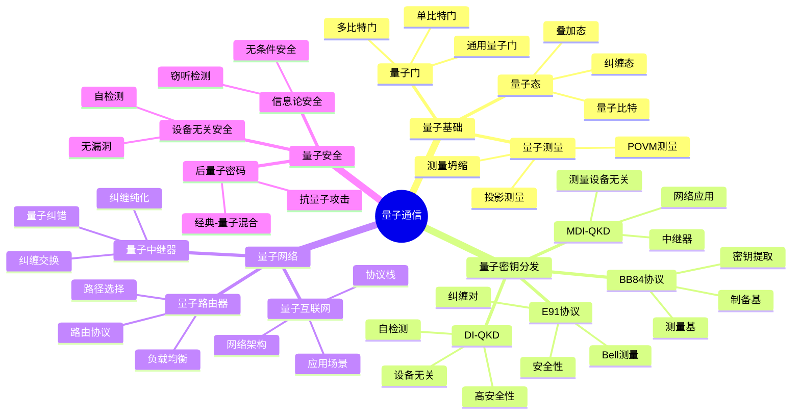
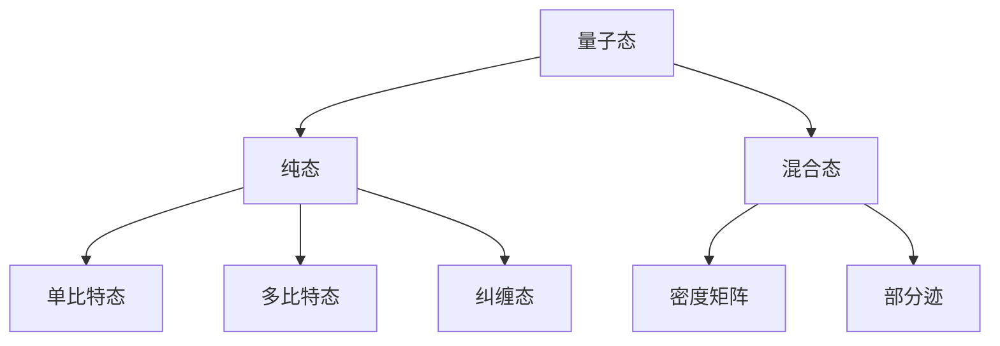
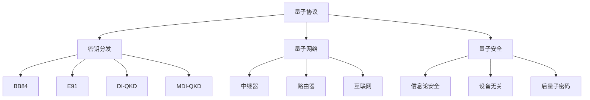
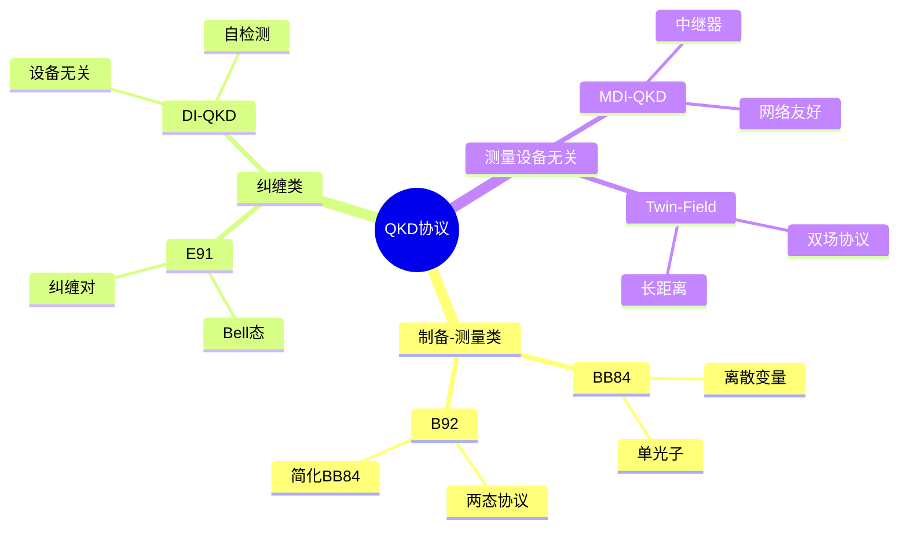
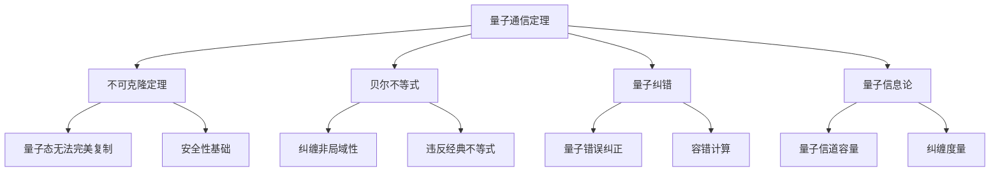
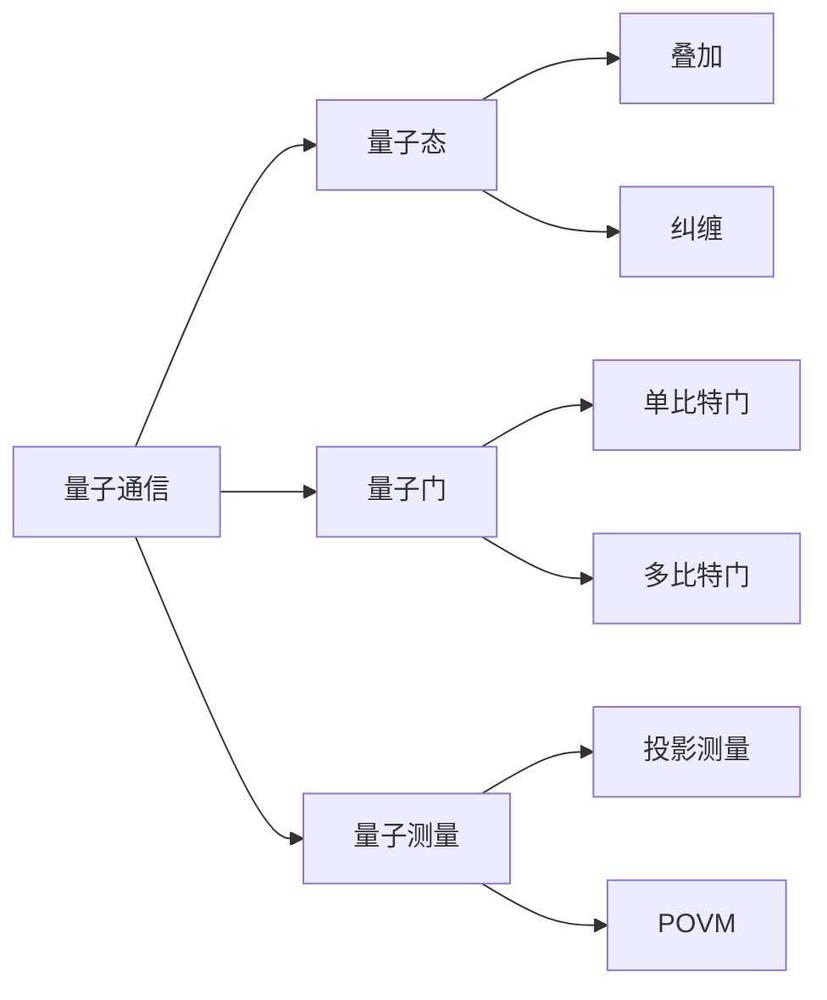
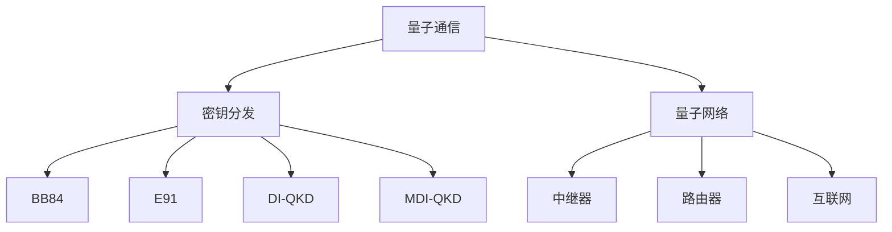
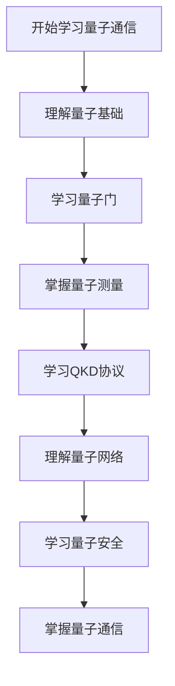
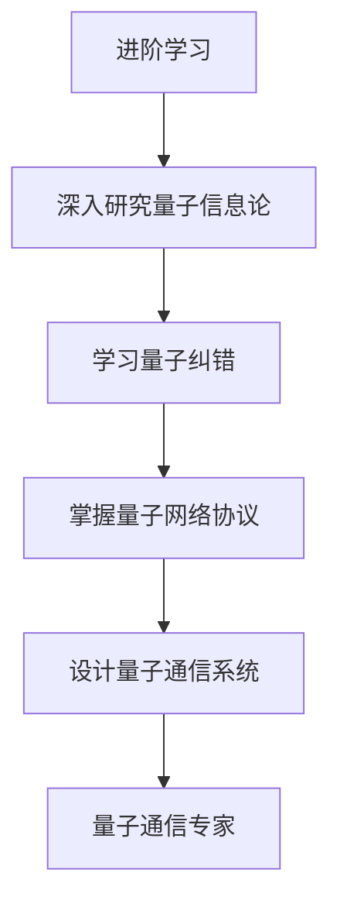

# 量子通信模块知识结构思维导图 / Quantum Communication Module Knowledge Structure Mind Map

## 📚 **概述 / Overview**

本文档提供量子通信模块的完整知识结构思维导图，帮助理解量子通信知识的层次结构和相互关系。

**创建时间**: 2025年1月
**模块**: 量子通信
**状态**: 🚀 持续更新中

---

## 🗺️ **一、整体知识结构 / Overall Knowledge Structure**

---

## 📊 **二、核心概念层次结构 / Core Concept Hierarchy**

### 2.1 量子态层次

### 2.2 量子协议层次

---

## 🔬 **三、协议分类结构 / Protocol Classification Structure**

### 3.1 QKD协议分类

### 3.2 协议特性对比

| 协议类型 | 协议 | 安全性 | 距离 | 设备要求 | 特点 |
|---------|------|--------|------|---------|------|
| **制备-测量** | BB84 | 信息论 | 中 | 单光子源 | 经典协议 |
| **纠缠** | E91 | 信息论 | 中 | 纠缠源 | 纠缠验证 |
| **设备无关** | DI-QKD | 最高 | 短 | 自检测 | 无漏洞 |
| **测量设备无关** | MDI-QKD | 信息论 | 长 | 中继器 | 网络友好 |

---

## 📐 **四、重要定理结构 / Important Theorems Structure**

### 4.1 定理分类

### 4.2 定理应用领域

| 定理 | 应用领域 | 具体应用 |
|------|---------|---------|
| **不可克隆定理** | 量子安全 | QKD安全性基础 |
| **贝尔不等式** | 量子纠缠 | 纠缠验证 |
| **量子纠错** | 量子计算 | 容错量子计算 |
| **量子信息论** | 量子通信 | 信道容量分析 |

---

## 🔗 **五、知识关联网络 / Knowledge Association Network**

### 5.1 概念关联图

### 5.2 协议关联图

---

## 📚 **六、学习路径 / Learning Path**

### 6.1 基础学习路径

### 6.2 进阶学习路径

---

## 🎯 **七、应用领域映射 / Application Domain Mapping**

### 7.1 应用领域

| 量子通信概念 | 应用领域 | 具体应用 |
|------------|---------|---------|
| **QKD协议** | 安全通信 | 密钥分发、安全传输 |
| **量子网络** | 量子互联网 | 长距离通信、网络架构 |
| **量子中继器** | 量子通信 | 距离扩展、网络连接 |
| **量子安全** | 信息安全 | 无条件安全、后量子密码 |

---

## 📋 **八、知识检查清单 / Knowledge Checklist**

### 8.1 基础概念

- [ ] 理解量子态和量子比特
- [ ] 掌握量子门操作
- [ ] 理解量子测量原理
- [ ] 掌握量子纠缠概念

### 8.2 QKD协议

- [ ] 理解BB84协议原理
- [ ] 掌握E91协议实现
- [ ] 了解DI-QKD和MDI-QKD
- [ ] 理解QKD安全性分析

### 8.3 量子网络

- [ ] 理解量子中继器原理
- [ ] 掌握量子路由协议
- [ ] 了解量子互联网架构
- [ ] 理解量子网络应用

### 8.4 量子安全

- [ ] 理解信息论安全
- [ ] 掌握设备无关安全
- [ ] 了解后量子密码
- [ ] 理解量子安全应用

---

## 🔗 **相关链接 / Related Links**

- [量子通信README](README.md)
- [量子基础](01-量子基础.md)
- [量子密钥分发](02-量子密钥分发.md)
- [量子网络与路由](03-量子网络与路由.md)
- [思维表征工具](思维表征工具-量子通信.md)

---

**文档版本**: v1.0
**创建时间**: 2025年1月
**最后更新**: 2025年1月
**维护者**: GraphNetWorkCommunicate项目组
