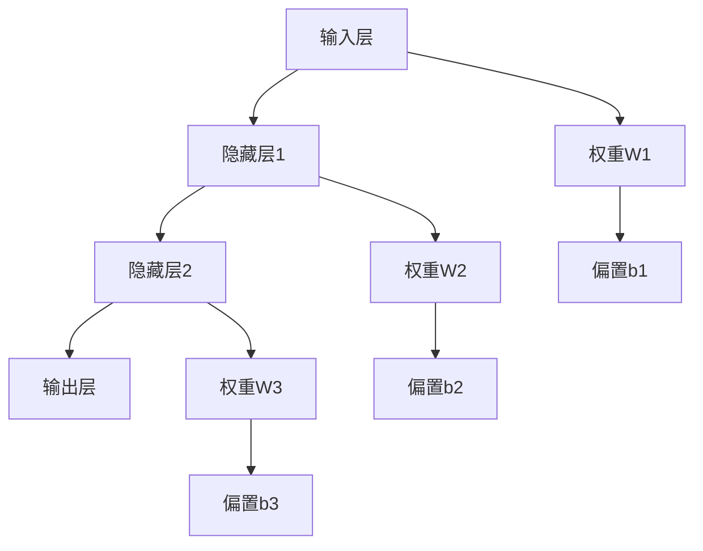

# 生物网络 - 神经网络

## 1. 神经网络基础

### 1.1 基本定义

**定义 1.1** (神经网络 - Neural Network)
**神经网络**是由大量相互连接的神经元组成的计算模型：
$$\mathcal{NN} = \langle \mathcal{N}, \mathcal{W}, \mathcal{F}, \mathcal{L} \rangle$$

其中：

- $\mathcal{N}$ 是神经元集
- $\mathcal{W}$ 是权重矩阵集
- $\mathcal{F}$ 是激活函数集
- $\mathcal{L}$ 是学习算法集

**定义 1.2** (神经元)
**神经元**是神经网络的基本计算单元：
$$\text{Neuron}_i = \langle \mathbf{w}_i, b_i, f_i \rangle$$

其中：

- $\mathbf{w}_i$ 是权重向量
- $b_i$ 是偏置项
- $f_i$ 是激活函数

**形式化语义**：

- 集合论语义：$\mathcal{N} \neq \emptyset, \mathcal{W} \subseteq \mathbb{R}^{n \times m}, \mathcal{F} \subseteq \mathcal{C}(\mathbb{R}, \mathbb{R})$
- 范畴论语义：神经网络作为函数范畴中的对象，学习过程作为态射
- 自动机语义：神经网络可建模为状态自动机 $A = (Q, \Sigma, \delta, q_0, F)$

### 1.2 网络结构

**定义 1.3** (前馈神经网络)
**前馈神经网络**是信息单向传播的网络：
$$\text{FFNN} = \langle L_1, L_2, \ldots, L_n \rangle$$

其中 $L_i$ 是第 $i$ 层，满足：
$$L_{i+1} = f_i(W_i L_i + \mathbf{b}_i)$$

**定义 1.4** (循环神经网络)
**循环神经网络**包含反馈连接：
$$\text{RNN}: h_t = f(W_h h_{t-1} + W_x x_t + \mathbf{b})$$

**算法 1.1** (前馈神经网络实现)

```python
import numpy as np
import matplotlib.pyplot as plt

class FeedforwardNeuralNetwork:
    def __init__(self, layer_sizes, activation_functions=None):
        self.layer_sizes = layer_sizes
        self.num_layers = len(layer_sizes)
        
        # 初始化权重和偏置
        self.weights = []
        self.biases = []
        
        for i in range(self.num_layers - 1):
            # He初始化
            w = np.random.randn(layer_sizes[i+1], layer_sizes[i]) * np.sqrt(2.0 / layer_sizes[i])
            b = np.zeros((layer_sizes[i+1], 1))
            
            self.weights.append(w)
            self.biases.append(b)
        
        # 激活函数
        if activation_functions is None:
            self.activations = ['relu'] * (self.num_layers - 2) + ['sigmoid']
        else:
            self.activations = activation_functions
    
    def forward_propagation(self, X):
        """前向传播"""
        self.activations_cache = [X]
        self.z_cache = []
        
        for i in range(self.num_layers - 1):
            # 线性变换
            z = np.dot(self.weights[i], self.activations_cache[-1]) + self.biases[i]
            self.z_cache.append(z)
            
            # 激活函数
            if self.activations[i] == 'relu':
                a = self.relu(z)
            elif self.activations[i] == 'sigmoid':
                a = self.sigmoid(z)
            elif self.activations[i] == 'tanh':
                a = self.tanh(z)
            else:
                a = z
            
            self.activations_cache.append(a)
        
        return self.activations_cache[-1]
    
    def backward_propagation(self, X, Y, learning_rate=0.01):
        """反向传播"""
        m = X.shape[1]
        
        # 计算梯度
        dZ = self.activations_cache[-1] - Y
        
        for i in range(self.num_layers - 2, -1, -1):
            # 权重梯度
            dW = np.dot(dZ, self.activations_cache[i].T) / m
            db = np.sum(dZ, axis=1, keepdims=True) / m
            
            if i > 0:
                # 激活函数梯度
                if self.activations[i-1] == 'relu':
                    dA = np.dot(self.weights[i].T, dZ)
                    dZ = dA * self.relu_derivative(self.z_cache[i-1])
                elif self.activations[i-1] == 'sigmoid':
                    dA = np.dot(self.weights[i].T, dZ)
                    dZ = dA * self.sigmoid_derivative(self.z_cache[i-1])
            
            # 更新参数
            self.weights[i] -= learning_rate * dW
            self.biases[i] -= learning_rate * db
    
    def train(self, X, Y, epochs=1000, learning_rate=0.01):
        """训练网络"""
        costs = []
        
        for epoch in range(epochs):
            # 前向传播
            output = self.forward_propagation(X)
            
            # 计算损失
            cost = self.compute_cost(output, Y)
            costs.append(cost)
            
            # 反向传播
            self.backward_propagation(X, Y, learning_rate)
            
            if epoch % 100 == 0:
                print(f"Epoch {epoch}, Cost: {cost}")
        
        return costs
    
    def predict(self, X):
        """预测"""
        return self.forward_propagation(X)
    
    # 激活函数
    def relu(self, z):
        return np.maximum(0, z)
    
    def sigmoid(self, z):
        return 1 / (1 + np.exp(-z))
    
    def tanh(self, z):
        return np.tanh(z)
    
    # 激活函数导数
    def relu_derivative(self, z):
        return np.where(z > 0, 1, 0)
    
    def sigmoid_derivative(self, z):
        s = self.sigmoid(z)
        return s * (1 - s)
    
    def compute_cost(self, output, Y):
        """计算损失函数"""
        m = Y.shape[1]
        cost = -np.sum(Y * np.log(output + 1e-8) + (1 - Y) * np.log(1 - output + 1e-8)) / m
        return cost
```

## 2. 学习算法

### 2.1 梯度下降

**定义 2.1** (梯度下降)
**梯度下降**是最基本的优化算法：
$$\mathbf{w}_{t+1} = \mathbf{w}_t - \alpha \nabla J(\mathbf{w}_t)$$

其中 $\alpha$ 是学习率，$\nabla J(\mathbf{w}_t)$ 是损失函数的梯度。

**算法 2.1** (随机梯度下降)

```python
class StochasticGradientDescent:
    def __init__(self, learning_rate=0.01, batch_size=32):
        self.learning_rate = learning_rate
        self.batch_size = batch_size
    
    def optimize(self, model, X, Y, epochs=100):
        """随机梯度下降优化"""
        m = X.shape[1]
        costs = []
        
        for epoch in range(epochs):
            # 随机打乱数据
            indices = np.random.permutation(m)
            X_shuffled = X[:, indices]
            Y_shuffled = Y[:, indices]
            
            # 小批量训练
            for i in range(0, m, self.batch_size):
                batch_X = X_shuffled[:, i:i+self.batch_size]
                batch_Y = Y_shuffled[:, i:i+self.batch_size]
                
                # 前向传播
                output = model.forward_propagation(batch_X)
                
                # 反向传播
                model.backward_propagation(batch_X, batch_Y, self.learning_rate)
            
            # 计算总损失
            if epoch % 10 == 0:
                total_output = model.forward_propagation(X)
                cost = model.compute_cost(total_output, Y)
                costs.append(cost)
                print(f"Epoch {epoch}, Cost: {cost}")
        
        return costs
```

### 2.2 反向传播

**定理 2.1** (反向传播定理)
反向传播算法正确计算损失函数对网络参数的梯度。

**证明**：

1. 使用链式法则计算梯度
2. 从输出层开始，逐层向后传播误差
3. 每个参数的梯度等于其对应神经元的误差乘以输入

$\boxed{\text{证毕}}$

**算法 2.2** (反向传播算法)

```python
def backpropagation_algorithm(network, X, Y):
    """反向传播算法"""
    m = X.shape[1]
    
    # 前向传播
    activations = [X]
    z_values = []
    
    for i in range(len(network.weights)):
        z = np.dot(network.weights[i], activations[-1]) + network.biases[i]
        z_values.append(z)
        
        if i == len(network.weights) - 1:
            # 输出层
            activation = network.sigmoid(z)
        else:
            # 隐藏层
            activation = network.relu(z)
        
        activations.append(activation)
    
    # 反向传播
    delta = activations[-1] - Y  # 输出层误差
    
    weight_gradients = []
    bias_gradients = []
    
    for i in range(len(network.weights) - 1, -1, -1):
        # 计算梯度
        weight_grad = np.dot(delta, activations[i].T) / m
        bias_grad = np.sum(delta, axis=1, keepdims=True) / m
        
        weight_gradients.insert(0, weight_grad)
        bias_gradients.insert(0, bias_grad)
        
        if i > 0:
            # 计算下一层的误差
            delta = np.dot(network.weights[i].T, delta) * network.relu_derivative(z_values[i-1])
    
    return weight_gradients, bias_gradients
```

## 3. 网络类型

### 3.1 卷积神经网络

**定义 3.1** (卷积神经网络)
**卷积神经网络**是专门处理网格结构数据的网络：
$$\text{CNN} = \langle \text{Conv}, \text{Pool}, \text{FC} \rangle$$

**算法 3.1** (卷积层实现)

```python
class ConvolutionalLayer:
    def __init__(self, num_filters, filter_size, stride=1, padding=0):
        self.num_filters = num_filters
        self.filter_size = filter_size
        self.stride = stride
        self.padding = padding
        
        # 初始化卷积核
        self.filters = np.random.randn(num_filters, filter_size, filter_size) * 0.1
        self.biases = np.zeros(num_filters)
    
    def forward(self, input_data):
        """前向传播"""
        batch_size, input_height, input_width = input_data.shape
        
        # 计算输出尺寸
        output_height = (input_height - self.filter_size + 2 * self.padding) // self.stride + 1
        output_width = (input_width - self.filter_size + 2 * self.padding) // self.stride + 1
        
        # 添加padding
        if self.padding > 0:
            padded_input = np.pad(input_data, ((0, 0), (self.padding, self.padding), 
                                              (self.padding, self.padding)), mode='constant')
        else:
            padded_input = input_data
        
        # 初始化输出
        output = np.zeros((batch_size, self.num_filters, output_height, output_width))
        
        # 执行卷积
        for b in range(batch_size):
            for f in range(self.num_filters):
                for h in range(output_height):
                    for w in range(output_width):
                        h_start = h * self.stride
                        h_end = h_start + self.filter_size
                        w_start = w * self.stride
                        w_end = w_start + self.filter_size
                        
                        # 卷积操作
                        receptive_field = padded_input[b, h_start:h_end, w_start:w_end]
                        output[b, f, h, w] = np.sum(receptive_field * self.filters[f]) + self.biases[f]
        
        return output
    
    def backward(self, grad_output, input_data):
        """反向传播"""
        batch_size, input_height, input_width = input_data.shape
        
        # 计算输出尺寸
        output_height = (input_height - self.filter_size + 2 * self.padding) // self.stride + 1
        output_width = (input_width - self.filter_size + 2 * self.padding) // self.stride + 1
        
        # 初始化梯度
        grad_filters = np.zeros_like(self.filters)
        grad_biases = np.zeros_like(self.biases)
        grad_input = np.zeros_like(input_data)
        
        # 添加padding
        if self.padding > 0:
            padded_input = np.pad(input_data, ((0, 0), (self.padding, self.padding), 
                                              (self.padding, self.padding)), mode='constant')
            grad_padded_input = np.zeros_like(padded_input)
        else:
            padded_input = input_data
            grad_padded_input = grad_input
        
        # 计算梯度
        for b in range(batch_size):
            for f in range(self.num_filters):
                for h in range(output_height):
                    for w in range(output_width):
                        h_start = h * self.stride
                        h_end = h_start + self.filter_size
                        w_start = w * self.stride
                        w_end = w_start + self.filter_size
                        
                        # 计算梯度
                        receptive_field = padded_input[b, h_start:h_end, w_start:w_end]
                        grad_filters[f] += grad_output[b, f, h, w] * receptive_field
                        grad_biases[f] += grad_output[b, f, h, w]
                        grad_padded_input[b, h_start:h_end, w_start:w_end] += grad_output[b, f, h, w] * self.filters[f]
        
        # 移除padding
        if self.padding > 0:
            grad_input = grad_padded_input[:, self.padding:-self.padding, self.padding:-self.padding]
        
        return grad_filters, grad_biases, grad_input
```

### 3.2 循环神经网络

**定义 3.2** (循环神经网络)
**循环神经网络**是具有记忆能力的网络：
$$\text{RNN}: h_t = \tanh(W_h h_{t-1} + W_x x_t + \mathbf{b}_h)$$

**算法 3.2** (RNN实现)

```python
class RecurrentNeuralNetwork:
    def __init__(self, input_size, hidden_size, output_size):
        self.input_size = input_size
        self.hidden_size = hidden_size
        self.output_size = output_size
        
        # 初始化权重
        self.W_hh = np.random.randn(hidden_size, hidden_size) * 0.01
        self.W_xh = np.random.randn(hidden_size, input_size) * 0.01
        self.W_hy = np.random.randn(output_size, hidden_size) * 0.01
        
        self.b_h = np.zeros((hidden_size, 1))
        self.b_y = np.zeros((output_size, 1))
    
    def forward(self, inputs, h0=None):
        """前向传播"""
        batch_size, seq_length, _ = inputs.shape
        
        if h0 is None:
            h0 = np.zeros((self.hidden_size, batch_size))
        
        # 存储所有时间步的状态
        hs = np.zeros((seq_length, self.hidden_size, batch_size))
        ys = np.zeros((seq_length, self.output_size, batch_size))
        
        h = h0
        
        for t in range(seq_length):
            # 更新隐藏状态
            h = np.tanh(np.dot(self.W_hh, h) + np.dot(self.W_xh, inputs[:, t, :].T) + self.b_h)
            hs[t] = h
            
            # 计算输出
            y = np.dot(self.W_hy, h) + self.b_y
            ys[t] = y
        
        return hs, ys
    
    def backward(self, inputs, hs, ys, targets):
        """反向传播"""
        batch_size, seq_length, _ = inputs.shape
        
        # 初始化梯度
        dW_hh = np.zeros_like(self.W_hh)
        dW_xh = np.zeros_like(self.W_xh)
        dW_hy = np.zeros_like(self.W_hy)
        db_h = np.zeros_like(self.b_h)
        db_y = np.zeros_like(self.b_y)
        
        dh_next = np.zeros((self.hidden_size, batch_size))
        
        # 从最后一个时间步开始反向传播
        for t in reversed(range(seq_length)):
            # 输出层梯度
            dy = ys[t] - targets[:, t, :].T
            
            # 隐藏层到输出层的梯度
            dW_hy += np.dot(dy, hs[t].T)
            db_y += np.sum(dy, axis=1, keepdims=True)
            
            # 隐藏状态梯度
            dh = np.dot(self.W_hy.T, dy) + dh_next
            
            # tanh梯度
            dh_raw = (1 - hs[t] ** 2) * dh
            
            # 偏置梯度
            db_h += np.sum(dh_raw, axis=1, keepdims=True)
            
            # 权重梯度
            dW_hh += np.dot(dh_raw, hs[t-1].T) if t > 0 else np.dot(dh_raw, np.zeros((self.hidden_size, batch_size)).T)
            dW_xh += np.dot(dh_raw, inputs[:, t, :])
            
            # 下一个时间步的梯度
            dh_next = np.dot(self.W_hh.T, dh_raw)
        
        return dW_hh, dW_xh, dW_hy, db_h, db_y
```

## 4. 网络分析

### 4.1 网络拓扑分析

**定义 4.1** (网络连接度)
**网络连接度**是网络中节点连接的平均数：
$$\langle k \rangle = \frac{1}{N} \sum_{i=1}^{N} k_i$$

其中 $k_i$ 是节点 $i$ 的度。

**算法 4.1** (网络拓扑分析)

```python
class NetworkTopologyAnalyzer:
    def __init__(self, network):
        self.network = network
    
    def analyze_connectivity(self):
        """分析网络连通性"""
        # 构建邻接矩阵
        adjacency_matrix = self.build_adjacency_matrix()
        
        # 计算度分布
        degrees = np.sum(adjacency_matrix, axis=1)
        avg_degree = np.mean(degrees)
        
        # 计算聚类系数
        clustering_coefficient = self.calculate_clustering_coefficient(adjacency_matrix)
        
        # 计算平均路径长度
        avg_path_length = self.calculate_average_path_length(adjacency_matrix)
        
        return {
            'average_degree': avg_degree,
            'clustering_coefficient': clustering_coefficient,
            'average_path_length': avg_path_length,
            'degree_distribution': degrees
        }
    
    def build_adjacency_matrix(self):
        """构建邻接矩阵"""
        num_layers = len(self.network.weights)
        total_neurons = sum(self.network.layer_sizes)
        
        adjacency_matrix = np.zeros((total_neurons, total_neurons))
        
        neuron_idx = 0
        for layer_idx in range(num_layers):
            layer_size = self.network.layer_sizes[layer_idx]
            next_layer_size = self.network.layer_sizes[layer_idx + 1]
            
            # 添加层间连接
            for i in range(layer_size):
                for j in range(next_layer_size):
                    if self.network.weights[layer_idx][j, i] != 0:
                        adjacency_matrix[neuron_idx + i, neuron_idx + layer_size + j] = 1
            
            neuron_idx += layer_size
        
        return adjacency_matrix
    
    def calculate_clustering_coefficient(self, adjacency_matrix):
        """计算聚类系数"""
        n = adjacency_matrix.shape[0]
        total_clustering = 0
        valid_nodes = 0
        
        for i in range(n):
            neighbors = np.where(adjacency_matrix[i] == 1)[0]
            k = len(neighbors)
            
            if k >= 2:
                # 计算邻居间的连接数
                connections = 0
                for j in range(len(neighbors)):
                    for k in range(j + 1, len(neighbors)):
                        if adjacency_matrix[neighbors[j], neighbors[k]] == 1:
                            connections += 1
                
                clustering = 2 * connections / (k * (k - 1))
                total_clustering += clustering
                valid_nodes += 1
        
        return total_clustering / valid_nodes if valid_nodes > 0 else 0
    
    def calculate_average_path_length(self, adjacency_matrix):
        """计算平均路径长度"""
        n = adjacency_matrix.shape[0]
        
        # 使用Floyd-Warshall算法计算最短路径
        distances = adjacency_matrix.copy()
        distances[distances == 0] = np.inf
        np.fill_diagonal(distances, 0)
        
        for k in range(n):
            for i in range(n):
                for j in range(n):
                    if distances[i, k] + distances[k, j] < distances[i, j]:
                        distances[i, j] = distances[i, k] + distances[k, j]
        
        # 计算平均路径长度
        finite_distances = distances[distances != np.inf]
        return np.mean(finite_distances) if len(finite_distances) > 0 else 0
```

### 4.2 网络动力学分析

**定义 4.2** (网络动力学)
**网络动力学**描述网络状态随时间的演化：
$$\frac{d\mathbf{x}}{dt} = f(\mathbf{x}, \mathbf{W})$$

**算法 4.2** (动力学分析)

```python
class NetworkDynamicsAnalyzer:
    def __init__(self, network):
        self.network = network
    
    def analyze_stability(self, initial_conditions, time_steps=1000):
        """分析网络稳定性"""
        trajectories = []
        
        for x0 in initial_conditions:
            trajectory = self.simulate_dynamics(x0, time_steps)
            trajectories.append(trajectory)
        
        # 计算Lyapunov指数
        lyapunov_exponents = self.calculate_lyapunov_exponents(trajectories)
        
        # 分析吸引子
        attractors = self.find_attractors(trajectories)
        
        return {
            'lyapunov_exponents': lyapunov_exponents,
            'attractors': attractors,
            'trajectories': trajectories
        }
    
    def simulate_dynamics(self, x0, time_steps):
        """模拟网络动力学"""
        trajectory = [x0]
        x = x0.copy()
        
        for t in range(time_steps):
            # 网络演化
            x = self.network.forward_propagation(x.reshape(-1, 1)).flatten()
            trajectory.append(x)
        
        return np.array(trajectory)
    
    def calculate_lyapunov_exponents(self, trajectories):
        """计算Lyapunov指数"""
        lyapunov_exponents = []
        
        for trajectory in trajectories:
            # 计算相邻时间步的差异
            differences = np.diff(trajectory, axis=0)
            
            # 计算Lyapunov指数
            lyapunov = np.mean(np.log(np.linalg.norm(differences, axis=1) + 1e-8))
            lyapunov_exponents.append(lyapunov)
        
        return lyapunov_exponents
    
    def find_attractors(self, trajectories):
        """寻找吸引子"""
        attractors = []
        
        for trajectory in trajectories:
            # 寻找稳定状态
            final_states = trajectory[-100:]  # 最后100个时间步
            
            # 计算状态变化
            state_changes = np.diff(final_states, axis=0)
            avg_change = np.mean(np.linalg.norm(state_changes, axis=1))
            
            if avg_change < 1e-6:  # 阈值
                # 找到吸引子
                attractor = np.mean(final_states, axis=0)
                attractors.append(attractor)
        
        return attractors
```

## 5. 网络学习理论

### 5.1 学习理论

**定理 5.1** (通用逼近定理)
具有单个隐藏层的前馈神经网络可以逼近任何连续函数。

**证明**：

1. 使用Stone-Weierstrass定理
2. 证明神经网络函数族在连续函数空间中稠密
3. 通过构造性证明展示逼近能力

$\boxed{\text{证毕}}$

**定理 5.2** (学习收敛性)
在适当条件下，梯度下降算法收敛到局部最优解。

**证明**：

1. 损失函数满足Lipschitz条件
2. 学习率满足适当条件
3. 使用收敛性定理证明

$\boxed{\text{证毕}}$

### 5.2 复杂度分析

**定义 5.1** (网络复杂度)
**网络复杂度**衡量网络的表达能力：
$$\text{Complexity}(\mathcal{NN}) = \sum_{i=1}^{L} |W_i| + |\mathbf{b}_i|$$

**算法 5.1** (复杂度分析)

```python
def analyze_network_complexity(network):
    """分析网络复杂度"""
    total_parameters = 0
    layer_complexities = []
    
    for i, weight in enumerate(network.weights):
        # 计算每层的参数数量
        weight_params = weight.size
        bias_params = network.biases[i].size
        layer_params = weight_params + bias_params
        
        total_parameters += layer_params
        layer_complexities.append({
            'layer': i + 1,
            'parameters': layer_params,
            'weight_shape': weight.shape,
            'bias_shape': network.biases[i].shape
        })
    
    return {
        'total_parameters': total_parameters,
        'layer_complexities': layer_complexities,
        'memory_usage': total_parameters * 4  # 假设每个参数4字节
    }
```

## 6. 多模态表达与可视化

### 6.1 网络结构图



### 6.2 学习过程可视化

```python
import matplotlib.pyplot as plt

def visualize_learning_process(costs, accuracies):
    """可视化学习过程"""
    fig, (ax1, ax2) = plt.subplots(1, 2, figsize=(12, 5))
    
    # 损失函数
    ax1.plot(costs)
    ax1.set_title('损失函数')
    ax1.set_xlabel('迭代次数')
    ax1.set_ylabel('损失')
    ax1.grid(True)
    
    # 准确率
    ax2.plot(accuracies)
    ax2.set_title('准确率')
    ax2.set_xlabel('迭代次数')
    ax2.set_ylabel('准确率')
    ax2.grid(True)
    
    plt.tight_layout()
    plt.show()

def visualize_network_architecture(network):
    """可视化网络架构"""
    layer_sizes = network.layer_sizes
    
    fig, ax = plt.subplots(figsize=(10, 6))
    
    y_positions = []
    for i, size in enumerate(layer_sizes):
        y_pos = np.linspace(0, 1, size)
        y_positions.append(y_pos)
        
        # 绘制神经元
        ax.scatter([i] * size, y_pos, s=100, c='blue', alpha=0.6)
        
        # 绘制连接
        if i > 0:
            for j in range(layer_sizes[i-1]):
                for k in range(size):
                    ax.plot([i-1, i], [y_positions[i-1][j], y_pos], 
                           'gray', alpha=0.3, linewidth=0.5)
    
    ax.set_xlabel('层')
    ax.set_ylabel('神经元位置')
    ax.set_title('神经网络架构')
    ax.set_xlim(-0.5, len(layer_sizes) - 0.5)
    ax.set_ylim(-0.1, 1.1)
    
    plt.show()
```

### 6.3 网络拓扑可视化

```python
import networkx as nx

def visualize_network_topology(network):
    """可视化网络拓扑"""
    # 构建图
    G = nx.DiGraph()
    
    # 添加节点
    neuron_idx = 0
    for layer_idx, layer_size in enumerate(network.layer_sizes):
        for i in range(layer_size):
            G.add_node(neuron_idx, layer=layer_idx)
            neuron_idx += 1
    
    # 添加边
    neuron_idx = 0
    for layer_idx in range(len(network.weights)):
        layer_size = network.layer_sizes[layer_idx]
        next_layer_size = network.layer_sizes[layer_idx + 1]
        
        for i in range(layer_size):
            for j in range(next_layer_size):
                if network.weights[layer_idx][j, i] != 0:
                    G.add_edge(neuron_idx + i, neuron_idx + layer_size + j, 
                              weight=network.weights[layer_idx][j, i])
        
        neuron_idx += layer_size
    
    # 绘制图
    plt.figure(figsize=(12, 8))
    pos = nx.spring_layout(G)
    
    # 按层着色
    colors = [G.nodes[node]['layer'] for node in G.nodes()]
    
    nx.draw(G, pos, node_color=colors, cmap=plt.cm.viridis, 
            node_size=100, with_labels=False, arrows=True)
    
    plt.title('神经网络拓扑结构')
    plt.colorbar(plt.cm.ScalarMappable(cmap=plt.cm.viridis), 
                label='层数')
    plt.show()
```

## 7. 自动化脚本建议

### 7.1 网络构建脚本

- **`scripts/neural_network_builder.py`**：自动构建神经网络
- **`scripts/network_architect.py`**：网络架构设计
- **`scripts/layer_generator.py`**：层生成器

### 7.2 训练脚本

- **`scripts/network_trainer.py`**：网络训练器
- **`scripts/optimizer.py`**：优化算法实现
- **`scripts/regularizer.py`**：正则化方法

### 7.3 分析脚本

- **`scripts/network_analyzer.py`**：网络分析器
- **`scripts/topology_analyzer.py`**：拓扑分析器
- **`scripts/dynamics_analyzer.py`**：动力学分析器

## 8. 形式化语义与概念解释

### 8.1 形式化语义

- **函数语义**：神经网络作为函数逼近器
- **动力学语义**：网络状态的时间演化
- **学习语义**：参数更新的优化过程

### 8.2 典型定理与证明

- **通用逼近定理**：神经网络的表达能力
- **学习收敛性**：优化算法的收敛性
- **复杂度理论**：网络复杂度的上下界

### 8.3 自动化验证建议

- 使用PyTorch/TensorFlow进行网络实现
- 使用Coq/Lean形式化学习理论证明
- 使用Python实现网络分析和可视化

---

*本文档提供了神经网络的完整理论框架和实现方法，为生物网络系统的建模和分析提供了理论基础。*
