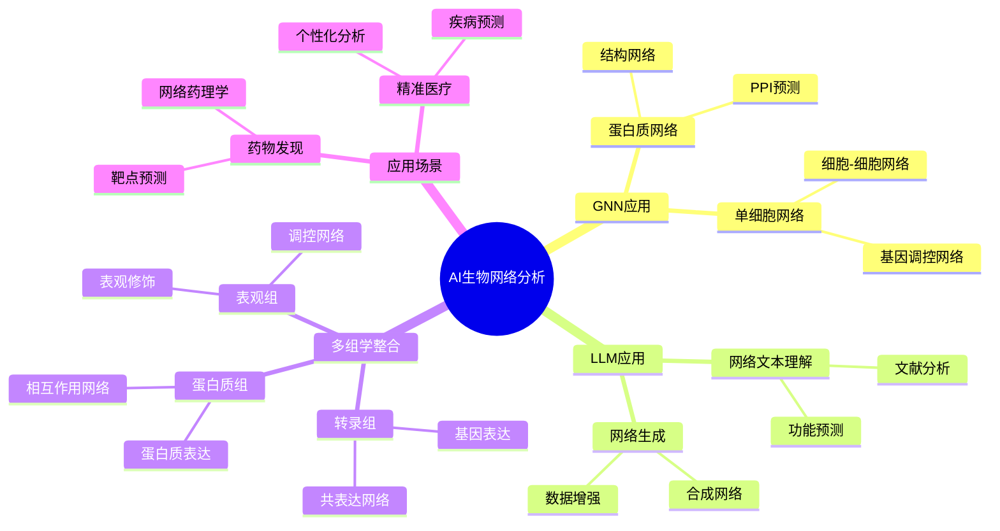
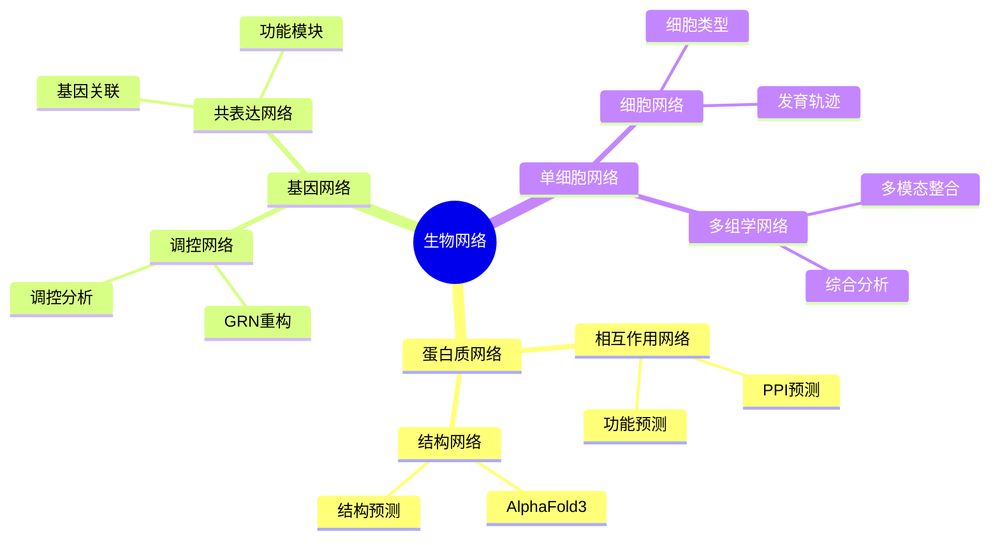
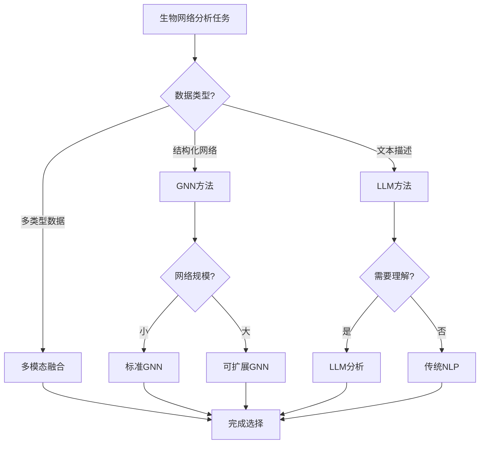
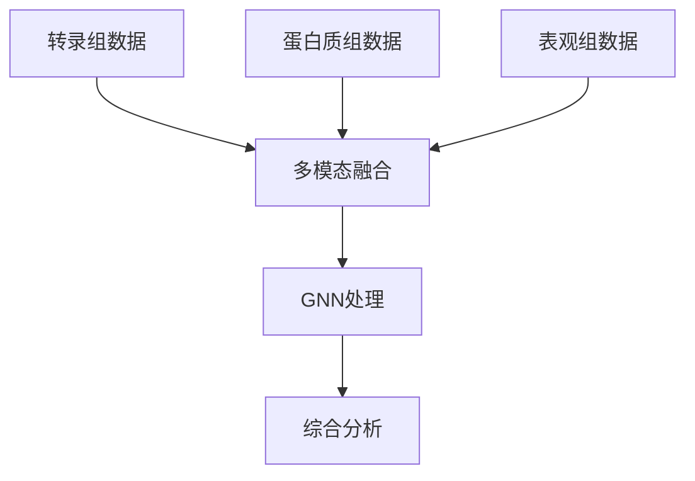
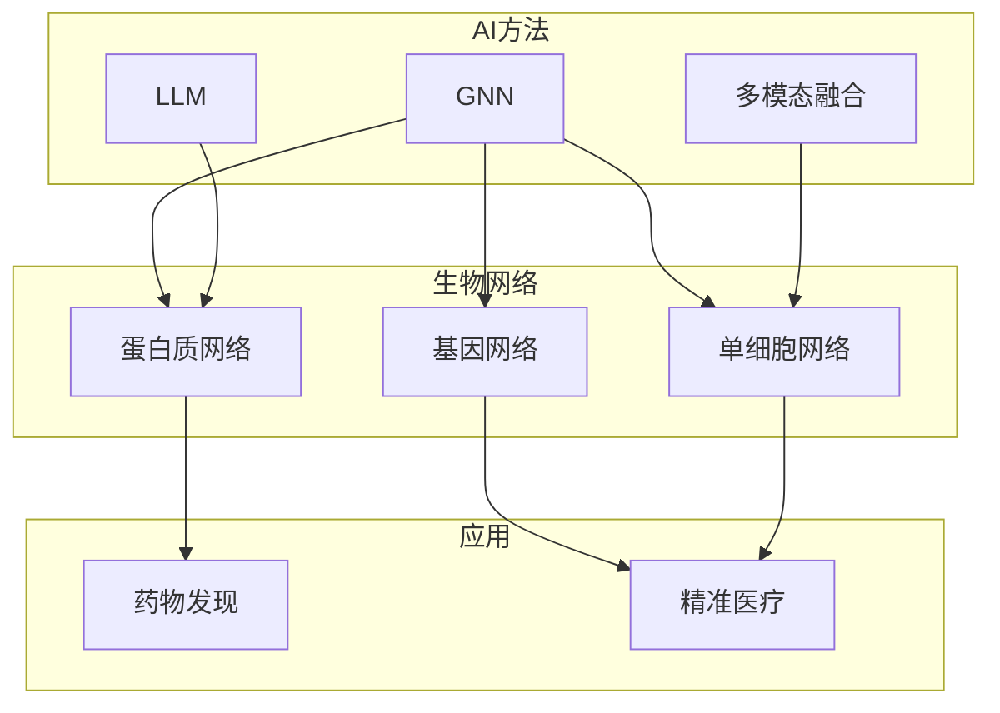

# AI驱动的生物网络分析专题思维表征工具 / AI-Driven Biological Network Analysis Special Topic Mental Representation Tools 2024-2025

## 📚 **概述 / Overview**

本文档为AI驱动的生物网络分析专题提供完整的思维表征工具集合，包括思维导图、对比矩阵、决策树、数据流图等多种表征方式。

**创建时间**: 2025年1月
**状态**: ✅ 完成
**专题**: AI驱动的生物网络分析（2024-2025最新研究）
**相关文档**: [AI驱动的生物网络分析专题-2024-2025.md](AI驱动的生物网络分析专题-2024-2025.md)

---

## 🗺️ **一、思维导图 / Mind Maps**

### 1.1 AI生物网络分析完整思维导图

### 1.2 生物网络类型思维导图

---

## 📊 **二、对比矩阵 / Comparison Matrices**

### 2.1 AI方法对比矩阵

| AI方法 | 适用网络 | 优势 | 劣势 | 适用场景 |
|--------|---------|------|------|---------|
| **GNN** | 结构化网络 | 结构建模强 | 需要图结构 | 蛋白质网络、单细胞网络 |
| **LLM** | 文本描述 | 语义理解强 | 需要文本 | 文献分析、功能预测 |
| **多模态融合** | 多类型数据 | 信息丰富 | 复杂度高 | 多组学整合 |

### 2.2 单细胞分析方法对比矩阵

| 方法 | 数据类型 | 计算成本 | 效果 | 适用场景 |
|------|---------|---------|------|---------|
| **传统聚类** | 单组学 | 低 | 中等 | 简单分析 |
| **GNN分析** | 单组学/多组学 | 中等 | 高 | 复杂网络分析 |
| **多组学整合** | 多组学 | 高 | 很高 | 综合分析 |

### 2.3 蛋白质网络预测方法对比矩阵

| 方法 | 输入 | 准确率 | 速度 | 2024-2025创新 |
|------|------|--------|------|--------------|
| **传统方法** | 序列 | 中等 | 快 | 基础方法 |
| **AlphaFold3** | 序列+结构 | 很高 | 中等 | 最新突破 |
| **GNN方法** | 序列+网络 | 高 | 中等 | 网络增强 |

---

## 🌳 **三、决策树 / Decision Trees**

### 3.1 AI方法选择决策树

---

## 🔄 **四、数据流图 / Data Flow Diagrams**

### 4.1 GNN蛋白质网络分析数据流

### 4.2 多组学整合数据流

---

## 🗺️ **五、概念地图 / Concept Maps**

### 5.1 AI生物网络分析核心概念关系

---

## 📈 **六、学习路径 / Learning Paths**

### 6.1 AI生物网络分析学习逻辑路径

---

**文档版本**: v1.0
**创建时间**: 2025年1月
**最后更新**: 2025年1月
**维护者**: GraphNetWorkCommunicate项目组
**状态**: ✅ 完成
