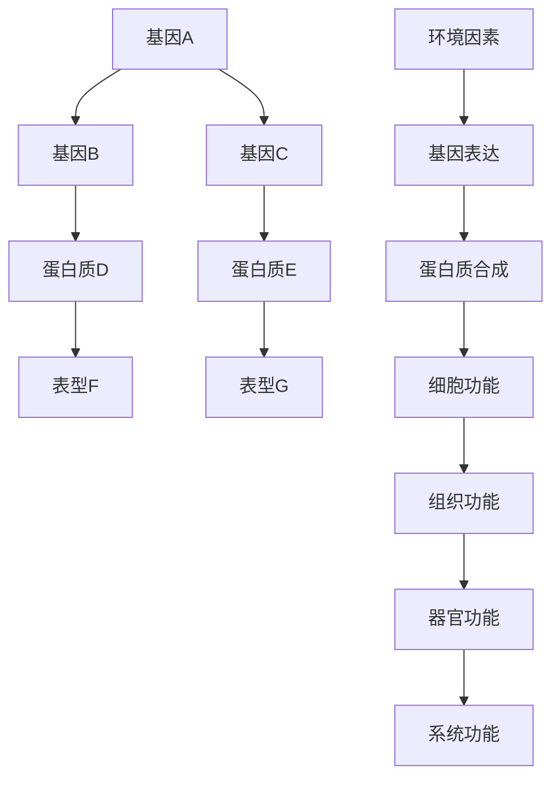
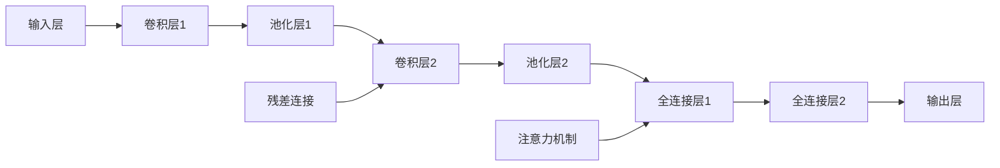

# 生物网络 - 应用案例与工程实践 / Biological Networks - Application Cases and Engineering Practice

## 📚 **概述 / Overview**

本文档介绍生物网络的应用案例与工程实践，包括神经网络在生物信息学中的应用、生物网络在药物发现中的应用、生物网络在医学诊断中的应用、生物网络在生态学中的应用和生物网络在农业中的应用。

## 📑 **目录 / Table of Contents**

- [生物网络 - 应用案例与工程实践 / Biological Networks - Application Cases and Engineering Practice](#生物网络---应用案例与工程实践--biological-networks---application-cases-and-engineering-practice)
  - [📚 **概述 / Overview**](#-概述--overview)
  - [📑 **目录 / Table of Contents**](#-目录--table-of-contents)
  - [1. 神经网络在生物信息学中的应用](#1-神经网络在生物信息学中的应用)
    - [1.1 蛋白质结构预测](#11-蛋白质结构预测)
      - [AlphaFold2系统](#alphafold2系统)
    - [1.2 基因表达分析](#12-基因表达分析)
      - [单细胞RNA测序分析](#单细胞rna测序分析)
  - [2. 生物网络在药物发现中的应用](#2-生物网络在药物发现中的应用)
    - [2.1 分子性质预测](#21-分子性质预测)
      - [分子图神经网络](#分子图神经网络)
    - [2.2 药物-靶点相互作用预测](#22-药物-靶点相互作用预测)
      - [深度学习药物发现](#深度学习药物发现)
  - [3. 生物网络在医学诊断中的应用](#3-生物网络在医学诊断中的应用)
    - [3.1 医学图像分析](#31-医学图像分析)
      - [深度学习医学影像诊断](#深度学习医学影像诊断)
    - [3.2 基因组学数据分析](#32-基因组学数据分析)
      - [深度学习基因组学](#深度学习基因组学)
  - [4. 生物网络在生态学中的应用](#4-生物网络在生态学中的应用)
    - [4.1 生态系统建模](#41-生态系统建模)
      - [神经网络生态系统模型](#神经网络生态系统模型)
  - [5. 生物网络在农业中的应用](#5-生物网络在农业中的应用)
    - [5.1 作物产量预测](#51-作物产量预测)
      - [深度学习农业预测](#深度学习农业预测)
  - [6. 多模态表达与可视化](#6-多模态表达与可视化)
    - [6.1 生物网络可视化](#61-生物网络可视化)
    - [6.2 神经网络架构图](#62-神经网络架构图)
    - [6.3 自动化脚本建议](#63-自动化脚本建议)

---

## 1. 神经网络在生物信息学中的应用

### 1.1 蛋白质结构预测

#### AlphaFold2系统

**项目概述**：
AlphaFold2是DeepMind开发的蛋白质结构预测系统，在CASP14竞赛中取得了突破性成果。

**技术实现**：

```python
class AlphaFold2System:
    """AlphaFold2蛋白质结构预测系统"""

    def __init__(self):
        self.evoformer = Evoformer()
        self.structure_module = StructureModule()
        self.msa_transformer = MSATransformer()

    def predict_protein_structure(self, protein_sequence):
        """预测蛋白质结构"""
        # 1. 多序列比对
        msa = self.generate_multiple_sequence_alignment(protein_sequence)

        # 2. Evoformer处理
        evoformer_output = self.evoformer.process(msa)

        # 3. 结构模块预测
        structure_prediction = self.structure_module.predict(evoformer_output)

        # 4. 结构优化
        optimized_structure = self.optimize_structure(structure_prediction)

        return optimized_structure

    def generate_multiple_sequence_alignment(self, sequence):
        """生成多序列比对"""
        # 使用HHblits搜索同源序列
        homologous_sequences = self.search_homologous_sequences(sequence)

        # 构建多序列比对
        msa = self.build_msa(sequence, homologous_sequences)

        return msa

    def evoformer_processing(self, msa):
        """Evoformer处理"""
        # 初始化表示
        msa_representation = self.initialize_msa_representation(msa)
        pair_representation = self.initialize_pair_representation(msa)

        # 交替更新
        for layer in range(self.num_layers):
            # MSA更新
            msa_representation = self.msa_attention(msa_representation, pair_representation)
            msa_representation = self.msa_transition(msa_representation)

            # 配对表示更新
            pair_representation = self.pair_attention(msa_representation, pair_representation)
            pair_representation = self.pair_transition(pair_representation)

        return msa_representation, pair_representation

    def structure_module_prediction(self, evoformer_output):
        """结构模块预测"""
        msa_representation, pair_representation = evoformer_output

        # 初始化结构
        structure = self.initialize_structure(msa_representation)

        # 迭代优化
        for iteration in range(self.num_iterations):
            # 预测扭转角
            torsion_angles = self.predict_torsion_angles(msa_representation, structure)

            # 更新结构
            structure = self.update_structure(structure, torsion_angles)

            # 计算损失
            loss = self.calculate_structure_loss(structure)

            # 早停检查
            if self.should_early_stop(loss):
                break

        return structure

    def optimize_structure(self, structure):
        """结构优化"""
        # 使用梯度下降优化
        optimizer = torch.optim.Adam(structure.parameters())

        for epoch in range(self.optimization_epochs):
            optimizer.zero_grad()

            # 计算损失
            loss = self.calculate_total_loss(structure)

            # 反向传播
            loss.backward()
            optimizer.step()

        return structure
```

### 1.2 基因表达分析

#### 单细胞RNA测序分析

**应用场景**：
使用神经网络分析单细胞RNA测序数据，识别细胞类型和基因调控网络。

```python
class SingleCellRNASeqAnalyzer:
    """单细胞RNA测序分析器"""

    def __init__(self):
        self.autoencoder = VariationalAutoencoder()
        self.clustering_model = ClusteringModel()
        self.gene_regulatory_network = GeneRegulatoryNetwork()

    def analyze_single_cell_data(self, expression_matrix):
        """分析单细胞数据"""
        # 1. 数据预处理
        preprocessed_data = self.preprocess_expression_data(expression_matrix)

        # 2. 降维
        reduced_dimensions = self.dimensionality_reduction(preprocessed_data)

        # 3. 细胞聚类
        cell_clusters = self.cluster_cells(reduced_dimensions)

        # 4. 基因调控网络推断
        regulatory_network = self.infer_gene_regulatory_network(preprocessed_data, cell_clusters)

        return {
            'clusters': cell_clusters,
            'regulatory_network': regulatory_network,
            'reduced_dimensions': reduced_dimensions
        }

    def dimensionality_reduction(self, data):
        """降维"""
        # 使用变分自编码器
        encoded = self.autoencoder.encode(data)
        decoded = self.autoencoder.decode(encoded)

        # 计算重构损失
        reconstruction_loss = self.calculate_reconstruction_loss(data, decoded)

        return encoded

    def cluster_cells(self, reduced_data):
        """细胞聚类"""
        # 使用K-means聚类
        clusters = self.clustering_model.kmeans_clustering(reduced_data)

        # 使用层次聚类
        hierarchical_clusters = self.clustering_model.hierarchical_clustering(reduced_data)

        # 使用DBSCAN
        dbscan_clusters = self.clustering_model.dbscan_clustering(reduced_data)

        return {
            'kmeans': clusters,
            'hierarchical': hierarchical_clusters,
            'dbscan': dbscan_clusters
        }

    def infer_gene_regulatory_network(self, expression_data, cell_clusters):
        """推断基因调控网络"""
        # 构建基因-基因相关性矩阵
        correlation_matrix = self.calculate_gene_correlations(expression_data)

        # 使用神经网络推断调控关系
        regulatory_network = self.gene_regulatory_network.infer_network(
            expression_data,
            correlation_matrix,
            cell_clusters
        )

        return regulatory_network

class GeneRegulatoryNetwork:
    """基因调控网络"""

    def __init__(self):
        self.graph_neural_network = GraphNeuralNetwork()
        self.attention_mechanism = AttentionMechanism()

    def infer_network(self, expression_data, correlation_matrix, cell_clusters):
        """推断调控网络"""
        # 构建图结构
        graph = self.build_gene_graph(correlation_matrix)

        # 使用图神经网络学习基因表示
        gene_embeddings = self.graph_neural_network.learn_embeddings(graph, expression_data)

        # 使用注意力机制推断调控关系
        regulatory_relationships = self.attention_mechanism.infer_regulations(gene_embeddings)

        # 构建调控网络
        regulatory_network = self.build_regulatory_network(regulatory_relationships)

        return regulatory_network
```

## 2. 生物网络在药物发现中的应用

### 2.1 分子性质预测

#### 分子图神经网络

**应用场景**：
使用图神经网络预测分子的物理化学性质和生物活性。

```python
class MolecularPropertyPredictor:
    """分子性质预测器"""

    def __init__(self):
        self.molecular_gnn = MolecularGraphNeuralNetwork()
        self.property_predictor = PropertyPredictor()

    def predict_molecular_properties(self, molecular_smiles):
        """预测分子性质"""
        # 1. 分子图构建
        molecular_graph = self.build_molecular_graph(molecular_smiles)

        # 2. 图神经网络处理
        molecular_embeddings = self.molecular_gnn.process(molecular_graph)

        # 3. 性质预测
        properties = self.property_predictor.predict(molecular_embeddings)

        return properties

    def build_molecular_graph(self, smiles):
        """构建分子图"""
        # 解析SMILES字符串
        atoms, bonds = self.parse_smiles(smiles)

        # 构建图结构
        graph = {
            'nodes': atoms,
            'edges': bonds,
            'node_features': self.extract_atom_features(atoms),
            'edge_features': self.extract_bond_features(bonds)
        }

        return graph

    def extract_atom_features(self, atoms):
        """提取原子特征"""
        features = []
        for atom in atoms:
            atom_features = [
                atom['atomic_number'],
                atom['degree'],
                atom['formal_charge'],
                atom['aromatic'],
                atom['hybridization']
            ]
            features.append(atom_features)
        return features

    def extract_bond_features(self, bonds):
        """提取键特征"""
        features = []
        for bond in bonds:
            bond_features = [
                bond['bond_type'],
                bond['conjugated'],
                bond['ring']
            ]
            features.append(bond_features)
        return features

class MolecularGraphNeuralNetwork:
    """分子图神经网络"""

    def __init__(self):
        self.graph_conv_layers = []
        self.attention_layers = []

    def process(self, molecular_graph):
        """处理分子图"""
        # 初始化节点表示
        node_embeddings = self.initialize_node_embeddings(molecular_graph['node_features'])

        # 图卷积层
        for conv_layer in self.graph_conv_layers:
            node_embeddings = conv_layer(node_embeddings, molecular_graph['edges'])

        # 注意力层
        for attention_layer in self.attention_layers:
            node_embeddings = attention_layer(node_embeddings)

        # 全局池化
        molecular_embedding = self.global_pooling(node_embeddings)

        return molecular_embedding
```

### 2.2 药物-靶点相互作用预测

#### 深度学习药物发现

**应用场景**：
预测药物分子与蛋白质靶点的相互作用。

```python
class DrugTargetInteractionPredictor:
    """药物-靶点相互作用预测器"""

    def __init__(self):
        self.drug_encoder = DrugEncoder()
        self.target_encoder = TargetEncoder()
        self.interaction_predictor = InteractionPredictor()

    def predict_drug_target_interaction(self, drug_smiles, target_sequence):
        """预测药物-靶点相互作用"""
        # 1. 药物编码
        drug_embedding = self.drug_encoder.encode(drug_smiles)

        # 2. 靶点编码
        target_embedding = self.target_encoder.encode(target_sequence)

        # 3. 相互作用预测
        interaction_score = self.interaction_predictor.predict(
            drug_embedding,
            target_embedding
        )

        return interaction_score

    def virtual_screening(self, target_sequence, drug_library):
        """虚拟筛选"""
        # 编码靶点
        target_embedding = self.target_encoder.encode(target_sequence)

        # 批量预测相互作用
        interaction_scores = []
        for drug_smiles in drug_library:
            drug_embedding = self.drug_encoder.encode(drug_smiles)
            score = self.interaction_predictor.predict(drug_embedding, target_embedding)
            interaction_scores.append(score)

        # 排序并返回top候选
        sorted_drugs = sorted(zip(drug_library, interaction_scores),
                            key=lambda x: x[1], reverse=True)

        return sorted_drugs[:100]  # 返回前100个候选

class DrugEncoder:
    """药物编码器"""

    def __init__(self):
        self.molecular_gnn = MolecularGraphNeuralNetwork()
        self.fingerprint_generator = MolecularFingerprintGenerator()

    def encode(self, drug_smiles):
        """编码药物分子"""
        # 图神经网络编码
        graph_embedding = self.molecular_gnn.encode(drug_smiles)

        # 分子指纹
        fingerprint = self.fingerprint_generator.generate_fingerprint(drug_smiles)

        # 特征融合
        combined_embedding = self.fuse_features(graph_embedding, fingerprint)

        return combined_embedding

class TargetEncoder:
    """靶点编码器"""

    def __init__(self):
        self.sequence_encoder = ProteinSequenceEncoder()
        self.structure_encoder = ProteinStructureEncoder()

    def encode(self, target_sequence):
        """编码蛋白质靶点"""
        # 序列编码
        sequence_embedding = self.sequence_encoder.encode(target_sequence)

        # 结构编码（如果有结构信息）
        if self.has_structure_info(target_sequence):
            structure_embedding = self.structure_encoder.encode(target_sequence)
            combined_embedding = self.fuse_embeddings(sequence_embedding, structure_embedding)
        else:
            combined_embedding = sequence_embedding

        return combined_embedding
```

## 3. 生物网络在医学诊断中的应用

### 3.1 医学图像分析

#### 深度学习医学影像诊断

**应用场景**：
使用卷积神经网络分析医学图像，辅助疾病诊断。

```python
class MedicalImageAnalyzer:
    """医学图像分析器"""

    def __init__(self):
        self.image_preprocessor = ImagePreprocessor()
        self.cnn_model = ConvolutionalNeuralNetwork()
        self.segmentation_model = SegmentationModel()

    def analyze_medical_image(self, image_path, analysis_type):
        """分析医学图像"""
        # 1. 图像预处理
        preprocessed_image = self.image_preprocessor.preprocess(image_path)

        # 2. 根据分析类型选择模型
        if analysis_type == 'classification':
            result = self.classify_image(preprocessed_image)
        elif analysis_type == 'segmentation':
            result = self.segment_image(preprocessed_image)
        elif analysis_type == 'detection':
            result = self.detect_objects(preprocessed_image)

        return result

    def classify_image(self, image):
        """图像分类"""
        # 使用CNN进行分类
        features = self.cnn_model.extract_features(image)
        classification_result = self.cnn_model.classify(features)

        return {
            'diagnosis': classification_result['prediction'],
            'confidence': classification_result['confidence'],
            'differential_diagnosis': classification_result['top_k_predictions']
        }

    def segment_image(self, image):
        """图像分割"""
        # 使用U-Net进行分割
        segmentation_mask = self.segmentation_model.segment(image)

        # 后处理
        processed_mask = self.post_process_segmentation(segmentation_mask)

        return {
            'segmentation_mask': processed_mask,
            'organ_volumes': self.calculate_organ_volumes(processed_mask),
            'abnormal_regions': self.detect_abnormal_regions(processed_mask)
        }

    def detect_objects(self, image):
        """目标检测"""
        # 使用YOLO或Faster R-CNN进行检测
        detected_objects = self.detection_model.detect(image)

        return {
            'detected_objects': detected_objects,
            'bounding_boxes': self.extract_bounding_boxes(detected_objects),
            'object_scores': self.calculate_object_scores(detected_objects)
        }

class ConvolutionalNeuralNetwork:
    """卷积神经网络"""

    def __init__(self):
        self.conv_layers = []
        self.pooling_layers = []
        self.fully_connected_layers = []

    def extract_features(self, image):
        """提取特征"""
        features = image

        # 卷积层
        for conv_layer in self.conv_layers:
            features = conv_layer(features)
            features = self.apply_activation(features)

        # 池化层
        for pool_layer in self.pooling_layers:
            features = pool_layer(features)

        return features

    def classify(self, features):
        """分类"""
        # 全连接层
        for fc_layer in self.fully_connected_layers:
            features = fc_layer(features)
            features = self.apply_activation(features)

        # Softmax分类
        probabilities = self.softmax(features)

        return {
            'prediction': self.get_top_prediction(probabilities),
            'confidence': self.get_confidence(probabilities),
            'top_k_predictions': self.get_top_k_predictions(probabilities, k=5)
        }
```

### 3.2 基因组学数据分析

#### 深度学习基因组学

**应用场景**：
使用深度学习分析基因组数据，识别疾病相关基因和变异。

```python
class GenomicsDataAnalyzer:
    """基因组学数据分析器"""

    def __init__(self):
        self.sequence_encoder = DNASequenceEncoder()
        self.variant_caller = VariantCaller()
        self.disease_predictor = DiseasePredictor()

    def analyze_genomic_data(self, dna_sequence, patient_data):
        """分析基因组数据"""
        # 1. 序列编码
        sequence_embedding = self.sequence_encoder.encode(dna_sequence)

        # 2. 变异检测
        variants = self.variant_caller.call_variants(dna_sequence)

        # 3. 疾病风险预测
        disease_risk = self.disease_predictor.predict_risk(sequence_embedding, variants, patient_data)

        return {
            'variants': variants,
            'disease_risk': disease_risk,
            'sequence_embedding': sequence_embedding
        }

    def identify_disease_genes(self, genomic_data, phenotype_data):
        """识别疾病相关基因"""
        # 构建基因-表型关联网络
        gene_phenotype_network = self.build_gene_phenotype_network(genomic_data, phenotype_data)

        # 使用图神经网络识别疾病基因
        disease_genes = self.identify_disease_genes_with_gnn(gene_phenotype_network)

        return disease_genes

class DNASequenceEncoder:
    """DNA序列编码器"""

    def __init__(self):
        self.conv1d_layers = []
        self.lstm_layers = []

    def encode(self, dna_sequence):
        """编码DNA序列"""
        # 序列数字化
        numeric_sequence = self.digitize_sequence(dna_sequence)

        # 1D卷积特征提取
        conv_features = numeric_sequence
        for conv_layer in self.conv1d_layers:
            conv_features = conv_layer(conv_features)

        # LSTM序列建模
        lstm_features = conv_features
        for lstm_layer in self.lstm_layers:
            lstm_features = lstm_layer(lstm_features)

        return lstm_features

    def digitize_sequence(self, sequence):
        """序列数字化"""
        # 将ATCG转换为数字
        mapping = {'A': 0, 'T': 1, 'C': 2, 'G': 3}
        numeric_sequence = [mapping[base] for base in sequence]
        return numeric_sequence
```

## 4. 生物网络在生态学中的应用

### 4.1 生态系统建模

#### 神经网络生态系统模型

**应用场景**：
使用神经网络建模生态系统动态，预测物种相互作用和环境变化影响。

```python
class EcosystemModeler:
    """生态系统建模器"""

    def __init__(self):
        self.species_interaction_network = SpeciesInteractionNetwork()
        self.environmental_model = EnvironmentalModel()
        self.population_dynamics = PopulationDynamics()

    def model_ecosystem_dynamics(self, species_data, environmental_data, time_steps):
        """建模生态系统动态"""
        # 1. 构建物种相互作用网络
        interaction_network = self.species_interaction_network.build_network(species_data)

        # 2. 环境变化建模
        environmental_changes = self.environmental_model.model_changes(environmental_data, time_steps)

        # 3. 种群动态预测
        population_trajectories = self.population_dynamics.predict_trajectories(
            interaction_network,
            environmental_changes,
            time_steps
        )

        return {
            'interaction_network': interaction_network,
            'environmental_changes': environmental_changes,
            'population_trajectories': population_trajectories
        }

    def predict_species_extinction_risk(self, species_data, environmental_scenarios):
        """预测物种灭绝风险"""
        extinction_risks = {}

        for scenario in environmental_scenarios:
            # 建模环境变化
            environmental_changes = self.environmental_model.simulate_scenario(scenario)

            # 预测种群变化
            population_changes = self.population_dynamics.simulate_population_changes(
                species_data,
                environmental_changes
            )

            # 计算灭绝风险
            extinction_risk = self.calculate_extinction_risk(population_changes)
            extinction_risks[scenario['name']] = extinction_risk

        return extinction_risks

class SpeciesInteractionNetwork:
    """物种相互作用网络"""

    def __init__(self):
        self.graph_neural_network = GraphNeuralNetwork()

    def build_network(self, species_data):
        """构建相互作用网络"""
        # 构建图结构
        nodes = species_data['species']
        edges = self.infer_interactions(species_data)

        # 使用图神经网络学习物种表示
        species_embeddings = self.graph_neural_network.learn_embeddings(nodes, edges)

        # 构建相互作用矩阵
        interaction_matrix = self.build_interaction_matrix(species_embeddings)

        return {
            'nodes': nodes,
            'edges': edges,
            'embeddings': species_embeddings,
            'interaction_matrix': interaction_matrix
        }

    def infer_interactions(self, species_data):
        """推断物种相互作用"""
        # 基于生态位重叠推断竞争关系
        competition_edges = self.infer_competition(species_data)

        # 基于捕食关系推断捕食-被捕食关系
        predation_edges = self.infer_predation(species_data)

        # 基于共生关系推断互利共生
        mutualism_edges = self.infer_mutualism(species_data)

        return {
            'competition': competition_edges,
            'predation': predation_edges,
            'mutualism': mutualism_edges
        }
```

## 5. 生物网络在农业中的应用

### 5.1 作物产量预测

#### 深度学习农业预测

**应用场景**：
使用神经网络预测作物产量，优化农业管理。

```python
class CropYieldPredictor:
    """作物产量预测器"""

    def __init__(self):
        self.weather_model = WeatherModel()
        self.soil_model = SoilModel()
        self.crop_model = CropModel()

    def predict_crop_yield(self, weather_data, soil_data, crop_data, management_practices):
        """预测作物产量"""
        # 1. 天气数据处理
        weather_features = self.weather_model.extract_features(weather_data)

        # 2. 土壤数据处理
        soil_features = self.soil_model.extract_features(soil_data)

        # 3. 作物数据处理
        crop_features = self.crop_model.extract_features(crop_data)

        # 4. 管理措施编码
        management_features = self.encode_management_practices(management_practices)

        # 5. 综合预测
        yield_prediction = self.combined_model.predict(
            weather_features,
            soil_features,
            crop_features,
            management_features
        )

        return {
            'predicted_yield': yield_prediction,
            'confidence_interval': self.calculate_confidence_interval(yield_prediction),
            'factors_importance': self.analyze_factors_importance()
        }

    def optimize_management_practices(self, weather_forecast, soil_conditions, target_yield):
        """优化管理措施"""
        # 使用强化学习优化管理决策
        optimal_practices = self.reinforcement_learning_optimizer.optimize(
            weather_forecast,
            soil_conditions,
            target_yield
        )

        return optimal_practices

class WeatherModel:
    """天气模型"""

    def __init__(self):
        self.temporal_encoder = TemporalEncoder()
        self.spatial_encoder = SpatialEncoder()

    def extract_features(self, weather_data):
        """提取天气特征"""
        # 时间序列编码
        temporal_features = self.temporal_encoder.encode(weather_data['time_series'])

        # 空间特征编码
        spatial_features = self.spatial_encoder.encode(weather_data['spatial_data'])

        # 特征融合
        combined_features = self.fuse_features(temporal_features, spatial_features)

        return combined_features
```

## 6. 多模态表达与可视化

### 6.1 生物网络可视化



### 6.2 神经网络架构图



### 6.3 自动化脚本建议

- **`scripts/bioinformatics_pipeline.py`**：生物信息学分析流水线
- **`scripts/drug_discovery_analyzer.py`**：药物发现分析器
- **`scripts/medical_image_processor.py`**：医学图像处理器
- **`scripts/ecosystem_simulator.py`**：生态系统仿真器

---

*本文档提供了生物网络的完整应用案例和工程实践，展示了生物网络技术在各个领域的实际应用和未来发展前景。*
