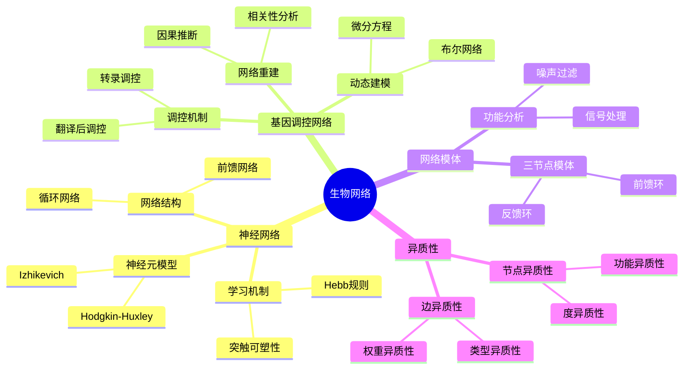
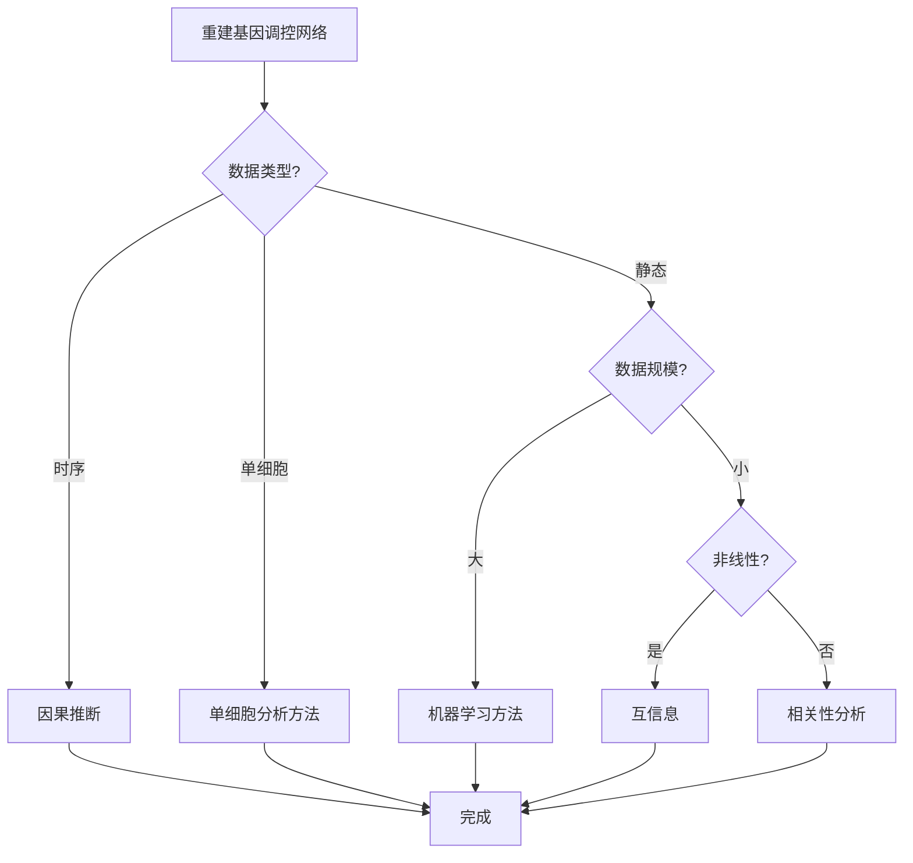

# 生物网络思维表征工具 / Biological Networks Mental Representation Tools

## 📚 **概述 / Overview**

本文档提供生物网络模块的多种思维表征工具，包括思维导图、对比矩阵、决策树、逻辑路径和概念地图，帮助更好地理解和应用生物网络知识。

**创建时间**: 2025年1月
**模块**: 生物网络
**状态**: 🚀 持续更新中

---

## 🗺️ **一、思维导图 / Mind Maps**

### 1.1 生物网络核心概念思维导图

---

## 📊 **二、对比矩阵 / Comparison Matrices**

### 2.1 基因调控网络重建方法对比矩阵

| 方法 | 原理 | 准确性 | 计算复杂度 | 适用数据 | 特点 | 应用场景 |
|------|------|--------|-----------|---------|------|---------|
| **相关性分析** | 相关性计算 | 低 | O(n²) | 静态数据 | 简单、快速 | 初步分析 |
| **互信息** | 信息论 | 中 | O(n²) | 静态数据 | 非线性关系 | 复杂调控 |
| **因果推断** | 因果关系 | 高 | O(n³) | 时序数据 | 方向性、准确 | 精确重建 |
| **机器学习** | 模式学习 | 高 | 训练：高 | 大数据 | 非线性、自适应 | 大规模网络 |
| **单细胞分析** | 单细胞数据 | 很高 | 很高 | 单细胞数据 | 高分辨率 | 细胞异质性 |

**选择指南**：

- **初步分析**：相关性分析
- **非线性关系**：互信息
- **精确重建**：因果推断
- **大规模数据**：机器学习
- **单细胞数据**：单细胞分析方法

---

## 🌳 **三、决策树 / Decision Trees**

### 3.1 基因调控网络重建方法选择决策树

---

**文档版本**: v1.0
**创建时间**: 2025年1月
**最后更新**: 2025年1月
**维护者**: GraphNetWorkCommunicate项目组
