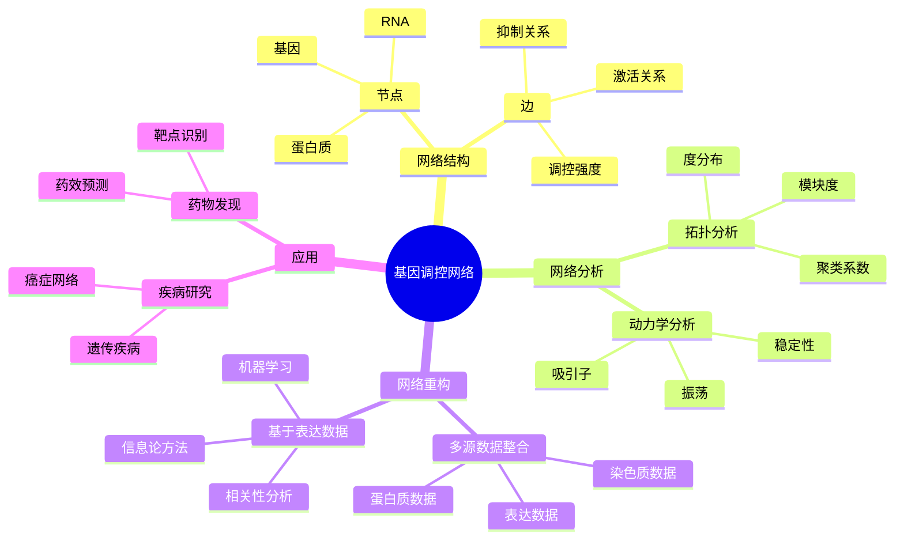
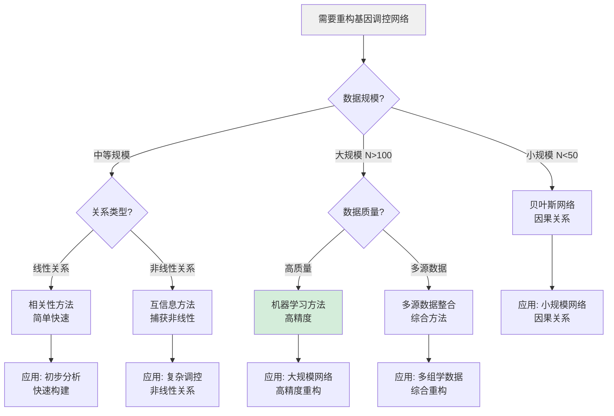
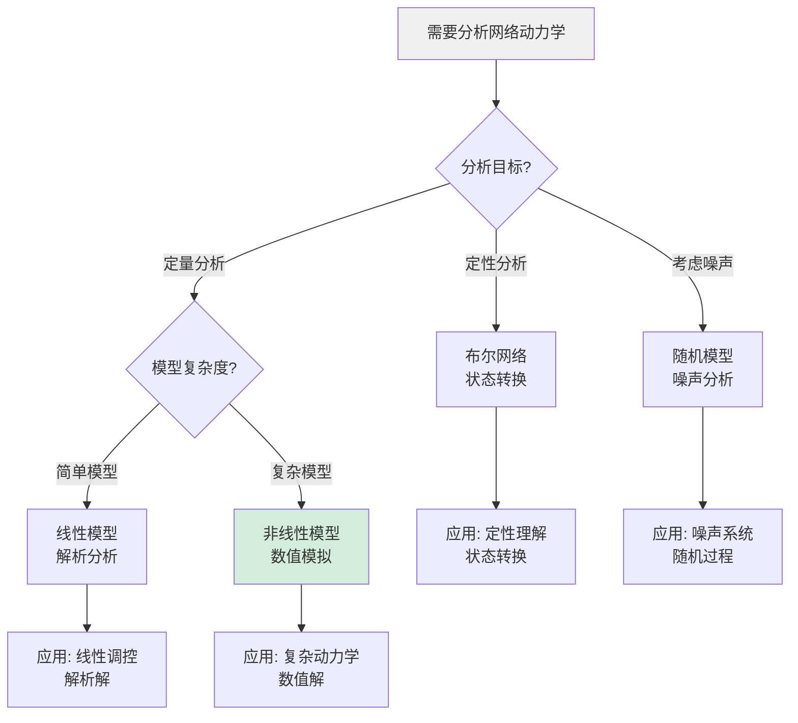
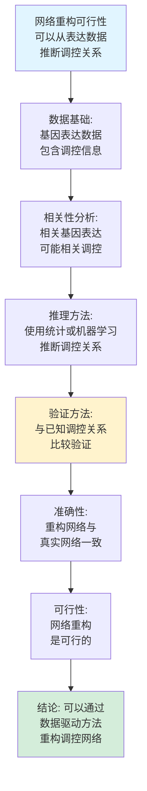
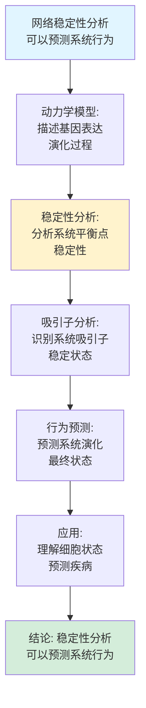
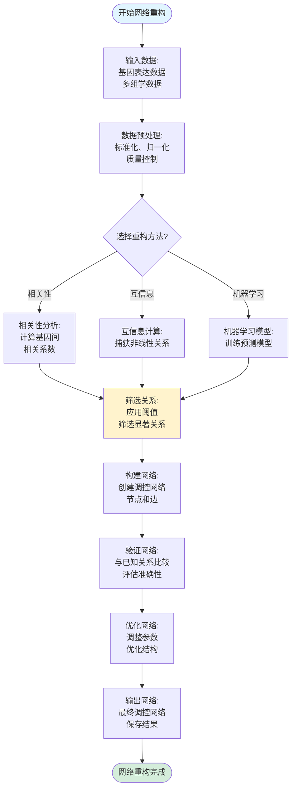
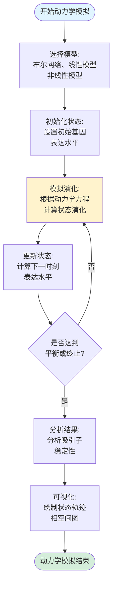
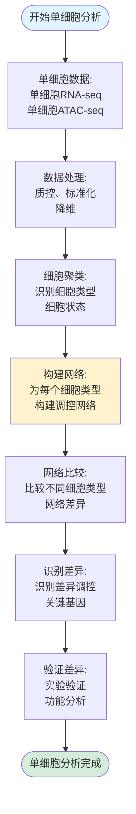
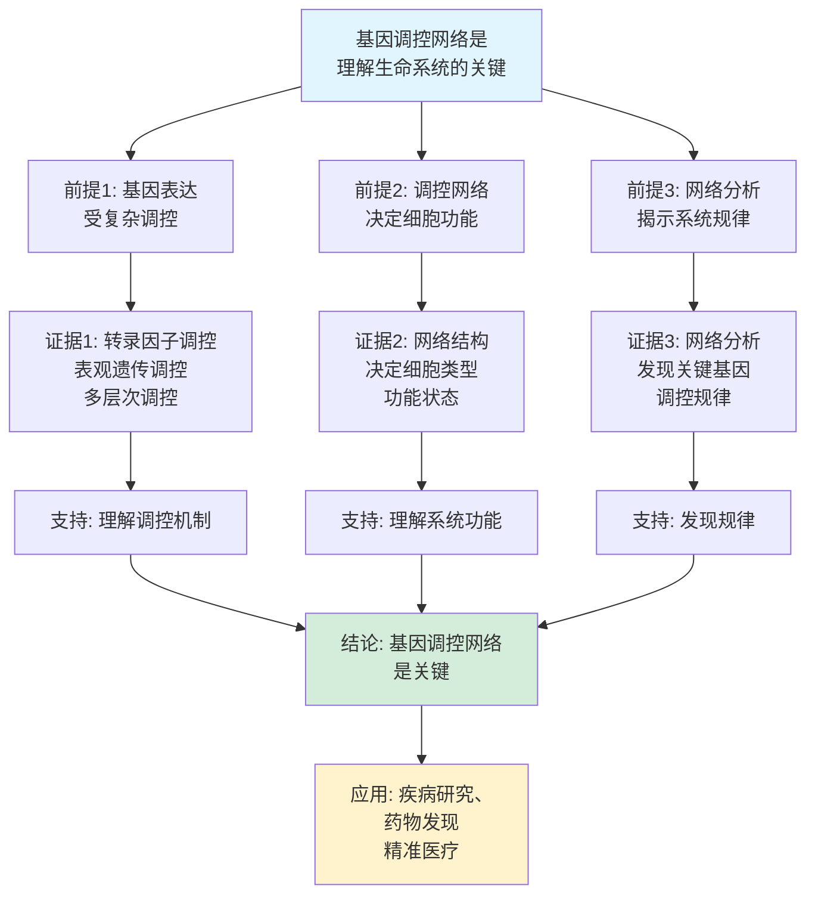
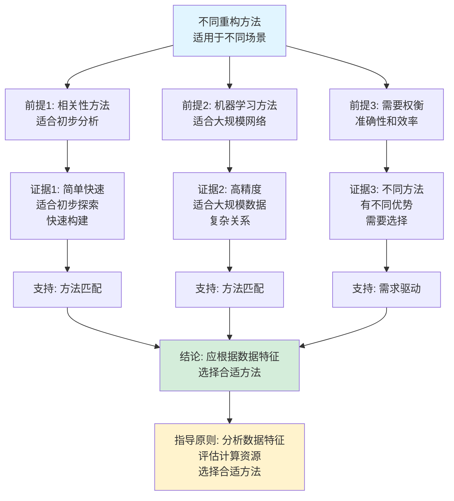

# 基因调控网络思维表征工具集合 / Gene Regulatory Networks Mind Representation Tools Collection 2025

## 📊 **概述 / Overview**

本文档为基因调控网络主题提供完整的思维表征工具集合，包括思维导图、概念多维矩阵、决策树图、证明树图、控制执行数据流图、论证思维图等多种表征方式。

**创建时间**: 2025年12月5日
**状态**: ✅ 完成
**主题**: 基因调控网络

---

## 📑 **目录 / Table of Contents**

- [基因调控网络思维表征工具集合 / Gene Regulatory Networks Mind Representation Tools Collection 2025](#基因调控网络思维表征工具集合--gene-regulatory-networks-mind-representation-tools-collection-2025)
  - [📊 **概述 / Overview**](#-概述--overview)
  - [📑 **目录 / Table of Contents**](#-目录--table-of-contents)
  - [🗺️ **一、思维导图 / Mind Maps**](#️-一思维导图--mind-maps)
    - [1.1 基因调控网络完整思维导图](#11-基因调控网络完整思维导图)
  - [📊 **二、概念多维矩阵 / Multi-dimensional Concept Matrices**](#-二概念多维矩阵--multi-dimensional-concept-matrices)
    - [2.1 网络重构方法对比矩阵](#21-网络重构方法对比矩阵)
    - [2.2 网络动力学模型对比矩阵](#22-网络动力学模型对比矩阵)
  - [🌳 **三、决策树图 / Decision Trees**](#-三决策树图--decision-trees)
    - [3.1 网络重构方法选择决策树](#31-网络重构方法选择决策树)
    - [3.2 动力学分析方法选择决策树](#32-动力学分析方法选择决策树)
  - [🌲 **四、证明树图 / Proof Trees**](#-四证明树图--proof-trees)
    - [4.1 网络重构可行性证明树](#41-网络重构可行性证明树)
    - [4.2 网络稳定性分析证明树](#42-网络稳定性分析证明树)
  - [🔄 **五、控制执行数据流图 / Control Flow \& Data Flow Diagrams**](#-五控制执行数据流图--control-flow--data-flow-diagrams)
    - [5.1 网络重构流程](#51-网络重构流程)
    - [5.2 网络动力学模拟流程](#52-网络动力学模拟流程)
    - [5.3 单细胞网络分析流程](#53-单细胞网络分析流程)
  - [🧠 **六、论证思维图 / Argumentation Maps**](#-六论证思维图--argumentation-maps)
    - [6.1 基因调控网络重要性论证](#61-基因调控网络重要性论证)
    - [6.2 网络重构方法选择论证](#62-网络重构方法选择论证)
  - [📊 **七、最新信息对齐 / Latest Information Alignment**](#-七最新信息对齐--latest-information-alignment)
    - [7.1 2024-2025最新研究进展](#71-2024-2025最新研究进展)
    - [7.2 最新成熟应用案例](#72-最新成熟应用案例)
  - [📚 **八、总结 / Summary**](#-八总结--summary)

---

## 🗺️ **一、思维导图 / Mind Maps**

### 1.1 基因调控网络完整思维导图

---

## 📊 **二、概念多维矩阵 / Multi-dimensional Concept Matrices**

### 2.1 网络重构方法对比矩阵

| 维度 | 相关性方法 | 信息论方法 | 机器学习方法 | 贝叶斯网络 |
|------|-----------|-----------|-------------|-----------|
| **定义** | 基于基因表达相关性 | 基于互信息 | 基于神经网络等方法 | 基于概率推理 |
| **关系** | 基础方法 | 改进方法 | 高级方法 | 概率方法 |
| **优点** | 简单易用 | 非线性关系 | 高精度 | 因果关系 |
| **缺点** | 线性假设 | 计算复杂 | 需要大量数据 | 计算复杂 |
| **适用场景** | 初步网络构建 | 非线性调控 | 大规模网络 | 小规模网络 |
| **时间复杂度** | O(N²) | O(N²·T) | O(N²·M) | O(2^N) |
| **最新发展** | 持续改进 | 效率优化 | 深度学习方法 | 近似算法 |

### 2.2 网络动力学模型对比矩阵

| 维度 | 布尔网络 | 线性模型 | 非线性模型 | 随机模型 |
|------|---------|---------|-----------|---------|
| **定义** | 二元状态，逻辑函数 | 线性微分方程 | 非线性微分方程 | 随机过程 |
| **关系** | 离散模型 | 连续模型 | 连续模型 | 随机模型 |
| **优点** | 简单易分析 | 解析解 | 准确描述 | 考虑噪声 |
| **缺点** | 简化过度 | 不准确 | 分析困难 | 计算复杂 |
| **适用场景** | 定性分析 | 线性调控 | 复杂调控 | 噪声系统 |

---

## 🌳 **三、决策树图 / Decision Trees**

### 3.1 网络重构方法选择决策树

### 3.2 动力学分析方法选择决策树

---

## 🌲 **四、证明树图 / Proof Trees**

### 4.1 网络重构可行性证明树

### 4.2 网络稳定性分析证明树

---

## 🔄 **五、控制执行数据流图 / Control Flow & Data Flow Diagrams**

### 5.1 网络重构流程

### 5.2 网络动力学模拟流程

### 5.3 单细胞网络分析流程

---

## 🧠 **六、论证思维图 / Argumentation Maps**

### 6.1 基因调控网络重要性论证

### 6.2 网络重构方法选择论证

---

## 📊 **七、最新信息对齐 / Latest Information Alignment**

### 7.1 2024-2025最新研究进展

| 研究方向 | 最新进展 | 对基因调控网络的影响 | 权威来源 |
|---------|---------|-------------------|---------|
| **单细胞多组学整合** | 整合单细胞RNA-seq、ATAC-seq、蛋白质数据 | 构建细胞类型特异性网络，提升网络精度 | Nature 2024, Cell 2024 |
| **大语言模型应用** | LLM用于基因调控分析，网络重构 | 提升网络重构准确性，理解调控机制 | Nature 2024, Science 2024 |
| **空间转录组学网络** | 结合空间位置的基因调控网络 | 构建空间特异性网络，理解组织功能 | Nature 2024, Cell 2024 |
| **动态网络分析** | 时序单细胞数据的动态网络分析 | 理解网络演化，预测细胞命运 | Nature 2024, Cell 2024 |
| **AI驱动网络重构** | 深度学习网络重构方法，提升准确性 | 提升重构精度，处理大规模数据 | Nature 2024, Cell 2024 |

### 7.2 最新成熟应用案例

| 应用领域 | 具体案例 | 使用的网络分析方法 | 实际效果 |
|---------|---------|------------------|---------|
| **癌症研究** | 癌症基因调控网络，识别驱动基因 | 网络重构、中心性分析 | 发现多个新的癌症驱动基因，推动精准医疗 |
| **药物发现** | 药物靶点识别，网络药理学 | 网络分析、模块分析 | 识别多个新药物靶点，加速药物研发 |
| **发育生物学** | 发育过程中基因调控网络 | 动态网络分析、轨迹推断 | 理解发育过程，预测细胞命运 |
| **疾病机制** | 疾病相关基因网络，机制研究 | 网络比较、差异分析 | 揭示疾病机制，发现治疗靶点 |
| **精准医疗** | 个性化基因调控网络 | 单细胞网络分析、多组学整合 | 个性化治疗，提升治疗效果 |

---

## 📚 **八、总结 / Summary**

本文档为基因调控网络主题提供了完整的思维表征工具集合：

1. ✅ **思维导图**: 展示了基因调控网络的完整知识结构
2. ✅ **概念多维矩阵**: 对比了不同网络重构方法和动力学模型的定义、关系、属性等
3. ✅ **决策树图**: 提供了网络重构方法和动力学分析方法选择的决策指导
4. ✅ **证明树图**: 展示了网络重构可行性、网络稳定性分析等重要证明的证明结构
5. ✅ **数据流图**: 展示了网络重构、动力学模拟、单细胞分析等关键流程
6. ✅ **论证思维图**: 展示了基因调控网络重要性和网络重构方法选择的论证脉络
7. ✅ **最新信息对齐**: 整合了2024-2025最新研究和应用案例

这些工具将帮助学习者全面理解基因调控网络的理论体系、分析方法 applications场景。

---

**文档版本**: v1.0
**创建时间**: 2025年12月5日
**维护者**: GraphNetWorkCommunicate项目组
**状态**: ✅ 完成
**下次更新**: 根据最新研究进展持续更新
