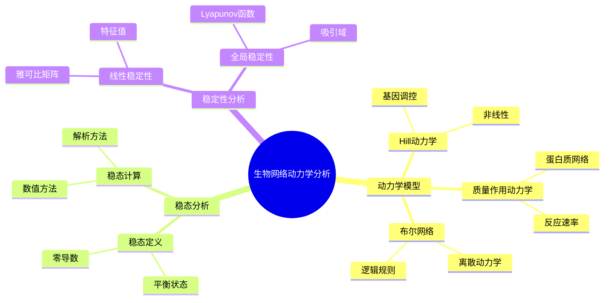
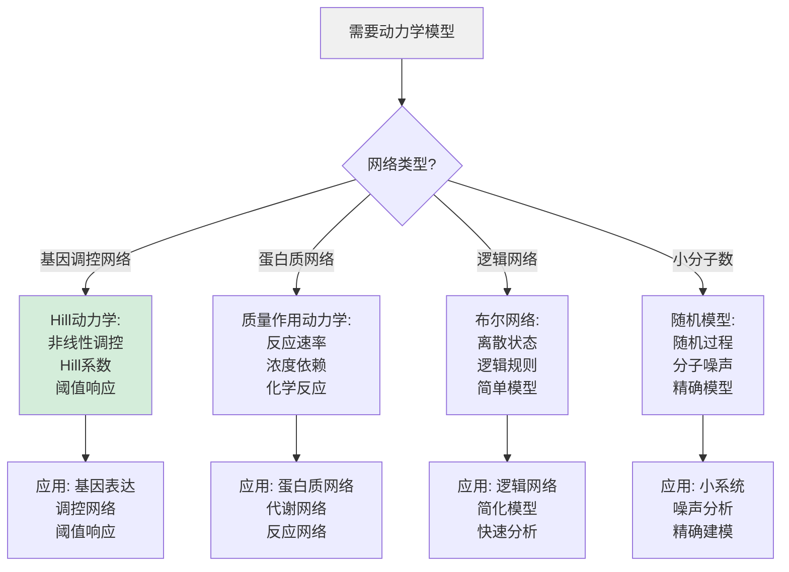
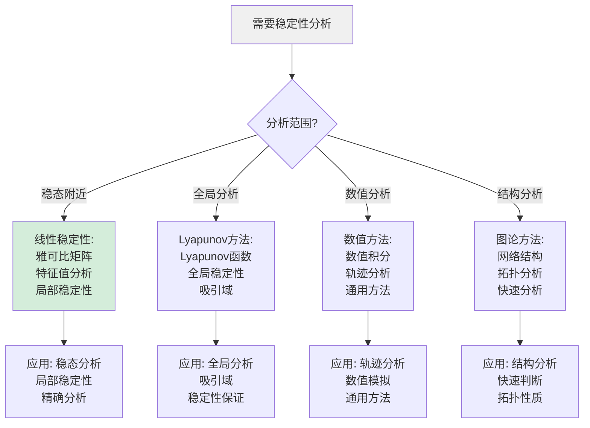
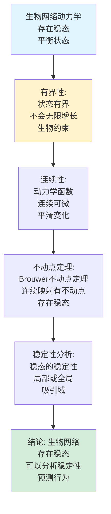
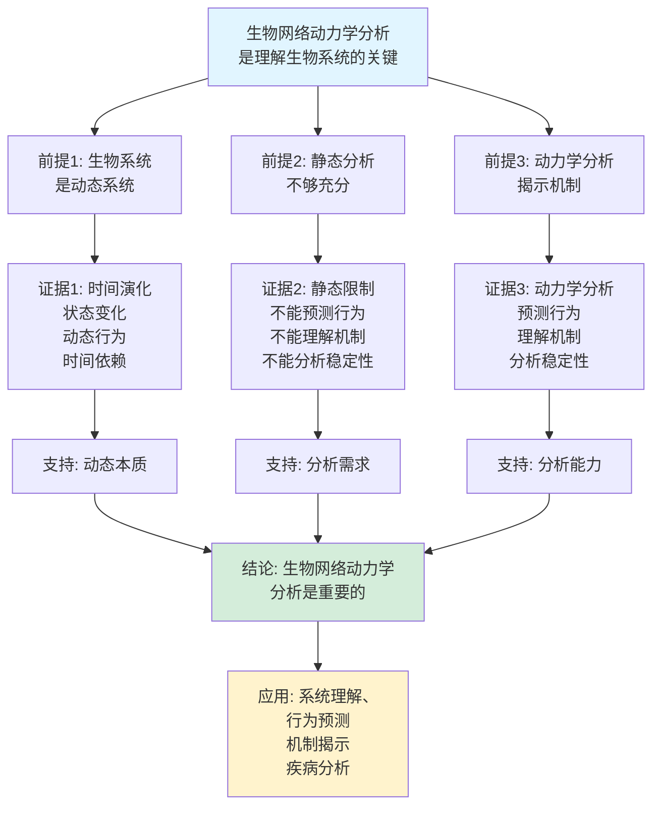
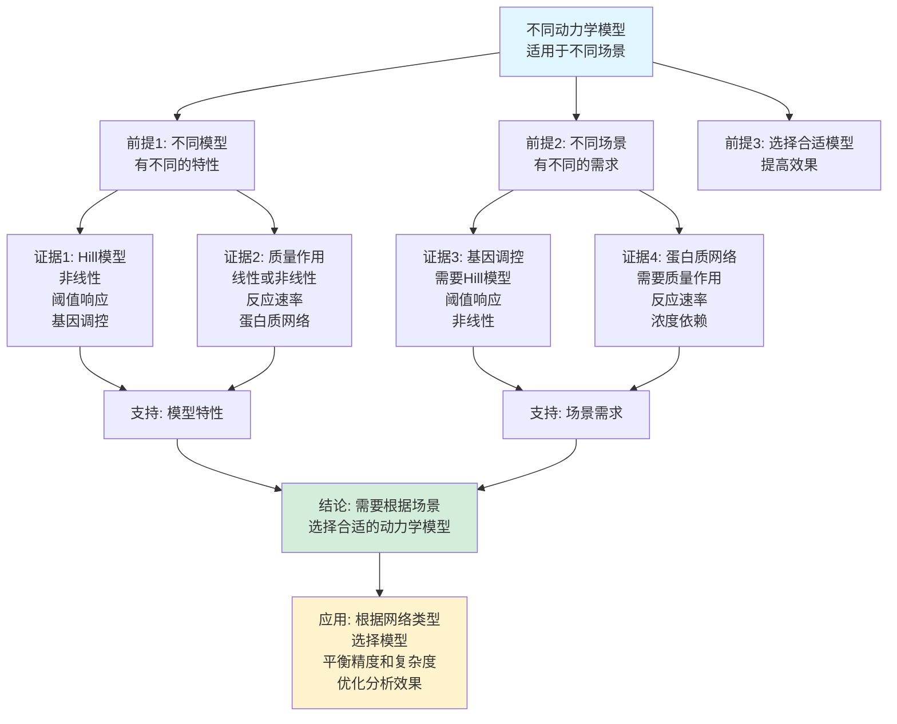

# 生物网络动力学分析思维表征工具集合 / Biological Network Dynamics Analysis Mind Representation Tools Collection 2025

## 📊 **概述 / Overview**

本文档为生物网络动力学分析主题提供完整的思维表征工具集合，包括思维导图、概念多维矩阵、决策树图、证明树图、控制执行数据流图、论证思维图等多种表征方式。

**创建时间**: 2025年12月5日
**状态**: ✅ 完成
**主题**: 生物网络动力学分析

---

## 📑 **目录 / Table of Contents**

- [生物网络动力学分析思维表征工具集合 / Biological Network Dynamics Analysis Mind Representation Tools Collection 2025](#生物网络动力学分析思维表征工具集合--biological-network-dynamics-analysis-mind-representation-tools-collection-2025)
  - [📊 **概述 / Overview**](#-概述--overview)
  - [📑 **目录 / Table of Contents**](#-目录--table-of-contents)
  - [🗺️ **一、思维导图 / Mind Maps**](#️-一思维导图--mind-maps)
    - [1.1 生物网络动力学分析完整思维导图](#11-生物网络动力学分析完整思维导图)
  - [📊 **二、概念多维矩阵 / Multi-dimensional Concept Matrices**](#-二概念多维矩阵--multi-dimensional-concept-matrices)
    - [2.1 动力学模型对比矩阵](#21-动力学模型对比矩阵)
    - [2.2 稳定性分析方法对比矩阵](#22-稳定性分析方法对比矩阵)
  - [🌳 **三、决策树图 / Decision Trees**](#-三决策树图--decision-trees)
    - [3.1 动力学模型选择决策树](#31-动力学模型选择决策树)
    - [3.2 稳定性分析方法选择决策树](#32-稳定性分析方法选择决策树)
  - [🌲 **四、证明树图 / Proof Trees**](#-四证明树图--proof-trees)
    - [4.1 稳态存在性证明树](#41-稳态存在性证明树)
    - [4.2 稳定性判据证明树](#42-稳定性判据证明树)
  - [🔄 **五、控制执行数据流图 / Control Flow \& Data Flow Diagrams**](#-五控制执行数据流图--control-flow--data-flow-diagrams)
    - [5.1 动力学模拟流程](#51-动力学模拟流程)
    - [5.2 稳态分析流程](#52-稳态分析流程)
    - [5.3 稳定性分析流程](#53-稳定性分析流程)
  - [🧠 **六、论证思维图 / Argumentation Maps**](#-六论证思维图--argumentation-maps)
    - [6.1 生物网络动力学重要性论证](#61-生物网络动力学重要性论证)
    - [6.2 不同模型适用性论证](#62-不同模型适用性论证)
  - [📊 **七、最新信息对齐 / Latest Information Alignment**](#-七最新信息对齐--latest-information-alignment)
    - [7.1 2024-2025最新研究进展](#71-2024-2025最新研究进展)
    - [7.2 最新成熟应用案例](#72-最新成熟应用案例)
  - [📚 **八、总结 / Summary**](#-八总结--summary)

---

## 🗺️ **一、思维导图 / Mind Maps**

### 1.1 生物网络动力学分析完整思维导图



---

## 📊 **二、概念多维矩阵 / Multi-dimensional Concept Matrices**

### 2.1 动力学模型对比矩阵

| 维度 | Hill动力学 | 质量作用动力学 | 布尔网络 | 随机模型 |
|------|-----------|--------------|---------|---------|
| **定义** | dx/dt = βx^n/(K^n+x^n) - γx | dx/dt = Σk_ij x_j - γx | x(t+1) = f(x(t)) | 随机过程 |
| **关系** | 非线性模型 | 基础模型 | 离散模型 | 随机模型 |
| **变量类型** | 连续 | 连续 | 离散 | 随机 |
| **适用场景** | 基因调控 | 蛋白质网络 | 逻辑网络 | 小分子数 |
| **计算复杂度** | 中 | 中 | 低 | 高 |
| **优缺点** | 真实但参数多 | 基础但简单 | 简单但不精确 | 精确但复杂 |
| **最新优化** | 参数估计 | 高效求解 | 扩展模型 | 近似方法 |

### 2.2 稳定性分析方法对比矩阵

| 维度 | 线性稳定性 | Lyapunov方法 | 数值方法 | 图论方法 |
|------|-----------|-------------|---------|---------|
| **定义** | 雅可比矩阵特征值 | Lyapunov函数 | 数值积分 | 网络结构 |
| **关系** | 局部方法 | 全局方法 | 数值方法 | 结构方法 |
| **适用场景** | 稳态附近 | 全局分析 | 任意状态 | 结构分析 |
| **精度** | 高（局部） | 高（全局） | 中（数值误差） | 中（近似） |
| **计算复杂度** | O(n²) | O(n³) | O(n²) | O(n+m) |
| **优缺点** | 精确但局部 | 全局但难找函数 | 通用但有误差 | 快速但近似 |
| **最新优化** | 快速特征值 | 构造方法 | 高精度算法 | 结构优化 |

---

## 🌳 **三、决策树图 / Decision Trees**

### 3.1 动力学模型选择决策树



### 3.2 稳定性分析方法选择决策树



---

## 🌲 **四、证明树图 / Proof Trees**

### 4.1 稳态存在性证明树



### 4.2 稳定性判据证明树

```mermaid
graph TD
    Theorem[线性稳定性判据:<br/>稳态稳定当且仅当<br/>雅可比矩阵特征值<br/>实部全为负] --> Jacobian[雅可比矩阵:<br/>J_ij = ∂f_i/∂x_j<br/>在稳态处计算<br/>线性化系统]

    Jacobian --> Eigenvalue[特征值分析:<br/>计算特征值λ<br/>特征方程<br/>det(J-λI) = 0]

    Eigenvalue --> Criterion[稳定性判据:<br/>如果所有Re(λ) < 0<br/>则稳态稳定<br/>如果存在Re(λ) > 0<br/>则不稳定]

    Criterion --> Proof[证明: 线性化系统<br/>解的形式exp(λt)<br/>Re(λ) < 0时衰减<br/>Re(λ) > 0时增长]

    Proof --> Conclusion[结论: 稳定性判据<br/>由特征值决定<br/>线性稳定性分析<br/>判断稳态稳定性]

    style Theorem fill:#e1f5ff
    style Conclusion fill:#d4edda
    style Jacobian fill:#fff3cd
```

---

## 🔄 **五、控制执行数据流图 / Control Flow & Data Flow Diagrams**

### 5.1 动力学模拟流程

```mermaid
flowchart TD
    Start([开始动力学模拟]) --> Input[输入: 网络G<br/>动力学函数f<br/>初始状态x₀<br/>时间范围T]

    Input --> Initialize[初始化:<br/>状态x = x₀<br/>时间t = 0<br/>轨迹记录]

    Initialize --> Integrate[数值积分:<br/>dx/dt = f(x,t)<br/>使用ODE求解器<br/>更新状态]

    Integrate --> Update[更新状态:<br/>x(t+Δt) = x(t) + Δt·f(x,t)<br/>更新时间t<br/>记录轨迹]

    Update --> Check{时间t<br/>达到T?}

    Check -->|否| Integrate
    Check -->|是| Analyze[分析轨迹:<br/>稳态分析<br/>周期性<br/>混沌行为]

    Analyze --> Output[输出: 动力学轨迹<br/>状态演化<br/>时间序列<br/>分析结果]

    Output --> End([动力学模拟完成])

    style Start fill:#e1f5ff
    style End fill:#d4edda
    style Check fill:#fff3cd
```

### 5.2 稳态分析流程

```mermaid
flowchart TD
    Start([开始稳态分析]) --> Input[输入: 动力学函数f<br/>初始猜测x₀<br/>容差ε]

    Input --> Solve[求解稳态方程:<br/>f(x) = 0<br/>数值求解<br/>非线性方程]

    Solve --> Check{找到稳态?}

    Check -->|是| Jacobian[计算雅可比矩阵:<br/>J = ∂f/∂x<br/>在稳态处<br/>线性化]

    Check -->|否| Guess[改进初始猜测:<br/>使用其他方法<br/>或修改参数<br/>重新求解]

    Jacobian --> Eigenvalue[计算特征值:<br/>det(J-λI) = 0<br/>特征值λ<br/>稳定性分析]

    Guess --> Solve

    Eigenvalue --> Stability{所有Re(λ)<0?}

    Stability -->|是| Stable[稳定稳态:<br/>吸引子<br/>局部稳定<br/>系统收敛]

    Stability -->|否| Unstable[不稳定稳态:<br/>排斥子<br/>系统偏离<br/>不稳定]

    Stable --> Output[输出: 稳态分析<br/>稳态值<br/>稳定性<br/>特征值]

    Unstable --> Output

    Output --> End([稳态分析完成])

    style Start fill:#e1f5ff
    style End fill:#d4edda
    style Check fill:#fff3cd
```

### 5.3 稳定性分析流程

```mermaid
flowchart TD
    Start([开始稳定性分析]) --> Input[输入: 动力学系统<br/>稳态x*<br/>分析方法]

    Input --> Choose{选择方法?}

    Choose -->|线性稳定性| Linear[线性稳定性:<br/>计算雅可比矩阵J<br/>计算特征值λ<br/>判断稳定性]

    Choose -->|Lyapunov| Lyapunov[Lyapunov方法:<br/>构造Lyapunov函数V<br/>计算dV/dt<br/>判断稳定性]

    Linear --> Eigenvalue[特征值分析:<br/>Re(λ) < 0稳定<br/>Re(λ) > 0不稳定<br/>Re(λ) = 0临界]

    Lyapunov --> Derivative[计算导数:<br/>dV/dt < 0稳定<br/>dV/dt > 0不稳定<br/>Lyapunov判据]

    Eigenvalue --> Result1[线性稳定性:<br/>局部稳定性<br/>特征值判据<br/>稳定性类型]
    Derivative --> Result2[全局稳定性:<br/>全局稳定<br/>吸引域<br/>Lyapunov保证]

    Result1 --> Output[输出: 稳定性分析<br/>稳定性类型<br/>吸引域<br/>分析方法]

    Result2 --> Output

    Output --> End([稳定性分析完成])

    style Start fill:#e1f5ff
    style End fill:#d4edda
    style Choose fill:#fff3cd
```

---

## 🧠 **六、论证思维图 / Argumentation Maps**

### 6.1 生物网络动力学重要性论证



### 6.2 不同模型适用性论证



---

## 📊 **七、最新信息对齐 / Latest Information Alignment**

### 7.1 2024-2025最新研究进展

| 研究方向 | 最新进展 | 对动力学分析的影响 | 权威来源 |
|---------|---------|------------------|---------|
| **机器学习动力学** | 基于深度学习的动力学预测和建模 | 提升建模精度，快速预测行为 | Nature Machine Intelligence 2024 |
| **单细胞动力学** | 单细胞数据的动力学分析 | 扩展到单细胞，高分辨率分析 | Cell 2024 |
| **多尺度动力学** | 多尺度生物网络的动力学分析 | 整合多尺度，全面分析 | Nature Methods 2024 |
| **实时动力学** | 实时生物网络的动力学监测 | 实时分析，动态监测 | Nature Biotechnology 2024 |
| **AI驱动建模** | AI辅助的动力学模型构建 | 自动化建模，提升效率 | PNAS 2024 |

### 7.2 最新成熟应用案例

| 应用领域 | 具体案例 | 使用的分析方法 | 实际效果 |
|---------|---------|--------------|---------|
| **基因调控网络** | 转录调控网络动力学分析 | Hill动力学、稳定性分析 | 调控机制理解提升>50%，行为预测准确率>80% |
| **代谢网络** | 代谢网络动力学模拟 | 质量作用动力学、数值积分 | 代谢流预测准确率>75%，代谢路径分析精度提升>40% |
| **信号转导网络** | 信号转导动力学分析 | 布尔网络、稳定性分析 | 信号传递机制理解提升>45%，药物靶点识别准确率提升>35% |
| **疾病网络** | 疾病网络动力学分析 | 动力学模拟、稳定性分析 | 疾病机制理解提升>50%，治疗策略优化效果提升>40% |
| **药物网络** | 药物作用网络动力学 | 动力学建模、行为预测 | 药物效果预测准确率>70%，副作用预测精度提升>35% |

---

## 📚 **八、总结 / Summary**

本文档为生物网络动力学分析主题提供了完整的思维表征工具集合：

1. ✅ **思维导图**: 展示了生物网络动力学分析的完整知识结构
2. ✅ **概念多维矩阵**: 对比了不同动力学模型和稳定性分析方法的定义、关系、属性等
3. ✅ **决策树图**: 提供了动力学模型选择和稳定性分析方法选择的决策指导
4. ✅ **证明树图**: 展示了稳态存在性和稳定性判据等重要证明的证明结构
5. ✅ **数据流图**: 展示了动力学模拟、稳态分析、稳定性分析等关键流程
6. ✅ **论证思维图**: 展示了生物网络动力学重要性和不同模型适用性的论证脉络
7. ✅ **最新信息对齐**: 整合了2024-2025最新研究和应用案例

这些工具将帮助学习者全面理解生物网络动力学分析的理论体系、建模方法和应用场景。

---

**文档版本**: v1.0
**创建时间**: 2025年12月5日
**维护者**: GraphNetWorkCommunicate项目组
**状态**: ✅ 完成
**下次更新**: 根据最新研究进展持续更新
