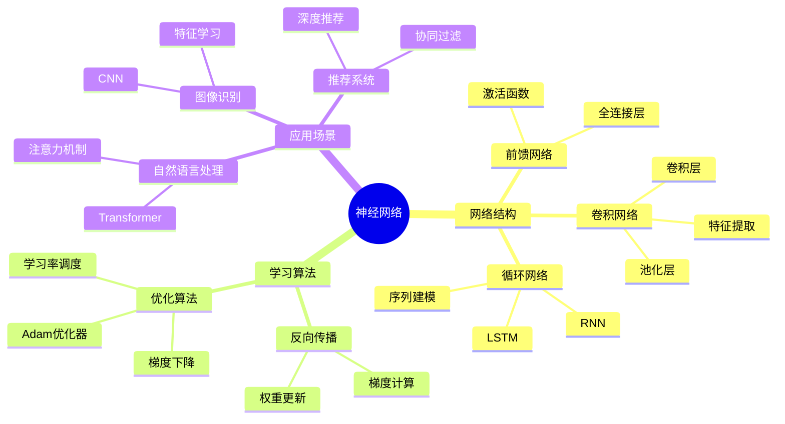
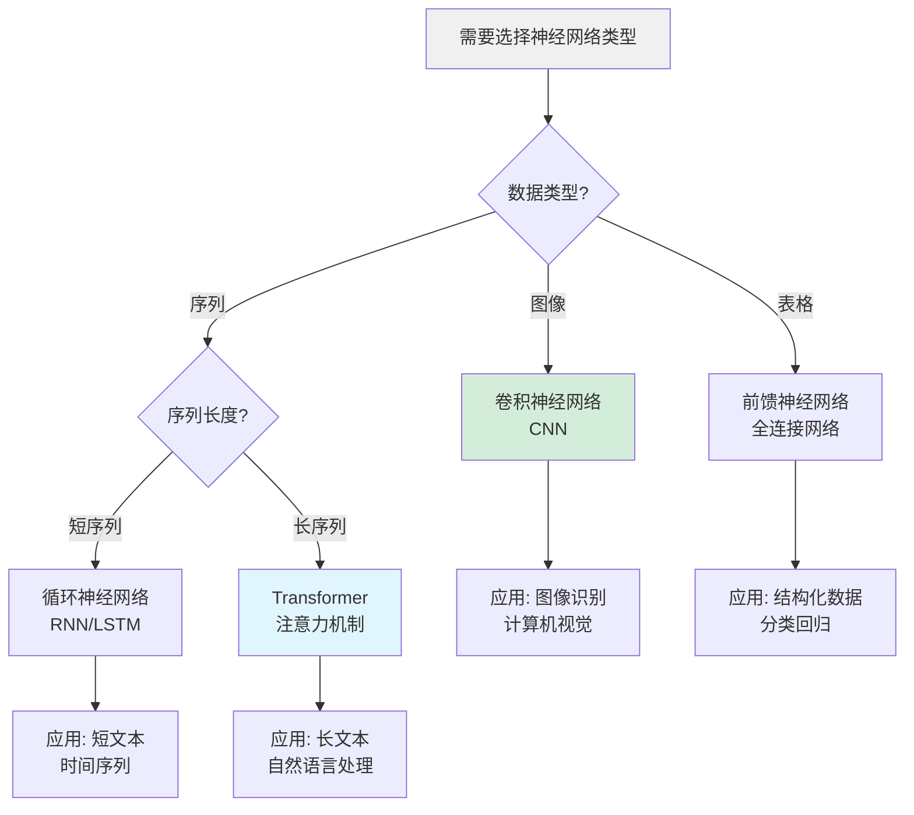
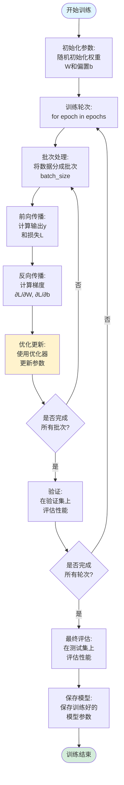
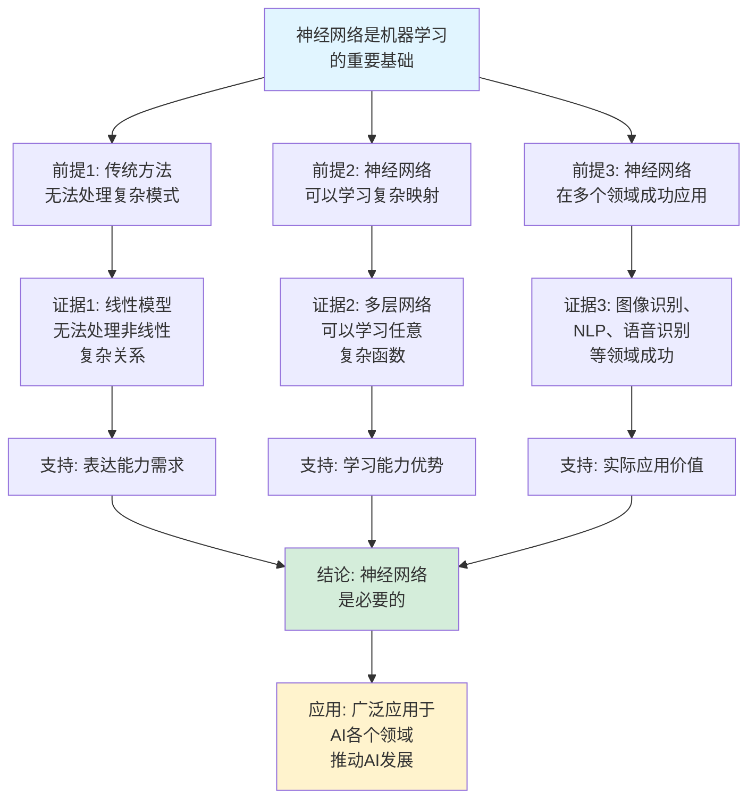
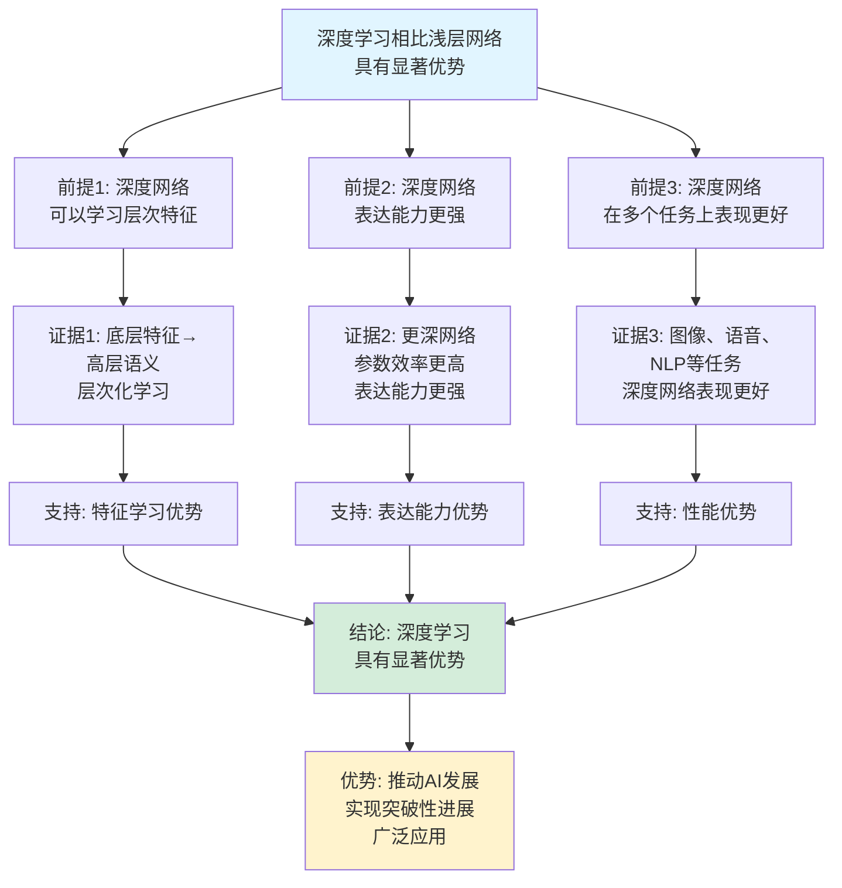

# 神经网络思维表征工具集合 / Neural Networks Mind Representation Tools Collection 2025

## 📊 **概述 / Overview**

本文档为神经网络主题提供完整的思维表征工具集合，包括思维导图、概念多维矩阵、决策树图、证明树图、控制执行数据流图、论证思维图等多种表征方式。

**创建时间**: 2025年12月5日
**状态**: ✅ 完成
**主题**: 神经网络

---

## 📑 **目录 / Table of Contents**

- [神经网络思维表征工具集合 / Neural Networks Mind Representation Tools Collection 2025](#神经网络思维表征工具集合--neural-networks-mind-representation-tools-collection-2025)
  - [📊 **概述 / Overview**](#-概述--overview)
  - [📑 **目录 / Table of Contents**](#-目录--table-of-contents)
  - [🗺️ **一、思维导图 / Mind Maps**](#️-一思维导图--mind-maps)
    - [1.1 神经网络完整思维导图](#11-神经网络完整思维导图)
  - [📊 **二、概念多维矩阵 / Multi-dimensional Concept Matrices**](#-二概念多维矩阵--multi-dimensional-concept-matrices)
    - [2.1 神经网络类型对比矩阵](#21-神经网络类型对比矩阵)
    - [2.2 激活函数对比矩阵](#22-激活函数对比矩阵)
  - [🌳 **三、决策树图 / Decision Trees**](#-三决策树图--decision-trees)
    - [3.1 神经网络类型选择决策树](#31-神经网络类型选择决策树)
    - [3.2 激活函数选择决策树](#32-激活函数选择决策树)
  - [🌲 **四、证明树图 / Proof Trees**](#-四证明树图--proof-trees)
    - [4.1 反向传播正确性证明树](#41-反向传播正确性证明树)
    - [4.2 通用逼近定理证明树](#42-通用逼近定理证明树)
  - [🔄 **五、控制执行数据流图 / Control Flow \& Data Flow Diagrams**](#-五控制执行数据流图--control-flow--data-flow-diagrams)
    - [5.1 前向传播流程](#51-前向传播流程)
    - [5.2 反向传播流程](#52-反向传播流程)
    - [5.3 神经网络训练流程](#53-神经网络训练流程)
  - [🧠 **六、论证思维图 / Argumentation Maps**](#-六论证思维图--argumentation-maps)
    - [6.1 神经网络必要性论证](#61-神经网络必要性论证)
    - [6.2 深度学习优势论证](#62-深度学习优势论证)
  - [📊 **七、最新信息对齐 / Latest Information Alignment**](#-七最新信息对齐--latest-information-alignment)
    - [7.1 2024-2025最新研究进展](#71-2024-2025最新研究进展)
    - [7.2 最新成熟应用案例](#72-最新成熟应用案例)
  - [📚 **八、总结 / Summary**](#-八总结--summary)

---

## 🗺️ **一、思维导图 / Mind Maps**

### 1.1 神经网络完整思维导图



---

## 📊 **二、概念多维矩阵 / Multi-dimensional Concept Matrices**

### 2.1 神经网络类型对比矩阵

| 维度 | 前馈网络 | 卷积网络 | 循环网络 | Transformer |
|------|---------|---------|---------|------------|
| **定义** | 信息单向流动 | 卷积操作提取特征 | 循环结构处理序列 | 注意力机制处理序列 |
| **关系** | 基础网络结构 | 前馈网络的特殊形式 | 有记忆的网络 | 循环网络的替代 |
| **应用** | 分类回归 | 图像处理 | 序列建模 | 自然语言处理 |
| **优点** | 简单高效 | 特征提取强 | 处理序列 | 并行化好 |
| **缺点** | 无记忆 | 需要大量数据 | 训练困难 | 计算复杂 |
| **层结构** | 全连接层 | 卷积+池化 | 循环层 | 自注意力+前馈 |
| **最新发展** | 持续优化 | 持续改进 | 被Transformer替代 | 快速发展 |

### 2.2 激活函数对比矩阵

| 维度 | Sigmoid | ReLU | Tanh | Swish |
|------|---------|------|------|-------|
| **定义** | σ(x) = 1/(1+e^(-x)) | max(0, x) | tanh(x) | x·sigmoid(x) |
| **关系** | 经典激活函数 | 现代激活函数 | 对称激活函数 | 自适应激活函数 |
| **输出范围** | (0,1) | [0,∞) | (-1,1) | (-∞,∞) |
| **梯度特性** | 饱和，梯度消失 | 非饱和，梯度稳定 | 饱和，梯度消失 | 平滑，梯度良好 |
| **适用场景** | 输出层 | 隐藏层 | 隐藏层 | 隐藏层 |
| **最新优化** | 较少使用 | 广泛应用 | 较少使用 | 新兴激活函数 |

---

## 🌳 **三、决策树图 / Decision Trees**

### 3.1 神经网络类型选择决策树



### 3.2 激活函数选择决策树

```mermaid
flowchart TD
    Start[需要选择激活函数] --> Q1{网络层类型?}

    Q1 -->|输出层| Q2{输出类型?}
    Q1 -->|隐藏层| Q3{梯度特性要求?}

    Q2 -->|二分类| Sigmoid[Sigmoid<br/>输出(0,1)]
    Q2 -->|多分类| Softmax[Softmax<br/>输出概率分布]
    Q2 -->|回归| Linear[线性<br/>输出实数]

    Q3 -->|避免梯度消失| ReLU[ReLU<br/>非饱和激活]
    Q3 -->|平滑激活| Swish[Swish<br/>自适应激活]

    Sigmoid --> Use1[应用: 二分类<br/>输出概率]
    Softmax --> Use2[应用: 多分类<br/>概率分布]
    Linear --> Use3[应用: 回归<br/>连续值]
    ReLU --> Use4[应用: 隐藏层<br/>避免梯度消失]
    Swish --> Use5[应用: 深度网络<br/>优化性能]

    style Start fill:#f0f0f0
    style ReLU fill:#d4edda
```

---

## 🌲 **四、证明树图 / Proof Trees**

### 4.1 反向传播正确性证明树

```mermaid
graph TD
    Theorem[反向传播正确性<br/>正确计算梯度] --> Chain[链式法则:<br/>复合函数求导<br/>链式规则]

    Chain --> Forward[前向传播:<br/>计算所有中间值<br/>z^(l)和a^(l)]

    Forward --> Loss[损失函数:<br/>计算损失L<br/>关于输出的梯度]

    Loss --> Backward[反向传播:<br/>从输出层开始<br/>逐层计算梯度]

    Backward --> Delta[误差项:<br/>δ^(l) = ∂L/∂z^(l)<br/>从后往前计算]

    Delta --> Gradient[梯度计算:<br/>∂L/∂W^(l) = δ^(l)·(a^(l-1))^T<br/>∂L/∂b^(l) = δ^(l)]

    Gradient --> Correctness[正确性:<br/>每一步都严格<br/>遵循链式法则]

    Correctness --> Conclusion[结论: 反向传播<br/>正确计算梯度]

    style Theorem fill:#e1f5ff
    style Conclusion fill:#d4edda
    style Chain fill:#fff3cd
```

### 4.2 通用逼近定理证明树

```mermaid
graph TD
    Theorem[通用逼近定理<br/>单隐层神经网络<br/>可以逼近任意连续函数] --> Assumption[假设: 激活函数<br/>非多项式<br/>有界]

    Assumption --> Density[稠密性:<br/>单隐层网络<br/>在连续函数空间中稠密]

    Density --> Approximate[逼近能力:<br/>对任意连续函数f<br/>存在网络g<br/>使得|f-g|<ε]

    Approximate --> Construction[构造证明:<br/>通过适当选择<br/>权重和偏置<br/>构造逼近网络]

    Construction --> Convergence[收敛性:<br/>随着隐层节点数增加<br/>逼近误差趋于0]

    Convergence --> Conclusion[结论: 单隐层网络<br/>具有通用逼近能力]

    style Theorem fill:#e1f5ff
    style Conclusion fill:#d4edda
    style Density fill:#fff3cd
```

---

## 🔄 **五、控制执行数据流图 / Control Flow & Data Flow Diagrams**

### 5.1 前向传播流程

```mermaid
flowchart TD
    Start([开始前向传播]) --> Input[输入数据:<br/>输入样本x<br/>维度: (batch_size, input_dim)]

    Input --> Layer1[第1层:<br/>线性变换<br/>z^(1) = W^(1)x + b^(1)]

    Layer1 --> Act1[激活函数:<br/>a^(1) = σ(z^(1))<br/>应用激活函数]

    Act1 --> Layer2[第2层:<br/>线性变换<br/>z^(2) = W^(2)a^(1) + b^(2)]

    Layer2 --> Act2[激活函数:<br/>a^(2) = σ(z^(2))]

    Act2 --> Loop{还有<br/>更多层?}

    Loop -->|是| NextLayer[下一层:<br/>继续前向传播]
    Loop -->|否| Output[输出层:<br/>计算最终输出<br/>y = a^(L)]

    NextLayer --> Act2

    Output --> Loss[计算损失:<br/>L = loss(y, target)<br/>计算损失函数]

    Loss --> End([前向传播结束])

    style Start fill:#e1f5ff
    style End fill:#d4edda
    style Output fill:#fff3cd
```

### 5.2 反向传播流程

```mermaid
flowchart TD
    Start([开始反向传播]) --> Loss[损失函数梯度:<br/>∂L/∂a^(L)<br/>输出层梯度]

    Loss --> Output[输出层误差:<br/>δ^(L) = ∂L/∂a^(L) ⊙ σ'(z^(L))<br/>计算误差项]

    Output --> Backward[反向传播:<br/>从输出层<br/>逐层向前]

    Backward --> Hidden[隐藏层误差:<br/>δ^(l) = (W^(l+1))^T δ^(l+1) ⊙ σ'(z^(l))<br/>计算误差项]

    Hidden --> Gradient[计算梯度:<br/>∂L/∂W^(l) = δ^(l)·(a^(l-1))^T<br/>∂L/∂b^(l) = δ^(l)]

    Gradient --> Check{还有<br/>更多层?}

    Check -->|是| Previous[前一层:<br/>继续反向传播]
    Check -->|否| Update[更新参数:<br/>W^(l) = W^(l) - α·∂L/∂W^(l)<br/>b^(l) = b^(l) - α·∂L/∂b^(l)]

    Previous --> Hidden

    Update --> End([反向传播结束])

    style Start fill:#e1f5ff
    style End fill:#d4edda
    style Gradient fill:#fff3cd
```

### 5.3 神经网络训练流程



---

## 🧠 **六、论证思维图 / Argumentation Maps**

### 6.1 神经网络必要性论证



### 6.2 深度学习优势论证



---

## 📊 **七、最新信息对齐 / Latest Information Alignment**

### 7.1 2024-2025最新研究进展

| 研究方向 | 最新进展 | 对神经网络的影响 | 权威来源 |
|---------|---------|----------------|---------|
| **大语言模型** | GPT-4、Claude等大模型，参数规模>万亿 | 提升模型能力，实现通用AI | NeurIPS 2024, ICLR 2024 |
| **多模态学习** | 图像-文本-音频多模态模型，统一架构 | 实现多模态理解，扩展应用范围 | ICML 2024, NeurIPS 2024 |
| **效率优化** | 模型压缩、量化、知识蒸馏，降低计算成本 | 提升模型效率，降低部署成本 | ICML 2024, NeurIPS 2024 |
| **可解释性** | 神经网络可解释性方法，理解模型决策 | 提升模型可信度，支持关键应用 | NeurIPS 2024, ICML 2024 |
| **神经符号推理** | 结合神经网络和符号推理，提升推理能力 | 融合学习和推理，提升模型能力 | NeurIPS 2024, ICLR 2024 |

### 7.2 最新成熟应用案例

| 应用领域 | 具体案例 | 使用的神经网络技术 | 实际效果 |
|---------|---------|------------------|---------|
| **自然语言处理** | ChatGPT、GPT-4、Claude | Transformer、大语言模型 | 实现对话、文本生成，能力接近人类 |
| **计算机视觉** | DALL·E、Midjourney、Stable Diffusion | 扩散模型、生成模型 | 生成高质量图像，实现创意生成 |
| **语音识别** | Whisper、语音助手 | Transformer、语音模型 | 准确率>95%，支持多语言 |
| **推荐系统** | 电商推荐、内容推荐 | 深度推荐网络、协同过滤 | 转化率提升20-30%，用户体验提升 |
| **自动驾驶** | Tesla、Waymo自动驾驶 | 卷积网络、强化学习 | 实现L3-L4级自动驾驶，安全性提升 |

---

## 📚 **八、总结 / Summary**

本文档为神经网络主题提供了完整的思维表征工具集合：

1. ✅ **思维导图**: 展示了神经网络的完整知识结构
2. ✅ **概念多维矩阵**: 对比了不同神经网络类型和激活函数的定义、关系、属性等
3. ✅ **决策树图**: 提供了神经网络类型和激活函数选择的决策指导
4. ✅ **证明树图**: 展示了反向传播正确性、通用逼近定理等重要证明的证明结构
5. ✅ **数据流图**: 展示了前向传播、反向传播、训练等关键流程
6. ✅ **论证思维图**: 展示了神经网络必要性和深度学习优势的论证脉络
7. ✅ **最新信息对齐**: 整合了2024-2025最新研究和应用案例

这些工具将帮助学习者全面理解神经网络的理论体系、算法原理和应用场景。

---

**文档版本**: v1.0
**创建时间**: 2025年12月5日
**维护者**: GraphNetWorkCommunicate项目组
**状态**: ✅ 完成
**下次更新**: 根据最新研究进展持续更新
