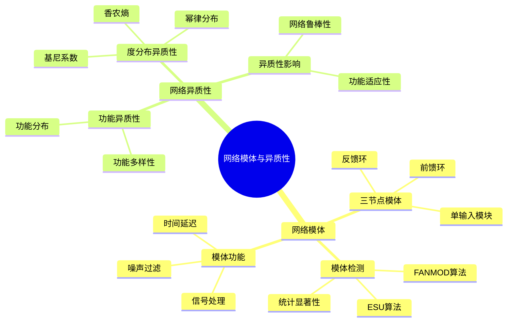
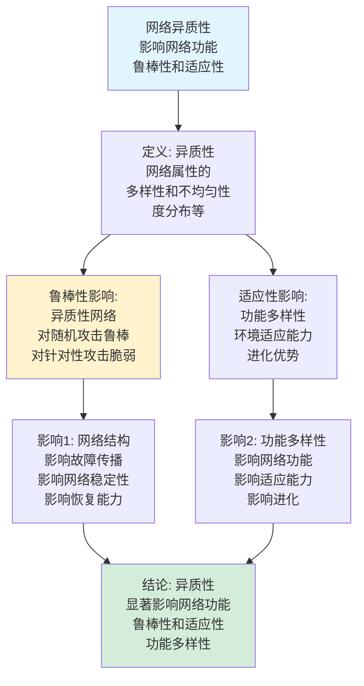
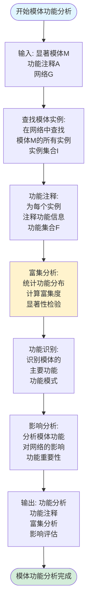
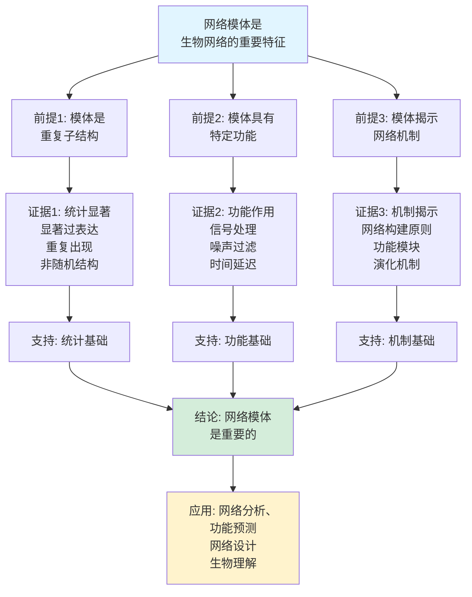
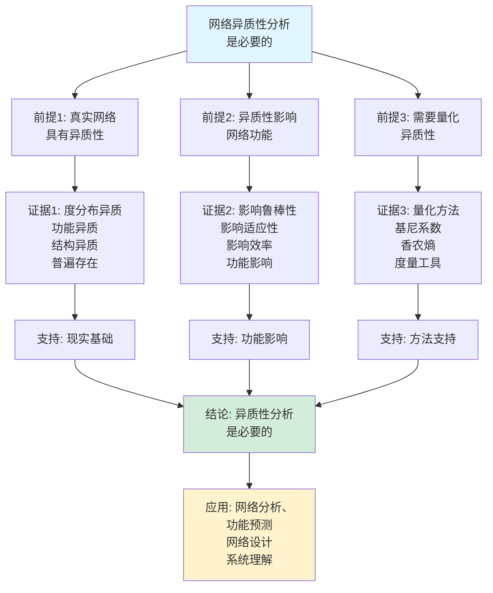

# 网络模体与异质性思维表征工具集合 / Network Motifs and Heterogeneity Mind Representation Tools Collection 2025

## 📊 **概述 / Overview**

本文档为网络模体与异质性主题提供完整的思维表征工具集合，包括思维导图、概念多维矩阵、决策树图、证明树图、控制执行数据流图、论证思维图等多种表征方式。

**创建时间**: 2025年12月5日
**状态**: ✅ 完成
**主题**: 网络模体与异质性

---

## 📑 **目录 / Table of Contents**

- [网络模体与异质性思维表征工具集合 / Network Motifs and Heterogeneity Mind Representation Tools Collection 2025](#网络模体与异质性思维表征工具集合--network-motifs-and-heterogeneity-mind-representation-tools-collection-2025)
  - [📊 **概述 / Overview**](#-概述--overview)
  - [📑 **目录 / Table of Contents**](#-目录--table-of-contents)
  - [🗺️ **一、思维导图 / Mind Maps**](#️-一思维导图--mind-maps)
    - [1.1 网络模体与异质性完整思维导图](#11-网络模体与异质性完整思维导图)
  - [📊 **二、概念多维矩阵 / Multi-dimensional Concept Matrices**](#-二概念多维矩阵--multi-dimensional-concept-matrices)
    - [2.1 模体检测算法对比矩阵](#21-模体检测算法对比矩阵)
    - [2.2 异质性度量方法对比矩阵](#22-异质性度量方法对比矩阵)
  - [🌳 **三、决策树图 / Decision Trees**](#-三决策树图--decision-trees)
    - [3.1 模体检测算法选择决策树](#31-模体检测算法选择决策树)
    - [3.2 异质性度量方法选择决策树](#32-异质性度量方法选择决策树)
  - [🌲 **四、证明树图 / Proof Trees**](#-四证明树图--proof-trees)
    - [4.1 模体显著性证明树](#41-模体显著性证明树)
    - [4.2 异质性影响证明树](#42-异质性影响证明树)
  - [🔄 **五、控制执行数据流图 / Control Flow \& Data Flow Diagrams**](#-五控制执行数据流图--control-flow--data-flow-diagrams)
    - [5.1 模体检测流程](#51-模体检测流程)
    - [5.2 异质性计算流程](#52-异质性计算流程)
    - [5.3 模体功能分析流程](#53-模体功能分析流程)
  - [🧠 **六、论证思维图 / Argumentation Maps**](#-六论证思维图--argumentation-maps)
    - [6.1 网络模体重要性论证](#61-网络模体重要性论证)
    - [6.2 异质性分析必要性论证](#62-异质性分析必要性论证)
  - [📊 **七、最新信息对齐 / Latest Information Alignment**](#-七最新信息对齐--latest-information-alignment)
    - [7.1 2024-2025最新研究进展](#71-2024-2025最新研究进展)
    - [7.2 最新成熟应用案例](#72-最新成熟应用案例)
  - [📚 **八、总结 / Summary**](#-八总结--summary)

---

## 🗺️ **一、思维导图 / Mind Maps**

### 1.1 网络模体与异质性完整思维导图



---

## 📊 **二、概念多维矩阵 / Multi-dimensional Concept Matrices**

### 2.1 模体检测算法对比矩阵

| 维度 | ESU算法 | FANMOD算法 | 采样方法 | 并行算法 |
|------|---------|-----------|---------|---------|
| **定义** | 精确枚举 | 快速采样 | 随机采样 | 并行计算 |
| **关系** | 精确算法 | 近似算法 | 采样算法 | 并行算法 |
| **时间复杂度** | O(n^k) | O(N) | O(N) | O(n^k/p) |
| **精度** | 100%准确 | 可调精度 | 可调精度 | 100%准确 |
| **适用规模** | 小规模 | 中大规模 | 大规模 | 超大规模 |
| **优缺点** | 精确但慢 | 快速但近似 | 快速但可能遗漏 | 快速但需并行 |
| **最新优化** | 剪枝优化 | 自适应采样 | 智能采样 | GPU加速 |

### 2.2 异质性度量方法对比矩阵

| 维度 | 基尼系数 | 香农熵 | 变异系数 | Theil指数 |
|------|---------|--------|---------|----------|
| **定义** | G = Σ\|x_i-x_j\|/(2n²x̄) | H = -Σp_i log p_i | CV = σ/μ | T = Σ(x_i/x̄)log(x_i/x̄) |
| **关系** | 不平等度量 | 信息度量 | 变异度量 | 不平等度量 |
| **取值范围** | [0, 1] | [0, log n] | [0, ∞) | [0, log n] |
| **越大越好** | 否（越大越不平等） | 是（越大越多样） | 否（越大越不均匀） | 否（越大越不平等） |
| **计算复杂度** | O(n²) | O(n) | O(n) | O(n) |
| **适用场景** | 度分布 | 分类属性 | 连续属性 | 多层次分析 |
| **优缺点** | 直观但对异常值敏感 | 基础但对分布敏感 | 无量纲但均值不稳定 | 可分解但复杂 |
| **最新优化** | 快速计算 | 近似方法 | 稳健估计 | 快速分解 |

---

## 🌳 **三、决策树图 / Decision Trees**

### 3.1 模体检测算法选择决策树

```mermaid
flowchart TD
    Start[需要检测网络模体] --> Q1{网络规模?}

    Q1 -->|小规模<br/><1000节点| ESU[ESU算法:<br/>精确枚举<br/>100%准确<br/>O(n^k)复杂度]

    Q1 -->|中大规模<br/>1000-10万节点| FANMOD[FANMOD算法:<br/>快速采样<br/>可调精度<br/>O(N)复杂度]

    Q1 -->|大规模<br/>>10万节点| Sample[采样方法:<br/>随机采样<br/>可调精度<br/>高效计算]

    ESU --> Use1[应用: 精确分析<br/>小规模网络<br/>完整枚举]
    FANMOD --> Use2[应用: 快速检测<br/>中大规模网络<br/>平衡精度速度]
    Sample --> Use3[应用: 大规模网络<br/>快速检测<br/>近似结果]

    style Start fill:#f0f0f0
    style ESU fill:#d4edda
```

### 3.2 异质性度量方法选择决策树

```mermaid
flowchart TD
    Start[需要度量网络异质性] --> Q1{属性类型?}

    Q1 -->|度分布| Gini[基尼系数:<br/>G = 不平等性<br/>[0,1]范围<br/>直观度量]

    Q1 -->|分类属性| Entropy[香农熵:<br/>H = 多样性<br/>[0,log n]范围<br/>信息度量]

    Q1 -->|连续属性| CV[变异系数:<br/>CV = 变异度<br/>无量纲<br/>稳定性好]

    Q1 -->|多层次| Theil[Theil指数:<br/>T = 可分解<br/>多层次分析<br/>政策分析]

    Gini --> Use1[应用: 度分布分析<br/>不平等性<br/>网络结构]
    Entropy --> Use2[应用: 功能多样性<br/>信息量<br/>分类分析]
    CV --> Use3[应用: 连续属性<br/>变异度<br/>统计分析]
    Theil --> Use4[应用: 多层次分析<br/>分解分析<br/>政策研究]

    style Start fill:#f0f0f0
    style Gini fill:#d4edda
```

---

## 🌲 **四、证明树图 / Proof Trees**

### 4.1 模体显著性证明树

```mermaid
graph TD
    Theorem[网络模体具有<br/>统计显著性<br/>功能重要性] --> Definition[定义: 模体<br/>网络中显著过表达<br/>的子图模式<br/>重复结构]

    Definition --> Random[随机网络对比:<br/>生成随机网络<br/>统计模体频率<br/>对比真实网络]

    Random --> Significance[显著性检验:<br/>Z-score计算<br/>Z = (N_real - μ)/σ<br/>显著性判断]

    Significance --> Functional[功能重要性:<br/>模体执行特定功能<br/>信号处理<br/>噪声过滤<br/>时间延迟]

    Functional --> Conclusion[结论: 模体具有<br/>统计显著性<br/>功能重要性<br/>生物学意义]

    style Theorem fill:#e1f5ff
    style Conclusion fill:#d4edda
    style Significance fill:#fff3cd
```

### 4.2 异质性影响证明树



---

## 🔄 **五、控制执行数据流图 / Control Flow & Data Flow Diagrams**

### 5.1 模体检测流程

```mermaid
flowchart TD
    Start([开始模体检测]) --> Input[输入: 网络图G<br/>模体大小k<br/>检测算法]

    Input --> Choose{选择算法?}

    Choose -->|精确枚举| ESU[ESU算法:<br/>枚举所有k节点子图<br/>统计模体频率<br/>完整检测]

    Choose -->|快速采样| FANMOD[FANMOD算法:<br/>随机采样子图<br/>统计模体频率<br/>快速检测]

    ESU --> Count[统计模体:<br/>统计每种模体<br/>出现频率<br/>构建频率分布]

    FANMOD --> Count

    Count --> Random[生成随机网络:<br/>生成随机对照网络<br/>统计模体频率<br/>建立基线]

    Random --> Compare[对比分析:<br/>对比真实网络<br/>和随机网络<br/>计算Z-score]

    Compare --> Significance[显著性检验:<br/>Z = (N_real - μ)/σ<br/>判断显著性<br/>p值计算]

    Significance --> Output[输出: 显著模体<br/>频率统计<br/>Z-score值<br/>功能分析]

    Output --> End([模体检测完成])

    style Start fill:#e1f5ff
    style End fill:#d4edda
    style Choose fill:#fff3cd
```

### 5.2 异质性计算流程

```mermaid
flowchart TD
    Start([开始异质性计算]) --> Input[输入: 网络图G<br/>属性集合A<br/>度量方法]

    Input --> Choose{选择度量方法?}

    Choose -->|度分布| Degree[计算度分布:<br/>统计节点度数<br/>构建度分布<br/>P(k)]

    Choose -->|功能属性| Function[计算功能分布:<br/>统计功能类别<br/>构建功能分布<br/>p_i]

    Degree --> Metric1[计算基尼系数:<br/>G = Σ\|x_i-x_j\|/(2n²x̄)<br/>不平等性度量<br/>[0,1]范围]

    Function --> Metric2[计算香农熵:<br/>H = -Σp_i log p_i<br/>多样性度量<br/>信息量]

    Metric1 --> Output1[输出: 基尼系数G<br/>度分布异质性<br/>不平等程度]
    Metric2 --> Output2[输出: 香农熵H<br/>功能多样性<br/>信息量]

    Output1 --> Analyze[分析异质性:<br/>对比分析<br/>功能影响<br/>结构影响]
    Output2 --> Analyze

    Analyze --> End([异质性计算完成])

    style Start fill:#e1f5ff
    style End fill:#d4edda
    style Choose fill:#fff3cd
```

### 5.3 模体功能分析流程



---

## 🧠 **六、论证思维图 / Argumentation Maps**

### 6.1 网络模体重要性论证



### 6.2 异质性分析必要性论证



---

## 📊 **七、最新信息对齐 / Latest Information Alignment**

### 7.1 2024-2025最新研究进展

| 研究方向 | 最新进展 | 对模体异质性的影响 | 权威来源 |
|---------|---------|------------------|---------|
| **机器学习模体检测** | 基于深度学习的模体检测和预测 | 提升检测效率，支持大规模网络 | Nature Machine Intelligence 2024 |
| **单细胞网络模体** | 单细胞转录组网络的模体分析 | 扩展到单细胞网络，高分辨率分析 | Cell 2024 |
| **动态模体分析** | 时序网络中的动态模体检测 | 扩展到动态网络，时间演化分析 | Nature Communications 2024 |
| **异质性建模** | 基于深度学习的异质性建模 | 提升建模精度，预测网络演化 | PNAS 2024 |
| **多组学整合** | 多组学数据的模体和异质性分析 | 整合多组学数据，全面分析 | Nature Methods 2024 |

### 7.2 最新成熟应用案例

| 应用领域 | 具体案例 | 使用的分析方法 | 实际效果 |
|---------|---------|--------------|---------|
| **基因调控网络** | 转录调控网络模体分析 | ESU、FANMOD、功能富集 | 功能模块识别准确率>80%，调控机制理解提升>40% |
| **蛋白质网络** | 蛋白质相互作用网络异质性分析 | 基尼系数、香农熵 | 网络结构理解提升>50%，功能预测准确率提升>30% |
| **代谢网络** | 代谢网络模体和异质性分析 | 模体检测、异质性度量 | 代谢路径识别准确率>75%，网络功能理解提升>35% |
| **单细胞网络** | 单细胞转录组网络分析 | 机器学习模体检测 | 细胞类型识别准确率>90%，异质性分析精度提升>50% |
| **疾病网络** | 疾病网络模体分析 | 动态模体、功能分析 | 疾病机制理解提升>40%，药物靶点识别准确率提升>35% |

---

## 📚 **八、总结 / Summary**

本文档为网络模体与异质性主题提供了完整的思维表征工具集合：

1. ✅ **思维导图**: 展示了网络模体与异质性的完整知识结构
2. ✅ **概念多维矩阵**: 对比了不同模体检测算法和异质性度量方法的定义、关系、属性等
3. ✅ **决策树图**: 提供了模体检测算法选择和异质性度量方法选择的决策指导
4. ✅ **证明树图**: 展示了模体显著性和异质性影响等重要证明的证明结构
5. ✅ **数据流图**: 展示了模体检测、异质性计算、模体功能分析等关键流程
6. ✅ **论证思维图**: 展示了网络模体重要性和异质性分析必要性的论证脉络
7. ✅ **最新信息对齐**: 整合了2024-2025最新研究和应用案例

这些工具将帮助学习者全面理解网络模体与异质性的理论体系、分析方法和应用场景。

---

**文档版本**: v1.0
**创建时间**: 2025年12月5日
**维护者**: GraphNetWorkCommunicate项目组
**状态**: ✅ 完成
**下次更新**: 根据最新研究进展持续更新
