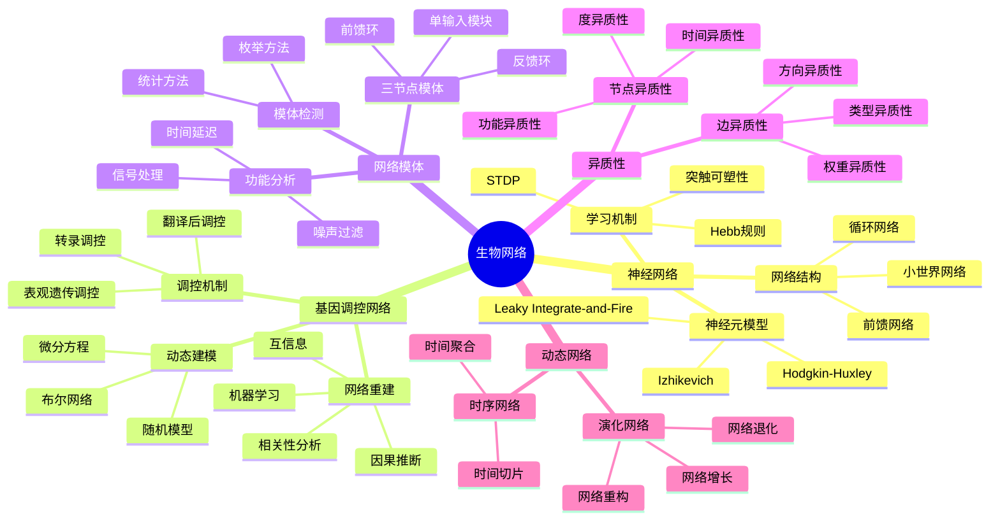
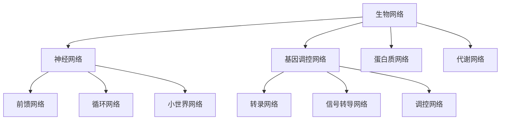
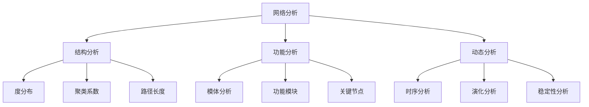
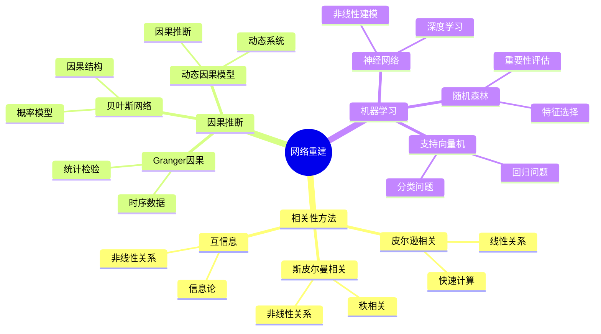
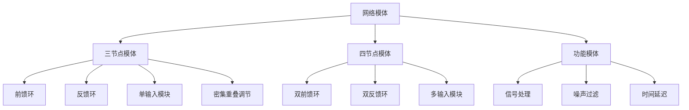
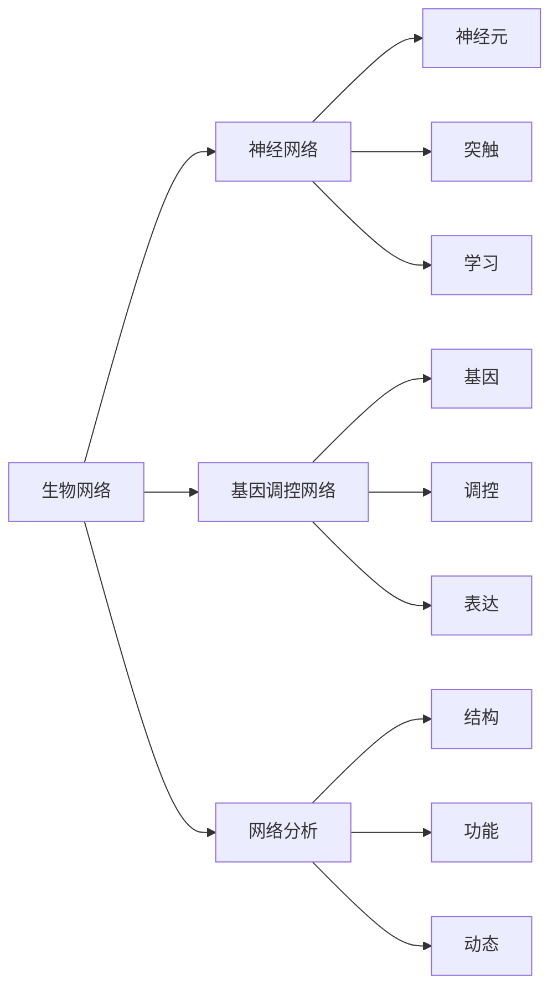
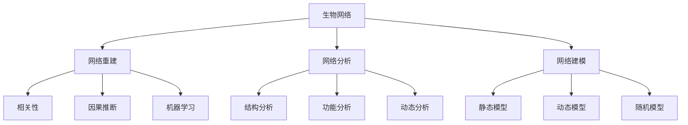
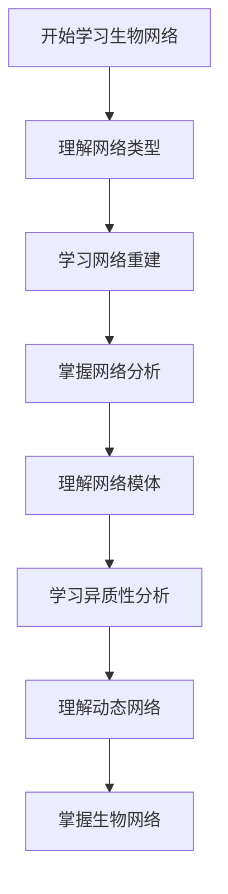
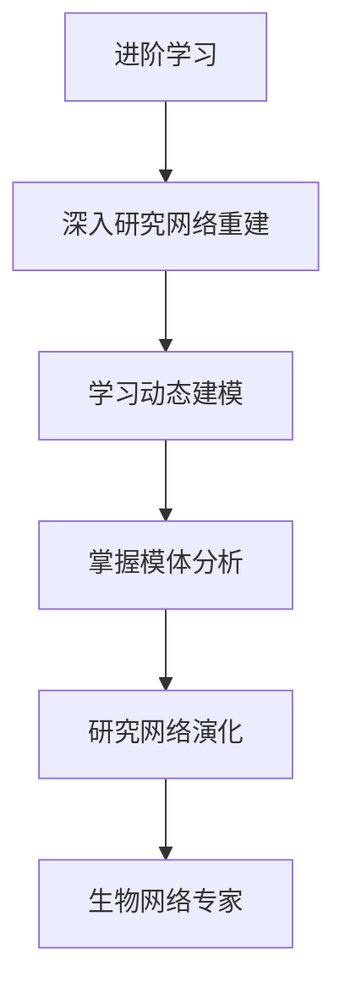

# 生物网络模块知识结构思维导图 / Biological Networks Module Knowledge Structure Mind Map

## 📚 **概述 / Overview**

本文档提供生物网络模块的完整知识结构思维导图，帮助理解生物网络知识的层次结构和相互关系。

**创建时间**: 2025年1月
**模块**: 生物网络
**状态**: 🚀 持续更新中

---

## 🗺️ **一、整体知识结构 / Overall Knowledge Structure**

---

## 📊 **二、核心概念层次结构 / Core Concept Hierarchy**

### 2.1 网络类型层次

### 2.2 分析方法层次

---

## 🔬 **三、网络重建方法结构 / Network Reconstruction Method Structure**

### 3.1 重建方法分类

### 3.2 重建方法对比

| 方法 | 原理 | 准确性 | 复杂度 | 适用数据 | 特点 |
|------|------|--------|--------|---------|------|
| **相关性分析** | 相关性计算 | 低 | $O(n^2)$ | 静态数据 | 简单、快速 |
| **互信息** | 信息论 | 中 | $O(n^2)$ | 静态数据 | 非线性关系 |
| **因果推断** | 因果关系 | 高 | $O(n^3)$ | 时序数据 | 方向性、准确 |
| **机器学习** | 模式学习 | 高 | 训练：高 | 大数据 | 非线性、自适应 |

---

## 📐 **四、网络模体结构 / Network Motif Structure**

### 4.1 模体类型

### 4.2 模体功能

| 模体类型 | 功能 | 生物学意义 |
|---------|------|-----------|
| **前馈环** | 信号处理 | 信号延迟、过滤 |
| **反馈环** | 稳定性 | 稳态维持、振荡 |
| **单输入模块** | 协调表达 | 基因共表达 |
| **密集重叠调节** | 复杂调控 | 多基因协调 |

---

## 🔗 **五、知识关联网络 / Knowledge Association Network**

### 5.1 概念关联图

### 5.2 方法关联图

---

## 📚 **六、学习路径 / Learning Path**

### 6.1 基础学习路径

### 6.2 进阶学习路径

---

## 🎯 **七、应用领域映射 / Application Domain Mapping**

### 7.1 应用领域

| 生物网络概念 | 应用领域 | 具体应用 |
|------------|---------|---------|
| **神经网络** | 神经科学 | 脑网络分析、神经疾病 |
| **基因调控网络** | 系统生物学 | 疾病机制、药物靶点 |
| **网络模体** | 功能分析 | 信号转导、调控机制 |
| **异质性分析** | 精准医疗 | 个性化治疗、疾病分型 |

---

## 📋 **八、知识检查清单 / Knowledge Checklist**

### 8.1 基础概念

- [ ] 理解生物网络的定义和类型
- [ ] 掌握神经网络模型
- [ ] 理解基因调控网络
- [ ] 掌握网络模体概念

### 8.2 网络重建

- [ ] 理解相关性分析方法
- [ ] 掌握因果推断方法
- [ ] 了解机器学习方法
- [ ] 理解重建方法选择

### 8.3 网络分析

- [ ] 理解结构分析方法
- [ ] 掌握功能分析方法
- [ ] 了解动态分析方法
- [ ] 理解异质性分析

### 8.4 网络建模

- [ ] 理解静态网络模型
- [ ] 掌握动态网络模型
- [ ] 了解随机网络模型
- [ ] 理解模型应用

---

## 🔗 **相关链接 / Related Links**

- [生物网络README](README.md)
- [神经网络](01-神经网络.md)
- [基因调控网络](02-基因调控网络.md)
- [网络模体与异质性](03-网络模体与异质性.md)
- [思维表征工具](思维表征工具-生物网络.md)

---

**文档版本**: v1.0
**创建时间**: 2025年1月
**最后更新**: 2025年1月
**维护者**: GraphNetWorkCommunicate项目组
