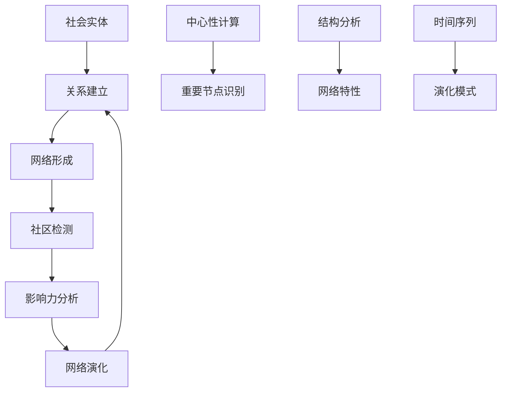

# 社会网络 - 社会网络基础

## 1. 社会网络基本概念

### 1.1 基本定义

**定义 1.1** (社会网络 - Social Network)
**社会网络**是由社会实体及其关系组成的网络结构：
$$\mathcal{SN} = \langle \mathcal{A}, \mathcal{R}, \mathcal{W}, \mathcal{T} \rangle$$

其中：

- $\mathcal{A}$ 是行动者集 (Actors)
- $\mathcal{R}$ 是关系集 (Relations)
- $\mathcal{W}$ 是权重集 (Weights)
- $\mathcal{T}$ 是时间集 (Time)

**定义 1.2** (社会网络图)
**社会网络图**是表示社会网络的有向或无向图：
$$G = (V, E, W)$$

其中：

- $V$ 是顶点集，表示社会实体
- $E$ 是边集，表示社会关系
- $W: E \to \mathbb{R}$ 是权重函数

**形式化语义**：

- 集合论语义：$\mathcal{A} \neq \emptyset, \mathcal{R} \subseteq \mathcal{A} \times \mathcal{A}, \mathcal{W}: \mathcal{R} \to \mathbb{R}$
- 范畴论语义：社会网络作为图范畴中的对象，网络演化作为态射
- 自动机语义：社会网络可建模为状态自动机 $A = (Q, \Sigma, \delta, q_0, F)$

### 1.2 网络表示

**定义 1.3** (邻接矩阵)
**邻接矩阵**是表示网络连接的矩阵：
$$A_{ij} = \begin{cases}
w_{ij} & \text{如果存在边 } (i,j) \\
0 & \text{否则}
\end{cases}$$

**定义 1.4** (关联矩阵)
**关联矩阵**是表示节点与边关系的矩阵：
$$B_{ij} = \begin{cases}
1 & \text{如果节点 } i \text{ 与边 } j \text{ 关联} \\
0 & \text{否则}
\end{cases}$$

**算法 1.1** (社会网络构建)

```python
import numpy as np
import networkx as nx
import matplotlib.pyplot as plt

class SocialNetwork:
    def __init__(self, num_actors, directed=False):
        self.num_actors = num_actors
        self.directed = directed

        # 初始化邻接矩阵
        self.adjacency_matrix = np.zeros((num_actors, num_actors))
        self.weights = {}
        self.attributes = {}

        # 使用NetworkX图
        if directed:
            self.graph = nx.DiGraph()
        else:
            self.graph = nx.Graph()

    def add_actor(self, actor_id, attributes=None):
        """添加行动者"""
        self.graph.add_node(actor_id)
        if attributes:
            self.attributes[actor_id] = attributes
            self.graph.nodes[actor_id].update(attributes)

    def add_relation(self, actor1, actor2, weight=1.0, relation_type=None):
        """添加关系"""
        # 更新邻接矩阵
        self.adjacency_matrix[actor1, actor2] = weight
        if not self.directed:
            self.adjacency_matrix[actor2, actor1] = weight

        # 更新NetworkX图
        edge_data = {'weight': weight}
        if relation_type:
            edge_data['type'] = relation_type

        self.graph.add_edge(actor1, actor2, **edge_data)
        self.weights[(actor1, actor2)] = weight

    def remove_relation(self, actor1, actor2):
        """移除关系"""
        self.adjacency_matrix[actor1, actor2] = 0
        if not self.directed:
            self.adjacency_matrix[actor2, actor1] = 0

        if self.graph.has_edge(actor1, actor2):
            self.graph.remove_edge(actor1, actor2)

        if (actor1, actor2) in self.weights:
            del self.weights[(actor1, actor2)]

    def get_neighbors(self, actor):
        """获取邻居"""
        return list(self.graph.neighbors(actor))

    def get_degree(self, actor):
        """获取度"""
        return self.graph.degree(actor)

    def get_network_density(self):
        """计算网络密度"""
        return nx.density(self.graph)

    def get_average_clustering(self):
        """计算平均聚类系数"""
        return nx.average_clustering(self.graph)

    def get_average_shortest_path(self):
        """计算平均最短路径长度"""
        if nx.is_connected(self.graph):
            return nx.average_shortest_path_length(self.graph)
        else:
            # 对于不连通网络，计算最大连通分量的平均路径长度
            largest_cc = max(nx.connected_components(self.graph), key=len)
            subgraph = self.graph.subgraph(largest_cc)
            return nx.average_shortest_path_length(subgraph)
```

## 2. 网络度量

### 2.1 中心性度量

**定义 2.1** (度中心性)
**度中心性**衡量节点的连接数量：
$$C_D(i) = \frac{k_i}{N-1}$$

其中 $k_i$ 是节点 $i$ 的度，$N$ 是网络节点数。

**定义 2.2** (接近中心性)
**接近中心性**衡量节点到其他节点的平均距离：
$$C_C(i) = \frac{N-1}{\sum_{j \neq i} d(i,j)}$$

其中 $d(i,j)$ 是节点 $i$ 和 $j$ 之间的最短路径长度。

**定义 2.3** (介数中心性)
**介数中心性**衡量节点作为桥梁的重要性：
$$C_B(i) = \sum_{s \neq t \neq i} \frac{\sigma_{st}(i)}{\sigma_{st}}$$

其中 $\sigma_{st}$ 是节点 $s$ 到 $t$ 的最短路径数，$\sigma_{st}(i)$ 是经过节点 $i$ 的最短路径数。

**算法 2.1** (中心性计算)

```python
class CentralityAnalyzer:
    def __init__(self, network):
        self.network = network

    def calculate_degree_centrality(self):
        """计算度中心性"""
        return nx.degree_centrality(self.network.graph)

    def calculate_closeness_centrality(self):
        """计算接近中心性"""
        return nx.closeness_centrality(self.network.graph)

    def calculate_betweenness_centrality(self):
        """计算介数中心性"""
        return nx.betweenness_centrality(self.network.graph)

    def calculate_eigenvector_centrality(self):
        """计算特征向量中心性"""
        return nx.eigenvector_centrality(self.network.graph, max_iter=1000)

    def calculate_pagerank(self, alpha=0.85):
        """计算PageRank"""
        return nx.pagerank(self.network.graph, alpha=alpha)

    def get_top_central_actors(self, centrality_type='degree', top_k=10):
        """获取最中心的行动者"""
        if centrality_type == 'degree':
            centrality = self.calculate_degree_centrality()
        elif centrality_type == 'closeness':
            centrality = self.calculate_closeness_centrality()
        elif centrality_type == 'betweenness':
            centrality = self.calculate_betweenness_centrality()
        elif centrality_type == 'eigenvector':
            centrality = self.calculate_eigenvector_centrality()
        elif centrality_type == 'pagerank':
            centrality = self.calculate_pagerank()
        else:
            raise ValueError(f"Unknown centrality type: {centrality_type}")

        # 排序并返回前k个
        sorted_actors = sorted(centrality.items(), key=lambda x: x[1], reverse=True)
        return sorted_actors[:top_k]
```

### 2.2 网络结构度量

**定义 2.4** (网络密度)
**网络密度**是网络中实际连接数与可能连接数的比值：
$$\rho = \frac{2|E|}{|V|(|V|-1)}$$

**定义 2.5** (聚类系数)
**聚类系数**衡量网络的聚集程度：
$$C = \frac{1}{N} \sum_{i=1}^{N} C_i$$

其中 $C_i$ 是节点 $i$ 的局部聚类系数。

**算法 2.2** (网络结构分析)

```python
class NetworkStructureAnalyzer:
    def __init__(self, network):
        self.network = network

    def analyze_network_structure(self):
        """分析网络结构"""
        analysis = {}

        # 基本统计
        analysis['num_nodes'] = self.network.graph.number_of_nodes()
        analysis['num_edges'] = self.network.graph.number_of_edges()
        analysis['density'] = nx.density(self.network.graph)

        # 连通性
        analysis['is_connected'] = nx.is_connected(self.network.graph)
        analysis['num_components'] = nx.number_connected_components(self.network.graph)

        # 聚类系数
        analysis['average_clustering'] = nx.average_clustering(self.network.graph)
        analysis['clustering_coefficients'] = nx.clustering(self.network.graph)

        # 路径长度
        if analysis['is_connected']:
            analysis['average_shortest_path'] = nx.average_shortest_path_length(self.network.graph)
            analysis['diameter'] = nx.diameter(self.network.graph)
        else:
            # 计算最大连通分量的指标
            largest_cc = max(nx.connected_components(self.network.graph), key=len)
            subgraph = self.network.graph.subgraph(largest_cc)
            analysis['largest_component_size'] = len(largest_cc)
            analysis['largest_component_diameter'] = nx.diameter(subgraph)

        # 度分布
        degrees = [d for n, d in self.network.graph.degree()]
        analysis['average_degree'] = np.mean(degrees)
        analysis['degree_variance'] = np.var(degrees)
        analysis['degree_distribution'] = degrees

        return analysis

    def analyze_degree_distribution(self):
        """分析度分布"""
        degrees = [d for n, d in self.network.graph.degree()]

        # 计算度分布
        unique_degrees, counts = np.unique(degrees, return_counts=True)
        degree_distribution = dict(zip(unique_degrees, counts))

        # 计算累积分布
        cumulative_distribution = {}
        total_nodes = len(degrees)
        cumulative_count = 0

        for degree in sorted(unique_degrees):
            cumulative_count += degree_distribution[degree]
            cumulative_distribution[degree] = cumulative_count / total_nodes

        return {
            'degree_distribution': degree_distribution,
            'cumulative_distribution': cumulative_distribution,
            'average_degree': np.mean(degrees),
            'median_degree': np.median(degrees),
            'max_degree': np.max(degrees),
            'min_degree': np.min(degrees)
        }

    def check_scale_free_property(self):
        """检查无标度特性"""
        degree_dist = self.analyze_degree_distribution()

        # 计算幂律指数
        degrees = list(degree_dist['degree_distribution'].keys())
        counts = list(degree_dist['degree_distribution'].values())

        # 过滤掉度为0的节点
        valid_indices = [i for i, d in enumerate(degrees) if d > 0]
        valid_degrees = [degrees[i] for i in valid_indices]
        valid_counts = [counts[i] for i in valid_indices]

        if len(valid_degrees) < 2:
            return None

        # 线性回归拟合幂律
        log_degrees = np.log(valid_degrees)
        log_counts = np.log(valid_counts)

        # 计算R²
        correlation_matrix = np.corrcoef(log_degrees, log_counts)
        r_squared = correlation_matrix[0, 1] ** 2

        return {
            'r_squared': r_squared,
            'is_scale_free': r_squared > 0.8,  # 阈值可调整
            'log_degrees': log_degrees,
            'log_counts': log_counts
        }
```

## 3. 社区检测

### 3.1 社区定义

**定义 3.1** (社区)
**社区**是网络中连接密集的节点子集：
$$C \subseteq V \text{ 是社区，如果 } \frac{|E(C)|}{|C|(|C|-1)/2} > \frac{|E|}{|V|(|V|-1)/2}$$

其中 $E(C)$ 是社区 $C$ 内部的边集。

**定义 3.2** (模块度)
**模块度**衡量社区划分的质量：
$$Q = \frac{1}{2m} \sum_{ij} \left[A_{ij} - \frac{k_i k_j}{2m}\right] \delta(c_i, c_j)$$

其中 $m$ 是总边数，$k_i$ 是节点 $i$ 的度，$c_i$ 是节点 $i$ 的社区标签。

**算法 3.1** (Louvain算法)

```python
class CommunityDetector:
    def __init__(self, network):
        self.network = network

    def louvain_community_detection(self):
        """Louvain社区检测算法"""
        # 初始化：每个节点一个社区
        communities = {node: i for i, node in enumerate(self.network.graph.nodes())}

        # 计算模块度增益
        def calculate_modularity_gain(node, new_community):
            """计算将节点移动到新社区的模块度增益"""
            current_community = communities[node]

            # 计算当前模块度
            current_modularity = self.calculate_modularity(communities)

            # 临时移动节点
            communities[node] = new_community
            new_modularity = self.calculate_modularity(communities)

            # 恢复原状态
            communities[node] = current_community

            return new_modularity - current_modularity

        # 第一阶段：局部优化
        improved = True
        while improved:
            improved = False

            for node in self.network.graph.nodes():
                best_gain = 0
                best_community = communities[node]

                # 尝试移动到邻居的社区
                neighbor_communities = set()
                for neighbor in self.network.graph.neighbors(node):
                    neighbor_communities.add(communities[neighbor])

                for community in neighbor_communities:
                    if community != communities[node]:
                        gain = calculate_modularity_gain(node, community)
                        if gain > best_gain:
                            best_gain = gain
                            best_community = community

                # 如果找到更好的社区，则移动
                if best_gain > 0:
                    communities[node] = best_community
                    improved = True

        # 第二阶段：社区聚合
        # 将同一社区的节点聚合为超级节点
        community_nodes = {}
        for node, community in communities.items():
            if community not in community_nodes:
                community_nodes[community] = []
            community_nodes[community].append(node)

        return communities, community_nodes

    def calculate_modularity(self, communities):
        """计算模块度"""
        m = self.network.graph.number_of_edges()
        if m == 0:
            return 0

        modularity = 0
        for edge in self.network.graph.edges():
            node1, node2 = edge
            if communities[node1] == communities[node2]:
                k1 = self.network.graph.degree(node1)
                k2 = self.network.graph.degree(node2)
                modularity += 1 - (k1 * k2) / (2 * m)

        return modularity / (2 * m)

    def girvan_newman_algorithm(self):
        """Girvan-Newman社区检测算法"""
        # 计算所有边的介数中心性
        edge_betweenness = nx.edge_betweenness_centrality(self.network.graph)

        # 逐步移除介数中心性最高的边
        communities = []
        graph_copy = self.network.graph.copy()

        while graph_copy.number_of_edges() > 0:
            # 找到介数中心性最高的边
            edge_betweenness = nx.edge_betweenness_centrality(graph_copy)
            edge_to_remove = max(edge_betweenness, key=edge_betweenness.get)

            # 移除边
            graph_copy.remove_edge(*edge_to_remove)

            # 检测连通分量
            components = list(nx.connected_components(graph_copy))
            if len(components) > len(communities):
                communities = components

        return communities
```

### 3.2 层次聚类

**算法 3.2** (层次聚类算法)

```python
class HierarchicalClustering:
    def __init__(self, network):
        self.network = network

    def hierarchical_community_detection(self, method='single'):
        """层次聚类社区检测"""
        # 计算距离矩阵
        distance_matrix = self.calculate_distance_matrix()

        # 执行层次聚类
        from scipy.cluster.hierarchy import linkage, fcluster

        # 计算链接矩阵
        linkage_matrix = linkage(distance_matrix, method=method)

        # 确定最佳聚类数
        optimal_clusters = self.find_optimal_clusters(linkage_matrix)

        # 获取聚类结果
        clusters = fcluster(linkage_matrix, optimal_clusters, criterion='maxclust')

        # 转换为社区格式
        communities = {}
        for i, cluster_id in enumerate(clusters):
            node = list(self.network.graph.nodes())[i]
            communities[node] = cluster_id

        return communities

    def calculate_distance_matrix(self):
        """计算距离矩阵"""
        nodes = list(self.network.graph.nodes())
        n = len(nodes)
        distance_matrix = np.zeros((n, n))

        for i in range(n):
            for j in range(i+1, n):
                # 使用最短路径距离
                try:
                    distance = nx.shortest_path_length(self.network.graph, nodes[i], nodes[j])
                except nx.NetworkXNoPath:
                    distance = float('inf')

                distance_matrix[i, j] = distance
                distance_matrix[j, i] = distance

        return distance_matrix

    def find_optimal_clusters(self, linkage_matrix):
        """找到最佳聚类数"""
        # 使用轮廓系数或模块度来确定最佳聚类数
        max_clusters = min(10, len(self.network.graph.nodes()))
        best_score = -1
        best_clusters = 2

        for n_clusters in range(2, max_clusters + 1):
            from scipy.cluster.hierarchy import fcluster
            clusters = fcluster(linkage_matrix, n_clusters, criterion='maxclust')

            # 计算模块度
            communities = {}
            for i, cluster_id in enumerate(clusters):
                node = list(self.network.graph.nodes())[i]
                communities[node] = cluster_id

            modularity = self.calculate_modularity(communities)

            if modularity > best_score:
                best_score = modularity
                best_clusters = n_clusters

        return best_clusters

    def calculate_modularity(self, communities):
        """计算模块度（复用之前的函数）"""
        detector = CommunityDetector(self.network)
        return detector.calculate_modularity(communities)
```

## 4. 网络演化

### 4.1 演化模型

**定义 4.1** (网络演化)
**网络演化**描述网络结构随时间的变化：
$$\mathcal{SN}(t) = \langle \mathcal{A}(t), \mathcal{R}(t), \mathcal{W}(t), \mathcal{T} \rangle$$

**定义 4.2** (优先连接模型)
**优先连接模型**描述新节点倾向于连接到高度节点：
$$P(k_i) = \frac{k_i}{\sum_j k_j}$$

**算法 4.1** (Barabási-Albert模型)

```python
class NetworkEvolution:
    def __init__(self, initial_network):
        self.network = initial_network

    def barabasi_albert_evolution(self, num_steps, m=2):
        """Barabási-Albert网络演化模型"""
        evolution_history = []

        for step in range(num_steps):
            # 添加新节点
            new_node = self.network.graph.number_of_nodes()
            self.network.add_actor(new_node)

            # 计算连接概率
            degrees = [self.network.graph.degree(node) for node in self.network.graph.nodes()]
            total_degree = sum(degrees)

            # 选择m个节点进行连接
            existing_nodes = list(self.network.graph.nodes())[:-1]  # 排除新节点

            for _ in range(min(m, len(existing_nodes))):
                # 按度优先选择节点
                probabilities = [deg / total_degree for deg in degrees[:-1]]
                chosen_node = np.random.choice(existing_nodes, p=probabilities)

                # 添加连接
                self.network.add_relation(new_node, chosen_node)

                # 更新概率
                degrees[existing_nodes.index(chosen_node)] += 1
                total_degree += 1

            # 记录当前状态
            evolution_history.append({
                'step': step,
                'num_nodes': self.network.graph.number_of_nodes(),
                'num_edges': self.network.graph.number_of_edges(),
                'density': nx.density(self.network.graph),
                'average_degree': np.mean(degrees)
            })

        return evolution_history

    def watts_strogatz_evolution(self, k=4, p=0.1):
        """Watts-Strogatz小世界网络演化"""
        # 从规则网络开始
        n = self.network.graph.number_of_nodes()

        # 创建规则网络（每个节点连接到k个最近邻居）
        for i in range(n):
            for j in range(1, k//2 + 1):
                neighbor = (i + j) % n
                self.network.add_relation(i, neighbor)

        # 随机重连
        edges = list(self.network.graph.edges())
        for edge in edges:
            if np.random.random() < p:
                # 移除边
                self.network.remove_relation(*edge)

                # 随机选择新连接
                available_nodes = [n for n in self.network.graph.nodes()
                                 if n != edge[0] and not self.network.graph.has_edge(edge[0], n)]

                if available_nodes:
                    new_neighbor = np.random.choice(available_nodes)
                    self.network.add_relation(edge[0], new_neighbor)

    def preferential_attachment_evolution(self, num_steps, m=2):
        """优先连接演化模型"""
        return self.barabasi_albert_evolution(num_steps, m)
```

### 4.2 时间序列分析

**算法 4.2** (网络时间序列分析)

```python
class TemporalNetworkAnalyzer:
    def __init__(self, temporal_network):
        self.temporal_network = temporal_network  # 时间序列网络

    def analyze_temporal_patterns(self):
        """分析时间模式"""
        patterns = {}

        # 分析连接的时间分布
        connection_times = []
        for edge, time_data in self.temporal_network.items():
            connection_times.extend(time_data)

        patterns['connection_frequency'] = len(connection_times)
        patterns['time_distribution'] = np.histogram(connection_times, bins=50)

        # 分析网络结构的时间演化
        temporal_metrics = []
        for t in range(len(self.temporal_network)):
            snapshot = self.get_network_snapshot(t)
            metrics = self.calculate_snapshot_metrics(snapshot)
            temporal_metrics.append(metrics)

        patterns['temporal_metrics'] = temporal_metrics

        return patterns

    def get_network_snapshot(self, time):
        """获取时间t的网络快照"""
        snapshot = nx.Graph()

        for edge, time_data in self.temporal_network.items():
            if time in time_data:
                snapshot.add_edge(*edge)

        return snapshot

    def calculate_snapshot_metrics(self, snapshot):
        """计算快照的度量指标"""
        if snapshot.number_of_nodes() == 0:
            return {}

        metrics = {
            'num_nodes': snapshot.number_of_nodes(),
            'num_edges': snapshot.number_of_edges(),
            'density': nx.density(snapshot),
            'average_clustering': nx.average_clustering(snapshot),
            'is_connected': nx.is_connected(snapshot)
        }

        if metrics['is_connected']:
            metrics['average_shortest_path'] = nx.average_shortest_path_length(snapshot)

        return metrics
```

## 5. 多模态表达与可视化

### 5.1 网络可视化

```python
def visualize_social_network(network, layout='spring', node_size=300,
                           node_color='degree', edge_width=1):
    """可视化社会网络"""
    plt.figure(figsize=(12, 8))

    # 选择布局
    if layout == 'spring':
        pos = nx.spring_layout(network.graph)
    elif layout == 'circular':
        pos = nx.circular_layout(network.graph)
    elif layout == 'random':
        pos = nx.random_layout(network.graph)
    elif layout == 'shell':
        pos = nx.shell_layout(network.graph)

    # 节点颜色
    if node_color == 'degree':
        node_colors = [network.graph.degree(node) for node in network.graph.nodes()]
    elif node_color == 'community':
        # 假设已有社区标签
        communities = nx.community.greedy_modularity_communities(network.graph)
        node_colors = []
        for node in network.graph.nodes():
            for i, community in enumerate(communities):
                if node in community:
                    node_colors.append(i)
                    break
    else:
        node_colors = 'lightblue'

    # 绘制网络
    nx.draw(network.graph, pos,
            node_size=node_size,
            node_color=node_colors,
            edge_color='gray',
            width=edge_width,
            with_labels=True,
            font_size=8,
            font_weight='bold',
            cmap=plt.cm.viridis)

    plt.title('社会网络可视化')
    plt.colorbar(plt.cm.ScalarMappable(cmap=plt.cm.viridis), label='度中心性')
    plt.show()

def visualize_community_structure(network, communities):
    """可视化社区结构"""
    plt.figure(figsize=(12, 8))

    pos = nx.spring_layout(network.graph)

    # 为不同社区分配不同颜色
    colors = plt.cm.Set3(np.linspace(0, 1, len(communities)))

    for i, community in enumerate(communities):
        nx.draw_networkx_nodes(network.graph, pos,
                              nodelist=list(community),
                              node_color=[colors[i]],
                              node_size=300,
                              alpha=0.7)

    # 绘制边
    nx.draw_networkx_edges(network.graph, pos, alpha=0.3)

    plt.title('社区结构可视化')
    plt.show()
```

### 5.2 时间演化可视化

```python
def visualize_network_evolution(evolution_history):
    """可视化网络演化"""
    fig, axes = plt.subplots(2, 2, figsize=(15, 10))

    steps = [h['step'] for h in evolution_history]

    # 节点数演化
    axes[0, 0].plot(steps, [h['num_nodes'] for h in evolution_history])
    axes[0, 0].set_title('节点数演化')
    axes[0, 0].set_xlabel('时间步')
    axes[0, 0].set_ylabel('节点数')
    axes[0, 0].grid(True)

    # 边数演化
    axes[0, 1].plot(steps, [h['num_edges'] for h in evolution_history])
    axes[0, 1].set_title('边数演化')
    axes[0, 1].set_xlabel('时间步')
    axes[0, 1].set_ylabel('边数')
    axes[0, 1].grid(True)

    # 密度演化
    axes[1, 0].plot(steps, [h['density'] for h in evolution_history])
    axes[1, 0].set_title('网络密度演化')
    axes[1, 0].set_xlabel('时间步')
    axes[1, 0].set_ylabel('密度')
    axes[1, 0].grid(True)

    # 平均度演化
    axes[1, 1].plot(steps, [h['average_degree'] for h in evolution_history])
    axes[1, 1].set_title('平均度演化')
    axes[1, 1].set_xlabel('时间步')
    axes[1, 1].set_ylabel('平均度')
    axes[1, 1].grid(True)

    plt.tight_layout()
    plt.show()
```

### 5.3 网络流程图



## 6. 自动化脚本建议

### 6.1 网络构建脚本

- **`scripts/social_network_builder.py`**：社会网络构建器
- **`scripts/network_generator.py`**：网络生成器
- **`scripts/data_importer.py`**：数据导入器

### 6.2 分析脚本

- **`scripts/centrality_analyzer.py`**：中心性分析器
- **`scripts/community_detector.py`**：社区检测器
- **`scripts/evolution_analyzer.py`**：演化分析器

### 6.3 可视化脚本

- **`scripts/network_visualizer.py`**：网络可视化器
- **`scripts/community_visualizer.py`**：社区可视化器
- **`scripts/evolution_visualizer.py`**：演化可视化器

## 7. 形式化语义与概念解释

### 7.1 形式化语义

- **图论语义**：社会网络作为图结构
- **动力学语义**：网络状态的时间演化
- **统计语义**：网络属性的统计分布

### 7.2 典型定理与证明

- **六度分隔定理**：任意两人间的平均路径长度
- **小世界特性**：高聚类系数与短平均路径长度
- **无标度特性**：度分布的幂律特性

### 7.3 自动化验证建议

- 使用NetworkX进行网络分析
- 使用Python实现统计验证
- 使用可视化工具进行结果展示

---

*本文档提供了社会网络的完整理论框架和实现方法，为社会网络系统的建模和分析提供了理论基础。*
