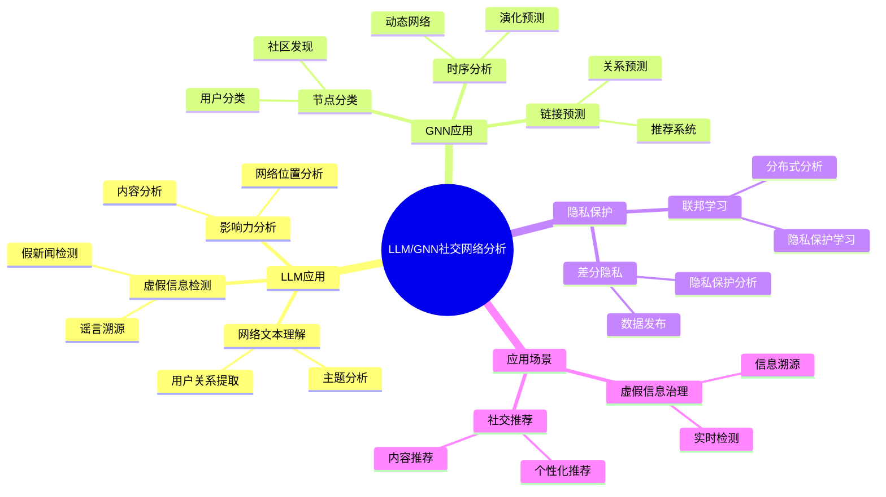
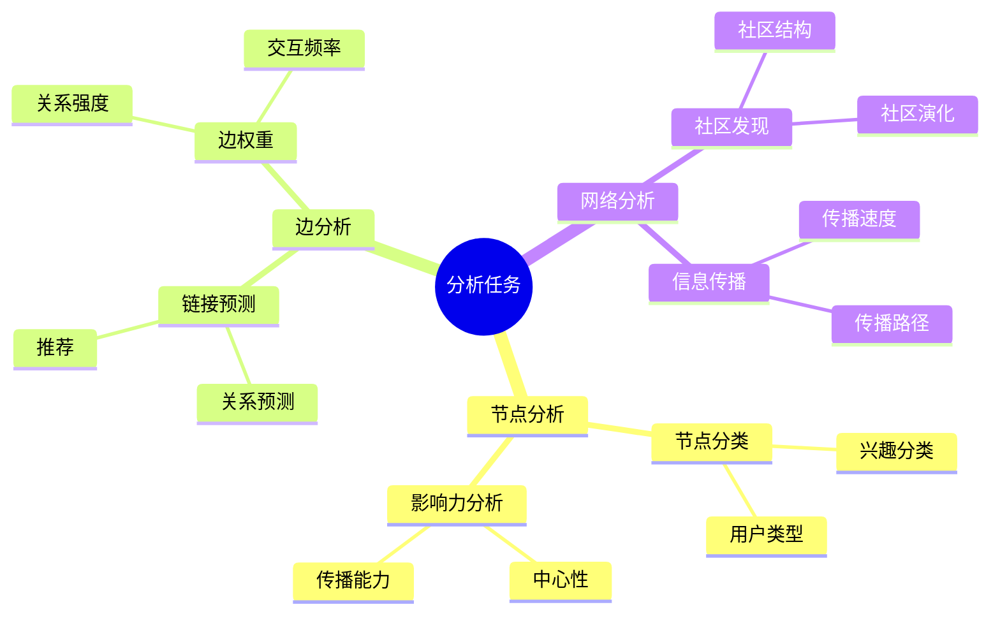
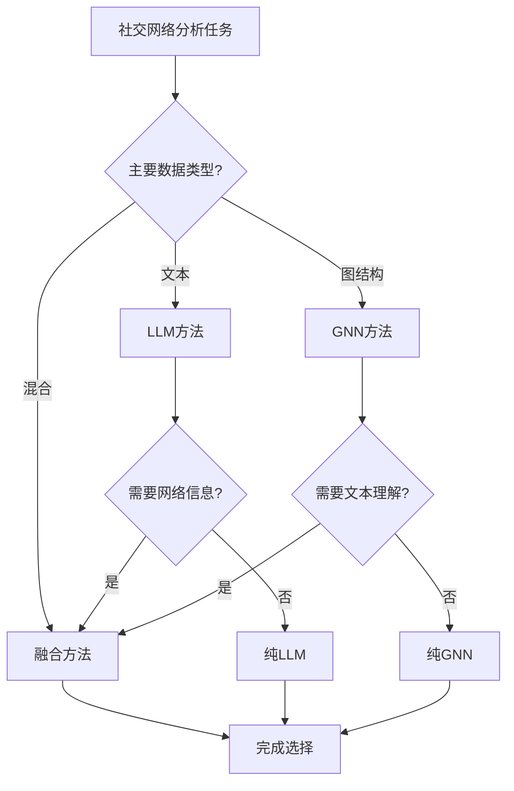
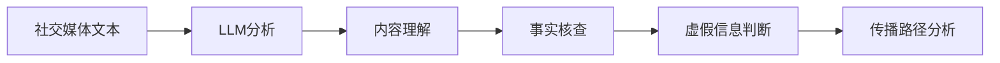
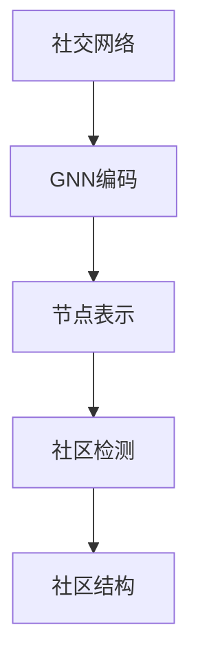
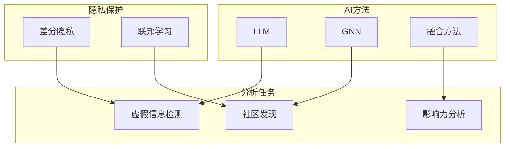
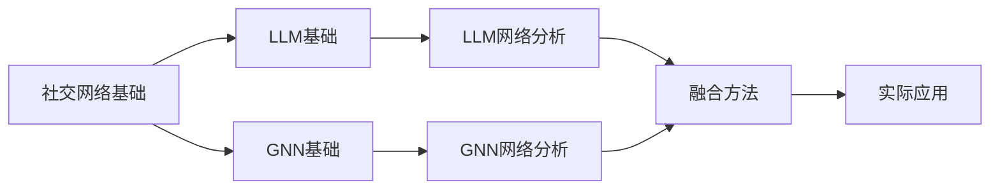

# LLM与GNN驱动的社交网络分析专题思维表征工具 / LLM and GNN-Driven Social Network Analysis Special Topic Mental Representation Tools 2024-2025

## 📚 **概述 / Overview**

本文档为LLM与GNN驱动的社交网络分析专题提供完整的思维表征工具集合，包括思维导图、对比矩阵、决策树、数据流图等多种表征方式。

**创建时间**: 2025年1月
**状态**: ✅ 完成
**专题**: LLM与GNN驱动的社交网络分析（2024-2025最新研究）
**相关文档**: [LLM与GNN驱动的社交网络分析专题-2024-2025.md](LLM与GNN驱动的社交网络分析专题-2024-2025.md)

---

## 🗺️ **一、思维导图 / Mind Maps**

### 1.1 LLM/GNN社交网络分析完整思维导图

### 1.2 社交网络分析任务思维导图

---

## 📊 **二、对比矩阵 / Comparison Matrices**

### 2.1 LLM vs GNN对比矩阵

| 方法 | 输入类型 | 优势 | 劣势 | 适用场景 |
|------|---------|------|------|---------|
| **LLM** | 文本 | 语义理解强 | 需要文本 | 文本分析、虚假信息检测 |
| **GNN** | 图结构 | 结构建模强 | 需要图结构 | 网络分析、社区发现 |
| **融合方法** | 文本+图 | 综合能力强 | 复杂度高 | 复杂分析任务 |

### 2.2 虚假信息检测方法对比矩阵

| 方法 | 检测准确率 | 速度 | 可解释性 | 适用场景 |
|------|-----------|------|---------|---------|
| **传统方法** | 中等 | 快 | 高 | 简单检测 |
| **LLM方法** | 高 | 中等 | 中等 | 文本分析 |
| **GNN方法** | 高 | 中等 | 中等 | 网络分析 |
| **融合方法** | 很高 | 慢 | 中等 | 复杂场景 |

### 2.3 隐私保护方法对比矩阵

| 方法 | 隐私保护 | 数据效用 | 计算成本 | 适用场景 |
|------|---------|---------|---------|---------|
| **差分隐私** | 高 | 中等 | 低 | 数据发布 |
| **联邦学习** | 很高 | 高 | 高 | 分布式分析 |
| **同态加密** | 最高 | 低 | 很高 | 高安全需求 |

---

## 🌳 **三、决策树 / Decision Trees**

### 3.1 分析方法选择决策树

---

## 🔄 **四、数据流图 / Data Flow Diagrams**

### 4.1 LLM虚假信息检测数据流

### 4.2 GNN社区发现数据流

---

## 🗺️ **五、概念地图 / Concept Maps**

### 5.1 LLM/GNN社交网络分析核心概念关系

---

## 📈 **六、学习路径 / Learning Paths**

### 6.1 LLM/GNN社交网络分析学习逻辑路径

---

**文档版本**: v1.0
**创建时间**: 2025年1月
**最后更新**: 2025年1月
**维护者**: GraphNetWorkCommunicate项目组
**状态**: ✅ 完成
