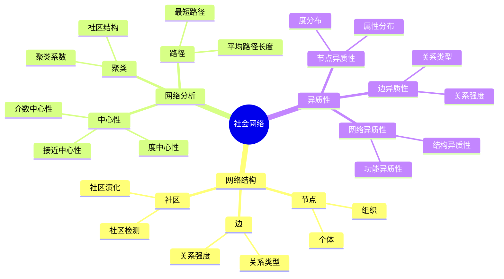
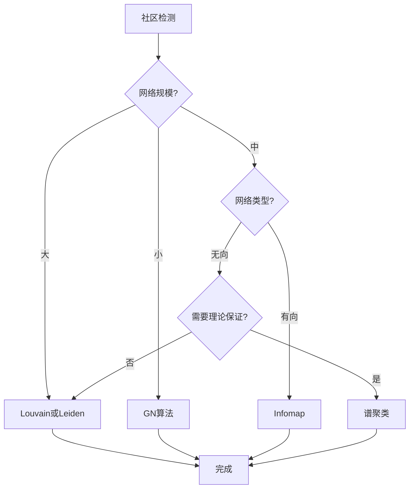

# 社会网络思维表征工具 / Social Networks Mental Representation Tools

## 📚 **概述 / Overview**

本文档提供社会网络模块的多种思维表征工具，包括思维导图、对比矩阵、决策树、逻辑路径和概念地图，帮助更好地理解和应用社会网络知识。

**创建时间**: 2025年1月
**模块**: 社会网络
**状态**: 🚀 持续更新中

---

## 🗺️ **一、思维导图 / Mind Maps**

### 1.1 社会网络核心概念思维导图

---

## 📊 **二、对比矩阵 / Comparison Matrices**

### 2.1 社区检测算法对比矩阵

| 算法 | 原理 | 时间复杂度 | 适用规模 | 特点 | 应用场景 |
|------|------|-----------|---------|------|---------|
| **Louvain** | 模块度优化 | O(n log n) | 大 | 快速、层次化 | 大规模网络 |
| **Leiden** | 模块度优化 | O(n log n) | 大 | 改进Louvain | 大规模网络 |
| **Infomap** | 信息论 | O(n log n) | 中-大 | 信息流优化 | 有向网络 |
| **GN算法** | 边介数 | O(n³) | 小-中 | 精确、慢 | 小规模网络 |
| **谱聚类** | 特征值分解 | O(n³) | 中 | 理论保证 | 中等规模 |

**选择指南**：

- **大规模网络**：Louvain或Leiden
- **有向网络**：Infomap
- **小规模精确**：GN算法
- **理论分析**：谱聚类

---

## 🌳 **三、决策树 / Decision Trees**

### 3.1 社区检测算法选择决策树

---

**文档版本**: v1.0
**创建时间**: 2025年1月
**最后更新**: 2025年1月
**维护者**: GraphNetWorkCommunicate项目组
