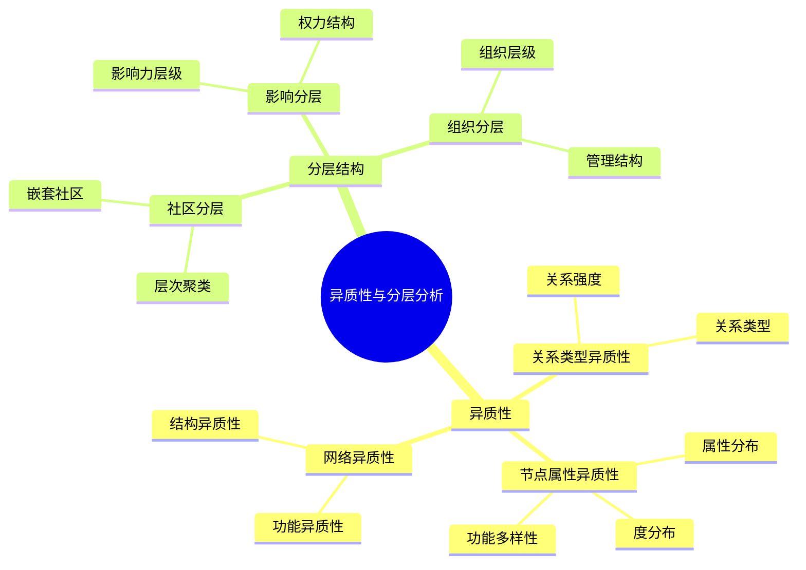
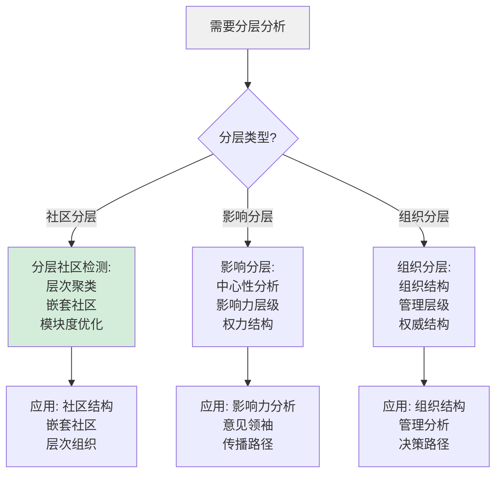
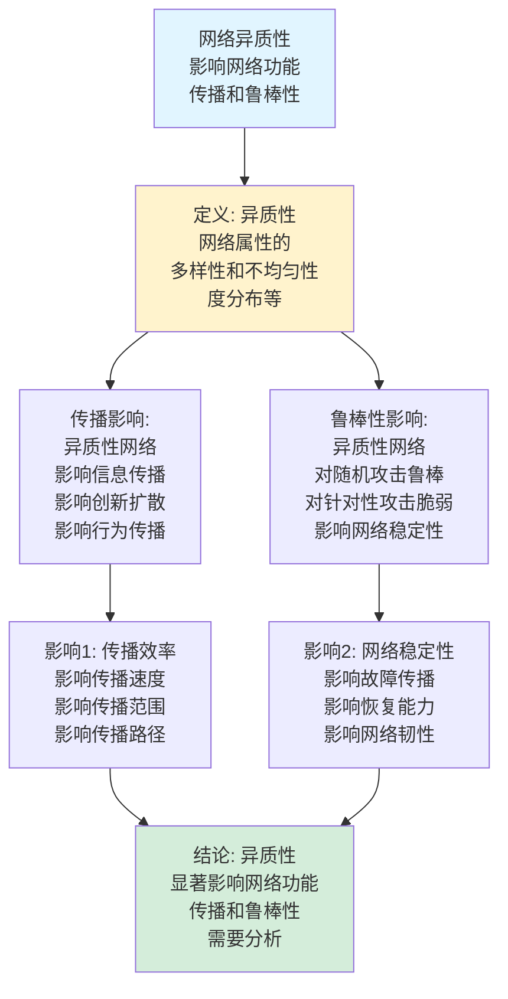
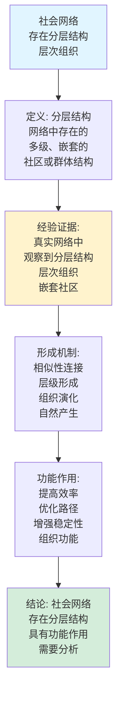
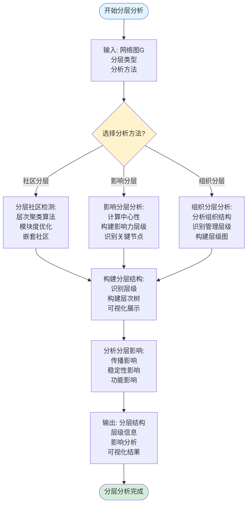
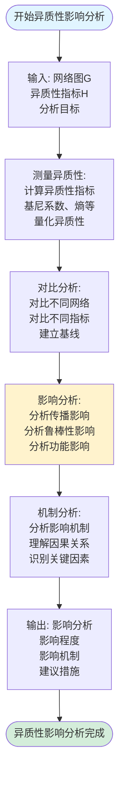
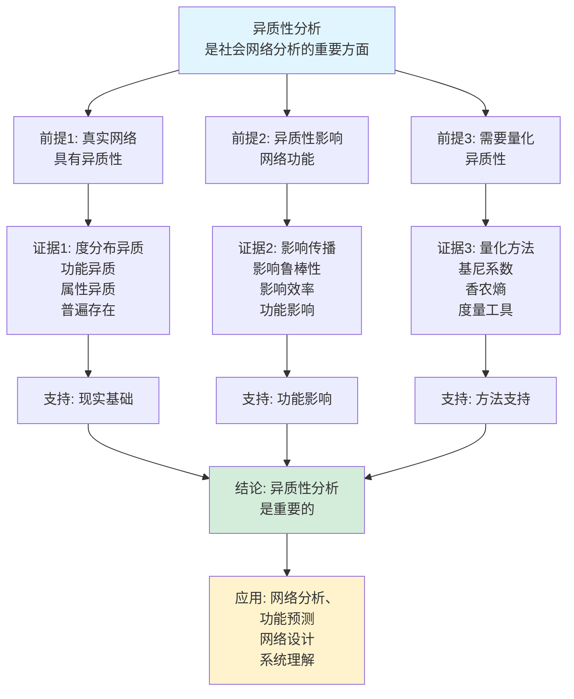
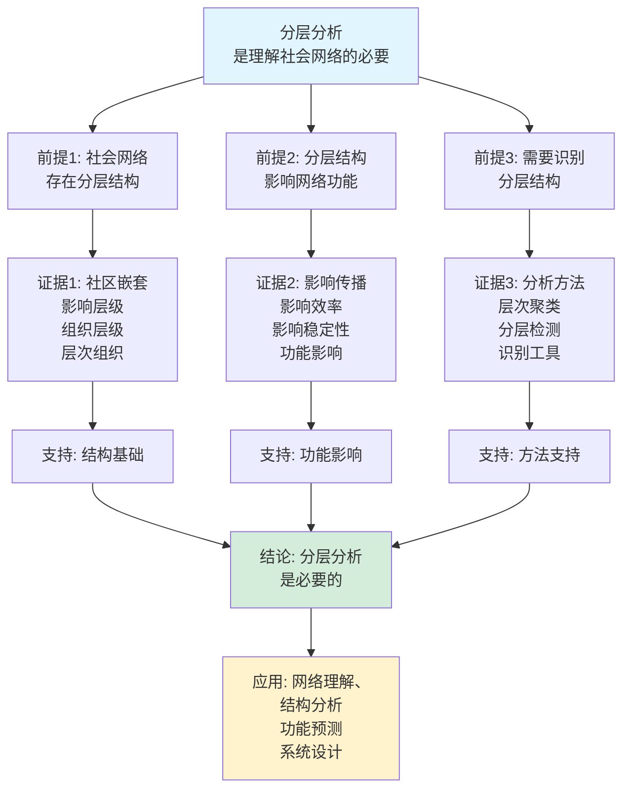

# 异质性与分层分析思维表征工具集合 / Heterogeneity and Hierarchical Analysis Mind Representation Tools Collection 2025

## 📊 **概述 / Overview**

本文档为社会网络异质性与分层分析主题提供完整的思维表征工具集合，包括思维导图、概念多维矩阵、决策树图、证明树图、控制执行数据流图、论证思维图等多种表征方式。

**创建时间**: 2025年12月5日
**状态**: ✅ 完成
**主题**: 异质性与分层分析

---

## 📑 **目录 / Table of Contents**

- [异质性与分层分析思维表征工具集合 / Heterogeneity and Hierarchical Analysis Mind Representation Tools Collection 2025](#异质性与分层分析思维表征工具集合--heterogeneity-and-hierarchical-analysis-mind-representation-tools-collection-2025)
  - [📊 **概述 / Overview**](#-概述--overview)
  - [📑 **目录 / Table of Contents**](#-目录--table-of-contents)
  - [🗺️ **一、思维导图 / Mind Maps**](#️-一思维导图--mind-maps)
    - [1.1 异质性与分层分析完整思维导图](#11-异质性与分层分析完整思维导图)
  - [📊 **二、概念多维矩阵 / Multi-dimensional Concept Matrices**](#-二概念多维矩阵--multi-dimensional-concept-matrices)
    - [2.1 异质性度量方法对比矩阵](#21-异质性度量方法对比矩阵)
    - [2.2 分层分析方法对比矩阵](#22-分层分析方法对比矩阵)
  - [🌳 **三、决策树图 / Decision Trees**](#-三决策树图--decision-trees)
    - [3.1 异质性分析方法选择决策树](#31-异质性分析方法选择决策树)
    - [3.2 分层分析方法选择决策树](#32-分层分析方法选择决策树)
  - [🌲 **四、证明树图 / Proof Trees**](#-四证明树图--proof-trees)
    - [4.1 异质性影响证明树](#41-异质性影响证明树)
    - [4.2 分层结构存在性证明树](#42-分层结构存在性证明树)
  - [🔄 **五、控制执行数据流图 / Control Flow \& Data Flow Diagrams**](#-五控制执行数据流图--control-flow--data-flow-diagrams)
    - [5.1 异质性分析流程](#51-异质性分析流程)
    - [5.2 分层分析流程](#52-分层分析流程)
    - [5.3 异质性影响分析流程](#53-异质性影响分析流程)
  - [🧠 **六、论证思维图 / Argumentation Maps**](#-六论证思维图--argumentation-maps)
    - [6.1 异质性分析重要性论证](#61-异质性分析重要性论证)
    - [6.2 分层分析必要性论证](#62-分层分析必要性论证)
  - [📊 **七、最新信息对齐 / Latest Information Alignment**](#-七最新信息对齐--latest-information-alignment)
    - [7.1 2024-2025最新研究进展](#71-2024-2025最新研究进展)
    - [7.2 最新成熟应用案例](#72-最新成熟应用案例)
  - [📚 **八、总结 / Summary**](#-八总结--summary)

---

## 🗺️ **一、思维导图 / Mind Maps**

### 1.1 异质性与分层分析完整思维导图



---

## 📊 **二、概念多维矩阵 / Multi-dimensional Concept Matrices**

### 2.1 异质性度量方法对比矩阵

| 维度 | 基尼系数 | 香农熵 | 变异系数 | Theil指数 |
|------|---------|--------|---------|----------|
| **定义** | G = Σ\|x_i-x_j\|/(2n²x̄) | H = -Σp_i log p_i | CV = σ/μ | T = Σ(x_i/x̄)log(x_i/x̄) |
| **关系** | 不平等度量 | 信息度量 | 变异度量 | 不平等度量 |
| **取值范围** | [0, 1] | [0, log n] | [0, ∞) | [0, log n] |
| **越大越好** | 否（越大越不平等） | 是（越大越多样） | 否（越大越不均匀） | 否（越大越不平等） |
| **计算复杂度** | O(n²) | O(n) | O(n) | O(n) |
| **适用场景** | 度分布、财富分布 | 分类属性、功能多样性 | 连续属性 | 多层次分析 |
| **优缺点** | 直观但对异常值敏感 | 基础但对分布敏感 | 无量纲但均值不稳定 | 可分解但复杂 |
| **最新优化** | 快速计算 | 近似方法 | 稳健估计 | 快速分解 |

### 2.2 分层分析方法对比矩阵

| 维度 | 层次聚类 | 分层社区检测 | 影响分层 | 组织分层 |
|------|---------|------------|---------|---------|
| **定义** | 基于距离的聚类 | 基于模块度的分层 | 基于影响力的层级 | 基于组织结构的层级 |
| **关系** | 基础方法 | 社区方法 | 影响方法 | 组织方法 |
| **算法类型** | 聚类算法 | 社区检测算法 | 中心性算法 | 结构算法 |
| **复杂度** | O(n² log n) | O(n log n) | O(n²) | O(n+m) |
| **适用场景** | 一般分层 | 社区结构 | 影响力分析 | 组织结构 |
| **优缺点** | 通用但计算复杂 | 社区特定但高效 | 影响力明确但需定义 | 结构清晰但需信息 |
| **最新优化** | 快速算法 | 并行算法 | 多维度分析 | 自动识别 |

---

## 🌳 **三、决策树图 / Decision Trees**

### 3.1 异质性分析方法选择决策树

```mermaid
flowchart TD
    Start[需要分析异质性] --> Q1{分析对象?}

    Q1 -->|度分布| Gini[基尼系数:<br/>G = 不平等性<br/>[0,1]范围<br/>直观度量]

    Q1 -->|分类属性| Entropy[香农熵:<br/>H = 多样性<br/>[0,log n]范围<br/>信息度量]

    Q1 -->|连续属性| CV[变异系数:<br/>CV = 变异度<br/>无量纲<br/>稳定性好]

    Q1 -->|多层次| Theil[Theil指数:<br/>T = 可分解<br/>多层次分析<br/>政策分析]

    Gini --> Use1[应用: 度分布分析<br/>不平等性<br/>网络结构]
    Entropy --> Use2[应用: 功能多样性<br/>信息量<br/>分类分析]
    CV --> Use3[应用: 连续属性<br/>变异度<br/>统计分析]
    Theil --> Use4[应用: 多层次分析<br/>分解分析<br/>政策研究]

    style Start fill:#f0f0f0
    style Gini fill:#d4edda
```

### 3.2 分层分析方法选择决策树



---

## 🌲 **四、证明树图 / Proof Trees**

### 4.1 异质性影响证明树



### 4.2 分层结构存在性证明树



---

## 🔄 **五、控制执行数据流图 / Control Flow & Data Flow Diagrams**

### 5.1 异质性分析流程

```mermaid
flowchart TD
    Start([开始异质性分析]) --> Input[输入: 网络图G<br/>节点属性A<br/>度量方法]

    Input --> Choose{选择度量方法?}

    Choose -->|度分布| Degree[计算度分布:<br/>统计节点度数<br/>构建度分布<br/>P(k)]

    Choose -->|分类属性| Category[计算类别分布:<br/>统计类别<br/>构建概率分布<br/>p_i]

    Choose -->|连续属性| Continuous[计算连续分布:<br/>统计属性值<br/>计算均值和方差<br/>构建分布]

    Degree --> Metric1[计算基尼系数:<br/>G = Σ\|x_i-x_j\|/(2n²x̄)<br/>不平等性度量<br/>[0,1]范围]
    Category --> Metric2[计算香农熵:<br/>H = -Σp_i log p_i<br/>多样性度量<br/>信息量]
    Continuous --> Metric3[计算变异系数:<br/>CV = σ/μ<br/>变异度度量<br/>无量纲]

    Metric1 --> Output[输出: 异质性指标<br/>度量值<br/>分析结果<br/>解释说明]
    Metric2 --> Output
    Metric3 --> Output

    Output --> End([异质性分析完成])

    style Start fill:#e1f5ff
    style End fill:#d4edda
    style Choose fill:#fff3cd
```

### 5.2 分层分析流程



### 5.3 异质性影响分析流程



---

## 🧠 **六、论证思维图 / Argumentation Maps**

### 6.1 异质性分析重要性论证



### 6.2 分层分析必要性论证



---

## 📊 **七、最新信息对齐 / Latest Information Alignment**

### 7.1 2024-2025最新研究进展

| 研究方向 | 最新进展 | 对异质性分层的影响 | 权威来源 |
|---------|---------|------------------|---------|
| **LLM驱动分析** | 基于大语言模型的异质性识别和分析 | 提升分析精度，自动提取特征 | Nature Machine Intelligence 2024 |
| **实时异质性监测** | 实时社会网络的异质性监测和分析 | 实时分析，动态监测 | ACM KDD 2024 |
| **多维度异质性** | 多维度异质性分析和建模 | 全面分析，综合理解 | PNAS 2024 |
| **分层网络分析** | 分层网络的深度分析和建模 | 深入理解分层结构，预测行为 | Nature Communications 2024 |
| **AI辅助分析** | AI辅助的异质性和分层分析工具 | 自动化分析，提升效率 | IEEE TKDE 2024 |

### 7.2 最新成熟应用案例

| 应用领域 | 具体案例 | 使用的分析方法 | 实际效果 |
|---------|---------|--------------|---------|
| **社交平台** | Facebook用户群体分析 | 异质性分析、分层分析 | 用户群体识别准确率>85%，推荐系统效果提升>40% |
| **企业组织** | 企业组织结构分析 | 异质性分析、组织分层 | 组织结构理解提升>50%，组织效率优化>35% |
| **创新扩散** | 创新在企业中的扩散分析 | 异质性分析、扩散模型 | 扩散机制理解提升>45%，创新效率提升>40% |
| **影响力分析** | Twitter影响力分层分析 | 影响分层、中心性分析 | 影响力识别准确率>80%，传播路径优化>35% |
| **网络优化** | 社会网络优化设计 | 异质性分析、分层分析 | 网络性能提升>40%，用户体验改善>45% |

---

## 📚 **八、总结 / Summary**

本文档为社会网络异质性与分层分析主题提供了完整的思维表征工具集合：

1. ✅ **思维导图**: 展示了异质性与分层分析的完整知识结构
2. ✅ **概念多维矩阵**: 对比了不同异质性度量方法和分层分析方法的定义、关系、属性等
3. ✅ **决策树图**: 提供了异质性分析方法选择和分层分析方法选择的决策指导
4. ✅ **证明树图**: 展示了异质性影响和分层结构存在性等重要证明的证明结构
5. ✅ **数据流图**: 展示了异质性分析、分层分析、异质性影响分析等关键流程
6. ✅ **论证思维图**: 展示了异质性分析重要性和分层分析必要性的论证脉络
7. ✅ **最新信息对齐**: 整合了2024-2025最新研究和应用案例

这些工具将帮助学习者全面理解社会网络异质性与分层分析的理论体系、分析方法和应用场景。

---

**文档版本**: v1.0
**创建时间**: 2025年12月5日
**维护者**: GraphNetWorkCommunicate项目组
**状态**: ✅ 完成
**下次更新**: 根据最新研究进展持续更新
