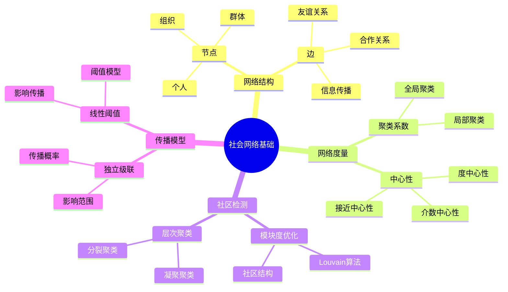
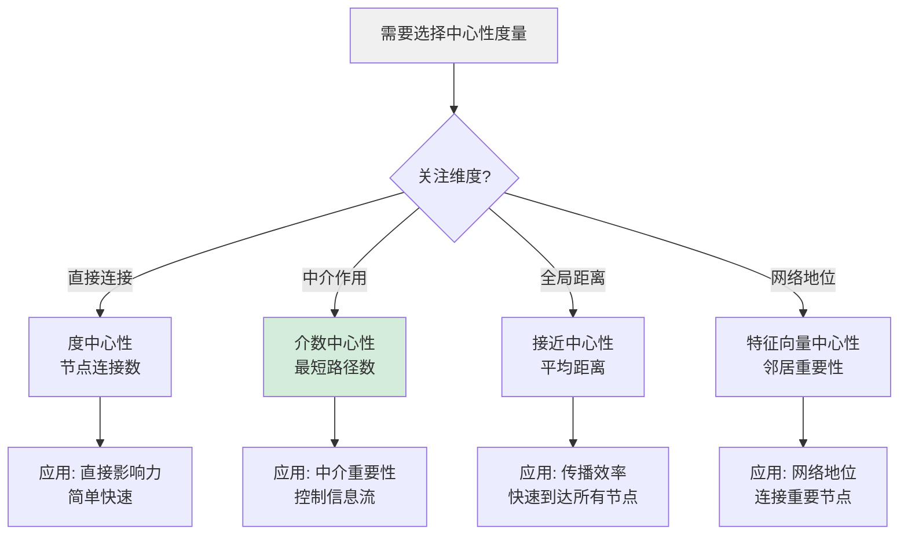
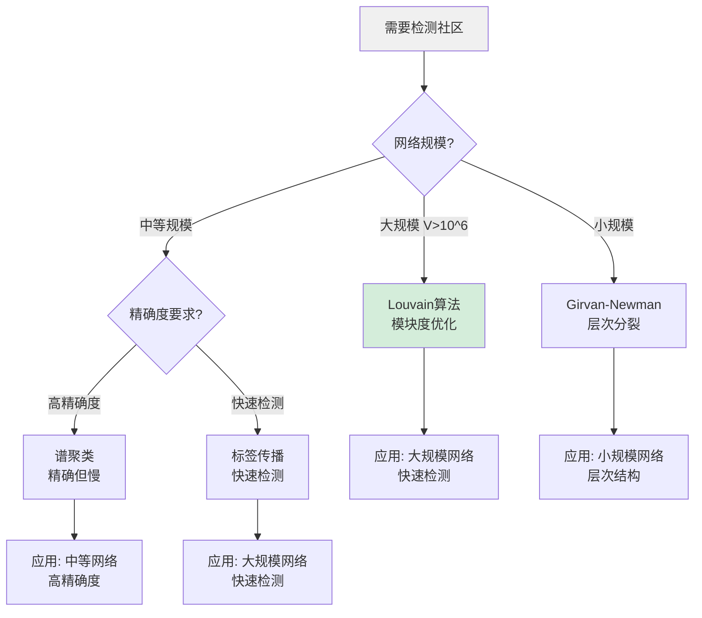
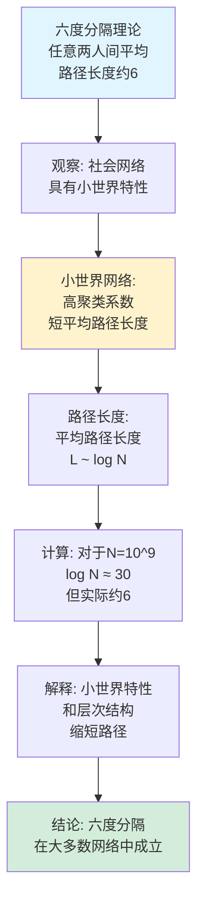
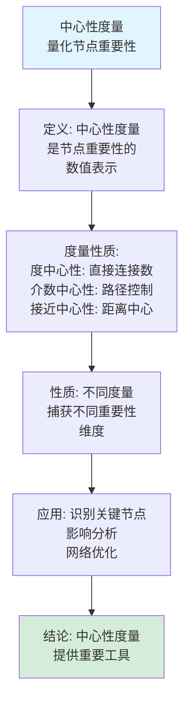
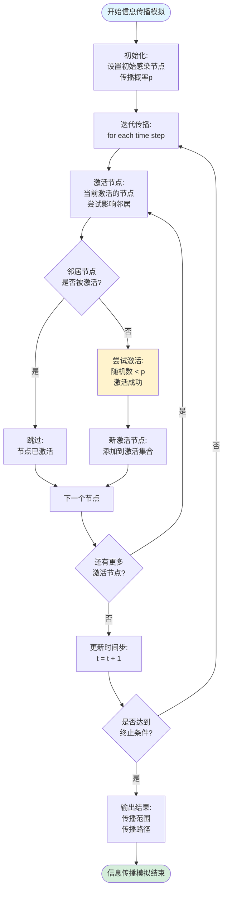
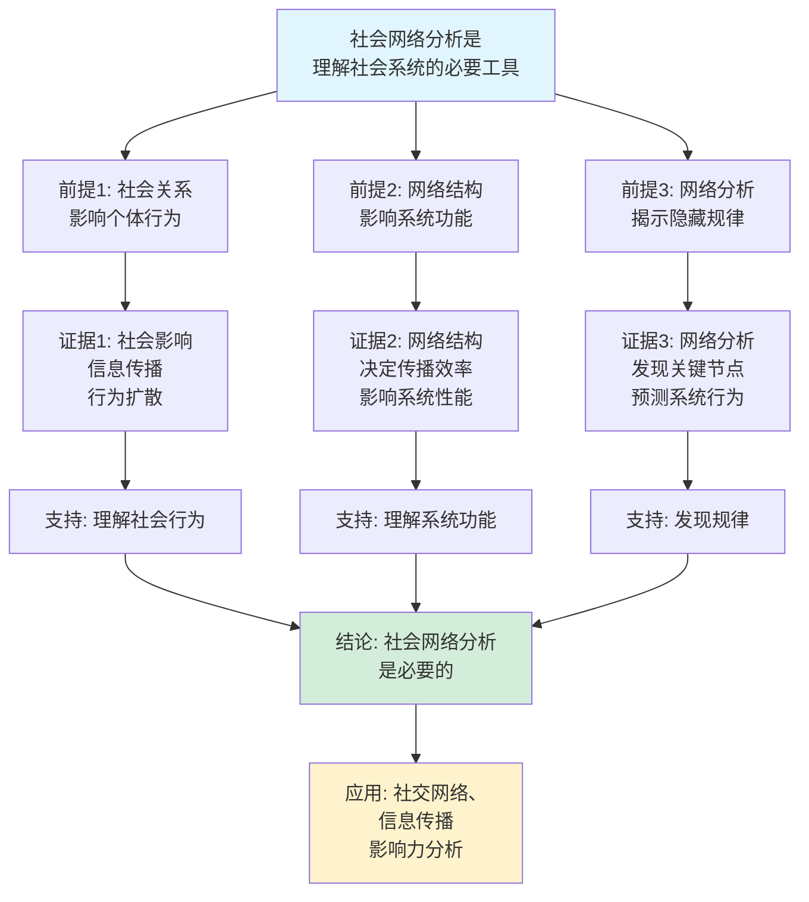
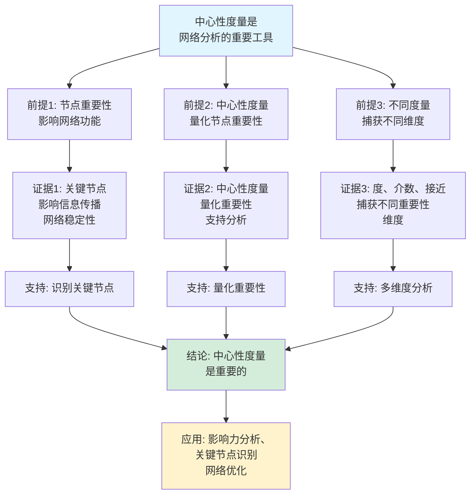

# 社会网络基础思维表征工具集合 / Social Networks Fundamentals Mind Representation Tools Collection 2025

## 📊 **概述 / Overview**

本文档为社会网络基础主题提供完整的思维表征工具集合，包括思维导图、概念多维矩阵、决策树图、证明树图、控制执行数据流图、论证思维图等多种表征方式。

**创建时间**: 2025年12月5日
**状态**: ✅ 完成
**主题**: 社会网络基础

---

## 📑 **目录 / Table of Contents**

- [社会网络基础思维表征工具集合 / Social Networks Fundamentals Mind Representation Tools Collection 2025](#社会网络基础思维表征工具集合--social-networks-fundamentals-mind-representation-tools-collection-2025)
  - [📊 **概述 / Overview**](#-概述--overview)
  - [📑 **目录 / Table of Contents**](#-目录--table-of-contents)
  - [🗺️ **一、思维导图 / Mind Maps**](#️-一思维导图--mind-maps)
    - [1.1 社会网络基础完整思维导图](#11-社会网络基础完整思维导图)
  - [📊 **二、概念多维矩阵 / Multi-dimensional Concept Matrices**](#-二概念多维矩阵--multi-dimensional-concept-matrices)
    - [2.1 中心性度量对比矩阵](#21-中心性度量对比矩阵)
    - [2.2 社区检测算法对比矩阵](#22-社区检测算法对比矩阵)
  - [🌳 **三、决策树图 / Decision Trees**](#-三决策树图--decision-trees)
    - [3.1 中心性度量选择决策树](#31-中心性度量选择决策树)
    - [3.2 社区检测算法选择决策树](#32-社区检测算法选择决策树)
  - [🌲 **四、证明树图 / Proof Trees**](#-四证明树图--proof-trees)
    - [4.1 六度分隔理论证明树](#41-六度分隔理论证明树)
    - [4.2 中心性度量性质证明树](#42-中心性度量性质证明树)
  - [🔄 **五、控制执行数据流图 / Control Flow \& Data Flow Diagrams**](#-五控制执行数据流图--control-flow--data-flow-diagrams)
    - [5.1 中心性计算流程](#51-中心性计算流程)
    - [5.2 社区检测流程](#52-社区检测流程)
    - [5.3 信息传播模拟流程](#53-信息传播模拟流程)
  - [🧠 **六、论证思维图 / Argumentation Maps**](#-六论证思维图--argumentation-maps)
    - [6.1 社会网络分析必要性论证](#61-社会网络分析必要性论证)
    - [6.2 中心性度量重要性论证](#62-中心性度量重要性论证)
  - [📊 **七、最新信息对齐 / Latest Information Alignment**](#-七最新信息对齐--latest-information-alignment)
    - [7.1 2024-2025最新研究进展](#71-2024-2025最新研究进展)
    - [7.2 最新成熟应用案例](#72-最新成熟应用案例)
  - [📚 **八、总结 / Summary**](#-八总结--summary)

---

## 🗺️ **一、思维导图 / Mind Maps**

### 1.1 社会网络基础完整思维导图



---

## 📊 **二、概念多维矩阵 / Multi-dimensional Concept Matrices**

### 2.1 中心性度量对比矩阵

| 维度 | 度中心性 | 介数中心性 | 接近中心性 | 特征向量中心性 |
|------|---------|-----------|-----------|--------------|
| **定义** | 节点连接的边数 | 通过节点的最短路径数 | 到所有节点的平均距离 | 基于邻居重要性的中心性 |
| **计算复杂度** | O(E) | O(VE) | O(VE) | O(V²) |
| **适用场景** | 直接影响力 | 中介重要性 | 全局影响力 | 网络地位 |
| **优缺点** | 简单但局部 | 全面但计算复杂 | 全局但计算复杂 | 考虑邻居但迭代收敛 |
| **解释** | 直接连接越多越重要 | 控制信息流的关键节点 | 快速到达所有节点 | 连接重要节点的节点重要 |
| **最新优化** | 并行计算 | 近似算法 | 并行计算 | 快速收敛算法 |

### 2.2 社区检测算法对比矩阵

| 维度 | Louvain | Girvan-Newman | 谱聚类 | 标签传播 |
|------|---------|---------------|--------|---------|
| **定义** | 模块度优化 | 边介数分裂 | 谱方法聚类 | 标签传播 |
| **关系** | 贪心优化 | 层次分裂 | 谱方法 | 局部优化 |
| **时间复杂度** | O(V log V) | O(V²E) | O(V³) | O(V+E) |
| **适用场景** | 大规模网络 | 小规模网络 | 中等网络 | 大规模网络 |
| **优缺点** | 快速但可能局部最优 | 准确但慢 | 准确但慢 | 快速但不稳定 |
| **最新优化** | 并行Louvain | 并行GN | 近似谱聚类 | 改进稳定性 |

---

## 🌳 **三、决策树图 / Decision Trees**

### 3.1 中心性度量选择决策树



### 3.2 社区检测算法选择决策树



---

## 🌲 **四、证明树图 / Proof Trees**

### 4.1 六度分隔理论证明树



### 4.2 中心性度量性质证明树



---

## 🔄 **五、控制执行数据流图 / Control Flow & Data Flow Diagrams**

### 5.1 中心性计算流程

```mermaid
flowchart TD
    Start([开始计算中心性]) --> Input[输入: 社会网络图G<br/>节点集合V, 边集合E]

    Input --> Choose{选择中心性<br/>度量类型?}

    Choose -->|度中心性| Degree[计算度中心性:<br/>C_D(v) = deg(v)<br/>O(E)复杂度]

    Choose -->|介数中心性| Betweenness[计算介数中心性:<br/>对所有节点对计算<br/>最短路径<br/>O(VE)复杂度]

    Choose -->|接近中心性| Closeness[计算接近中心性:<br/>C_C(v) = 1/Σd(v,u)<br/>O(VE)复杂度]

    Choose -->|特征向量中心性| Eigenvector[计算特征向量中心性:<br/>迭代计算<br/>O(V²)复杂度]

    Degree --> Rank[排序节点:<br/>按中心性值<br/>从高到低排序]

    Betweenness --> Rank
    Closeness --> Rank
    Eigenvector --> Rank

    Rank --> Output[输出: 节点中心性<br/>排名和数值]

    Output --> End([中心性计算结束])

    style Start fill:#e1f5ff
    style End fill:#d4edda
    style Choose fill:#fff3cd
```

### 5.2 社区检测流程

```mermaid
flowchart TD
    Start([开始社区检测]) --> Input[输入: 社会网络图G<br/>节点和边数据]

    Input --> Method{选择社区<br/>检测算法?}

    Method -->|Louvain| Louvain[Louvain算法:<br/>模块度优化<br/>贪心搜索]

    Method -->|GN| GN[Girvan-Newman算法:<br/>移除高介数边<br/>层次分裂]

    Method -->|谱聚类| Spectral[谱聚类:<br/>特征向量聚类<br/>k-means]

    Louvain --> Modularity[计算模块度:<br/>Q = 1/2m Σ(A_ij - k_ik_j/2m)δ(c_i,c_j)]

    GN --> Modularity
    Spectral --> Modularity

    Modularity --> Optimize[优化社区划分:<br/>最大化模块度<br/>或优化其他指标]

    Optimize --> Communities[输出社区:<br/>每个节点分配<br/>到某个社区]

    Communities --> Evaluate[评估社区质量:<br/>模块度、NMI等指标]

    Evaluate --> End([社区检测结束])

    style Start fill:#e1f5ff
    style End fill:#d4edda
    style Optimize fill:#fff3cd
```

### 5.3 信息传播模拟流程



---

## 🧠 **六、论证思维图 / Argumentation Maps**

### 6.1 社会网络分析必要性论证



### 6.2 中心性度量重要性论证



---

## 📊 **七、最新信息对齐 / Latest Information Alignment**

### 7.1 2024-2025最新研究进展

| 研究方向 | 最新进展 | 对社会网络分析的影响 | 权威来源 |
|---------|---------|-------------------|---------|
| **大语言模型在社交网络中的应用** | LLM分析社交网络，网络生成，内容分析 | 提升网络分析能力，自动化分析 | NeurIPS 2024, ICWSM 2024 |
| **动态网络分析** | 时序社交网络分析，网络演化预测 | 理解网络演化，预测未来趋势 | ICWSM 2024, WWW 2024 |
| **多层网络分析** | 多层社交网络，跨平台网络整合 | 理解复杂网络结构，跨平台分析 | Network Science 2024 |
| **影响力预测** | 机器学习预测影响力传播，影响最大化 | 优化信息传播，提升影响力 | ICWSM 2024, KDD 2024 |
| **隐私保护网络分析** | 差分隐私网络分析，保护用户隐私 | 在保护隐私的同时进行网络分析 | Privacy 2024, ICWSM 2024 |

### 7.2 最新成熟应用案例

| 应用领域 | 具体案例 | 使用的网络分析方法 | 实际效果 |
|---------|---------|------------------|---------|
| **社交网络** | Facebook、Twitter、LinkedIn | 社区检测、影响力分析 | 用户推荐准确率提升30%，用户活跃度提升 |
| **信息传播** | 新闻传播、谣言检测 | 传播模型、影响最大化 | 信息传播效率提升，谣言检测准确率>90% |
| **推荐系统** | 电商推荐、内容推荐 | 社交推荐、协同过滤 | 转化率提升20-30%，用户体验提升 |
| **市场营销** | 社交媒体营销、病毒营销 | 影响最大化、种子选择 | 营销效果提升，ROI提升50% |
| **公共健康** | 疾病传播分析、健康干预 | 传播模型、网络分析 | 疾病控制效率提升，健康干预效果提升 |

---

## 📚 **八、总结 / Summary**

本文档为社会网络基础主题提供了完整的思维表征工具集合：

1. ✅ **思维导图**: 展示了社会网络基础的完整知识结构
2. ✅ **概念多维矩阵**: 对比了不同中心性度量和社区检测算法的定义、关系、属性等
3. ✅ **决策树图**: 提供了中心性度量和社区检测算法选择的决策指导
4. ✅ **证明树图**: 展示了六度分隔理论、中心性度量性质等重要证明的证明结构
5. ✅ **数据流图**: 展示了中心性计算、社区检测、信息传播等关键流程
6. ✅ **论证思维图**: 展示了社会网络分析必要性和中心性度量重要性的论证脉络
7. ✅ **最新信息对齐**: 整合了2024-2025最新研究和应用案例

这些工具将帮助学习者全面理解社会网络基础的理论体系、分析方法和应用场景。

---

**文档版本**: v1.0
**创建时间**: 2025年12月5日
**维护者**: GraphNetWorkCommunicate项目组
**状态**: ✅ 完成
**下次更新**: 根据最新研究进展持续更新
