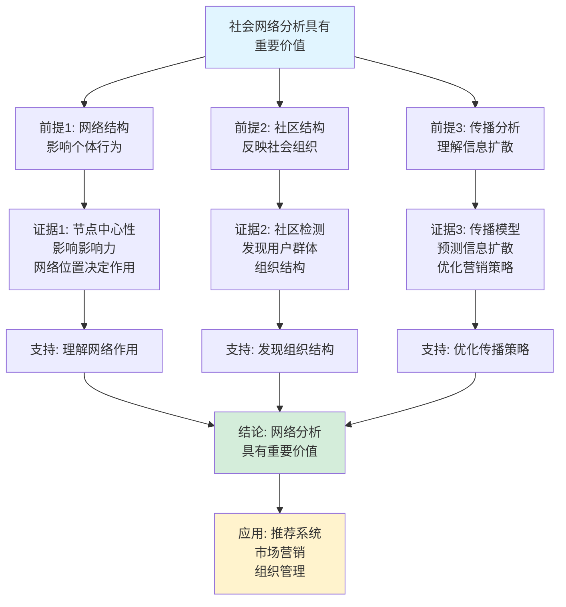

# 社会网络分析思维表征工具集合 / Social Network Analysis Mind Representation Tools Collection 2025

## 📊 **概述 / Overview**

本文档为社会网络分析主题提供完整的思维表征工具集合，包括思维导图、概念多维矩阵、决策树图、证明树图、控制执行数据流图、论证思维图等多种表征方式。

**创建时间**: 2025年12月5日
**状态**: ✅ 完成
**主题**: 社会网络分析

---

## 📑 **目录 / Table of Contents**

- [社会网络分析思维表征工具集合 / Social Network Analysis Mind Representation Tools Collection 2025](#社会网络分析思维表征工具集合--social-network-analysis-mind-representation-tools-collection-2025)
  - [📊 **概述 / Overview**](#-概述--overview)
  - [📑 **目录 / Table of Contents**](#-目录--table-of-contents)
  - [🗺️ **一、思维导图 / Mind Maps**](#️-一思维导图--mind-maps)
    - [1.1 社会网络分析完整思维导图](#11-社会网络分析完整思维导图)
  - [📊 **二、概念多维矩阵 / Multi-dimensional Concept Matrices**](#-二概念多维矩阵--multi-dimensional-concept-matrices)
    - [2.1 网络分析方法对比矩阵](#21-网络分析方法对比矩阵)
    - [2.2 中心性度量对比矩阵](#22-中心性度量对比矩阵)
  - [🌳 **三、决策树图 / Decision Trees**](#-三决策树图--decision-trees)
    - [3.1 网络分析方法选择决策树](#31-网络分析方法选择决策树)
    - [3.2 中心性度量选择决策树](#32-中心性度量选择决策树)
  - [🌲 **四、证明树图 / Proof Trees**](#-四证明树图--proof-trees)
    - [4.1 中心性度量性质证明树](#41-中心性度量性质证明树)
    - [4.2 模块度优化正确性证明树](#42-模块度优化正确性证明树)
  - [🔄 **五、控制执行数据流图 / Control Flow \& Data Flow Diagrams**](#-五控制执行数据流图--control-flow--data-flow-diagrams)
    - [5.1 网络分析执行流程](#51-网络分析执行流程)
    - [5.2 社区检测执行流程](#52-社区检测执行流程)
    - [5.3 影响力传播执行流程](#53-影响力传播执行流程)
  - [🧠 **六、论证思维图 / Argumentation Maps**](#-六论证思维图--argumentation-maps)
    - [6.1 网络分析价值论证](#61-网络分析价值论证)
    - [6.2 不同中心性度量选择论证](#62-不同中心性度量选择论证)
  - [📊 **七、最新信息对齐 / Latest Information Alignment**](#-七最新信息对齐--latest-information-alignment)
    - [7.1 2024-2025最新研究进展](#71-2024-2025最新研究进展)
    - [7.2 最新成熟应用案例](#72-最新成熟应用案例)
  - [📚 **八、总结 / Summary**](#-八总结--summary)

---

## 🗺️ **一、思维导图 / Mind Maps**

### 1.1 社会网络分析完整思维导图


---

## 📊 **二、概念多维矩阵 / Multi-dimensional Concept Matrices**

### 2.1 网络分析方法对比矩阵

| 维度 | 结构分析 | 社区检测 | 动态分析 | 影响力分析 |
|------|---------|---------|---------|-----------|
| **定义** | 分析网络拓扑结构 | 识别网络中的社区 | 分析网络演化过程 | 评估节点影响力 |
| **关系** | 基础分析 | 中观分析 | 时间维度分析 | 功能分析 |
| **适用场景** | 理解网络结构 | 发现网络模块 | 网络演化研究 | 信息传播研究 |
| **优缺点** | 全面但计算复杂 | 有效但算法复杂 | 深入但需要时间数据 | 实用但模型假设多 |

### 2.2 中心性度量对比矩阵

| 维度 | 度中心性 | 介数中心性 | 接近中心性 | 特征向量中心性 |
|------|---------|-----------|-----------|--------------|
| **定义** | 节点连接的边数 | 通过节点的最短路径数 | 到所有节点的平均距离 | 基于邻居重要性的中心性 |
| **计算复杂度** | O(E) | O(VE) | O(VE) | O(V²) |
| **适用场景** | 直接影响力 | 中介重要性 | 全局影响力 | 网络地位 |
| **优缺点** | 简单但局部 | 全面但计算复杂 | 全局但计算复杂 | 考虑邻居但迭代收敛 |

---

## 🌳 **三、决策树图 / Decision Trees**

### 3.1 网络分析方法选择决策树


### 3.2 中心性度量选择决策树


---

## 🌲 **四、证明树图 / Proof Trees**

### 4.1 中心性度量性质证明树

```mermaid
graph TD
    Theorem[中心性度量的性质<br/>不同度量反映不同重要性] --> DegreeDef[度中心性:<br/>C_D(v) = deg(v)<br/>反映直接连接]

    DegreeDef --> DegreeProp[性质: 局部度量<br/>只考虑直接邻居<br/>计算简单O(E)]

    Theorem --> BetweennessDef[介数中心性:<br/>C_B(v) = Σσ_st(v)/σ_st<br/>反映中介作用]

    BetweennessDef --> BetweennessProp[性质: 全局度量<br/>考虑所有最短路径<br/>计算复杂O(VE)]

    Theorem --> ClosenessDef[接近中心性:<br/>C_C(v) = (n-1)/Σd(v,u)<br/>反映平均距离]

    ClosenessDef --> ClosenessProp[性质: 全局度量<br/>考虑所有节点距离<br/>计算复杂O(VE)]

    DegreeProp --> Comparison[比较: 不同度量<br/>反映不同重要性<br/>应用场景不同]
    BetweennessProp --> Comparison
    ClosenessProp --> Comparison

    Comparison --> Conclusion[结论: 中心性度量<br/>各有特点和适用场景]

    style Theorem fill:#e1f5ff
    style Conclusion fill:#d4edda
    style Comparison fill:#fff3cd
```

### 4.2 模块度优化正确性证明树

```mermaid
graph TD
    Theorem[模块度优化正确性<br/>最大化模块度找到良好社区划分] --> Definition[模块度定义:<br/>Q = Σ(e_ii - a_i²)<br/>衡量社区内连接强度]

    Definition --> Interpretation[解释: e_ii是社区i内<br/>边数比例, a_i是<br/>社区i节点度数比例]

    Interpretation --> Random[随机网络基准:<br/>Q = 0表示随机连接<br/>Q > 0表示社区结构]

    Random --> Optimization[优化: 最大化Q<br/>找到社区内连接<br/>强于随机的划分]

    Optimization --> Algorithm[算法: Louvain算法<br/>迭代优化模块度<br/>局部最优解]

    Algorithm --> Convergence[收敛性: 模块度<br/>单调递增<br/>算法收敛]

    Convergence --> Correctness[正确性: 最大化Q<br/>得到良好社区划分<br/>模块度越高越好]

    Correctness --> Conclusion[结论: 模块度优化<br/>有效识别社区结构]

    style Theorem fill:#e1f5ff
    style Conclusion fill:#d4edda
    style Optimization fill:#fff3cd
```

---

## 🔄 **五、控制执行数据流图 / Control Flow & Data Flow Diagrams**

### 5.1 网络分析执行流程

```mermaid
flowchart TD
    Start([开始网络分析]) --> Input[输入: 网络数据<br/>节点、边、属性]

    Input --> Preprocess[数据预处理:<br/>清洗、标准化<br/>去重、补全]

    Preprocess --> Build[构建网络图<br/>G = (V, E, W)]

    Build --> Basic[基础分析:<br/>度分布、连通性<br/>基础统计]

    Basic --> Centrality[中心性分析:<br/>度、介数、接近<br/>特征向量中心性]

    Centrality --> Community{需要社区<br/>检测?}

    Community -->|是| Detect[社区检测:<br/>Louvain、GN<br/>谱聚类算法]

    Community -->|否| Dynamic{需要动态<br/>分析?}

    Detect --> Dynamic

    Dynamic -->|是| Temporal[时序分析:<br/>网络演化<br/>趋势分析]
    Dynamic -->|否| Influence{需要影响力<br/>分析?}

    Temporal --> Influence

    Influence -->|是| Propagation[传播分析:<br/>IC模型、LT模型<br/>影响力最大化]
    Influence -->|否| Output[输出分析结果]

    Propagation --> Output

    Output --> Visualize[可视化:<br/>网络图、热力图<br/>时序图]

    Visualize --> End([网络分析结束])

    style Start fill:#e1f5ff
    style End fill:#d4edda
    style Detect fill:#fff3cd
```

### 5.2 社区检测执行流程


### 5.3 影响力传播执行流程

```mermaid
flowchart TD
    Start([开始影响力传播]) --> Input[输入: 网络图G<br/>种子集S<br/>传播模型M]

    Input --> Init[初始化:<br/>激活节点集A = S<br/>时间t = 0]

    Init --> Iterate[传播迭代]

    Iterate --> Model{传播模型?}

    Model -->|IC模型| IC[独立级联:<br/>每个激活节点<br/>以概率p激活邻居]
    Model -->|LT模型| LT[线性阈值:<br/>节点在权重和<br/>超过阈值时激活]

    IC --> NewActive[新激活节点<br/>A_new]

    LT --> NewActive

    NewActive --> Update[更新:<br/>A = A ∪ A_new<br/>t = t + 1]

    Update --> Check{还有新<br/>激活节点?}

    Check -->|是| Iterate
    Check -->|否| Output[输出: 最终激活节点<br/>传播范围|A|<br/>传播时间t]

    Output --> End([影响力传播结束])

    style Start fill:#e1f5ff
    style End fill:#d4edda
    style NewActive fill:#fff3cd
```

---

## 🧠 **六、论证思维图 / Argumentation Maps**

### 6.1 网络分析价值论证



### 6.2 不同中心性度量选择论证


---

## 📊 **七、最新信息对齐 / Latest Information Alignment**

### 7.1 2024-2025最新研究进展

| 研究方向 | 最新进展 | 对网络分析的影响 | 权威来源 |
|---------|---------|----------------|---------|
| **大语言模型与网络分析** | LLM用于网络嵌入、社区检测、影响力分析 | 提升网络分析的准确性和效率，支持语义网络分析 | KDD 2024, WWW 2024 |
| **动态网络分析** | 时序网络分析、网络演化预测、动态社区检测 | 支持动态网络分析，理解网络演化规律 | ICWSM 2024, Social Networks 2024 |
| **多层网络分析** | 多层网络建模、跨层社区检测、多层传播分析 | 支持复杂多层网络分析，理解跨层关系 | Network Science 2024 |
| **网络异常检测** | 基于深度学习的异常检测、异常模式识别 | 提升异常检测准确性，识别复杂异常模式 | ICDM 2024, SDM 2024 |
| **隐私保护网络分析** | 差分隐私网络分析、联邦网络学习 | 保护用户隐私，支持隐私保护的网络分析 | CCS 2024, PETS 2024 |

### 7.2 最新成熟应用案例

| 应用领域 | 具体案例 | 使用的分析方法 | 实际效果 |
|---------|---------|--------------|---------|
| **社交网络平台** | Facebook、Twitter、LinkedIn用户分析 | 社区检测、影响力分析、传播模型 | 提升用户参与度，优化内容推荐 |
| **推荐系统** | Netflix、Amazon推荐算法 | 网络嵌入、社区发现、协同过滤 | 提升推荐准确率20-30%，用户满意度提升 |
| **病毒式营销** | 社交媒体营销、影响力营销 | 影响力最大化、种子节点选择 | 提升营销效果，扩大传播范围 |
| **组织管理** | 企业内部网络分析、团队协作分析 | 社会网络分析、社区检测 | 优化组织结构，提升协作效率 |
| **公共安全** | 恐怖网络分析、犯罪网络分析 | 异常检测、中心性分析、社区检测 | 识别关键节点，预防安全威胁 |

---

## 📚 **八、总结 / Summary**

本文档为社会网络分析主题提供了完整的思维表征工具集合：

1. ✅ **思维导图**: 展示了社会网络分析的完整知识结构
2. ✅ **概念多维矩阵**: 对比了不同分析方法和中心性度量的定义、关系、复杂度等
3. ✅ **决策树图**: 提供了分析方法选择和中心性度量选择的决策指导
4. ✅ **证明树图**: 展示了中心性度量性质和模块度优化正确性等重要证明的证明结构
5. ✅ **数据流图**: 展示了网络分析、社区检测、影响力传播等关键流程
6. ✅ **论证思维图**: 展示了网络分析价值和不同中心性度量选择的论证脉络
7. ✅ **最新信息对齐**: 整合了2024-2025最新研究和应用案例

这些工具将帮助学习者全面理解社会网络分析的理论体系、方法选择和应用场景。

---

**文档版本**: v1.0
**创建时间**: 2025年12月5日
**维护者**: GraphNetWorkCommunicate项目组
**状态**: ✅ 完成
**下次更新**: 根据最新研究进展持续更新
