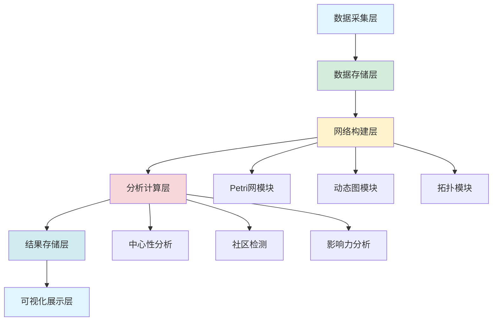

# 社会网络最佳实践指南 / Social Networks Best Practices Guide

## 📚 **概述 / Overview**

本文档提供社会网络分析、建模和应用的最佳实践指南，包括数据采集、网络构建、分析方法、结果解释和工程实践。

**适用对象**: 数据科学家、系统工程师、社交平台开发者

---

## 📋 **目录 / Table of Contents**

- [社会网络最佳实践指南 / Social Networks Best Practices Guide](#社会网络最佳实践指南--social-networks-best-practices-guide)
  - [📚 **概述 / Overview**](#-概述--overview)
  - [📋 **目录 / Table of Contents**](#-目录--table-of-contents)
  - [📊 **一、数据采集最佳实践 / Part 1: Data Collection Best Practices**](#-一数据采集最佳实践--part-1-data-collection-best-practices)
    - [1.1 数据源选择](#11-数据源选择)
    - [1.2 数据质量保证](#12-数据质量保证)
    - [1.3 隐私保护](#13-隐私保护)
  - [🔧 **二、网络构建最佳实践 / Part 2: Network Construction Best Practices**](#-二网络构建最佳实践--part-2-network-construction-best-practices)
    - [2.1 节点定义](#21-节点定义)
    - [2.2 边定义](#22-边定义)
    - [2.3 权重设置](#23-权重设置)
    - [2.4 时间维度处理](#24-时间维度处理)
  - [📈 **三、分析方法最佳实践 / Part 3: Analysis Method Best Practices**](#-三分析方法最佳实践--part-3-analysis-method-best-practices)
    - [3.1 中心性分析实践](#31-中心性分析实践)
    - [3.2 社区检测实践](#32-社区检测实践)
    - [3.3 影响力分析实践](#33-影响力分析实践)
    - [3.4 异常检测实践](#34-异常检测实践)
  - [🎯 **四、理论选择最佳实践 / Part 4: Theory Selection Best Practices**](#-四理论选择最佳实践--part-4-theory-selection-best-practices)
    - [4.1 Petri网选择场景](#41-petri网选择场景)
    - [4.2 动态图论选择场景](#42-动态图论选择场景)
    - [4.3 拓扑模型选择场景](#43-拓扑模型选择场景)
    - [4.4 混合方法实践](#44-混合方法实践)
  - [💻 **五、工程实践最佳实践 / Part 5: Engineering Best Practices**](#-五工程实践最佳实践--part-5-engineering-best-practices)
    - [5.1 性能优化](#51-性能优化)
    - [5.2 可扩展性设计](#52-可扩展性设计)
    - [5.3 系统架构](#53-系统架构)
    - [5.4 监控与运维](#54-监控与运维)
  - [🔍 **六、结果解释最佳实践 / Part 6: Result Interpretation Best Practices**](#-六结果解释最佳实践--part-6-result-interpretation-best-practices)
    - [6.1 统计显著性检验](#61-统计显著性检验)
    - [6.2 结果可视化](#62-结果可视化)
    - [6.3 业务解释](#63-业务解释)
  - [📚 **七、参考文档 / Part 7: Reference Documents**](#-七参考文档--part-7-reference-documents)
    - [7.1 核心文档](#71-核心文档)
    - [7.2 理论关系文档](#72-理论关系文档)
    - [7.3 应用模式文档](#73-应用模式文档)

---

## 📊 **一、数据采集最佳实践 / Part 1: Data Collection Best Practices**

### 1.1 数据源选择

**数据源类型**:

| 数据源 | 优势 | 劣势 | 适用场景 |
|--------|------|------|---------|
| **API数据** | 结构化、实时 | 限制、成本 | 社交媒体分析 |
| **爬虫数据** | 灵活、全面 | 法律风险、技术复杂 | 公开数据采集 |
| **内部数据** | 完整、可控 | 隐私限制 | 企业内部分析 |
| **合成数据** | 可控、隐私安全 | 真实性 | 算法测试 |

**最佳实践**:

1. **API优先**: 优先使用官方API，遵守使用条款
2. **数据采样**: 大规模数据使用采样策略
3. **数据验证**: 验证数据完整性和一致性
4. **版本控制**: 记录数据采集时间和版本

### 1.2 数据质量保证

**数据质量检查清单**:

- ✅ **完整性**: 检查缺失值和空值
- ✅ **一致性**: 验证数据格式和类型
- ✅ **准确性**: 验证数据真实性
- ✅ **时效性**: 确保数据时间戳正确
- ✅ **唯一性**: 检查重复数据

**数据清洗流程**:

```python
import pandas as pd
import networkx as nx

def data_quality_check(edges_df):
    """
    数据质量检查

    参数:
        edges_df: 边数据DataFrame

    返回:
        dict: 质量报告
    """
    report = {}

    # 检查缺失值
    report['missing_values'] = edges_df.isnull().sum().to_dict()

    # 检查重复边
    report['duplicate_edges'] = edges_df.duplicated().sum()

    # 检查自环
    self_loops = (edges_df['source'] == edges_df['target']).sum()
    report['self_loops'] = self_loops

    # 检查数据类型
    report['data_types'] = edges_df.dtypes.to_dict()

    return report
```

### 1.3 隐私保护

**隐私保护措施**:

1. **数据匿名化**: 移除个人标识信息
2. **差分隐私**: 使用差分隐私技术
3. **访问控制**: 限制数据访问权限
4. **数据脱敏**: 敏感信息脱敏处理

**合规要求**:

- GDPR（欧盟）
- CCPA（加州）
- 中国《个人信息保护法》

---

## 🔧 **二、网络构建最佳实践 / Part 2: Network Construction Best Practices**

### 2.1 节点定义

**节点定义原则**:

1. **明确性**: 节点定义必须明确，避免歧义
2. **一致性**: 同一分析中节点定义保持一致
3. **粒度选择**: 根据分析目标选择合适的粒度

**节点类型**:

| 节点类型 | 定义 | 适用场景 |
|---------|------|---------|
| **用户节点** | 个人用户 | 社交网络分析 |
| **内容节点** | 帖子、文章 | 内容传播分析 |
| **组织节点** | 公司、机构 | 组织网络分析 |
| **混合节点** | 多种类型 | 异质网络分析 |

### 2.2 边定义

**边定义原则**:

1. **关系明确**: 边必须代表明确的社会关系
2. **方向性**: 明确边是否有向
3. **权重设置**: 根据关系强度设置权重

**边类型**:

| 边类型 | 定义 | 权重含义 |
|--------|------|---------|
| **关注关系** | 有向边 | 关注强度 |
| **互动关系** | 无向边 | 互动频率 |
| **相似关系** | 无向边 | 相似度 |
| **时间关系** | 有向边 | 时间顺序 |

### 2.3 权重设置

**权重计算方法**:

1. **频率权重**: 基于互动频率
2. **时间权重**: 基于时间衰减
3. **相似度权重**: 基于特征相似度
4. **组合权重**: 多种因素组合

**权重归一化**:

```python
import networkx as nx

def normalize_edge_weights(graph, method='max'):
    """
    归一化边权重

    参数:
        graph: NetworkX图对象
        method: 归一化方法（'max', 'sum', 'min-max'）

    返回:
        NetworkX图对象
    """
    if method == 'max':
        max_weight = max(d['weight'] for u, v, d in graph.edges(data=True) if 'weight' in d)
        if max_weight > 0:
            for u, v, d in graph.edges(data=True):
                if 'weight' in d:
                    d['weight'] /= max_weight
    # 其他归一化方法...

    return graph
```

### 2.4 时间维度处理

**时间维度处理策略**:

1. **快照序列**: 按时间切片创建网络快照
2. **时间窗口**: 使用滑动时间窗口
3. **时间衰减**: 应用时间衰减函数
4. **累积网络**: 累积历史关系

**时间网络构建**:

```python
import networkx as nx
from datetime import datetime, timedelta

def build_temporal_network(events, time_window=timedelta(days=1)):
    """
    构建时序网络

    参数:
        events: 事件列表（包含时间戳）
        time_window: 时间窗口

    返回:
        list: 网络快照序列
    """
    snapshots = []
    current_time = min(event['time'] for event in events)
    end_time = max(event['time'] for event in events)

    while current_time <= end_time:
        window_end = current_time + time_window
        window_events = [
            e for e in events
            if current_time <= e['time'] < window_end
        ]

        G = nx.Graph()
        for event in window_events:
            G.add_edge(event['source'], event['target'])

        snapshots.append(G)
        current_time = window_end

    return snapshots
```

---

## 📈 **三、分析方法最佳实践 / Part 3: Analysis Method Best Practices**

### 3.1 中心性分析实践

**中心性选择指南**:

| 分析目标 | 推荐中心性 | 理由 |
|---------|----------|------|
| **识别高连接用户** | 度中心性 | 简单快速 |
| **识别关键中介** | 介数中心性 | 路径分析 |
| **识别网络中心** | 接近中心性 | 距离分析 |
| **识别影响力节点** | 特征向量中心性 | 邻居重要性 |

**实践建议**:

1. **多指标结合**: 使用多个中心性指标综合分析
2. **归一化处理**: 确保不同网络间可比较
3. **阈值设置**: 根据业务需求设置阈值
4. **可视化展示**: 使用可视化展示中心性分布

### 3.2 社区检测实践

**算法选择指南**:

| 网络规模 | 推荐算法 | 理由 |
|---------|---------|------|
| **小规模（<10K节点）** | 谱聚类 | 精确度高 |
| **中规模（10K-1M节点）** | Louvain | 速度和质量平衡 |
| **大规模（>1M节点）** | Leiden | 高质量保证 |
| **实时分析** | 标签传播 | 速度快 |

**实践建议**:

1. **参数调优**: 根据网络特征调整算法参数
2. **质量评估**: 使用模块度等指标评估社区质量
3. **结果验证**: 通过业务知识验证社区合理性
4. **演化追踪**: 追踪社区的时间演化

### 3.3 影响力分析实践

**传播模型选择**:

| 场景 | 推荐模型 | 理由 |
|------|---------|------|
| **信息传播** | 独立级联模型 | 简单有效 |
| **意见传播** | 线性阈值模型 | 考虑阈值 |
| **病毒传播** | SIR模型 | 生物学基础 |

**实践建议**:

1. **参数估计**: 从历史数据估计传播参数
2. **蒙特卡洛模拟**: 使用多次模拟提高准确性
3. **敏感性分析**: 分析参数对结果的影响
4. **实时更新**: 根据新数据更新模型

### 3.4 异常检测实践

**异常检测方法**:

| 异常类型 | 检测方法 | 理论基础 |
|---------|---------|---------|
| **异常节点** | 中心性异常 | 统计方法 |
| **异常边** | 链接预测 | 机器学习 |
| **异常社区** | 拓扑异常 | 拓扑模型 |
| **异常模式** | 行为模式 | Petri网 |

**实践建议**:

1. **基线建立**: 建立正常行为基线
2. **阈值设置**: 基于统计方法设置阈值
3. **多方法结合**: 使用多种方法交叉验证
4. **实时监控**: 建立实时异常检测系统

---

## 🎯 **四、理论选择最佳实践 / Part 4: Theory Selection Best Practices**

### 4.1 Petri网选择场景

**适用场景**:

- ✅ 需要形式化验证用户行为流程
- ✅ 需要分析协作工作流
- ✅ 需要建模信息传播状态转换
- ✅ 需要验证系统安全性

**实践案例**:

- **GitHub Pull Request流程**: 使用Petri网建模PR状态转换
- **在线文档协作**: 使用Petri网分析协作流程
- **推荐系统**: 使用Petri网建模用户转化漏斗

### 4.2 动态图论选择场景

**适用场景**:

- ✅ 大规模网络实时分析（>10⁶节点）
- ✅ 社区演化追踪
- ✅ 影响力传播分析
- ✅ 时序网络分析

**实践案例**:

- **Twitter网络分析**: 使用动态图分析信息传播
- **Facebook社区检测**: 使用Louvain算法检测社区
- **LinkedIn职业网络**: 使用动态图分析职业关系

### 4.3 拓扑模型选择场景

**适用场景**:

- ✅ 网络结构稳定性分析
- ✅ 异常用户群体检测
- ✅ 高维特征空间分析
- ✅ 结构洞识别

**实践案例**:

- **社交网络异常检测**: 使用持续同调检测异常
- **网络结构分析**: 使用拓扑特征分析网络形状
- **特征空间分析**: 使用TDA分析用户特征

### 4.4 混合方法实践

**混合策略**:

1. **Petri网 + 动态图**: 流程建模 + 网络分析
2. **动态图 + 拓扑**: 网络分析 + 结构特征
3. **Petri网 + 拓扑**: 流程建模 + 异常检测

**实践建议**:

1. **分阶段应用**: 不同阶段使用不同理论
2. **结果整合**: 整合不同方法的结果
3. **交叉验证**: 使用多种方法验证结果

---

## 💻 **五、工程实践最佳实践 / Part 5: Engineering Best Practices**

### 5.1 性能优化

**优化策略**:

1. **算法选择**: 根据规模选择合适算法
2. **并行计算**: 使用多线程/多进程
3. **增量计算**: 使用增量算法
4. **缓存策略**: 缓存中间结果

**性能优化示例**:

```python
import networkx as nx
from multiprocessing import Pool

def parallel_centrality(graph, n_processes=4):
    """
    并行计算中心性

    参数:
        graph: NetworkX图对象
        n_processes: 进程数

    返回:
        dict: 中心性值
    """
    nodes = list(graph.nodes())
    chunk_size = len(nodes) // n_processes

    def compute_chunk(chunk_nodes):
        subgraph = graph.subgraph(chunk_nodes)
        return nx.degree_centrality(subgraph)

    chunks = [nodes[i:i+chunk_size] for i in range(0, len(nodes), chunk_size)]

    with Pool(n_processes) as pool:
        results = pool.map(compute_chunk, chunks)

    # 合并结果
    centrality = {}
    for result in results:
        centrality.update(result)

    return centrality
```

### 5.2 可扩展性设计

**可扩展性策略**:

1. **分布式计算**: 使用Spark、GraphX等
2. **流式处理**: 使用Flink、Kafka等
3. **图数据库**: 使用Neo4j等图数据库
4. **微服务架构**: 模块化设计

### 5.3 系统架构

**推荐架构**:



### 5.4 监控与运维

**监控指标**:

- 数据采集速率
- 网络构建时间
- 分析计算时间
- 系统资源使用
- 结果准确性

**运维实践**:

1. **日志记录**: 详细记录操作日志
2. **错误处理**: 完善的错误处理机制
3. **性能监控**: 实时性能监控
4. **告警机制**: 异常情况告警

---

## 🔍 **六、结果解释最佳实践 / Part 6: Result Interpretation Best Practices**

### 6.1 统计显著性检验

**显著性检验方法**:

1. **随机网络对比**: 与随机网络对比
2. **零模型检验**: 使用零模型检验
3. **Bootstrap方法**: 使用Bootstrap估计置信区间

### 6.2 结果可视化

**可视化最佳实践**:

1. **选择合适的可视化**: 根据数据类型选择
2. **交互式可视化**: 提供交互功能
3. **多维度展示**: 展示多个维度
4. **清晰标注**: 清晰的标签和说明

### 6.3 业务解释

**业务解释原则**:

1. **可理解性**: 用业务语言解释结果
2. **可操作性**: 提供可操作的建议
3. **可验证性**: 结果可验证
4. **可追踪性**: 结果可追踪到数据

---

## 📚 **七、参考文档 / Part 7: Reference Documents**

### 7.1 核心文档

- **[社会网络基础](01-社会网络基础.md)** - 基本概念和理论
- **[网络分析](02-网络分析.md)** - 分析方法和工具
- **[算法实现指南](算法实现指南.md)** - 算法实现细节

### 7.2 理论关系文档

- **[社会网络模块理论关系梳理](../12-理论关系与认知框架/01-理论逻辑脉络/10-社会网络模块理论关系梳理.md)** - 与三大理论的关系

### 7.3 应用模式文档

- **[社会网络应用模式清单](../13-应用模式归纳/10-社会网络应用模式/社会网络应用模式清单.md)** - 应用模式归纳

---

**文档版本**: v1.0
**创建时间**: 2025年1月
**最后更新**: 2025年1月
**维护者**: GraphNetWorkCommunicate项目组
**状态**: ✅ 完成
