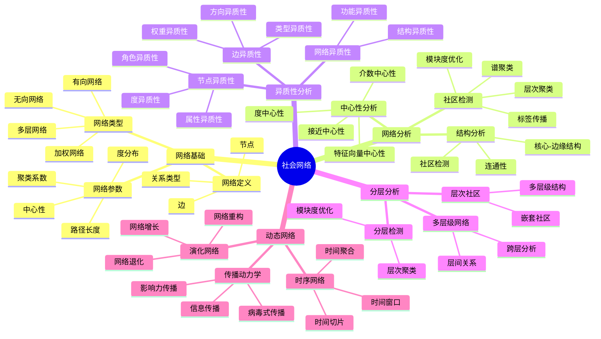
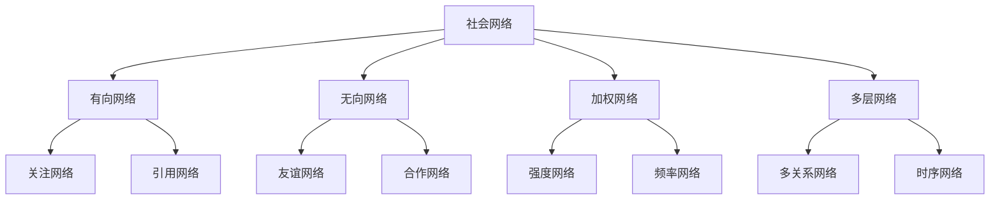
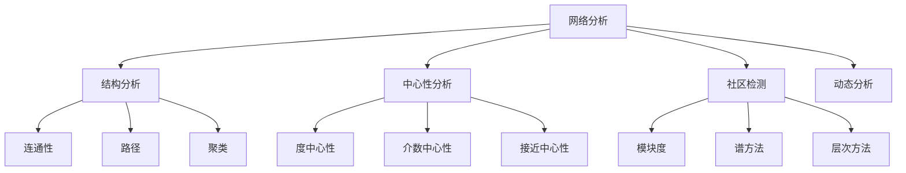
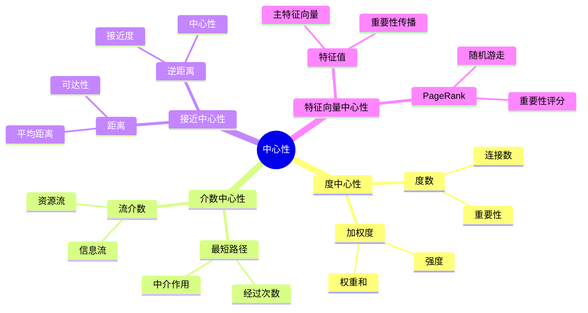
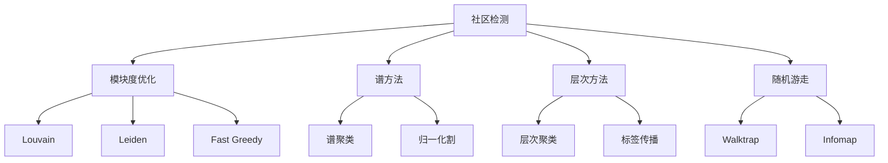
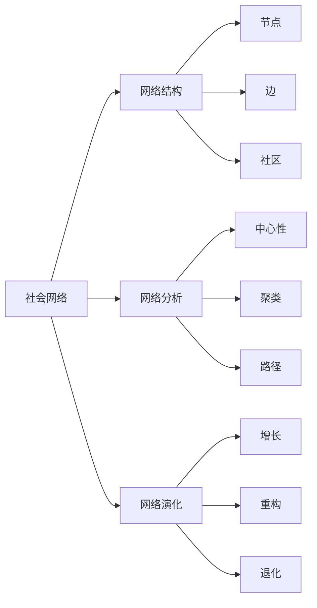
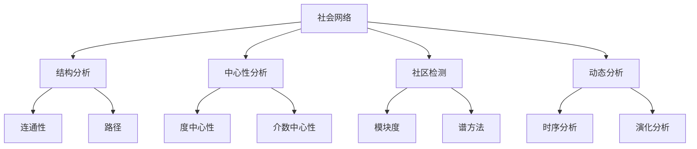
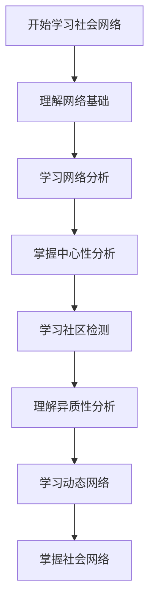
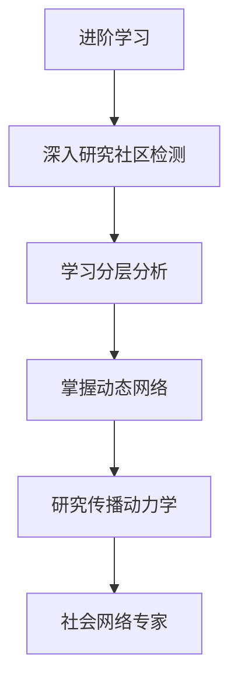

# 社会网络模块知识结构思维导图 / Social Networks Module Knowledge Structure Mind Map

## 📚 **概述 / Overview**

本文档提供社会网络模块的完整知识结构思维导图，帮助理解社会网络知识的层次结构和相互关系。

**创建时间**: 2025年1月
**模块**: 社会网络
**状态**: 🚀 持续更新中

---

## 🗺️ **一、整体知识结构 / Overall Knowledge Structure**

---

## 📊 **二、核心概念层次结构 / Core Concept Hierarchy**

### 2.1 网络类型层次

### 2.2 分析方法层次

---

## 🔬 **三、中心性分析结构 / Centrality Analysis Structure**

### 3.1 中心性类型

### 3.2 中心性方法对比

| 中心性类型 | 定义 | 复杂度 | 适用场景 | 特点 |
|-----------|------|--------|---------|------|
| **度中心性** | 连接数 | $O(V+E)$ | 局部重要性 | 简单、快速 |
| **介数中心性** | 最短路径经过次数 | $O(V \cdot E)$ | 中介作用 | 全局视角 |
| **接近中心性** | 平均距离的倒数 | $O(V \cdot E)$ | 可达性 | 全局视角 |
| **特征向量中心性** | 主特征向量 | $O(V^2)$ | 重要性传播 | 考虑邻居重要性 |

---

## 📐 **四、社区检测方法结构 / Community Detection Method Structure**

### 4.1 检测方法分类

### 4.2 检测方法对比

| 方法 | 原理 | 复杂度 | 适用场景 | 特点 |
|------|------|--------|---------|------|
| **Louvain** | 模块度优化 | $O(V \log V)$ | 大规模网络 | 快速、高效 |
| **谱聚类** | 谱分解 | $O(V^3)$ | 小规模网络 | 理论保证 |
| **标签传播** | 标签传播 | $O(E)$ | 大规模网络 | 快速、简单 |
| **Walktrap** | 随机游走 | $O(V^2 \log V)$ | 中等规模 | 基于距离 |

---

## 🔗 **五、知识关联网络 / Knowledge Association Network**

### 5.1 概念关联图

### 5.2 方法关联图

---

## 📚 **六、学习路径 / Learning Path**

### 6.1 基础学习路径

### 6.2 进阶学习路径

---

## 🎯 **七、应用领域映射 / Application Domain Mapping**

### 7.1 应用领域

| 社会网络概念 | 应用领域 | 具体应用 |
|------------|---------|---------|
| **社区检测** | 社交网络 | 用户分组、推荐系统 |
| **中心性分析** | 影响力分析 | 关键人物识别、意见领袖 |
| **传播动力学** | 信息传播 | 谣言传播、病毒式营销 |
| **异质性分析** | 精准营销 | 用户画像、个性化推荐 |

---

## 📋 **八、知识检查清单 / Knowledge Checklist**

### 8.1 基础概念

- [ ] 理解社会网络的定义和类型
- [ ] 掌握网络参数（度、聚类、路径）
- [ ] 理解网络结构（连通性、社区）
- [ ] 掌握网络表示方法

### 8.2 网络分析

- [ ] 理解结构分析方法
- [ ] 掌握中心性分析方法
- [ ] 了解社区检测方法
- [ ] 理解分析方法选择

### 8.3 异质性分析

- [ ] 理解节点异质性
- [ ] 掌握边异质性
- [ ] 了解网络异质性
- [ ] 理解异质性应用

### 8.4 动态网络

- [ ] 理解时序网络
- [ ] 掌握演化网络
- [ ] 了解传播动力学
- [ ] 理解动态网络应用

---

## 🔗 **相关链接 / Related Links**

- [社会网络README](README.md)
- [社会网络基础](01-社会网络基础.md)
- [网络分析](02-网络分析.md)
- [异质性与分层分析](03-异质性与分层分析.md)
- [思维表征工具](思维表征工具-社会网络.md)

---

**文档版本**: v1.0
**创建时间**: 2025年1月
**最后更新**: 2025年1月
**维护者**: GraphNetWorkCommunicate项目组
