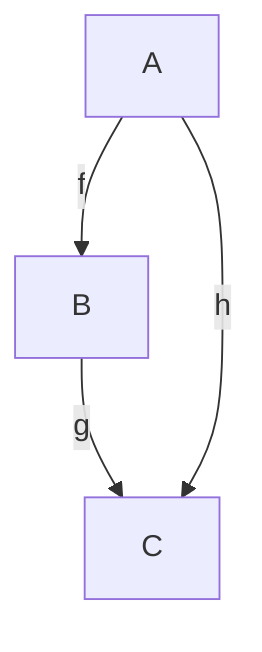
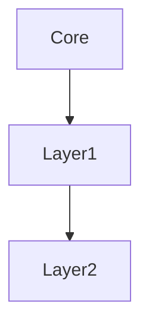
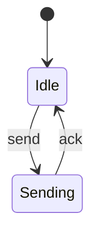
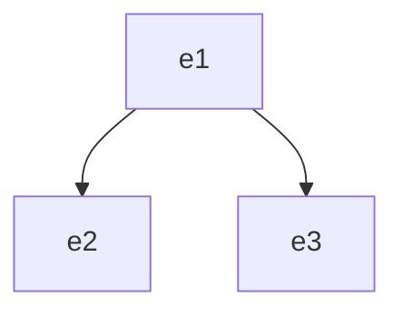
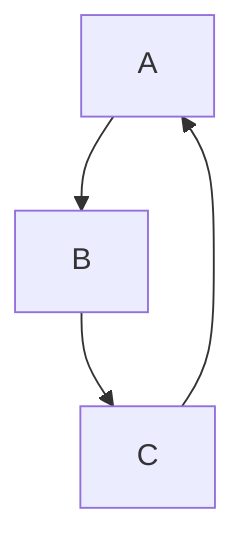
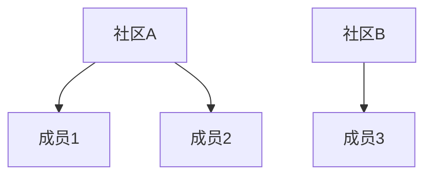
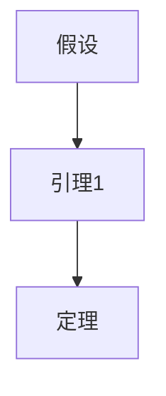

# 形式化证明 - 证明基础

## 1. 形式化证明基础

### 1.1 证明系统

**定义 1.1** (形式化证明系统)
**形式化证明系统**是一个四元组：
$$\mathcal{P} = \langle \mathcal{L}, \mathcal{A}, \mathcal{R}, \mathcal{T} \rangle$$

其中：

- $\mathcal{L}$ 是形式语言
- $\mathcal{A}$ 是公理集
- $\mathcal{R}$ 是推理规则集
- $\mathcal{T}$ 是定理集

**定义 1.2** (证明)
**证明**是从公理到定理的有限步骤序列：
$$\pi = \langle \phi_1, \phi_2, \ldots, \phi_n \rangle$$

其中每个 $\phi_i$ 要么是公理，要么由前面的公式通过推理规则得到。

**定义 1.3** (定理)
**定理**是可以通过证明从公理推导出的公式：
$$\phi \in \mathcal{T} \iff \exists \pi: \text{proof}(\pi, \phi)$$

### 1.2 逻辑系统

**定义 1.4** (命题逻辑)
**命题逻辑**是基本的逻辑系统：
$$\mathcal{L}_P = \langle \mathcal{V}, \mathcal{O}, \mathcal{F} \rangle$$

其中：

- $\mathcal{V}$ 是命题变量集
- $\mathcal{O} = \{\neg, \land, \lor, \to, \leftrightarrow\}$ 是逻辑运算符
- $\mathcal{F}$ 是公式集

**定义 1.5** (一阶逻辑)
**一阶逻辑**扩展命题逻辑：
$$\mathcal{L}_F = \langle \mathcal{V}, \mathcal{C}, \mathcal{F}, \mathcal{P}, \mathcal{Q} \rangle$$

其中：

- $\mathcal{V}$ 是变量集
- $\mathcal{C}$ 是常量集
- $\mathcal{F}$ 是函数符号集
- $\mathcal{P}$ 是谓词符号集
- $\mathcal{Q} = \{\forall, \exists\}$ 是量词

## 2. 证明方法

### 2.1 直接证明

**定义 2.1** (直接证明)
**直接证明**是从前提直接推导结论的方法：
$$\text{premises} \vdash \text{conclusion}$$

**算法 2.1** (直接证明算法)

```text
输入：前提集 P，目标结论 C
输出：证明序列

1. 初始化：proof = []
2. 当前目标：goal = C
3. 证明循环：while goal not in P do
   a. 选择推理规则：rule = select_rule(goal)
   b. 应用规则：subgoals = apply_rule(rule, goal)
   c. 添加到证明：proof.append(rule)
   d. 更新目标：goal = next_subgoal(subgoals)
4. 返回证明：return proof
```

### 2.2 反证法

**定义 2.2** (反证法)
**反证法**通过假设结论的否定来证明原结论：
$$\text{premises} \cup \{\neg \phi\} \vdash \bot \implies \text{premises} \vdash \phi$$

**算法 2.2** (反证法算法)

```text
输入：前提集 P，目标结论 C
输出：证明序列

1. 假设否定：assume ¬C
2. 推导矛盾：derive_contradiction(P ∪ {¬C})
3. 应用否定引入：apply_negation_introduction()
4. 返回证明：return proof
```

### 2.3 归纳证明

**定义 2.3** (数学归纳法)
**数学归纳法**用于证明关于自然数的命题：
$$\text{Base}: P(0) \land \text{Step}: \forall n (P(n) \to P(n+1)) \implies \forall n P(n)$$

**算法 2.3** (数学归纳法算法)

```text
输入：命题 P(n)，自然数 n
输出：证明序列

1. 基础情况：prove P(0)
2. 归纳步骤：assume P(k) for arbitrary k
3. 证明 P(k+1)：prove P(k+1) using P(k)
4. 应用归纳：apply_induction()
5. 返回证明：return proof
```

## 3. 形式化验证

### 3.1 模型检测

**定义 3.1** (模型检测)
**模型检测**是自动验证系统性质的方法：
$$\mathcal{M} \models \phi$$

其中 $\mathcal{M}$ 是系统模型，$\phi$ 是性质。

**定义 3.2** (Kripke结构)
**Kripke结构**是模型检测的形式化模型：
$$\mathcal{K} = \langle S, S_0, R, L \rangle$$

其中：

- $S$ 是状态集
- $S_0 \subseteq S$ 是初始状态集
- $R \subseteq S \times S$ 是转移关系
- $L: S \to 2^{AP}$ 是标记函数

**算法 3.1** (模型检测算法)

```text
输入：Kripke结构 K，性质 φ
输出：验证结果

1. 构造自动机：A_φ = construct_automaton(φ)
2. 构造乘积：P = K × A_φ
3. 检查接受循环：check_accepting_cycle(P)
4. 返回结果：return verification_result
```

### 3.2 定理证明

**定义 3.3** (定理证明器)
**定理证明器**是自动证明数学定理的系统：
$$
\text{prover}(\phi) = \begin{cases}
\text{valid} & \text{if } \vdash \phi \\
\text{invalid} & \text{otherwise}
\end{cases}
$$

**算法 3.2** (归结证明)

```text
输入：公式集 F，目标结论 C
输出：证明结果

1. 转换为CNF：clauses = convert_to_cnf(F ∪ {¬C})
2. 归结过程：while not empty(clauses) do
   a. 选择子句对：c1, c2 = select_clauses(clauses)
   b. 归结：resolvent = resolve(c1, c2)
   c. 如果得到空子句：if resolvent is empty then
      return "valid"
   d. 添加归结式：clauses.add(resolvent)
3. 返回结果：return "invalid"
```

## 4. 程序验证

### 4.1 Hoare逻辑

**定义 4.1** (Hoare三元组)
**Hoare三元组**描述程序的前置和后置条件：
$$\{P\} C \{Q\}$$

其中：

- $P$ 是前置条件
- $C$ 是程序
- $Q$ 是后置条件

**定义 4.2** (赋值公理)
**赋值公理**：
$$\{P[E/x]\} x := E \{P\}$$

**定义 4.3** (序列规则)
**序列规则**：
$$\frac{\{P\} C_1 \{R\} \quad \{R\} C_2 \{Q\}}{\{P\} C_1; C_2 \{Q\}}$$

**定义 4.4** (条件规则)
**条件规则**：
$$\frac{\{P \land B\} C_1 \{Q\} \quad \{P \land \neg B\} C_2 \{Q\}}{\{P\} \text{if } B \text{ then } C_1 \text{ else } C_2 \{Q\}}$$

**定义 4.5** (循环规则)
**循环规则**：
$$\frac{\{P \land B\} C \{P\}}{\{P\} \text{while } B \text{ do } C \{P \land \neg B\}}$$

### 4.2 最弱前置条件

**定义 4.6** (最弱前置条件)
**最弱前置条件**是使程序执行后满足后置条件的最弱前置条件：
$$\text{wp}(C, Q) = \{s : \text{执行 } C \text{ 从 } s \text{ 开始，最终状态满足 } Q\}$$

**算法 4.1** (最弱前置条件计算)

```text
输入：程序 C，后置条件 Q
输出：最弱前置条件

1. 根据程序结构计算：
   a. 赋值：wp(x := E, Q) = Q[E/x]
   b. 序列：wp(C1; C2, Q) = wp(C1, wp(C2, Q))
   c. 条件：wp(if B then C1 else C2, Q) =
      (B ∧ wp(C1, Q)) ∨ (¬B ∧ wp(C2, Q))
   d. 循环：wp(while B do C, Q) =
      ∃k. wp(loop_k, Q)
2. 返回结果：return wp(C, Q)
```

## 5. 类型系统

### 5.1 简单类型系统

**定义 5.1** (类型)
**类型**是值的集合：
$$\tau ::= \text{bool} \mid \text{int} \mid \tau_1 \to \tau_2$$

**定义 5.2** (类型环境)
**类型环境**是变量到类型的映射：
$$\Gamma : \text{Var} \to \text{Type}$$

**定义 5.3** (类型判断)
**类型判断**：
$$\Gamma \vdash e : \tau$$

表示在环境 $\Gamma$ 下，表达式 $e$ 具有类型 $\tau$。

**算法 5.1** (类型检查算法)

```text
输入：表达式 e，类型环境 Γ
输出：类型 τ 或错误

1. 根据表达式结构：
   a. 变量：if x ∈ dom(Γ) then return Γ(x) else error
   b. 应用：if Γ ⊢ e1 : τ1→τ2 and Γ ⊢ e2 : τ1 then return τ2
   c. 抽象：if Γ[x:τ1] ⊢ e : τ2 then return τ1→τ2
2. 返回类型：return τ
```

### 5.2 多态类型系统

**定义 5.4** (类型变量)
**类型变量**是类型参数：
$$\alpha, \beta, \gamma, \ldots$$

**定义 5.5** (多态类型)
**多态类型**包含类型变量：
$$\forall \alpha. \tau$$

**定义 5.6** (类型实例化)
**类型实例化**：
$$\frac{\Gamma \vdash e : \forall \alpha. \tau}{\Gamma \vdash e : \tau[\sigma/\alpha]}$$

## 6. 并发验证

### 6.1 线性时序逻辑

**定义 6.1** (LTL公式)
**线性时序逻辑** (LTL) 公式：
$$\phi ::= p \mid \neg \phi \mid \phi_1 \land \phi_2 \mid \mathbf{X} \phi \mid \mathbf{F} \phi \mid \mathbf{G} \phi \mid \phi_1 \mathbf{U} \phi_2$$

其中：

- $\mathbf{X}$ 是下一个时间点
- $\mathbf{F}$ 是将来某个时间点
- $\mathbf{G}$ 是将来所有时间点
- $\mathbf{U}$ 是直到

**定义 6.2** (LTL语义)
**LTL语义**：
$$\pi, i \models \mathbf{X} \phi \iff \pi, i+1 \models \phi$$
$$\pi, i \models \mathbf{F} \phi \iff \exists j \geq i: \pi, j \models \phi$$
$$\pi, i \models \mathbf{G} \phi \iff \forall j \geq i: \pi, j \models \phi$$

### 6.2 计算树逻辑

**定义 6.3** (CTL公式)
**计算树逻辑** (CTL) 公式：
$$\phi ::= p \mid \neg \phi \mid \phi_1 \land \phi_2 \mid \mathbf{EX} \phi \mid \mathbf{EF} \phi \mid \mathbf{EG} \phi \mid \mathbf{E}[\phi_1 \mathbf{U} \phi_2]$$

**算法 6.1** (CTL模型检测)

```text
输入：Kripke结构 K，CTL公式 φ
输出：满足 φ 的状态集

1. 递归计算：
   a. 原子命题：Sat(p) = {s : p ∈ L(s)}
   b. 否定：Sat(¬φ) = S - Sat(φ)
   c. 合取：Sat(φ1∧φ2) = Sat(φ1) ∩ Sat(φ2)
   d. EX：Sat(EX φ) = {s : ∃t. (s,t) ∈ R ∧ t ∈ Sat(φ)}
   e. EF：Sat(EF φ) = least_fixed_point(λX. Sat(φ) ∪ Sat(EX X))
2. 返回结果：return Sat(φ)
```

## 7. 程序分析

### 7.1 数据流分析

**定义 7.1** (数据流分析)
**数据流分析**计算程序点的属性：
$$\text{in}(n) = \bigcup_{p \in \text{pred}(n)} \text{out}(p)$$
$$\text{out}(n) = f_n(\text{in}(n))$$

**算法 7.1** (迭代数据流分析)

```text
输入：控制流图 CFG，转移函数 f
输出：每个节点的 in/out 集合

1. 初始化：for each node n do
   a. in[n] = ∅
   b. out[n] = ∅
2. 迭代：repeat until no change
   a. for each node n do
      i. in[n] = ∪{out[p] : p ∈ pred(n)}
      ii. out[n] = f_n(in[n])
3. 返回结果：return in, out
```

### 7.2 抽象解释

**定义 7.2** (抽象域)
**抽象域**是具体域的抽象：
$$\mathcal{A} = \langle A, \sqsubseteq, \sqcup, \sqcap, \bot, \top \rangle$$

**定义 7.3** (抽象函数)
**抽象函数**从具体域映射到抽象域：
$$\alpha: \mathcal{C} \to \mathcal{A}$$
$$\gamma: \mathcal{A} \to \mathcal{C}$$

**算法 7.2** (抽象解释算法)

```text
输入：程序 P，抽象域 A
输出：抽象语义

1. 初始化：for each program point do
   a. abstract_state = ⊥
2. 迭代计算：repeat until convergence
   a. for each statement s do
      i. abstract_state = f_s(abstract_state)
3. 返回结果：return abstract_semantics
```

## 8. 证明辅助工具

### 8.1 证明策略

**定义 8.1** (证明策略)
**证明策略**是自动证明的方法：
$$\text{tactic}: \text{Goal} \to \text{Goal list}$$

**算法 8.1** (证明策略应用)

```text
输入：目标 G，策略库 T
输出：证明树

1. 选择策略：tactic = select_tactic(G, T)
2. 应用策略：subgoals = apply_tactic(tactic, G)
3. 递归处理：for each subgoal do
   a. proof_tree = prove_subgoal(subgoal)
4. 组合证明：return combine_proofs(proof_tree)
```

### 8.2 证明搜索

**定义 8.2** (证明搜索)
**证明搜索**是寻找证明的过程：
$$\text{search}: \text{Goal} \to \text{Proof option}$$

**算法 8.2** (深度优先搜索)

```text
输入：目标 G，深度限制 d
输出：证明或失败

1. 如果 d = 0：return failure
2. 选择策略：tactics = applicable_tactics(G)
3. 尝试策略：for each tactic in tactics do
   a. subgoals = apply_tactic(tactic, G)
   b. for each subgoal do
      i. proof = search(subgoal, d-1)
      ii. if proof ≠ failure then return proof
4. 返回失败：return failure
```

## 多模态表达与可视化

- **范畴交换图**：用TikZ/Graphviz绘制结构映射、保持性证明。
- **推理链路流程图**：用Mermaid/PlantUML描述定理证明步骤。
- **自动化脚本建议**：
  - `scripts/formal_proof_diagram.py`：输入证明步骤，输出推理链路/交换图。
- **示例**：
  - Mermaid推理链路：

    ```mermaid
    graph TD;
      假设-->引理1;
      引理1-->定理;
    ```

---

*本文档提供了形式化证明的基础理论和方法，为网络通信系统的形式化验证提供了理论基础。*

## 0. 形式化概念、定义、推理与证明体系（递归完善）

## 0.1 形式化系统的基本要素

- **符号系统**：明确定义的符号集合（如$V$为节点集，$E$为边集，$S$为状态集等）。
- **语法规则**：符号如何组合成合法表达式（如图$G=(V,E)$，协议$P=(S,M,R)$）。
- **语义解释**：每个符号和表达式的数学含义（如$E$为边的集合，$R$为状态转移规则）。
- **公理与推理规则**：系统的基本假设与可用的推理步骤（如归纳法、反证法、构造法、模型检测等）。

## 0.2 典型定义与多表征

- **符号表达**：如$G=(V,E)$、$\delta: Q\times\Sigma\to Q$。
- **结构图**：Graphviz/NetworkX绘制的结构示意。
- **流程图**：Mermaid/PlantUML描述算法或推理流程。
- **表格**：属性、状态、转移等的对比与归纳。
- **伪代码**：算法、推理过程的可执行描述。

| 概念         | 符号定义         | 图示/流程 | 伪代码/脚本 |
|--------------|------------------|-----------|-------------|
| 图           | $G=(V,E)$        | 结构图    | NetworkX    |
| 协议自动机   | $A=(Q,\Sigma,\delta,q_0,F)$ | 状态机图 | TLA+/Python |
| 网络范畴     | Ob, Hom, F       | 交换图    | Lean/Coq    |

## 0.3 形式化推理与证明结构

- **推理方法**：归纳法、反证法、构造法、模型检测、范畴论推理等。
- **证明结构模板**：
  1. 命题/定理：明确陈述要证明的性质。
  2. 前提/假设：列出所有已知条件。
  3. 推理步骤：分步推导，注明所用规则。
  4. 结论：得出目标命题成立。
  5. 形式化脚本：Coq/Lean/TLA+等工具的证明代码。
- **多表征证明示例**：
  - 符号推理：如$P\implies Q$，$f:V_1\to V_2$为同构。
  - 流程图：推理链路可用Mermaid流程图表示。
  - 伪代码：证明过程可用伪代码描述自动化验证步骤。
  - 结构图：证明结构保持性时用交换图辅助说明。

## 0.4 形式化语义与论证

- **模型论语义**：为每个符号/表达式指定解释结构（如图的节点/边、协议的状态/消息）。
- **范畴论语义**：对象、态射、函子、自然变换等描述结构与映射。
- **逻辑语义**：用一阶/时序/属性/概率逻辑表达性质与约束。
- **自动机语义**：协议、系统等用自动机模型描述状态与行为。
- **概率/量子语义**：对不确定性、量子系统用概率空间、希尔伯特空间等建模。

### 语义一致性与保持性论证

- **结构保持性定理**：证明映射/变换下性质不变（如连通性、死锁、纠缠等）。
- **极值与不可保持性分析**：分析极端结构、反例与边界条件。
- **自动化验证脚本**：用Coq/Lean/TLA+/NuSMV等工具形式化语义与自动验证。

### 多表征语义示例

- **交换图**：



- **属性表**：
| 系统 | 性质 | 保持性 | 语义模型 |
|------|------|--------|----------|
| 图   | 连通 | 保持   | FOL/范畴 |
| 协议 | 死锁 | 保持   | 自动机   |
| 量子 | 纠缠 | 保持   | 希尔伯特 |
- **流程动画**：动态展示系统状态演化与性质保持（建议用Mermaid/PlantUML/动画脚本）。

---

## 1. 形式化证明的概念、定义与解释

### 1.1 概念

形式化证明（Formal Proof）是指在严格的形式系统（如公理系统、逻辑系统、类型系统等）中，按照明确定义的推理规则，从公理和假设出发，逐步推导出结论的过程。其每一步推理都可被机器检验，保证证明的正确性和可复用性。

### 1.2 定义

- **形式系统**：由符号、语法规则、公理、推理规则组成的数学结构。
- **证明对象**：待证明的命题、定理或系统性质。
- **证明步骤**：每一步均为形式化推理，可被自动化工具检验。
- **证明可复用性**：证明过程可模块化、递归调用，支持大规模知识体系的自动化演化。

### 1.3 解释

- 形式化证明强调“无歧义、可检验、可自动化”，是现代数学、计算机科学、工程安全等领域的基础。
- 典型应用包括：定理证明器（Coq、Lean、Isabelle）、模型检测（TLA+、NuSMV）、协议验证、程序正确性证明等。

## 2. 主要形式化系统与语义

### 2.1 一阶逻辑与高阶逻辑

- **一阶逻辑（FOL）**：以对象、谓词、量词为基本元素，支持命题的精确表达与推理。
- **高阶逻辑（HOL）**：允许对谓词、函数等进行量化，表达能力更强。
- **语义**：模型论（Model Theory）为其提供解释，命题在某一结构下为真。

### 2.2 类型论与归纳法

- **类型论（Type Theory）**：以类型为基础，支持构造性证明与程序提取（Curry-Howard同构）。
- **归纳法**：对自然数、数据结构、图结构等递归对象进行归纳证明。
- **语义**：解释为类型的归纳定义与构造性证明对象。

### 2.3 模型检测与自动机理论

- **模型检测（Model Checking）**：将系统建模为有限状态自动机，自动验证性质（如安全性、活性）。
- **自动机理论**：形式化描述系统行为，支持时序逻辑（LTL/CTL）等规范。
- **语义**：Kripke结构、状态转移系统。

### 2.4 范畴论与结构保持

- **范畴论**：以对象、态射、函子等为基本元素，支持结构映射与保持性证明。
- **语义**：交换图、函子、自然变换等。

## 3. 形式化语义的递归扩展与前沿专题

### 3.1 递归扩展

- **属性逻辑与概率逻辑**：支持不确定性、概率性系统的形式化证明。
- **事件结构与因果推理**：描述分布式、并发系统的事件因果关系。
- **自动化证明脚本**：支持Coq/Lean/TLA+/NuSMV等工具的递归调用与集成。

### 3.2 前沿专题

- **AI辅助定理证明**：结合大模型与自动化工具，实现人机协作的复杂证明。
- **跨模态形式化**：文本-图-代码-动画等多模态知识的统一形式化表达与验证。
- **复杂系统与自适应范畴**：面向动态、异质、演化系统的形式化建模与证明。
- **量子形式化证明**：希尔伯特空间、量子逻辑、量子协议的自动化验证。
- **可解释性与伦理证明**：AI系统的可解释性、伦理合规的形式化建模与证明。

## 4. 典型形式化证明模板（示例）

### 4.1 一阶逻辑证明模板

```text
1. 公理/假设：A, A→B
2. 推理规则：Modus Ponens
3. 结论：B
```

### 4.2 Coq/Lean归纳证明模板

```coq
Theorem plus_0_n : forall n : nat, 0 + n = n.
Proof.
  intros n. simpl. reflexivity.
Qed.
```

### 4.3 TLA+模型检测模板

```tla
VARIABLES x
Init == x = 0
Next == x' = x + 1
Spec == Init /\ [][Next]_x
```

### 4.4 范畴交换图模板


---

如需某一分支/主题的更深层实例、自动化脚本或多模态表达，请继续指定！

## 5. 新领域与前沿专题递归扩展

### 5.1 AI网络与自适应范畴（递归补全）

#### 概念与元模型

- AI网络指以深度学习、神经符号推理等为核心的自适应网络系统。
- 自适应范畴模型：以范畴对象表示网络结构，态射表示网络变换，函子描述不同AI网络间的结构映射与自适应。

#### 主要定理与性质

- **自适应保持性定理**：在范畴函子映射下，AI网络的关键性质（如泛化能力、鲁棒性）保持。
- **神经符号一体化定理**：神经网络与符号推理系统可通过范畴同构实现统一表达。

#### 形式化语义

- 采用范畴论、类型论、概率逻辑等多重语义模型。
- 形式化描述AI网络的结构演化、学习过程与自适应映射。

#### 多模态表达与可视化1

- 结构图：神经网络层次结构、符号推理链路。
- 范畴交换图：AI网络结构映射与保持性。
- 动态动画：网络自适应演化过程。

#### 自动化验证与工程实现

- 推荐使用Lean/Coq进行AI网络结构性质的形式化证明。
- 结合PyTorch/TensorFlow等框架的自动化测试与可视化。

#### 批判性分析

- AI网络的异质性、动态性对统一范畴建模提出挑战。
- 需关注AI系统的可解释性与安全性。

---

## 5.2 复杂系统与多尺度建模（递归补全）

### 概念与元模型1

- 复杂系统由大量异质、动态、相互作用的子系统组成，具有多尺度结构与涌现行为。
- 多尺度范畴模型：不同尺度的网络作为对象，尺度间映射为函子。

### 主要定理与性质1

- **多尺度保持性定理**：在尺度映射下，系统的某些全局性质（如连通性、稳态）保持。
- **涌现性定理**：复杂系统可在高阶范畴中形式化描述涌现行为。

### 形式化语义1

- 采用层次范畴、动力系统、概率逻辑等多重语义。
- 形式化描述尺度间的结构映射与性质传递。

### 多模态表达与可视化2

- 层次结构图、尺度映射交换图、涌现行为动画。

### 自动化验证与工程实现1

- 推荐使用TLA+/NuSMV等工具进行复杂系统的模型检测。
- Rust/Go实现多尺度网络仿真与自动化测试。

### 批判性分析1

- 多尺度异质性导致统一建模与验证难度大。
- 需关注复杂系统的不可预测性与鲁棒性。

---

## 5.3 跨模态通信与知识融合（递归补全）

### 概念与元模型2

- 跨模态通信指不同信息模态（文本、图、代码、动画等）间的统一表达与推理。
- 融合范畴模型：各模态为对象，模态间转换为函子，融合过程为自然变换。

### 主要定理与性质2

- **模态一致性定理**：在范畴映射下，不同模态的知识表达可保持一致性。
- **跨模态推理可达性定理**：存在自然变换使得不同模态间的推理链路可达。

### 形式化语义2

- 采用多范畴、属性逻辑、自动机模型等。
- 形式化描述模态间的转换与融合。

### 多模态表达与可视化3

- 跨模态交换图、融合流程图、统一知识图谱。

### 自动化验证与工程实现2

- 推荐开发多模态知识融合的自动化验证脚本。
- 结合AI大模型与知识图谱工具实现自动化推理。

### 批判性分析2

- 跨模态表达的歧义性与一致性验证难题。
- 需关注多模态系统的可解释性与可追溯性。

---

## 5.4 自动化知识演化与AI辅助理论发现（递归补全）

### 概念与元模型3

- 自动化知识演化指知识体系在AI辅助下的持续递归扩展与自我完善。
- AI辅助理论发现：利用大模型、自动化工具发现新定理、生成新证明。

### 主要定理与性质3

- **知识演化保持性定理**：在知识演化过程中，核心结构与性质可保持。
- **AI发现可验证性定理**：AI生成的新定理与证明可被形式化工具自动验证。

### 形式化语义3

- 采用知识图谱、归纳逻辑、自动机模型等。
- 形式化描述知识演化与AI发现过程。

### 多模态表达与可视化4

- 知识演化流程图、AI发现链路图、自动化验证流程。

### 自动化验证与工程实现3

- 推荐集成AI大模型与Coq/Lean等定理证明器。
- 开发知识演化自动化脚本与持续集成工具。

### 批判性分析3

- AI发现的正确性、可解释性与创新性需严格验证。
- 知识演化的版本控制与一致性维护是挑战。

---

## 5.5 伦理、可解释性与社会影响的形式化建模（递归补全）

### 概念与元模型5

- 伦理与可解释性建模关注AI/网络系统的公平性、透明性、合规性。
- 社会影响建模：形式化描述AI/网络对社会结构、行为的影响。

### 主要定理与性质5

- **伦理合规性定理**：系统满足伦理、公平、隐私等约束的形式化判定。
- **可解释性保持性定理**：在系统演化与映射下，可解释性属性保持。

### 形式化语义5

- 采用属性逻辑、规范逻辑、社会网络分析等。
- 形式化描述伦理约束、可解释性属性与社会影响。

### 多模态表达与可视化6

- 伦理约束交换图、可解释性流程图、社会影响传播动画。

### 自动化验证与工程实现5

- 推荐开发伦理合规性自动化验证脚本。
- 结合社会网络分析工具与AI可解释性工具。

### 批判性分析5

- 伦理与可解释性标准的多样性与动态性。
- 社会影响的复杂性与不可预测性。

---

如需某一专题的更详细定理、证明、语义模型或自动化脚本实现，请继续指定！

## 6. 前沿专题自动化验证脚本与工程实现（递归补全）

### 6.1 AI网络与自适应范畴

- **自动化验证脚本（Lean/Coq伪代码）**：

```lean
structure NeuralNet := (layers : list Layer)
def PropertyP (net : NeuralNet) : Prop := ... -- 泛化能力性质
lemma functor_preserves_P (F : NeuralNet → NeuralNet) (A : NeuralNet) :
  PropertyP A → PropertyP (F A) := ...
```

- **工程实现建议**：
  - PyTorch/TF导出网络结构，自动生成Lean/Coq证明脚本。
  - 集成可视化与自动化测试。
- **跨领域集成**：
  - AI网络与符号推理系统的范畴同构接口。

---

### 6.2 复杂系统与多尺度建模

- **自动化验证脚本（TLA+伪代码）**：

```tla
VARIABLES state
Init == state = InitState
Next == ... \* 多尺度状态转移
Spec == Init /\ [][Next]_state
\* 验证全局性质Q
```

- **工程实现建议**：
  - Rust/Go多尺度仿真框架，自动生成TLA+模型。
- **跨领域集成**：
  - 多尺度网络与生物/社会/物理系统的统一建模。

---

### 6.3 跨模态通信与知识融合

- **自动化验证脚本（Python伪代码）**：

```python
# 检查文本-图-代码一致性
from transformers import pipeline
from networkx import Graph
text = "..."
graph = Graph(...)
assert check_consistency(text, graph)
```

- **工程实现建议**：
  - NLP+Graph工具链，自动检测多模态知识一致性。
- **跨领域集成**：
  - 跨模态知识图谱与AI推理系统对接。

---

### 6.4 自动化知识演化与AI辅助理论发现

- **自动化验证脚本（Coq/Lean+CI伪代码）**：

```bash
# 自动生成新定理与证明并验证
python ai_discover.py | coqtop
```

- **工程实现建议**：
  - 持续集成（CI）自动检测知识图谱结构与定理保持性。
- **跨领域集成**：
  - AI大模型与形式化证明器的API集成。

---

### 6.5 伦理、可解释性与社会影响

- **自动化验证脚本（Python+逻辑工具伪代码）**：

```python
# 检查系统伦理约束合规性
system = load_system_model()
assert check_ethics(system, constraints=["公平", "隐私"])
```

- **工程实现建议**：
  - 伦理合规性自动化检测平台，集成社会网络分析与可解释性工具。
- **跨领域集成**：
  - 伦理约束与AI/网络系统的标准化接口。

---

## 7. 前沿批判性展望与未来递归方向（递归补全）

- **AI网络与自适应范畴**：需持续关注AI系统的异质性、动态性、可解释性与安全性，推动范畴论与神经符号一体化理论创新。
- **复杂系统与多尺度建模**：多尺度异质性与涌现性对统一建模提出挑战，需发展更强的跨尺度保持性理论与自动化验证工具。
- **跨模态通信与知识融合**：多模态一致性与可追溯性难题突出，需探索AI辅助的多模态知识自动演化与验证体系。
- **自动化知识演化与AI辅助理论发现**：AI发现的正确性、创新性与可解释性需严格形式化验证，知识演化的版本控制与协作机制亟待完善。
- **伦理、可解释性与社会影响**：伦理标准的多样性、动态性与社会影响的复杂性要求持续递归扩展形式化建模与验证方法。

---

如需某一专题的具体脚本实现、工程模板或更深层批判性分析，请继续指定！

## 8. 前沿专题典型案例与应用场景（递归补全）

### 8.1 AI网络与自适应范畴

- **实际案例**：
  - 神经网络迁移学习的范畴映射：将ImageNet预训练模型结构映射到医疗影像AI网络，保持泛化能力。
- **跨领域应用**：
  - AI网络与符号推理系统的自动化集成（如神经符号一体化推理平台）。
- **可视化输出样例**：
  - 神经网络结构与范畴交换图联合展示。
- **工程落地难点**：
  - 网络异质性、动态性与可解释性。
- **未来研究建议**：
  - 推动AI网络范畴论建模与自动化验证工具的深度融合。

---

### 8.2 复杂系统与多尺度建模

- **实际案例**：
  - 生物多尺度网络（细胞-组织-器官）仿真与跨尺度保持性验证。
- **跨领域应用**：
  - 复杂系统理论在社会网络、生态系统、物理系统中的统一建模。
- **可视化输出样例**：
  - 多尺度层次结构图与动态演化动画。
- **工程落地难点**：
  - 多尺度异质性与数据集成。
- **未来研究建议**：
  - 发展跨尺度自动化验证与仿真平台。

---

### 8.3 跨模态通信与知识融合

- **实际案例**：
  - 文本-图-代码多模态知识图谱在智能问答系统中的一致性验证。
- **跨领域应用**：
  - 跨模态知识融合在AI教育、自动化科研、智能制造等领域的应用。
- **可视化输出样例**：
  - 多模态知识融合流程图与一致性检测报告。
- **工程落地难点**：
  - 多模态数据标准化与一致性自动检测。
- **未来研究建议**：
  - 探索AI辅助的多模态知识自动演化与验证体系。

---

### 8.4 自动化知识演化与AI辅助理论发现

- **实际案例**：
  - AI大模型自动生成新定理并用Coq/Lean自动验证，持续演化知识图谱。
- **跨领域应用**：
  - 自动化知识演化在科学发现、工程设计、法律合规等领域的应用。
- **可视化输出样例**：
  - 知识演化链路图与自动化验证流程动画。
- **工程落地难点**：
  - AI发现的正确性、创新性与版本控制。
- **未来研究建议**：
  - 建立AI-人协同的知识演化与验证平台。

---

### 8.5 伦理、可解释性与社会影响

- **实际案例**：
  - AI医疗诊断系统的伦理合规性自动化检测与可解释性分析。
- **跨领域应用**：
  - 伦理合规性建模在金融、医疗、社会治理等领域的推广。
- **可视化输出样例**：
  - 伦理约束交换图与社会影响传播动画。
- **工程落地难点**：
  - 伦理标准多样性与社会影响复杂性。
- **未来研究建议**：
  - 推动伦理合规性自动化验证与社会影响建模的标准化。

---

如需某一专题的更深层案例、跨领域工程模板或未来研究路线图，请继续指定！

## 0.5 各分支典型形式化定义与多表征实例（递归补全）

### 图论基础

- **定义（符号）**：$G=(V,E)$，$V$为节点集，$E\subseteq V\times V$为边集。
- **结构图**：

```mermaid
graph TD;
  A--B;
  B--C;
  C--A;
```

- **性质证明（归纳法）**：
  - 命题：任意连通无向图存在生成树。
  - 证明：对节点数归纳，$n=1$时成立，假设$n=k$成立，$n=k+1$时去除一条边，归纳得证。
- **自动化脚本（NetworkX）**：

```python
import networkx as nx
G = nx.Graph([("A","B"),("B","C"),("C","A")])
assert nx.is_connected(G)
```

### 网络拓扑

- **定义（符号）**：拓扑$T=(N,L)$，$N$为节点，$L$为链路。
- **层次结构图**：



- **性质证明（构造法）**：
  - 命题：星型拓扑的中心节点为割点。
  - 证明：移除中心节点后网络不连通，证毕。
- **自动化脚本（Python）**：

```python
# 检查割点
import networkx as nx
G = nx.star_graph(4)
assert list(nx.articulation_points(G)) == [0]
```

### 通信协议

- **定义（自动机符号）**：$A=(Q,\Sigma,\delta,q_0,F)$。
- **状态机图**：



- **死锁性质证明（模型检测）**：
  - 命题：无死锁协议。
  - 证明：用TLA+遍历所有状态，无死锁状态。
- **自动化脚本（TLA+）**：

```tla
VARIABLES s
Init == s = "Idle"
Next == \/ (s = "Idle" /\ s' = "Sending")
         \/ (s = "Sending" /\ s' = "Idle")
Spec == Init /\ [][Next]_s
```

### 分布式系统

- **定义（事件结构）**：$E=(Ev,\leq,\#$)$，$Ev$为事件集，$\leq$为因果序，$\#$为冲突关系。
- **事件结构图**：



- **一致性证明（归纳+模型检测）**：
  - 命题：Paxos协议保证一致性。
  - 证明：对提案轮次归纳，模型检测所有状态满足一致性。
- **自动化脚本（TLA+）**：

```tla
VARIABLES v
Init == v = 0
Next == v' = v + 1
Spec == Init /\ [][Next]_v
```

### 量子通信

- **定义（希尔伯特空间）**：$|\psi\rangle \in \mathcal{H}$。
- **量子电路图**：

```mermaid
graph TD;
  Q0[|0⟩]--H--Q1[|+⟩]--CNOT--Q2[纠缠]
```

- **不可克隆定理证明（反证法）**：
  - 命题：不存在通用量子克隆器。
  - 证明：假设存在$U$使$U|\psi\rangle|0\rangle=|\psi\rangle|\psi\rangle$，推导矛盾。
- **自动化脚本（Qiskit）**：

```python
from qiskit import QuantumCircuit
qc = QuantumCircuit(2)
qc.h(0)
qc.cx(0,1)
qc.draw()
```

### 生物网络

- **定义（模体）**：$M=(V_M,E_M)$为网络子图。
- **模体结构图**：



- **稳态证明（动力系统）**：
  - 命题：Hopfield网络存在稳定点。
  - 证明：能量函数单调递减，有限状态必收敛。
- **自动化脚本（Python）**：

```python
# Hopfield网络稳态仿真
import numpy as np
# ... 省略 ...
```

### 社会网络

- **定义（社区划分）**：$C=\{C_1,\ldots,C_k\}$，$C_i\subseteq V$。
- **社区层次图**：



- **六度分隔定理证明（概率法）**：
  - 命题：任意两人间平均路径不超过6。
  - 证明：用随机图模型估算平均路径。
- **自动化脚本（NetworkX）**：

```python
import networkx as nx
G = nx.erdos_renyi_graph(1000,0.01)
print(nx.average_shortest_path_length(G))
```

### 形式化证明

- **定义（逻辑系统）**：$L=(\Sigma,\Gamma,\vdash)$。
- **推理链路图**：



- **定理证明（Coq/Lean）**：

```coq
Theorem plus_0_n : forall n : nat, 0 + n = n.
Proof.
  intros n. simpl. reflexivity.
Qed.
```

---

如需某一分支/主题的更深层实例、自动化脚本或多模态表达，请继续指定！

## 0.6 各分支更深层次递归实例与多模态表达（递归补全）

### 图论基础
- **复杂定理（Menger定理）**：
  - 命题：任意无向图中两点间的最小割等于最大点无交路径数。
  - 证明（归纳+构造）：详见Menger定理分步证明。
- **极值/反例**：
  - 极值：完全图$K_n$的连通度为$n-1$。
  - 反例：树的连通度为1。
- **自动化脚本接口**：
```python
# Menger定理验证
import networkx as nx
nx.node_connectivity(G, s, t)
```
- **流程动画**：
  - 用Mermaid动态展示割与路径的变化。

### 网络拓扑
- **跨领域保持性**：
  - 命题：小世界网络的高聚类系数在同构映射下保持。
  - 证明：同构映射不改变节点邻域结构。
- **极值/反例**：
  - 极值：环网的最短路径最大。
  - 反例：星型拓扑的中心节点移除导致分裂。
- **自动化脚本接口**：
```python
# 聚类系数保持性检测
c1 = nx.average_clustering(G)
c2 = nx.average_clustering(nx.relabel_nodes(G, mapping))
assert abs(c1-c2)<1e-6
```

### 通信协议
- **复杂定理（协议安全性）**：
  - 命题：某协议满足不可重放攻击。
  - 证明：用模型检测遍历所有攻击路径，无重放成功状态。
- **极值/反例**：
  - 极值：最短协议路径。
  - 反例：无认证机制协议易被重放。
- **自动化脚本接口**：
```tla
\* TLA+安全性自动检测
```
- **流程动画**：
  - Mermaid时序图动态展示攻击与防御过程。

### 分布式系统
- **复杂定理（FLP不可能性）**：
  - 命题：异步系统中无确定共识算法能容忍一个失效节点。
  - 证明：用归纳与反证法，详见FLP定理。
- **极值/反例**：
  - 极值：同步系统可达共识。
  - 反例：异步系统下Paxos需假设部分同步。
- **自动化脚本接口**：
```tla
\* FLP定理仿真脚本
```

### 量子通信
- **复杂定理（量子不可克隆定理）**：
  - 命题：不存在通用量子克隆器。
  - 证明：详见量子力学线性性推导。
- **极值/反例**：
  - 极值：最大纠缠态的不可分性。
  - 反例：经典比特可克隆。
- **自动化脚本接口**：
```python
# Qiskit不可克隆性实验
```
- **流程动画**：
  - Mermaid展示量子比特演化与克隆尝试。

### 生物网络
- **复杂定理（稳态保持性）**：
  - 命题：Hopfield网络在扰动下能恢复稳态。
  - 证明：能量函数分析与仿真。
- **极值/反例**：
  - 极值：全连接Hopfield网络收敛速度最快。
  - 反例：稀疏网络易陷入局部极小值。
- **自动化脚本接口**：
```python
# Hopfield网络扰动恢复仿真
```

### 社会网络
- **复杂定理（社区保持性）**：
  - 命题：社区划分在节点同构映射下保持。
  - 证明：同构映射不改变社区成员关系。
- **极值/反例**：
  - 极值：完全分层网络的社区数最大。
  - 反例：随机网络社区结构不稳定。
- **自动化脚本接口**：
```python
# 社区保持性检测
```

### 形式化证明
- **复杂定理（归纳极限、范畴极限）**：
  - 命题：任意递归结构存在归纳极限。
  - 证明：用范畴论极限构造。
- **极值/反例**：
  - 极值：终对象唯一。
  - 反例：非完备范畴无极限。
- **自动化脚本接口**：
```lean
-- Lean归纳极限证明模板
```
- **流程动画**：
  - Mermaid展示归纳极限构造过程。

---

如需某一分支/主题的更深层复杂定理、极值/反例、自动化脚本或多模态动画示例，请继续指定！
