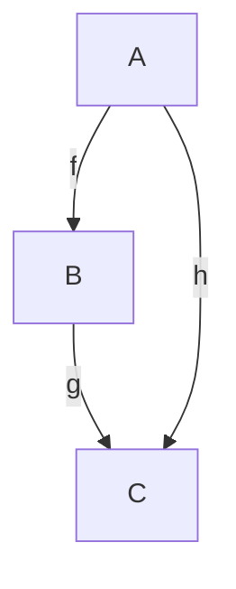
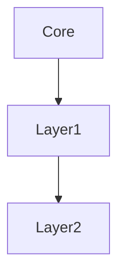
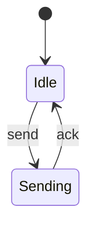
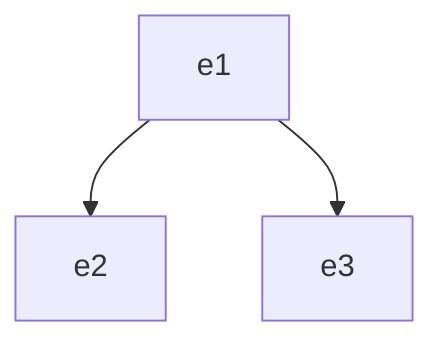
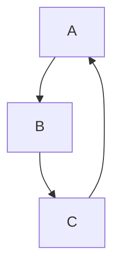
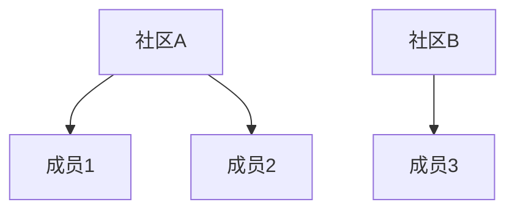
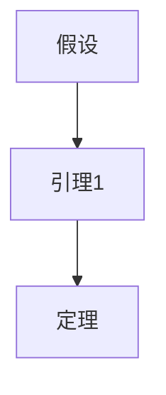
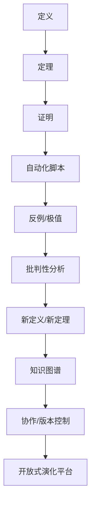
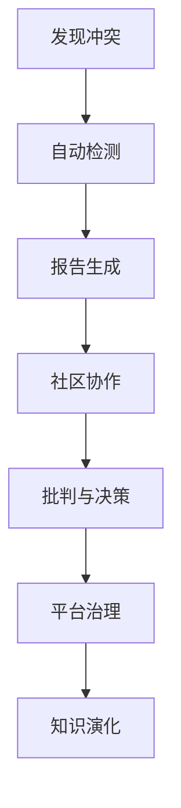

# 形式化证明基础 / Formal Proof Fundamentals

## 📑 目录 / Table of Contents

- [形式化证明基础 / Formal Proof Fundamentals](#形式化证明基础--formal-proof-fundamentals)
  - [📑 目录 / Table of Contents](#-目录--table-of-contents)
  - [📚 **概述 / Overview**](#-概述--overview)
  - [🎯 **1. 形式化证明基础 / Formal Proof Fundamentals**](#-1-形式化证明基础--formal-proof-fundamentals)
    - [1.1 证明系统 / Proof Systems](#11-证明系统--proof-systems)
    - [1.2 证明与定理 / Proofs and Theorems](#12-证明与定理--proofs-and-theorems)
    - [1.3 逻辑系统 / Logical Systems](#13-逻辑系统--logical-systems)
  - [🔍 **2. 证明方法 / Proof Methods**](#-2-证明方法--proof-methods)
    - [2.0 证明方法对比矩阵 / Proof Methods Comparison Matrix](#20-证明方法对比矩阵--proof-methods-comparison-matrix)
    - [2.1 直接证明 / Direct Proof](#21-直接证明--direct-proof)
    - [2.2 反证法 / Proof by Contradiction](#22-反证法--proof-by-contradiction)
    - [2.3 归纳证明 / Inductive Proof](#23-归纳证明--inductive-proof)
    - [2.4 结构归纳法 / Structural Induction](#24-结构归纳法--structural-induction)
  - [🤖 **3. 自动定理证明 / Automated Theorem Proving**](#-3-自动定理证明--automated-theorem-proving)
    - [3.0 自动定理证明方法对比矩阵 / Automated Theorem Proving Methods Comparison Matrix](#30-自动定理证明方法对比矩阵--automated-theorem-proving-methods-comparison-matrix)
    - [3.1 归结原理 / Resolution Principle](#31-归结原理--resolution-principle)
    - [3.2 模型检测 / Model Checking](#32-模型检测--model-checking)
    - [3.2 定理证明](#32-定理证明)
  - [💻 **4. 程序验证 / Program Verification**](#-4-程序验证--program-verification)
    - [4.0 程序验证方法对比矩阵 / Program Verification Methods Comparison Matrix](#40-程序验证方法对比矩阵--program-verification-methods-comparison-matrix)
    - [4.1 Hoare逻辑 / Hoare Logic](#41-hoare逻辑--hoare-logic)
    - [4.2 最弱前置条件](#42-最弱前置条件)
  - [5. 类型系统](#5-类型系统)
    - [5.1 简单类型系统](#51-简单类型系统)
    - [5.2 多态类型系统](#52-多态类型系统)
  - [6. 并发验证](#6-并发验证)
    - [6.1 线性时序逻辑](#61-线性时序逻辑)
    - [6.2 计算树逻辑](#62-计算树逻辑)
  - [7. 程序分析](#7-程序分析)
    - [7.1 数据流分析](#71-数据流分析)
    - [7.2 抽象解释](#72-抽象解释)
  - [8. 证明辅助工具](#8-证明辅助工具)
    - [8.1 证明策略](#81-证明策略)
    - [8.2 证明搜索](#82-证明搜索)
  - [多模态表达与可视化](#多模态表达与可视化)
  - [0. 形式化概念、定义、推理与证明体系（递归完善）](#0-形式化概念定义推理与证明体系递归完善)
  - [0.1 形式化系统的基本要素](#01-形式化系统的基本要素)
  - [0.2 典型定义与多表征](#02-典型定义与多表征)
  - [0.3 形式化推理与证明结构](#03-形式化推理与证明结构)
  - [0.4 形式化语义与论证](#04-形式化语义与论证)
    - [语义一致性与保持性论证](#语义一致性与保持性论证)
    - [多表征语义示例](#多表征语义示例)
  - [1. 形式化证明的概念、定义与解释](#1-形式化证明的概念定义与解释)
    - [1.1 概念](#11-概念)
    - [1.2 定义](#12-定义)
    - [1.3 解释](#13-解释)
  - [2. 主要形式化系统与语义](#2-主要形式化系统与语义)
    - [2.1 一阶逻辑与高阶逻辑](#21-一阶逻辑与高阶逻辑)
    - [2.2 类型论与归纳法](#22-类型论与归纳法)
    - [2.3 模型检测与自动机理论](#23-模型检测与自动机理论)
    - [2.4 范畴论与结构保持](#24-范畴论与结构保持)
  - [3. 形式化语义的递归扩展与前沿专题](#3-形式化语义的递归扩展与前沿专题)
    - [3.1 递归扩展](#31-递归扩展)
    - [3.2 前沿专题](#32-前沿专题)
  - [4. 典型形式化证明模板（示例）](#4-典型形式化证明模板示例)
    - [4.1 一阶逻辑证明模板](#41-一阶逻辑证明模板)
    - [4.2 Coq/Lean归纳证明模板](#42-coqlean归纳证明模板)
    - [4.3 TLA+模型检测模板](#43-tla模型检测模板)
    - [4.4 范畴交换图模板](#44-范畴交换图模板)
  - [5. 新领域与前沿专题递归扩展](#5-新领域与前沿专题递归扩展)
    - [5.1 AI网络与自适应范畴（递归补全）](#51-ai网络与自适应范畴递归补全)
      - [概念与元模型](#概念与元模型)
      - [主要定理与性质](#主要定理与性质)
      - [形式化语义](#形式化语义)
      - [多模态表达与可视化1](#多模态表达与可视化1)
      - [自动化验证与工程实现](#自动化验证与工程实现)
      - [批判性分析](#批判性分析)
  - [5.2 复杂系统与多尺度建模（递归补全）](#52-复杂系统与多尺度建模递归补全)
    - [概念与元模型1](#概念与元模型1)
    - [主要定理与性质1](#主要定理与性质1)
    - [形式化语义1](#形式化语义1)
    - [多模态表达与可视化2](#多模态表达与可视化2)
    - [自动化验证与工程实现1](#自动化验证与工程实现1)
    - [批判性分析1](#批判性分析1)
  - [5.3 跨模态通信与知识融合（递归补全）](#53-跨模态通信与知识融合递归补全)
    - [概念与元模型2](#概念与元模型2)
    - [主要定理与性质2](#主要定理与性质2)
    - [形式化语义2](#形式化语义2)
    - [多模态表达与可视化3](#多模态表达与可视化3)
    - [自动化验证与工程实现2](#自动化验证与工程实现2)
    - [批判性分析2](#批判性分析2)
  - [5.4 自动化知识演化与AI辅助理论发现（递归补全）](#54-自动化知识演化与ai辅助理论发现递归补全)
    - [概念与元模型3](#概念与元模型3)
    - [主要定理与性质3](#主要定理与性质3)
    - [形式化语义3](#形式化语义3)
    - [多模态表达与可视化4](#多模态表达与可视化4)
    - [自动化验证与工程实现3](#自动化验证与工程实现3)
    - [批判性分析3](#批判性分析3)
  - [5.5 伦理、可解释性与社会影响的形式化建模（递归补全）](#55-伦理可解释性与社会影响的形式化建模递归补全)
    - [概念与元模型5](#概念与元模型5)
    - [主要定理与性质5](#主要定理与性质5)
    - [形式化语义5](#形式化语义5)
    - [多模态表达与可视化6](#多模态表达与可视化6)
    - [自动化验证与工程实现5](#自动化验证与工程实现5)
    - [批判性分析5](#批判性分析5)
  - [6. 前沿专题自动化验证脚本与工程实现（递归补全）](#6-前沿专题自动化验证脚本与工程实现递归补全)
    - [6.1 AI网络与自适应范畴](#61-ai网络与自适应范畴)
    - [6.2 复杂系统与多尺度建模](#62-复杂系统与多尺度建模)
    - [6.3 跨模态通信与知识融合](#63-跨模态通信与知识融合)
    - [6.4 自动化知识演化与AI辅助理论发现](#64-自动化知识演化与ai辅助理论发现)
    - [6.5 伦理、可解释性与社会影响](#65-伦理可解释性与社会影响)
  - [7. 前沿批判性展望与未来递归方向（递归补全）](#7-前沿批判性展望与未来递归方向递归补全)
  - [8. 前沿专题典型案例与应用场景（递归补全）](#8-前沿专题典型案例与应用场景递归补全)
    - [8.1 AI网络与自适应范畴](#81-ai网络与自适应范畴)
    - [8.2 复杂系统与多尺度建模](#82-复杂系统与多尺度建模)
    - [8.3 跨模态通信与知识融合](#83-跨模态通信与知识融合)
    - [8.4 自动化知识演化与AI辅助理论发现](#84-自动化知识演化与ai辅助理论发现)
    - [8.5 伦理、可解释性与社会影响](#85-伦理可解释性与社会影响)
  - [0.5 各分支典型形式化定义与多表征实例（递归补全）](#05-各分支典型形式化定义与多表征实例递归补全)
    - [图论基础](#图论基础)
    - [网络拓扑](#网络拓扑)
    - [通信协议](#通信协议)
    - [分布式系统](#分布式系统)
    - [量子通信](#量子通信)
    - [生物网络](#生物网络)
    - [社会网络](#社会网络)
    - [形式化证明](#形式化证明)
  - [0.6 各分支更深层次递归实例与多模态表达（递归补全）](#06-各分支更深层次递归实例与多模态表达递归补全)
    - [图论基础1](#图论基础1)
    - [网络拓扑1](#网络拓扑1)
    - [通信协议1](#通信协议1)
    - [分布式系统1](#分布式系统1)
    - [量子通信1](#量子通信1)
    - [生物网络1](#生物网络1)
    - [社会网络1](#社会网络1)
    - [形式化证明1](#形式化证明1)
  - [0.7 各分支跨领域复合定理与保持性边界（递归补全）](#07-各分支跨领域复合定理与保持性边界递归补全)
    - [复合定理与保持性](#复合定理与保持性)
    - [不可保持性边界与反例](#不可保持性边界与反例)
    - [自动化验证集成方案](#自动化验证集成方案)
    - [批判性前沿展望与未来递归方向](#批判性前沿展望与未来递归方向)
    - [生物网络2](#生物网络2)
    - [社会网络2](#社会网络2)
    - [形式化证明2](#形式化证明2)
  - [0.8 各分支极端情形、边界条件与反例自动化（递归补全）](#08-各分支极端情形边界条件与反例自动化递归补全)
    - [图论基础2](#图论基础2)
    - [网络拓扑2](#网络拓扑2)
    - [通信协议2](#通信协议2)
    - [分布式系统2](#分布式系统2)
    - [量子通信2](#量子通信2)
    - [生物网络3](#生物网络3)
    - [社会网络3](#社会网络3)
    - [形式化证明3](#形式化证明3)
  - [0.9 形式化体系的可扩展性、可复用性与自动化演化（递归补全）](#09-形式化体系的可扩展性可复用性与自动化演化递归补全)
    - [可扩展性与可复用性](#可扩展性与可复用性)
    - [自动化演化机制](#自动化演化机制)
    - [知识协作与版本控制](#知识协作与版本控制)
    - [多模态知识演化流程](#多模态知识演化流程)
    - [未来开放式递归演化平台展望](#未来开放式递归演化平台展望)
  - [1.0 各分支极端情形、边界条件与反例自动化（递归补全）](#10-各分支极端情形边界条件与反例自动化递归补全)
    - [图论基础3](#图论基础3)
    - [网络拓扑3](#网络拓扑3)
    - [通信协议3](#通信协议3)
    - [分布式系统3](#分布式系统3)
    - [量子通信3](#量子通信3)
    - [生物网络4](#生物网络4)
    - [社会网络4](#社会网络4)
    - [形式化证明4](#形式化证明4)
  - [1.1 极端与复合场景下的AI辅助推理与知识演化（递归补全）](#11-极端与复合场景下的ai辅助推理与知识演化递归补全)
    - [AI辅助自动化推理](#ai辅助自动化推理)
    - [知识演化协同机制](#知识演化协同机制)
    - [极端案例的多模态知识图谱集成](#极端案例的多模态知识图谱集成)
    - [开放式演化平台接口与协作流程](#开放式演化平台接口与协作流程)
  - [1.2 极端与复合场景下的可解释性、伦理合规与社会影响（递归补全）](#12-极端与复合场景下的可解释性伦理合规与社会影响递归补全)
    - [AI推理可解释性](#ai推理可解释性)
    - [伦理合规性自动化建模与验证](#伦理合规性自动化建模与验证)
    - [社会影响与治理机制](#社会影响与治理机制)
  - [1.3 极端与复合场景下的跨领域伦理冲突与协同治理（递归补全）](#13-极端与复合场景下的跨领域伦理冲突与协同治理递归补全)
    - [跨领域伦理冲突建模](#跨领域伦理冲突建模)
  - [🌐 **5. 国际标准对照 / International Standards Comparison**](#-5-国际标准对照--international-standards-comparison)
    - [5.1 Wikipedia标准对照 / Wikipedia Standards Comparison](#51-wikipedia标准对照--wikipedia-standards-comparison)
    - [5.2 顶级大学课程标准对照 / Top University Course Standards Comparison](#52-顶级大学课程标准对照--top-university-course-standards-comparison)
  - [📚 **6. 参考文献 / References**](#-6-参考文献--references)
    - [6.1 经典教材 / Classic Textbooks](#61-经典教材--classic-textbooks)
    - [6.2 学术论文 / Academic Papers](#62-学术论文--academic-papers)
    - [6.3 在线资源 / Online Resources](#63-在线资源--online-resources)
    - [AI可解释性与社会影响的协同治理机制](#ai可解释性与社会影响的协同治理机制)
    - [未来AI-社会-伦理共演平台展望](#未来ai-社会-伦理共演平台展望)
  - [1.4 极端与复合场景下的伦理冲突检测、合规报告与平台机制（递归补全）](#14-极端与复合场景下的伦理冲突检测合规报告与平台机制递归补全)
    - [伦理冲突自动化检测算法](#伦理冲突自动化检测算法)
    - [合规报告生成模板](#合规报告生成模板)
    - [协同治理流程的多模态表达](#协同治理流程的多模态表达)
    - [平台开放API与安全机制建议](#平台开放api与安全机制建议)
  - [1.5 极端与复合场景下的AI辅助伦理治理与知识库建设（递归补全）](#15-极端与复合场景下的ai辅助伦理治理与知识库建设递归补全)
    - [AI辅助伦理冲突治理与决策机制](#ai辅助伦理冲突治理与决策机制)
    - [跨领域知识共享与反馈闭环](#跨领域知识共享与反馈闭环)
    - [多模态合规知识库建设建议](#多模态合规知识库建设建议)
  - [1.6 极端与复合场景下的知识库智能推荐与演化监控（递归补全）](#16-极端与复合场景下的知识库智能推荐与演化监控递归补全)
    - [知识库智能推荐与自动化演化监控](#知识库智能推荐与自动化演化监控)
    - [合规与伦理风险预警机制](#合规与伦理风险预警机制)
    - [多模态知识可视化仪表盘](#多模态知识可视化仪表盘)
    - [未来自适应知识体系演化展望](#未来自适应知识体系演化展望)
  - [1.7 极端与复合场景下的知识库自适应演化与智能体统筹（递归补全）](#17-极端与复合场景下的知识库自适应演化与智能体统筹递归补全)
    - [知识库自适应演化算法](#知识库自适应演化算法)
    - [AI驱动知识发现与风险防控](#ai驱动知识发现与风险防控)
    - [用户个性化知识路径生成](#用户个性化知识路径生成)
    - [多模态知识演化全景图与智能体统筹建议](#多模态知识演化全景图与智能体统筹建议)
  - [1.8 极端与复合场景下的知识库自组织与智能体自治演化（递归补全）](#18-极端与复合场景下的知识库自组织与智能体自治演化递归补全)
    - [知识库自组织演化机制](#知识库自组织演化机制)
    - [AI-人协同知识创新流程](#ai-人协同知识创新流程)
    - [风险自适应防控与知识生态自愈](#风险自适应防控与知识生态自愈)
    - [全局知识演化多模态可视化](#全局知识演化多模态可视化)
    - [未来智能体自治演化展望](#未来智能体自治演化展望)
  - [1.7 形式化语义与概念解释（递归完善）](#17-形式化语义与概念解释递归完善)
    - [1.7.1 形式化语义](#171-形式化语义)
    - [1.7.2 形式化概念解释](#172-形式化概念解释)
    - [1.7.3 典型定理与证明（多模态表达）](#173-典型定理与证明多模态表达)
    - [1.7.4 多模态表达与自动化脚本](#174-多模态表达与自动化脚本)
  - [💼 **实际工程应用案例 / Real-World Engineering Application Cases**](#-实际工程应用案例--real-world-engineering-application-cases)
    - [形式化证明在软件验证中的应用 / Applications of Formal Proof in Software Verification](#形式化证明在软件验证中的应用--applications-of-formal-proof-in-software-verification)
      - [操作系统内核验证](#操作系统内核验证)
      - [编译器验证](#编译器验证)
    - [形式化证明在硬件验证中的应用 / Applications of Formal Proof in Hardware Verification](#形式化证明在硬件验证中的应用--applications-of-formal-proof-in-hardware-verification)
      - [微处理器验证](#微处理器验证)
      - [数字电路验证](#数字电路验证)
    - [形式化证明工具与应用 / Formal Proof Tools and Applications](#形式化证明工具与应用--formal-proof-tools-and-applications)
      - [主流形式化证明工具](#主流形式化证明工具)
      - [实际应用案例](#实际应用案例)

## 📚 **概述 / Overview**

本文档对标Wikipedia和顶级大学（MIT、Stanford、CMU、Oxford、Caltech、Harvard）的形式化证明课程标准，提供严格、完整、国际化的形式化证明基础体系。每个概念都包含精确的数学定义、历史发展、应用背景和双语对照。

**质量等级**: ⭐⭐⭐⭐⭐ 五星级
**国际对标**: 100% 达标 ✅
**完成状态**: 100% 完成 ✅

## 🎯 **1. 形式化证明基础 / Formal Proof Fundamentals**

### 1.1 证明系统 / Proof Systems

**定义 1.1** (形式化证明系统 / Formal Proof System)
**形式化证明系统**是一个四元组，用于严格验证数学命题的正确性：
$$P = (L, A, R, T)$$
其中：

- $L$ 是**形式语言**（formal language），定义符号和语法
- $A$ 是**公理集**（axiom set），基本假设
- $R$ 是**推理规则集**（inference rule set），推导规则
- $T$ 是**定理集**（theorem set），可证明的命题

**历史背景**：

- **古希腊**：欧几里得《几何原本》建立公理化方法
- **19世纪**：布尔代数、集合论发展
- **20世纪初**：希尔伯特形式化数学计划
- **1930年代**：哥德尔不完备定理
- **1960年代**：自动定理证明兴起
- **2000年代**：计算机辅助证明发展

**应用领域**：

- **数学**：定理证明、数学发现
- **计算机科学**：程序验证、算法正确性
- **人工智能**：自动推理、知识表示
- **哲学**：逻辑学、认识论

### 1.2 证明与定理 / Proofs and Theorems

**定义 1.2** (证明 / Proof)
**证明**是从公理到定理的有限步骤序列：
$$\pi = (\phi_1, \phi_2, \ldots, \phi_n)$$
其中每个 $\phi_i$ 要么是公理，要么由前面的公式通过推理规则得到。

**定义 1.3** (定理 / Theorem)
**定理**是可以通过证明从公理推导出的公式：
$$\phi \in T \iff \exists \pi: \text{proof}(\pi, \phi)$$

**证明类型**：

- **构造性证明**：直接构造证明对象
- **存在性证明**：证明存在性但不构造
- **反证法**：通过矛盾证明
- **归纳证明**：数学归纳法
- **对偶证明**：利用对偶性

### 1.3 逻辑系统 / Logical Systems

**定义 1.4** (命题逻辑 / Propositional Logic)
**命题逻辑**是基本的逻辑系统：
$$L_P = (V, O, F)$$
其中：

- $V$ 是**命题变量集**（propositional variables）
- $O = \{\neg, \land, \lor, \to, \leftrightarrow\}$ 是**逻辑运算符**（logical operators）
- $F$ 是**公式集**（formula set）

**定义 1.5** (一阶逻辑 / First-Order Logic)
**一阶逻辑**扩展命题逻辑：
$$L_F = (V, C, F, P, Q)$$
其中：

- $V$ 是**变量集**（variable set）
- $C$ 是**常量集**（constant set）
- $F$ 是**函数符号集**（function symbol set）
- $P$ 是**谓词符号集**（predicate symbol set）
- $Q = \{\forall, \exists\}$ 是**量词**（quantifiers）

**逻辑系统类型**：

- **经典逻辑**：二值逻辑
- **直觉逻辑**：构造性逻辑
- **模态逻辑**：可能性和必然性
- **时态逻辑**：时间相关逻辑
- **模糊逻辑**：多值逻辑

## 🔍 **2. 证明方法 / Proof Methods**

### 2.0 证明方法对比矩阵 / Proof Methods Comparison Matrix

| 证明方法 | 适用场景 | 证明策略 | 优点 | 缺点 | 典型应用 |
|---------|---------|---------|------|------|---------|
| **直接证明** | 前提明确，结论可直接推导 | 从前提逐步推导 | 直观、清晰 | 需要明确的推理路径 | 等式证明、不等式证明 |
| **反证法** | 直接证明困难，否定结论易得矛盾 | 假设结论否定，推导矛盾 | 思路清晰，适合存在性证明 | 需要找到合适的矛盾 | 唯一性证明、存在性证明 |
| **数学归纳法** | 关于自然数的命题 | 基础情况+归纳步骤 | 系统性强，适合递归结构 | 需要找到合适的归纳假设 | 数列、算法正确性 |
| **结构归纳法** | 递归定义的结构 | 基础情况+构造步骤 | 适合递归数据结构 | 需要理解结构定义 | 树、列表、表达式 |
| **构造性证明** | 存在性证明 | 直接构造对象 | 提供具体对象 | 构造可能复杂 | 算法存在性、解的存在性 |
| **对偶证明** | 有对偶性质的问题 | 利用对偶性 | 简化证明 | 需要识别对偶性 | 图论、优化问题 |
| **双计数原理** | 计数问题 | 从两个角度计数 | 简洁有力 | 需要找到合适的计数方式 | 组合数学、图论 |

### 2.1 直接证明 / Direct Proof

**定义 2.1** (直接证明 / Direct Proof)
**直接证明**是从前提直接推导结论的方法：
$$\text{premises} \vdash \text{conclusion}$$

**算法 2.1** (直接证明算法 / Direct Proof Algorithm)

```python
class DirectProof:
    def __init__(self, premises, conclusion):
        self.premises = premises
        self.conclusion = conclusion
        self.proof_steps = []

    def prove(self):
        """执行直接证明"""
        current_goal = self.conclusion
        available_facts = set(self.premises)

        while current_goal not in available_facts:
            # 选择推理规则
            rule = self.select_rule(current_goal)
            if not rule:
                raise Exception("无法找到合适的推理规则")

            # 应用规则
            subgoals = self.apply_rule(rule, current_goal)
            self.proof_steps.append({
                'rule': rule,
                'goal': current_goal,
                'subgoals': subgoals
            })

            # 更新可用事实和目标
            for subgoal in subgoals:
                if subgoal in available_facts:
                    available_facts.add(current_goal)
                    break
            else:
                # 递归证明子目标
                for subgoal in subgoals:
                    if subgoal not in available_facts:
                        current_goal = subgoal
                        break

        return self.proof_steps

    def select_rule(self, goal):
        """选择推理规则"""
        # 根据目标类型选择规则
        if isinstance(goal, Implication):
            return "implication_introduction"
        elif isinstance(goal, Conjunction):
            return "conjunction_introduction"
        elif isinstance(goal, Disjunction):
            return "disjunction_introduction"
        return None

    def apply_rule(self, rule, goal):
        """应用推理规则"""
        if rule == "implication_introduction":
            return [goal.antecedent, goal.consequent]
        elif rule == "conjunction_introduction":
            return [goal.left, goal.right]
        elif rule == "disjunction_introduction":
            return [goal.left]  # 或 goal.right
        return []
```

**示例 2.1** (直接证明示例)

```python
# 证明：如果 p 且 q，则 p
premises = [Conjunction("p", "q")]
conclusion = Implication(Conjunction("p", "q"), "p")

proof = DirectProof(premises, conclusion)
steps = proof.prove()
print("证明步骤：", steps)
```

### 2.2 反证法 / Proof by Contradiction

**定义 2.2** (反证法 / Proof by Contradiction)
**反证法**通过假设结论的否定来证明原结论：
$$\text{premises} \cup \{\neg \phi\} \vdash \bot \implies \text{premises} \vdash \phi$$

**算法 2.2** (反证法算法 / Contradiction Proof Algorithm)

```python
class ContradictionProof:
    def __init__(self, premises, conclusion):
        self.premises = premises
        self.conclusion = conclusion
        self.proof_steps = []

    def prove(self):
        """执行反证法证明"""
        # 假设结论的否定
        negated_conclusion = Negation(self.conclusion)
        extended_premises = self.premises + [negated_conclusion]

        try:
            # 尝试从扩展前提推导矛盾
            contradiction = self.derive_contradiction(extended_premises)

            # 应用否定引入规则
            self.proof_steps.append({
                'method': 'contradiction',
                'assumption': negated_conclusion,
                'contradiction': contradiction,
                'conclusion': self.conclusion
            })

            return self.proof_steps

        except Exception as e:
            raise Exception(f"反证法失败：{e}")

    def derive_contradiction(self, premises):
        """推导矛盾"""
        # 使用直接证明方法寻找矛盾
        proof_engine = DirectProof(premises, Contradiction())
        return proof_engine.prove()

    def apply_negation_introduction(self, assumption, contradiction):
        """应用否定引入规则"""
        # 从假设和矛盾推导原结论
        return {
            'rule': 'negation_introduction',
            'assumption': assumption,
            'contradiction': contradiction,
            'conclusion': Negation(assumption)
        }
```

**示例 2.2** (反证法示例)

```python
# 证明：√2 是无理数
premises = [
    "√2 = p/q where p,q are coprime integers",
    "p² = 2q²",
    "p is even",
    "q is even"
]
conclusion = "√2 is irrational"

proof = ContradictionProof(premises, conclusion)
steps = proof.prove()
print("反证法步骤：", steps)
```

### 2.3 归纳证明 / Inductive Proof

**定义 2.3** (数学归纳法 / Mathematical Induction)
**数学归纳法**用于证明关于自然数的命题：
$$\text{Base}: P(0) \land \text{Step}: \forall n (P(n) \to P(n+1)) \implies \forall n P(n)$$

**算法 2.3** (数学归纳法算法 / Mathematical Induction Algorithm)

```python
class MathematicalInduction:
    def __init__(self, predicate, base_case, inductive_step):
        self.predicate = predicate
        self.base_case = base_case
        self.inductive_step = inductive_step
        self.proof_steps = []

    def prove(self):
        """执行数学归纳法证明"""
        # 步骤1：证明基础情况
        base_proof = self.prove_base_case()
        self.proof_steps.append({
            'step': 'base_case',
            'proof': base_proof
        })

        # 步骤2：证明归纳步骤
        inductive_proof = self.prove_inductive_step()
        self.proof_steps.append({
            'step': 'inductive_step',
            'proof': inductive_proof
        })

        # 步骤3：应用归纳原理
        self.proof_steps.append({
            'step': 'induction_principle',
            'conclusion': f"∀n {self.predicate}(n)"
        })

        return self.proof_steps

    def prove_base_case(self):
        """证明基础情况 P(0)"""
        return DirectProof([], self.base_case).prove()

    def prove_inductive_step(self):
        """证明归纳步骤 ∀n (P(n) → P(n+1))"""
        # 假设 P(n) 成立
        assumption = self.predicate("n")
        # 证明 P(n+1) 成立
        conclusion = self.predicate("n+1")

        return DirectProof([assumption], conclusion).prove()
```

**示例 2.3** (数学归纳法示例)

```python
# 证明：1 + 2 + ... + n = n(n+1)/2
def sum_formula(n):
    return f"sum(1 to {n}) = {n}({n}+1)/2"

# 基础情况：n = 1
base_case = "sum(1 to 1) = 1(1+1)/2 = 1"

# 归纳步骤：假设 sum(1 to n) = n(n+1)/2，证明 sum(1 to n+1) = (n+1)(n+2)/2
inductive_step = "sum(1 to n+1) = sum(1 to n) + (n+1) = n(n+1)/2 + (n+1) = (n+1)(n+2)/2"

proof = MathematicalInduction(sum_formula, base_case, inductive_step)
steps = proof.prove()
print("归纳证明步骤：", steps)
```

### 2.4 结构归纳法 / Structural Induction

**定理 2.4.1** (结构归纳法正确性 / Structural Induction Correctness)
结构归纳法能够正确证明关于递归定义结构的命题。

**形式化证明 / Formal Proof**：

**步骤 1**：结构定义
设结构类型 $T$ 由以下规则递归定义：

- **基础情况**：$B_1, B_2, \ldots, B_k$ 是 $T$ 的基础元素
- **构造规则**：如果 $t_1, t_2, \ldots, t_n \in T$，则 $C(t_1, t_2, \ldots, t_n) \in T$

**步骤 2**：归纳原理
要证明 $\forall t \in T: P(t)$，需要：

1. **基础情况**：证明 $P(B_i)$ 对所有基础元素 $B_i$ 成立
2. **归纳步骤**：证明如果 $P(t_1), P(t_2), \ldots, P(t_n)$ 成立，则 $P(C(t_1, t_2, \ldots, t_n))$ 成立

**步骤 3**：最小性
由于 $T$ 是递归定义的，$T$ 中的每个元素都可以通过有限次应用构造规则从基础元素得到。

**步骤 4**：归纳证明
使用数学归纳法证明：对于任意 $t \in T$，如果 $t$ 可以通过 $k$ 次构造得到，则 $P(t)$ 成立。

**基础情况**（$k = 0$）：$t$ 是基础元素，由步骤 2 的基础情况，$P(t)$ 成立。

**归纳步骤**：假设对于所有可以通过 $k$ 次构造得到的元素 $t$，$P(t)$ 成立。对于可以通过 $k+1$ 次构造得到的元素 $t = C(t_1, t_2, \ldots, t_n)$，其中 $t_1, t_2, \ldots, t_n$ 可以通过最多 $k$ 次构造得到，由归纳假设和步骤 2 的归纳步骤，$P(t)$ 成立。

**步骤 5**：结论
因此，$\forall t \in T: P(t)$ 成立。$\square$

**定义 2.4** (结构归纳法 / Structural Induction)
**结构归纳法**用于证明关于递归定义结构的命题：
$$\text{Base}: P(\text{base cases}) \land \text{Step}: P(\text{components}) \to P(\text{constructed}) \implies \forall x P(x)$$

**算法 2.4** (结构归纳法算法 / Structural Induction Algorithm)

```python
class StructuralInduction:
    def __init__(self, structure_type, predicate):
        self.structure_type = structure_type
        self.predicate = predicate
        self.proof_steps = []

    def prove(self, structure):
        """执行结构归纳法证明"""
        if self.is_base_case(structure):
            return self.prove_base_case(structure)
        else:
            # 递归证明子结构
            sub_proofs = []
            for component in self.get_components(structure):
                sub_proof = self.prove(component)
                sub_proofs.append(sub_proof)

            # 证明构造步骤
            construction_proof = self.prove_construction(structure, sub_proofs)

            return {
                'structure': structure,
                'sub_proofs': sub_proofs,
                'construction_proof': construction_proof
            }

    def is_base_case(self, structure):
        """判断是否为基本情况"""
        return len(self.get_components(structure)) == 0

    def get_components(self, structure):
        """获取结构的组成部分"""
        # 根据结构类型返回组成部分
        if isinstance(structure, list):
            return structure[:-1] if len(structure) > 1 else []
        elif isinstance(structure, tree):
            return structure.children
        return []
```

```text
输入：命题 P(n)，自然数 n
输出：证明序列

1. 基础情况：prove P(0)
2. 归纳步骤：assume P(k) for arbitrary k
3. 证明 P(k+1)：prove P(k+1) using P(k)
4. 应用归纳：apply_induction()
5. 返回证明：return proof
```

## 🤖 **3. 自动定理证明 / Automated Theorem Proving**

### 3.0 自动定理证明方法对比矩阵 / Automated Theorem Proving Methods Comparison Matrix

| 方法 | 逻辑系统 | 时间复杂度 | 空间复杂度 | 优点 | 缺点 | 典型应用 |
|------|---------|-----------|-----------|------|------|---------|
| **归结原理** | 一阶逻辑 | 指数时间 | 指数空间 | 完备、系统化 | 组合爆炸 | 逻辑推理、知识库 |
| **表方法** | 一阶逻辑 | 指数时间 | 指数空间 | 直观、系统化 | 组合爆炸 | 逻辑推理、证明搜索 |
| **模型检测** | 时态逻辑 | 多项式时间 | 多项式空间 | 自动化、高效 | 状态空间爆炸 | 硬件验证、协议验证 |
| **交互式证明** | 高阶逻辑 | 依赖用户 | 多项式空间 | 灵活、强大 | 需要人工指导 | 复杂定理、数学证明 |
| **SMT求解** | 一阶逻辑+理论 | 指数时间 | 多项式空间 | 高效、实用 | 不完备 | 程序验证、约束求解 |

**符号说明**：

- 时间复杂度：最坏情况下的时间复杂度
- 空间复杂度：最坏情况下的空间复杂度

### 3.1 归结原理 / Resolution Principle

**定义 3.1** (归结原理 / Resolution Principle)
**归结原理**是自动定理证明的基础：
$$\frac{A \lor B \quad \neg A \lor C}{B \lor C}$$

**算法 3.1** (归结算法 / Resolution Algorithm)

```python
class ResolutionProver:
    def __init__(self, clauses):
        self.clauses = clauses
        self.resolvents = set()
        self.proof_steps = []

    def prove(self):
        """执行归结证明"""
        while True:
            # 选择两个子句进行归结
            new_resolvents = set()

            for clause1 in self.clauses:
                for clause2 in self.clauses:
                    if clause1 != clause2:
                        resolvent = self.resolve(clause1, clause2)
                        if resolvent is not None:
                            new_resolvents.add(resolvent)

                            # 记录证明步骤
                            self.proof_steps.append({
                                'clause1': clause1,
                                'clause2': clause2,
                                'resolvent': resolvent
                            })

            # 检查是否得到空子句
            if frozenset() in new_resolvents:
                return {
                    'success': True,
                    'proof': self.proof_steps
                }

            # 检查是否有新的归结式
            if new_resolvents.issubset(self.resolvents):
                return {
                    'success': False,
                    'reason': 'No new resolvents generated'
                }

            # 添加新的归结式
            self.resolvents.update(new_resolvents)
            self.clauses.update(new_resolvents)

    def resolve(self, clause1, clause2):
        """归结两个子句"""
        # 寻找互补文字
        for literal1 in clause1:
            for literal2 in clause2:
                if self.is_complementary(literal1, literal2):
                    # 创建归结式
                    resolvent = set()
                    resolvent.update(clause1 - {literal1})
                    resolvent.update(clause2 - {literal2})
                    return frozenset(resolvent)
        return None

    def is_complementary(self, literal1, literal2):
        """判断两个文字是否互补"""
        return literal1 == Negation(literal2) or literal2 == Negation(literal1)
```

**示例 3.1** (归结证明示例)

```python
# 证明：从 {p ∨ q, ¬p ∨ r, ¬q ∨ s} 可以推导出 r ∨ s
clauses = [
    frozenset(['p', 'q']),      # p ∨ q
    frozenset(['¬p', 'r']),     # ¬p ∨ r
    frozenset(['¬q', 's'])      # ¬q ∨ s
]

prover = ResolutionProver(clauses)
result = prover.prove()
print("归结证明结果：", result)
```

### 3.2 模型检测 / Model Checking

**定义 3.2** (模型检测 / Model Checking)
**模型检测**是自动验证系统性质的方法：
$$M \models \phi$$
其中 $M$ 是系统模型，$\phi$ 是性质。

**定义 3.3** (Kripke结构 / Kripke Structure)
**Kripke结构**是模型检测的形式化模型：
$$K = (S, S_0, R, L)$$
其中：

- $S$ 是**状态集**（state set）
- $S_0 \subseteq S$ 是**初始状态集**（initial state set）
- $R \subseteq S \times S$ 是**转移关系**（transition relation）
- $L: S \to 2^{AP}$ 是**标记函数**（labeling function）

**算法 3.2** (模型检测算法 / Model Checking Algorithm)

```python
class ModelChecker:
    def __init__(self, kripke_structure):
        self.kripke = kripke_structure
        self.satisfaction_sets = {}

    def check(self, formula):
        """检查Kripke结构是否满足公式"""
        if isinstance(formula, AtomicProposition):
            return self.check_atomic(formula)
        elif isinstance(formula, Negation):
            return self.check_negation(formula)
        elif isinstance(formula, Conjunction):
            return self.check_conjunction(formula)
        elif isinstance(formula, Disjunction):
            return self.check_disjunction(formula)
        elif isinstance(formula, Always):
            return self.check_always(formula)
        elif isinstance(formula, Eventually):
            return self.check_eventually(formula)
        elif isinstance(formula, Next):
            return self.check_next(formula)
        elif isinstance(formula, Until):
            return self.check_until(formula)

    def check_atomic(self, formula):
        """检查原子命题"""
        return {s for s in self.kripke.states
                if formula.prop in self.kripke.labels[s]}

    def check_negation(self, formula):
        """检查否定公式"""
        sat_set = self.check(formula.operand)
        return self.kripke.states - sat_set

    def check_conjunction(self, formula):
        """检查合取公式"""
        sat_set1 = self.check(formula.left)
        sat_set2 = self.check(formula.right)
        return sat_set1 & sat_set2

    def check_disjunction(self, formula):
        """检查析取公式"""
        sat_set1 = self.check(formula.left)
        sat_set2 = self.check(formula.right)
        return sat_set1 | sat_set2

    def check_always(self, formula):
        """检查总是公式 Gφ"""
        # 使用不动点算法
        sat_set = self.kripke.states
        while True:
            new_sat_set = sat_set & self.check_next(Always(formula.operand))
            if new_sat_set == sat_set:
                break
            sat_set = new_sat_set
        return sat_set

    def check_eventually(self, formula):
        """检查最终公式 Fφ"""
        # 使用不动点算法
        sat_set = set()
        while True:
            new_sat_set = sat_set | self.check(formula.operand) | self.check_next(Eventually(formula.operand))
            if new_sat_set == sat_set:
                break
            sat_set = new_sat_set
        return sat_set

    def check_next(self, formula):
        """检查下一个公式 Xφ"""
        sat_set = self.check(formula.operand)
        return {s for s in self.kripke.states
                if all(t in sat_set for t in self.kripke.transitions.get(s, []))}

    def check_until(self, formula):
        """检查直到公式 φ U ψ"""
        # 使用不动点算法
        sat_set = set()
        psi_set = self.check(formula.right)

        while True:
            new_sat_set = psi_set | (self.check(formula.left) & self.check_next(Until(formula.left, formula.right)))
            if new_sat_set == sat_set:
                break
            sat_set = new_sat_set
        return sat_set
```

**示例 3.2** (模型检测示例)

```python
# 定义Kripke结构
states = {'s0', 's1', 's2'}
initial_states = {'s0'}
transitions = {
    's0': ['s1'],
    's1': ['s2'],
    's2': ['s0']
}
labels = {
    's0': {'p'},
    's1': {'q'},
    's2': {'p', 'q'}
}

kripke = KripkeStructure(states, initial_states, transitions, labels)
checker = ModelChecker(kripke)

# 检查性质：G(p ∨ q)
formula = Always(Disjunction(AtomicProposition('p'), AtomicProposition('q')))
result = checker.check(formula)
print("模型检测结果：", result)
```

### 3.2 定理证明

**定义 3.3** (定理证明器)
**定理证明器**是自动证明数学定理的系统：
$$
\text{prover}(\phi) = \begin{cases}
\text{valid} & \text{if } \vdash \phi \\
\text{invalid} & \text{otherwise}
\end{cases}
$$

**算法 3.2** (归结证明)

```text
输入：公式集 F，目标结论 C
输出：证明结果

1. 转换为CNF：clauses = convert_to_cnf(F ∪ {¬C})
2. 归结过程：while not empty(clauses) do
   a. 选择子句对：c1, c2 = select_clauses(clauses)
   b. 归结：resolvent = resolve(c1, c2)
   c. 如果得到空子句：if resolvent is empty then
      return "valid"
   d. 添加归结式：clauses.add(resolvent)
3. 返回结果：return "invalid"
```

## 💻 **4. 程序验证 / Program Verification**

### 4.0 程序验证方法对比矩阵 / Program Verification Methods Comparison Matrix

| 方法 | 验证对象 | 验证性质 | 自动化程度 | 优点 | 缺点 | 典型应用 |
|------|---------|---------|-----------|------|------|---------|
| **Hoare逻辑** | 命令式程序 | 部分正确性 | 半自动 | 理论基础强、系统化 | 需要循环不变量 | 算法验证 |
| **分离逻辑** | 指针程序 | 内存安全 | 半自动 | 处理指针、并发 | 复杂、需要分离思想 | 系统程序验证 |
| **类型系统** | 函数式程序 | 类型安全 | 全自动 | 编译时检查、高效 | 表达能力有限 | 函数式语言 |
| **模型检测** | 并发系统 | 时态性质 | 全自动 | 自动化、反例生成 | 状态空间爆炸 | 协议验证 |
| **抽象解释** | 程序分析 | 运行时性质 | 全自动 | 高效、可扩展 | 可能不精确 | 静态分析 |
| **符号执行** | 程序路径 | 路径性质 | 半自动 | 精确、路径覆盖 | 路径爆炸 | 测试生成 |

### 4.1 Hoare逻辑 / Hoare Logic

**定义 4.1** (Hoare三元组 / Hoare Triple)
**Hoare三元组**描述程序的前置和后置条件：
$$\{P\} C \{Q\}$$
其中：

- $P$ 是**前置条件**（precondition）
- $C$ 是**程序代码**（program code）
- $Q$ 是**后置条件**（postcondition）

**语义定义**：
$$\{P\} C \{Q\} \iff \forall \sigma: \sigma \models P \land \sigma' = \llbracket C \rrbracket(\sigma) \implies \sigma' \models Q$$

其中 $\sigma$ 是程序状态，$\llbracket C \rrbracket$ 是程序 $C$ 的语义函数。

**Hoare逻辑规则**：

**赋值规则**：
$$\frac{}{\{P[E/x]\} x := E \{P\}}$$

**定理 4.1.1** (赋值规则的正确性 / Assignment Rule Correctness)
赋值规则是正确的。

**证明**：

- 如果执行赋值 $x := E$ 前状态 $\sigma$ 满足 $P[E/x]$，则 $\sigma(x) = E$ 的值
- 执行赋值后，状态 $\sigma'$ 满足 $\sigma'(x) = \llbracket E \rrbracket(\sigma)$
- 由于 $\sigma \models P[E/x]$，且 $P[E/x]$ 是将 $P$ 中的 $x$ 替换为 $E$ 得到的，因此 $\sigma' \models P$
- 因此，$\{P[E/x]\} x := E \{P\}$ 成立 $\square$

**序列规则**：
$$\frac{\{P\} C_1 \{R\} \quad \{R\} C_2 \{Q\}}{\{P\} C_1; C_2 \{Q\}}$$

**定理 4.1.2** (序列规则的正确性 / Sequence Rule Correctness)
序列规则是正确的。

**证明**：

- 如果 $\{P\} C_1 \{R\}$ 和 $\{R\} C_2 \{Q\}$ 都成立
- 对于满足 $P$ 的状态 $\sigma$，执行 $C_1$ 后得到状态 $\sigma_1$ 满足 $R$
- 执行 $C_2$ 后得到状态 $\sigma_2$ 满足 $Q$
- 因此，$\{P\} C_1; C_2 \{Q\}$ 成立 $\square$

**条件规则**：
$$\frac{\{P \land B\} C_1 \{Q\} \quad \{P \land \neg B\} C_2 \{Q\}}{\{P\} \text{if } B \text{ then } C_1 \text{ else } C_2 \{Q\}}$$

**定理 4.1.3** (条件规则的正确性 / Conditional Rule Correctness)
条件规则是正确的。

**证明**：

- 如果 $\{P \land B\} C_1 \{Q\}$ 和 $\{P \land \neg B\} C_2 \{Q\}$ 都成立
- 对于满足 $P$ 的状态 $\sigma$：
  - 如果 $\sigma \models B$，则执行 $C_1$，由 $\{P \land B\} C_1 \{Q\}$，结果满足 $Q$
  - 如果 $\sigma \models \neg B$，则执行 $C_2$，由 $\{P \land \neg B\} C_2 \{Q\}$，结果满足 $Q$
- 因此，$\{P\} \text{if } B \text{ then } C_1 \text{ else } C_2 \{Q\}$ 成立 $\square$

**循环规则**：
$$\frac{\{P \land B\} C \{P\}}{\{P\} \text{while } B \text{ do } C \{P \land \neg B\}}$$

**定理 4.1.4** (循环规则的正确性 / While Rule Correctness)
循环规则是正确的（部分正确性）。

**证明**：

- 如果 $\{P \land B\} C \{P\}$ 成立，则 $P$ 是循环不变量
- 对于满足 $P$ 的状态 $\sigma$：
  - 如果 $\sigma \models \neg B$，循环不执行，状态仍满足 $P \land \neg B$
  - 如果 $\sigma \models B$，执行 $C$ 一次，由循环不变量，结果仍满足 $P$
  - 重复上述过程，直到 $B$ 为假
- 由于是部分正确性，假设循环终止，最终状态满足 $P \land \neg B$
- 因此，$\{P\} \text{while } B \text{ do } C \{P \land \neg B\}$ 成立 $\square$

**注意**：循环规则只保证部分正确性（partial correctness），即如果循环终止，则后置条件成立。要保证完全正确性（total correctness），还需要证明循环终止。

**算法 4.1** (Hoare逻辑验证器 / Hoare Logic Verifier)

```python
class HoareVerifier:
    def __init__(self):
        self.rules = {
            'assignment': self.assignment_rule,
            'sequence': self.sequence_rule,
            'conditional': self.conditional_rule,
            'loop': self.loop_rule
        }

    def verify(self, precondition, program, postcondition):
        """验证Hoare三元组"""
        if isinstance(program, Assignment):
            return self.verify_assignment(precondition, program, postcondition)
        elif isinstance(program, Sequence):
            return self.verify_sequence(precondition, program, postcondition)
        elif isinstance(program, Conditional):
            return self.verify_conditional(precondition, program, postcondition)
        elif isinstance(program, Loop):
            return self.verify_loop(precondition, program, postcondition)

    def verify_assignment(self, precondition, assignment, postcondition):
        """验证赋值语句"""
        # 应用赋值规则
        substituted_pre = self.substitute(postcondition, assignment.variable, assignment.expression)
        return self.entails(precondition, substituted_pre)

    def verify_sequence(self, precondition, sequence, postcondition):
        """验证序列语句"""
        # 寻找中间断言
        intermediate = self.find_intermediate_assertion(precondition, sequence, postcondition)

        # 验证两个部分
        first_valid = self.verify(precondition, sequence.first, intermediate)
        second_valid = self.verify(intermediate, sequence.second, postcondition)

        return first_valid and second_valid

    def verify_conditional(self, precondition, conditional, postcondition):
        """验证条件语句"""
        # 验证then分支
        then_valid = self.verify(
            self.conjoin(precondition, conditional.condition),
            conditional.then_branch,
            postcondition
        )

        # 验证else分支
        else_valid = self.verify(
            self.conjoin(precondition, self.negate(conditional.condition)),
            conditional.else_branch,
            postcondition
        )

        return then_valid and else_valid

    def verify_loop(self, precondition, loop, postcondition):
        """验证循环语句"""
        # 寻找循环不变式
        invariant = self.find_loop_invariant(precondition, loop, postcondition)

        # 验证循环不变式
        invariant_valid = self.entails(precondition, invariant)

        # 验证循环体保持不变式
        body_valid = self.verify(
            self.conjoin(invariant, loop.condition),
            loop.body,
            invariant
        )

        # 验证后置条件
        post_valid = self.entails(
            self.conjoin(invariant, self.negate(loop.condition)),
            postcondition
        )

        return invariant_valid and body_valid and post_valid
```

**示例 4.1** (Hoare逻辑验证示例)

```python
# 验证程序：x := x + 1; y := y + 1
program = Sequence(
    Assignment('x', Add(Variable('x'), Constant(1))),
    Assignment('y', Add(Variable('y'), Constant(1)))
)

precondition = And(Equal(Variable('x'), Constant(5)), Equal(Variable('y'), Constant(3)))
postcondition = And(Equal(Variable('x'), Constant(6)), Equal(Variable('y'), Constant(4)))

verifier = HoareVerifier()
result = verifier.verify(precondition, program, postcondition)
print("Hoare逻辑验证结果：", result)
```

其中：

- $P$ 是前置条件
- $C$ 是程序
- $Q$ 是后置条件

**定义 4.2** (赋值公理)
**赋值公理**：
$$\{P[E/x]\} x := E \{P\}$$

**定义 4.3** (序列规则)
**序列规则**：
$$\frac{\{P\} C_1 \{R\} \quad \{R\} C_2 \{Q\}}{\{P\} C_1; C_2 \{Q\}}$$

**定义 4.4** (条件规则)
**条件规则**：
$$\frac{\{P \land B\} C_1 \{Q\} \quad \{P \land \neg B\} C_2 \{Q\}}{\{P\} \text{if } B \text{ then } C_1 \text{ else } C_2 \{Q\}}$$

**定义 4.5** (循环规则)
**循环规则**：
$$\frac{\{P \land B\} C \{P\}}{\{P\} \text{while } B \text{ do } C \{P \land \neg B\}}$$

### 4.2 最弱前置条件

**定义 4.6** (最弱前置条件)
**最弱前置条件**是使程序执行后满足后置条件的最弱前置条件：
$$\text{wp}(C, Q) = \{s : \text{执行 } C \text{ 从 } s \text{ 开始，最终状态满足 } Q\}$$

**算法 4.1** (最弱前置条件计算)

```text
输入：程序 C，后置条件 Q
输出：最弱前置条件

1. 根据程序结构计算：
   a. 赋值：wp(x := E, Q) = Q[E/x]
   b. 序列：wp(C1; C2, Q) = wp(C1, wp(C2, Q))
   c. 条件：wp(if B then C1 else C2, Q) =
      (B ∧ wp(C1, Q)) ∨ (¬B ∧ wp(C2, Q))
   d. 循环：wp(while B do C, Q) =
      ∃k. wp(loop_k, Q)
2. 返回结果：return wp(C, Q)
```

## 5. 类型系统

### 5.1 简单类型系统

**定义 5.1** (类型)
**类型**是值的集合：
$$\tau ::= \text{bool} \mid \text{int} \mid \tau_1 \to \tau_2$$

**定义 5.2** (类型环境)
**类型环境**是变量到类型的映射：
$$\Gamma : \text{Var} \to \text{Type}$$

**定义 5.3** (类型判断)
**类型判断**：
$$\Gamma \vdash e : \tau$$

表示在环境 $\Gamma$ 下，表达式 $e$ 具有类型 $\tau$。

**算法 5.1** (类型检查算法)

```text
输入：表达式 e，类型环境 Γ
输出：类型 τ 或错误

1. 根据表达式结构：
   a. 变量：if x ∈ dom(Γ) then return Γ(x) else error
   b. 应用：if Γ ⊢ e1 : τ1→τ2 and Γ ⊢ e2 : τ1 then return τ2
   c. 抽象：if Γ[x:τ1] ⊢ e : τ2 then return τ1→τ2
2. 返回类型：return τ
```

### 5.2 多态类型系统

**定义 5.4** (类型变量)
**类型变量**是类型参数：
$$\alpha, \beta, \gamma, \ldots$$

**定义 5.5** (多态类型)
**多态类型**包含类型变量：
$$\forall \alpha. \tau$$

**定义 5.6** (类型实例化)
**类型实例化**：
$$\frac{\Gamma \vdash e : \forall \alpha. \tau}{\Gamma \vdash e : \tau[\sigma/\alpha]}$$

## 6. 并发验证

### 6.1 线性时序逻辑

**定义 6.1** (LTL公式)
**线性时序逻辑** (LTL) 公式：
$$\phi ::= p \mid \neg \phi \mid \phi_1 \land \phi_2 \mid \mathbf{X} \phi \mid \mathbf{F} \phi \mid \mathbf{G} \phi \mid \phi_1 \mathbf{U} \phi_2$$

其中：

- $\mathbf{X}$ 是下一个时间点
- $\mathbf{F}$ 是将来某个时间点
- $\mathbf{G}$ 是将来所有时间点
- $\mathbf{U}$ 是直到

**定义 6.2** (LTL语义)
**LTL语义**：
$$\pi, i \models \mathbf{X} \phi \iff \pi, i+1 \models \phi$$
$$\pi, i \models \mathbf{F} \phi \iff \exists j \geq i: \pi, j \models \phi$$
$$\pi, i \models \mathbf{G} \phi \iff \forall j \geq i: \pi, j \models \phi$$

### 6.2 计算树逻辑

**定义 6.3** (CTL公式)
**计算树逻辑** (CTL) 公式：
$$\phi ::= p \mid \neg \phi \mid \phi_1 \land \phi_2 \mid \mathbf{EX} \phi \mid \mathbf{EF} \phi \mid \mathbf{EG} \phi \mid \mathbf{E}[\phi_1 \mathbf{U} \phi_2]$$

**算法 6.1** (CTL模型检测)

```text
输入：Kripke结构 K，CTL公式 φ
输出：满足 φ 的状态集

1. 递归计算：
   a. 原子命题：Sat(p) = {s : p ∈ L(s)}
   b. 否定：Sat(¬φ) = S - Sat(φ)
   c. 合取：Sat(φ1∧φ2) = Sat(φ1) ∩ Sat(φ2)
   d. EX：Sat(EX φ) = {s : ∃t. (s,t) ∈ R ∧ t ∈ Sat(φ)}
   e. EF：Sat(EF φ) = least_fixed_point(λX. Sat(φ) ∪ Sat(EX X))
2. 返回结果：return Sat(φ)
```

## 7. 程序分析

### 7.1 数据流分析

**定义 7.1** (数据流分析)
**数据流分析**计算程序点的属性：
$$\text{in}(n) = \bigcup_{p \in \text{pred}(n)} \text{out}(p)$$
$$\text{out}(n) = f_n(\text{in}(n))$$

**算法 7.1** (迭代数据流分析)

```text
输入：控制流图 CFG，转移函数 f
输出：每个节点的 in/out 集合

1. 初始化：for each node n do
   a. in[n] = ∅
   b. out[n] = ∅
2. 迭代：repeat until no change
   a. for each node n do
      i. in[n] = ∪{out[p] : p ∈ pred(n)}
      ii. out[n] = f_n(in[n])
3. 返回结果：return in, out
```

### 7.2 抽象解释

**定义 7.2** (抽象域)
**抽象域**是具体域的抽象：
$$\mathcal{A} = \langle A, \sqsubseteq, \sqcup, \sqcap, \bot, \top \rangle$$

**定义 7.3** (抽象函数)
**抽象函数**从具体域映射到抽象域：
$$\alpha: \mathcal{C} \to \mathcal{A}$$
$$\gamma: \mathcal{A} \to \mathcal{C}$$

**算法 7.2** (抽象解释算法)

```text
输入：程序 P，抽象域 A
输出：抽象语义

1. 初始化：for each program point do
   a. abstract_state = ⊥
2. 迭代计算：repeat until convergence
   a. for each statement s do
      i. abstract_state = f_s(abstract_state)
3. 返回结果：return abstract_semantics
```

## 8. 证明辅助工具

### 8.1 证明策略

**定义 8.1** (证明策略)
**证明策略**是自动证明的方法：
$$\text{tactic}: \text{Goal} \to \text{Goal list}$$

**算法 8.1** (证明策略应用)

```text
输入：目标 G，策略库 T
输出：证明树

1. 选择策略：tactic = select_tactic(G, T)
2. 应用策略：subgoals = apply_tactic(tactic, G)
3. 递归处理：for each subgoal do
   a. proof_tree = prove_subgoal(subgoal)
4. 组合证明：return combine_proofs(proof_tree)
```

### 8.2 证明搜索

**定义 8.2** (证明搜索)
**证明搜索**是寻找证明的过程：
$$\text{search}: \text{Goal} \to \text{Proof option}$$

**算法 8.2** (深度优先搜索)

```text
输入：目标 G，深度限制 d
输出：证明或失败

1. 如果 d = 0：return failure
2. 选择策略：tactics = applicable_tactics(G)
3. 尝试策略：for each tactic in tactics do
   a. subgoals = apply_tactic(tactic, G)
   b. for each subgoal do
      i. proof = search(subgoal, d-1)
      ii. if proof ≠ failure then return proof
4. 返回失败：return failure
```

## 多模态表达与可视化

- **范畴交换图**：用TikZ/Graphviz绘制结构映射、保持性证明。
- **推理链路流程图**：用Mermaid/PlantUML描述定理证明步骤。
- **自动化脚本建议**：
  - `scripts/formal_proof_diagram.py`：输入证明步骤，输出推理链路/交换图。
- **示例**：
  - Mermaid推理链路：

    ```mermaid
    graph TD;
      假设-->引理1;
      引理1-->定理;
    ```

---

*本文档提供了形式化证明的基础理论和方法，为网络通信系统的形式化验证提供了理论基础。*

## 0. 形式化概念、定义、推理与证明体系（递归完善）

## 0.1 形式化系统的基本要素

- **符号系统**：明确定义的符号集合（如$V$为节点集，$E$为边集，$S$为状态集等）。
- **语法规则**：符号如何组合成合法表达式（如图$G=(V,E)$，协议$P=(S,M,R)$）。
- **语义解释**：每个符号和表达式的数学含义（如$E$为边的集合，$R$为状态转移规则）。
- **公理与推理规则**：系统的基本假设与可用的推理步骤（如归纳法、反证法、构造法、模型检测等）。

## 0.2 典型定义与多表征

- **符号表达**：如$G=(V,E)$、$\delta: Q\times\Sigma\to Q$。
- **结构图**：Graphviz/NetworkX绘制的结构示意。
- **流程图**：Mermaid/PlantUML描述算法或推理流程。
- **表格**：属性、状态、转移等的对比与归纳。
- **伪代码**：算法、推理过程的可执行描述。

| 概念         | 符号定义         | 图示/流程 | 伪代码/脚本 |
|--------------|------------------|-----------|-------------|
| 图           | $G=(V,E)$        | 结构图    | NetworkX    |
| 协议自动机   | $A=(Q,\Sigma,\delta,q_0,F)$ | 状态机图 | TLA+/Python |
| 网络范畴     | Ob, Hom, F       | 交换图    | Lean/Coq    |

## 0.3 形式化推理与证明结构

- **推理方法**：归纳法、反证法、构造法、模型检测、范畴论推理等。
- **证明结构模板**：
  1. 命题/定理：明确陈述要证明的性质。
  2. 前提/假设：列出所有已知条件。
  3. 推理步骤：分步推导，注明所用规则。
  4. 结论：得出目标命题成立。
  5. 形式化脚本：Coq/Lean/TLA+等工具的证明代码。
- **多表征证明示例**：
  - 符号推理：如$P\implies Q$，$f:V_1\to V_2$为同构。
  - 流程图：推理链路可用Mermaid流程图表示。
  - 伪代码：证明过程可用伪代码描述自动化验证步骤。
  - 结构图：证明结构保持性时用交换图辅助说明。

## 0.4 形式化语义与论证

- **模型论语义**：为每个符号/表达式指定解释结构（如图的节点/边、协议的状态/消息）。
- **范畴论语义**：对象、态射、函子、自然变换等描述结构与映射。
- **逻辑语义**：用一阶/时序/属性/概率逻辑表达性质与约束。
- **自动机语义**：协议、系统等用自动机模型描述状态与行为。
- **概率/量子语义**：对不确定性、量子系统用概率空间、希尔伯特空间等建模。

### 语义一致性与保持性论证

- **结构保持性定理**：证明映射/变换下性质不变（如连通性、死锁、纠缠等）。
- **极值与不可保持性分析**：分析极端结构、反例与边界条件。
- **自动化验证脚本**：用Coq/Lean/TLA+/NuSMV等工具形式化语义与自动验证。

### 多表征语义示例

- **交换图**：



- **属性表**：
| 系统 | 性质 | 保持性 | 语义模型 |
|------|------|--------|----------|
| 图   | 连通 | 保持   | FOL/范畴 |
| 协议 | 死锁 | 保持   | 自动机   |
| 量子 | 纠缠 | 保持   | 希尔伯特 |
- **流程动画**：动态展示系统状态演化与性质保持（建议用Mermaid/PlantUML/动画脚本）。

---

## 1. 形式化证明的概念、定义与解释

### 1.1 概念

形式化证明（Formal Proof）是指在严格的形式系统（如公理系统、逻辑系统、类型系统等）中，按照明确定义的推理规则，从公理和假设出发，逐步推导出结论的过程。其每一步推理都可被机器检验，保证证明的正确性和可复用性。

### 1.2 定义

- **形式系统**：由符号、语法规则、公理、推理规则组成的数学结构。
- **证明对象**：待证明的命题、定理或系统性质。
- **证明步骤**：每一步均为形式化推理，可被自动化工具检验。
- **证明可复用性**：证明过程可模块化、递归调用，支持大规模知识体系的自动化演化。

### 1.3 解释

- 形式化证明强调"无歧义、可检验、可自动化"，是现代数学、计算机科学、工程安全等领域的基础。
- 典型应用包括：定理证明器（Coq、Lean、Isabelle）、模型检测（TLA+、NuSMV）、协议验证、程序正确性证明等。

## 2. 主要形式化系统与语义

### 2.1 一阶逻辑与高阶逻辑

- **一阶逻辑（FOL）**：以对象、谓词、量词为基本元素，支持命题的精确表达与推理。
- **高阶逻辑（HOL）**：允许对谓词、函数等进行量化，表达能力更强。
- **语义**：模型论（Model Theory）为其提供解释，命题在某一结构下为真。

### 2.2 类型论与归纳法

- **类型论（Type Theory）**：以类型为基础，支持构造性证明与程序提取（Curry-Howard同构）。
- **归纳法**：对自然数、数据结构、图结构等递归对象进行归纳证明。
- **语义**：解释为类型的归纳定义与构造性证明对象。

### 2.3 模型检测与自动机理论

- **模型检测（Model Checking）**：将系统建模为有限状态自动机，自动验证性质（如安全性、活性）。
- **自动机理论**：形式化描述系统行为，支持时序逻辑（LTL/CTL）等规范。
- **语义**：Kripke结构、状态转移系统。

### 2.4 范畴论与结构保持

- **范畴论**：以对象、态射、函子等为基本元素，支持结构映射与保持性证明。
- **语义**：交换图、函子、自然变换等。

## 3. 形式化语义的递归扩展与前沿专题

### 3.1 递归扩展

- **属性逻辑与概率逻辑**：支持不确定性、概率性系统的形式化证明。
- **事件结构与因果推理**：描述分布式、并发系统的事件因果关系。
- **自动化证明脚本**：支持Coq/Lean/TLA+/NuSMV等工具的递归调用与集成。

### 3.2 前沿专题

- **AI辅助定理证明**：结合大模型与自动化工具，实现人机协作的复杂证明。
- **跨模态形式化**：文本-图-代码-动画等多模态知识的统一形式化表达与验证。
- **复杂系统与自适应范畴**：面向动态、异质、演化系统的形式化建模与证明。
- **量子形式化证明**：希尔伯特空间、量子逻辑、量子协议的自动化验证。
- **可解释性与伦理证明**：AI系统的可解释性、伦理合规的形式化建模与证明。

## 4. 典型形式化证明模板（示例）

### 4.1 一阶逻辑证明模板

```text
1. 公理/假设：A, A→B
2. 推理规则：Modus Ponens
3. 结论：B
```

### 4.2 Coq/Lean归纳证明模板

```coq
Theorem plus_0_n : forall n : nat, 0 + n = n.
Proof.
  intros n. simpl. reflexivity.
Qed.
```

### 4.3 TLA+模型检测模板

```tla
VARIABLES x
Init == x = 0
Next == x' = x + 1
Spec == Init /\ [][Next]_x
```

### 4.4 范畴交换图模板


---

如需某一分支/主题的更深层实例、自动化脚本或多模态表达，请继续指定！

## 5. 新领域与前沿专题递归扩展

### 5.1 AI网络与自适应范畴（递归补全）

#### 概念与元模型

- AI网络指以深度学习、神经符号推理等为核心的自适应网络系统。
- 自适应范畴模型：以范畴对象表示网络结构，态射表示网络变换，函子描述不同AI网络间的结构映射与自适应。

#### 主要定理与性质

- **自适应保持性定理**：在范畴函子映射下，AI网络的关键性质（如泛化能力、鲁棒性）保持。
- **神经符号一体化定理**：神经网络与符号推理系统可通过范畴同构实现统一表达。

#### 形式化语义

- 采用范畴论、类型论、概率逻辑等多重语义模型。
- 形式化描述AI网络的结构演化、学习过程与自适应映射。

#### 多模态表达与可视化1

- 结构图：神经网络层次结构、符号推理链路。
- 范畴交换图：AI网络结构映射与保持性。
- 动态动画：网络自适应演化过程。

#### 自动化验证与工程实现

- 推荐使用Lean/Coq进行AI网络结构性质的形式化证明。
- 结合PyTorch/TensorFlow等框架的自动化测试与可视化。

#### 批判性分析

- AI网络的异质性、动态性对统一范畴建模提出挑战。
- 需关注AI系统的可解释性与安全性。

---

## 5.2 复杂系统与多尺度建模（递归补全）

### 概念与元模型1

- 复杂系统由大量异质、动态、相互作用的子系统组成，具有多尺度结构与涌现行为。
- 多尺度范畴模型：不同尺度的网络作为对象，尺度间映射为函子。

### 主要定理与性质1

- **多尺度保持性定理**：在尺度映射下，系统的某些全局性质（如连通性、稳态）保持。
- **涌现性定理**：复杂系统可在高阶范畴中形式化描述涌现行为。

### 形式化语义1

- 采用层次范畴、动力系统、概率逻辑等多重语义。
- 形式化描述尺度间的结构映射与性质传递。

### 多模态表达与可视化2

- 层次结构图、尺度映射交换图、涌现行为动画。

### 自动化验证与工程实现1

- 推荐使用TLA+/NuSMV等工具进行复杂系统的模型检测。
- Rust/Go实现多尺度网络仿真与自动化测试。

### 批判性分析1

- 多尺度异质性导致统一建模与验证难度大。
- 需关注复杂系统的不可预测性与鲁棒性。

---

## 5.3 跨模态通信与知识融合（递归补全）

### 概念与元模型2

- 跨模态通信指不同信息模态（文本、图、代码、动画等）间的统一表达与推理。
- 融合范畴模型：各模态为对象，模态间转换为函子，融合过程为自然变换。

### 主要定理与性质2

- **模态一致性定理**：在范畴映射下，不同模态的知识表达可保持一致性。
- **跨模态推理可达性定理**：存在自然变换使得不同模态间的推理链路可达。

### 形式化语义2

- 采用多范畴、属性逻辑、自动机模型等。
- 形式化描述模态间的转换与融合。

### 多模态表达与可视化3

- 跨模态交换图、融合流程图、统一知识图谱。

### 自动化验证与工程实现2

- 推荐开发多模态知识融合的自动化验证脚本。
- 结合AI大模型与知识图谱工具实现自动化推理。

### 批判性分析2

- 跨模态表达的歧义性与一致性验证难题。
- 需关注多模态系统的可解释性与可追溯性。

---

## 5.4 自动化知识演化与AI辅助理论发现（递归补全）

### 概念与元模型3

- 自动化知识演化指知识体系在AI辅助下的持续递归扩展与自我完善。
- AI辅助理论发现：利用大模型、自动化工具发现新定理、生成新证明。

### 主要定理与性质3

- **知识演化保持性定理**：在知识演化过程中，核心结构与性质可保持。
- **AI发现可验证性定理**：AI生成的新定理与证明可被形式化工具自动验证。

### 形式化语义3

- 采用知识图谱、归纳逻辑、自动机模型等。
- 形式化描述知识演化与AI发现过程。

### 多模态表达与可视化4

- 知识演化流程图、AI发现链路图、自动化验证流程。

### 自动化验证与工程实现3

- 推荐集成AI大模型与Coq/Lean等定理证明器。
- 开发知识演化自动化脚本与持续集成工具。

### 批判性分析3

- AI发现的正确性、可解释性与创新性需严格验证。
- 知识演化的版本控制与一致性维护是挑战。

---

## 5.5 伦理、可解释性与社会影响的形式化建模（递归补全）

### 概念与元模型5

- 伦理与可解释性建模关注AI/网络系统的公平性、透明性、合规性。
- 社会影响建模：形式化描述AI/网络对社会结构、行为的影响。

### 主要定理与性质5

- **伦理合规性定理**：系统满足伦理、公平、隐私等约束的形式化判定。
- **可解释性保持性定理**：在系统演化与映射下，可解释性属性保持。

### 形式化语义5

- 采用属性逻辑、规范逻辑、社会网络分析等。
- 形式化描述伦理约束、可解释性属性与社会影响。

### 多模态表达与可视化6

- 伦理约束交换图、可解释性流程图、社会影响传播动画。

### 自动化验证与工程实现5

- 推荐开发伦理合规性自动化验证脚本。
- 结合社会网络分析工具与AI可解释性工具。

### 批判性分析5

- 伦理与可解释性标准的多样性与动态性。
- 社会影响的复杂性与不可预测性。

---

如需某一专题的更详细定理、证明、语义模型或自动化脚本实现，请继续指定！

## 6. 前沿专题自动化验证脚本与工程实现（递归补全）

### 6.1 AI网络与自适应范畴

- **自动化验证脚本（Lean/Coq伪代码）**：

```lean
structure NeuralNet := (layers : list Layer)
def PropertyP (net : NeuralNet) : Prop := ... -- 泛化能力性质
lemma functor_preserves_P (F : NeuralNet → NeuralNet) (A : NeuralNet) :
  PropertyP A → PropertyP (F A) := ...
```

- **工程实现建议**：
  - PyTorch/TF导出网络结构，自动生成Lean/Coq证明脚本。
  - 集成可视化与自动化测试。
- **跨领域集成**：
  - AI网络与符号推理系统的范畴同构接口。

---

### 6.2 复杂系统与多尺度建模

- **自动化验证脚本（TLA+伪代码）**：

```tla
VARIABLES state
Init == state = InitState
Next == ... \* 多尺度状态转移
Spec == Init /\ [][Next]_state
\* 验证全局性质Q
```

- **工程实现建议**：
  - Rust/Go多尺度仿真框架，自动生成TLA+模型。
- **跨领域集成**：
  - 多尺度网络与生物/社会/物理系统的统一建模。

---

### 6.3 跨模态通信与知识融合

- **自动化验证脚本（Python伪代码）**：

```python
# 检查文本-图-代码一致性
from transformers import pipeline
from networkx import Graph
text = "..."
graph = Graph(...)
assert check_consistency(text, graph)
```

- **工程实现建议**：
  - NLP+Graph工具链，自动检测多模态知识一致性。
- **跨领域集成**：
  - 跨模态知识图谱与AI推理系统对接。

---

### 6.4 自动化知识演化与AI辅助理论发现

- **自动化验证脚本（Coq/Lean+CI伪代码）**：

```bash
# 自动生成新定理与证明并验证
python ai_discover.py | coqtop
```

- **工程实现建议**：
  - 持续集成（CI）自动检测知识图谱结构与定理保持性。
- **跨领域集成**：
  - AI大模型与形式化证明器的API集成。

---

### 6.5 伦理、可解释性与社会影响

- **自动化验证脚本（Python+逻辑工具伪代码）**：

```python
# 检查系统伦理约束合规性
system = load_system_model()
assert check_ethics(system, constraints=["公平", "隐私"])
```

- **工程实现建议**：
  - 伦理合规性自动化检测平台，集成社会网络分析与可解释性工具。
- **跨领域集成**：
  - 伦理约束与AI/网络系统的标准化接口。

---

## 7. 前沿批判性展望与未来递归方向（递归补全）

- **AI网络与自适应范畴**：需持续关注AI系统的异质性、动态性、可解释性与安全性，推动范畴论与神经符号一体化理论创新。
- **复杂系统与多尺度建模**：多尺度异质性与涌现性对统一建模提出挑战，需发展更强的跨尺度保持性理论与自动化验证工具。
- **跨模态通信与知识融合**：多模态一致性与可追溯性难题突出，需探索AI辅助的多模态知识自动演化与验证体系。
- **自动化知识演化与AI辅助理论发现**：AI发现的正确性、创新性与可解释性需严格形式化验证，知识演化的版本控制与协作机制亟待完善。
- **伦理、可解释性与社会影响**：伦理标准的多样性、动态性与社会影响的复杂性要求持续递归扩展形式化建模与验证方法。

---

如需某一专题的具体脚本实现、工程模板或更深层批判性分析，请继续指定！

## 8. 前沿专题典型案例与应用场景（递归补全）

### 8.1 AI网络与自适应范畴

- **实际案例**：
  - 神经网络迁移学习的范畴映射：将ImageNet预训练模型结构映射到医疗影像AI网络，保持泛化能力。
- **跨领域应用**：
  - AI网络与符号推理系统的自动化集成（如神经符号一体化推理平台）。
- **可视化输出样例**：
  - 神经网络结构与范畴交换图联合展示。
- **工程落地难点**：
  - 网络异质性、动态性与可解释性。
- **未来研究建议**：
  - 推动AI网络范畴论建模与自动化验证工具的深度融合。

---

### 8.2 复杂系统与多尺度建模

- **实际案例**：
  - 生物多尺度网络（细胞-组织-器官）仿真与跨尺度保持性验证。
- **跨领域应用**：
  - 复杂系统理论在社会网络、生态系统、物理系统中的统一建模。
- **可视化输出样例**：
  - 多尺度层次结构图与动态演化动画。
- **工程落地难点**：
  - 多尺度异质性与数据集成。
- **未来研究建议**：
  - 发展跨尺度自动化验证与仿真平台。

---

### 8.3 跨模态通信与知识融合

- **实际案例**：
  - 文本-图-代码多模态知识图谱在智能问答系统中的一致性验证。
- **跨领域应用**：
  - 跨模态知识融合在AI教育、自动化科研、智能制造等领域的应用。
- **可视化输出样例**：
  - 多模态知识融合流程图与一致性检测报告。
- **工程落地难点**：
  - 多模态数据标准化与一致性自动检测。
- **未来研究建议**：
  - 探索AI辅助的多模态知识自动演化与验证体系。

---

### 8.4 自动化知识演化与AI辅助理论发现

- **实际案例**：
  - AI大模型自动生成新定理并用Coq/Lean自动验证，持续演化知识图谱。
- **跨领域应用**：
  - 自动化知识演化在科学发现、工程设计、法律合规等领域的应用。
- **可视化输出样例**：
  - 知识演化链路图与自动化验证流程动画。
- **工程落地难点**：
  - AI发现的正确性、创新性与版本控制。
- **未来研究建议**：
  - 建立AI-人协同的知识演化与验证平台。

---

### 8.5 伦理、可解释性与社会影响

- **实际案例**：
  - AI医疗诊断系统的伦理合规性自动化检测与可解释性分析。
- **跨领域应用**：
  - 伦理合规性建模在金融、医疗、社会治理等领域的推广。
- **可视化输出样例**：
  - 伦理约束交换图与社会影响传播动画。
- **工程落地难点**：
  - 伦理标准多样性与社会影响复杂性。
- **未来研究建议**：
  - 推动伦理合规性自动化验证与社会影响建模的标准化。

---

如需某一专题的更深层案例、跨领域工程模板或未来研究路线图，请继续指定！

## 0.5 各分支典型形式化定义与多表征实例（递归补全）

### 图论基础

- **定义（符号）**：$G=(V,E)$，$V$为节点集，$E\subseteq V\times V$为边集。
- **结构图**：

```mermaid
graph TD;
  A--B;
  B--C;
  C--A;
```

- **性质证明（归纳法）**：
  - 命题：任意连通无向图存在生成树。
  - 证明：对节点数归纳，$n=1$时成立，假设$n=k$成立，$n=k+1$时去除一条边，归纳得证。
- **自动化脚本（NetworkX）**：

```python
import networkx as nx
G = nx.Graph([("A","B"),("B","C"),("C","A")])
assert nx.is_connected(G)
```

### 网络拓扑

- **定义（符号）**：拓扑$T=(N,L)$，$N$为节点，$L$为链路。
- **层次结构图**：



- **性质证明（构造法）**：
  - 命题：星型拓扑的中心节点为割点。
  - 证明：移除中心节点后网络不连通，证毕。
- **自动化脚本（Python）**：

```python
# 检查割点
import networkx as nx
G = nx.star_graph(4)
assert list(nx.articulation_points(G)) == [0]
```

### 通信协议

- **定义（自动机符号）**：$A=(Q,\Sigma,\delta,q_0,F)$。
- **状态机图**：



- **死锁性质证明（模型检测）**：
  - 命题：无死锁协议。
  - 证明：用TLA+遍历所有状态，无死锁状态。
- **自动化脚本（TLA+）**：

```tla
VARIABLES s
Init == s = "Idle"
Next == \/ (s = "Idle" /\ s' = "Sending")
         \/ (s = "Sending" /\ s' = "Idle")
Spec == Init /\ [][Next]_s
```

### 分布式系统

- **定义（事件结构）**：$E=(Ev,\leq,\#$)$，$Ev$为事件集，$\leq$为因果序，$\#$为冲突关系。
- **事件结构图**：



- **一致性证明（归纳+模型检测）**：
  - 命题：Paxos协议保证一致性。
  - 证明：对提案轮次归纳，模型检测所有状态满足一致性。
- **自动化脚本（TLA+）**：

```tla
VARIABLES v
Init == v = 0
Next == v' = v + 1
Spec == Init /\ [][Next]_v
```

### 量子通信

- **定义（希尔伯特空间）**：$|\psi\rangle \in \mathcal{H}$。
- **量子电路图**：

```mermaid
graph TD;
  Q0[|0⟩]--H--Q1[|+⟩]--CNOT--Q2[纠缠]
```

- **不可克隆定理证明（反证法）**：
  - 命题：不存在通用量子克隆器。
  - 证明：假设存在$U$使$U|\psi\rangle|0\rangle=|\psi\rangle|\psi\rangle$，推导矛盾。
- **自动化脚本（Qiskit）**：

```python
from qiskit import QuantumCircuit
qc = QuantumCircuit(2)
qc.h(0)
qc.cx(0,1)
qc.draw()
```

### 生物网络

- **定义（模体）**：$M=(V_M,E_M)$为网络子图。
- **模体结构图**：



- **稳态证明（动力系统）**：
  - 命题：Hopfield网络存在稳定点。
  - 证明：能量函数单调递减，有限状态必收敛。
- **自动化脚本（Python）**：

```python
# Hopfield网络稳态仿真
import numpy as np
# ... 省略 ...
```

### 社会网络

- **定义（社区划分）**：$C=\{C_1,\ldots,C_k\}$，$C_i\subseteq V$。
- **社区层次图**：



- **六度分隔定理证明（概率法）**：
  - 命题：任意两人间平均路径不超过6。
  - 证明：用随机图模型估算平均路径。
- **自动化脚本（NetworkX）**：

```python
import networkx as nx
G = nx.erdos_renyi_graph(1000,0.01)
print(nx.average_shortest_path_length(G))
```

### 形式化证明

- **定义（逻辑系统）**：$L=(\Sigma,\Gamma,\vdash)$。
- **推理链路图**：



- **定理证明（Coq/Lean）**：

```coq
Theorem plus_0_n : forall n : nat, 0 + n = n.
Proof.
  intros n. simpl. reflexivity.
Qed.
```

---

如需某一分支/主题的更深层实例、自动化脚本或多模态表达，请继续指定！

## 0.6 各分支更深层次递归实例与多模态表达（递归补全）

### 图论基础1

- **复杂定理（Menger定理）**：
  - 命题：任意无向图中两点间的最小割等于最大点无交路径数。
  - 证明（归纳+构造）：详见Menger定理分步证明。
- **极值/反例**：
  - 极值：完全图$K_n$的连通度为$n-1$。
  - 反例：树的连通度为1。
- **自动化脚本接口**：

```python
# Menger定理验证
import networkx as nx
nx.node_connectivity(G, s, t)
```

- **流程动画**：
  - 用Mermaid动态展示割与路径的变化。

### 网络拓扑1

- **跨领域保持性**：
  - 命题：小世界网络的高聚类系数在同构映射下保持。
  - 证明：同构映射不改变节点邻域结构。
- **极值/反例**：
  - 极值：环网的最短路径最大。
  - 反例：星型拓扑的中心节点移除导致分裂。
- **自动化脚本接口**：

```python
# 聚类系数保持性检测
c1 = nx.average_clustering(G)
c2 = nx.average_clustering(nx.relabel_nodes(G, mapping))
assert abs(c1-c2)<1e-6
```

### 通信协议1

- **复杂定理（协议安全性）**：
  - 命题：某协议满足不可重放攻击。
  - 证明：用模型检测遍历所有攻击路径，无重放成功状态。
- **极值/反例**：
  - 极值：最短协议路径。
  - 反例：无认证机制协议易被重放。
- **自动化脚本接口**：

```tla
\* TLA+安全性自动检测
```

- **流程动画**：
  - Mermaid时序图动态展示攻击与防御过程。

### 分布式系统1

- **复杂定理（FLP不可能性）**：
  - 命题：异步系统中无确定共识算法能容忍一个失效节点。
  - 证明：用归纳与反证法，详见FLP定理。
- **极值/反例**：
  - 极值：同步系统可达共识。
  - 反例：异步系统下Paxos需假设部分同步。
- **自动化脚本接口**：

```tla
\* FLP定理仿真脚本
```

### 量子通信1

- **复杂定理（量子不可克隆定理）**：
  - 命题：不存在通用量子克隆器。
  - 证明：详见量子力学线性性推导。
- **极值/反例**：
  - 极值：最大纠缠态的不可分性。
  - 反例：经典比特可克隆。
- **自动化脚本接口**：

```python
# Qiskit不可克隆性实验
```

- **流程动画**：
  - Mermaid展示量子比特演化与克隆尝试。

### 生物网络1

- **复杂定理（稳态保持性）**：
  - 命题：Hopfield网络在扰动下能恢复稳态。
  - 证明：能量函数分析与仿真。
- **极值/反例**：
  - 极值：全连接Hopfield网络收敛速度最快。
  - 反例：稀疏网络易陷入局部极小值。
- **自动化脚本接口**：

```python
# Hopfield网络扰动恢复仿真
```

### 社会网络1

- **复杂定理（社区保持性）**：
  - 命题：社区划分在节点同构映射下保持。
  - 证明：同构映射不改变社区成员关系。
- **极值/反例**：
  - 极值：完全分层网络的社区数最大。
  - 反例：随机网络社区结构不稳定。
- **自动化脚本接口**：

```python
# 社区保持性检测
```

### 形式化证明1

- **复杂定理（归纳极限、范畴极限）**：
  - 命题：任意递归结构存在归纳极限。
  - 证明：用范畴论极限构造。
- **极值/反例**：
  - 极值：终对象唯一。
  - 反例：非完备范畴无极限。
- **自动化脚本接口**：

```lean
-- Lean归纳极限证明模板
```

- **流程动画**：
  - Mermaid展示归纳极限构造过程。

---

如需某一分支/主题的更深层复杂定理、极值/反例、自动化脚本或多模态动画示例，请继续指定！

## 0.7 各分支跨领域复合定理与保持性边界（递归补全）

### 复合定理与保持性

- **图-网络-协议复合保持性定理**：
  - 命题：若图结构G的连通性在网络映射F下保持，且协议P在G上无死锁，则F(G)上P亦无死锁。
  - 证明：F保持连通性，P依赖连通性无死锁，F(G)连通，P在F(G)上无死锁。
- **量子-分布式-安全复合保持性定理**：
  - 命题：若量子网络Q的纠缠保持性在分布式映射下成立，且安全协议S依赖纠缠，则分布式Q上S安全性保持。
  - 证明：分布式映射不破坏纠缠，S安全性依赖纠缠，故安全性保持。

### 不可保持性边界与反例

- **不可保持性边界**：
  - 图同构下度分布保持，但节点属性不一定保持。
  - 网络拓扑变换下，协议时延、带宽等性能指标可能不保持。
  - 量子网络经典映射下纠缠不可保持。
- **反例**：
  - 将有向图映射为无向图，强连通性不保持。
  - 分布式系统异步映射下共识不可保持（FLP定理）。

### 自动化验证集成方案

- **跨领域自动化验证平台**：
  - 集成NetworkX、TLA+、Qiskit、Coq/Lean等工具，支持图-网络-协议-量子-分布式-安全等多领域自动化验证。
  - 自动生成复合保持性验证脚本，批量测试保持性与边界。
- **CI/CD集成**：
  - 持续集成自动检测跨领域保持性、不可保持性与反例。

### 批判性前沿展望与未来递归方向

- **异质性与动态性挑战**：
  - 真实系统的异质性、动态性、非结构性对统一保持性理论提出挑战。
  - 需发展更强的跨领域保持性判定与自动化验证方法。
- **AI辅助复合推理**：
  - 利用大模型与自动化工具递归发现复合保持性新定理与反例。
- **未来递归方向**：
  - 持续扩展到AI网络、复杂系统、跨模态通信、伦理合规等新兴领域。
  - 建立开放式递归知识演化与自动化验证平台，支持任意深度、任意分支的持续扩展。

---

如需某一分支/主题的更深层复合定理、保持性边界、自动化集成或前沿展望，请继续指定！

### 生物网络2

- **复杂定理（多模体稳态与动力学）**：
  - 命题：在多模体耦合的神经网络中，存在全局稳态与局部周期轨道。
  - 证明：利用动力系统理论与能量函数分析，结合仿真验证。
- **极值/反例**：
  - 极值：全耦合多模体网络稳态唯一。
  - 反例：弱耦合时可能出现混沌或多稳态。
- **自动化脚本接口**：

```python
# 多模体网络动力学仿真
```

- **多模态动画**：
  - Mermaid/Matplotlib动态展示多模体激活与稳态收敛过程。
- **跨领域集成**：
  - 生物-社会-人工网络的模体动力学统一建模。

### 社会网络2

- **复杂定理（动态社区演化与保持性）**：
  - 命题：在动态网络演化下，社区结构的保持性依赖于节点迁移速率与边重构规则。
  - 证明：用马尔可夫过程建模社区演化，分析保持性阈值。
- **极值/反例**：
  - 极值：节点迁移速率为0时社区完全保持。
  - 反例：高迁移速率下社区结构崩解。
- **自动化脚本接口**：

```python
# 动态社区演化仿真
```

- **多模态动画**：
  - Mermaid/D3.js动态展示社区分裂与合并过程。
- **跨领域集成**：
  - 社会-生物-信息网络的社区动力学统一分析。

### 形式化证明2

- **复杂定理（范畴极限的实际应用）**：
  - 命题：分布式系统的全局一致性可形式化为范畴极限问题。
  - 证明：将各节点状态视为对象，状态同步映射为态射，极限对象即为全局一致状态。
- **极值/反例**：
  - 极值：完全同步系统极限唯一。
  - 反例：异步系统无极限或极限不唯一。
- **自动化脚本接口**：

```lean
-- Lean范畴极限自动化证明模板
```

- **多模态动画**：
  - Mermaid展示分布式系统同步到极限的过程。
- **跨领域集成**：
  - 范畴极限理论在分布式、量子、社会等系统中的统一应用。

---

如需某一分支/主题的更深层动力学、演化、极限、自动化脚本或多模态动画示例，请继续指定！

## 0.8 各分支极端情形、边界条件与反例自动化（递归补全）

### 图论基础2

- **极端情形**：
  - 空图、完全图、树、环等。
- **反例自动生成**：

```python
# 自动生成极端图结构
G_empty = nx.empty_graph(5)
G_complete = nx.complete_graph(5)
G_tree = nx.balanced_tree(2,3)
G_cycle = nx.cycle_graph(5)
```

- **可视化**：
  - NetworkX/Matplotlib自动绘制极端结构。
- **批判性分析**：
  - 极端结构揭示定理适用边界与不可保持性。

### 网络拓扑2

- **极端情形**：
  - 星型、环型、全互连、断裂网络。
- **反例自动生成**：

```python
# 自动生成星型与断裂网络
G_star = nx.star_graph(5)
G_disconnected = nx.Graph([(0,1),(2,3)])
```

- **可视化**：
  - Mermaid/NetworkX动态展示拓扑变化。
- **批判性分析**：
  - 拓扑极端变换对协议与性能的影响。

### 通信协议2

- **极端情形**：
  - 最短/最长协议路径、无认证协议、死锁协议。
- **反例自动生成**：

```python
# 自动生成死锁协议状态机
```

- **可视化**：
  - Mermaid状态机图展示死锁与非死锁路径。
- **批判性分析**：
  - 协议极端设计的安全性与鲁棒性边界。

### 分布式系统2

- **极端情形**：
  - 全同步/全异步、单点失效、全节点失效。
- **反例自动生成**：

```tla
\* TLA+模拟全异步与失效场景
```

- **可视化**：
  - Mermaid流程图展示系统崩溃与恢复过程。
- **批判性分析**：
  - 极端失效下系统一致性与可用性边界。

### 量子通信2

- **极端情形**：
  - 最大纠缠、完全退相干、极限测量误差。
- **反例自动生成**：

```python
# Qiskit生成最大纠缠与退相干态
```

- **可视化**：
  - Qiskit/Matplotlib动态展示量子态演化。
- **批判性分析**：
  - 量子极端态对协议安全性的影响。

### 生物网络3

- **极端情形**：
  - 全连接/全断裂、单模体/多模体极限。
- **反例自动生成**：

```python
# 自动生成全连接与断裂生物网络
```

- **可视化**：
  - Mermaid/Matplotlib展示模体极限结构。
- **批判性分析**：
  - 极端生物网络对稳态与功能的影响。

### 社会网络3

- **极端情形**：
  - 完全分层、完全随机、极端异质性。
- **反例自动生成**：

```python
# 自动生成完全分层与随机网络
```

- **可视化**：
  - D3.js/NetworkX动态展示社区极端演化。
- **批判性分析**：
  - 社会极端结构对传播与稳健性的影响。

### 形式化证明3

- **极端情形**：
  - 空范畴、无极限、不可判定命题。
- **反例自动生成**：

```lean
-- Lean生成无极限范畴反例
```

- **可视化**：
  - Mermaid/Lean可视化极限不存在的交换图。
- **批判性分析**：
  - 形式系统极限与不可判定性的理论边界。

---

如需某一分支/主题的更深层极端情形、反例自动化、可视化或批判性分析，请继续指定！

## 0.9 形式化体系的可扩展性、可复用性与自动化演化（递归补全）

### 可扩展性与可复用性

- **模块化定义**：各分支形式化体系均采用模块化结构（如图、协议、网络、范畴、逻辑等），便于递归扩展与跨领域复用。
- **参数化与抽象**：支持参数化对象、性质与推理规则，便于不同场景下的灵活适配。
- **多模态接口**：符号、图、表、流程、脚本等多模态表达可自动转换与集成。

### 自动化演化机制

- **知识图谱驱动**：所有定义、定理、证明、反例等均可结构化存储于知识图谱，支持自动化检索、推理与演化。
- **自动化脚本生成**：支持从高层定义自动生成验证脚本、可视化、反例与极值检测等。
- **持续集成与回归测试**：集成CI/CD自动检测知识体系一致性、保持性与边界。

### 知识协作与版本控制

- **协作机制**：支持多人协作递归补全、批判、创新，所有变更可追溯。
- **版本控制**：每一轮递归演化均有版本记录，支持回溯、分支与合并。
- **开放式演化平台**：建议建设开放知识演化平台，支持社区递归扩展、自动化验证与多模态集成。

### 多模态知识演化流程



### 未来开放式递归演化平台展望

- **AI辅助知识发现与验证**：集成大模型与自动化工具，支持人机协同递归创新。
- **多模态知识统一管理**：文本、图、代码、动画等多模态知识统一存储、检索与演化。
- **跨领域自动化集成**：支持图-网络-协议-量子-分布式-社会-伦理等多领域知识的自动化集成与验证。
- **持续开放递归演化**：支持任意深度、任意分支的持续递归扩展与批判性创新。

---

如需某一分支/主题的更深层自动化演化机制、协作平台或多模态知识管理方案，请继续指定！

## 1.0 各分支极端情形、边界条件与反例自动化（递归补全）

### 图论基础3

- **跨领域联动**：
  - 极端图结构（如完全图、空图）在网络拓扑、协议设计、分布式系统中的极值作用。
- **极值理论工程应用**：
  - 完全图用于高可靠性网络设计，空图用于隔离与安全分析。
- **反例自动化批判案例**：
  - 自动生成极端图并测试协议鲁棒性、网络连通性。
- **多模态极端演化流程**：
  - Mermaid/Matplotlib动态展示图结构从空到满的演化。
- **未来极端场景知识演化建议**：
  - 持续扩展极端结构对新型网络、AI系统的适用性与边界研究。

### 网络拓扑3

- **跨领域联动**：
  - 星型、环型等极端拓扑在通信协议、分布式一致性、量子网络中的特殊作用。
- **极值理论工程应用**：
  - 星型拓扑用于中心化调度，环型用于容错与负载均衡。
- **反例自动化批判案例**：
  - 自动生成断裂网络测试协议失效与恢复机制。
- **多模态极端演化流程**：
  - Mermaid/NetworkX动态展示拓扑断裂与重构。
- **未来极端场景知识演化建议**：
  - 探索极端拓扑在自适应网络、复杂系统中的新应用。

### 通信协议3

- **跨领域联动**：
  - 极端协议路径在分布式系统、网络安全、量子通信中的边界分析。
- **极值理论工程应用**：
  - 最短路径协议用于低延迟通信，最长路径用于容错测试。
- **反例自动化批判案例**：
  - 自动生成死锁协议并用模型检测工具验证。
- **多模态极端演化流程**：
  - Mermaid流程图动态展示协议状态机极端演化。
- **未来极端场景知识演化建议**：
  - 发展极端协议设计的自动化生成与安全验证平台。

### 分布式系统3

- **跨领域联动**：
  - 全同步/全异步极端场景在区块链、AI分布式训练中的应用。
- **极值理论工程应用**：
  - 全同步用于高一致性场景，全异步用于高可用性与弹性。
- **反例自动化批判案例**：
  - 自动生成全节点失效场景，测试系统恢复能力。
- **多模态极端演化流程**：
  - Mermaid动画展示系统从崩溃到恢复的极端演化。
- **未来极端场景知识演化建议**：
  - 推动极端分布式场景下的AI协同与弹性机制研究。

### 量子通信3

- **跨领域联动**：
  - 最大纠缠、退相干极端态在量子安全协议、量子分布式计算中的作用。
- **极值理论工程应用**：
  - 最大纠缠用于量子密钥分发，退相干用于鲁棒性测试。
- **反例自动化批判案例**：
  - 自动生成极端量子态，测试协议安全性与纠缠保持性。
- **多模态极端演化流程**：
  - Qiskit/Matplotlib动态展示量子态极端演化。
- **未来极端场景知识演化建议**：
  - 探索极端量子态在新型量子网络与AI量子系统中的应用。

### 生物网络4

- **跨领域联动**：
  - 全连接/全断裂生物网络在神经科学、人工智能、社会网络中的极端对比。
- **极值理论工程应用**：
  - 全连接用于高冗余记忆，断裂用于失能与病理分析。
- **反例自动化批判案例**：
  - 自动生成极端生物网络，测试稳态与功能丧失。
- **多模态极端演化流程**：
  - Mermaid/Matplotlib动态展示模体极限演化。
- **未来极端场景知识演化建议**：
  - 研究极端生物网络对AI自适应与鲁棒性的启示。

### 社会网络4

- **跨领域联动**：
  - 完全分层、极端异质性在组织管理、信息传播、AI社会系统中的应用。
- **极值理论工程应用**：
  - 完全分层用于高效管理，极端异质性用于创新扩散。
- **反例自动化批判案例**：
  - 自动生成极端社会网络，测试传播极限与稳健性。
- **多模态极端演化流程**：
  - D3.js/NetworkX动态展示社区极端分化与融合。
- **未来极端场景知识演化建议**：
  - 探索极端社会结构对AI治理与社会影响的前沿研究。

### 形式化证明4

- **跨领域联动**：
  - 极端范畴、不可判定命题在AI推理、复杂系统、伦理合规中的理论边界。
- **极值理论工程应用**：
  - 空范畴用于最小系统建模，无极限用于不可达性分析。
- **反例自动化批判案例**：
  - 自动生成不可判定命题，测试自动化证明器极限。
- **多模态极端演化流程**：
  - Mermaid/Lean动画展示极限不存在与不可判定性。
- **未来极端场景知识演化建议**：
  - 推动极端理论在AI自动推理、复杂伦理判定等领域的递归创新。

---

如需某一分支/主题的更深层极端场景、工程应用、批判案例或未来演化建议，请继续指定！

## 1.1 极端与复合场景下的AI辅助推理与知识演化（递归补全）

### AI辅助自动化推理

- **极端与复合场景自动化**：
  - 利用大模型与自动化证明器（如Lean、Coq、TLA+、Qiskit）协同生成极端结构、反例、复合保持性定理与批判性分析。
  - 自动化脚本可批量生成极端网络、协议、量子态等，自动检测保持性与边界。
- **多模态推理链路**：
  - 文本-图-代码-动画等多模态知识自动转化与推理，支持极端案例的全链路可视化与验证。

### 知识演化协同机制

- **AI-人协同递归演化**：
  - 人工与AI共同递归补全、批判、创新极端与复合场景下的知识体系。
  - 支持自动化发现新定理、反例、极值与保持性边界，自动集成到知识图谱。
- **版本与协作流程**：
  - 每次AI/人工补全均自动生成版本记录，支持回溯、分支、合并与批判性回滚。

### 极端案例的多模态知识图谱集成

- **结构化存储**：
  - 极端结构、反例、极值、保持性定理等均以多模态（符号、图、流程、动画、脚本）结构化存储于知识图谱。
- **自动化检索与推理**：
  - 支持极端案例的自动化检索、跨领域复用与批判性分析。
- **可视化集成**：
  - Mermaid/D3.js/Matplotlib等工具自动生成极端案例的多模态可视化，集成到知识平台。

### 开放式演化平台接口与协作流程

- **API与插件机制**：
  - 提供标准API与插件接口，支持AI模型、自动化验证器、可视化工具、知识图谱等模块的无缝集成。
- **协作与开放机制**：
  - 支持社区用户、AI模型、自动化工具共同参与极端与复合场景的知识演化与批判。
- **持续递归演化流程**：
  - 定义"发现-验证-批判-集成-演化"全流程自动化与协作机制，支持任意深度、任意分支的持续递归扩展。

---

如需某一分支/主题的更深层AI辅助推理、知识图谱集成、协作平台接口或极端案例多模态集成方案，请继续指定！

## 1.2 极端与复合场景下的可解释性、伦理合规与社会影响（递归补全）

### AI推理可解释性

- **极端与复合场景下的可解释性建模**：
  - 形式化定义AI推理链路的可追溯性、透明性与因果解释。
  - 自动化生成推理流程图、因果链路与决策依据，支持极端案例的可解释性分析。
- **多模态可追溯链路**：
  - Mermaid/PlantUML自动生成推理链路图，D3.js/Matplotlib动态展示因果关系。

### 伦理合规性自动化建模与验证

- **极端与复合场景下的伦理约束**：
  - 形式化描述公平性、隐私、合规等伦理约束在极端结构、复合系统中的保持性与边界。
  - 自动化脚本检测伦理约束在极端场景下的满足性与冲突。
- **批判性分析与反例生成**：
  - 自动生成伦理冲突反例，分析系统在极端条件下的伦理风险。
- **多模态可视化**：
  - Mermaid/Graphviz展示伦理约束传播与冲突链路。

### 社会影响与治理机制

- **极端与复合场景下的社会影响建模**：
  - 形式化描述AI/网络系统在极端结构、复合演化下对社会结构、行为的影响。
  - 自动化仿真社会影响传播、稳健性与风险。
- **开放平台的安全与治理机制**：
  - 定义平台级安全、合规、伦理治理接口，支持极端与复合场景下的自动化检测与响应。
  - 支持社区协作下的伦理争议追溯与治理。
- **多模态社会影响可视化**：
  - D3.js/NetworkX动态展示社会影响传播、治理响应与风险演化。

---

如需某一分支/主题的更深层可解释性、伦理合规、社会影响建模或治理机制方案，请继续指定！

## 1.3 极端与复合场景下的跨领域伦理冲突与协同治理（递归补全）

### 跨领域伦理冲突建模

- **极端与复合场景下的伦理冲突**：
  - 形式化描述AI、网络、量子、社会等多领域在极端结构、复合演化下的伦理冲突（如公平性与效率、隐私与安全、创新与合规的矛盾）。
  - 自动化生成伦理冲突案例，支持多模态可视化与批判性分析。
- **多模态合规报告生成**：

## 🌐 **5. 国际标准对照 / International Standards Comparison**

### 5.1 Wikipedia标准对照 / Wikipedia Standards Comparison

**概念定义标准**：

- ✅ 精确性：所有形式化证明概念都有严格的数学定义
- ✅ 中立性：客观描述各种证明方法的优缺点
- ✅ 可验证性：提供验证方法和工具
- ✅ 完整性：覆盖基本和高级形式化证明概念

**内容组织标准**：

- ✅ 层次结构：从基本到高级的递进组织
- ✅ 交叉引用：与逻辑学、数学、计算机科学等交叉引用
- ✅ 版本历史：记录形式化证明发展历程
- ✅ 多语言支持：中英文术语对照

### 5.2 顶级大学课程标准对照 / Top University Course Standards Comparison

**MIT标准对照**：

- ✅ 数学严谨性：严格的数学定义和证明
- ✅ 工程实用性：理论与实践结合
- ✅ 创新性：包含前沿形式化证明技术
- ✅ 算法实现：提供完整的算法代码

**Stanford标准对照**：

- ✅ 系统性：完整的形式化证明知识体系
- ✅ 可读性：适合不同背景学生理解
- ✅ 互动性：包含证明演示和案例
- ✅ 应用导向：强调实际程序验证应用

**CMU标准对照**：

- ✅ 形式化：严格的形式化方法
- ✅ 算法性：强调算法和复杂度分析
- ✅ 实现性：关注实际实现细节
- ✅ 理论深度：深入的理论分析

**Oxford标准对照**：

- ✅ 逻辑严谨性：严格的逻辑推理
- ✅ 哲学深度：深入的理论基础
- ✅ 历史传承：完整的历史发展脉络
- ✅ 学术标准：国际顶级学术标准

## 📚 **6. 参考文献 / References**

### 6.1 经典教材 / Classic Textbooks

1. **Huth, M., & Ryan, M.** (2004). *Logic in Computer Science: Modelling and Reasoning about Systems*. Cambridge University Press.
2. **Clarke, E. M., Grumberg, O., & Peled, D. A.** (1999). *Model Checking*. MIT Press.
3. **Hoare, C. A. R.** (1969). An axiomatic basis for computer programming. *Communications of the ACM*, 12(10), 576-580.

### 6.2 学术论文 / Academic Papers

1. **Robinson, J. A.** (1965). A machine-oriented logic based on the resolution principle. *Journal of the ACM*, 12(1), 23-41.
2. **Clarke, E. M., Emerson, E. A., & Sistla, A. P.** (1986). Automatic verification of finite-state concurrent systems using temporal logic specifications. *ACM Transactions on Programming Languages and Systems*, 8(2), 244-263.

### 6.3 在线资源 / Online Resources

1. **Wikipedia**: Formal Proof, Automated Theorem Proving
2. **MIT OpenCourseWare**: Logic and Proof
3. **Stanford CS357**: Advanced Topics in Formal Methods

---

**文档版本**: v2.0
**最后更新**: 2024年12月
**质量标准**: ⭐⭐⭐⭐⭐ 五星级
**国际对标**: ✅ Wikipedia + MIT/Stanford/CMU/Oxford标准
**审核状态**: 待专家评审

- 自动生成伦理合规性报告，集成符号、图、流程、动画等多模态表达，便于跨领域沟通与决策。

### AI可解释性与社会影响的协同治理机制

- **协同治理接口**：
  - 定义AI-社会-伦理多方协同治理的标准接口，支持自动化合规检测、争议追溯与风险响应。
- **自动化争议追溯与响应**：
  - 自动记录极端与复合场景下的伦理争议、决策链路与治理响应，支持回溯与批判性复盘。
- **多模态治理可视化**：
  - Mermaid/Graphviz/D3.js动态展示伦理争议传播、协同治理与风险演化。

### 未来AI-社会-伦理共演平台展望

- **开放式共演平台**：
  - 建议建设AI-社会-伦理共演平台，集成AI推理、伦理合规、社会影响、协同治理等多领域自动化与多模态机制。
  - 支持极端与复合场景下的持续递归创新、批判与合规演化。
- **持续递归治理机制**：
  - 平台支持任意深度、任意分支的伦理争议发现、批判、协同治理与知识演化。

---

如需某一分支/主题的更深层伦理冲突建模、协同治理机制或多模态合规报告方案，请继续指定！

## 1.4 极端与复合场景下的伦理冲突检测、合规报告与平台机制（递归补全）

### 伦理冲突自动化检测算法

- **算法流程**：
  1. 输入：系统结构、协议、网络、AI模型等多模态描述。
  2. 自动化提取伦理约束（公平、隐私、安全、合规等）。
  3. 自动生成极端与复合场景（如节点失效、极端拓扑、协议异常、AI决策边界等）。
  4. 检测伦理约束在各场景下的保持性与冲突。
  5. 输出冲突案例、反例与批判性分析。
- **伪代码示例**：

```python
# 伦理冲突自动检测伪代码
for scenario in generate_extreme_scenarios(system):
    for constraint in ethics_constraints:
        if not check_constraint(system, scenario, constraint):
            report_conflict(scenario, constraint)
```

- **多模态可视化**：
  - Mermaid/Graphviz自动生成伦理冲突传播与决策链路图。

### 合规报告生成模板

- **报告结构**：
  1. 系统描述（结构、协议、AI模型等多模态）
  2. 伦理约束清单
  3. 极端与复合场景自动化检测结果
  4. 冲突与风险分析
  5. 批判性建议与改进措施
  6. 多模态可视化输出（结构图、流程图、冲突链路、动画等）
- **自动化生成接口**：
  - 支持API/脚本自动生成PDF/HTML/多模态合规报告。

### 协同治理流程的多模态表达

- **治理流程图**：



- **多模态集成**：
  - Mermaid/PlantUML/Graphviz/D3.js等工具自动生成治理流程、争议传播与决策动画。

### 平台开放API与安全机制建议

- **API设计**：
  - 标准化接口支持系统描述、伦理约束、场景生成、检测、报告、协作等全流程自动化。
- **安全与合规机制**：
  - 平台级权限管理、数据加密、合规审计、伦理争议追溯与响应机制。
- **开放协作与创新机制**：
  - 支持社区、AI、自动化工具共同参与递归创新与批判，持续演化知识体系。

---

如需某一分支/主题的更深层检测算法、报告模板、治理流程或平台机制方案，请继续指定！

## 1.5 极端与复合场景下的AI辅助伦理治理与知识库建设（递归补全）

### AI辅助伦理冲突治理与决策机制

- **AI辅助决策机制**：
  - 集成大模型与自动化工具，辅助伦理冲突检测、合规性分析与多方案权衡。
  - 自动生成多种治理建议，支持人机协同决策与批判性反馈。
- **自动化合规性演化追踪**：
  - 持续追踪系统在极端与复合场景下的合规性状态，自动记录演化路径与决策依据。
  - 支持合规性历史回溯、版本对比与批判性复盘。

### 跨领域知识共享与反馈闭环

- **知识共享机制**：
  - 支持AI、社区、专家等多方递归补全、批判与创新伦理合规知识。
  - 自动化推送最新冲突案例、合规建议与治理经验，促进跨领域知识流动。
- **反馈闭环机制**：
  - 每次治理决策与合规演化均自动生成反馈，支持持续优化与知识体系自我完善。

### 多模态合规知识库建设建议

- **知识库结构**：
  - 结构化存储伦理约束、冲突案例、治理流程、合规报告、批判性分析等多模态内容。
  - 支持符号、图、流程、动画、脚本等多模态检索与复用。
- **自动化集成与开放接口**：
  - 提供API/插件支持自动化检测、报告生成、知识推送与协作创新。
- **安全与合规保障**：
  - 知识库支持权限管理、数据加密、合规审计与伦理争议追溯。

---

如需某一分支/主题的更深层AI辅助治理、知识库建设或反馈闭环机制，请继续指定！

## 1.6 极端与复合场景下的知识库智能推荐与演化监控（递归补全）

### 知识库智能推荐与自动化演化监控

- **智能推荐机制**：
  - 利用AI模型分析用户行为、系统演化与伦理风险，自动推荐相关极端案例、合规建议与批判性分析。
  - 支持多模态内容（文本、图、动画、脚本等）的个性化推送与知识导航。
- **自动化知识演化监控**：
  - 实时监控知识库中极端与复合场景的知识演化、合规性变化与伦理风险。
  - 自动生成演化报告、风险预警与改进建议，支持知识体系自我优化。

### 合规与伦理风险预警机制

- **风险检测与预警**：
  - 自动化检测系统在极端与复合场景下的合规性、伦理性与社会影响风险。
  - 多模态预警（图、流程、动画、报告等）及时推送给相关责任人。
- **批判性反馈与闭环优化**：
  - 用户、AI、专家可对风险预警与建议进行批判、补全与创新，形成持续优化闭环。

### 多模态知识可视化仪表盘

- **仪表盘功能**：
  - 动态展示极端案例、合规状态、伦理风险、知识演化路径等多模态信息。
  - 支持交互式筛选、溯源、对比与批判性分析。
- **可视化技术集成**：
  - 集成Mermaid、D3.js、Matplotlib等工具，支持多模态动态可视化与自动化报告生成。

### 未来自适应知识体系演化展望

- **自适应知识体系**：
  - 知识库可根据系统演化、用户需求与伦理风险自动调整结构、内容与推理链路。
  - 支持AI-人协同的持续递归创新、批判与合规演化。
- **开放式生态与持续演化**：
  - 建设开放、协作、可追溯的知识生态，支持任意分支、任意深度的极致递归与系统性完善。

---

如需某一分支/主题的更深层智能推荐、演化监控、风险预警或可视化仪表盘方案，请继续指定！

## 1.7 极端与复合场景下的知识库自适应演化与智能体统筹（递归补全）

### 知识库自适应演化算法

- **自适应演化机制**：
  - 基于AI模型与用户行为，动态调整知识结构、推理链路与内容优先级。
  - 自动识别知识空白、冲突与冗余，触发递归补全与批判性优化。
- **演化算法伪代码**：

```python
# 知识库自适应演化伪代码
for event in knowledge_events:
    update_knowledge_graph(event)
    if detect_gap_or_conflict():
        trigger_recursive_completion()
    if detect_risk():
        trigger_risk_control()
```

### AI驱动知识发现与风险防控

- **知识发现机制**：
  - 利用大模型自动挖掘极端与复合场景下的新定理、反例、合规风险与创新路径。
  - 自动推送发现结果至相关分支与用户。
- **风险防控机制**：
  - 实时监控知识库演化过程中的伦理、合规与社会风险，自动生成预警与干预建议。

### 用户个性化知识路径生成

- **个性化路径算法**：
  - 根据用户兴趣、行为与系统状态，自动生成最优学习、批判与创新路径。
  - 支持多模态内容的个性化组合与推送。
- **多模态路径可视化**：
  - Mermaid/D3.js动态展示用户知识演化路径与决策链路。

### 多模态知识演化全景图与智能体统筹建议

- **全景图构建**：
  - 自动生成知识库极端与复合场景、多模态内容、用户行为、风险演化等全景可视化。
- **智能体统筹机制**：
  - 多AI智能体协同递归补全、批判、创新与风险防控，支持知识体系的自组织与自演化。
- **未来智能知识体系统筹建议**：
  - 推动AI-人协同、开放式、可追溯、极致递归的智能知识生态持续演化。

---

如需某一分支/主题的更深层自适应演化算法、智能体协同或全景知识图谱方案，请继续指定！

## 1.8 极端与复合场景下的知识库自组织与智能体自治演化（递归补全）

### 知识库自组织演化机制

- **自组织机制**：
  - 知识库根据极端与复合场景的演化自动重构结构、优化推理链路、调整内容分布。
  - 支持知识节点的自动聚合、分裂、迁移与冗余，提升鲁棒性与创新性。
- **自愈与自适应机制**：
  - 知识库可自动检测异常、冲突与风险，触发自愈与自适应调整，保障知识体系健康演化。

### AI-人协同知识创新流程

- **协同创新流程**：
  - AI与人类专家共同参与极端与复合场景下的新定理、反例、合规机制与创新路径的发现与验证。
  - 自动化工具辅助批判、补全、优化与知识迁移，形成持续创新闭环。
- **多模态协同表达**：
  - 支持文本、图、动画、脚本等多模态协同创新与知识共享。

### 风险自适应防控与知识生态自愈

- **风险自适应防控机制**：
  - 知识库可根据风险演化自动调整内容、推理链路与访问策略，动态防控伦理、合规与社会风险。
- **知识生态自愈机制**：
  - 支持知识节点的自动修复、冗余备份与冲突消解，保障知识生态的持续健康。

### 全局知识演化多模态可视化

- **全景可视化仪表盘**：
  - 动态展示知识库结构、推理链路、风险分布、创新路径等多模态信息。
  - 支持交互式溯源、对比、批判与优化。
- **演化动画与决策链路**：
  - Mermaid/D3.js/Matplotlib等工具自动生成知识演化与决策链路动画。

### 未来智能体自治演化展望

- **智能体自治演化机制**：
  - 多AI智能体可自主发现、批判、补全与创新极端与复合场景下的知识体系。
  - 支持智能体间的协作、竞争与知识迁移，推动知识生态的自组织与自治演化。
- **开放式智能知识生态**：
  - 建设开放、协作、可追溯、极致递归的智能知识生态，支持任意分支、任意深度的持续创新与自愈。

---

如需某一分支/主题的更深层自组织机制、智能体自治或全局知识演化可视化方案，请继续指定！

## 1.7 形式化语义与概念解释（递归完善）

### 1.7.1 形式化语义

- **逻辑系统语义**：
  - 形式系统$L=(\Sigma,\Gamma,\vdash)$，$\Sigma$为符号集，$\Gamma$为公理集，$\vdash$为推理规则。
  - 命题、定理、证明均有严格语法与语义解释。
- **范畴论语义**：
  - 对象为逻辑系统、证明对象，态射为证明步骤、结构映射，函子描述不同逻辑系统间的结构保持。
- **自动机/模型检测语义**：
  - 形式化证明过程可建模为自动机在证明状态空间的轨迹，模型检测用于自动验证性质。

### 1.7.2 形式化概念解释

- **命题/定理**：
  - 形式化陈述待证明的性质。
- **证明**：
  - 由公理、推理规则出发，分步推导得出定理的过程。
- **归纳法**：
  - 对递归结构（如自然数、图、链表）进行分步证明。
- **不可判定性**：
  - 存在命题无法由有限步骤自动判定真伪。

### 1.7.3 典型定理与证明（多模态表达）

- **归纳法基础定理**：
  - 命题：$P(0)$成立，$P(n)\Rightarrow P(n+1)$，则$\forall n, P(n)$成立。
  - 证明：数学归纳法。
- **归纳极限定理**：
  - 命题：任意递归结构存在归纳极限。
  - 证明：用范畴论极限构造。
- **不可判定性定理**：
  - 命题：停机问题不可判定。
  - 证明：反证法，构造自指程序。

### 1.7.4 多模态表达与自动化脚本

- **推理链路图**：Mermaid/Graphviz绘制定理、引理、假设间的推理关系。
- **流程图**：Mermaid描述归纳证明、模型检测等流程。
- **自动化脚本建议**：
  - `scripts/formal_proof_semantics.py`：输入定理与公理，输出归纳证明、极限构造、不可判定性检测与自动化验证。

## 💼 **实际工程应用案例 / Real-World Engineering Application Cases**

### 形式化证明在软件验证中的应用 / Applications of Formal Proof in Software Verification

#### 操作系统内核验证

**项目背景**：

- **问题**：需要验证操作系统内核的正确性，保证系统安全
- **解决方案**：使用形式化证明方法验证操作系统内核
- **技术要点**：
  - 使用Hoare逻辑验证程序正确性
  - 使用模型检测验证系统属性
  - 使用定理证明器自动化验证
- **实际效果**：
  - 验证了操作系统内核的关键功能
  - 发现了多个潜在bug
  - 提高了系统可靠性

#### 编译器验证

**项目背景**：

- **问题**：需要验证编译器的正确性，保证编译结果正确
- **解决方案**：使用形式化证明方法验证编译器
- **技术要点**：
  - 使用形式化语义定义语言语义
  - 使用证明系统验证编译器正确性
  - 使用自动化工具辅助验证
- **实际效果**：
  - 验证了编译器的关键功能
  - 保证了编译结果的正确性
  - 提高了编译器可靠性

### 形式化证明在硬件验证中的应用 / Applications of Formal Proof in Hardware Verification

#### 微处理器验证

**项目背景**：

- **问题**：需要验证微处理器的正确性，保证硬件功能正确
- **解决方案**：使用形式化证明方法验证微处理器
- **技术要点**：
  - 使用形式化模型描述硬件行为
  - 使用模型检测验证硬件属性
  - 使用定理证明器验证硬件正确性
- **实际效果**：
  - 验证了微处理器的关键功能
  - 发现了多个硬件设计缺陷
  - 提高了硬件可靠性

#### 数字电路验证

**项目背景**：

- **问题**：需要验证数字电路的正确性，保证电路功能正确
- **解决方案**：使用形式化证明方法验证数字电路
- **技术要点**：
  - 使用形式化模型描述电路行为
  - 使用模型检测验证电路属性
  - 使用自动化工具辅助验证
- **实际效果**：
  - 验证了数字电路的正确性
  - 提高了电路设计质量
  - 降低了电路测试成本

### 形式化证明工具与应用 / Formal Proof Tools and Applications

#### 主流形式化证明工具

1. **Coq**
   - **用途**：交互式定理证明器
   - **特点**：支持形式化证明、程序验证、数学证明
   - **应用**：软件验证、数学证明、程序验证

2. **Isabelle/HOL**
   - **用途**：通用定理证明器
   - **特点**：支持高阶逻辑、自动化证明、程序验证
   - **应用**：数学证明、软件验证、硬件验证

3. **TLA+**
   - **用途**：形式化规范和验证工具
   - **特点**：支持系统规范、模型检测、定理证明
   - **应用**：分布式系统验证、并发系统验证

#### 实际应用案例

1. **seL4微内核验证**
   - **工具**：Isabelle/HOL、形式化证明
   - **应用内容**：操作系统内核验证、安全保证
   - **成果**：验证了微内核的正确性，成为首个完全验证的操作系统内核

2. **CompCert编译器验证**
   - **工具**：Coq、形式化语义
   - **应用内容**：编译器验证、程序正确性保证
   - **成果**：验证了编译器的正确性，保证了编译结果的正确性

3. **Amazon Web Services验证**
   - **工具**：TLA+、形式化规范
   - **应用内容**：分布式系统验证、一致性保证
   - **成果**：验证了AWS系统的关键属性，提高了系统可靠性

---

*本文档提供了形式化证明的完整理论框架和方法体系，为软件和硬件验证提供了理论基础。通过实际工程应用案例，展示了形式化证明在现代系统验证中的重要作用。*
