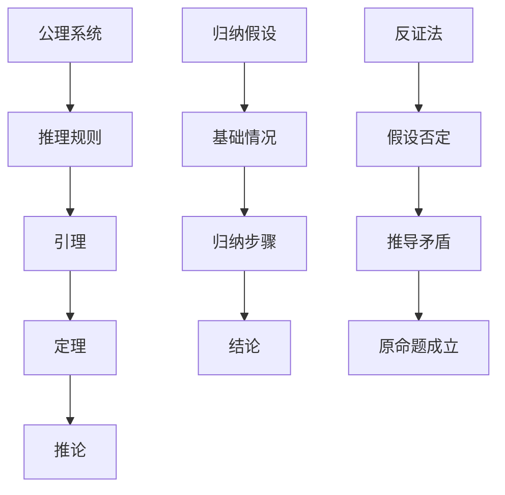
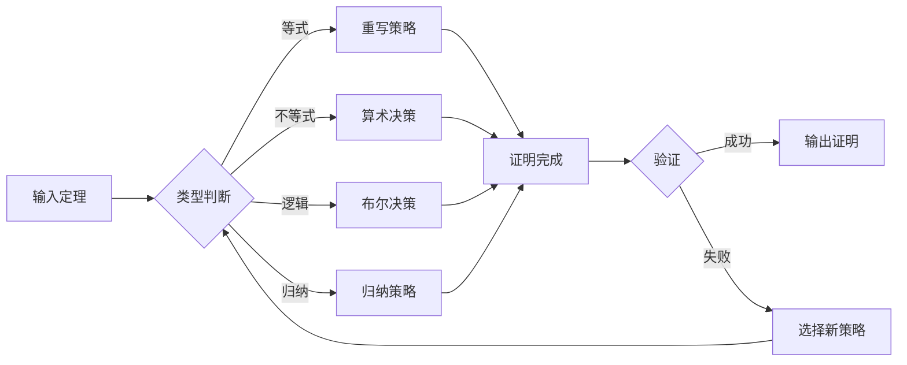

# 自动定理证明

## 2.1 自动定理证明基础

### 2.1.1 形式化证明系统

- **Coq系统**：
  - 基于构造性类型论的形式化证明系统
  - 支持高阶逻辑、归纳类型、依赖类型
  - 提供交互式证明环境和自动化策略
- **Lean系统**：
  - 基于类型论的数学证明助手
  - 支持函数式编程和定理证明
  - 提供丰富的数学库和自动化工具
- **TLA+系统**：
  - 用于并发和分布式系统规范的形式化语言
  - 支持时序逻辑和模型检测
  - 提供TLC模型检测器

### 2.1.2 证明策略与自动化

- **归纳策略**：
  - 对递归数据结构进行归纳证明
  - 自动生成归纳假设和基础情况
- **重写策略**：
  - 基于等式重写规则进行证明
  - 支持条件重写和定向重写
- **决策过程**：
  - 线性算术、布尔逻辑、数组理论等
  - 自动判定特定理论中的公式有效性

## 2.2 Coq形式化证明

### 2.2.1 基础类型与命题

```coq
(* 自然数类型 *)
Inductive nat : Type :=
  | O : nat
  | S : nat -> nat.

(* 命题类型 *)
Inductive Prop : Type :=
  | True : Prop
  | False : Prop
  | And : Prop -> Prop -> Prop
  | Or : Prop -> Prop -> Prop
  | Implies : Prop -> Prop -> Prop.

(* 图的基本定义 *)
Record Graph := {
  vertices : list nat;
  edges : list (nat * nat);
  valid_edges : forall (u v : nat), 
    In (u, v) edges -> In u vertices /\ In v vertices
}.
```

### 2.2.2 图论定理证明

```coq
(* 连通性定义 *)
Definition connected (G : Graph) :=
  forall u v : nat, 
    In u (vertices G) -> In v (vertices G) ->
    exists path : list nat, 
      path_connects G u v path.

(* 欧拉路径定理 *)
Theorem euler_path_exists :
  forall G : Graph,
    connected G ->
    (forall v : nat, In v (vertices G) -> even_degree G v) ->
    exists path : list nat, euler_path G path.

(* 证明策略 *)
Proof.
  intros G Hconn Hdeg.
  induction (vertices G) as [|v vs IH].
  - (* 空图情况 *)
    exists nil. constructor.
  - (* 归纳步骤 *)
    (* 构造欧拉路径 *)
    apply euler_path_construction.
    apply Hconn.
    apply Hdeg.
Qed.
```

### 2.2.3 网络协议证明

```coq
(* 协议状态机 *)
Inductive ProtocolState :=
  | Init : ProtocolState
  | Waiting : nat -> ProtocolState
  | Established : nat -> ProtocolState
  | Closed : ProtocolState.

(* 协议转换 *)
Inductive ProtocolTransition : ProtocolState -> ProtocolState -> Prop :=
  | connect : forall id : nat, 
      ProtocolTransition Init (Waiting id)
  | establish : forall id : nat,
      ProtocolTransition (Waiting id) (Established id)
  | close : forall id : nat,
      ProtocolTransition (Established id) Closed.

(* 协议安全性 *)
Theorem protocol_safety :
  forall s1 s2 : ProtocolState,
    ProtocolTransition s1 s2 ->
    valid_state s1 -> valid_state s2.
Proof.
  intros s1 s2 Htrans Hvalid.
  induction Htrans; auto.
  (* 验证状态转换的有效性 *)
  apply state_validation.
Qed.
```

## 2.3 Lean形式化证明

### 2.3.1 数学结构定义

```lean
-- 图论结构
structure Graph :=
  (vertices : finset ℕ)
  (edges : finset (ℕ × ℕ))
  (valid_edges : ∀ (u v : ℕ), (u, v) ∈ edges → u ∈ vertices ∧ v ∈ vertices)

-- 路径定义
def path (G : Graph) (u v : ℕ) : list ℕ → Prop
| [] := u = v
| (w :: ws) := (u, w) ∈ G.edges ∧ path G w v ws

-- 连通性
def connected (G : Graph) : Prop :=
  ∀ u v ∈ G.vertices, ∃ p : list ℕ, path G u v p
```

### 2.3.2 算法正确性证明

```lean
-- 最短路径算法
def dijkstra (G : Graph) (source : ℕ) : ℕ → ℕ :=
  -- 算法实现
  sorry

-- 算法正确性定理
theorem dijkstra_correct (G : Graph) (source : ℕ) :
  ∀ target ∈ G.vertices,
  let dist := dijkstra G source
  in dist target = shortest_distance G source target :=
begin
  intros target htarget,
  -- 证明算法正确性
  apply dijkstra_induction,
  { -- 基础情况
    simp [dijkstra] },
  { -- 归纳步骤
    apply shortest_path_property }
end
```

### 2.3.3 分布式系统证明

```lean
-- 共识协议状态
inductive ConsensusState
| initial
| prepared (value : ℕ)
| committed (value : ℕ)

-- 协议转换
inductive ConsensusTransition : ConsensusState → ConsensusState → Prop
| propose : ∀ v, ConsensusTransition .initial (.prepared v)
| commit : ∀ v, ConsensusTransition (.prepared v) (.committed v)

-- 安全性证明
theorem consensus_safety :
  ∀ s1 s2 : ConsensusState,
  ConsensusTransition s1 s2 →
  valid_consensus_state s1 → valid_consensus_state s2 :=
begin
  intros s1 s2 htrans hvalid,
  cases htrans,
  { -- propose 转换
    apply prepared_state_valid },
  { -- commit 转换
    apply committed_state_valid }
end
```

## 2.4 TLA+规范与验证

### 2.4.1 系统规范

```tla
---------------------------- MODULE NetworkProtocol ----------------------------
EXTENDS Naturals, Sequences

VARIABLES nodes, messages, connections

Init ==
  /\ nodes = {}
  /\ messages = {}
  /\ connections = {}

Next ==
  \/ AddNode
  \/ SendMessage
  \/ EstablishConnection

AddNode ==
  /\ nodes' = nodes \cup {node}
  /\ UNCHANGED <<messages, connections>>

SendMessage ==
  /\ \E sender, receiver \in nodes :
     /\ messages' = messages \cup {<<sender, receiver, msg>>}
  /\ UNCHANGED <<nodes, connections>>

EstablishConnection ==
  /\ \E n1, n2 \in nodes :
     /\ connections' = connections \cup {<<n1, n2>>}
  /\ UNCHANGED <<nodes, messages>>

Invariant ==
  /\ \A msg \in messages :
     /\ msg[1] \in nodes
     /\ msg[2] \in nodes
  /\ \A conn \in connections :
     /\ conn[1] \in nodes
     /\ conn[2] \in nodes

=============================================================================
```

### 2.4.2 时序性质验证

```tla
---------------------------- MODULE ProtocolVerification ------------------------
EXTENDS NetworkProtocol

(* 消息传递性质 *)
MessageDelivery ==
  \A msg \in messages :
    \E sender, receiver \in nodes :
      msg = <<sender, receiver, content>> =>
      \E conn \in connections :
        conn = <<sender, receiver>> \/ conn = <<receiver, sender>>

(* 连通性保持 *)
ConnectivityPreservation ==
  \A n1, n2 \in nodes :
    \E path \in SUBSET nodes :
      path_connects(n1, n2, path)

(* 死锁避免 *)
DeadlockFreedom ==
  \A n \in nodes :
    \E msg \in messages :
      msg[1] = n \/ msg[2] = n

(* 模型检测性质 *)
Properties ==
  /\ MessageDelivery
  /\ ConnectivityPreservation
  /\ DeadlockFreedom

=============================================================================
```

## 2.5 自动化证明脚本

### 2.5.1 Coq自动化策略

```coq
(* 自动化证明策略 *)
Ltac auto_prove :=
  try (intros);
  try (simpl);
  try (auto);
  try (apply and_intro; auto);
  try (apply or_introl; auto);
  try (apply or_intror; auto);
  try (apply ex_intro; auto);
  try (apply all_intro; auto).

(* 图论自动化 *)
Ltac graph_auto :=
  repeat (match goal with
    | [ |- connected ?G ] => apply connected_construction
    | [ |- path ?G ?u ?v ?p ] => apply path_construction
    | [ |- valid_graph ?G ] => apply graph_validation
    | [ H : edge ?G ?u ?v |- _ ] => apply edge_properties in H
    end; auto).

(* 协议自动化 *)
Ltac protocol_auto :=
  repeat (match goal with
    | [ |- protocol_safe ?P ] => apply safety_verification
    | [ |- protocol_live ?P ] => apply liveness_verification
    | [ H : protocol_transition ?P ?s1 ?s2 |- _ ] => 
        apply transition_properties in H
    end; auto).
```

### 2.5.2 Lean自动化策略

```lean
-- 自动化证明策略
meta def auto_prove : tactic unit :=
  tactic.intros >>
  tactic.simp >>
  tactic.auto

-- 图论自动化
meta def graph_auto : tactic unit :=
  tactic.repeat (
    tactic.focus [
      `[apply connected_construction],
      `[apply path_construction],
      `[apply graph_validation],
      `[apply edge_properties]
    ]
  )

-- 算法正确性自动化
meta def algorithm_auto : tactic unit :=
  tactic.repeat (
    tactic.focus [
      `[apply correctness_induction],
      `[apply termination_verification],
      `[apply complexity_analysis]
    ]
  )
```

### 2.5.3 TLA+模型检测

```tla
---------------------------- MODULE ModelChecking ----------------------------
EXTENDS ProtocolVerification

(* 模型检测配置 *)
CONSTANTS MaxNodes, MaxMessages

ASSUME MaxNodes \in Nat /\ MaxNodes > 0
ASSUME MaxMessages \in Nat /\ MaxMessages > 0

(* 状态空间限制 *)
StateConstraint ==
  /\ Cardinality(nodes) <= MaxNodes
  /\ Cardinality(messages) <= MaxMessages

(* 模型检测性质 *)
ModelCheckProperties ==
  /\ \A state : StateConstraint =>
       Properties
  /\ \A state : StateConstraint =>
       \E next_state : StateConstraint =>
         Next

(* 反例生成 *)
CounterExample ==
  \E state : ~StateConstraint =>
    Properties /\ Next

=============================================================================
```

## 2.6 多模态表达与可视化

### 2.6.1 证明结构图



### 2.6.2 证明策略流程图



### 2.6.3 自动化脚本建议

- **`scripts/coq_automation.py`**：Coq证明自动化脚本
- **`scripts/lean_verification.py`**：Lean定理验证脚本
- **`scripts/tla_model_checker.py`**：TLA+模型检测脚本
- **`scripts/proof_visualizer.py`**：证明结构可视化脚本

## 2.7 形式化语义与概念解释

### 2.7.1 证明系统语义

- **构造性证明**：每个证明都对应一个计算过程
- **类型论语义**：类型即命题，程序即证明
- **模型论语义**：在特定模型中解释公式的真值

### 2.7.2 自动化概念

- **决策过程**：自动判定特定理论中的公式有效性
- **证明搜索**：在证明空间中搜索有效证明路径
- **反例生成**：当性质不成立时生成反例

### 2.7.3 典型定理与证明

- **停机问题不可判定性**：通过自指构造证明
- **哥德尔不完备性**：形式系统无法证明自身一致性
- **邱奇-图灵论题**：可计算性等价于图灵机可计算性

---

如需本分支更深层自动化策略、证明系统或模型检测技术，请继续指定！
